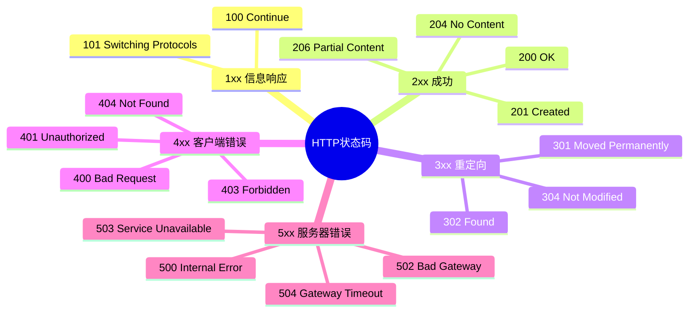
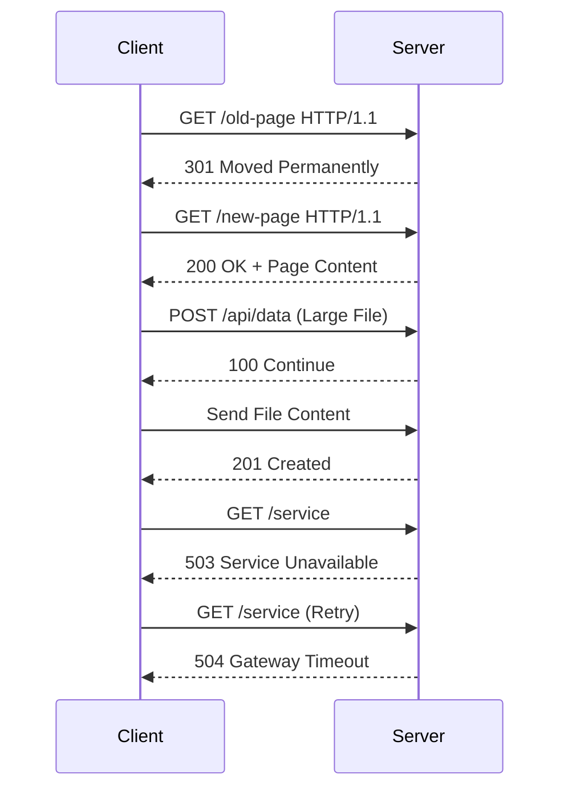

## HTTP状态码详解

### 一、分类总表

| 类别 | 范围    | 核心特征             | 常见状态码示例                       |
| ---- | ------- | -------------------- | ------------------------------------ |
| 1xx  | 100-199 | 临时响应，需继续处理 | 100（继续）、101（切换协议）         |
| 2xx  | 200-299 | 请求成功完成         | 200（成功）、201（已创建）           |
| 3xx  | 300-399 | 重定向操作           | 301（永久重定向）、302（临时重定向） |
| 4xx  | 400-499 | 客户端错误           | 400（错误请求）、404（未找到）       |
| 5xx  | 500-599 | 服务器错误           | 500（内部错误）、503（服务不可用）   |

---

### 二、思维导图



---

### 三、关键状态码时序图



---

### 四、详细说明文本

#### 1. 2xx 成功系列

- **200 OK**  
  最常用的成功状态码，响应体包含请求结果  
  *示例：API 返回用户数据 `{ "id": 123, "name": "John" }`*

- **201 Created**  
  资源创建成功，需包含Location头部  
  *场景：用户注册成功后返回 `Location: /users/123`*

- **206 Partial Content**  
  分块传输/断点续传时使用  
  *案例：视频播放器请求 `Range: bytes=0-1023` 返回部分内容*

#### 2. 3xx 重定向系列

- **301 vs 302**  

  | 特性       | 301      | 302          |
  | ---------- | -------- | ------------ |
  | 浏览器缓存 | 永久缓存 | 不缓存       |
  | SEO影响    | 权重转移 | 不转移权重   |
  | 典型场景   | 域名更换 | 临时维护跳转 |

- **304 Not Modified**  
  协商缓存生效时返回，响应体为空  
  *工作流程：*

  1. 客户端发送带 `If-Modified-Since` 的请求
  2. 服务器比对资源修改时间
  3. 未修改时返回304，客户端使用本地缓存

#### 3. 4xx 客户端错误

- **400 Bad Request**  
  请求语法错误时返回  
  *常见情况：*  
  ✓ JSON 格式错误  
  ✓ 缺少必需参数  
  ✓ 参数类型不匹配

- **401 vs 403**  

  | 状态码 | 含义               | 响应头要求         |
  | ------ | ------------------ | ------------------ |
  | 401    | 未认证（需要登录） | `WWW-Authenticate` |
  | 403    | 无权限（禁止访问） | 无特殊要求         |

#### 4. 5xx 服务器错误

- **503 vs 504**  

  | 错误类型                | 产生位置       | 典型原因                         |
  | ----------------------- | -------------- | -------------------------------- |
  | 503 Service Unavailable | 应用服务器     | ✓ 服务过载<br>✓ 主动停机维护     |
  | 504 Gateway Timeout     | 反向代理/Nginx | ✓ 后端服务响应超时<br>✓ 网络中断 |

---

### 五、最佳实践原则

#### 1. 状态码使用规范

```text
✅ 正确案例：
GET /users/999 → 404 Not Found
POST /products → 201 Created
PUT /resources → 200 OK

❌ 错误案例：
删除成功返回 200（应使用204）
验证失败返回 200（应使用401/403）
```

#### 2. 扩展状态码

| 状态码 | 用途                                            |
| ------ | ----------------------------------------------- |
| 418    | 彩蛋状态码（I'm a teapot）                      |
| 429    | 请求过于频繁（Rate Limit）                      |
| 451    | 法律原因不可用（Unavailable For Legal Reasons） |

---

### 六、调试工具推荐

```markdown
1. cURL 命令测试
   curl -i https://api.example.com/users  # 查看完整响应头
   curl -X POST -d '{"name":"test"}' -H "Content-Type: application/json" http://localhost:3000
```

2. **浏览器DevTools**

   - Network面板查看状态码
   - 过滤特定状态码（如`status-code:404`）

3. **Postman**

   - 自动解析状态码
   - 预置状态码测试脚本

   ```javascript
   pm.test("Status code is 200", function () {
       pm.response.to.have.status(200);
   });
   ```

```
、
```