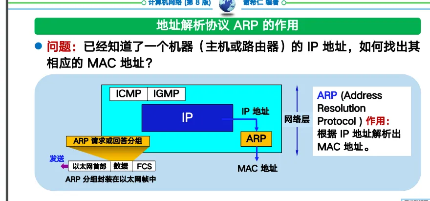
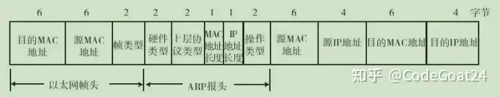
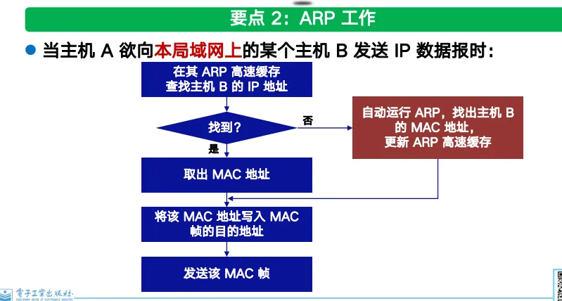
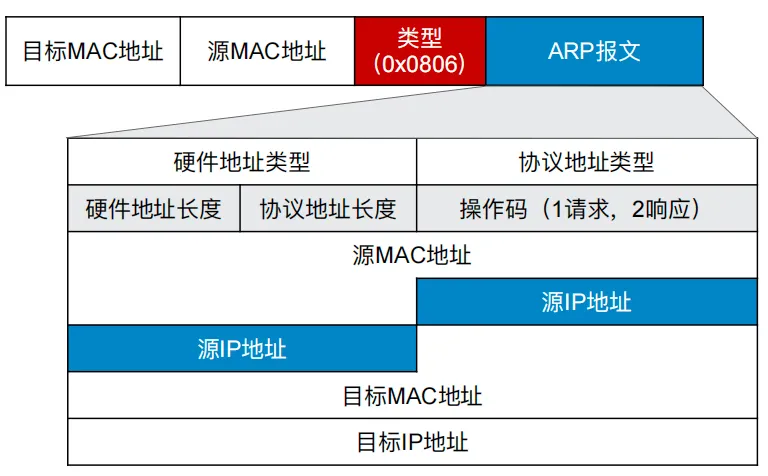
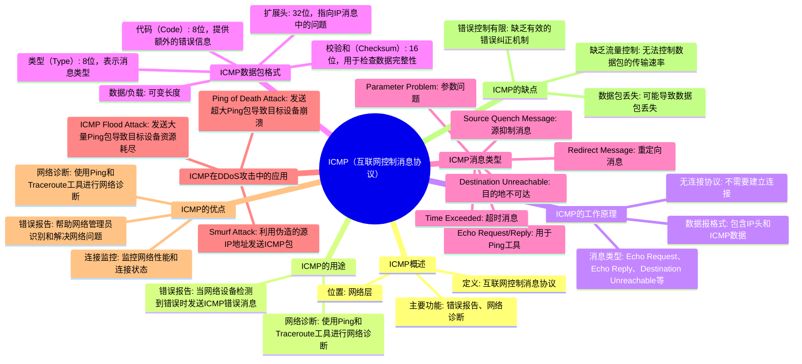
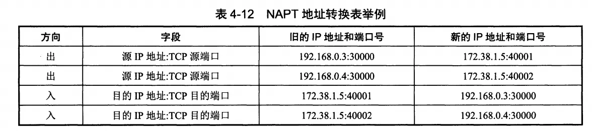
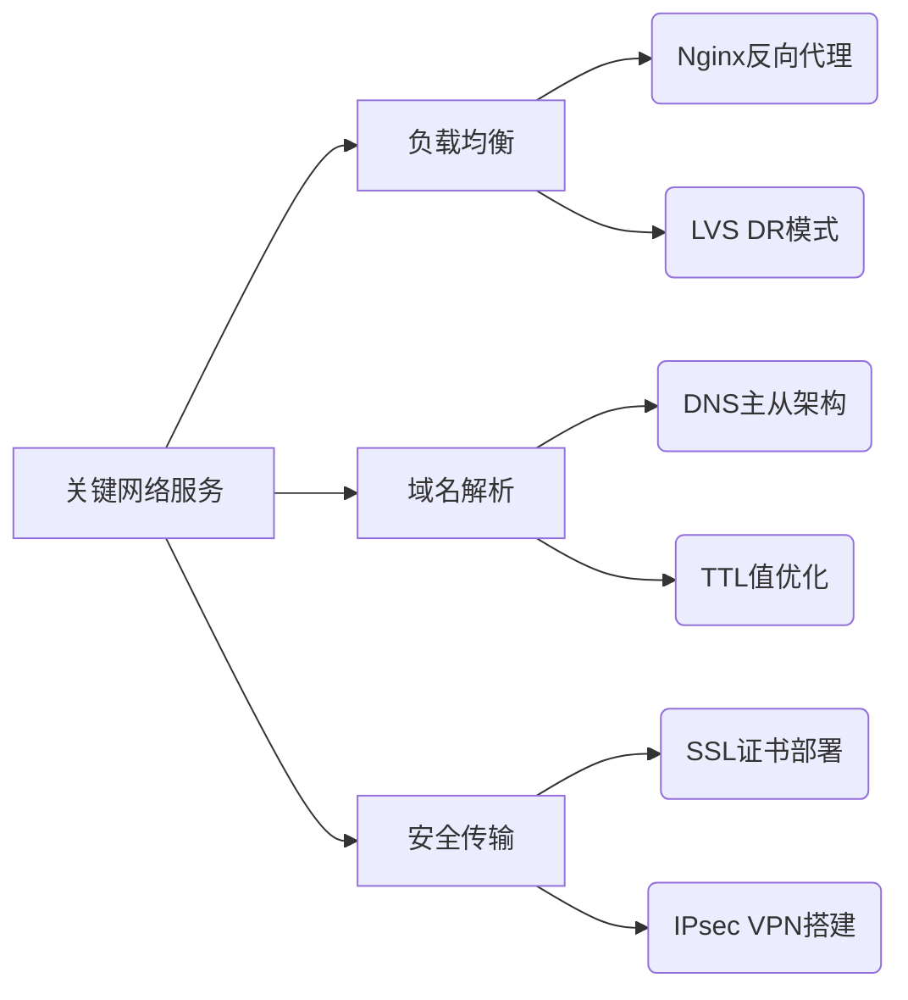

## OSI七层模型

### 物理层：网线/光纤标准

### 数据链路层：MAC地址、VLAN

### 网络层：IP协议、ICMP

### 传输层：TCP三次握手、UDP特性

### 会话层：SSH/TLS连接管理

### 应用层：HTTP/DNS协议

## TCP/IP 模型

#### TCP三次握手

#### TCP四次挥手

###  ARP地址解析

# 地址解析协议 ARP

ARP（Address Resolution Protocol，地址解析协议）是将**IP地址解析为以太网MAC地址**（或称物理地址）的协议（**ARP 是“地址解析协议”的缩写，用于将 IP 地址映射为 MAC 地址。当设备在局域网中通信时，ARP 协议帮助发送方找到接收方的 MAC 地址，从而确保数据能够正确传输**。）

### 为什么需要ARP协议

在**局域网**中，当主机或其他网络设备有数据要发送给另一个主机或设备时，它必须知道对方的**网络层地址**（即IP地址）。但是仅仅有IP地址是不够的，因为IP数据报文必须**封装成帧**才能通过**物理网络**发送，因此发送站还必须有接收站的**物理地址**，所以需要一个从**IP地址到物理地址**的**映射**

ARP协议不能穿透路由器：

ARP ⽤于解决同⼀个局域⽹上的 IP 地址和MAC地址的映射问题；

ARP缓存表的每一行都有一个生存时间，过了生存时间会自动删除。

ARP的作用

- **IP 地址与 MAC 地址的映射**：ARP 通过 IP 地址查找对应的 MAC 地址。
- **局域网通信**：ARP 主要用于局域网（LAN）或以太网中设备之间的通信。
- **网络层协议**：ARP 是 TCP/IP 协议族中的重要协议，尽管它工作在数据链路层

ARP 协议有四种主要类型：

1. **代理 ARP（Proxy ARP）**：
    - 代理 ARP 允许网络中的设备响应其他网络的 ARP 请求。
    - 代理服务器使用自己的 MAC 地址响应 ARP 请求，隐藏目标设备的真实 MAC 地址。
2. **免费 ARP（Gratuitous ARP）**：
    - 设备主动发送 ARP 请求，用于检测 IP 地址冲突或更新其他设备的 ARP 缓存。
    - 常用于设备启动时或 IP 地址更改时。
3. **反向 ARP（Reverse ARP，RARP）**：
    - 反向 ARP 用于通过 MAC 地址查找 IP 地址。
    - 常用于无盘工作站启动时获取 IP 地址。
4. **逆向 ARP（Inverse ARP，InARP）**：
    - 逆向 ARP 用于通过 MAC 地址查找 IP 地址，主要用于 ATM 网络。
    

---

### **ARP报文格式**

ARP是一个**独立的三层协议**，所以ARP报文在向数据链路层传输时**不需要经过IP协议的封装**，而是**直接生成**自己的报文，然后再到数据链路层**封装成帧**

| **字段** | **长度（字节）** | **说明** |
| --- | --- | --- |
| 硬件类型（Hardware Type） | 2 | 指定硬件类型，如以太网（值为 1）。 |
| 协议类型（Protocol Type） | 2 | 指定协议类型，如 IPv4（值为 2048）。 |
| 硬件地址长度（Hardware Address Length） | 1 | 硬件地址的长度，以太网为 6 字节。 |
| 协议地址长度（Protocol Address Length） | 1 | 协议地址的长度，IPv4 为 4 字节。 |
| 操作码（Operation Code） | 2 | 指定报文类型，1 表示 ARP 请求，2 表示 ARP 响应。 |
| 发送方硬件地址（Sender Hardware Address） | 6 | 发送方的 MAC 地址。 |
| 发送方协议地址（Sender Protocol Address） | 4 | 发送方的 IP 地址。 |
| 目标硬件地址（Target Hardware Address） | 6 | 目标设备的 MAC 地址（ARP 请求中为空）。 |
| 目标协议地址（Target Protocol Address） | 4 | 目标设备的 IP 地址。 |

网络层实现主机之间的通信，而链路层实现具体每段链路之间的通信。因此在通信过程中，IP 数据报的源地址和目的地址始终不变，而 MAC 地址随着链路的改变而改变。

ARP 实现由 IP 地址得到 MAC 地址。

如下图所示：

1、一个MAC地址只能够在一个局域网内工作，属于局域网A的MAC地址在局域网B内是无法被识别的（因为局域网B的广播无法到达局域网A的MAC地址）；

2、因此**MAC帧要在不同局域网之间传输，MAC帧首部的源MAC地址和目标MAC地址会发生改变**。

3、上图中2个路由器R1和R2连接，R1因为同时连接到2个局域网因 @此他有两个MAC地址。

| **概念** | **作用** |
| --- | --- |
| **MAC地址** | 用于数据链路层，标识设备的物理地址。 |
| **ARP协议** | 将IP地址解析为MAC地址，实现局域网内的设备通信。 |
| **ARP缓存** | 存储IP地址和MAC地址的映射关系，减少ARP请求的频率。 |
| **ARP请求** | 广播询问目标IP地址的MAC地址。 |
| **ARP响应** | 单播回复自己的MAC地址。 |

### ARP工作原理和流程：

0、**每个主机或路由器都保存着一个路由表和一个ARP缓存表**。路由表记录着目标IP地址的下一跳IP地址。ARP缓存表保存同一局域网内的IP地址和它们对应的MAC地址。

1、H1从自己的路由表找到下一跳的IP为R1路由器，H1在 自己的 ARP 缓存表中查看有⽆ R1 的 IP/MAC 地址映射：

2、如有，就可查出其对应的MAC地址，再将其写⼊ MAC 帧头部，然后通过局域⽹将该 MAC 帧发往R1；

3、如没有，H1的 ARP 进程在局域⽹内⼴播发送⼀个 ARP 请求分组。H1会收到R1的 ARP 响应分组，将得到的 R1的IP/MAC 地址映射写⼊自己的ARP ⾼速缓存。知道了R1的MAC地址后，H1就可以封装传输通信数据的MAC帧给R1，由R1发往下一个网络。

ARP请求报文如下：

---

---

ARP请求报文和响应报文也是封装在MAC帧中传输的。

ARP请求报文的目标MAC地址是ff:ff:ff:ff:ff:ff（全部为1表示广播地址），源MAC地址是H1的MAC地址。

ARP请求广播后，只有R1才会接受到，其他设备会丢弃，因为ARP头部已经写明目标IP是R1。之后R1会回复一个ARP响应报文。

ARP响应报文的目标MAC地址是H1的MAC地址，而源MAC地址则是R1的地址。ARP请求报文会广播，而ARP响应报文会直接一对一单播给R1。

ARP缓存表可以减少 ARP ⼴ 播的数量。
### ICMP协议

### IP子网划分

### NAT原理与实践
## 1. NAT 概述

### 1.1 定义

网络地址转换（NAT）是一种将私有网络中的IP地址转换为公共IP地址的技术，允许多个设备通过单个公共IP地址访问互联网。NAT通常运行在路由器或防火墙上。

### 1.2 主要功能

- **地址转换**：将私有IP地址转换为公共IP地址，反之亦然。
- **端口转换**：在数据包中替换端口号，以便区分不同设备的流量。
- **NAT表**：记录IP地址和端口号的映射关系。

## 2. NAT 的工作原理

专用网内部的主机使用本地 IP 地址又想和互联网上的主机通信时，可以使用 NAT 来将本地 IP 转换为全球 IP。

在以前，NAT 将本地 IP 和全球 IP 一一对应，这种方式下拥有 n 个全球 IP 地址的专用网内最多只可以同时有 n 台主机接入互联网。为了更有效地利用全球 IP 地址，现在常用的 NAT 转换表把传输层的端口号也用上了，使得多个专用网内部的主机共用一个全球 IP 地址。使用端口号的 NAT 也叫做网络地址与端口转换 NAPT。

网络地址转换 (NAT) 是一个将一个或多个本地 IP 地址转换为一个或多个全局 IP 地址的过程，反之亦然，以便本地主机能够访问互联网。NAT 还会转换端口号，即在路由到目标的数据包中，用另一个端口号掩盖主机的端口号。然后，NAT 会在 NAT 表中创建相应的 IP 地址和端口号条目。NAT 通常运行在路由器或防火墙上 。

### 路由协议：OSPF/BGP

## 运维需要掌握的 网络服务

