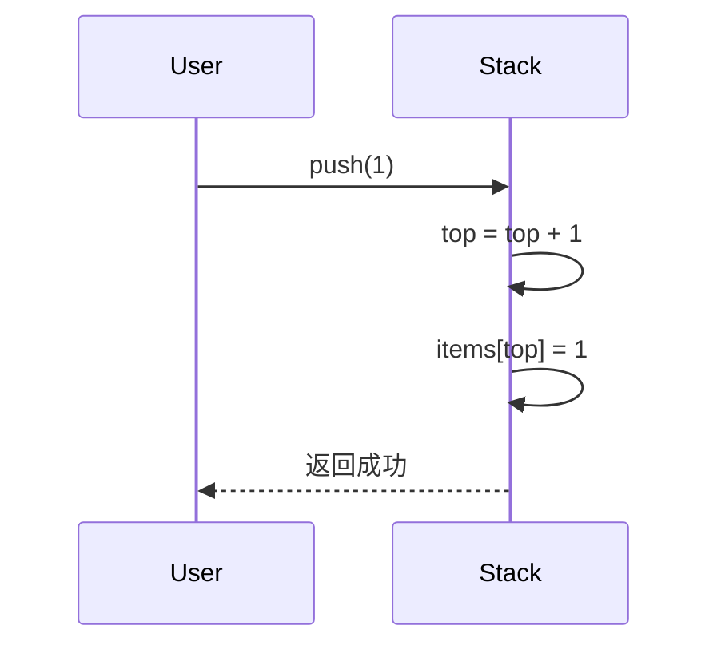
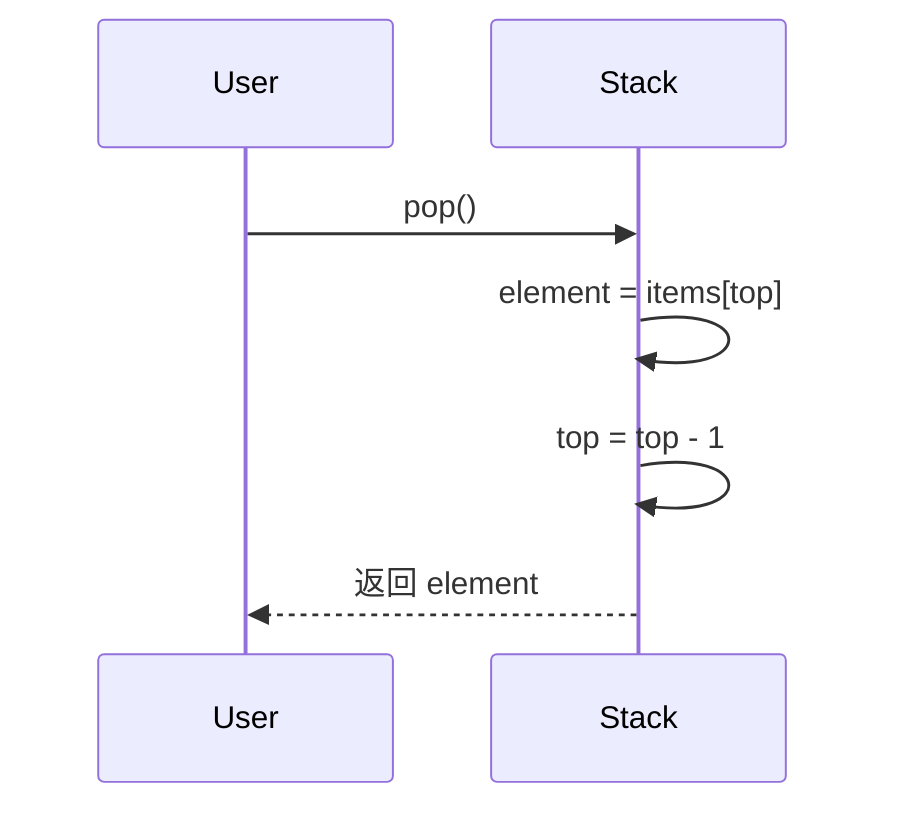
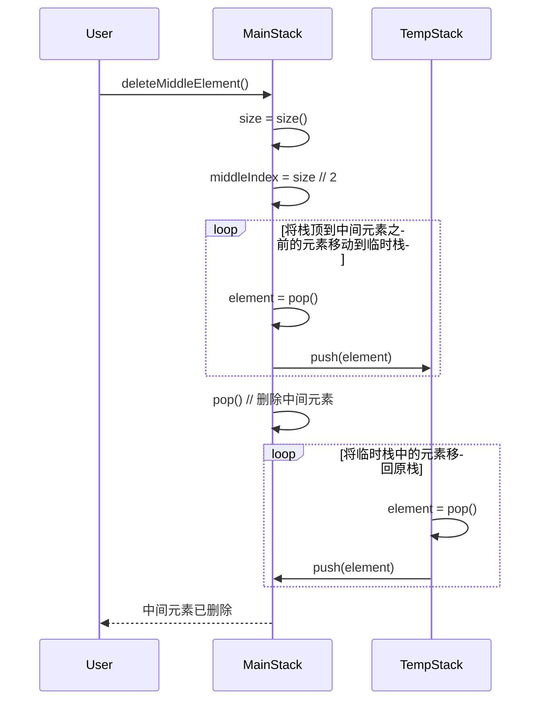
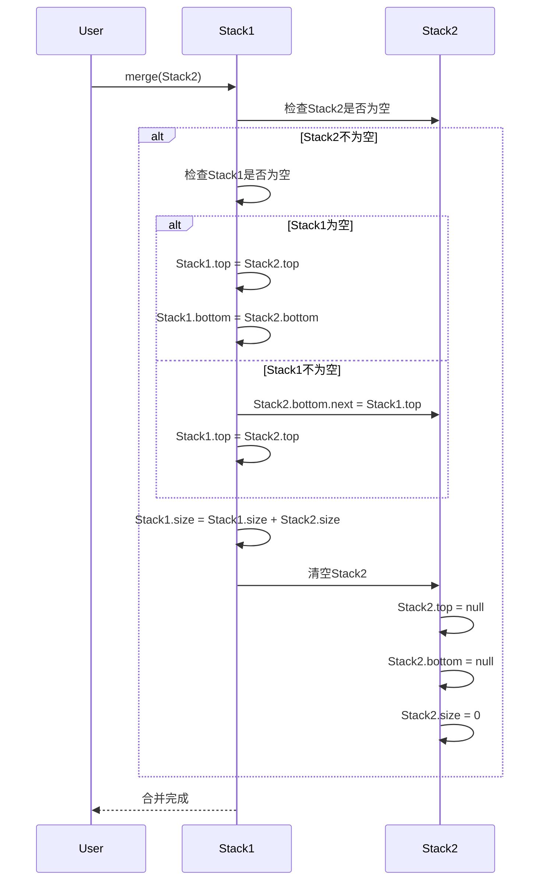
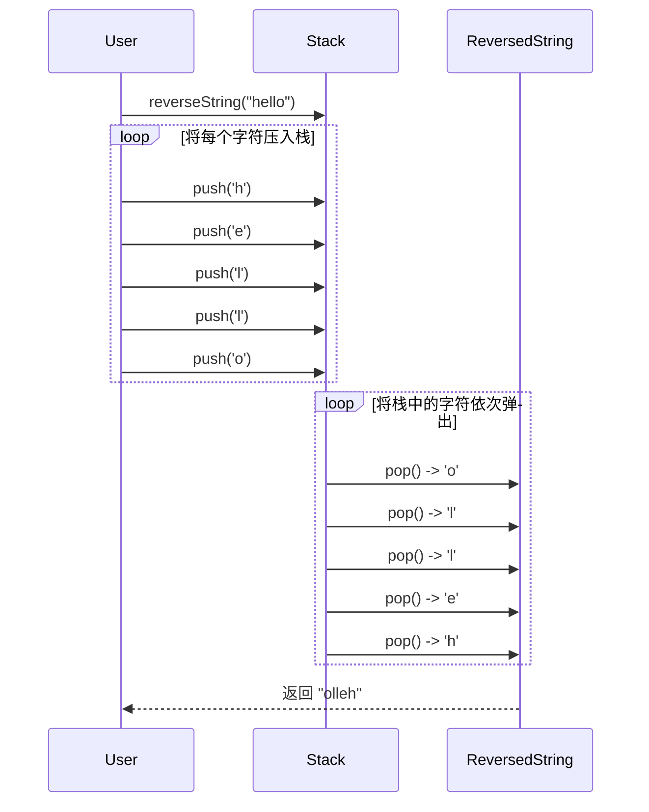
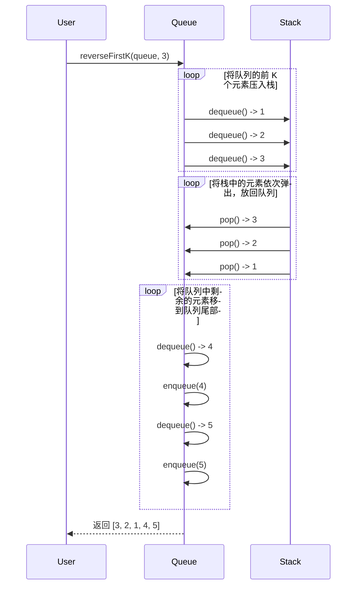
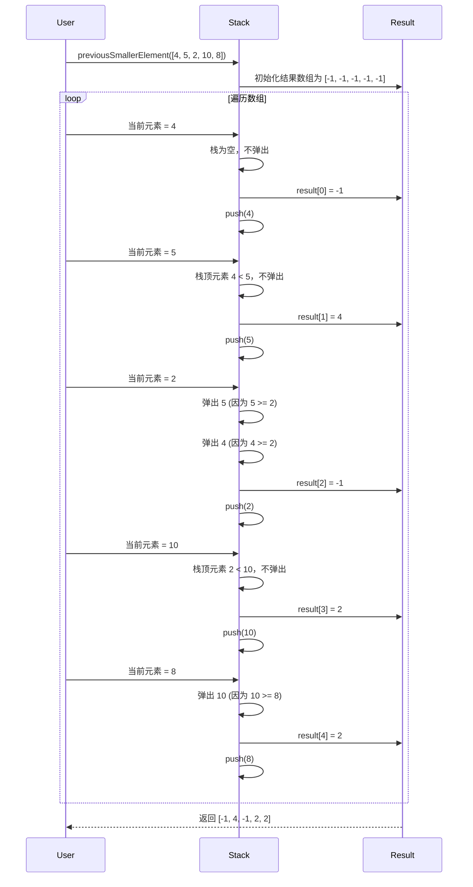
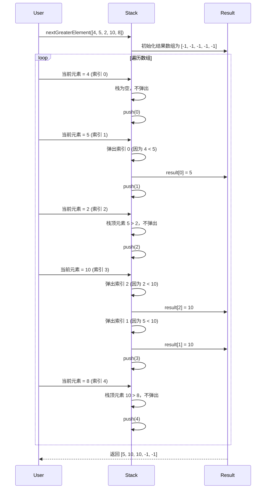
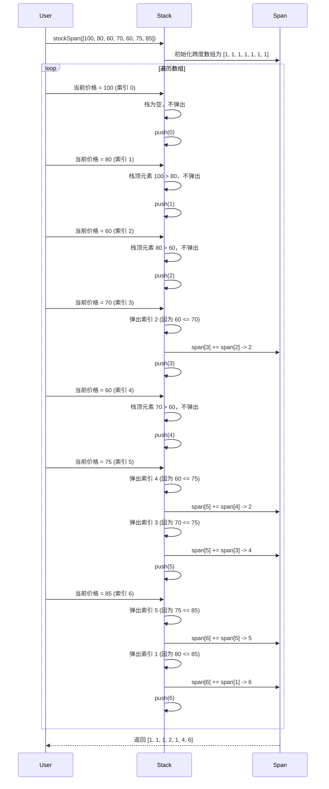
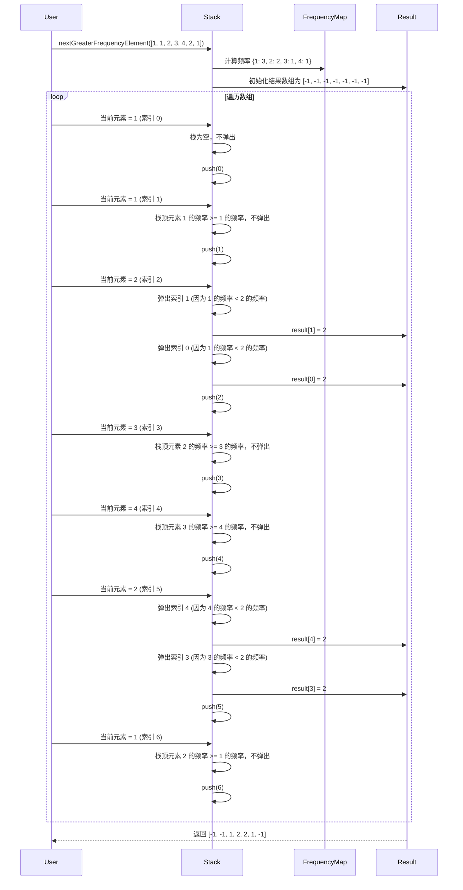

# 📝 主旨内容

## JavaScript 中的栈 (Stack) 数据结构

堆栈是一种**线性**数据结构，遵循特定的操作执行顺序。顺序可以是**LIFO（后进先出）**或**FILO（先进后出）** 。 **LIFO**意味着最后插入的元素最先出现，而**FILO**意味着最先插入的元素最后出现。

它的行为就像一堆盘子，最后添加的盘子是第一个被删除的盘子。**可以这样想：**

- 将一个元素推入堆栈就像在顶部添加一个新盘子。
- 弹出一个元素将从堆栈中删除顶板。


堆栈遵循 LIFO（后进先出）原则，因此最后入栈的元素将首先弹出。


# Types of Stack: 堆栈类型：

- **固定大小堆栈**：顾名思义，固定大小堆栈具有固定的大小，不能动态增长或收缩。如果堆栈已满并且尝试向其中添加元素，则会发生溢出错误。如果堆栈为空并且尝试从中删除元素，则会发生下溢错误。
- **动态大小堆栈**：动态大小堆栈可以动态增长或收缩。当堆栈已满时，它会自动增加其大小以容纳新元素，而当堆栈为空时，它会减少其大小。这种类型的堆栈是使用链表实现的，因为它允许轻松调整堆栈的大小。

Basic Operations on Stack:栈的基本操作：()

In order to make manipulations in a stack, there are certain operations provided to us.为了在堆栈中进行操作，向我们提供了某些操作。

- **push()**将一个元素插入栈中
- **pop()** to remove an element from the stack
    
    **pop()**从堆栈中删除一个元素
    
- **top()** Returns the top element of the stack.返回栈顶元素。
- **isEmpty()** returns true if stack is empty else false.如果堆栈为空， **isEmpty()**返回 true，否则返回 false。
- **isFull()** returns true if the stack is full else false.

数组栈

```jsx
class Stack {
  constructor() {
    this.items = [];
    this.size = 0;
  }

  /**
   * 将元素压入栈顶
   * @param {*} element - 需要压入栈的元素
   */
  push(element) {
    // 将元素添加到栈顶
    this.items.push(element);
    // 栈的大小加1
    this.size++;
  }

  /**
   * 移除并返回栈顶元素
   * @returns {*} - 栈顶元素
   * @throws {Error} 如果栈为空，则抛出错误
   */
  pop() {
    // 如果栈为空
    if (this.isEmpty()) {
      // 抛出错误
      throw new Error('Stack is empty');
    }
    // 栈的大小减1
    this.size--;
    // 返回并移除栈顶元素
    return this.items.pop();
  }

  /**
   * 返回栈顶元素，但不移除它
   * @returns {*} - 栈顶元素
   * @throws {Error} 如果栈为空，则抛出错误
   */
  peek() {
    // 如果栈为空
    if (this.isEmpty()) {
      // 抛出错误
      throw new Error('Stack is empty');
    }
    // 返回栈顶元素
    return this.items[this.items.length - 1];
  }

  /**
   * 检查栈是否为空
   * @returns {boolean} - 如果栈为空，返回true；否则返回false
   */
  isEmpty() {
    // 如果栈的大小为0，返回true
    return this.size === 0;
  }

  /**
   * 获取栈的大小
   * @returns {number} - 栈的大小
   */
  getSize() {
    // 返回栈的大小
    return this.size;
  }

  // Clear the stack
  clear() {
    this.items = [];
    this.size = 0;
  }

  // Convert stack to array
  toArray() {
    return [...this.items];
  }

  // String representation
  /**
   * 将栈转换为字符串
   * @returns {string} - 栈的字符串表示，元素之间用' -> '分隔
   */
  toString() {
    // 使用join方法将栈中的元素连接成一个字符串，元素之间用' -> '分隔
    return this.items.join(' -> ');
  }

}

// Test Cases
const stack = new Stack();

// Test Push
stack.push(1);
stack.push(2);
stack.push(3);
console.log('After push:', stack.toString()); // 1 -> 2 -> 3

// Test Pop
console.log('Popped:', stack.pop()); // 3
console.log('After pop:', stack.toString()); // 1 -> 2

// Test Peek
console.log('Peek:', stack.peek()); // 2
console.log('After peek:', stack.toString()); // 1 -> 2

// Test Size
console.log('Size:', stack.getSize()); // 2

// Test isEmpty
console.log('Is empty:', stack.isEmpty()); // false

// Test Clear
stack.clear();
console.log('After clear:', stack.toString()); // ''
console.log('Is empty:', stack.isEmpty()); // true

// Test Edge Cases
try {
  stack.pop();
} catch (e) {
  console.log('Pop error:', e.message); // Stack is empty
}

try {
  stack.peek();
} catch (e) {
  console.log('Peek error:', e.message); // Stack is empty
}

// Test Complex Operations
stack.push(10);
stack.push(20);
stack.push(30);
console.log('Stack:', stack.toString()); // 10 -> 20 -> 30

const reversedStack = new Stack();
while (!stack.isEmpty()) {
  reversedStack.push(stack.pop());
}
console.log('Reversed stack:', reversedStack.toString()); // 30 -> 20 -> 10

// Test toArray
console.log('Array representation:', stack.toArray()); // []
console.log('Reversed array representation:', reversedStack.toArray()); // [30, 20, 10]

```

链表栈

```jsx

class Node {
  constructor(value) {
    this.value = value;
    this.next = null;
  }
}

class LinkedListStack {
  constructor() {
    this.top = null;
    this.length = 0;
  }

  // Add element to top of stack
  push(value) {
    const newNode = new Node(value);
    if (this.top) {
      newNode.next = this.top;
    }
    this.top = newNode;
    this.length++;
  }

  // Remove and return top element
  pop() {
    if (this.isEmpty()) {
      return "Underflow - Stack is empty";
    }
    const value = this.top.value;
    this.top = this.top.next;
    this.length--;
    return value;
  }

  // Return top element without removing
  peek() {
    if (this.isEmpty()) {
      return "Stack is empty";
    }
    return this.top.value;
  }

  // Check if stack is empty
  isEmpty() {
    return this.length === 0;
  }

  // Return number of elements in stack
  size() {
    return this.length;
  }

  // Print stack elements
  printStack() {
    let current = this.top;
    let str = "";
    while (current) {
      str += current.value + " ";
      current = current.next;
    }
    return str.trim();
  }
}

// Example usage:
const stack = new LinkedListStack();
stack.push(10);
stack.push(20);
stack.push(30);
console.log(stack.printStack()); // Output: 30 20 10
console.log(stack.peek()); // Output: 30
console.log(stack.pop()); // Output: 30
console.log(stack.printStack()); // Output: 20 10
console.log(stack.size()); // Output: 2
console.log(stack.isEmpty()); // Output: false

```

push

```jsx
function push(stack, element):
    if stack is not full:
        stack.top = stack.top + 1
        stack.items[stack.top] = element
    else:
        print("栈已满，无法执行入栈操作")

```

- **目的**：将元素添加到栈的顶部。
- **步骤**：
    1. 检查栈是否已满（如果栈有容量限制）。
    2. 如果栈未满：
        - 将栈顶指针`top`增加1，指向新的栈顶位置。
        - 将元素`element`存储到`items[top]`位置。
    3. 如果栈已满，返回错误提示（如“栈已满”）。
    



pop 

```jsx
function pop(stack):
    if stack is not empty:
        element = stack.items[stack.top]
        stack.top = stack.top - 1
        return element
    else:
        print("栈为空，无法执行出栈操作")

```

- **目的**：移除并返回栈顶的元素。
- **步骤**：
    1. 检查栈是否为空（`top`是否为`1`或栈中没有元素）。
    2. 如果栈不为空：
        - 获取栈顶元素`element = items[top]`。
        - 将栈顶指针`top`减少1，指向新的栈顶位置。
        - 返回`element`。
    3. 如果栈为空，返回错误提示（如“栈为空”）。



### 删除栈的中间元素

```swift
function deleteMiddleElement(stack):
    if stack is empty:
        print("栈为空，无法删除中间元素")
        return

    size = stack.size()
    middleIndex = size // 2  // 计算中间元素的索引
    tempStack = new Stack()  // 创建一个临时栈

    // 将栈顶到中间元素之前的元素移动到临时栈
    for i from 0 to middleIndex - 1:
        tempStack.push(stack.pop())

    // 删除中间元素
    stack.pop()

    // 将临时栈中的元素移回原栈
    while tempStack is not empty:
        stack.push(tempStack.pop())

    print("中间元素已删除")

```

1. **计算中间元素的位置**：
    - 首先获取栈的大小`size`，然后计算中间元素的索引`middleIndex = size // 2`。
2. **将栈顶到中间元素之前的元素移动到临时栈**：
    - 使用一个循环，将栈顶到中间元素之前的元素依次弹出并压入临时栈。
3. **删除中间元素**：
    - 直接调用`pop()`删除中间元素。
4. **将临时栈中的元素移回原栈**：
    - 使用另一个循环，将临时栈中的元素依次弹出并压回原栈。
5. **返回结果**：
    - 返回提示信息，表示中间元素已删除。



```jsx
// 删除栈的中间元素
function deleteMiddle(stack, count = 0) {
  // 基本情况：栈为空
  if (stack.isEmpty()) {
    return;
  }
  
  // 弹出当前元素
  const temp = stack.pop();
  
  // 递归调用
  deleteMiddle(stack, count + 1);
  
  // 如果不是中间元素，重新压入栈中
  if (count !== Math.floor(stack.items.length / 2)) {
    stack.push(temp);
  }
}
```

# 问题

## 合并2个栈

### 伪代码

```jsx
function merge(stack1, stack2):
    if stack2 is empty:
        return  // 如果stack2为空，无需合并

    if stack1 is empty:
        stack1.top = stack2.top
        stack1.bottom = stack2.bottom
    else:
        stack2.bottom.next = stack1.top
        stack1.top = stack2.top

    stack1.size = stack1.size + stack2.size

    // 清空stack2
    stack2.top = null
    stack2.bottom = null
    stack2.size = 0

```

1. **检查`stack2`是否为空**：
    - 如果`stack2`为空，直接返回，无需合并。
2. **检查`stack1`是否为空**：
    - 如果`stack1`为空，直接将`stack1`的`top`和`bottom`指向`stack2`的`top`和`bottom`。
    - 如果`stack1`不为空，将`stack2`的`bottom.next`指向`stack1`的`top`，然后将`stack1`的`top`指向`stack2`的`top`。
3. **更新`stack1`的大小**：
    - 将`stack1`的`size`增加`stack2`的`size`。
4. **清空`stack2`** ：
    - 将`stack2`的`top`、`bottom`和`size`重置为初始状态。

### 时序图



### 代码

```jsx
class Node {
  constructor(value) {
    this.value = value;
    this.next = null;
  }
}

class MergeableStack {
  constructor() {
    this.top = null;
    this.bottom = null;
    this.size = 0;
  }

  // 合并两个栈 O(1)
  merge(otherStack) {
    if (!otherStack.top) {
      return;
    }
    
    if (!this.top) {
      this.top = otherStack.top;
      this.bottom = otherStack.bottom;
    } else {
      otherStack.bottom.next = this.top;
      this.top = otherStack.top;
    }
    
    this.size += otherStack.size;
    // 清空被合并的栈
    otherStack.top = null;
    otherStack.bottom = null;
    otherStack.size = 0;
  }

// 测试用例
const stack1 = new MergeableStack();
stack1.push(1);
stack1.push(2);
stack1.push(3);

const stack2 = new MergeableStack();
stack2.push(4);
stack2.push(5);

console.log("Stack 1: " + stack1.printStack()); // 输出: 3 -> 2 -> 1
console.log("Stack 2: " + stack2.printStack()); // 输出: 5 -> 4

stack1.merge(stack2);
console.log("Merged Stack: " + stack1.printStack()); // 输出: 5 -> 4 -> 3 -> 2 -> 1
console.log("Stack 2 after merge: " + stack2.printStack()); // 输出: (空)

```

## 反转单词

```jsx
function reverseWords(str) {
  const stack = [];
  let result = '';
  
  for (let i = 0; i < str.length; i++) {
    const char = str[i];
    
    // 如果不是空格，将字符压入栈
    if (char !== ' ') {
      stack.push(char);
    }
    // 遇到空格，弹出栈中所有字符形成反转的单词
    else {
      while (stack.length > 0) {
        result += stack.pop();
      }
      result += ' '; // 添加空格
    }
  }
  
  // 处理最后一个单词
  while (stack.length > 0) {
    result += stack.pop();
  }
  
  return result;
}

// 测试用例
console.log(reverseWords("Hello World")); // 输出: olleH dlroW
console.log(reverseWords("The quick brown fox")); // 输出: ehT kciuq nworb xof
console.log(reverseWords("JavaScript is awesome")); // 输出: tpircSavaJ si emosewa
console.log(reverseWords("   Multiple   spaces   ")); // 输出:   elpitluM   secaps
```

## 栈反转字符串

好的！我热爱编程，尤其是用栈来解决实际问题。下面我将为你提供使用栈反转字符串的伪代码、Mermaid时序图和JavaScript代码。

---

### **伪代码**

```
function reverseString(inputString):
    stack = new Stack()
    reversedString = ""

    // 将字符串中的每个字符压入栈
    for each character in inputString:
        stack.push(character)

    // 将栈中的字符依次弹出，拼接到反转字符串中
    while stack is not empty:
        reversedString += stack.pop()

    return reversedString

```

---

### **Mermaid 时序图**



---

### **JavaScript 代码**

```jsx
class Stack {
    constructor() {
        this.items = [];
    }

    // 入栈操作
    push(element) {
        this.items.push(element);
    }

    // 出栈操作
    pop() {
        if (this.isEmpty()) {
            return "栈为空";
        }
        return this.items.pop();
    }

    // 检查栈是否为空
    isEmpty() {
        return this.items.length === 0;
    }
}

function reverseString(inputString) {
    const stack = new Stack();
    let reversedString = "";

    // 将字符串中的每个字符压入栈
    for (let char of inputString) {
        stack.push(char);
    }

    // 将栈中的字符依次弹出，拼接到反转字符串中
    while (!stack.isEmpty()) {
        reversedString += stack.pop();
    }

    return reversedString;
}

// 测试用例
const input = "hello";
const result = reverseString(input);
console.log("原始字符串: " + input); // 输出: hello
console.log("反转后的字符串: " + result); // 输出: olleh

```

---

## 反转队列的前 K 个元素

好的！我热爱编程，尤其是用栈和队列来解决实际问题。反转队列的前 K 个元素是一个经典问题，我们可以借助栈来实现。下面我将为你提供伪代码、Mermaid时序图和JavaScript代码。

---

### **伪代码**

```
function reverseFirstK(queue, k):
    if queue is empty or k > queue.size or k <= 0:
        return "Invalid input"

    stack = new Stack()

    // 将队列的前 K 个元素压入栈
    for i from 0 to k - 1:
        stack.push(queue.dequeue())

    // 将栈中的元素依次弹出，放回队列
    while stack is not empty:
        queue.enqueue(stack.pop())

    // 将队列中剩余的元素移到队列尾部
    for i from 0 to queue.size - k:
        queue.enqueue(queue.dequeue())

    return queue

```

---

### **Mermaid 时序图**



---

### **JavaScript 代码**

```jsx
class Queue {
    constructor() {
        this.items = [];
    }

    // 入队操作
    enqueue(element) {
        this.items.push(element);
    }

    // 出队操作
    dequeue() {
        if (this.isEmpty()) {
            return "队列为空";
        }
        return this.items.shift();
    }

    // 检查队列是否为空
    isEmpty() {
        return this.items.length === 0;
    }

    // 获取队列的大小
    size() {
        return this.items.length;
    }

    // 打印队列内容
    printQueue() {
        return this.items.join(' -> ');
    }
}

class Stack {
    constructor() {
        this.items = [];
    }

    // 入栈操作
    push(element) {
        this.items.push(element);
    }

    // 出栈操作
    pop() {
        if (this.isEmpty()) {
            return "栈为空";
        }
        return this.items.pop();
    }

    // 检查栈是否为空
    isEmpty() {
        return this.items.length === 0;
    }
}

function reverseFirstK(queue, k) {
    if (queue.isEmpty() || k > queue.size() || k <= 0) {
        return "Invalid input";
    }

    const stack = new Stack();

    // 将队列的前 K 个元素压入栈
    for (let i = 0; i < k; i++) {
        stack.push(queue.dequeue());
    }

    // 将栈中的元素依次弹出，放回队列
    while (!stack.isEmpty()) {
        queue.enqueue(stack.pop());
    }

    // 将队列中剩余的元素移到队列尾部
    for (let i = 0; i < queue.size() - k; i++) {
        queue.enqueue(queue.dequeue());
    }

    return queue;
}

// 测试用例
const queue = new Queue();
queue.enqueue(1);
queue.enqueue(2);
queue.enqueue(3);
queue.enqueue(4);
queue.enqueue(5);

console.log("原始队列: " + queue.printQueue()); // 输出: 1 -> 2 -> 3 -> 4 -> 5
reverseFirstK(queue, 3);
console.log("反转前 3 个元素后的队列: " + queue.printQueue()); // 输出: 3 -> 2 -> 1 -> 4 -> 5

```

---

### **解释**

1. **伪代码**：
    - 检查输入是否有效（队列是否为空，`k`是否合法）。
    - 将队列的前 K 个元素压入栈。
    - 将栈中的元素依次弹出，放回队列。
    - 将队列中剩余的元素移到队列尾部。
2. **Mermaid 时序图**：
    - 用户调用`reverseFirstK(queue, 3)`。
    - 将队列的前 3 个元素压入栈。
    - 将栈中的元素依次弹出，放回队列。
    - 将队列中剩余的元素移到队列尾部。
    - 返回反转后的队列。
3. **JavaScript 代码**：
    - 定义了`Queue`和`Stack`类，包含基本操作方法。
    - 使用栈反转队列的前 K 个元素的逻辑封装在`reverseFirstK`函数中。
    - 测试用例展示了如何反转队列`[1, 2, 3, 4, 5]`的前 3 个元素。

---

### **总结**

通过栈的`后进先出（LIFO）`特性，我们可以高效地反转队列的前 K 个元素。伪代码、时序图和JavaScript代码都清晰地展示了这一过程。如果你有任何问题或需要进一步的解释，请随时告诉我。我热爱编程，随时准备帮助你！

## 上一个较小的元素（Previous Smaller Element)

的！我热爱编程，尤其是用栈来解决这类问题。**上一个较小的元素（Previous Smaller Element）**问题可以通过栈高效解决。下面我将为你提供伪代码、Mermaid时序图和JavaScript代码。

---

### **问题描述**

给定一个数组，对于每个元素，找到它左边第一个比它小的元素。如果不存在，则返回 `-1`。

**示例**：

- 输入：`[4, 5, 2, 10, 8]`
- 输出：`[-1, 4, -1, 2, 2]`

---

### **伪代码**

```
function previousSmallerElement(arr):
    stack = new Stack()
    result = new Array(arr.length).fill(-1)  // 初始化结果数组为-1

    for i from 0 to arr.length - 1:
        // 弹出栈中所有大于等于当前元素的元素
        while stack is not empty and stack.top >= arr[i]:
            stack.pop()

        // 如果栈不为空，栈顶元素就是当前元素的上一个较小元素
        if stack is not empty:
            result[i] = stack.top

        // 将当前元素压入栈
        stack.push(arr[i])

    return result

```

---

### **Mermaid 时序图**



---

### **JavaScript 代码**

```jsx
function previousSmallerElement(arr) {
    const stack = []; // 使用数组模拟栈
    const result = new Array(arr.length).fill(-1); // 初始化结果数组为-1

    for (let i = 0; i < arr.length; i++) {
        // 弹出栈中所有大于等于当前元素的元素
        while (stack.length > 0 && stack[stack.length - 1] >= arr[i]) {
            stack.pop();
        }

        // 如果栈不为空，栈顶元素就是当前元素的上一个较小元素
        if (stack.length > 0) {
            result[i] = stack[stack.length - 1];
        }

        // 将当前元素压入栈
        stack.push(arr[i]);
    }

    return result;
}

// 测试用例
const arr = [4, 5, 2, 10, 8];
const result = previousSmallerElement(arr);
console.log("输入数组: " + arr); // 输出: [4, 5, 2, 10, 8]
console.log("上一个较小元素: " + result); // 输出: [-1, 4, -1, 2, 2]

```

---

### **解释**

1. **伪代码**：
    - 初始化一个栈和一个结果数组（默认值为 `1`）。
    - 遍历数组中的每个元素：
        - 弹出栈中所有大于等于当前元素的元素。
        - 如果栈不为空，栈顶元素就是当前元素的上一个较小元素。
        - 将当前元素压入栈。
    - 返回结果数组。
2. **Mermaid 时序图**：
    - 用户调用`previousSmallerElement([4, 5, 2, 10, 8])`。
    - 遍历数组中的每个元素，更新栈和结果数组。
    - 最终返回结果数组`[-1, 4, -1, 2, 2]`。
3. **JavaScript 代码**：
    - 使用数组模拟栈。
    - 遍历数组，维护栈和结果数组。
    - 测试用例展示了如何计算上一个较小元素。

---

### **总结**

通过栈的`后进先出（LIFO）`特性，我们可以高效地找到每个元素的上一个较小元素。伪代码、时序图和JavaScript代码都清晰地展示了这一过程。如果你有任何问题或需要进一步的解释，请随时告诉我。我热爱编程，随时准备帮助你！

## 下一个更大的元素

好的！我热爱编程，尤其是用栈来解决这类问题。**下一个更大的元素（Next Greater Element）**问题可以通过栈高效解决。下面我将为你提供伪代码、Mermaid时序图和JavaScript代码。

---

### **问题描述**

给定一个数组，对于每个元素，找到它右边第一个比它大的元素。如果不存在，则返回 `-1`。

**示例**：

- 输入：`[4, 5, 2, 10, 8]`
- 输出：`[5, 10, 10, -1, -1]`

---

### **伪代码**

```
function nextGreaterElement(arr):
    stack = new Stack()
    result = new Array(arr.length).fill(-1)  // 初始化结果数组为-1

    for i from 0 to arr.length - 1:
        // 弹出栈中所有小于当前元素的元素，并更新结果数组
        while stack is not empty and arr[stack.top] < arr[i]:
            result[stack.top] = arr[i]
            stack.pop()

        // 将当前元素的索引压入栈
        stack.push(i)

    return result

```

---

### **Mermaid 时序图**



---

### **JavaScript 代码**

```jsx
function nextGreaterElement(arr) {
    const stack = []; // 使用数组模拟栈
    const result = new Array(arr.length).fill(-1); // 初始化结果数组为-1

    for (let i = 0; i < arr.length; i++) {
        // 弹出栈中所有小于当前元素的元素，并更新结果数组
        while (stack.length > 0 && arr[stack[stack.length - 1]] < arr[i]) {
            result[stack[stack.length - 1]] = arr[i];
            stack.pop();
        }

        // 将当前元素的索引压入栈
        stack.push(i);
    }

    return result;
}

// 测试用例
const arr = [4, 5, 2, 10, 8];
const result = nextGreaterElement(arr);
console.log("输入数组: " + arr); // 输出: [4, 5, 2, 10, 8]
console.log("下一个更大元素: " + result); // 输出: [5, 10, 10, -1, -1]

```

---

### **解释**

1. **伪代码**：
    - 初始化一个栈和一个结果数组（默认值为 `1`）。
    - 遍历数组中的每个元素：
        - 弹出栈中所有小于当前元素的元素，并更新结果数组。
        - 将当前元素的索引压入栈。
    - 返回结果数组。
2. **Mermaid 时序图**：
    - 用户调用`nextGreaterElement([4, 5, 2, 10, 8])`。
    - 遍历数组中的每个元素，更新栈和结果数组。
    - 最终返回结果数组`[5, 10, 10, -1, -1]`。
3. **JavaScript 代码**：
    - 使用数组模拟栈。
    - 遍历数组，维护栈和结果数组。
    - 测试用例展示了如何计算下一个更大元素。

---

### **总结**

通过栈的`后进先出（LIFO）`特性，我们可以高效地找到每个元素的下一个更大元素。伪代码、时序图和JavaScript代码都清晰地展示了这一过程。如果你有任何问题或需要进一步的解释，请随时告诉我。我热爱编程，随时准备帮助你！

## 库存跨度问题（Stock Span Problem

好的！我热爱编程，尤其是用栈来解决这类问题。**库存跨度问题（Stock Span Problem）**是一个经典问题，可以通过栈高效解决。下面我将为你提供伪代码、Mermaid时序图和JavaScript代码。

---

### **问题描述**

给定一个数组，表示每天的股票价格。对于每一天，计算从当前天往前数，连续多少天的股票价格小于或等于当前天的价格。

**示例**：

- 输入：`[100, 80, 60, 70, 60, 75, 85]`
- 输出：`[1, 1, 1, 2, 1, 4, 6]`

---

### **伪代码**

```
function stockSpan(prices):
    stack = new Stack()
    span = new Array(prices.length).fill(1)  // 初始化跨度数组为1

    for i from 0 to prices.length - 1:
        // 弹出栈中所有小于等于当前价格的元素
        while stack is not empty and prices[stack.top] <= prices[i]:
            span[i] += span[stack.top]
            stack.pop()

        // 将当前索引压入栈
        stack.push(i)

    return span

```

---

### **Mermaid 时序图**



---

### **JavaScript 代码**

```jsx
function stockSpan(prices) {
    const stack = []; // 使用数组模拟栈
    const span = new Array(prices.length).fill(1); // 初始化跨度数组为1

    for (let i = 0; i < prices.length; i++) {
        // 弹出栈中所有小于等于当前价格的元素，并累加跨度
        while (stack.length > 0 && prices[stack[stack.length - 1]] <= prices[i]) {
            span[i] += span[stack[stack.length - 1]];
            stack.pop();
        }

        // 将当前索引压入栈
        stack.push(i);
    }

    return span;
}

// 测试用例
const prices = [100, 80, 60, 70, 60, 75, 85];
const result = stockSpan(prices);
console.log("股票价格: " + prices); // 输出: [100, 80, 60, 70, 60, 75, 85]
console.log("库存跨度: " + result); // 输出: [1, 1, 1, 2, 1, 4, 6]

```

---

### **解释**

1. **伪代码**：
    - 初始化一个栈和一个跨度数组（默认值为 `1`）。
    - 遍历数组中的每个价格：
        - 弹出栈中所有小于等于当前价格的元素，并累加跨度。
        - 将当前索引压入栈。
    - 返回跨度数组。
2. **Mermaid 时序图**：
    - 用户调用`stockSpan([100, 80, 60, 70, 60, 75, 85])`。
    - 遍历数组中的每个价格，更新栈和跨度数组。
    - 最终返回跨度数组`[1, 1, 1, 2, 1, 4, 6]`。
3. **JavaScript 代码**：
    - 使用数组模拟栈。
    - 遍历数组，维护栈和跨度数组。
    - 测试用例展示了如何计算库存跨度。

---

### **总结**

通过栈的`后进先出（LIFO）`特性，我们可以高效地解决库存跨度问题。伪代码、时序图和JavaScript代码都清晰地展示了这一过程。如果你有任何问题或需要进一步的解释，请随时告诉我。我热爱编程，随时准备帮助你！

## 下一个更大的频率元素（

好的！我热爱编程，尤其是用栈来解决这类问题。**下一个更大的频率元素（Next Greater Frequency Element）**问题可以通过栈高效解决。下面我将为你提供伪代码、Mermaid时序图和JavaScript代码。

---

### **问题描述**

给定一个数组，对于每个元素，找到它右边第一个频率比它大的元素。如果不存在，则返回 `-1`。

**示例**：

- 输入：`[1, 1, 2, 3, 4, 2, 1]`
- 输出：`[-1, -1, 1, 2, 2, 1, -1]`

---

### **伪代码**

```
function nextGreaterFrequencyElement(arr):
    frequencyMap = new Map()  // 用于存储每个元素的频率
    stack = new Stack()
    result = new Array(arr.length).fill(-1)  // 初始化结果数组为-1

    // 计算每个元素的频率
    for element in arr:
        if frequencyMap.has(element):
            frequencyMap.set(element, frequencyMap.get(element) + 1)
        else:
            frequencyMap.set(element, 1)

    for i from 0 to arr.length - 1:
        // 弹出栈中所有频率小于当前元素频率的元素，并更新结果数组
        while stack is not empty and frequencyMap[arr[stack.top]] < frequencyMap[arr[i]]:
            result[stack.top] = arr[i]
            stack.pop()

        // 将当前元素的索引压入栈
        stack.push(i)

    return result

```

---

### **Mermaid 时序图**



---

### **JavaScript 代码**

```jsx
function nextGreaterFrequencyElement(arr) {
    const frequencyMap = new Map(); // 用于存储每个元素的频率
    const stack = []; // 使用数组模拟栈
    const result = new Array(arr.length).fill(-1); // 初始化结果数组为-1

    // 计算每个元素的频率
    for (const element of arr) {
        if (frequencyMap.has(element)) {
            frequencyMap.set(element, frequencyMap.get(element) + 1);
        } else {
            frequencyMap.set(element, 1);
        }
    }

    for (let i = 0; i < arr.length; i++) {
        // 弹出栈中所有频率小于当前元素频率的元素，并更新结果数组
        while (stack.length > 0 && frequencyMap.get(arr[stack[stack.length - 1]]) < frequencyMap.get(arr[i])) {
            result[stack[stack.length - 1]] = arr[i];
            stack.pop();
        }

        // 将当前元素的索引压入栈
        stack.push(i);
    }

    return result;
}

// 测试用例
const arr = [1, 1, 2, 3, 4, 2, 1];
const result = nextGreaterFrequencyElement(arr);
console.log("输入数组: " + arr); // 输出: [1, 1, 2, 3, 4, 2, 1]
console.log("下一个更大频率元素: " + result); // 输出: [-1, -1, 1, 2, 2, 1, -1]

```

---

### **解释**

1. **伪代码**：
    - 初始化一个频率映射表、一个栈和一个结果数组（默认值为 `1`）。
    - 计算每个元素的频率。
    - 遍历数组中的每个元素：
        - 弹出栈中所有频率小于当前元素频率的元素，并更新结果数组。
        - 将当前元素的索引压入栈。
    - 返回结果数组。
2. **Mermaid 时序图**：
    - 用户调用`nextGreaterFrequencyElement([1, 1, 2, 3, 4, 2, 1])`。
    - 计算每个元素的频率。
    - 遍历数组中的每个元素，更新栈和结果数组。
    - 最终返回结果数组`[-1, -1, 1, 2, 2, 1, -1]`。
3. **JavaScript 代码**：
    - 使用 `Map` 存储频率。
    - 使用数组模拟栈。
    - 遍历数组，维护栈和结果数组。
    - 测试用例展示了如何计算下一个更大频率元素。

---

