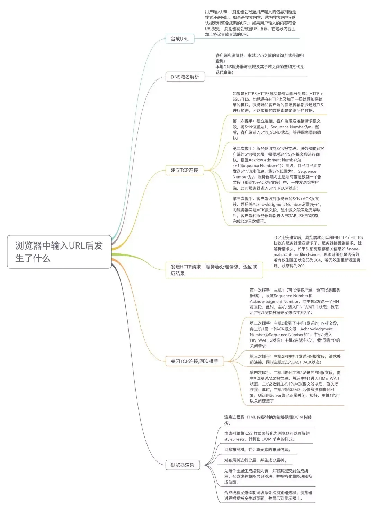
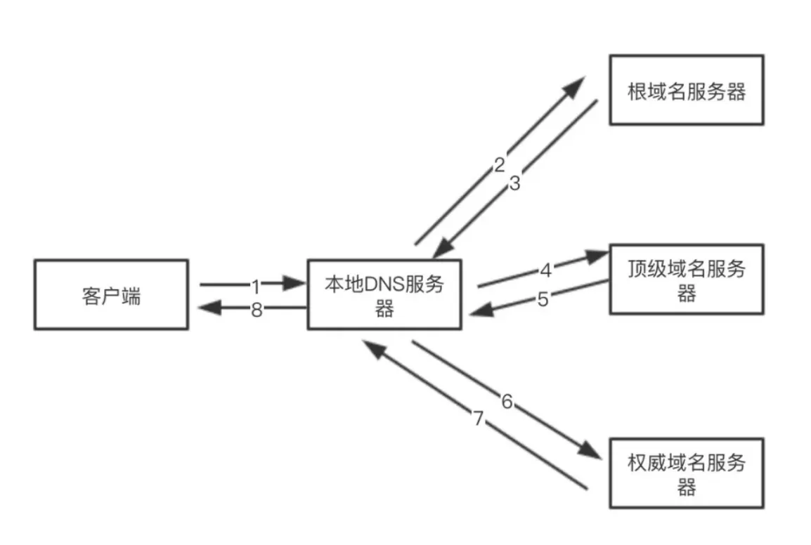

### 从输入网址回车中发生了什么

页面从输入 URL 到加载显示完成的过程涉及多个步骤，以下是一个详细的流程：

1. **DNS 解析**：首先，浏览器会进行 DNS 解析，将输入的域名转换为对应的 IP 地址。如果浏览器有缓存，它会首先检查缓存中是否有对应的 IP 地址，如果没有则向 DNS 服务器发送请求。
  
        
        
        
    - 根 DNS 服务器 ：返回顶级域 DNS 服务器的 IP 地址
    - 顶级域 DNS 服务器：返回权威 DNS 服务器的 IP 地址
    - 权威 DNS 服务器 ：返回相应主机的 IP 地址
- DNS的域名查找，在客户端和浏览器，本地DNS之间的查询方式是递归查询；在本地DNS服务器与根域及其子域之间的查询方式是迭代查询；
    
    ](./img/DNS域名查找.png)
    
- 

在客户端输入 URL 后，会有一个递归查找的过程，从`浏览器缓存中查找->本地的hosts文件查找->找本地DNS解析器缓存查找->本地DNS服务器查找`，这个过程中任何一步找到了都会结束查找流程。

如果本地DNS服务器无法查询到，则根据本地DNS服务器设置的转发器进行查询。若未用转发模式，则迭代查找过程如下图：

**在查找过程中，有以下优化点：**

- DNS存在着多级缓存，从离浏览器的距离排序的话，有以下几种: `浏览器缓存，系统缓存，路由器缓存，IPS服务器缓存，根域名服务器缓存，顶级域名服务器缓存，主域名服务器缓存`。
- 在域名和 IP 的映射过程中，给了应用基于域名做负载均衡的机会，可以是简单的负载均衡，也可以根据地址和运营商做全局的负载均衡。

1. **建立 TCP 连接**：浏览器使用 HTTP 或 HTTPS 协议与服务器建立 TCP 连接。对于 HTTPS 连接，还需要进行 SSL/TLS 握手过程，确保通信安全。
    1. 
    
    **建立TCP连接**
    
    > 首先，判断是不是https的，如果是，则HTTPS其实是HTTP + SSL / TLS 两部分组成，也就是在HTTP上又加了一层处理加密信息的模块。服务端和客户端的信息传输都会通过TLS进行加密，所以传输的数据都是加密后的数据
    > 
    
    进行三次握手，建立TCP连接。
    
    - 第一次握手：建立连接。客户端发送连接请求报文段
    - 第二次握手：服务器收到SYN报文段。服务器收到客户端的SYN报文段，需要对这个SYN报文段进行确认
    - 第三次握手：客户端收到服务器的SYN+ACK报文段，向服务器发送ACK报文段
    
    **SSL握手过程**
    
    - 第一阶段 建立安全能力 包括协议版本 会话Id 密码构件 压缩方法和初始随机数
    - 第二阶段 服务器发送证书 密钥交换数据和证书请求，最后发送请求-相应阶段的结束信号
    - 第三阶段 如果有证书请求客户端发送此证书 之后客户端发送密钥交换数据 也可以发送证书验证消息
    - 第四阶段 变更密码构件和结束握手协议
    
    **发送HTTP请求，服务器处理请求，返回响应结果**
    
    1. **发起 HTTP 请求**：一旦建立了 TCP 连接，浏览器会向服务器发送 HTTP 请求。该请求中包含了请求的方法（GET、POST 等）、请求的 URL、请求头部等信息。
    2. **服务器处理请求**：服务器接收到请求后，会根据请求的 URL 和参数执行相应的处理逻辑，可能涉及到查询数据库、生成动态内容等操作。
    3. **返回 HTTP 响应**：服务器处理完请求后，会返回一个 HTTP 响应。响应中包含了状态码（比如 200 表示成功，404 表示未找到等）、响应头部和响应体（HTML、CSS、JavaScript 等文件）。
    
    > TCP连接建立后，浏览器就可以利用 HTTP／HTTPS 协议向服务器发送请求了。服务器接受到请求，就解析请求头，如果头部有缓存相关信息如if-none-match与if-modified-since，则验证缓存是否有效，若有效则返回状态码为304，若无效则重新返回资源，状态码为200
    > 

1. **浏览器解析内容**：浏览器接收到响应后，会开始解析 HTML 内容，并根据 HTML 结构构建 DOM 树，同时会加载和解析 CSS 文件、JavaScript 文件等。

1. **构建渲染树**：浏览器根据 DOM 树和 CSSOM 树构建渲染树，渲染树中包含了需要显示的元素及其样式信息。
2. **布局和绘制**：浏览器根据渲染树进行布局（计算元素的位置和大小）和绘制（绘制像素到屏幕上）。
3. **显示页面**：最后，浏览器会将绘制好的内容显示在用户的屏幕上，完成页面加载显示的过程。

(webkit .v8,抽象语法树)

总的来说，页面加载显示的过程涉及了 DNS 解析、建立 TCP 连接、发起 HTTP 请求、服务器处理请求、返回 HTTP 响应、浏览器解析内容、构建渲染树、布局和绘制以及最终的页面显示等多个步骤。