# 排序算法

## 1. 排序算法的基本概念[¶](h

排序算法是计算机科学中最古老、最基础的算法之一。
「排序算法」的作用是将一个数据元素（通常称为「记录」）的任意序列，重新排列成一个按关键字有序的序列。
排序算法的输出结果必须满足以下两个条件：
1. **输出结果为有序序列**：即按照关键字递增（或递减）有序排列。
2. **输出结果为原输入序列的一种排列**：即通过算法得到的结果中，每个元素都在原输入序列中出现过，且只出现过一次。
「排序算法」的输入可以是数组、链表、栈、队列等数据结构，也可以是文件、数据库等外部存储。
### 执行效率

1. **时间复杂度**：分析排序算法时间复杂度时，需分别给出最好、最坏、平均情况的时间复杂度，并说明最好、最坏情况对应的原始数据特征。
2. **低阶项影响**：时间复杂度反映数据规模大时的增长趋势，会忽略系数、常数、低阶项。但实际处理小规模数据（如 10、100、1000 个数据）时，对同阶时间复杂度的排序算法对比，需考虑这些因素。
3. **操作次数**：对于基于比较的排序算法，执行过程涉及元素比较与交换（或移动）操作，分析执行效率时应考虑比较次数和交换（或移动）次数。

### 内存消耗

即分析空间复杂度。相关术语：

- **内排序**：排序操作全在内存中完成。
- **外排序**：因数据量大，数据存于磁盘，需磁盘与内存数据传输来排序。
- **原地排序**：指空间复杂度为 O(1) 的排序算法。

### 稳定性

- **稳定**：待排序序列中有值相等元素，排序后相等元素间原先后顺序不变（如 a=b 且 a 原在 b 前，排序后 a 仍在 b 前）。
- **不稳定**：待排序序列中有值相等元素，排序后相等元素间原先后顺序改变（如 a=b 且 a 原在 b 前，排序后 a 在 b 后）。

## 冒泡排序

# 冒泡排序


冒泡排序 Bubble Sort」的工作原理类似于泡泡在水中的浮动。在水中，较大的泡泡会最先浮到水面。

「冒泡操作」利用元素交换操作模拟了上述过程，具体做法为：从数组最左端开始向右遍历，依次比较相邻元素大小，如果“左元素 > 右元素”就交换它俩。遍历完成后，最大的元素会被移动到数组的最右端。

**在完成一次冒泡操作后，数组的最大元素已位于正确位置，接下来只需对剩余 N−1 个元素进行排序**

。


设输入数组长度为 N ，整个冒泡排序的步骤为：

1. 完成第一轮「冒泡」后，数组的最大元素已位于正确位置，接下来只需对剩余 N-1 个元素进行排序；
    
    
2. 对剩余N-1  个元素执行冒泡操作，可将第二大元素交换至正确位置，因而待排序元素只剩N-2  个；

```jsx
// 定义冒泡排序函数（未优化），接收一个数组作为参数
const bubbleSort = arr => {
    // 开始计时，用于记录排序所花费的时间
    console.time('改进前冒泡排序耗时');
    // 获取数组的长度
    const length = arr.length;
    // 如果数组长度小于等于 1，说明数组已经有序，直接返回
    if (length <= 1) return;
    // 外层循环控制排序的轮数，i < length - 1 是因为外层只需要 length - 1 次就可以排好序，第 length 次比较是多余的
    // 每一轮都会将当前未排序部分的最大元素“冒泡”到数组末尾
    for (let i = 0; i < length - 1; i++) {
        // 内层循环用于比较相邻元素并交换位置，将较大的元素往后移动
        // j < length - i - 1 是因为经过前面 i 轮排序后，数组末尾的 i 个元素已经排好序，不需要再进行比较
        for (let j = 0; j < length - i - 1; j++) {
            // 如果当前元素大于它后面的元素
            if (arr[j] > arr[j + 1]) {
                // 使用临时变量 temp 来交换两个元素的位置
                const temp = arr[j];
                arr[j] = arr[j + 1];
                arr[j + 1] = temp;
            }
        }
    }
    // 打印排序后的数组
    console.log('改进前 arr :', arr);
    // 结束计时并输出排序所花费的时间
    console.timeEnd('改进前冒泡排序耗时');
};
```

```jsx
// 定义优化后的冒泡排序函数，接收一个数组作为参数
const bubbleSort2 = arr => {
    // 开始计时，用于记录优化后冒泡排序所花费的时间
    console.time('改进后冒泡排序耗时');
    // 获取数组的长度
    const length = arr.length;
    // 如果数组长度小于等于 1，说明数组已经有序，直接返回
    if (length <= 1) return;

    // 外层循环控制排序的轮数，i < length - 1 是因为外层只需要 length - 1 次就可以排好序，第 length 次比较是多余的
    // 每一轮都会将当前未排序部分的最大元素“冒泡”到数组末尾
    for (let i = 0; i < length - 1; i++) {
        // 定义一个标志位，用于判断本轮排序中是否发生了元素交换
        // 初始值为 false，表示还没有发生交换
        let hasChange = false;

        // 内层循环用于比较相邻元素并交换位置，将较大的元素往后移动
        // j < length - i - 1 是因为经过前面 i 轮排序后，数组末尾的 i 个元素已经排好序，不需要再进行比较
        for (let j = 0; j < length - i - 1; j++) {
            // 如果当前元素大于它后面的元素
            if (arr[j] > arr[j + 1]) {
                // 使用临时变量 temp 来交换两个元素的位置
                const temp = arr[j];
                arr[j] = arr[j + 1];
                arr[j + 1] = temp;
                // 一旦发生了交换，将标志位设置为 true，表示有数据交换
                hasChange = true;
            }
        }

        // 如果标志位为 false，说明在本轮排序中没有发生元素交换
        // 这意味着数组已经有序，可以提前退出外层循环，结束排序过程
        if (!hasChange) break;
    }
    // 打印排序后的数组
    console.log('改进后 arr :', arr);
    // 结束计时并输出优化后冒泡排序所花费的时间
    console.timeEnd('改进后冒泡排序耗时');
};
```

冒泡排序是否为原地排序算法

- **原理分析**：在冒泡排序的每一轮比较和交换过程中，仅仅是对相邻元素进行位置交换，不需要额外开辟与数据规模成正比的存储空间。例如，对于一个长度为`n`的数组，在排序过程中，只需要几个额外的变量（如用于交换元素时的临时变量）来辅助完成交换操作，这些额外变量所占用的空间是固定的，不随数组长度`n`的变化而变化。
- **结论依据**：根据原地排序算法的定义，空间复杂度为$O(1)$的排序算法就是原地排序算法。由于冒泡排序只需要常量级的临时空间，所以它的空间复杂度是$O(1)$，因此冒泡排序是原地排序算法。

### 2. 冒泡排序是否为稳定的排序算法

- **原理分析**：在冒泡排序的核心逻辑中，元素位置的改变是通过相邻元素的交换来实现的。当遇到相邻两个元素相等的情况时，不进行交换操作。比如有数组`[3, 2, 3, 1]`，在进行排序时，两个值为`3`的元素在比较过程中，由于它们相等，不会发生交换，所以它们在排序前后的相对顺序保持不变。
- **结论依据**：按照稳定排序算法的定义，如果待排序序列中存在值相等的元素，经过排序之后，相等元素之间原有的先后顺序不变，那么该排序算法就是稳定的。所以，冒泡排序是稳定的排序算法。

### 3. 冒泡排序的时间复杂度

- **最佳情况（$T(n) = O(n)$）**
    - **数据特征**：当待排序的数据已经是正序排列时，例如数组`[1, 2, 3, 4, 5]`。
    - **过程分析**：在第一轮比较中，从第一个元素开始，依次比较相邻元素，由于数据已经是正序，不会发生任何交换操作。在完成一轮比较后，算法就可以判定数组已经有序，此时只需要进行$n - 1$次比较（$n$为数组长度），因此时间复杂度为$O(n)$。
- **最差情况（$T(n) = O(n^2)$）**
    - **数据特征**：当待排序的数据是反序排列时，例如数组`[5, 4, 3, 2, 1]`。
    - **过程分析**：在第一轮比较中，需要比较$n - 1$次，将最大的元素交换到数组的最后一位；在第二轮比较中，需要比较$n - 2$次，将第二大的元素交换到倒数第二位；以此类推，总共需要进行$(n - 1)+(n - 2)+\cdots+1=\frac{n(n - 1)}{2}$次比较和交换操作，根据大O表示法，忽略常数系数和低阶项，时间复杂度为$O(n^2)$。
- **平均情况（$T(n) = O(n^2)$）**
    - **过程分析**：平均情况下，冒泡排序的时间复杂度分析较为复杂，需要考虑所有可能的输入排列情况。但通过数学推导和概率分析，可以得出平均情况下的比较和交换次数的数量级仍然是$n^2$级别，所以平均时间复杂度为$O(n^2)$。

# **插入排序**

「插入排序 Insertion Sort」是一种基于数组插入操作的排序算法。具体来说，选择一个待排序的元素作为基准值 `base` ，将 `base` 与其左侧已排序区间的元素逐一比较大小，并将其插入到正确的位置。

回顾数组插入操作，我们需要将从目标索引到 `base` 之间的所有元素向右移动一位，然后再将 `base` 赋值给目标索引。


插入排序的思想非常简单，生活中有一个很常见的场景：在打扑克牌时，我们一边抓牌一边给扑克牌排序，每次摸一张牌，就将它插入手上已有的牌中合适的位置，逐渐完成整个排序。

插入排序有两种写法：

交换法：在新数字插入过程中，不断与前面的数字交换，直到找到自己合适的位置。
移动法：在新数字插入过程中，与前面的数字不断比较，前面的数字不断向后挪出位置，当新数字找到自己的位置后，插入一次即可。


插入排序的整体流程如下：

1. 首先，选取数组的第 2 个元素作为 `base` ，执行插入操作后，**数组的前 2 个元素已排序**。
2. 接着，选取第 3 个元素作为 `base` ，执行插入操作后，**数组的前 3 个元素已排序**。
3. 以此类推，在最后一轮中，选取数组尾元素作为 `base` ，执行插入操作后，**所有元素均已排序**。


```jsx
/* 插入排序 */
function insertionSort(nums) {
    // 外循环：base = nums[1], nums[2], ..., nums[n-1]
    for (let i = 1; i < nums.length; i++) {
        let base = nums[i],
            j = i - 1;
        // 内循环：将 base 插入到左边的正确位置
        while (j >= 0 && nums[j] > base) {
            nums[j + 1] = nums[j]; // 1. 将 nums[j] 向右移动一位
            j--;
        }
        nums[j + 1] = base; // 2. 将 base 赋值到正确位置
    }
}
```

## 快速排序

### 1. JavaScript 快速排序代码实现

根据文章中描述的快速排序原理，下面是对应的 JavaScript 代码实现：

```jsx
function quickSort(arr, left, right) {
    if (left < right) {
        // 找到基准值的最终位置
        const pivotIndex = partition(arr, left, right);
        // 对基准值左边的子数组进行快速排序
        quickSort(arr, left, pivotIndex - 1);
        // 对基准值右边的子数组进行快速排序
        quickSort(arr, pivotIndex + 1, right);
    }
    return arr;
}

function partition(arr, left, right) {
    // 选择中间元素作为基准值
    const pivotIndex = Math.floor((left + right) / 2);
    const pivot = arr[pivotIndex];
    let l = left;
    let r = right;

    while (l < r) {
        // 从左往右找比基准值大的元素
        while (arr[l] < pivot) {
            l++;
        }
        // 从右往左找比基准值小的元素
        while (arr[r] > pivot) {
            r--;
        }
        // 如果 l < r，则交换这两个元素
        if (l < r) {
            [arr[l], arr[r]] = [arr[r], arr[l]];
            l++;
            r--;
        }
    }
    return l;
}

// 测试代码
const arr = [-9, 78, 0, 23, -567, 70];
console.log("原始数组：", arr);
const sortedArr = quickSort(arr, 0, arr.length - 1);
console.log("排序后数组：", sortedArr);

```

### 2. 快速排序原理

快速排序是对冒泡排序的一种改进，其基本思想是通过一趟排序将要排序的数据分割成独立的两个部分，其中一部分的所有数据都比另外一部分的所有数据要小，然后再按此方法对这两部分数据分别进行快速排序，排序过程可以递归进行，直到整个数据变成有序序列。具体步骤如下：

1. **选择基准值**：从数组中选择一个元素作为基准值（文章中选择数组中间的元素）。
2. **分区操作**：将数组中的元素重新排列，使得所有比基准值小的元素都位于基准值的左边，所有比基准值大的元素都位于基准值的右边。
3. **递归排序**：对基准值左边和右边的子数组分别递归地应用快速排序算法，直到子数组的长度为 1 或 0。

### 3. Mermaid 结构时序图和流程图

### 流程图

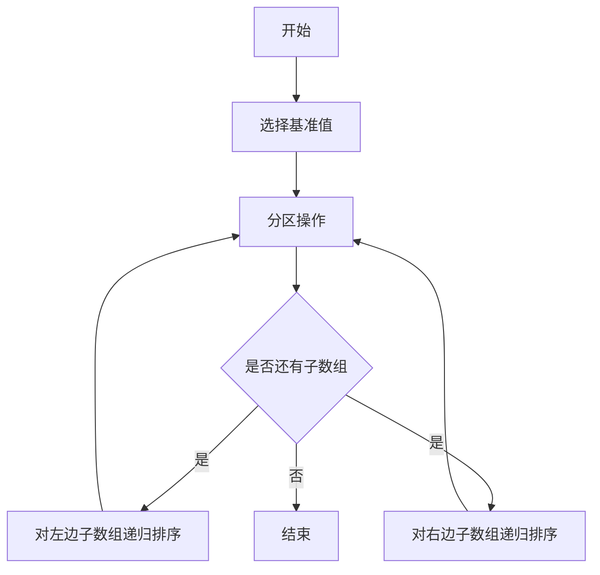
```mermaid
graph TD;
    A[开始] --> B[选择基准值];
    B --> C[分区操作];
    C --> D{是否还有子数组};
    D -- 是 --> E[对左边子数组递归排序];
    D -- 是 --> F[对右边子数组递归排序];
    E --> C;
    F --> C;
    D -- 否 --> G[结束];

```

这个流程图展示了快速排序的整体流程：首先选择基准值，然后进行分区操作，将数组分为两部分。接着判断是否还有子数组需要排序，如果有则对左右子数组分别进行递归排序，直到所有子数组都排序完成。

### 时序图

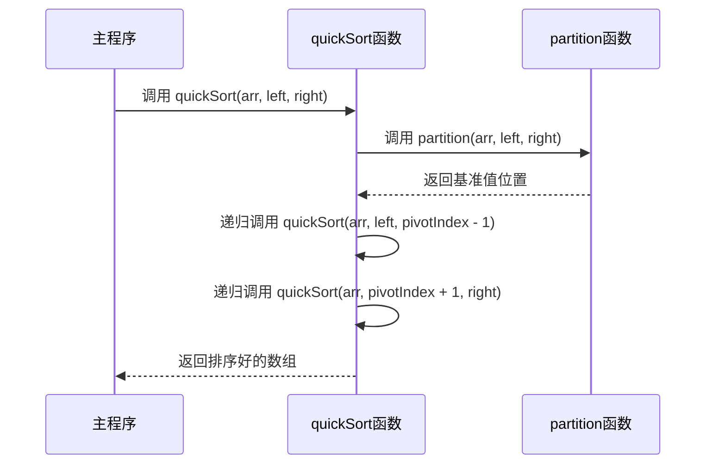
```mermaid
sequenceDiagram
    participant Main as 主程序
    participant QuickSort as quickSort函数
    participant Partition as partition函数
    Main->>QuickSort: 调用 quickSort(arr, left, right)
    QuickSort->>Partition: 调用 partition(arr, left, right)
    Partition-->>QuickSort: 返回基准值位置
    QuickSort->>QuickSort: 递归调用 quickSort(arr, left, pivotIndex - 1)
    QuickSort->>QuickSort: 递归调用 quickSort(arr, pivotIndex + 1, right)
    QuickSort-->>Main: 返回排序好的数组

```

这个时序图展示了快速排序的调用过程：主程序调用 `quickSort` 函数，`quickSort` 函数调用 `partition` 函数进行分区操作并获取基准值的位置，然后对左右子数组分别进行递归调用，最后将排序好的数组返回给主程序。

## 堆排序

### 1. JavaScript 堆排序代码实现（添加详细注释）

```jsx
function HeapSort(a) {
    // 在数组前面添加一个 0，目的是让堆从索引 1 开始，简化后续排序操作
    a.unshift(0);
    let heap, k;

    // 交换函数，用于交换数组中两个元素的位置
    function swap(i, j) {
        let temp = a[i];
        a[i] = a[j];
        a[j] = temp;
    }

    // 对指定的节点进行排序，使其满足堆的性质（父母节点大于等于子女节点）
    function sort(i, end) {
        k = i;
        heap = false;
        // 当当前节点不满足堆的性质且有子女节点时，继续循环
        while (!heap && (k * 2 < end)) {
            let j = 2 * k;
            // 如果有两个子节点，选择较大的子节点
            if (j < end - 1) {
                if (a[j] < a[j + 1]) j = j + 1;
            }
            // 如果当前节点大于等于较大的子节点，说明满足堆的性质，退出循环
            if (a[k] >= a[j]) heap = true;
            else {
                // 否则，交换当前节点和较大子节点的位置
                swap(k, j);
                k = j;
            }
        }
    }

    // 初始化堆，从最后一个父节点开始，对数组进行堆化操作
    for (let i = Math.floor(a.length / 2); i >= 1; i--) {
        sort(i, a.length);
    }

    // 进行重复的移除根节点和重新排序操作
    for (let i = a.length - 1; i >= 1; i--) {
        // 将根节点（最大值）与当前未排序部分的最后一个节点交换
        swap(1, i);
        // 对剩余的未排序部分重新进行堆化
        sort(1, i);
    }

    // 移除数组开头添加的 0
    a.shift();
    return a;
}

// 测试代码
const arr = [4, 10, 3, 5, 1];
console.log("原始数组：", arr);
const sortedArr = HeapSort(arr);
console.log("排序后数组：", sortedArr);

```

### 2. 堆排序原理

堆排序主要基于最大堆（每个节点的值都大于或等于其子节点的值）的性质进行排序，其核心步骤如下：

1. **构建最大堆**：将待排序的数组转换为最大堆。从最后一个非叶子节点开始，依次对每个节点进行调整，使其满足最大堆的性质。这个过程可以采用自底向上的方式，确保每个子树都是最大堆。
2. **移除根节点并重新调整堆**：将最大堆的根节点（即最大值）与堆的最后一个节点交换，然后将堆的大小减 1。接着对新的根节点进行调整，使其重新满足最大堆的性质。重复这个过程，直到堆中只剩下一个节点。
3. **排序完成**：经过上述步骤，数组将按升序排列。

### 3. Mermaid 流程图

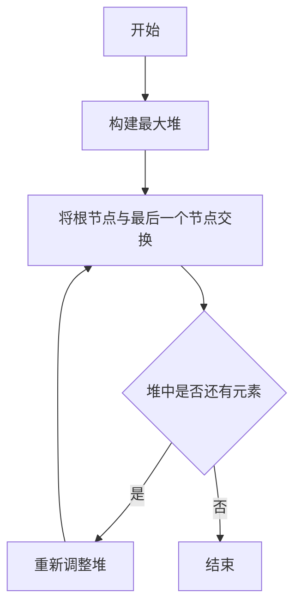
```mermaid
graph TD;
    A[开始] --> B[构建最大堆];
    B --> C[将根节点与最后一个节点交换];
    C --> D{堆中是否还有元素};
    D -- 是 --> E[重新调整堆];
    E --> C;
    D -- 否 --> F[结束];

```

这个流程图展示了堆排序的主要流程：首先构建最大堆，然后将根节点与最后一个节点交换，接着判断堆中是否还有元素，如果有则重新调整堆，直到堆中没有元素为止。

### 4. Mermaid 时序图

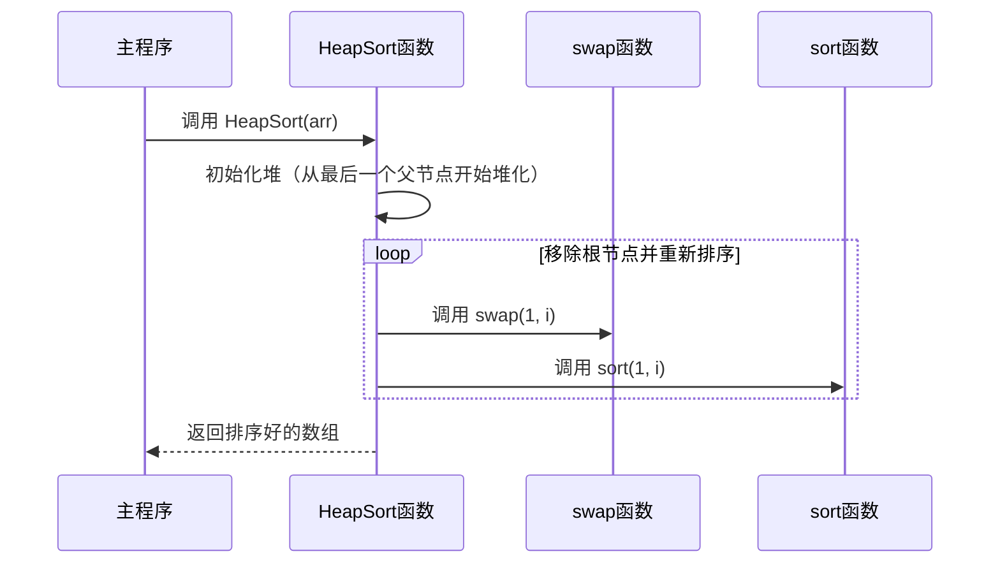
```mermaid
sequenceDiagram
    participant Main as 主程序
    participant HeapSort as HeapSort函数
    participant swap as swap函数
    participant sort as sort函数
    Main->>HeapSort: 调用 HeapSort(arr)
    HeapSort->>HeapSort: 初始化堆（从最后一个父节点开始堆化）
    loop 移除根节点并重新排序
        HeapSort->>swap: 调用 swap(1, i)
        HeapSort->>sort: 调用 sort(1, i)
    end
    HeapSort-->>Main: 返回排序好的数组

```

这个时序图展示了堆排序的调用过程：主程序调用 `HeapSort` 函数，`HeapSort` 函数先对数组进行初始化堆操作，然后循环进行移除根节点和重新排序的操作，每次操作会调用 `swap` 函数交换元素位置，调用 `sort` 函数重新调整堆，最后将排序好的数组返回给主程序。

# 选择排序

### 1. 选择排序代码（添加详细注释）

```jsx
const selectionSort = array => {
    // 获取数组的长度
    const len = array.length;
    // 用于记录当前未排序区间中最小元素的索引
    let minIndex;
    // 用于交换元素时的临时变量
    let temp;
    // 外层循环控制已排序区间的边界，i 表示已排序区间的末尾位置
    for (let i = 0; i < len - 1; i++) {
        // 假设当前已排序区间末尾位置的元素是最小的
        minIndex = i;
        // 内层循环遍历未排序区间，寻找最小元素的索引
        for (let j = i + 1; j < len; j++) {
            // 如果找到比当前最小元素更小的元素
            if (array[j] < array[minIndex]) {
                // 更新最小元素的索引
                minIndex = j;
            }
        }
        // 将最小元素与已排序区间的末尾元素交换位置
        temp = array[i];
        array[i] = array[minIndex];
        array[minIndex] = temp;
        // 打印每一轮排序后的数组状态
        console.log('array: ', array);
    }
    // 返回排序好的数组
    return array;
};

// 测试
const array = [5, 4, 3, 2, 1];
console.log('原始array:', array);
selectionSort(array);

```

### 2. 选择排序原理

选择排序的核心思想是将数组划分为已排序区间和未排序区间。初始时，已排序区间为空，未排序区间包含整个数组。每次从未排序区间中找到最小（或最大）的元素，将其与未排序区间的第一个元素交换位置，从而将该元素加入到已排序区间。重复这个过程，直到未排序区间为空，整个数组就排序完成了。

### 3. Mermaid 流程图

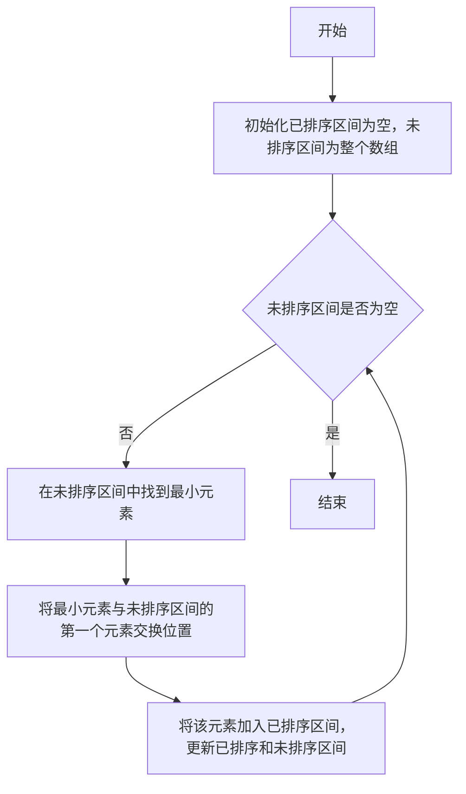
```mermaid
graph TD;
    A[开始] --> B[初始化已排序区间为空，未排序区间为整个数组];
    B --> C{未排序区间是否为空};
    C -- 否 --> D[在未排序区间中找到最小元素];
    D --> E[将最小元素与未排序区间的第一个元素交换位置];
    E --> F[将该元素加入已排序区间，更新已排序和未排序区间];
    F --> C;
    C -- 是 --> G[结束];

```

### 4. Mermaid 时序图

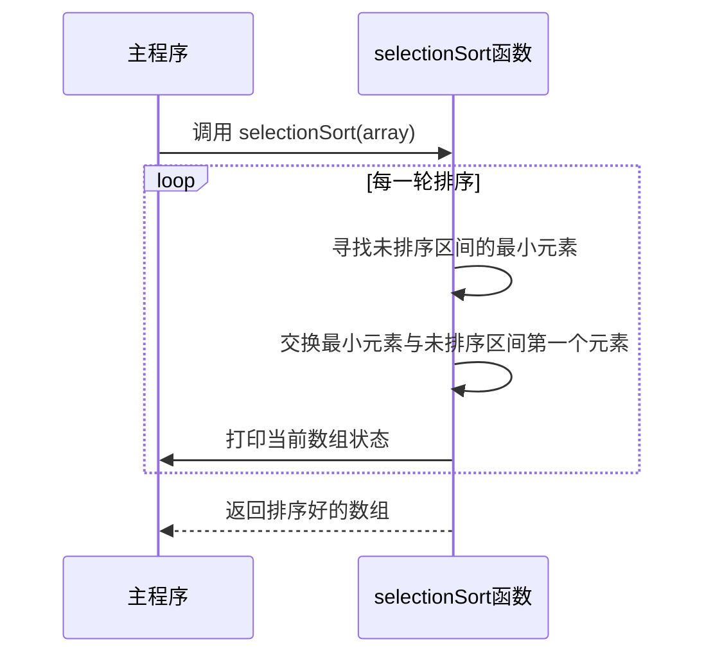
```mermaid
sequenceDiagram
    participant Main as 主程序
    participant SelectionSort as selectionSort函数
    Main->>SelectionSort: 调用 selectionSort(array)
    loop 每一轮排序
        SelectionSort->>SelectionSort: 寻找未排序区间的最小元素
        SelectionSort->>SelectionSort: 交换最小元素与未排序区间第一个元素
        SelectionSort->>Main: 打印当前数组状态
    end
    SelectionSort-->>Main: 返回排序好的数组

```

### 5. 复杂度分析

- **空间复杂度**：选择排序只使用了常数级的额外空间，如 `minIndex` 和 `temp` 变量，所以空间复杂度为 $O(1)$，是原地排序算法。
- **稳定性**：选择排序每次都要找剩余未排序元素中的最小值，并和前面的元素交换位置，这样会破坏相同元素的相对顺序，所以它是不稳定的排序算法。
- **时间复杂度**：无论数组是正序还是逆序，选择排序都需要进行 $n(n - 1) / 2$ 次比较操作，所以最佳、最差和平均的时间复杂度都是 $O(n^2)$。、

## 归并排序

### 1. 归并排序代码（添加详细注释）

```jsx
// 归并排序主函数，采用自上而下的递归方法
const mergeSort = arr => {
    // 获取数组的长度
    const len = arr.length;
    // 如果数组长度小于 2，说明数组已经有序，直接返回
    if (len < 2) {
        return arr;
    }
    // 计算数组的中间位置，使用 Math.floor(len / 2) 等价于 len >> 1
    let middle = Math.floor(len / 2);
    // 拆分数组为左右两部分
    let left = arr.slice(0, middle);
    let right = arr.slice(middle);
    // 递归对左右两部分进行排序，并将排序好的两部分合并
    return merge(mergeSort(left), mergeSort(right));
};

// 合并函数，将两个有序数组合并为一个有序数组
const merge = (left, right) => {
    // 用于存储合并后的结果
    const result = [];
    // 当左右数组都不为空时，比较两个数组的第一个元素，将较小的元素添加到结果数组中
    while (left.length && right.length) {
        // 注意: 判断的条件是小于或等于，如果只是小于，那么排序将不稳定
        if (left[0] <= right[0]) {
            result.push(left.shift());
        } else {
            result.push(right.shift());
        }
    }
    // 如果左数组还有剩余元素，将其全部添加到结果数组中
    while (left.length) result.push(left.shift());
    // 如果右数组还有剩余元素，将其全部添加到结果数组中
    while (right.length) result.push(right.shift());
    // 返回合并后的结果数组
    return result;
};

// 测试
const arr = [3, 44, 38, 5, 47, 15, 36, 26, 27, 2, 46, 4, 19, 50, 48];
console.time('归并排序耗时');
console.log('arr :', mergeSort(arr));
console.timeEnd('归并排序耗时');

```

### 2. 归并排序原理

归并排序采用分治思想，将一个大问题分解成小的子问题来解决。具体步骤如下：

- **分解**：将待排序的数组从中间分成前后两部分，然后对这两部分分别进行递归排序，直到每个子数组只有一个元素或为空，此时每个子数组都是有序的。
- **合并**：将两个有序的子数组合并成一个有序的数组。合并时，比较两个子数组的第一个元素，将较小的元素放入结果数组中，并从原数组中移除该元素，重复这个过程，直到其中一个子数组为空，然后将另一个子数组的剩余元素直接添加到结果数组的末尾。

### 3. Mermaid 流程图

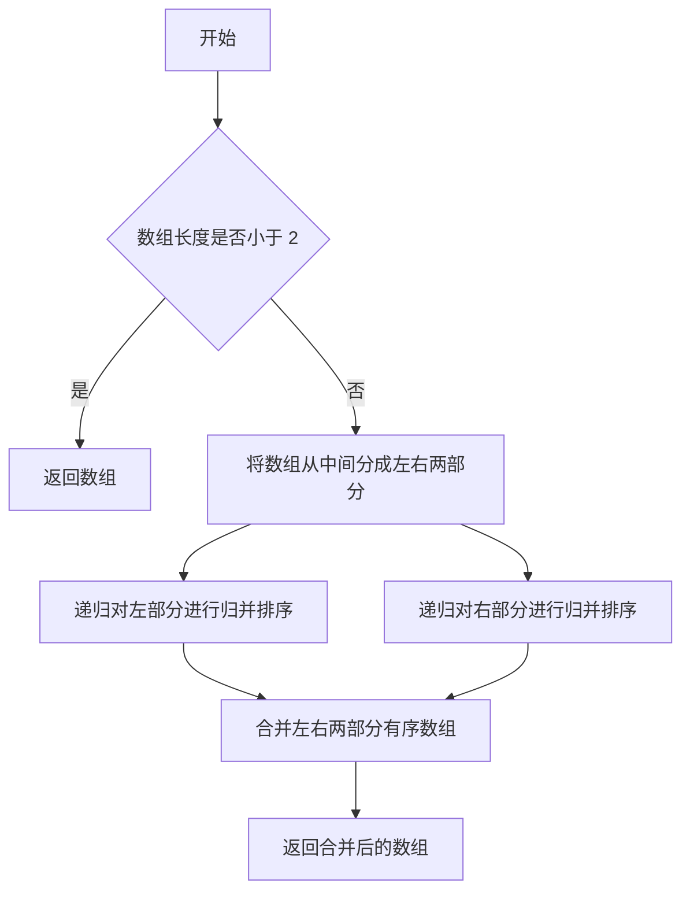
```mermaid
graph TD;
    A[开始] --> B{数组长度是否小于 2};
    B -- 是 --> C[返回数组];
    B -- 否 --> D[将数组从中间分成左右两部分];
    D --> E[递归对左部分进行归并排序];
    D --> F[递归对右部分进行归并排序];
    E --> G[合并左右两部分有序数组];
    F --> G;
    G --> H[返回合并后的数组];

```

### 4. Mermaid 时序图

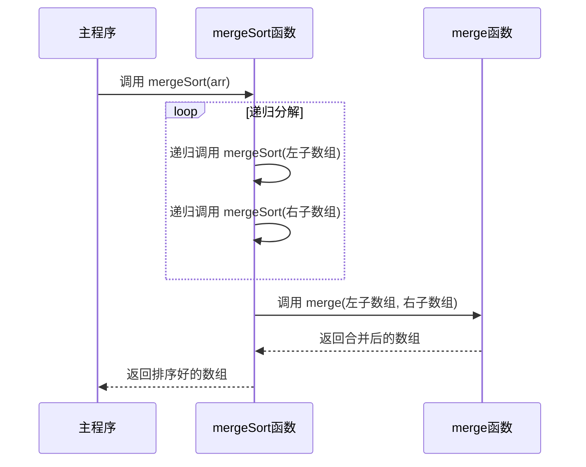
```mermaid
sequenceDiagram
    participant Main as 主程序
    participant MergeSort as mergeSort函数
    participant Merge as merge函数
    Main->>MergeSort: 调用 mergeSort(arr)
    loop 递归分解
        MergeSort->>MergeSort: 递归调用 mergeSort(左子数组)
        MergeSort->>MergeSort: 递归调用 mergeSort(右子数组)
    end
    MergeSort->>Merge: 调用 merge(左子数组, 右子数组)
    Merge-->>MergeSort: 返回合并后的数组
    MergeSort-->>Main: 返回排序好的数组

```

### 5. 复杂度分析

- **空间复杂度**：归并排序的合并函数在合并两个有序数组时，需要借助额外的存储空间。尽管每次合并操作完成后，临时开辟的内存空间会被释放，但在任意时刻，CPU 只会有一个函数在执行，也就只会有一个临时的内存空间在使用，临时内存空间最大不会超过 n 个数据的大小，所以空间复杂度是 $O(n)$，不是原地排序算法。
- **稳定性**：在 `merge` 方法中，使用 `left[0] <= right[0]` 进行比较，保证了值相同的元素，在合并前后的先后顺序不变，所以归并排序是稳定的排序算法。
- **时间复杂度**：假设数组长度为 n，拆分数组共需 $log n$ 步，每步都是一个普通的合并子数组的过程，时间复杂度为 $O(n)$，故其综合时间复杂度为 $O(n log n)$。最佳情况、最差情况和平均情况的时间复杂度都是 $O(n log n)$。

# 希尔排序

### 1. 希尔排序代码（添加详细注释）

```jsx
const shellSort = arr => {
    // 获取数组的长度
    let len = arr.length;
    // 用于临时存储当前要插入的元素
    let temp;
    // 初始化间隔，动态定义间隔序列
    let gap = 1;
    console.time('希尔排序耗时');
    // 动态计算初始间隔，使得间隔按照 gap = gap * 3 + 1 的规则增长，直到接近数组长度的三分之一
    while (gap < len / 3) {
        gap = gap * 3 + 1;
    }
    // 外层循环控制间隔，每次将间隔缩小为原来的三分之一，直到间隔为 1
    for (gap; gap > 0; gap = Math.floor(gap / 3)) {
        // 中层循环从间隔位置开始遍历数组
        for (let i = gap; i < len; i++) {
            // 保存当前要插入的元素
            temp = arr[i];
            // 记录当前元素前一个间隔位置的索引
            let j = i - gap;
            // 内层循环将当前元素插入到前面已经排好序的子序列中
            for (; j >= 0 && arr[j] > temp; j -= gap) {
                // 将前面的元素后移一个间隔位置
                arr[j + gap] = arr[j];
            }
            // 将当前元素插入到合适的位置
            arr[j + gap] = temp;
            // 打印每一次插入后的数组状态
            console.log('arr  :', arr);
        }
    }
    console.timeEnd('希尔排序耗时');
    return arr;
};

// 测试
const array = [35, 33, 42, 10, 14, 19, 27, 44];
console.log('原始array:', array);
const newArr = shellSort(array);
console.log('newArr:', newArr);

```

### 2. 希尔排序原理

希尔排序的核心思想是先将整个待排序的记录序列分割成若干子序列，分别对这些子序列进行直接插入排序，随着间隔的逐渐减小，子序列的长度逐渐增加，整个序列会变得越来越接近有序。当间隔减小到 1 时，对整个序列进行一次直接插入排序，此时序列已经基本有序，插入排序的效率会比较高。具体步骤如下：

- **选择间隔**：选择一个初始的间隔值，通常采用 Knuth 序列，即 `gap = gap * 3 + 1` 来动态计算初始间隔。
- **分组插入排序**：按照当前间隔将数组分成若干子序列，对每个子序列进行直接插入排序。
- **缩小间隔**：将间隔缩小，通常是将间隔除以 3 并向下取整，重复步骤 2，直到间隔为 1。
- **最终排序**：当间隔为 1 时，对整个数组进行一次直接插入排序，排序完成。

### 3. Mermaid 流程图

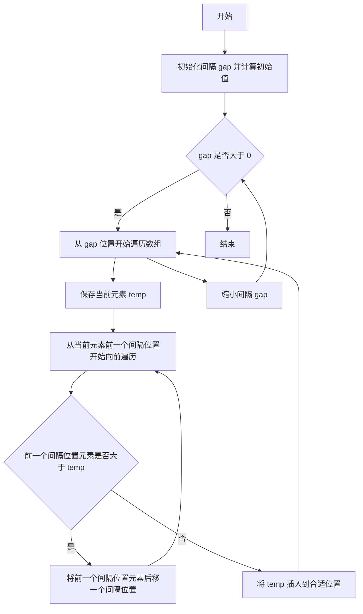
```mermaid
graph TD;
    A[开始] --> B[初始化间隔 gap 并计算初始值];
    B --> C{gap 是否大于 0};
    C -- 是 --> D[从 gap 位置开始遍历数组];
    D --> E[保存当前元素 temp];
    E --> F[从当前元素前一个间隔位置开始向前遍历];
    F --> G{前一个间隔位置元素是否大于 temp};
    G -- 是 --> H[将前一个间隔位置元素后移一个间隔位置];
    H --> F;
    G -- 否 --> I[将 temp 插入到合适位置];
    I --> D;
    D --> J[缩小间隔 gap];
    J --> C;
    C -- 否 --> K[结束];

```

### 4. Mermaid 时序图

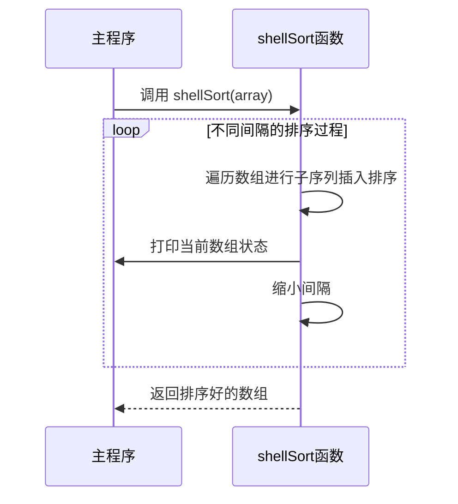
```mermaid
sequenceDiagram
    participant Main as 主程序
    participant ShellSort as shellSort函数
    Main->>ShellSort: 调用 shellSort(array)
    loop 不同间隔的排序过程
        ShellSort->>ShellSort: 遍历数组进行子序列插入排序
        ShellSort->>Main: 打印当前数组状态
        ShellSort->>ShellSort: 缩小间隔
    end
    ShellSort-->>Main: 返回排序好的数组

```

### 5. 复杂度分析

- **空间复杂度**：希尔排序过程中只涉及相邻数据的交换操作，只需要常量级的临时空间，如 `temp` 变量，所以空间复杂度为 $O(1)$，是原地排序算法。
- **稳定性**：虽然单次直接插入排序是稳定的，不会改变相同元素之间的相对顺序，但在多次不同的插入排序过程中，相同的元素可能在各自的插入排序中移动，可能导致相同元素相对顺序发生变化，因此希尔排序是不稳定的排序算法。
- **时间复杂度**：希尔排序的时间复杂度与间隔序列的选择有关。最佳情况：$T(n) = O(n log n)$；最差情况：$T(n) = O(n log^2 n)$；平均情况：$T(n) = O(n log^2 n)$。

# 堆排序

### 1. 堆排序代码（添加详细注释）

```jsx
// 堆排序函数
const heapSort = array => {
    console.time('堆排序耗时');
    // 步骤 1: 初始化大顶堆
    // 从第一个非叶子节点开始，自底向上调整堆，使其满足大顶堆的性质
    // 第一个非叶子节点的索引为 Math.floor(array.length / 2 - 1)
    for (let i = Math.floor(array.length / 2 - 1); i >= 0; i--) {
        heapify(array, i, array.length);
    }
    // 步骤 2: 排序过程
    // 每次将堆顶元素（最大值）与当前未排序部分的最后一个元素交换
    // 然后对剩余的未排序部分重新调整为大顶堆
    for (let i = Math.floor(array.length - 1); i > 0; i--) {
        // 交换堆顶元素（索引为 0）和当前未排序部分的最后一个元素（索引为 i）
        swap(array, 0, i);
        // 调整剩余的未排序部分为大顶堆
        // 最后一个元素已经是当前最大值，不需要再参与比较，所以长度为 i
        heapify(array, 0, i);
    }
    console.timeEnd('堆排序耗时');
    return array;
};

// 交换数组中两个元素的位置
const swap = (array, i, j) => {
    let temp = array[i];
    array[i] = array[j];
    array[j] = temp;
};

// 将以 i 为根节点的子树调整为大顶堆
// 假设节点 i 以下的子堆已经是一个大顶堆，此函数的作用是找到节点 i 在包括节点 i 的堆中的正确位置
const heapify = (array, i, length) => {
    // 保存当前父节点的值
    let temp = array[i];
    // 从左子节点开始遍历
    for (let j = 2 * i + 1; j < length; j = 2 * j + 1) {
        // 重新保存当前父节点的值
        temp = array[i];
        // 如果右子节点存在且右子节点的值大于左子节点的值
        if (j + 1 < length && array[j] < array[j + 1]) {
            // 选择右子节点
            j++;
        }
        // 如果父节点的值小于子节点的值
        if (temp < array[j]) {
            // 交换父节点和子节点的位置
            swap(array, i, j);
            // 更新父节点的索引为子节点的索引
            i = j;
        } else {
            // 父节点的值大于等于子节点的值，无需交换，跳出循环
            break;
        }
    }
};

// 测试代码
const array = [4, 6, 8, 5, 9, 1, 2, 5, 3, 2];
console.log('原始array:', array);
const newArr = heapSort(array);
console.log('newArr:', newArr);

```

### 2. 堆排序原理

堆排序主要基于大顶堆（每个节点的值都大于或等于其子节点的值）的性质进行排序，具体步骤如下：

- **构建大顶堆**：将待排序的数组看作一个完全二叉树，从第一个非叶子节点开始，自底向上调整每个子树，使其满足大顶堆的性质，即每个节点的值都大于或等于其子节点的值。
- **交换堆顶元素和最后一个元素**：将堆顶元素（最大值）与当前未排序部分的最后一个元素交换，这样最大值就被放到了数组的末尾，成为已排序部分。
- **调整堆**：交换后，堆的性质可能被破坏，需要对剩余的未排序部分重新调整为大顶堆。
- **重复步骤 2 和 3**：不断重复交换堆顶元素和最后一个元素，并调整堆的过程，直到整个数组都被排序。

### 3. Mermaid 流程图

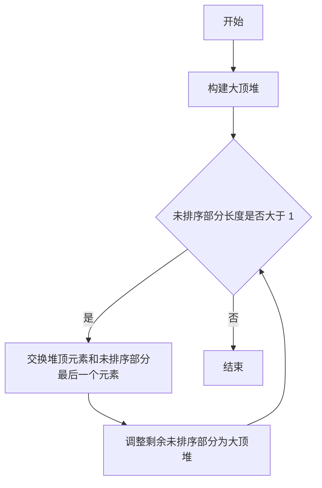
```mermaid
graph TD;
    A[开始] --> B[构建大顶堆];
    B --> C{未排序部分长度是否大于 1};
    C -- 是 --> D[交换堆顶元素和未排序部分最后一个元素];
    D --> E[调整剩余未排序部分为大顶堆];
    E --> C;
    C -- 否 --> F[结束];

```

### 4. Mermaid 时序图

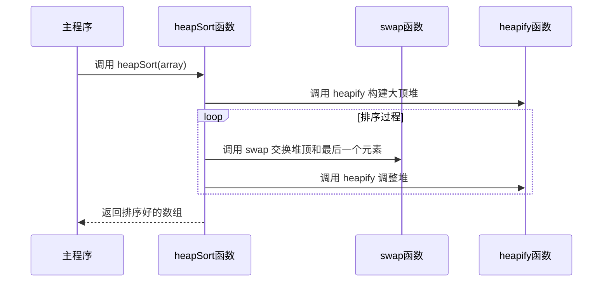
```mermaid
sequenceDiagram
    participant Main as 主程序
    participant HeapSort as heapSort函数
    participant Swap as swap函数
    participant Heapify as heapify函数
    Main->>HeapSort: 调用 heapSort(array)
    HeapSort->>Heapify: 调用 heapify 构建大顶堆
    loop 排序过程
        HeapSort->>Swap: 调用 swap 交换堆顶和最后一个元素
        HeapSort->>Heapify: 调用 heapify 调整堆
    end
    HeapSort-->>Main: 返回排序好的数组

```

### 5. 复杂度分析

- **空间复杂度**：堆排序整个过程只需要极个别临时存储空间，如 `temp` 变量，所以空间复杂度为 $O(1)$，是原地排序算法。
- **稳定性**：在排序过程中，存在将堆的最后一个节点跟堆顶节点互换的操作，这可能会改变值相同数据的原始相对顺序，所以堆排序是不稳定的排序算法。
- **时间复杂度**：堆排序包括建堆和排序两个操作。建堆过程需要遍历所有非叶子节点，时间复杂度是 $O(n)$；排序过程需要进行 $n - 1$ 次交换和调整堆的操作，每次调整堆的时间复杂度是 $O(logn)$，所以排序过程的时间复杂度是 $O(nlogn)$。因此，堆排序整体的时间复杂度是 $O(nlogn)$，最佳情况、最差情况和平均情况的时间复杂度都是 $O(nlogn)$。

## 桶排序

### 1. 代码分析及优化注释

```jsx
// 桶排序函数
const bucketSort = (array, bucketSize) => {
    // 若数组为空，直接返回
    if (array.length === 0) {
        return array;
    }
    console.time('桶排序耗时');
    let i = 0;
    // 初始化最小值和最大值为数组第一个元素
    let minValue = array[0];
    let maxValue = array[0];
    // 遍历数组，找出最小值和最大值
    for (i = 1; i < array.length; i++) {
        if (array[i] < minValue) {
            minValue = array[i]; // 记录输入数据的最小值
        } else if (array[i] > maxValue) {
            maxValue = array[i]; // 记录输入数据的最大值
        }
    }
    // 桶的初始化
    const DEFAULT_BUCKET_SIZE = 5; // 设置桶的默认数量为 5
    // 如果未传入桶大小，使用默认值
    bucketSize = bucketSize || DEFAULT_BUCKET_SIZE;
    // 计算桶的数量
    const bucketCount = Math.floor((maxValue - minValue) / bucketSize) + 1;
    // 创建桶数组
    const buckets = new Array(bucketCount);
    // 初始化每个桶为空数组
    for (i = 0; i < buckets.length; i++) {
        buckets[i] = [];
    }
    // 利用映射函数将数据分配到各个桶中
    for (i = 0; i < array.length; i++) {
        buckets[Math.floor((array[i] - minValue) / bucketSize)].push(array[i]);
    }
    // 清空原数组
    array.length = 0;
    // 对每个桶进行排序，并将排序后的元素放回原数组
    for (i = 0; i < buckets.length; i++) {
        quickSort(buckets[i]); // 对每个桶进行排序，这里使用了快速排序
        for (var j = 0; j < buckets[i].length; j++) {
            array.push(buckets[i][j]);
        }
    }
    console.timeEnd('桶排序耗时');
    return array;
};

// 快速排序函数
const quickSort = (arr, left, right) => {
    let len = arr.length;
    let partitionIndex;
    // 若未传入 left，默认为 0
    left = typeof left != 'number' ? 0 : left;
    // 若未传入 right，默认为数组长度减 1
    right = typeof right != 'number' ? len - 1 : right;
    if (left < right) {
        partitionIndex = partition(arr, left, right);
        quickSort(arr, left, partitionIndex - 1);
        quickSort(arr, partitionIndex + 1, right);
    }
    return arr;
};

// 分区操作函数
const partition = (arr, left, right) => {
    // 设定基准值（pivot）
    let pivot = left;
    let index = pivot + 1;
    for (let i = index; i <= right; i++) {
        if (arr[i] < arr[pivot]) {
            swap(arr, i, index);
            index++;
        }
    }
    swap(arr, pivot, index - 1);
    return index - 1;
};

// 交换数组中两个元素的函数
const swap = (arr, i, j) => {
    let temp = arr[i];
    arr[i] = arr[j];
    arr[j] = temp;
};

// 测试
const array = [4, 6, 8, 5, 9, 1, 2, 5, 3, 2];
console.log('原始array:', array);
const newArr = bucketSort(array);
console.log('newArr:', newArr);

```

### 2. 桶排序原理

桶排序的核心思想是分治，将待排序的数据分到有限数量的有序桶中，每个桶内的数据再单独排序，最后将各个桶中的数据按顺序合并起来。具体步骤如下：

1. **确定数据范围**：找出待排序数组中的最小值和最大值，确定数据的范围。
2. **初始化桶**：根据数据范围和桶的大小，计算需要的桶的数量，并创建相应数量的空桶。
3. **分配数据到桶**：通过一个映射函数，将每个数据分配到对应的桶中。映射函数的设计要尽量保证数据均匀分布在各个桶中。
4. **桶内排序**：对每个桶内的数据进行排序，可以使用其他排序算法，如插入排序、快速排序等。
5. **合并桶**：将各个桶中的数据按顺序依次取出，组成一个有序的序列。

### 3. Mermaid 流程图

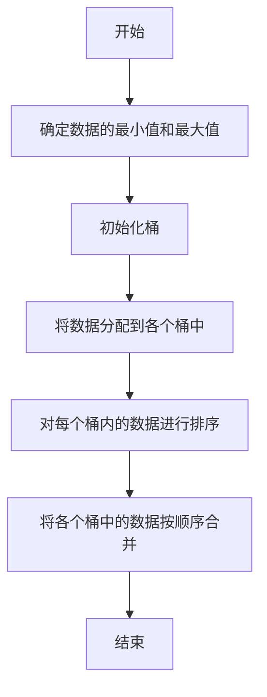
```mermaid
graph TD;
    A[开始] --> B[确定数据的最小值和最大值];
    B --> C[初始化桶];
    C --> D[将数据分配到各个桶中];
    D --> E[对每个桶内的数据进行排序];
    E --> F[将各个桶中的数据按顺序合并];
    F --> G[结束];

```

### 4. Mermaid 时序图

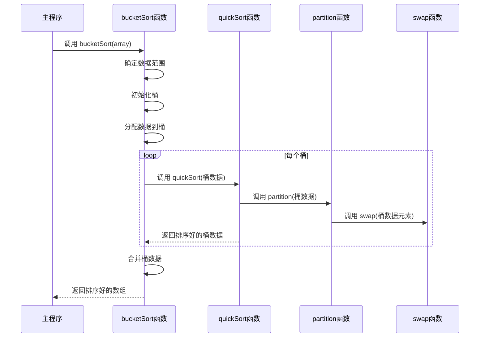
```mermaid
sequenceDiagram
    participant Main as 主程序
    participant BucketSort as bucketSort函数
    participant QuickSort as quickSort函数
    participant Partition as partition函数
    participant Swap as swap函数
    Main->>BucketSort: 调用 bucketSort(array)
    BucketSort->>BucketSort: 确定数据范围
    BucketSort->>BucketSort: 初始化桶
    BucketSort->>BucketSort: 分配数据到桶
    loop 每个桶
        BucketSort->>QuickSort: 调用 quickSort(桶数据)
        QuickSort->>Partition: 调用 partition(桶数据)
        Partition->>Swap: 调用 swap(桶数据元素)
        QuickSort-->>BucketSort: 返回排序好的桶数据
    end
    BucketSort->>BucketSort: 合并桶数据
    BucketSort-->>Main: 返回排序好的数组

```

### 5. 复杂度分析

- **空间复杂度**：桶排序需要额外的空间来存储桶和桶内的数据，空间复杂度为 $O(n)$，因此不是原地排序算法。
- **稳定性**：桶排序的稳定性取决于每个桶内部使用的排序算法。如果使用快速排序，由于快速排序是不稳定的，那么桶排序也是不稳定的；如果使用归并排序等稳定排序算法，桶排序就是稳定的。
- **时间复杂度**：
    - **最佳情况**：当输入的数据可以均匀地分配到每一个桶中时，每个桶内的元素数量大致相同。假设要排序的数据有 $n$ 个，均匀划分到 $m$ 个桶内，每个桶里有 $k = \frac{n}{m}$ 个元素。每个桶内部使用快速排序，时间复杂度为 $O(k \log k)$，$m$ 个桶排序的时间复杂度就是 $O(m \times k \log k)$，因为 $k = \frac{n}{m}$，所以整个桶排序的时间复杂度就是 $O(n \log(\frac{n}{m}))$。当桶的个数 $m$ 接近数据个数 $n$ 时，$\log(\frac{n}{m})$ 趋近于一个非常小的常量，此时桶排序的时间复杂度接近 $O(n)$。
    - **最差情况**：当输入的数据被分配到了同一个桶中时，桶排序就退化为桶内排序算法的时间复杂度。如果桶内使用快速排序，时间复杂度为 $O(n \log n)$。
    - **平均情况**：在平均情况下，数据大致均匀分布在各个桶中，桶排序的时间复杂度接近 $O(n)$。

「桶排序 Bucket Sort」是分治思想的一个典型应用。它通过设置一些具有大小顺序的桶，每个桶对应一个数据范围，将数据平均分配到各个桶中；然后，在每个桶内部分别执行排序；最终按照桶的顺序将所有数据合并。

## 11.6.1. 算法流程

考虑一个长度为 N 的数组，元素是范围 [0,1) 的浮点数。桶排序的流程如下：

1. 初始化 K 个桶，将  N个元素分配到 K 个桶中；
2. 对每个桶分别执行排序（本文采用编程语言的内置排序函数）；
3. 按照桶的从小到大的顺序，合并结果；

```jsx
/* 桶排序 */
function bucketSort(nums) {
    // 初始化 k = n/2 个桶，预期向每个桶分配 2 个元素
    const k = nums.length / 2;
    const buckets = [];
    for (let i = 0; i < k; i++) {
        buckets.push([]);
    }
    // 1. 将数组元素分配到各个桶中
    for (const num of nums) {
        // 输入数据范围 [0, 1)，使用 num * k 映射到索引范围 [0, k-1]
        const i = Math.floor(num * k);
        // 将 num 添加进桶 i
        buckets[i].push(num);
    }
    // 2. 对各个桶执行排序
    for (const bucket of buckets) {
        // 使用内置排序函数，也可以替换成其他排序算法
        bucket.sort((a, b) => a - b);
    }
    // 3. 遍历桶合并结果
    let i = 0;
    for (const bucket of buckets) {
        for (const num of bucket) {
            nums[i++] = num;
        }
    }
}
```

**桶排序的适用场景是什么？**

桶排序适用于处理体量很大的数据。例如，输入数据包含 100 万个元素，由于空间限制，系统内存无法一次性加载所有数据。此时，可以将数据分成 1000 个桶，然后分别对每个桶进行排序，最后将结果合并。

## 11.6.2. 算法特性[¶](https://www.hello-algo.com/chapter_sorting/bucket_sort/#1162)

**时间复杂度 �(�+�)** ：假设元素在各个桶内平均分布，那么每个桶内的元素数量为 �� 。假设排序单个桶使用 �(��log⁡��) 时间，则排序所有桶使用 �(�log⁡��) 时间。**当桶数量 � 比较大时，时间复杂度则趋向于 �(�)** 。合并结果时需要遍历 � 个桶，花费 �(�) 时间。

在最坏情况下，所有数据被分配到一个桶中，且排序该桶使用 �(�2) 时间，因此是“自适应排序”。

**空间复杂度 �(�+�)** ：需要借助 � 个桶和总共 � 个元素的额外空间，属于“非原地排序”。

桶排序是否稳定取决于排序桶内元素的算法是否稳定。


桶排序的时间复杂度理论上可以达到 �(�) ，**关键在于将元素均匀分配到各个桶中**，因为实际数据往往不是均匀分布的。例如，我们想要将淘宝上的所有商品按价格范围平均分配到 10 个桶中，但商品价格分布不均，低于 100 元的非常多，高于 1000 元的非常少。若将价格区间平均划分为 10 份，各个桶中的商品数量差距会非常大。

为实现平均分配，我们可以先设定一个大致的分界线，将数据粗略地分到 3 个桶中。**分配完毕后，再将商品较多的桶继续划分为 3 个桶，直至所有桶中的元素数量大致相等**。这种方法本质上是创建一个递归树，使叶节点的值尽可能平均。当然，不一定要每轮将数据划分为 3 个桶，具体划分方式可根据数据特点灵活选择。


Fig. 递归划分桶

如果我们提前知道商品价格的概率分布，**则可以根据数据概率分布设置每个桶的价格分界线**。值得注意的是，数据分布并不一定需要特意统计，也可以根据数据特点采用某种概率模型进行近似。如下图所示，我们假设商品价格服从正态分布，这样就可以合理地设定价格区间，从而将商品平均分配到各个桶中。

Fig. 根据概率分布划分桶


### 6. 适用场景

桶排序比较适合用在外部排序中。外部排序是指数据存储在外部磁盘且数据量大，但内存有限，无法将整个数据全部加载到内存中。通过将数据划分到多个桶中，可以分批处理每个桶内的数据，减少内存的使用压力。同时，当数据分布比较均匀时，桶排序可以达到线性时间复杂度，提高排序效率。

## 计数排序

### 1. 代码分析与注释完善

### 方法一

```jsx
const countingSort = array => {
    // 获取数组长度
    let len = array.length;
    // 用于存储排序后的结果
    let result = [];
    // 用于统计每个元素出现的次数
    let countArr = [];
    // 初始化最小值和最大值为数组的第一个元素
    let min = (max = array[0]);
    console.time('计数排序耗时');
    // 遍历数组，找出最小值和最大值，并统计每个元素出现的次数
    for (let i = 0; i < len; i++) {
        // 获取最小、最大值
        min = min <= array[i] ? min : array[i];
        max = max >= array[i] ? max : array[i];
        // 统计每个元素出现的次数
        countArr[array[i]] = countArr[array[i]] ? countArr[array[i]] + 1 : 1;
    }
    console.log('countArr :', countArr);
    // 从最小值到最大值，将计数逐项累加
    for (let j = min; j < max; j++) {
        countArr[j + 1] = (countArr[j + 1] || 0) + (countArr[j] || 0);
    }
    console.log('countArr 2:', countArr);
    // 反向填充数据进入 result 数组
    for (let k = len - 1; k >= 0; k--) {
        // 根据计数数组确定元素在结果数组中的位置
        result[countArr[array[k]] - 1] = array[k];
        // 减少计数数组中该元素的计数
        countArr[array[k]]--;
        console.log('result:', result);
    }
    console.timeEnd('计数排序耗时');
    return result;
};

```

### 方法二

```jsx
const countingSort2 = (arr, maxValue) => {
    console.time('计数排序耗时');
    // 如果未传入最大值，则默认为数组长度
    maxValue = maxValue || arr.length;
    // 创建一个长度为 maxValue + 1 的数组，用于统计每个元素出现的次数
    let bucket = new Array(maxValue + 1);
    // 用于记录排序后的元素在原数组中的位置
    let sortedIndex = 0;
    // 数组长度
    let arrLen = arr.length;
    // 桶数组的长度
    let bucketLen = maxValue + 1;
    // 统计每个元素出现的次数
    for (let i = 0; i < arrLen; i++) {
        if (!bucket[arr[i]]) {
            bucket[arr[i]] = 0;
        }
        bucket[arr[i]]++;
    }
    // 将桶中的元素按顺序放回原数组
    for (let j = 0; j < bucketLen; j++) {
        while (bucket[j] > 0) {
            arr[sortedIndex++] = j;
            bucket[j]--;
        }
    }
    console.timeEnd('计数排序耗时');
    return arr;
};

```

### 2. 计数排序原理

计数排序的核心思想是通过统计每个元素出现的次数，然后根据统计结果将元素依次放回原数组，从而实现排序。具体步骤如下：

1. **找出最大和最小元素**：遍历待排序数组，找出其中的最大值和最小值，确定数据的范围。
2. **统计元素出现次数**：创建一个计数数组，数组的下标对应待排序数组中的元素值，数组的值表示该元素出现的次数。
3. **累加计数**：对计数数组进行累加操作，使得每个元素的值表示小于等于该元素的元素个数。
4. **反向填充目标数组**：从后往前遍历待排序数组，根据计数数组确定每个元素在排序后数组中的位置，并将其放入相应位置，同时更新计数数组。

### 3. Mermaid 流程图

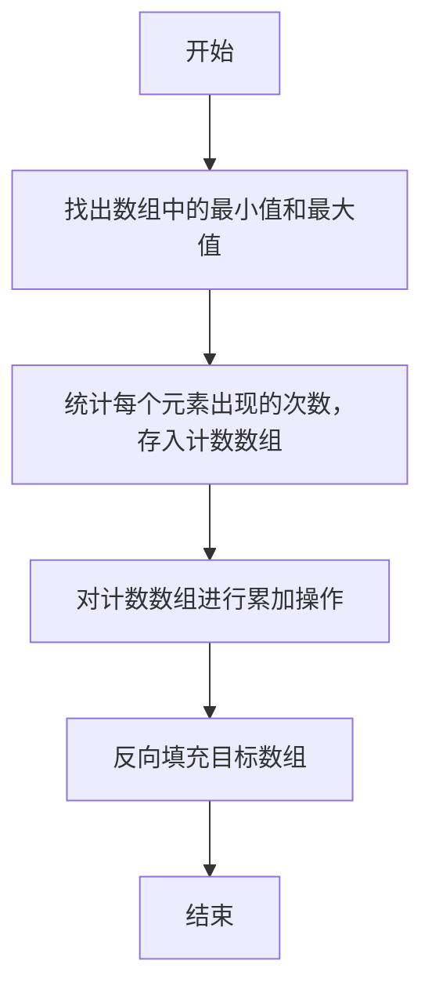
```mermaid
graph TD;
    A[开始] --> B[找出数组中的最小值和最大值];
    B --> C[统计每个元素出现的次数，存入计数数组];
    C --> D[对计数数组进行累加操作];
    D --> E[反向填充目标数组];
    E --> F[结束];

```

### 4. Mermaid 时序图

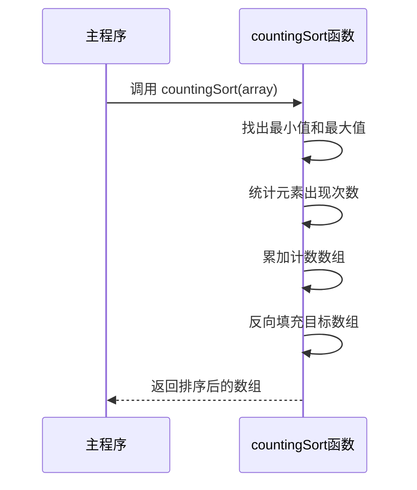
```mermaid
sequenceDiagram
    participant Main as 主程序
    participant CountingSort as countingSort函数
    Main->>CountingSort: 调用 countingSort(array)
    CountingSort->>CountingSort: 找出最小值和最大值
    CountingSort->>CountingSort: 统计元素出现次数
    CountingSort->>CountingSort: 累加计数数组
    CountingSort->>CountingSort: 反向填充目标数组
    CountingSort-->>Main: 返回排序后的数组

```

### 5. 复杂度分析

- **空间复杂度**：计数排序需要额外的空间来存储计数数组，其空间复杂度为 $O(k)$，其中 $k$ 是数据的范围（最大值与最小值的差值加 1）。因此，计数排序不是原地排序算法。
- **稳定性**：在反向填充目标数组时，我们从后往前遍历待排序数组，保证了相同元素的相对顺序不变，所以计数排序是稳定的排序算法。
- **时间复杂度**：计数排序主要包括统计元素出现次数、累加计数数组和反向填充目标数组三个步骤，每个步骤的时间复杂度都是 $O(n)$ 或 $O(k)$，因此总的时间复杂度为 $O(n + k)$，其中 $n$ 是待排序数组的长度，$k$ 是数据的范围。最佳情况、最差情况和平均情况的时间复杂度都是 $O(n + k)$。

### 6. 适用场景

计数排序适用于数据范围不大的场景，特别是当数据范围 $k$ 与待排序数据的数量 $n$ 相比较小时，计数排序可以达到线性时间复杂度 $O(n + k)$，效率非常高。但如果数据范围 $k$ 比 $n$ 大很多，计数排序需要的额外空间会很多，就不太适用了。此外，计数排序只能处理非负整数，如果要处理其他类型的数据，需要在不改变相对大小的情况下将其转换为非负整数。


先来看一个简单的例子。给定一个长度为 的数组 `nums` ，其中的元素都是“非负整数”。计数排序的整体流程如下：

1. 遍历数组，找出数组中的最大数字，记为 ，然后创建一个长度为 的辅助数组 `counter` ；
2. **借助 `counter` 统计 `nums` 中各数字的出现次数**，其中 `counter[num]` 对应数字 `num` 的出现次数。统计方法很简单，只需遍历 `nums`（设当前数字为 `num`），每轮将 `counter[num]` 增加 即可。
3. **由于 `counter` 的各个索引天然有序，因此相当于所有数字已经被排序好了**。接下来，我们遍历 `counter` ，根据各数字的出现次数，将它们按从小到大的顺序填入 `nums` 即可。


```jsx
/* 计数排序 */
// 简单实现，无法用于排序对象
function countingSortNaive(nums) {
    // 1. 统计数组最大元素 m
    let m = 0;
    for (const num of nums) {
        m = Math.max(m, num);
    }
    // 2. 统计各数字的出现次数
    // counter[num] 代表 num 的出现次数
    const counter = new Array(m + 1).fill(0);
    for (const num of nums) {
        counter[num]++;
    }
    // 3. 遍历 counter ，将各元素填入原数组 nums
    let i = 0;
    for (let num = 0; num < m + 1; num++) {
        for (let j = 0; j < counter[num]; j++, i++) {
            nums[i] = num;
        }
    }
}
```

**计数排序与桶排序的联系**

从桶排序的角度看，我们可以将计数排序中的计数数组 `counter` 的每个索引视为一个桶，将统计数量的过程看作是将各个元素分配到对应的桶中。本质上，计数排序是桶排序在整型数据下的一个特例。


细心的同学可能发现，**如果输入数据是对象，上述步骤 `3.` 就失效了**。例如，输入数据是商品对象，我们想要按照商品价格（类的成员变量）对商品进行排序，而上述算法只能给出价格的排序结果。

那么如何才能得到原数据的排序结果呢？我们首先计算 `counter` 的「前缀和」。顾名思义，索引 `i` 处的前缀和 `prefix[i]` 等于数组前 `i` 个元素之和，即

**前缀和具有明确的意义，`prefix[num] - 1` 代表元素 `num` 在结果数组 `res` 中最后一次出现的索引**。这个信息非常关键，因为它告诉我们各个元素应该出现在结果数组的哪个位置。接下来，我们倒序遍历原数组 `nums` 的每个元素 `num` ，在每轮迭代中执行：

1. 将 `num` 填入数组 `res` 的索引 `prefix[num] - 1` 处；
2. 令前缀和 `prefix[num]` 减小 ，从而得到下次放置 `num` 的索引；

遍历完成后，数组 `res` 中就是排序好的结果，最后使用 `res` 覆盖原数组 `nums` 即可。

```jsx
/* 计数排序 */
// 完整实现，可排序对象，并且是稳定排序
function countingSort(nums) {
    // 1. 统计数组最大元素 m
    let m = 0;
    for (const num of nums) {
        m = Math.max(m, num);
    }
    // 2. 统计各数字的出现次数
    // counter[num] 代表 num 的出现次数
    const counter = new Array(m + 1).fill(0);
    for (const num of nums) {
        counter[num]++;
    }
    // 3. 求 counter 的前缀和，将“出现次数”转换为“尾索引”
    // 即 counter[num]-1 是 num 在 res 中最后一次出现的索引
    for (let i = 0; i < m; i++) {
        counter[i + 1] += counter[i];
    }
    // 4. 倒序遍历 nums ，将各元素填入结果数组 res
    // 初始化数组 res 用于记录结果
    const n = nums.length;
    const res = new Array(n);
    for (let i = n - 1; i >= 0; i--) {
        const num = nums[i];
        res[counter[num] - 1] = num; // 将 num 放置到对应索引处
        counter[num]--; // 令前缀和自减 1 ，得到下次放置 num 的索引
    }
    // 使用结果数组 res 覆盖原数组 nums
    for (let i = 0; i < n; i++) {
        nums[i] = res[i];
    }
}
```