## 贪心算法基本概念

贪心算法（Greedy Algorithm）是一种在每一步选择中都采取在当前状态下最好或最优（即最有利）的选择，从而希望导致结果是全局最好或最优的算法策略。它并不从整体最优上加以考虑，它所作出的选择只是在某种意义上的局部最优选择。

### 核心思想
贪心算法的核心思想可以概括为“目光短浅”，它在做决策时总是追求当前这一步的局部最优解。它期望通过一系列的局部最优选择，最终能够得到问题的全局最优解。然而，这并不总是成立的，贪心算法得到的解有时可能不是全局最优解， even not feasible.

### 特点
1.  **简单高效**：贪心算法通常比较简单，易于实现，且时间复杂度较低，执行效率高。
2.  **局部最优**：每一步都做出当前看起来最好的选择。
3.  **不一定全局最优**：贪心选择可能导致最终结果并非全局最优。对于某些问题，贪心算法可以得到全局最优解，但对于另一些问题则不能。
4.  **无回溯**：贪心算法一旦做出选择，就不会改变这个选择（即没有回溯过程）。

### 适用条件
贪心算法并非对所有问题都适用。使用贪心策略的问题通常需要满足以下两个重要性质：

1.  **贪心选择性质 (Greedy Choice Property)**：
    一个全局最优解可以通过局部最优（贪心）选择来达到。也就是说，我们所做的当前选择必须是某个全局最优解的一部分，而无需考虑之前做出的选择或之后可能做出的选择。

2.  **最优子结构性质 (Optimal Substructure Property)**：
    一个问题的最优解包含其子问题的最优解。这意味着如果我们将原问题分解为子问题，那么原问题的最优解可以通过子问题的最优解来构造。

### 应用场景
贪心算法常用于解决一些优化问题，例如：
*   霍夫曼编码 (Huffman Coding)
*   最小生成树算法 (Prim's Algorithm, Kruskal's Algorithm)
*   单源最短路径算法 (Dijkstra's Algorithm)
*   活动选择问题
*   部分背包问题

在接下来的内容中，我们将通过具体的例子和题目来进一步理解和应用贪心算法。

### 贪心算法的工作原理


1. **初始状态**：
   - 从问题的初始状态开始，这是开始做选择的起点。

2. **评估选择**：
   - 评估当前状态下所有可能的选择。
   - 考虑在特定时刻可用的所有选项。

3. **贪心选择**：
   - 选择当前看起来最优的选项，而不考虑未来的后果。
   - 这就是"贪心"的含义 - 选择当前最佳选项，即使它可能不是长远来看的最佳选择。

4. **状态转移**：
   - 基于选择的选项移动到新的状态。
   - 这成为下一次迭代的新起点。

5. **重复过程**：
   - 重复步骤2-4，直到达到目标状态或无法继续前进。
   - 持续做出局部最优选择，直到问题结束或无法继续。


给定一组硬币面值 [1, 2, 5, 10]，需要找零39元，要求使用最少的硬币数量。

贪心策略的解决过程：
1. 选择不超过当前金额的最大面值硬币：
   - 第一步：选择10元（≤39），剩余29元，使用3个10元
   - 第二步：选择5元（≤29），剩余4元，使用1个5元
   - 第三步：选择2元（≤4），剩余2元，使用2个2元
   - 第四步：选择2元（≤2），剩余0元，使用1个2元

最终解决方案：使用7个硬币（3个10元 + 1个5元 + 2个2元）

### 贪心算法的局限性
需要注意的是，贪心算法并不总是能得到最优解 例如：

假设有一个找零问题，硬币面值为 [18, 1, 10]，需要找零20元：
- 贪心算法会先选择18元（最大面值），然后需要2个1元，共使用3个硬币
- 但最优解是使用2个10元，只需要2个硬币

这个例子说明了贪心算法可能会错过全局最优解。因此，在使用贪心算法之前，需要仔细分析问题是否满足贪心选择性质和最优子结构性质。

### 贪心算法的效率
贪心算法相比于其他算法（如动态规划）通常具有以下优势

1. **实现简单**：
   - 算法逻辑直观
   - 代码实现相对容易

2. **时间效率高**：
   - 不需要考虑所有可能的解
   - 每一步只需要做出当前最优选择
   - 通常具有较低的时间复杂度

3. **空间效率好**：
   - 不需要存储中间状态
   - 通常只需要常数级的额外空间

4. **适用于大规模问题**：
   - 对于某些NP难问题，可以用贪心算法得到近似解
   - 例如：旅行商问题中，可以每次选择最近的未访问城市

### 原理题目解析

### 问题描述

我们要解决的是集合覆盖问题，即给定一些广播台及其覆盖的地区，需要选择最少的广播台，使得所有地区都能被覆盖。由于使用穷举法的时间复杂度会随着广播台数量的增加而急剧上升，所以采用贪心算法来近似求解。

### 贪心算法思路

1. **确定所有需要覆盖的地区**：将所有广播台覆盖的地区去重，得到一个包含所有需要覆盖地区的集合 `allAreas`。
2. **选择覆盖最多未覆盖地区的广播台**：遍历所有广播台，计算每个广播台覆盖的未覆盖地区的数量，选择覆盖数量最多的广播台。
3. **更新状态**：将选择的广播台加入已选择的集合 `selects`，并从 `allAreas` 中移除该广播台覆盖的地区。
4. **重复步骤2和3**：直到 `allAreas` 为空，即所有地区都被覆盖。

### Mermaid 流程图

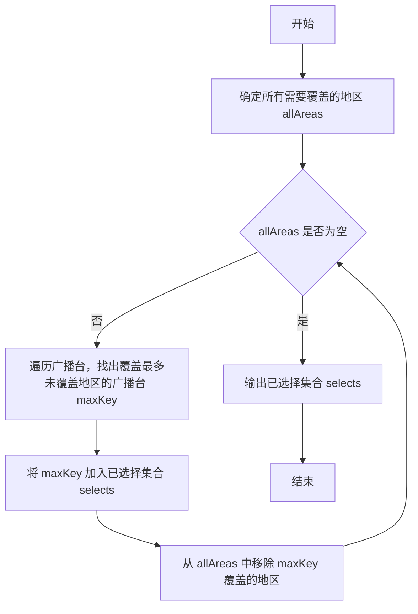
```mermaid
graph TD
    A[开始] --> B[确定所有需要覆盖的地区 allAreas]
    B --> C{allAreas 是否为空}
    C -- 否 --> D[遍历广播台，找出覆盖最多未覆盖地区的广播台 maxKey]
    D --> E[将 maxKey 加入已选择集合 selects]
    E --> F[从 allAreas 中移除 maxKey 覆盖的地区]
    F --> C
    C -- 是 --> G[输出已选择集合 selects]
    G --> H[结束]

```

### Mermaid 时序图

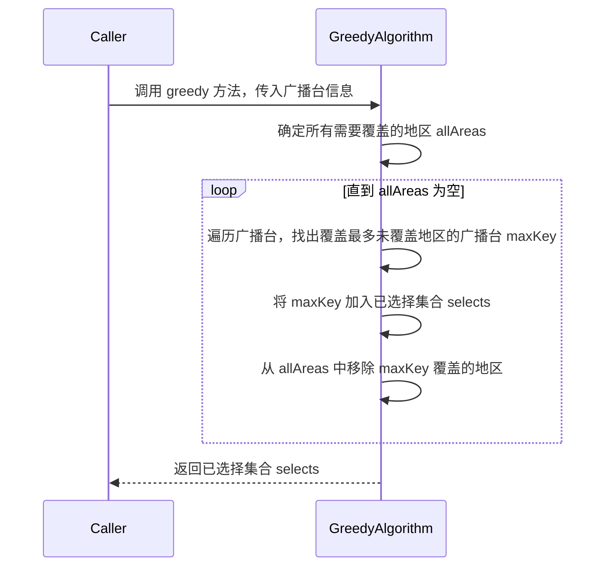
```mermaid
sequenceDiagram
    participant Caller
    participant GreedyAlgorithm
    Caller ->> GreedyAlgorithm: 调用 greedy 方法，传入广播台信息
    GreedyAlgorithm ->> GreedyAlgorithm: 确定所有需要覆盖的地区 allAreas
    loop 直到 allAreas 为空
        GreedyAlgorithm ->> GreedyAlgorithm: 遍历广播台，找出覆盖最多未覆盖地区的广播台 maxKey
        GreedyAlgorithm ->> GreedyAlgorithm: 将 maxKey 加入已选择集合 selects
        GreedyAlgorithm ->> GreedyAlgorithm: 从 allAreas 中移除 maxKey 覆盖的地区
    end
    GreedyAlgorithm -->> Caller: 返回已选择集合 selects

```

### JavaScript 代码实现

```jsx
// 构建广播电台 与 覆盖的地区
function buildBroadcasts() {
    const broadcasts = {};
    const k1 = new Set(["北京", "上海", "天津"]);
    const k2 = new Set(["广州", "北京", "深圳"]);
    const k3 = new Set(["成都", "上海", "杭州"]);
    const k4 = new Set(["上海", "天津"]);
    const k5 = new Set(["杭州", "大连"]);

    broadcasts["k1"] = k1;
    broadcasts["k2"] = k2;
    broadcasts["k3"] = k3;
    broadcasts["k4"] = k4;
    broadcasts["k5"] = k5;

    return broadcasts;
}

// 贪心算法: 选择最少的电台，覆盖所有的地区
function greedy(broadcasts) {
    // 构建待覆盖的所有地区
    const allAreas = new Set();
    for (const areas of Object.values(broadcasts)) {
        for (const area of areas) {
            allAreas.add(area);
        }
    }
    console.log("需要覆盖的地区：", [...allAreas]);

    // 存放已选择的电台
    const selects = new Set();

    let maxKey = null; // 当次覆盖地区最多的电台
    let maxKeyCoverNum = 0; // maxKey 覆盖的数量
    const temp = new Set();  // 临时变量，用于计算电台中的覆盖地区：在要未覆盖地区中  覆盖的数量
    while (allAreas.size > 0) {
        // 选择出当次还未选择中：覆盖地区最多的电台
        for (const key in broadcasts) {
            const areas = broadcasts[key];
            for (const area of areas) {
                temp.add(area);
            }
            // 计算交集
            const intersection = new Set([...temp].filter(area => allAreas.has(area)));
            // 如果：当前尝试选择的电台，覆盖数量比 maxKey 还大，则把它设置为 maxKey
            if (intersection.size > 0 && intersection.size > maxKeyCoverNum) {
                maxKey = key;
                maxKeyCoverNum = intersection.size;
            }
            temp.clear();
        }
        if (maxKey === null) {
            continue;
        }
        // 循环完成后，找到了本轮的 maxKey
        // 添加到已选择列表中，并且从 未覆盖列表 中删除已经覆盖过的地区
        selects.add(maxKey);
        for (const area of broadcasts[maxKey]) {
            allAreas.delete(area);
        }
        // 清空临时变量，方便下次查找
        maxKey = null;
        maxKeyCoverNum = 0;
    }
    return selects;
}

// 测试代码
const broadcasts = buildBroadcasts();
console.log("电台列表", broadcasts);
const result = greedy(broadcasts);
console.log("选择好的电台列表：", [...result]);

```

### 复杂度分析

- **时间复杂度**：$O(n * m)$，其中 $n$ 是广播台的数量，$m$ 是所有广播台覆盖地区的总数量。在每次循环中，需要遍历所有广播台，并计算每个广播台覆盖的未覆盖地区的数量。
- **空间复杂度**：$O(m)$，主要用于存储所有需要覆盖的地区和临时集合。

# 贪心算法的简单问题：


### 原理题目解析

### 问题描述

我们的目标是将一个正整数 `n` 拆分成若干个合数，并且要使得拆分出的合数数量尽可能多。合数是指除了能被 1 和本身整除外，还能被其他数（0 除外）整除的自然数。

### 贪心算法思路

由于我们要让拆分出的合数数量最大，我们应该优先选择尽可能小的合数进行拆分。最小的合数是 4，其次是 6 和 9 等。所以我们的贪心策略是：

1. 尽可能多地使用 4 进行拆分。
2. 如果剩余的数不能再拆分成 4 时，尝试用 6 或 9 等其他合数来处理剩余的数。因为 4 是最小的合数，使用它能让拆分的数量更多。
3. 不断重复上述步骤，直到 `n` 被拆分完。

### Mermaid 流程图

```mermaid
graph TD
    A[开始] --> B{ n 是否小于 4 }
    B -- 是 --> C[无法拆分，输出 0]
    B -- 否 --> D[初始化合数数量 count 为 0]
    D --> E{ n 是否能被 4 整除 }
    E -- 是 --> F[count = n / 4，输出 count]
    E -- 否 --> G{ n 减去一个 6 后是否能被 4 整除 }
    G -- 是 --> H[count = (n - 6) / 4 + 1，输出 count]
    G -- 否 --> I{ n 减去一个 9 后是否能被 4 整除 }
    I -- 是 --> J[count = (n - 9) / 4 + 1，输出 count]
    I -- 否 --> K[无法拆分，输出 0]

```

### Mermaid 时序图

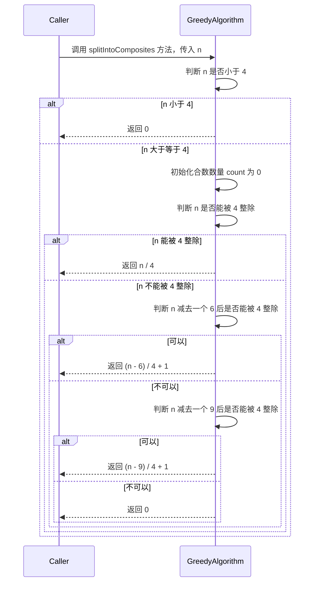
```mermaid
sequenceDiagram
    participant Caller
    participant GreedyAlgorithm
    Caller ->> GreedyAlgorithm: 调用 splitIntoComposites 方法，传入 n
    GreedyAlgorithm ->> GreedyAlgorithm: 判断 n 是否小于 4
    alt n 小于 4
        GreedyAlgorithm -->> Caller: 返回 0
    else n 大于等于 4
        GreedyAlgorithm ->> GreedyAlgorithm: 初始化合数数量 count 为 0
        GreedyAlgorithm ->> GreedyAlgorithm: 判断 n 是否能被 4 整除
        alt n 能被 4 整除
            GreedyAlgorithm -->> Caller: 返回 n / 4
        else n 不能被 4 整除
            GreedyAlgorithm ->> GreedyAlgorithm: 判断 n 减去一个 6 后是否能被 4 整除
            alt 可以
                GreedyAlgorithm -->> Caller: 返回 (n - 6) / 4 + 1
            else 不可以
                GreedyAlgorithm ->> GreedyAlgorithm: 判断 n 减去一个 9 后是否能被 4 整除
                alt 可以
                    GreedyAlgorithm -->> Caller: 返回 (n - 9) / 4 + 1
                else 不可以
                    GreedyAlgorithm -->> Caller: 返回 0
                end
            end
        end
    end

```

### JavaScript 代码实现

```jsx
function splitIntoComposites(n) {
    // 如果 n 小于 4，无法拆分成合数，直接返回 0
    if (n < 4) {
        return 0;
    }
    // 优先尝试用 4 拆分
    if (n % 4 === 0) {
        return n / 4;
    }
    // 尝试减去一个 6 后看是否能被 4 整除
    if ((n - 6) % 4 === 0) {
        return (n - 6) / 4 + 1;
    }
    // 尝试减去一个 9 后看是否能被 4 整除
    if ((n - 9) % 4 === 0) {
        return (n - 9) / 4 + 1;
    }
    // 无法拆分，返回 0
    return 0;
}

// 测试代码
const n = 14;
const result = splitIntoComposites(n);
console.log(`将 ${n} 拆分成最大合数的数量是: ${result}`);

```

### 复杂度分析

- **时间复杂度**：$O(1)$，因为只进行了固定次数的判断，不随输入 `n` 的增大而增加额外的计算步骤。
- **空间复杂度**：$O(1)$，只使用了常数级的额外空间来存储变量，如 `count` 等。

### 原理题目解析

### 问题描述

在一个股票交易场景中，存在这样的规则：在第 `i` 天可以购买 `i` 只股票（`i` 从 1 开始计数）。同时，每天股票有对应的价格，存储在一个数组中。我们需要在给定一定金额的情况下，计算出能够购买到的最大股票数量。

### 贪心算法思路

为了购买到最多的股票，我们应该优先选择价格较低的股票进行购买。具体步骤如下：

1. 将每天的股票价格和对应的天数信息组合成一个数组，方便后续排序。
2. 按照股票价格对数组进行排序，价格低的排在前面。
3. 遍历排序后的数组，对于每一天：
    - 计算在当前金额下，按照当天的价格和可购买数量，最多能购买多少只股票。
    - 更新剩余金额和已购买的股票总数。
4. 重复步骤 3，直到金额不足以购买任何股票或者遍历完所有天数。

### Mermaid 流程图

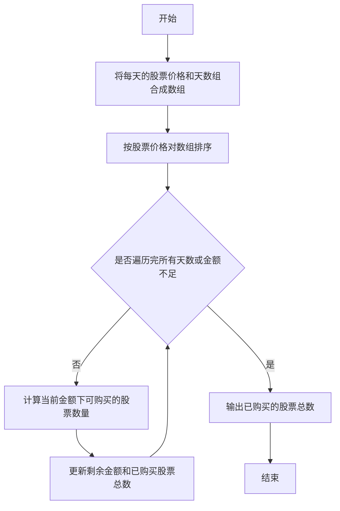
```mermaid
graph TD
    A[开始] --> B[将每天的股票价格和天数组合成数组]
    B --> C[按股票价格对数组排序]
    C --> D{是否遍历完所有天数或金额不足}
    D -- 否 --> E[计算当前金额下可购买的股票数量]
    E --> F[更新剩余金额和已购买股票总数]
    F --> D
    D -- 是 --> G[输出已购买的股票总数]
    G --> H[结束]

```

### Mermaid 时序图

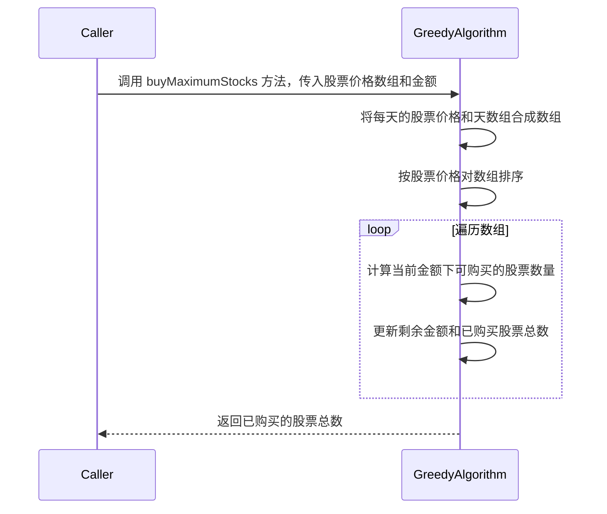
```mermaid
sequenceDiagram
    participant Caller
    participant GreedyAlgorithm
    Caller ->> GreedyAlgorithm: 调用 buyMaximumStocks 方法，传入股票价格数组和金额
    GreedyAlgorithm ->> GreedyAlgorithm: 将每天的股票价格和天数组合成数组
    GreedyAlgorithm ->> GreedyAlgorithm: 按股票价格对数组排序
    loop 遍历数组
        GreedyAlgorithm ->> GreedyAlgorithm: 计算当前金额下可购买的股票数量
        GreedyAlgorithm ->> GreedyAlgorithm: 更新剩余金额和已购买股票总数
    end
    GreedyAlgorithm -->> Caller: 返回已购买的股票总数

```

### JavaScript 代码实现

```jsx
function buyMaximumStocks(prices, amount) {
    const n = prices.length;
    // 组合每天的股票价格和天数
    const priceDayPairs = [];
    for (let i = 0; i < n; i++) {
        priceDayPairs.push([prices[i], i + 1]);
    }
    // 按股票价格排序
    priceDayPairs.sort((a, b) => a[0] - b[0]);

    let totalStocks = 0;
    // 遍历排序后的数组
    for (const [price, day] of priceDayPairs) {
        // 计算当前金额下可购买的股票数量
        const canBuy = Math.min(Math.floor(amount / price), day);
        if (canBuy > 0) {
            // 更新剩余金额
            amount -= canBuy * price;
            // 更新已购买的股票总数
            totalStocks += canBuy;
        }
        if (amount <= 0) {
            break;
        }
    }
    return totalStocks;
}

// 测试代码
const prices = [10, 7, 19];
const amount = 45;
const result = buyMaximumStocks(prices, amount);
console.log(`在金额 ${amount} 下能购买的最大股票数量是: ${result}`);

```

### 复杂度分析

- **时间复杂度**：$O(n log n)$，主要是排序操作的时间复杂度，其中 `n` 是天数。
- **空间复杂度**：$O(n)$，用于存储每天的股票价格和天数的组合数组。

### 原理题目解析

### 问题描述

给定一组糖果的价格数组，以及一个促销规则：每购买 `k` 颗糖果，就可以免费获得 `k` 颗糖果。我们需要计算购买所有 `N` 颗糖果所需的最小金额和最大金额。

### 贪心算法思路

- **计算最小金额**：
    - 为了使购买所有糖果的金额最小，我们应该优先购买价格较低的糖果。因为每购买 `k` 颗糖果可以免费获得 `k` 颗糖果，所以我们先对糖果价格数组进行升序排序。
    - 然后从价格最低的糖果开始购买，在购买过程中利用免费获取糖果的规则，尽可能多地免费得到糖果，从而减少购买的成本。
- **计算最大金额**：
    - 要使购买所有糖果的金额最大，我们应该优先购买价格较高的糖果。所以对糖果价格数组进行降序排序。
    - 同样利用免费获取糖果的规则，从价格最高的糖果开始购买，这样会使得最终花费的金额最大。

### Mermaid 流程图

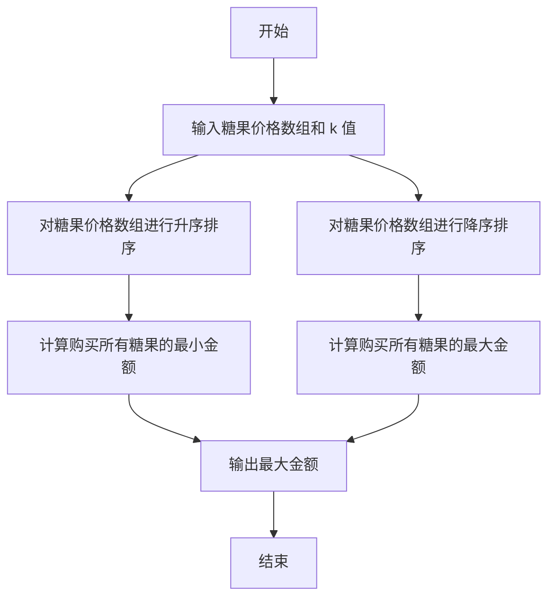
```mermaid
graph TD
    A[开始] --> B[输入糖果价格数组和 k 值]
    B --> C[对糖果价格数组进行升序排序]
    C --> D[计算购买所有糖果的最小金额]
    B --> E[对糖果价格数组进行降序排序]
    E --> F[计算购买所有糖果的最大金额]
    D --> G[输出最小金额]
    F --> G[输出最大金额]
    G --> H[结束]

```

### Mermaid 时序图

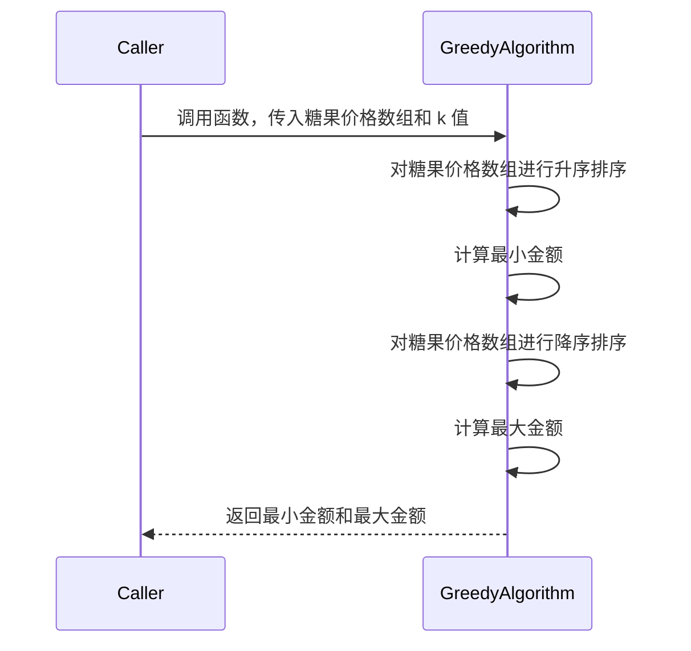
```mermaid
sequenceDiagram
    participant Caller
    participant GreedyAlgorithm
    Caller ->> GreedyAlgorithm: 调用函数，传入糖果价格数组和 k 值
    GreedyAlgorithm ->> GreedyAlgorithm: 对糖果价格数组进行升序排序
    GreedyAlgorithm ->> GreedyAlgorithm: 计算最小金额
    GreedyAlgorithm ->> GreedyAlgorithm: 对糖果价格数组进行降序排序
    GreedyAlgorithm ->> GreedyAlgorithm: 计算最大金额
    GreedyAlgorithm -->> Caller: 返回最小金额和最大金额

```

### JavaScript 代码实现

```jsx
function findMinMaxAmount(costs, k) {
    const n = costs.length;
    // 计算最小金额
    let minAmount = 0;
    const sortedCostsAsc = [...costs].sort((a, b) => a - b);
    let i = 0;
    let j = n - 1;
    while (i <= j) {
        minAmount += sortedCostsAsc[i];
        i++;
        j -= k;
    }

    // 计算最大金额
    let maxAmount = 0;
    const sortedCostsDesc = [...costs].sort((a, b) => b - a);
    i = 0;
    j = n - 1;
    while (i <= j) {
        maxAmount += sortedCostsDesc[i];
        i++;
        j -= k;
    }

    return [minAmount, maxAmount];
}

// 测试代码
const costs = [3, 2, 1, 4];
const k = 2;
const [minAmount, maxAmount] = findMinMaxAmount(costs, k);
console.log(`购买所有糖果的最小金额是: ${minAmount}`);
console.log(`购买所有糖果的最大金额是: ${maxAmount}`);

```

### 复杂度分析

- **时间复杂度**：$O(n log n)$，主要是排序操作的时间复杂度，其中 `n` 是糖果的数量。
- **空间复杂度**：$O(n)$，主要是复制数组所需的额外空间。

### 原理题目解析

### 问题描述

给定三个栈（可以用数组模拟），我们的目标是找到一种方式，使得三个栈中元素的和相等，并且这个相等的和要尽可能大。每个栈中的元素是正整数，我们可以从栈的顶部（数组的开头）移除元素。

### 贪心算法思路

为了让三个栈的和相等且最大，我们需要不断调整每个栈的元素和，让它们逐渐接近。具体步骤如下：

1. 首先计算三个栈各自的元素总和 `sum1`、`sum2` 和 `sum3`。
2. 比较这三个总和的大小。如果它们不相等，我们需要从总和最大的栈中移除栈顶元素，然后重新计算该栈的总和。
3. 重复步骤 2，直到三个栈的总和相等，或者其中一个栈为空。因为每次移除的是最大总和栈的栈顶元素，所以当三个栈总和相等时，这个相等的和就是最大可能的和。

### Mermaid 流程图

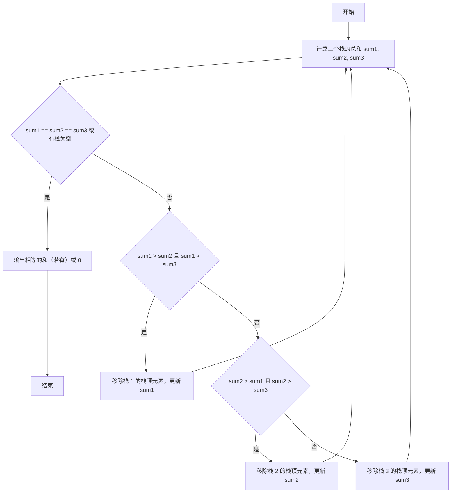
```mermaid
graph TD
    A[开始] --> B[计算三个栈的总和 sum1, sum2, sum3]
    B --> C{sum1 == sum2 == sum3 或有栈为空}
    C -- 是 --> D[输出相等的和（若有）或 0]
    C -- 否 --> E{sum1 > sum2 且 sum1 > sum3}
    E -- 是 --> F[移除栈 1 的栈顶元素，更新 sum1]
    E -- 否 --> G{sum2 > sum1 且 sum2 > sum3}
    G -- 是 --> H[移除栈 2 的栈顶元素，更新 sum2]
    G -- 否 --> I[移除栈 3 的栈顶元素，更新 sum3]
    F --> B
    H --> B
    I --> B
    D --> J[结束]

```

### Mermaid 时序图

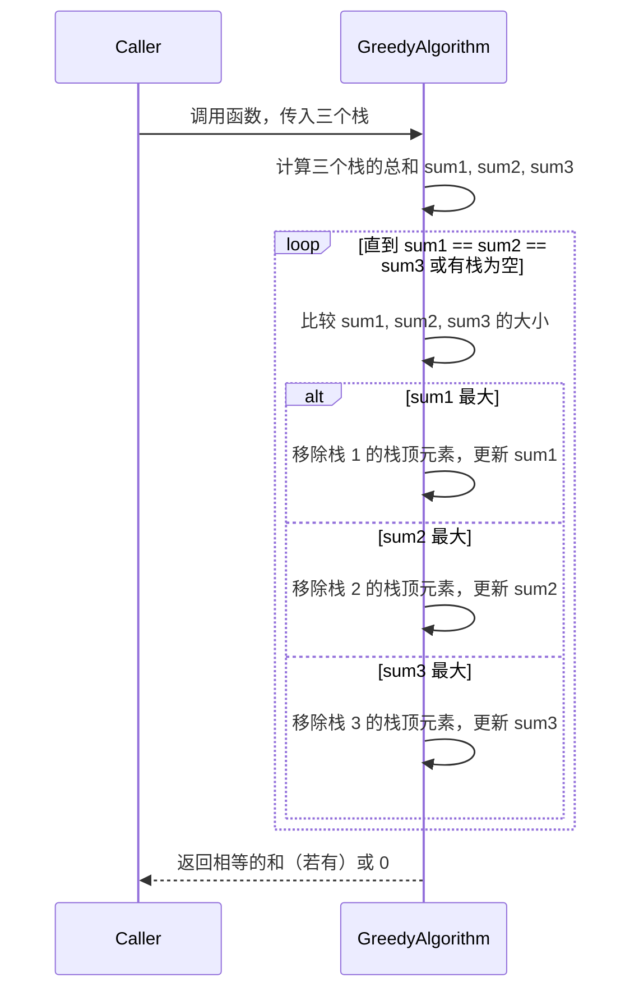
```mermaid
sequenceDiagram
    participant Caller
    participant GreedyAlgorithm
    Caller ->> GreedyAlgorithm: 调用函数，传入三个栈
    GreedyAlgorithm ->> GreedyAlgorithm: 计算三个栈的总和 sum1, sum2, sum3
    loop 直到 sum1 == sum2 == sum3 或有栈为空
        GreedyAlgorithm ->> GreedyAlgorithm: 比较 sum1, sum2, sum3 的大小
        alt sum1 最大
            GreedyAlgorithm ->> GreedyAlgorithm: 移除栈 1 的栈顶元素，更新 sum1
        else sum2 最大
            GreedyAlgorithm ->> GreedyAlgorithm: 移除栈 2 的栈顶元素，更新 sum2
        else sum3 最大
            GreedyAlgorithm ->> GreedyAlgorithm: 移除栈 3 的栈顶元素，更新 sum3
        end
    end
    GreedyAlgorithm -->> Caller: 返回相等的和（若有）或 0

```

### JavaScript 代码实现

```jsx
function maxEqualSum(stack1, stack2, stack3) {
    // 计算三个栈的初始总和
    let sum1 = stack1.reduce((acc, val) => acc + val, 0);
    let sum2 = stack2.reduce((acc, val) => acc + val, 0);
    let sum3 = stack3.reduce((acc, val) => acc + val, 0);

    let i = 0, j = 0, k = 0;

    while (true) {
        // 如果三个栈的总和相等，返回该总和
        if (sum1 === sum2 && sum2 === sum3) {
            return sum1;
        }
        // 如果有栈为空，无法再调整，返回 0
        if (i === stack1.length || j === stack2.length || k === stack3.length) {
            return 0;
        }
        // 找出总和最大的栈，并移除栈顶元素
        if (sum1 >= sum2 && sum1 >= sum3) {
            sum1 -= stack1[i];
            i++;
        } else if (sum2 >= sum1 && sum2 >= sum3) {
            sum2 -= stack2[j];
            j++;
        } else {
            sum3 -= stack3[k];
            k++;
        }
    }
}

// 测试代码
const stack1 = [3, 2, 1, 1, 1];
const stack2 = [4, 3, 2];
const stack3 = [1, 1, 4, 1];
const result = maxEqualSum(stack1, stack2, stack3);
console.log(`三个栈能达到的最大相等总和是: ${result}`);

```

### 复杂度分析

- **时间复杂度**：$O(n1 + n2 + n3)$，其中 `n1`、`n2` 和 `n3` 分别是三个栈的长度。因为在最坏情况下，我们需要遍历完所有栈的元素。
- **空间复杂度**：$O(1)$，只使用了常数级的额外空间来存储总和和索引。

### 原理题目解析

### 问题描述

给定一个长方体，其长、宽、高分别为 \(l\)、\(w\)、\(h\)，我们的目标是将这个长方体分割成若干个立方体，并且要使得这些立方体的体积之和达到最大。

### 贪心算法思路

为了使分割出的立方体体积之和最大，我们应该尽可能地分割出边长较大的立方体。具体做法是每次都选择长方体最短的边作为分割出的立方体的边长，然后不断更新剩余长方体的长、宽、高，重复这个过程，直到长方体被完全分割完。

### Mermaid 流程图

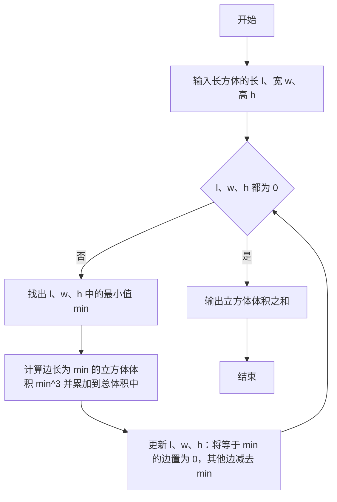
```mermaid
graph TD
    A[开始] --> B[输入长方体的长 l、宽 w、高 h]
    B --> C{l、w、h 都为 0}
    C -- 是 --> D[输出立方体体积之和]
    C -- 否 --> E[找出 l、w、h 中的最小值 min]
    E --> F[计算边长为 min 的立方体体积 min^3 并累加到总体积中]
    F --> G[更新 l、w、h：将等于 min 的边置为 0，其他边减去 min]
    G --> C
    D --> H[结束]

```

### Mermaid 时序图

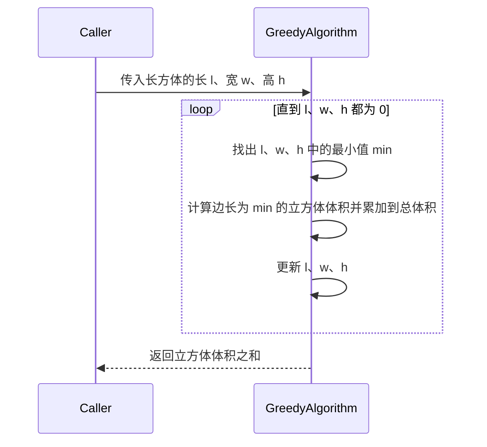
```mermaid
sequenceDiagram
    participant Caller
    participant GreedyAlgorithm
    Caller ->> GreedyAlgorithm: 传入长方体的长 l、宽 w、高 h
    loop 直到 l、w、h 都为 0
        GreedyAlgorithm ->> GreedyAlgorithm: 找出 l、w、h 中的最小值 min
        GreedyAlgorithm ->> GreedyAlgorithm: 计算边长为 min 的立方体体积并累加到总体积
        GreedyAlgorithm ->> GreedyAlgorithm: 更新 l、w、h
    end
    GreedyAlgorithm -->> Caller: 返回立方体体积之和

```

### JavaScript 代码实现

```jsx
function maxVolumeSum(l, w, h) {
    let totalVolume = 0;
    while (l > 0 || w > 0 || h > 0) {
        // 找出长、宽、高中的最小值
        let min = Math.min(l, w, h);
        // 计算当前立方体的体积并累加到总体积中
        totalVolume += Math.pow(min, 3);
        // 更新长、宽、高
        if (l === min) {
            l = 0;
        } else {
            l -= min;
        }
        if (w === min) {
            w = 0;
        } else {
            w -= min;
        }
        if (h === min) {
            h = 0;
        } else {
            h -= min;
        }
    }
    return totalVolume;
}

// 测试代码
const length = 4;
const width = 3;
const height = 2;
const result = maxVolumeSum(length, width, height);
console.log(`将长方体分成立方体后体积之和的最大值是: ${result}`);

```

### 复杂度分析

- **时间复杂度**：最坏情况下为 \(O(\max(l, w, h))\)，因为每次分割后至少会将其中一条边减少一个单位，直到所有边都变为 0。
- **空间复杂度**：\(O(1)\)，只使用了常数级的额外空间来存储总体积和中间变量。

### 问题描述

假设有一定数量的资源（给定数量），有多个客户，每个客户有各自的资源需求。目标是使用贪心算法找出在给定资源数量的情况下，最多能满足多少个客户的需求。

### 原理分析

贪心算法的核心思想是在每一步都做出当前看起来最优的选择，从而逐步逼近全局最优解。对于这个问题，贪心策略是优先满足需求小的客户。因为这样可以在有限的资源下，满足尽可能多的客户。

具体步骤如下：

1. 对客户的需求进行排序，从小到大排列。
2. 依次检查每个客户的需求，若当前资源数量足够满足该客户的需求，则满足该客户，并更新剩余资源数量；若资源不足，则跳过该客户。
3. 重复步骤 2，直到遍历完所有客户或资源耗尽。

### Mermaid 流程图

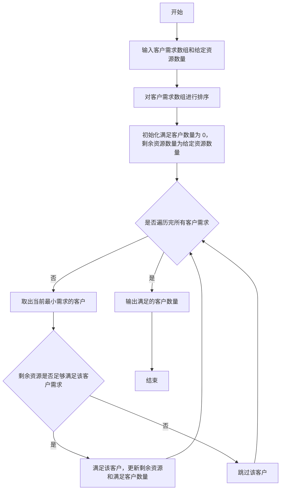
```mermaid
graph TD
    A[开始] --> B[输入客户需求数组和给定资源数量]
    B --> C[对客户需求数组进行排序]
    C --> D[初始化满足客户数量为 0，剩余资源数量为给定资源数量]
    D --> E{是否遍历完所有客户需求}
    E -- 否 --> F[取出当前最小需求的客户]
    F --> G{剩余资源是否足够满足该客户需求}
    G -- 是 --> H[满足该客户，更新剩余资源和满足客户数量]
    H --> E
    G -- 否 --> I[跳过该客户]
    I --> E
    E -- 是 --> J[输出满足的客户数量]
    J --> K[结束]

```

### Mermaid 时序图

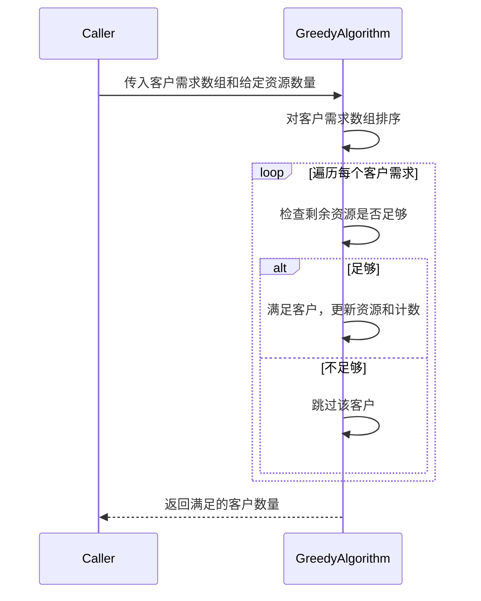
```mermaid
sequenceDiagram
    participant Caller
    participant GreedyAlgorithm
    Caller ->> GreedyAlgorithm: 传入客户需求数组和给定资源数量
    GreedyAlgorithm ->> GreedyAlgorithm: 对客户需求数组排序
    loop 遍历每个客户需求
        GreedyAlgorithm ->> GreedyAlgorithm: 检查剩余资源是否足够
        alt 足够
            GreedyAlgorithm ->> GreedyAlgorithm: 满足客户，更新资源和计数
        else 不足够
            GreedyAlgorithm ->> GreedyAlgorithm: 跳过该客户
        end
    end
    GreedyAlgorithm -->> Caller: 返回满足的客户数量

```

### JavaScript 代码实现

```jsx
function maxSatisfiedCustomers(demands, quantity) {
    // 首先对客户的需求数组进行排序，从小到大排列
    demands.sort((a, b) => a - b);
    // 初始化满足的客户数量为 0
    let satisfied = 0;
    // 遍历每个客户的需求
    for (let demand of demands) {
        // 检查当前剩余资源是否足够满足该客户的需求
        if (quantity >= demand) {
            // 若足够，满足该客户，更新剩余资源数量
            quantity -= demand;
            // 满足客户数量加 1
            satisfied++;
        } else {
            // 若资源不足，跳过该客户，继续检查下一个客户
            break;
        }
    }
    return satisfied;
}

// 测试代码
const customerDemands = [10, 20, 30, 40, 50];
const availableQuantity = 100;
const result = maxSatisfiedCustomers(customerDemands, availableQuantity);
console.log(`给定数量可以满足的最大客户数量是: ${result}`);

```

### 复杂度分析

- **时间复杂度**：排序操作的时间复杂度为 $O(n log n)$，遍历需求数组的时间复杂度为 $O(n)$，因此总的时间复杂度为 $O(n log n)$，其中 $n$ 是客户的数量。
- **空间复杂度**：排序操作可能需要 $O(log n)$ 的额外空间，因此空间复杂度为 $O(log n)$。

### 原理题目解析

### 问题描述

有一个圆形锁，锁上有多个拨盘，每个拨盘上有 0 - 9 共 10 个数字。初始状态下，每个拨盘都指向 0。我们需要将锁拨到目标状态，每次只能旋转一个拨盘上的数字，向上或向下旋转一格（例如从 0 转到 1 或从 9 转到 0），求解锁该圆形锁所需的最少旋转次数。

### 贪心算法思路

这里可以使用广度优先搜索（BFS）来解决这个问题，因为 BFS 可以保证找到的路径是最短路径，也就对应着最少的旋转次数。具体步骤如下：

1. 初始化一个队列，将初始状态（所有拨盘为 0）加入队列。
2. 使用一个集合来记录已经访问过的状态，避免重复访问。
3. 从队列中取出一个状态，对每个拨盘分别进行向上和向下旋转一格的操作，得到新的状态。
4. 检查新状态是否为目标状态，如果是则返回旋转次数；如果不是且未被访问过，则将其加入队列和已访问集合。
5. 重复步骤 3 和 4，直到队列为空或找到目标状态。

### Mermaid 流程图

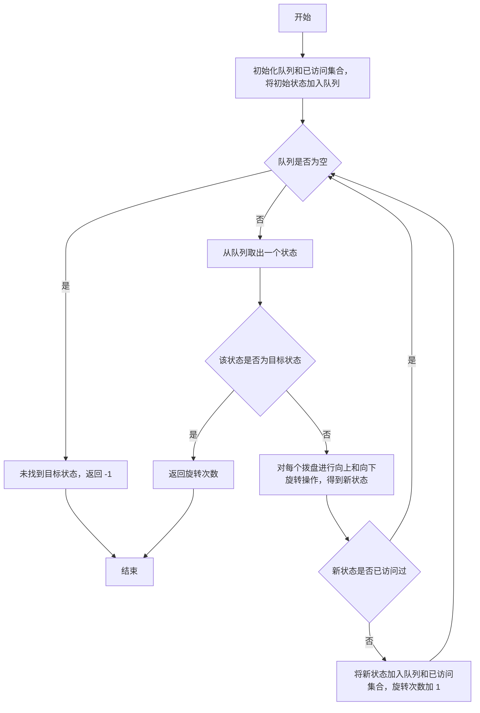
```mermaid
graph TD
    A[开始] --> B[初始化队列和已访问集合，将初始状态加入队列]
    B --> C{队列是否为空}
    C -- 是 --> D[未找到目标状态，返回 -1]
    C -- 否 --> E[从队列取出一个状态]
    E --> F{该状态是否为目标状态}
    F -- 是 --> G[返回旋转次数]
    F -- 否 --> H[对每个拨盘进行向上和向下旋转操作，得到新状态]
    H --> I{新状态是否已访问过}
    I -- 是 --> C
    I -- 否 --> J[将新状态加入队列和已访问集合，旋转次数加 1]
    J --> C
    D --> K[结束]
    G --> K

```

### Mermaid 时序图

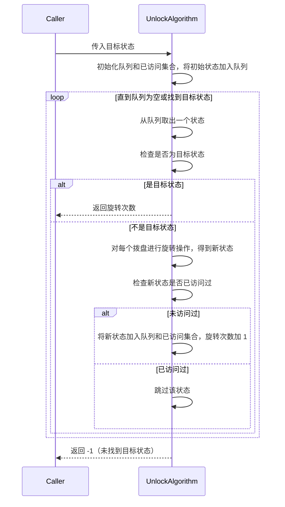
```mermaid
sequenceDiagram
    participant Caller
    participant UnlockAlgorithm
    Caller ->> UnlockAlgorithm: 传入目标状态
    UnlockAlgorithm ->> UnlockAlgorithm: 初始化队列和已访问集合，将初始状态加入队列
    loop 直到队列为空或找到目标状态
        UnlockAlgorithm ->> UnlockAlgorithm: 从队列取出一个状态
        UnlockAlgorithm ->> UnlockAlgorithm: 检查是否为目标状态
        alt 是目标状态
            UnlockAlgorithm -->> Caller: 返回旋转次数
        else 不是目标状态
            UnlockAlgorithm ->> UnlockAlgorithm: 对每个拨盘进行旋转操作，得到新状态
            UnlockAlgorithm ->> UnlockAlgorithm: 检查新状态是否已访问过
            alt 未访问过
                UnlockAlgorithm ->> UnlockAlgorithm: 将新状态加入队列和已访问集合，旋转次数加 1
            else 已访问过
                UnlockAlgorithm ->> UnlockAlgorithm: 跳过该状态
            end
        end
    end
    UnlockAlgorithm -->> Caller: 返回 -1（未找到目标状态）

```

### JavaScript 代码实现

```jsx
function openLock(target) {
    // 初始状态
    const start = '0000';
    // 目标状态
    const end = target;
    // 已访问状态集合
    const visited = new Set();
    // 队列用于 BFS
    const queue = [];
    // 初始旋转次数为 0
    queue.push([start, 0]);
    visited.add(start);

    while (queue.length > 0) {
        // 从队列取出一个状态
        const [current, turns] = queue.shift();
        if (current === end) {
            // 找到目标状态，返回旋转次数
            return turns;
        }
        // 对每个拨盘进行操作
        for (let i = 0; i < 4; i++) {
            // 向上旋转
            const up = rotate(current, i, 1);
            if (!visited.has(up)) {
                queue.push([up, turns + 1]);
                visited.add(up);
            }
            // 向下旋转
            const down = rotate(current, i, -1);
            if (!visited.has(down)) {
                queue.push([down, turns + 1]);
                visited.add(down);
            }
        }
    }
    // 未找到目标状态，返回 -1
    return -1;
}

// 旋转拨盘的函数
function rotate(state, index, direction) {
    const digits = state.split('');
    let digit = parseInt(digits[index], 10);
    // 计算旋转后的数字
    digit = (digit + direction + 10) % 10;
    digits[index] = digit.toString();
    return digits.join('');
}

// 测试代码
const target = '0202';
const result = openLock(target);
console.log(`解锁圆形锁的最少旋转次数是: ${result}`);

```

### 复杂度分析

- **时间复杂度**：$O(10^n * n)$，其中 $n$ 是拨盘的数量（这里 $n = 4$）。因为每个拨盘有 10 种可能的状态，总共有 $10^n$ 种状态，而每次处理一个状态需要 $O(n)$ 的时间来进行旋转操作。
- **空间复杂度**：$O(10^n)$，主要用于存储已访问的状态。

### 1. Minimum rooms for m events of n batches with given schedule

### 原理题目解析

- **问题描述**：给定 `n` 个批次的 `m` 场活动的时间表，每个活动有开始时间和结束时间，需要找出安排这些活动所需的最小房间数。
- **贪心算法思路**：
    1. 把所有活动的开始时间和结束时间分别提取出来，并标记好是开始还是结束事件。
    2. 对这些时间点进行排序。
    3. 遍历排序后的时间点，遇到开始事件就增加房间使用数，遇到结束事件就减少房间使用数，过程中记录最大的房间使用数。

### Mermaid 流程图

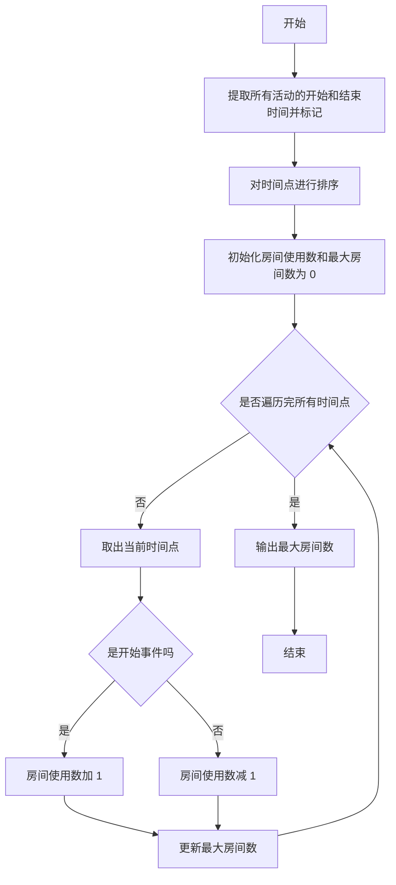
```mermaid
graph TD
    A[开始] --> B[提取所有活动的开始和结束时间并标记]
    B --> C[对时间点进行排序]
    C --> D[初始化房间使用数和最大房间数为 0]
    D --> E{是否遍历完所有时间点}
    E -- 否 --> F[取出当前时间点]
    F --> G{是开始事件吗}
    G -- 是 --> H[房间使用数加 1]
    G -- 否 --> I[房间使用数减 1]
    H --> J[更新最大房间数]
    I --> J
    J --> E
    E -- 是 --> K[输出最大房间数]
    K --> L[结束]

```

### Mermaid 时序图

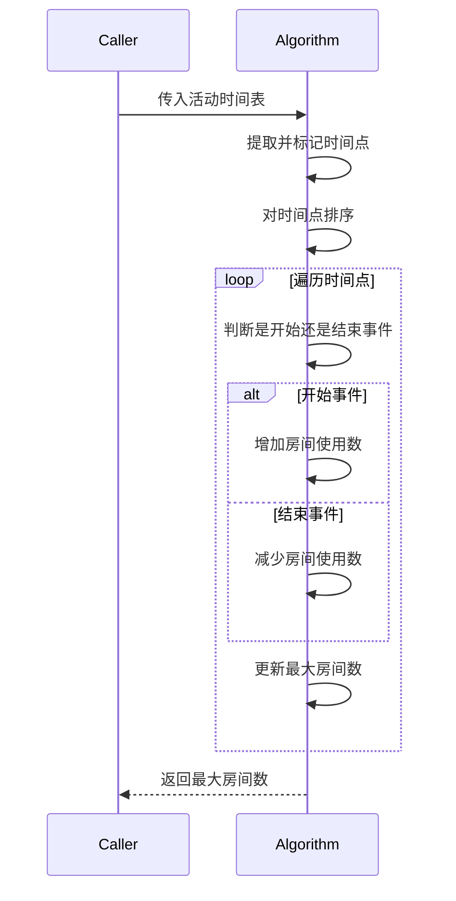
```mermaid
sequenceDiagram
    participant Caller
    participant Algorithm
    Caller ->> Algorithm: 传入活动时间表
    Algorithm ->> Algorithm: 提取并标记时间点
    Algorithm ->> Algorithm: 对时间点排序
    loop 遍历时间点
        Algorithm ->> Algorithm: 判断是开始还是结束事件
        alt 开始事件
            Algorithm ->> Algorithm: 增加房间使用数
        else 结束事件
            Algorithm ->> Algorithm: 减少房间使用数
        end
        Algorithm ->> Algorithm: 更新最大房间数
    end
    Algorithm -->> Caller: 返回最大房间数

```

### JavaScript 代码实现

```jsx
function minRooms(events) {
    const startTimes = [];
    const endTimes = [];
    // 提取开始和结束时间
    for (let [start, end] of events) {
        startTimes.push(start);
        endTimes.push(end);
    }
    // 对开始和结束时间排序
    startTimes.sort((a, b) => a - b);
    endTimes.sort((a, b) => a - b);

    let i = 0, j = 0;
    let rooms = 0;
    let maxRooms = 0;
    // 遍历时间点
    while (i < startTimes.length) {
        if (startTimes[i] < endTimes[j]) {
            rooms++;
            i++;
        } else {
            rooms--;
            j++;
        }
        maxRooms = Math.max(maxRooms, rooms);
    }
    return maxRooms;
}

// 测试代码
const events = [[1, 5], [2, 6], [3, 7]];
console.log("Minimum rooms required: ", minRooms(events));

```

### 复杂度分析

- **时间复杂度**：$O(m log m)$，主要是排序操作的时间复杂度，其中 $m$ 是活动的数量。
- **空间复杂度**：$O(m)$，用于存储开始和结束时间。

### 2. Minimum cost to make array size 1 by removing larger of pairs

### 原理题目解析

- **问题描述**：给定一个数组，每次可以选择数组中的两个元素，移除较大的那个元素，移除元素会产生一定成本（成本就是被移除元素的值），要让数组最终只剩下一个元素，求最小成本。
- **贪心算法思路**：
    1. 对数组进行排序。
    2. 从最小的元素开始，依次两两组合，移除较大的元素，累加移除元素的成本。

### Mermaid 流程图

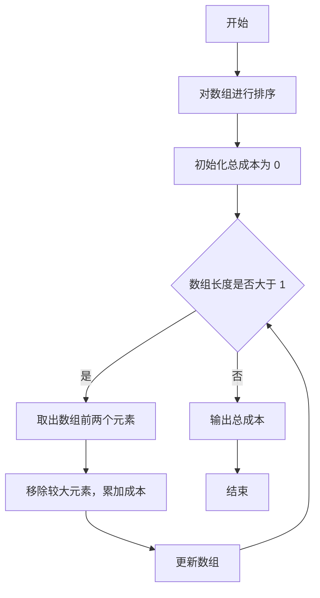
```mermaid
graph TD
    A[开始] --> B[对数组进行排序]
    B --> C[初始化总成本为 0]
    C --> D{数组长度是否大于 1}
    D -- 是 --> E[取出数组前两个元素]
    E --> F[移除较大元素，累加成本]
    F --> G[更新数组]
    G --> D
    D -- 否 --> H[输出总成本]
    H --> I[结束]

```

### Mermaid 时序图

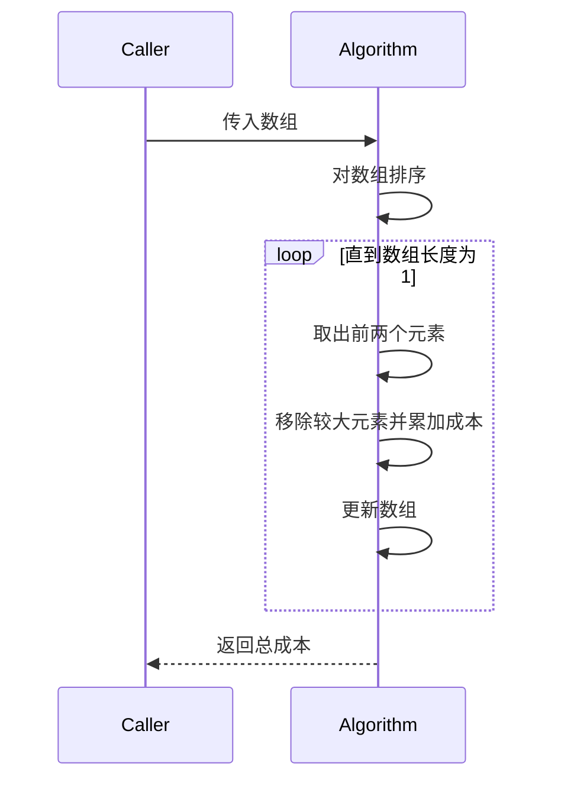
```mermaid
sequenceDiagram
    participant Caller
    participant Algorithm
    Caller ->> Algorithm: 传入数组
    Algorithm ->> Algorithm: 对数组排序
    loop 直到数组长度为 1
        Algorithm ->> Algorithm: 取出前两个元素
        Algorithm ->> Algorithm: 移除较大元素并累加成本
        Algorithm ->> Algorithm: 更新数组
    end
    Algorithm -->> Caller: 返回总成本

```

### JavaScript 代码实现

```jsx
function minCostToMakeSizeOne(arr) {
    arr.sort((a, b) => a - b);
    let cost = 0;
    while (arr.length > 1) {
        const [first, second] = arr.splice(0, 2);
        cost += Math.max(first, second);
    }
    return cost;
}

// 测试代码
const arr = [3, 2, 4, 1];
console.log("Minimum cost: ", minCostToMakeSizeOne(arr));

```

### 复杂度分析

- **时间复杂度**：$O(n log n)$，主要是排序操作的时间复杂度，其中 $n$ 是数组的长度。
- **空间复杂度**：$O(1)$，只使用了常数级的额外空间。

### 3. Minimum cost for acquiring all coins with k extra coins allowed with every coin

### 原理题目解析

- **问题描述**：有一些硬币，每个硬币有对应的成本，每购买一个硬币可以额外免费获得 `k` 个硬币，求获取所有硬币的最低成本。
- **贪心算法思路**：
    1. 对硬币成本进行排序。
    2. 从成本最低的硬币开始购买，利用免费获取硬币的规则，计算出最少的购买次数和成本。

### Mermaid 流程图

```mermaid
graph TD
    A[开始] --> B[对硬币成本进行排序]
    B --> C[初始化总成本为 0，已获取硬币数为 0]
    C --> D{已获取硬币数是否小于总硬币数}
    D -- 是 --> E[购买当前成本最低的硬币，累加成本]
    E --> F[更新已获取硬币数（加上 1 + k）]
    F --> D
    D -- 否 --> G[输出总成本]
    G --> H[结束]

```

### Mermaid 时序图

```mermaid
sequenceDiagram
    participant Caller
    participant Algorithm
    Caller ->> Algorithm: 传入硬币成本数组和 k 值
    Algorithm ->> Algorithm: 对硬币成本排序
    loop 直到获取所有硬币
        Algorithm ->> Algorithm: 购买当前成本最低的硬币，累加成本
        Algorithm ->> Algorithm: 更新已获取硬币数
    end
    Algorithm -->> Caller: 返回总成本

```

### JavaScript 代码实现

```jsx
function minCostForCoins(coinCosts, k) {
    coinCosts.sort((a, b) => a - b);
    let cost = 0;
    let acquired = 0;
    let i = 0;
    while (acquired < coinCosts.length) {
        cost += coinCosts[i];
        acquired += k + 1;
        i++;
    }
    return cost;
}

// 测试代码
const coinCosts = [2, 4, 1, 3];
const k = 1;
console.log("Minimum cost for coins: ", minCostForCoins(coinCosts, k));

```

### 复杂度分析

- **时间复杂度**：$O(n log n)$，主要是排序操作的时间复杂度，其中 $n$ 是硬币的数量。
- **空间复杂度**：$O(1)$，只使用了常数级的额外空间。

### 4. Minimum increment by k operations to make all elements equal

### 原理题目解析

- **问题描述**：给定一个数组，每次可以选择一个元素将其增加 `k`，求使数组中所有元素相等的最小操作次数。
- **贪心算法思路**：
    1. 找到数组中的最大值。
    2. 计算每个元素与最大值的差值，判断差值是否能被 `k` 整除，如果不能则无法使所有元素相等；如果能，则累加操作次数。

### Mermaid 流程图

```mermaid
graph TD
    A[开始] --> B[找到数组中的最大值]
    B --> C[初始化总操作次数为 0]
    C --> D{是否遍历完所有元素}
    D -- 否 --> E[取出当前元素]
    E --> F[计算与最大值的差值]
    F --> G{差值能否被 k 整除}
    G -- 否 --> H[输出 -1（无法使元素相等）]
    G -- 是 --> I[累加操作次数]
    I --> D
    D -- 是 --> J[输出总操作次数]
    H --> K[结束]
    J --> K

```

### Mermaid 时序图

```mermaid
sequenceDiagram
    participant Caller
    participant Algorithm
    Caller ->> Algorithm: 传入数组和 k 值
    Algorithm ->> Algorithm: 找到数组最大值
    loop 遍历数组元素
        Algorithm ->> Algorithm: 计算与最大值的差值
        Algorithm ->> Algorithm: 判断差值能否被 k 整除
        alt 能整除
            Algorithm ->> Algorithm: 累加操作次数
        else 不能整除
            Algorithm -->> Caller: 返回 -1
        end
    end
    Algorithm -->> Caller: 返回总操作次数

```

### JavaScript 代码实现

```jsx
function minIncrementToEqual(arr, k) {
    const max = Math.max(...arr);
    let operations = 0;
    for (let num of arr) {
        const diff = max - num;
        if (diff % k !== 0) {
            return -1;
        }
        operations += diff / k;
    }
    return operations;
}

// 测试代码
const arr2 = [4, 7, 10];
const k2 = 3;
console.log("Minimum increment operations: ", minIncrementToEqual(arr2, k2));

```

### 复杂度分析

- **时间复杂度**：$O(n)$，其中 $n$ 是数组的长度，需要遍历数组一次。
- **空间复杂度**：$O(1)$，只使用了常数级的额外空间。

### 5. Find minimum number of currency notes and values that sum to given amount

### 原理题目解析

- **问题描述**：给定一个金额和一系列不同面值的纸币，求用最少数量的纸币凑出该金额的方案。
- **贪心算法思路**：
    1. 对纸币面值进行降序排序。
    2. 从最大面值的纸币开始，尽可能多地使用该面值的纸币，然后更新剩余金额，重复这个过程直到金额为 0。

### Mermaid 流程图

```mermaid
graph TD
    A[开始] --> B[对纸币面值进行降序排序]
    B --> C[初始化纸币数量数组和剩余金额为给定金额]
    C --> D{剩余金额是否大于 0}
    D -- 是 --> E[取出当前最大面值纸币]
    E --> F{剩余金额是否大于等于当前面值}
    F -- 是 --> G[使用该面值纸币，更新纸币数量和剩余金额]
    G --> F
    F -- 否 --> D
    D -- 否 --> H[输出纸币数量数组]
    H --> I[结束]

```

### Mermaid 时序图

```mermaid
sequenceDiagram
    participant Caller
    participant Algorithm
    Caller ->> Algorithm: 传入金额和纸币面值数组
    Algorithm ->> Algorithm: 对纸币面值降序排序
    loop 直到剩余金额为 0
        Algorithm ->> Algorithm: 取出当前最大面值纸币
        Algorithm ->> Algorithm: 判断是否能使用该纸币
        alt 能使用
            Algorithm ->> Algorithm: 使用纸币，更新数量和金额
        else 不能使用
            Algorithm ->> Algorithm: 更换下一面值纸币
        end
    end
    Algorithm -->> Caller: 返回纸币数量数组

```

### JavaScript 代码实现

```jsx
function minNotes(amount, notes) {
    notes.sort((a, b) => b - a);
    const noteCount = {};
    for (let note of notes) {
        noteCount[note] = 0;
    }
    let remaining = amount;
    for (let note of notes) {
        while (remaining >= note) {
            noteCount[note]++;
            remaining -= note;
        }
    }
    return noteCount;
}

// 测试代码
const amount = 180;
const notes = [100, 50, 20, 10];
console.log("Minimum notes: ", minNotes(amount, notes));

```

### 复杂度分析

- **时间复杂度**：$O(m)$，其中 $m$ 是纸币面值的种类数，主要是遍历纸币面值数组。
- **空间复杂度**：$O(m)$，用于存储每种纸币的使用数量。

### 6. Smallest subset with sum greater than all other elements

### 原理题目解析

- **问题描述**：给定一个数组，找出一个最小的子集，使得该子集的元素和大于数组中其余元素的和。
- **贪心算法思路**：
    1. 对数组进行降序排序。
    2. 从最大的元素开始依次加入子集，计算子集的和与剩余元素的和，直到子集的和大于剩余元素的和。

### Mermaid 流程图

```mermaid
graph TD
    A[开始] --> B[对数组进行降序排序]
    B --> C[初始化子集、子集和、剩余元素和]
    C --> D{子集和是否大于剩余元素和}
    D -- 否 --> E[取出当前最大元素加入子集，更新子集和与剩余元素和]
    E --> D
    D -- 是 --> F[输出子集]
    F --> G[结束]

```

### Mermaid 时序图

```mermaid
sequenceDiagram
    participant Caller
    participant Algorithm
    Caller ->> Algorithm: 传入数组
    Algorithm ->> Algorithm: 对数组降序排序
    loop 直到子集和大于剩余元素和
        Algorithm ->> Algorithm: 取出当前最大元素加入子集
        Algorithm ->> Algorithm: 更新子集和与剩余元素和
    end
    Algorithm -->> Caller: 返回子集

```

### JavaScript 代码实现

```jsx
function smallestSubset(arr) {
    arr.sort((a, b) => b - a);
    const totalSum = arr.reduce((acc, val) => acc + val, 0);
    let subsetSum = 0;
    const subset = [];
    for (let num of arr) {
        subset.push(num);
        subsetSum += num;
        if (subsetSum > totalSum - subsetSum) {
            break;
        }
    }
    return subset;
}

// 测试代码
const arr3 = [4, 3, 1, 2];
console.log("Smallest subset: ", smallestSubset(arr3));

```

### 复杂度分析

- **时间复杂度**：$O(n log n)$，主要是排序操作的时间复杂度，其中 $n$ 是数组的长度。
- **空间复杂度**：$O(n)$，最坏情况下子集可能包含所有元素。