# 📝 主旨内容


# 单链表的操作

## 总的代码

```jsx
class Node {
  constructor(data) {
    this.data = data;
    this.next = null;
  }
}

class LinkedList {
  constructor() {
    this.head = null;
    this.size = 0;
  }

  // Basic Operations
  insertFirst(data) {
    const newNode = new Node(data);
    newNode.next = this.head;
    this.head = newNode;
    this.size++;
  }

  insertLast(data) {
    this.append(data);
  }

  append(data) {
    const newNode = new Node(data);
    if (!this.head) {
      this.head = newNode;
    } else {
      let current = this.head;
      while (current.next) {
        current = current.next;
      }
      current.next = newNode;
    }
    this.size++;
  }

  insert(index, data) {
    if (index < 0 || index > this.size) {
      throw new Error('Index out of range');
    }
    const newNode = new Node(data);

    if (index === 0) {
      newNode.next = this.head;
      this.head = newNode;
    } else {
      let current = this.head;
      for (let i = 0; i < index - 1; i++) {
        current = current.next;
      }
      newNode.next = current.next;
      current.next = newNode;
    }
    this.size++;
  }

  removeAt(index) {
    if (index < 0 || index >= this.size) {
      throw new Error('Index out of range');
    }
    let current = this.head;
    if (index === 0) {
      this.head = current.next;
    } else {
      for (let i = 0; i < index - 1; i++) {
        current = current.next;
      }
      current.next = current.next.next;
    }
    this.size--;
  }

  removeFirst() {
    if (!this.head) {
      throw new Error('List is empty');
    }
    this.head = this.head.next;
    this.size--;
  }

  removeLast() {
    if (!this.head) {
      throw new Error('List is empty');
    }
    if (!this.head.next) {
      this.head = null;
    } else {
      let current = this.head;
      while (current.next.next) {
        current = current.next;
      }
      current.next = null;
    }
    this.size--;
  }

  // Advanced Operations
  reverse() {
    let prev = null;
    let current = this.head;
    while (current) {
      const next = current.next;
      current.next = prev;
      prev = current;
      current = next;
    }
    this.head = prev;
  }

  contains(data) {
    let current = this.head;
    while (current) {
      if (current.data === data) {
        return true;
      }
      current = current.next;
    }
    return false;
  }

  toArray() {
    const result = [];
    let current = this.head;
    while (current) {
      result.push(current.data);
      current = current.next;
    }
    return result;
  }

  getNthFromEnd(n) {
    if (n < 0 || n >= this.size) {
      throw new Error('Invalid position');
    }
    let slow = this.head;
    let fast = this.head;
    
    for (let i = 0; i < n; i++) {
      fast = fast.next;
    }
    
    while (fast.next) {
      slow = slow.next;
      fast = fast.next;
    }
    
    return slow.data;
  }

  // Utility Methods
  isEmpty() {
    return this.size === 0;
  }

  clear() {
    this.head = null;
    this.size = 0;
  }

  isPalindrome() {
    if (!this.head) return true;
    
    // Convert list to array
    const arr = this.toArray();
    
    // Compare elements from start and end
    let left = 0;
    let right = arr.length - 1;
    while (left < right) {
      if (arr[left] !== arr[right]) {
        return false;
      }
      left++;
      right--;
    }
    return true;
  }

  toString() {
    let current = this.head;
    let result = '';
    while (current) {
      result += current.data + ' -> ';
      current = current.next;
    }
    return result + 'null';
  }
}

// Test Cases
const list = new LinkedList();

// Test Append
list.append(1);
list.append(2);
list.append(3);
console.log('After append:', list.toString()); // 1 -> 2 -> 3 -> null

// Test Insert
list.insert(1, 1.5);
console.log('After insert:', list.toString()); // 1 -> 1.5 -> 2 -> 3 -> null

// Test Remove
list.removeAt(1);
console.log('After remove:', list.toString()); // 1 -> 2 -> 3 -> null

// Test Reverse
list.reverse();
console.log('After reverse:', list.toString()); // 3 -> 2 -> 1 -> null

// Test Contains
console.log('Contains 2:', list.contains(2)); // true
console.log('Contains 5:', list.contains(5)); // false

// Test toArray
console.log('Array representation:', list.toArray()); // [3, 2, 1]

// Test getNthFromEnd
console.log('2nd from end:', list.getNthFromEnd(1)); // 2

// Test Edge Cases
try {
  list.insert(10, 4);
} catch (e) {
  console.log('Insert error:', e.message); // Index out of range
}

try {
  list.removeAt(10);
} catch (e) {
  console.log('Remove error:', e.message); // Index out of range
}

// Test Palindrome
list.clear();
list.append(1);
list.append(2);
list.append(3);
list.append(2);
list.append(1);
console.log('Is palindrome:', list.isPalindrome()); // true

list.clear();
list.append(1);
list.append(2);
list.append(3);
console.log('Is palindrome:', list.isPalindrome()); // false

// Test Clear
list.clear();
console.log('After clear:', list.toString()); // null
console.log('Is empty:', list.isEmpty()); // true

```

**单链表**是计算机科学和编程中的基本数据结构，它由**节点**组成，其中每个节点包含一个**数据**字段以及对该节点中下一个节点的**引用**。最后一个节点指向**null** ，表示列表的末尾(这种线性结构支持高效的插入和删除操作)

每个节点由两部分组成：数据和指向下一个节点的指针。数据部分存储实际信息，而指针（或引用）部分存储序列中下一个节点的地址。这种结构允许节点动态链接在一起，形成链状序列。


### 创建单链表

```jsx
class Node {
  constructor(data) {
    this.data = data;
    this.next = null;
  }
}

class LinkedList {
  constructor() {
    this.head = null;
    this.size = 0;
  }
}

const list = new LinkedList();
list.head = new Node('A');
list.head.next = new Node('B');
list.head.next.next = new Node('C');
list.head.next.next.next = new Node('D');

console.log(list);   // 
// LinkedList {
//   head: Node { data: 'A', next: Node { data: 'B', next: [Node] } },
//   size: 0
// }

```


在这个例子中我们创建了 一个单链表，但是没有给size赋值，那怎么去求的（size的一个单链表的长度呢？）

### 求单链表的长度

**在添加节点时更新 size**

这是最有效率的方法，因为它避免了每次需要链表长度时都遍历整个链表。

```jsx
class Node {
  constructor(data) {
    this.data = data;
    this.next = null;
  }
}

class LinkedList {
  constructor() {
    this.head = null;
    this.size = 0;
  }
  add(data) {
    const node = new Node(data); // 新建节点
    if (!this.head) {
      // 如果没有头节点 就把新建节点赋值给头节点
      this.head = node;
    } else {
      // 如果有头节点 就把当前节点的next指向新建节点
      let current = this.head;
      while (current.next) {
        current = current.next;
      }
      current.next = node; // 最后一个节点的next指向新建节点
    }
    this.size++; // 链表长度+1
  }
  getSize() {
    return this.size;
  }
}
const list = new LinkedList();
list.add('A');
list.add('B');
list.add('C');
list.add('D');
console.log(list);
console.log(list.getSize());

LinkedList {
  head: Node { data: 'A', next: Node { data: 'B', next: [Node] } },
  size: 4
}
4
```

求length值的时序图

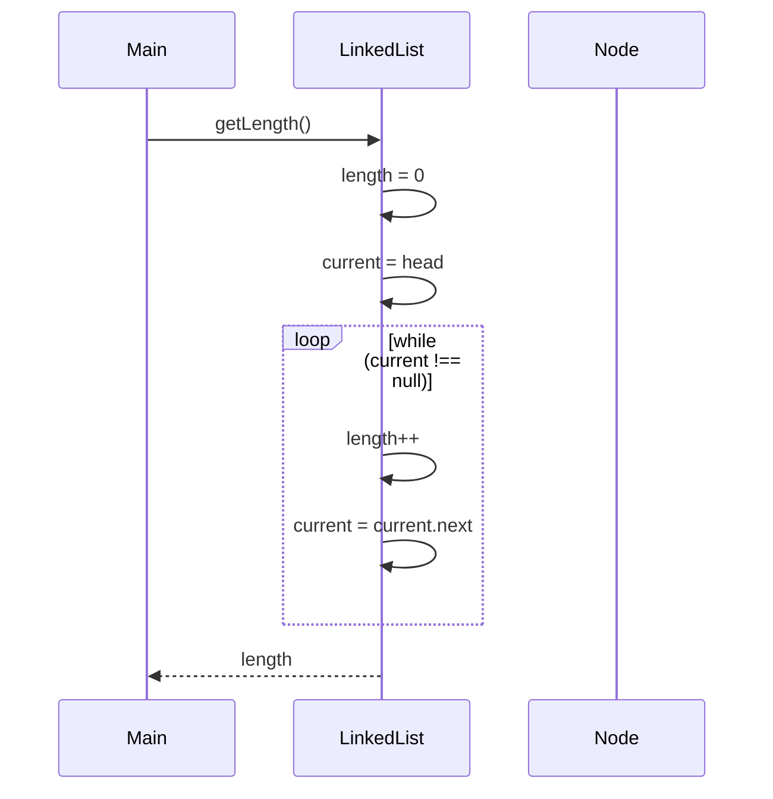

### 代码

```jsx
function getLength():
    初始化计数器 length 为 0
    将 current 指向 head
    遍历链表，直到 current 为 null:
        增加计数器 length
        移动到下一个节点 current = current.next
    返回计数器 length 的最终值

class Node {
  constructor(data) {
    this.data = data;
    this.next = null;
  }
}

class LinkedList {
  constructor() {
    this.head = null;
    this.size = 0;
  }

  getLength() {
    let length = 0;
    let current = this.head;
    while (current !== null) {
      length++;
      current = current.next;
    }
    return length;
  }

}

// 使用示例
const list = new LinkedList();
list.insertAt(0, 'A');
list.insertAt(1, 'B');
list.insertAt(2, 'C');
list.insertAt(3, 'D');
console.log(list.getLength()); // 输出: 4
```

## 插入

插入

从开头插入


```jsx
function insertAtBeginning(data):
    创建新节点 newNode，数据为 data
    将 newNode 的 next 指针指向当前的头节点 head
    将 head 指向 newNode
    增加链表的长度 size
```


```jsx

class Node {
  constructor(data){
    this.data = data;
    this.next = null;
  }

}
class LinkedList{
  constructor(){
    this.head = null;
    this.size = 0;
  }

  insertAtBeginning(data){
    let newNode = new Node(data);
    newNode.next = this.head;
    this.head = newNode;
    this.size++;
  }
}

const list = new LinkedList();
list.insertAtBeginning('A');
list.insertAtBeginning('B');
list.insertAtBeginning('C');
console.log(list);

LinkedList {
  head: Node { data: 'C', next: Node { data: 'B', next: [Node] } },
  size: 3
}
```

从结尾插入


```jsx
class Node {
  constructor(data) {
    this.data = data;
    this.next = null;
  }
}
class LinkedList {
  constructor() {
    this.head = null;
    this.size = 0;
  }
  insertAtEnd(data) {
    let newNode = new Node(data);
    if (this.head === null) {
      this.head = newNode;
    }
    let current = this.head;
    while (current.next !== null) {
      current = current.next;
    }
    current.next = newNode;
    this.size++;
  }
}

const list = new LinkedList();
list.insertAtEnd('A');
list.insertAtEnd('B');
list.insertAtEnd('C');
list.insertAtEnd('D');
console.log(list);

LinkedList {
  head: Node {
    data: 'A',
    next: Node {
      data: 'B',
      next: Node {
        data: 'C',
        next: Node {
          data: 'D',
          next: null
        }
      }
    }
  },
  size: 4
}
```

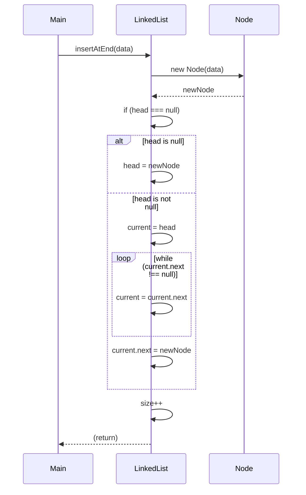

### 特定位置插入


insertAt(1, 'B')

```jsx
class Node {
  constructor(data) {
    this.data = data;
    this.next = null;
  }
}

class LinkedList {
  constructor() {
    this.head = null;
    this.size = 0;
  }

  insertAt(data, index) {
    // 如果索引超出范围，直接返回，或者是是链表为空
    if (index < 0 || index > this.size) {
      return;
    }
    // 创建节点
    let newNode = new Node(data);
    // 如果索引为0，将新节点插入到头部
    if (index === 0) {
      newNode.next = this.head;
    } else {
      // 否则，找到索引位置的前一个节点，将新节点插入到该节点之后
      let current = this.head;
      // 遍历到索引位置的前一个节点
      for (let i = 0; i < index - 1; i++) {
        current = current.next;
      }
      // 将新节点插入到该节点之后
      newNode.next = current.next;
      // 将该节点的 next 指向新节点
      current.next = newNode;
    }
    // 链表长度加一
    this.size++;
  }
}

// 使用示例
const list = new LinkedList();
list.insertAt(0, 'A');
list.insertAt(1, 'C');
list.insertAt(1, 'B');
list.insertAt(3, 'D');
console.log(list.toString()); // 输出: A B C D

```

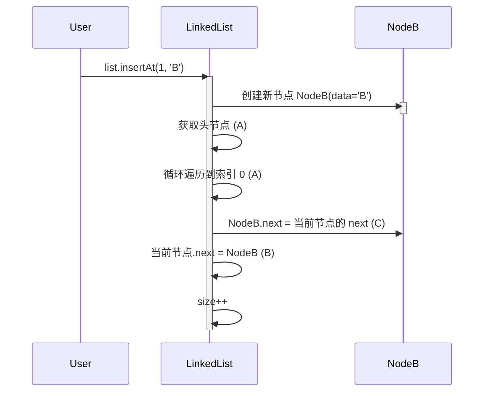

## 删除

同样的删除节点也有

### 从开头删除


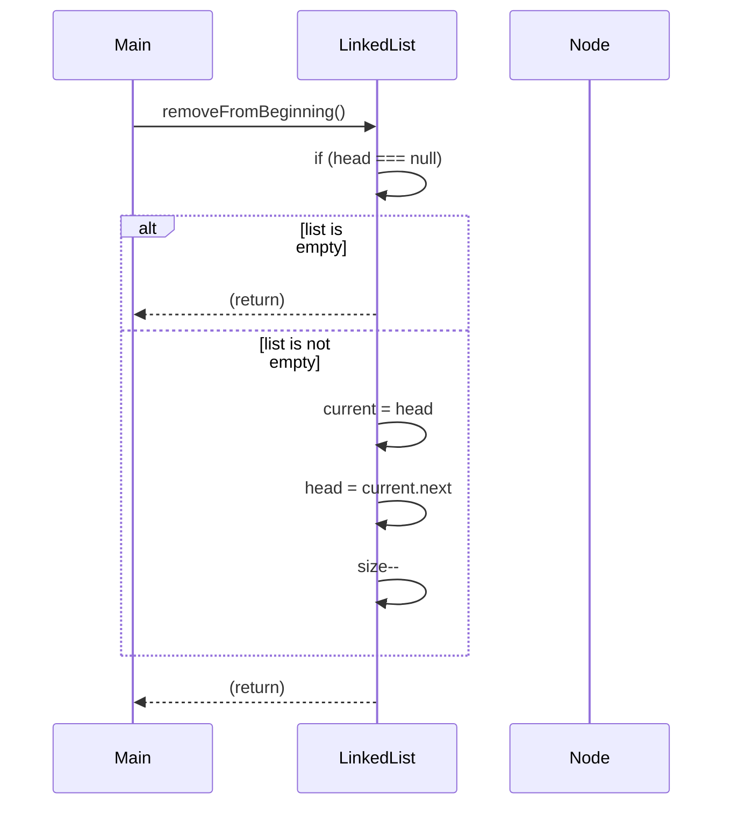

```jsx
class Node {
  constructor(data) {
    this.data = data;
    this.next = null;
  }
}

class LinkedList {
  constructor() {
    this.head = null;
    this.size = 0;
  }

  insertAtEnd(data) {
    let mewNode = new Node(data);
    if (!this.head === null) {
      this.head = newNode;
    } else {
      let current = this.head;
      while (current.next !== null) {
        current = current.next;
      }
      current.next = newNode;
      this.size++;
    }
  }

  removeFromBeginning() {
    if (this.head === null) {
      return;
    }
    let current = this.head;
    this.head = current.next;
    this.size--;
  }
  toString() {
    let current = this.head;
    let result = '';
    while (current !== null) {
      result += current.data + '';
      current = current.next;
    }
    return result.trim();
  }
}

const list = new LinkedList();
list.insertAtEnd('A');
list.insertAtEnd('B');
list.insertAtEnd('C');
list.insertAtEnd('D');
console.log(list.toString());
list.removeFromBeginning();
console.log(list.toString());

```

### 从结尾开始删除


```jsx
class Node {
  constructor(data) {
    this.dada = data;
    this.next = null;
  }
}

class LinkedList {
  constructor() {
    this.head = null;
    this.isze = 0;
  }

  insertAtEnd(data) {
    let newNode = new Node(data);
    if (!head === null) {
      this.head = newNode;
    } else {
      let current = this.head;
      while (current.next !== null) {
        current = current.next;
      }
      current.next = newNode;
      this.size++;
    }
  }

  removeFormEnd() {
    if (this.head === null) {
      return;
    }
    if (this.head.next === null) {
      this.head = null;
    } else {
      let current = this.head;
      while (current.next.next !== null) {
        current = current.next;
      }
      current.next = null;
    }
    this.size--;
  }
}

const list = LinkedList();
list.insertAtEnd('A');
list.insertAtEnd('B');
list.insertAtEnd('C');
list.insertAtEnd('D');

list.removeFormEnd();
console.log(list);

```

function removeFromEnd():
如果链表为空 (head === null):
直接返回
如果链表只有一个节点 (head.next === null):
将 head 设置为 null
否则:
遍历链表直到倒数第二个节点 current
将 current 的 next 指针设置为 null
减少链表的长度 size

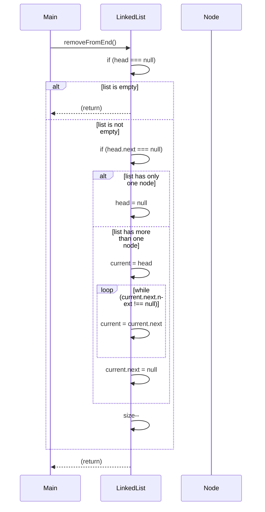

### 在特点的节点删除


## 搜索

```jsx
function search(target):
    将 current 指向 head
    遍历链表，直到 current 为 null:
        如果 current 的数据与目标值匹配:
            返回 true
        否则:
            移动到下一个节点 current = current.next
    如果遍历完链表仍未找到匹配项:
        返回 false
```

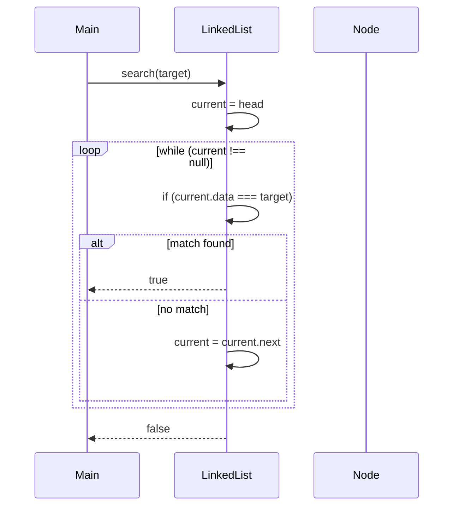

```jsx
class Node {
  constructor(data) {
    this.data = data;
    this.next = null;
  }
}

class LinkedList {
  constructor() {
    this.head = null;
    this.size = 0;
  }
  insertAtEnd(data) {
    let newNode = new Node(data);
    if (this.head === null) {
      this.head = newNode;
    } else {
      let current = this.head;
      while (current.next !== null) {
        current = current.next;
      }
      current.next = newNode;
    }
    this.size++;
  }

  search(data) {
    // 从头节点开始遍历链表
    let current = this.head;
    // 遍历链表，直到找到目标数据或者遍历完整个链表
    while (current !== null) {
      if (current.data === data) {
        // 如果找到了目标数据，返回 true
        return true;
      }
      // 否则，继续遍历下一个节点
      current = current.next;
    }
    // 如果遍历完整个链表都没有找到目标数据，返回 false
    return false;
  }
  Tostring() {
    let current = this.head;
    let result = '';
    while (current !== null) {
      result += current.data + '';
      current = current.next;
    }
    return result.trim();
  }
}
const list = new LinkedList();
list.insertAtEnd('A');
list.insertAtEnd('B');
list.insertAtEnd('C');
list.insertAtEnd('D');
console.log(list.search('A'));
console.log(list.search('E'));
console.log(list.Tostring());

```

### update

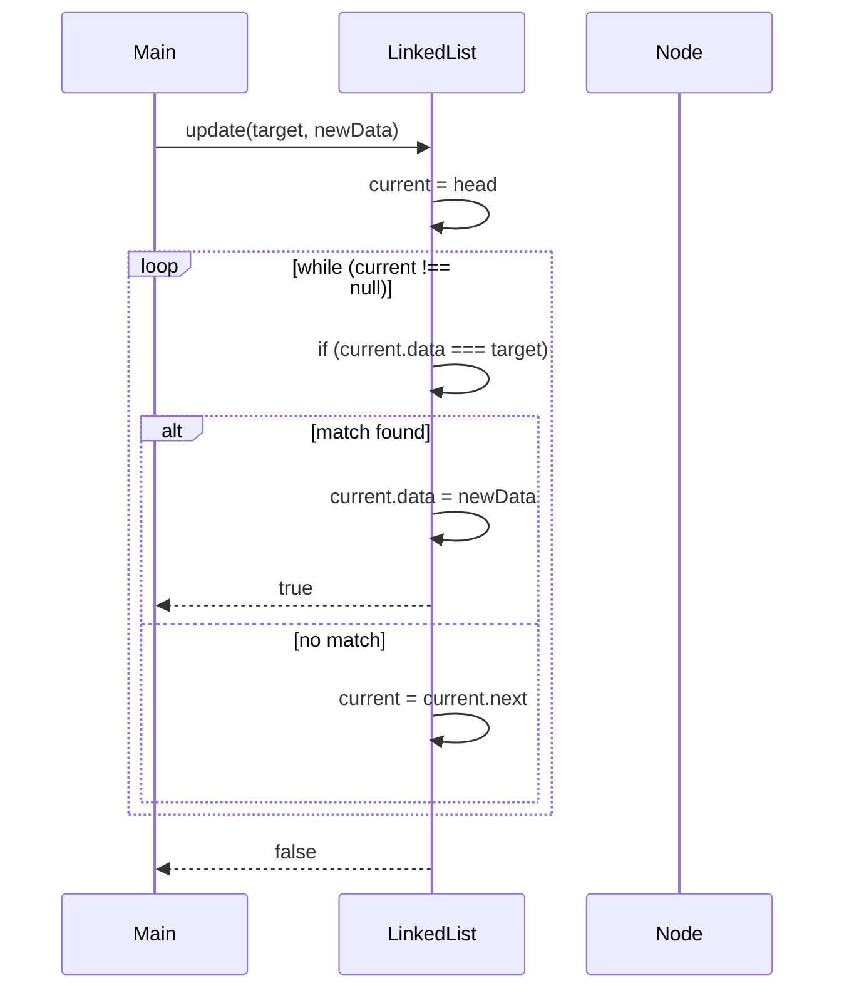

## 将链表转化为数组

```jsx
function toArray():
    初始化一个空数组 array
    将 current 指向 head
    遍历链表，直到 current 为 null:
        将 current 的数据添加到数组中
        移动到下一个节点 current = current.next
    返回数组 array
```

1. **Main**：调用 `LinkedList` 的 `toArray` 方法。
2. **LinkedList**：初始化一个空数组 `array`。
3. **LinkedList**：将 `current` 指向链表的头节点 `head`。
4. **LinkedList**：遍历链表，直到 `current` 为 `null`。
    - 将当前节点的数据添加到数组中。
    - 移动到下一个节点。
5. **LinkedList**：返回数组 `array`

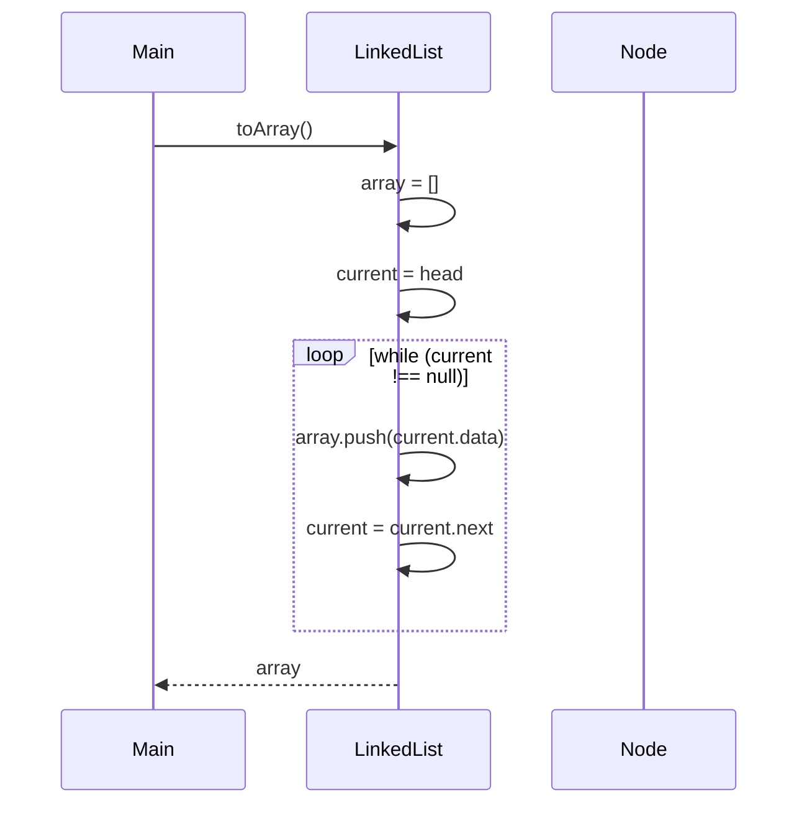

### 代码逻辑

```jsx
class Node {
  constructor(data) {
    this.data = data;
    this.next = null;
  }
}

class LinkedList {
  constructor() {
    this.head = null;
    this.size = 0;
  }
 

  // 定义一个方法 toArray
  toArray() {
    // 初始化一个指针 current，指向链表的头节点
    let current = this.head;
    // 初始化一个空数组 array，用于存储链表中的数据
    let array = [];
    // 遍历链表，直到 current 指向 null（即链表的末尾）
    while (current !== null) {
      // 将当前节点的数据添加到数组中
      array.push(current.data);
      // 将 current 指针指向下一个节点
      current = current.next;
    }
    // 返回包含链表中所有数据的数组
    return array;
  }
}
const list = new LinkedList();
list.insertAtEnd('A');
list.insertAtEnd('B');
list.insertAtEnd('C');
list.insertAtEnd('D');

console.log(list.toArray());

```

## 检查列表是否为空

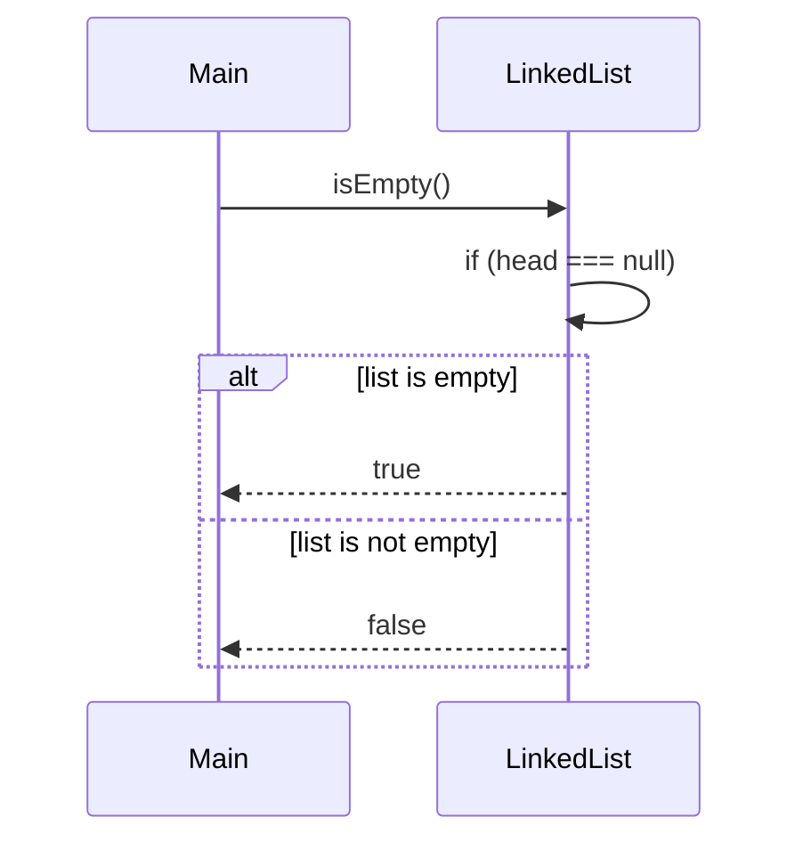

# question

## 反转一个单链表


```jsx
class Node {
  constructor(data) {
    this.data = data;
    this.next = null;
  }
}

class LinkedList {
  constructor() {
    this.head = null;
    this.size = 0;
  }

  reserve() {
    let prev = null;
    let current = this.head;
    let next = null;

    while (current !== null) {
      // 使用一个循环来遍历链表，只要 current 不为 null，就继续循环
      // next = current.next;：将 current 的下一个节点存储在 next 变量中。
      next = current.next;
      // 将 current 的 next 指针指向 prev，即当前节点的前一个节点，这样就完成了当前节点的反转
      current.next = prev;
      // prev = current;：将 prev 变量更新为当前节点 current，这样下一次循环时，prev 就变成了当前节点的前一个节点。
      prev = current;
      // current = next;：将 current 变量更新为 next，这样下一次循环时，current 就变成了下一个节点。
      current = next;
    }
    // this.head = prev;：当循环结束时，prev 变量指向链表的最后一个节点，也就是新的头节点，因此将 this.head 指向 prev，完成链表的反转
    // 最后将 this.head 指向 prev，这样链表的头节点就变成了原来的尾节点，完成了链表的反转。
    this.head = prev;
  }
}

```

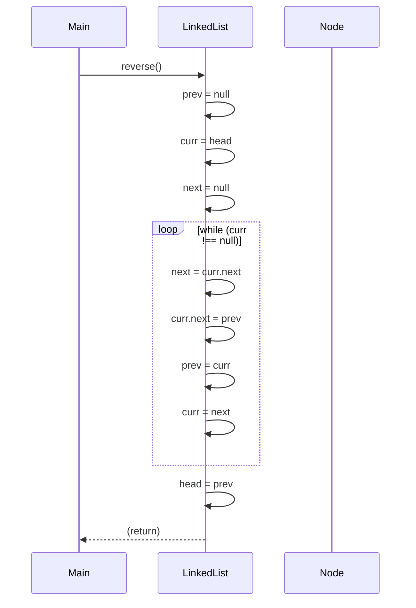

### 使用栈来完成链表的反转

```jsx
class Node {
  constructor(data) {
    this.data = data;
    this.next = null;
  }
}

class LinkedList {
  constructor() {
    this.head = null;
    this.size = 0;
  }

 

  reserveUsingStack() {
    if (this.head === null) {
      return;
    }
    let stack = [];
    let current = this.head;

    while (current !== null) {
      stack.push(current.data);
      current = current.next;
    }

    this.head = stack.pop();
    current = this.head;
    while (stack.length !== 0) {
      current.next = stack.pop();
      current = current.next;
    }
    current.next = null; // 最后一个节点的 next 指针置为 null
  }
}

const list = new LinkedList();
list.insertAtEnd('A');
list.insertAtEnd('B');
list.insertAtEnd('C');
list.insertAtEnd('D');
console.log(list.toString()); // 输出: ABCD
list.reserveUsingStack();
console.log(list.toString()); // 输出: DCBA

```


## **快慢指针查找单链表的中间部分**

```jsx
class Node {
  constructor(data) {
    this.data = data;
    this.next = null;
  }
}
class LinkedList {
  constructor() {
    this.head = null;
    this.size = 0;
  }

  deleteMiddle() {
    // 如果链表的头节点为空或只有一个节点，则将头节点设置为空
    if (this.head === null || this.head.next === null) {
      this.head = null;
      return;
    }
    // 使用快慢指针找到链表的中间节点
    let slow = this.head;
    let fast = this.head;
    let prev = null;

    // 快指针每次移动两步，慢指针每次移动一步
    while (fast!== null && fast.next!== null) {
      fast = fast.next.next;
      prev = slow;
      slow = slow.next;
    }
    // 将前一个节点的 next 指针指向中间节点的下一个节点，从而删除中间节点
    prev.next = slow.next;
    // 链表长度减 1
    this.size--;
  }

}
const list = new LinkedList();
list.insertAtEnd('A');
list.insertAtEnd('B');
list.insertAtEnd('C');
list.insertAtEnd('D');
list.deleteMiddle();
console.log(list.toString());

// 链表初始化为 A -> B -> C -> D。
// deleteMiddle() 被调用。
// slow 指向 A，fast 指向 A，prev 为 null。
// 循环迭代：
// fast 移动到 C，slow 移动到 B，prev 更新为 A。
// fast 移动到 null，循环结束。
// prev.next (即 A.next) 被设置为 slow.next (即 C)。
// 链表变为 A -> C -> D。
// toString() 方法将链表转换为字符串 "ACD"。

```

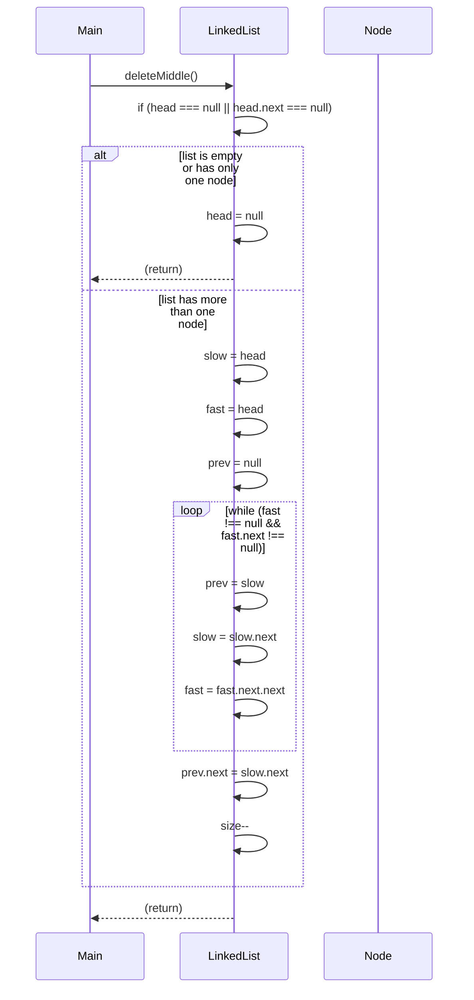


### 使用递归来 解决

```jsx
class Node {
  constructor(data) {
    this.data = data;
    this.next = null;
  }
}

class LinkedList {
  constructor() {
    this.head = null;
  }

  insertAtEnd(data) {
    const newNode = new Node(data);
    if (!this.head) {
      this.head = newNode;
    } else {
      let current = this.head;
      while (current.next) {
        current = current.next;
      }
      current.next = newNode;
    }
  }

  findMiddleRecursive(head) {
    return this._findMiddleRecursiveHelper(head, 0)[0];
  }

  _findMiddleRecursiveHelper(node, count) {
    if (node === null) {
      return [null, count]; // Base case: end of list
    }

    const [middleNode, updatedCount] = this._findMiddleRecursiveHelper(node.next, count + 1);

    if (updatedCount % 2 === 1 && updatedCount > 1) { // Odd number of nodes, return the middle
      return [node, updatedCount];
    } else if (updatedCount % 2 === 0 && updatedCount > 0) { //Even number of nodes, return the second middle
      return [middleNode, updatedCount];
    } else {
      return [middleNode, updatedCount];
    }
  }

  toString() {
    let current = this.head;
    let result = '';
    while (current !== null) {
      result += current.data + ' ';
      current = current.next;
    }
    return result.trim();
  }
}

const list = new LinkedList();
list.insertAtEnd('A');
list.insertAtEnd('B');
list.insertAtEnd('C');
list.insertAtEnd('D');
list.insertAtEnd('E');
list.insertAtEnd('F');

const middleNode = list.findMiddleRecursive(list.head);
console.log("Original List:", list.toString());
console.log("Middle Node:", middleNode ? middleNode.data : "List is empty");

const list2 = new LinkedList();
list2.insertAtEnd('A');
list2.insertAtEnd('B');
list2.insertAtEnd('C');
list2.insertAtEnd('D');
list2.insertAtEnd('E');

const middleNode2 = list2.findMiddleRecursive(list2.head);
console.log("\nOriginal List:", list2.toString());
console.log("Middle Node:", middleNode2 ? middleNode2.data : "List is empty");

```

## 倒数第N个节点

(思路也是双指针)

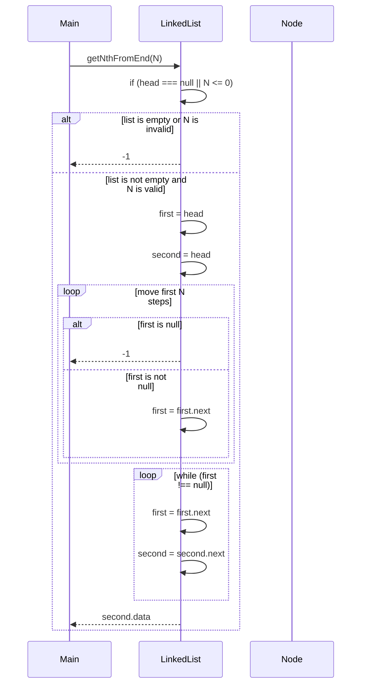

1. **Main** 调用 `list.getNthFromEnd(N)`：
    - `LinkedList` 检查链表是否为空或 `N` 是否无效（小于等于 0）。
        - 如果链表为空或 `N` 无效，返回 `1`。
    - 初始化两个指针 `first` 和 `second` 为 `head`。
    - 将 `first` 指针向前移动 `N` 步。
        - 如果在移动过程中 `first` 变为 `null`，则返回 `1`。
    - 同时移动 `first` 和 `second` 指针，直到 `first` 到达链表末尾。
    - 返回 `second` 指针指向的节点的数据。

```jsx
function getNthFromEnd(N):
    如果链表为空或 N 无效 (head === null || N <= 0):
        返回 -1
    初始化 first 为 head
    初始化 second 为 head
    将 first 指针向前移动 N 步:
        如果 first 变为 null:
            返回 -1
        否则:
            将 first 移动到下一个节点
    同时移动 first 和 second 指针，直到 first 到达链表末尾:
        将 first 移动到下一个节点
        将 second 移动到下一个节点
    返回 second 指针指向的节点的数据
```

```jsx
class Node {
  constructor(data) {
    this.data = data;
    this.next = null;
  }
}

class LinkedList {
  constructor() {
    this.head = null;
    this.size = 0;
  }

  getNthFromEnd(n) {
    let current = this.head;
    if (this.head === null || n < 0) {
      return -1;
    }
    let first = this.head;
    let second = this.head;

    for (let i = 0; i < n; i++) {
      if (first === null) {
        return -1;
      }
      first = first.next;
    }
    while (first !== null) {
      first = first.next;
      second = second.next;
    }
    return second.data;
  }

}

let list = new LinkedList();
list.add(1);
list.add(2);
list.add(3);
list.add(4);
list.add(5);
console.log(list.getNthFromEnd(2));

```

## 回文链表

### 双指针法

1. **找到链表的中间节点**：使用快慢指针法找到链表的中间节点。
2. **反转后半部分链表**：将链表的后半部分反转。
3. **比较前半部分和反转后的后半部分**：逐个比较前半部分和反转后的后半部分的节点值。
4. **恢复链表**：如果需要，可以将链表恢复到原始状态。

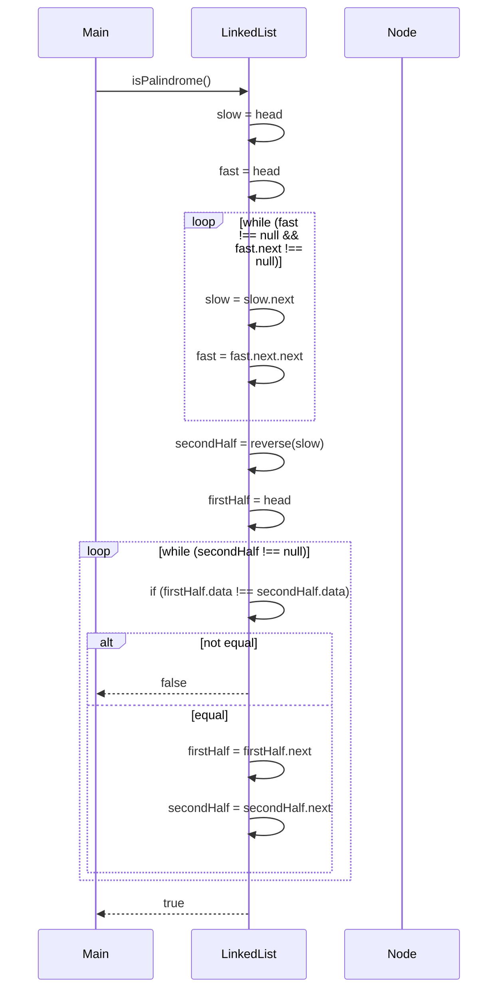

# 双链表


## 什么是 双向链表

**双向链表**是一种由一组节点组成的数据结构，每个节点包含一个**值**和**两个指针**，一个指向列表中的**前一个节点**，一个指向列表中的**下一个节点**。这允许在**两个方向**上高效地遍历列表，使其适合需要频繁**插入**和**删除**的应用程xu

### 双向链表和单链表的区别是什么？

**双向链表和单链表的区别：**

| **特性** | **双向链表** | **单链表** |
| --- | --- | --- |
| 指针数量 | 每个节点有两个指针 (前驱和后继) | 每个节点只有一个指针 (后继) |
| 遍历方向 | 可向前和向后遍历 | 只能向前遍历 |
| 插入/删除效率 | 插入和删除操作在已知节点的情况下效率更高 | 插入和删除操作需要遍历到目标节点，效率较低 |
| 内存开销 | 每个节点需要更多内存空间 | 每个节点需要较少内存空间 |


### 在JavaScript中 双向链表的 表示

### 数据结构中的 表示


```jsx
1. Data
    
    数据
    
2. A pointer to the next node (**next**)
    
    指向下一个节点（ **next** ）的指针
    
3. A pointer to the previous node (**prev**)
    
    指向前一个节点的指针 ( **prev** )
```

### head and tail

- **`head` (头指针):** 指向链表中第一个节点的指针。 如果链表为空，则 `head` 为 `null` 或 `nullptr` (取决于编程语言)。 通过 `head` 指针，可以从链表的头部开始遍历整个链表。
- **`tail` (尾指针):** 指向链表中最后一个节点的指针。 如果链表为空，则 `tail` 为 `null` 或 `nullptr`。 通过 `tail` 指针，可以从链表的尾部开始反向遍历整个链表，或者在链表尾部高效地添加新节点。

**为什么要使用 `head` 和 `tail` 指针？**

使用 `head` 和 `tail` 指针的主要原因是提高效率：

- **快速访问链表的起始和结束位置:** 无需遍历整个链表就能直接访问第一个和最后一个节点。 这在许多操作中，例如在链表头部或尾部添加或删除节点时，非常重要。
- **简化操作:** `head` 和 `tail` 指针简化了链表操作的实现，特别是对于在链表两端进行插入和删除操作。 例如，在链表尾部添加节点时，只需要修改 `tail` 指针和新节点的指针即可，而无需遍历整个链表。

假设一个双向链表包含节点 10, 20, 30。 那么：

- `head` 指向包含数据 10 的节点。
- `tail` 指向包含数据 30 的节点。

### 在JavaScript中的 表示

```jsx
class Node {
  constructor(data) {
    this.data = data;
    this.next = null;
    this.prev = null;
  }
}

class DoublyLinkedList {
  constructor() {
    this.head = null;
    this.tail = null;
    this.size = 0;
  }

  // Add node at start
  insertFirst(data) {
    const newNode = new Node(data);
    if (!this.head) {
      this.head = newNode;
      this.tail = newNode;
    } else {
      newNode.next = this.head;
      this.head.prev = newNode;
      this.head = newNode;
    }
    this.size++;
  }

  // Add node at end
  insertLast(data) {
    const newNode = new Node(data);
    if (!this.tail) {
      this.head = newNode;
      this.tail = newNode;
    } else {
      newNode.prev = this.tail;
      this.tail.next = newNode;
      this.tail = newNode;
    }
    this.size++;
  }

  // Insert at index
  insert(index, data) {
    if (index < 0 || index > this.size) {
      throw new Error('Index out of range');
    }

    if (index === 0) return this.insertFirst(data);
    if (index === this.size) return this.insertLast(data);

    const newNode = new Node(data);
    let current = this.head;
    for (let i = 0; i < index - 1; i++) {
      current = current.next;
    }

    newNode.next = current.next;
    newNode.prev = current;
    current.next.prev = newNode;
    current.next = newNode;
    this.size++;
  }

  // Remove first node
  /**
   * 移除链表中的第一个节点
   * @throws {Error} 如果链表为空，则抛出错误
   */
  removeFirst() {
    // 如果链表为空，则抛出错误
    if (!this.head) {
      throw new Error('List is empty');
    }

    // 如果链表中只有一个节点
    if (this.head === this.tail) {
      // 将头节点和尾节点都设置为null
      this.head = null;
      this.tail = null;
    } else {
      // 将头节点指向下一个节点
      this.head = this.head.next;
      // 将新的头节点的prev指针设置为null
      this.head.prev = null;
    }
    // 链表长度减1
    this.size--;
  }

  // Remove last node
  removeLast() {
    if (!this.tail) {
      throw new Error('List is empty');
    }

    if (this.head === this.tail) {
      this.head = null;
      this.tail = null;
    } else {
      this.tail = this.tail.prev;
      this.tail.next = null;
    }
    this.size--;
  }

  // Remove at index
  /**
   * 移除链表中的最后一个节点
   * @throws {Error} 如果链表为空，则抛出错误
   */
  removeLast() {
    // 如果链表为空，则抛出错误
    if (!this.tail) {
      throw new Error('List is empty');
    }

    // 如果链表中只有一个节点
    if (this.head === this.tail) {
      // 将头节点和尾节点都设置为null
      this.head = null;
      this.tail = null;
    } else {
      // 将尾节点指向前一个节点
      this.tail = this.tail.prev;
      // 将新的尾节点的next指针设置为null
      this.tail.next = null;
    }
    // 链表长度减1
    this.size--;
  }
  /**
   * 反转链表
   */
  reverse() {
    // 当前节点指向头节点
    let current = this.head;
    // 头节点指向尾节点
    this.head = this.tail;
    // 尾节点指向当前节点
    this.tail = current;

    // 遍历链表
    while (current) {
      // 保存当前节点的下一个节点
      const next = current.next;
      // 当前节点的下一个节点指向前一个节点
      current.next = current.prev;
      // 当前节点的前一个节点指向保存的下一个节点
      current.prev = next;
      // 当前节点指向下一个节点
      current = next;
    }
  }

  /**
   * 检查链表中是否包含指定的数据
   * @param {*} data - 需要检查的数据
   * @returns {boolean} - 如果链表中包含指定数据，返回true；否则返回false
   */
  contains(data) {
    // 从链表的头节点开始遍历
    let current = this.head;
    // 遍历链表
    while (current) {
      // 如果当前节点的数据等于指定的数据
      if (current.data === data) {
        // 返回true
        return true;
      }
      // 当前节点指向下一个节点
      current = current.next;
    }
    // 如果遍历完链表都没有找到指定的数据，返回false
    return false;
  }

  // Convert to array
  /**
   * 将链表转换为数组
   * @returns {Array} - 包含链表中所有节点数据的数组
   */
  toArray() {
    // 创建一个空数组用于存储结果
    const result = [];
    // 当前节点指向头节点
    let current = this.head;
    // 遍历链表
    while (current) {
      // 将当前节点的数据添加到结果数组中
      result.push(current.data);
      // 当前节点指向下一个节点
      current = current.next;
    }
    // 返回结果数组
    return result;
  }

  // Get nth from end
  /**
   * 获取链表中倒数第n个节点的数据
   * @param {number} n - 需要获取的节点位置，从0开始计数
   * @returns {*} - 倒数第n个节点的数据
   * @throws {Error} 如果n小于0或大于等于链表长度，则抛出错误
   */
  getNthFromEnd(n) {
    // 检查n是否有效
    if (n < 0 || n >= this.size) {
      // 如果n无效，抛出错误
      throw new Error('Invalid position');
    }

    // 从链表的尾节点开始遍历
    let current = this.tail;
    // 遍历链表
    for (let i = 0; i < n; i++) {
      // 当前节点指向前一个节点
      current = current.prev;
    }
    // 返回当前节点的数据
    return current.data;
  }

  // Check if empty
  isEmpty() {
    return this.size === 0;
  }

  // Clear the list
  clear() {
    this.head = null;
    this.tail = null;
    this.size = 0;
  }

  // Check if palindrome
  /**
   * 检查链表是否为回文链表
   * @returns {boolean} - 如果链表是回文链表，返回true；否则返回false
   */
  isPalindrome() {
    // 如果链表为空，直接返回true
    if (!this.head) return true;

    // 初始化两个指针，分别指向链表的头节点和尾节点
    let left = this.head;
    let right = this.tail;

    // 遍历链表，直到两个指针相遇或者交叉
    while (left !== right && left.prev !== right) {
      // 如果两个指针指向的节点数据不相等，说明链表不是回文链表，返回false
      if (left.data !== right.data) return false;
      // 左指针向右移动
      left = left.next;
      // 右指针向左移动
      right = right.prev;
    }
    // 如果遍历完链表都没有找到不相等的节点，说明链表是回文链表，返回true
    return true;
  }

  // String representation
  toString() {
    let current = this.head;
    let result = '';
    while (current) {
      result += current.data + ' <-> ';
      current = current.next;
    }
    return result + 'null';
  }
}

// Test Cases
const dll = new DoublyLinkedList();

// Test Insert First/Last
dll.insertFirst(3);
dll.insertFirst(2);
dll.insertFirst(1);
dll.insertLast(4);
console.log('After insertFirst/Last:', dll.toString()); // 1 <-> 2 <-> 3 <-> 4 <-> null

// Test Remove First/Last
dll.removeFirst();
console.log('After removeFirst:', dll.toString()); // 2 <-> 3 <-> 4 <-> null

dll.removeLast();
console.log('After removeLast:', dll.toString()); // 2 <-> 3 <-> null

// Test Insert/Remove at index
dll.insert(1, 2.5);
console.log('After insert at index 1:', dll.toString()); // 2 <-> 2.5 <-> 3 <-> null

dll.removeAt(1);
console.log('After remove at index 1:', dll.toString()); // 2 <-> 3 <-> null

// Test Reverse
dll.reverse();
console.log('After reverse:', dll.toString()); // 3 <-> 2 <-> null

// Test Contains
console.log('Contains 2:', dll.contains(2)); // true
console.log('Contains 5:', dll.contains(5)); // false

// Test toArray
console.log('Array representation:', dll.toArray()); // [3, 2]

// Test getNthFromEnd
console.log('1st from end:', dll.getNthFromEnd(0)); // 2

// Test Edge Cases
try {
  dll.insert(10, 4);
} catch (e) {
  console.log('Insert error:', e.message); // Index out of range
}

try {
  dll.removeAt(10);
} catch (e) {
  console.log('Remove error:', e.message); // Index out of range
}

// Test Palindrome
dll.clear();
dll.insertLast(1);
dll.insertLast(2);
dll.insertLast(3);
dll.insertLast(2);
dll.insertLast(1);
console.log('Is palindrome:', dll.isPalindrome()); // true

dll.clear();
dll.insertLast(1);
dll.insertLast(2);
dll.insertLast(3);
console.log('Is palindrome:', dll.isPalindrome()); // false

// Test Clear
dll.clear();
console.log('After clear:', dll.toString()); // null
console.log('Is empty:', dll.isEmpty()); // true

```

# 循环链表

### 循环链表的介绍

循环链表是一种链表的变体，其中最后一个节点指向第一个节点，形成一个闭环。与单链表和双链表不同，循环链表没有明确的“结束”节点，因为它的最后一个节点指向第一个节点。这种结构在某些应用中非常有用，例如实现循环队列或轮询系统。

### 循环链表的特点：

1. **闭环结构**：最后一个节点指向第一个节点。
2. **灵活性**：可以轻松地在链表中循环遍历。
3. **节省空间**：不需要额外的指针来表示链表的结束。

All

### 循环链表的CRUD功能

### 1. 创建（Create）

创建一个循环链表需要定义一个节点结构，并初始化链表的头节点。

```jsx
class Node {
    constructor(data) {
        this.data = data;
        this.next = null;
    }
}

class CircularLinkedList {
    constructor() {
        this.head = null;
    }

    append(data) {
        const newNode = new Node(data);
        if (!this.head) {
            this.head = newNode;
            newNode.next = this.head;
        } else {
            let temp = this.head;
            while (temp.next !== this.head) {
                temp = temp.next;
            }
            temp.next = newNode;
            newNode.next = this.head;
        }
    }
}

```

### 2. 读取（Read）

读取循环链表中的数据可以通过遍历链表来实现。

```jsx
    display() {
        if (!this.head) {
            console.log("List is empty");
            return;
        }
        let temp = this.head;
        do {
            console.log(temp.data);
            temp = temp.next;
        } while (temp !== this.head);
    }

```

### 3. 更新（Update）

更新循环链表中的节点数据可以通过遍历链表找到目标节点并更新其数据。

```jsx
    update(oldData, newData) {
        if (!this.head) {
            console.log("List is empty");
            return;
        }
        let temp = this.head;
        do {
            if (temp.data === oldData) {
                temp.data = newData;
                return;
            }
            temp = temp.next;
        } while (temp !== this.head);
        console.log("Data not found");
    }

```

### 4. 删除（Delete）

删除循环链表中的节点需要找到目标节点并调整其前一个节点的指针。

```jsx
    delete(data) {
        if (!this.head) {
            console.log("List is empty");
            return;
        }
        if (this.head.data === data) {
            if (this.head.next === this.head) {
                this.head = null;
            } else {
                let temp = this.head;
                while (temp.next !== this.head) {
                    temp = temp.next;
                }
                temp.next = this.head.next;
                this.head = this.head.next;
            }
            return;
        }
        let current = this.head;
        let previous = null;
        do {
            previous = current;
            current = current.next;
            if (current.data === data) {
                previous.next = current.next;
                return;
            }
        } while (current !== this.head);
        console.log("Data not found");
    }
}

```

### 示例使用

```jsx
const cll = new CircularLinkedList();
cll.append(1);
cll.append(2);
cll.append(3);
cll.display(); // 输出: 1 2 3

cll.update(2, 4);
cll.display(); // 输出: 1 4 3

cll.delete(1);
cll.display(); // 输出: 4 3

```