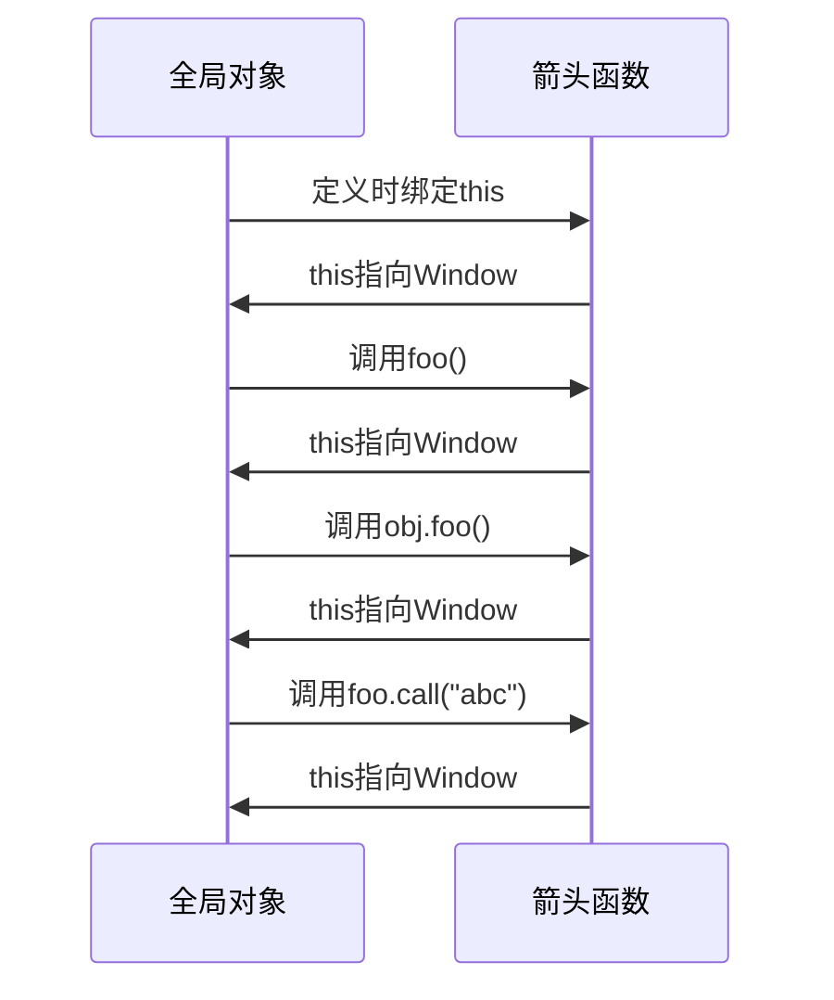
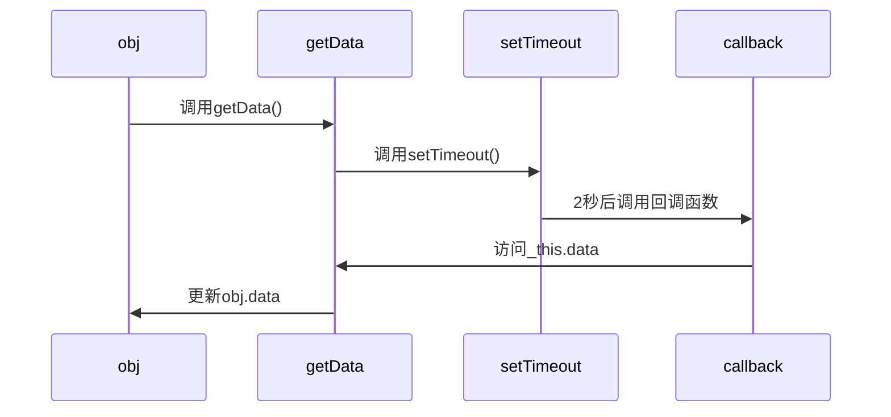

## Python Lambda 与 JavaScript 箭头函数：深度对比

在 Python 和 JavaScript 这两种流行的编程语言中，都存在一种用于创建小型、匿名函数的简洁语法：Python 中的 `lambda` 函数和 JavaScript 中的箭头函数 (`=>`)。虽然它们都旨在提供一种更紧凑的方式来定义函数，尤其是在函数作为参数传递或用于简单操作时，但它们在语法、功能和设计哲学上存在显著的差异。


### 相似之处

1.  **匿名函数 (Anonymous Functions)**：
    *   两者都是创建匿名函数的方式，即它们在定义时不需要显式地指定函数名称。
    *   Python: `lambda arguments: expression`
    *   JavaScript: `(arguments) => expression`

2.  **简洁的语法 (Concise Syntax)**：
    *   它们都提供了比传统函数定义（Python 的 `def`，JavaScript 的 `function`）更短的语法，特别适用于简单的单行函数。

3.  **内联使用 (Inline Usage)**：
    *   常用于需要函数作为参数的场景，例如在 `map()`, `filter()`, `sorted()` (Python) 或 `Array.prototype.map()`, `Array.prototype.filter()`, `Array.prototype.sort()` (JavaScript) 等高阶函数中，以及作为回调函数。

    ```python
    # Python Lambda with map
    numbers = [1, 2, 3, 4]
    squared = list(map(lambda x: x * x, numbers))
    # squared is [1, 4, 9, 16]
    ```

    ```javascript
    // JavaScript Arrow Function with map
    const numbers = [1, 2, 3, 4];
    const squared = numbers.map(x => x * x);
    // squared is [1, 4, 9, 16]
    ```

4.  **可赋值给变量 (Assignable to Variables)**：
    *   虽然是匿名的，但它们都可以被赋值给一个变量，然后像普通函数一样被调用。

    ```python
    add = lambda x, y: x + y
    result = add(5, 3) # result is 8
    ```

    ```javascript
    const add = (x, y) => x + y;
    const result = add(5, 3); // result is 8
    ```

5.  **闭包 (Closures)**：
    *   两者都可以捕获其定义时所在作用域中的变量，形成闭包。

    ```python
    def outer_func_py(x):
        return lambda y: x + y
    
    add_five_py = outer_func_py(5)
    print(add_five_py(3)) # Output: 8
    ```

    ```javascript
    function outerFuncJs(x) {
      return y => x + y;
    }
    const addFiveJs = outerFuncJs(5);
    console.log(addFiveJs(3)); // Output: 8
    ```

### 不同之处

| 特性                      | Python `lambda`                                  | JavaScript 箭头函数 (`=>`)                               |
| :------------------------ | :----------------------------------------------- | :------------------------------------------------------- |
| **语法**                  | `lambda arguments: expression`                   | `(param) => expression` <br> `param => expression` <br> `(p1, p2) => expression` <br> `(p1, p2) => { statements; return val; }` <br> `() => expression` |
| **函数体**                | 只能包含**单个表达式**，不能是语句块。表达式的结果被隐式返回。 | 可以是单个表达式（隐式返回），也可以是包含多条语句的块（需要显式 `return`，除非是 `void` 函数）。 |
| **`this` 绑定**           | 不适用（Python 中对应的是 `self`，其行为与普通函数在类中定义时一致）。 | **词法绑定 `this`**。箭头函数不创建自己的 `this` 上下文，它会捕获其定义时所在上下文的 `this` 值。 |
| **`arguments` 对象**      | 不适用（可以使用 `*args` 和 `**kwargs`）。         | **没有自己的 `arguments` 对象**。如果使用 `arguments`，它会引用外层（非箭头）函数的 `arguments` 对象。可以使用剩余参数 `...args`。 |
| **用作构造函数**          | 不适用。                                         | **不能用作构造函数** (不能使用 `new` 调用)。它们也没有 `prototype` 属性。 |
| **`yield` 关键字**        | 不能包含 `yield` 关键字（即不能直接创建生成器）。 | 不能直接用作生成器函数（不能在其主体中使用 `yield` 来使其成为生成器）。 |
| **多行与语句**            | 不支持多行语句。                                 | 支持多行语句（当使用 `{}` 块时）。                       |
| **换行**                  | 表达式通常在一行内，复杂的换行可能降低可读性。   | 表达式或语句块可以更容易地跨越多行。                     |

#### 详细解释差异：

1.  **函数体 (Body)**:
    *   **Python `lambda`**: 严格限制为一个表达式。这意味着你不能在 `lambda` 中使用 `if/else` 语句（除非是三元表达式）、`for` 循环、`try/except` 块或赋值语句（Python 3.8+ 的赋值表达式 `:=` 是个例外，但仍受限于整体是表达式）。
        ```python
        # Good: single expression
        is_even = lambda x: x % 2 == 0
        
        # Bad: lambda cannot contain statements like a full if/else block
        # greet = lambda name: if name: print(f"Hello, {name}") else: print("Hello!") # SyntaxError
        
        # Workaround with conditional expression
        greet = lambda name: f"Hello, {name}" if name else "Hello!"
        ```
    *   **JavaScript 箭头函数**: 更加灵活。如果函数体只有一个表达式，可以省略花括号 `{}`，并且该表达式的值会自动返回。如果需要多条语句，则必须使用花括号，并且如果需要返回值，则必须使用 `return` 语句。
        ```javascript
        // Single expression, implicit return
        const isEven = x => x % 2 === 0;

        // Block body, explicit return needed for non-void functions
        const greet = name => {
          if (name) {
            return `Hello, ${name}`;
          } else {
            return "Hello!";
          }
        };
        const logMessage = message => { console.log(message); }; // Implicitly returns undefined
        ```

2.  **`this` 绑定 (JavaScript Specific)**:
    *   这是箭头函数与传统 JavaScript `function` 表达式最显著的区别之一。
    *   **传统函数**: `this` 的值取决于函数是如何被调动的（例如，作为对象方法、普通函数、构造函数等）。这常常导致混淆，尤其是在回调函数中。
    *   **箭头函数**: `this` 是词法绑定的，意味着它继承自其外层作用域的 `this` 值。这使得在回调函数或方法中使用 `this` 更加直观。
        ```javascript
        function Person(name) {
          this.name = name;
          this.age = 0;

          // Traditional function - 'this' would be undefined or window in strict/non-strict mode
          // setInterval(function growUp() {
          //   this.age++; // 'this' here is not the Person instance
          //   console.log(this.age);
          // }, 1000);

          // Arrow function - 'this' correctly refers to the Person instance
          setInterval(() => {
            this.age++;
            console.log(`${this.name} is now ${this.age}`);
          }, 1000);
        }
        const person = new Person("Alice");
        ```

3.  **`arguments` 对象 (JavaScript Specific)**:
    *   传统 JavaScript 函数内部可以访问一个类数组对象 `arguments`，它包含了传递给函数的所有参数。
    *   箭头函数没有自己的 `arguments` 对象。如果需要在箭头函数中访问所有参数，应该使用剩余参数语法 (`...args`)。
        ```javascript
        function traditionalFunc() {
          console.log(arguments[0]); // Works
        }
        traditionalFunc(1, 2, 3); // 1

        const arrowFunc = (...args) => {
          // console.log(arguments[0]); // ReferenceError: arguments is not defined (or refers to an outer function's arguments)
          console.log(args[0]); // Works
        };
        arrowFunc(1, 2, 3); // 1
        ```

4.  **用作构造函数 (JavaScript Specific)**:
    *   传统函数可以用 `new` 关键字调用以创建对象实例。
    *   箭头函数不能用作构造函数。尝试用 `new` 调用箭头函数会导致 `TypeError`。它们也没有 `prototype` 属性。

### 设计哲学

#### Python `lambda`
*   **简洁性与可读性优先**：Python 的设计哲学强调代码的可读性。`lambda` 被设计为一种创建非常简单的、一次性使用的小型函数的快捷方式。
*   **限制单一表达式**：这个限制是故意的。如果一个匿名函数需要执行多个语句或复杂的逻辑，Python 社区和 Guido van Rossum（Python 的创造者）鼓励开发者使用标准的 `def` 语句来定义一个命名函数。这有助于保持 `lambda` 的简洁性，并促使更复杂的逻辑拥有一个明确的名称和结构，从而提高整体代码的可读性。
*   **“一种，最好只有一种明显的方法来做这件事” (The Zen of Python)**：对于非常简单的函数转换，`lambda` 是明显的选择。对于更复杂的情况，`def` 是明显的选择。`lambda` 并不是要取代 `def`，而是作为其在特定场景下的补充。
*   **避免滥用**：Python 社区通常不鼓励编写过于复杂或难以理解的 `lambda` 函数。如果一个 `lambda` 变得难以阅读，那么就应该用 `def` 来重写它。

#### JavaScript 箭头函数
*   **更短的函数语法**：一个主要目标是提供一种比传统 `function` 表达式更简洁的语法，减少样板代码。
*   **解决 `this` 的痛点**：词法 `this` 是箭头函数的一个核心特性。在 ES6 之前，JavaScript 中 `this` 的动态绑定行为是许多常见错误的来源，尤其是在面向对象编程和处理回调函数时。箭头函数通过从其封闭的词法作用域继承 `this`，极大地简化了 `this` 的管理。
*   **现代化 JavaScript**：箭头函数是 ECMAScript 6 (ES2015) 中引入的一系列旨在使 JavaScript 更加强大和易于使用的新特性之一。它们反映了 JavaScript 向支持更复杂应用程序和现代编程范式（如函数式编程）的演进。
*   **多功能性**：虽然也强调简洁，但 JavaScript 箭头函数在函数体方面比 Python `lambda` 更灵活，允许包含语句块。这使得它们不仅适用于简单的表达式，也适用于略微复杂一些的匿名函数逻辑，而无需总是退回到完整的 `function` 声明。

### 何时使用？

*   **Python `lambda`**:
    *   当你需要一个简单、单行的函数作为高阶函数（如 `map`, `filter`, `sorted` 的 `key` 参数）的参数时。
    *   用于 GUI 框架中的简单回调。
    *   当一个完整的 `def` 语句显得过于冗长，且函数逻辑非常直接明了时。

*   **JavaScript 箭头函数**:
    *   **回调函数**：尤其是在需要保留外部 `this` 上下文时（例如，在 `setTimeout`, `setInterval`, 事件处理器，Promise 链中）。
    *   当需要一个简洁的匿名函数，并且其逻辑可以是一个简单表达式或一个简短的语句块时。
    *   在数组方法如 `.map()`, `.filter()`, `.reduce()`, `.forEach()` 中。
    *   不适合用作对象方法（如果方法需要访问调用该方法的对象的 `this`，并且希望 `this` 是动态绑定的），也不适合用作构造函数。

### 结论

Python 的 `lambda` 和 JavaScript 的箭头函数都是各自语言中用于创建匿名函数的强大工具，它们都旨在提高代码的简洁性和表达力。

Python 的 `lambda` 更加严格，专注于单一表达式，强调在保持极度简洁的同时，将复杂逻辑交由命名函数处理，以维护代码的整体可读性。

JavaScript 的箭头函数则在提供简洁语法的同时，着重解决了长期以来 `this` 绑定的问题，并提供了相对更大的灵活性，允许包含语句块，使其适用范围更广一些。


## JavaScript的箭头函数详解
## 箭头函数

箭头函数是ES6（ECMAScript 2015）引入的一种新的函数定义方式，它提供了一种更简洁的函数写法。以下是箭头函数的一些特点和编写方法：

**任何可以使用函数表达式的地方都可以使用箭头函数**

```jsx
参数 => 函数体
 //如果函数体只有一行，可以省略大括号  {}  和  return  关键字，直接返回表达式的结果

() => {
  // 函数体
}

param => {
  // 函数体
}
// 或者简写为
param => 表达式
//如果函数 执行体 只有一行代码 那么{}也可以省略 默认将这个行代码的执行过程作为返回值

(param1, param2) => {
  // 函数体
}
//如果函数体有多行，需要使用大括号  {}  包裹，并显式使用  return  关键字返回值。

```

### 箭头函数的参数

**箭头函数中的参数数量不受限制**

箭头函数对于简单的操作很方便，特别是对于单行的函数。它具体有两种形式：

1. 不带花括号：`(...args) => expression` —— 右侧是一个表达式：函数计算表达式并返回其结果。如果只有一个参数，则可以省略括号，例如 `n => n*2`。
2. 带花括号：`(...args) => { body }` —— 花括号允许我们在函数中编写多个语句，但是我们需要显式地 `return` 来返回一些内容。
3. 没有 `this` 箭头函数不会创建自己的  this  上下文，它会捕获其所在上下文的  this  值，作为自己的  this  值。
4. 没有 `arguments` 箭头函数没有自己的 arguments  对象，它会捕获其所在上下文的  arguments  对象。
5. 不能使用 `new` 进行调用(箭头函数不能作为构造函数使用)
6. 它们也没有 `super`，但目前我们还没有学到它。我们将在 [类继承](https://zh.javascript.info/class-inheritance) 一章中学习它

### example code1

```jsx
// 无参数
const sayHello = () => console.log('Hello, World!');

// 单个参数
const square = x => x * x;

// 多个参数
const sum = (a, b) => a + b;

// 函数体多行
const calculate = (x, y) => {
  let result = x + y;
  return result;
};

```

```jsx
//arrow funtion
let arrowsum =(a,b)=>{
    return a+b;
};
//funtion Expression
let FuntionExpressionsum =function (a,b){
    return a+b;
}
console.log(arrowsum(3,5));
console.log(FuntionExpressionsum(3,5));
```

箭头函数的语法适合嵌入

一个参数可以不用括号,0个或多个参数就需要括号

箭头函数也可以不适用大括号,这样会改变函数的行为

**箭头函数不能使用 argument,super,new,target 等属性**

1只能通过定义的字来访问

```jsx
function foo (){
    console.log(arguments[0]);
}
foo(5);
let bar =()=>{
    console.log(arguments[5]);
}
bar(5);// undefined
```

可以通过包装函数中把他提供给箭头函数(闭包)

```jsx
function foo(){
    let bar= ()=>{
        console.log(arguments[0]);
    }
    bar();
}
foo(5)
```

### 箭头函数的实践

## **箭头函数的总实践**

```jsx
let sum=(a,b)=>a+b;
console.log(sum(1,2));
let square =(sum)=>sum*sum;
console.log(square(10));
let sayhi=()=>console.log("hello");
sayhi();

let  age = prompt ("what is your age",18);
let  welcome =(age<18) ?
()=>console.log("hello"):
()=>console.log("greet");

welcome();
// wrong Uncaught ReferenceError ReferenceError: prompt is not defined

function ask(question, yes, no) {
    if (confirm(question)) yes();
    else no();
  }

  ask(
    "Do you agree?",
    function() { alert("You agreed."); },
    function() { alert("You canceled the execution."); }
  );

// 实现上面的箭头函数

const  ask =(question,yes ,no)=>confirm(question) ? yes():no()
{
    "do you agree"
    =()=>alert("you are agree")
    =()=>alert("not")
}
function defer(f, ms) {
    return function() {
      setTimeout(() => f.apply(this, arguments), ms);
    };
  }

  function sayHi(who) {
    alert('Hello, ' + who);
  }

  let sayHiDeferred = defer(sayHi, 2000);
  sayHiDeferred("John"); // 2 秒后显示：Hello, John
```

箭头函数：在 ES6 中引入了箭头函数语法，它提供了一种更简洁的方式来定义函数。箭头函数使用箭头符号 => 来分隔参数列表和函数体。例如，下面的代码定义了一个箭头函数，它与之前的 square 函数具有相同的行为：

```jsx
let sum = (a, b) => a + b;

/* 这个箭头函数是下面这个函数的更短的版本：

let sum = function(a, b) {
  return a + b;
};
*/

alert( sum(1, 2) ); // 3
```

可以看到 `(a, b) => a + b` 表示一个函数接受两个名为 `a` 和 `b` 的参数。在执行时，它将对表达式 `a + b` 求值，并返回计算结果。

- 如果我们只有一个参数，还可以省略掉参数外的圆括号，使代码更短。
    
    例如：
    
    ```jsx
    let double = n => n * 2;
    // 差不多等同于：let double = function(n) { return n * 2 }
    
    alert( double(3) ); // 6
    ```
    
- 如果没有参数，括号则是空的（但括号必须保留）：
    
    ```jsx
    let sayHi = () => alert("Hello!");
    
    sayHi();
    ```
    

**示例 2 - 单参数和隐式返回**

```jsx
const square = x => x * x;

console.log(square(4)); // 输出：16
```

在这个示例中，我们定义了一个箭头函数 `square`，它接受一个参数 `x`，并返回 `x` 的平方。我们省略了括号，因为只有一个参数，并使用隐式返回，因为函数体只包含一个表达式。

**示例 3 - 在数组方法中使用箭头函数**

```jsx
const numbers = [1, 2, 3, 4, 5];

const doubledNumbers = numbers.map(number => number * 2);

console.log(doubledNumbers); // 输出：[2, 4, 6, 8, 10]
```

在这个示例中，我们使用箭头函数作为 `Array.map()` 方法的参数，以将数组 `numbers` 中的每个数字乘以 2。

### **多行的箭头函数**

多行箭头函数是指箭头函数的函数体包含多行代码。在这种情况下，需要使用大括号 `{}` 包裹函数体，并在函数体中显式地使用 `return` 语句返回结果。

以下是一个多行箭头函数的示例：

```jsx
const addAndMultiply = (a, b, c) => {
  const sum = a + b;
  const result = sum * c;
  return result;
};

console.log(addAndMultiply(1, 2, 3)); // 输出：6
```

在这个示例中，我们定义了一个名为 `addAndMultiply` 的多行箭头函数。它接收三个参数：`a`、`b` 和 `c`。函数体包含三行代码：计算 `a` 和 `b` 的和，将结果乘以 `c`，并返回最终结果。因为函数体包含多行代码，我们使用大括号 `{}` 包裹函数体并显式地使用 `return` 语句返回结果

## 没有重载

## **没有重载**

在Javascript中没有重载,定义了俩个同名函数,后定义的会覆盖之前定义的

因为变量addsum被指向,第二个函数对象了//在个这个时候,函数内存的情况?

```jsx
function addsum(a,b){
    return a+b
}
function addsum(a,b){
    return a+b+100;
}
console.log(addsum(1,2));
coya@MacBook-Pro-2 8_funtion % node 7.js
103
```

### 箭头函数中的this

**箭头函数没有 `this`。如果访问 `this`，则会从外部获取。**

**当我们说箭头函数没有 `this` 时，实际上是指箭头函数不会创建自己的 `this` 上下文。相反，箭头函数在其词法环境中捕获了包含它的函数或全局作用域的 `this` 值。**

下面是一个解释箭头函数中的 `this` 行为的示例：

```jsx
// 1. 测试箭头函数中this指向
var name = "why";

var foo = () => {
  console.log(this);
};

foo(); // 这里的this指向全局对象（在浏览器中是window，在Node.js中是global）

var obj = {foo: foo};
obj.foo(); // 这里的this仍然指向全局对象

foo.call("abc"); // 这里的this也指向全局对象

```



```jsx
function Person(){
    this.age=0;
    setInterval(()=>{
        this.age++;
        console.log(this.age);
    },1000);
}

const person = new Person();

```

在ES6引入箭头函数之前，JavaScript 开发者确实经常遇到   this   指向问题，尤其是在处理回调函数（如   setTimeout  ）时。开发者们采用了多种方法来解决这个问题，其中最常见的是使用闭包。

```jsx
var obj = {
  data: [],
  getData: function() {
    // 发送网络请求，将结果放到上面data属性中
    var _this = this; // 创建一个变量 _this 来存储当前的 this 值
    setTimeout(function() {
      var result = ["abc", "cba", "nba"];
      _this.data = result; // 使用 _this 来访问外部函数的 this
    }, 2000);
  }
};

obj.getData();

```



使用箭头函数的处理

```jsx
 const obj = {
  data: [],
  getData: function() {
    setTimeout(() => { // 使用箭头函数替代普通函数
      const result = ["abc", "cba", "nba"];
      this.data = result; // 直接使用外层的 this（指向 obj）
    }, 2000);
  }
};
```

**不能对箭头函数进行 `new` 操作(箭头函数是没有原型的)**

不具有 `this` 自然也就意味着另一个限制：箭头函数不能用作构造器（constructor）。不能用 `new` 调用它们。

```jsx
var bar = () => {
}

console.log(bar.prototype) //
function foo() {
    // 函数体
}

// 输出函数的prototype属性
console.log(foo.prototype);

// 输出函数的[[Prototype]]属性，即函数本身的原型
console.log(Object.getPrototypeOf(foo));

```

### **箭头函数 VS bind**

箭头函数 `=>` 和使用 `.bind(this)` 调用的常规函数之间有细微的差别：

- `.bind(this)` 创建了一个该函数的“绑定版本”。
- 箭头函数 `=>` 没有创建任何绑定。箭头函数只是没有 `this`。`this` 的查找与常规变量的搜索方式完全相同：在外部词法环境中查找。

箭头函数也没有 `arguments` 变量。

当我们需要使用当前的 `this` 和 `arguments` 转发一个调用时，这对装饰器（decorators）来说非常有用。

例如，`defer(f, ms)` 获得了一个函数，并返回一个包装器，该包装器将调用延迟 `ms` 毫秒：

```jsx
function defer(f, ms) {
  return function() {
    setTimeout(() => f.apply(this, arguments), ms);
  };
}

function sayHi(who) {
  alert('Hello, ' + who);
}

let sayHiDeferred = defer(sayHi, 2000);
sayHiDeferred("John"); // 2 秒后显示：Hello, Joh
```

# 箭头函数和普通函数的区别

| 特性 | 箭头函数 | 普通函数 |
| --- | --- | --- |
| `this` 的指向 | 继承自父级作用域，定义时确定 | 取决于调用方式（对象方法、构造函数、全局等） |
| 能否用作构造函数 | 不能 | 能（如果有 `prototype` 属性） |
| `arguments` 对象 | 没有 | 有 |
| 能否通过 `call`、`apply`、`bind` 改变 `this` | 不能 | 能 |
| `super` 和 `new.target` | 不能使用 | 能使用（如果函数用 `new` 调用） |

### 箭头函数

### 普通函数

```jsx
const obj = {
  name: 'Alice',
  greet: () => {
    console.log(this.name); // this 继承自父级作用域，通常是全局对象
  }
};
obj.greet(); // 输出：undefined

```

```jsx
const obj = {
  name: 'Alice',
  greet: function() {
    console.log(this.name); // this 指向 obj
  }
};
obj.greet(); // 输出：Alice

```