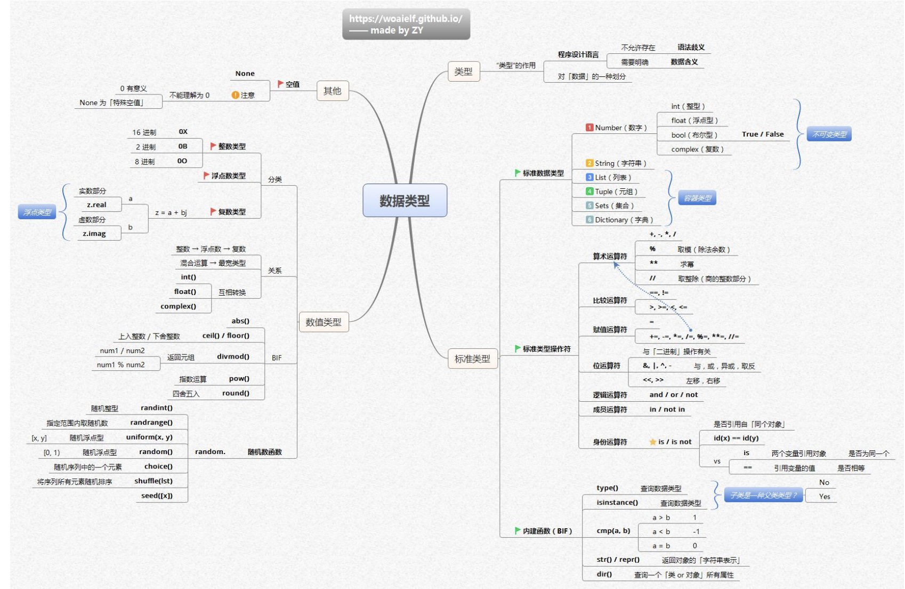

# python数据类型

## 类型定义
程序设计语言角度
程序设计语言中，类型不允许存在语法歧义，需要明确数据含义，即通过类型来清晰界定数据所表达的意义，避免在程序执行过程中出现理解和处理上的混乱。
“类型” 的作用
类型是对数据的一种划分，通过这种划分，能够对数据进行归类和区分，便于在编程中根据不同类型数据的特点进行针对性的操作、存储和处理等 。

## 标准类型
Python的标准类型涵盖标准数据类型、标准类型操作符和内建函数（BIF）：
### 标准数据类型
- **不可变类型**
    - **Number（数字）**：包含int（整型）、float（浮点型）、bool（布尔，取值True/False ）、complex（复数）。
    - **String（字符串）**：用于存储文本信息。
    - **Tuple（元组）**：元素不可变的有序序列。
- **可变类型**
    - **List（列表）**：元素可变的有序序列。
    - **Set（集合）**：无序且元素唯一的集合。
    - **Dictionary（字典）**：以键值对形式存储数据的可变容器。

### 标准类型操作符
- **算术运算符**：+（加）、-（减）、*（乘）、/（除）、%（取模，除法余数）、**（幂）、//（取整除，商的整数部分 ）。
- **比较运算符**：==（等于）、!=（不等于）、>（大于）、<（小于）、>=（大于等于）、<=（小于等于）。
- **赋值运算符**：=、+=、-=、*=、/=、%=、**=、//= 。
- **位运算符**：与二进制操作有关，包括&（与）、|（或）、^（异或）、~（取反）、<<（左移）、>>（右移） 。
- **逻辑运算符**：and（与）、or（或）、not（非） 。
- **成员运算符**：in（判断元素是否在序列等中 ）、not in 。
- **身份运算符**：is（判断两个变量是否指向同一个对象 ）、is not 。

### 内建函数（BIF）
- **类型查询**：type()用于查询数据类型，isinstance()用于判断是否为某一类型及子类。
- **比较函数**：cmp(a, b) ，a < b 时返回 -1 ，a > b 时返回 1 ，a = b 时返回 0 （Python 2中有，Python 3已移除 ）。
- **转换函数**：str() / repr() 用于将对象转换为字符串表示。
- **查询函数**：dir() 用于查询一个类或对象的所有属性。 

## 数值类型
这张思维导图围绕Python的数值类型，特别是浮点型展开，内容如下：

### 数值类型分类
- **整数类型**：可表示为16进制（以 `0x` 开头 ）、2进制（以 `0b` 开头 ）、8进制（以 `0o` 开头 ） 。
- **浮点类型**：
    - **实数部分**：可通过 `z.real` 获取。
    - **虚数部分**：可通过 `z.imag` 获取。
    - **复数类型**：如 `z = a + b` 形式 。

### 数值类型关系
- 类型转换顺序为整数 → 浮点数 → 复数。混合运算时，结果类型为最宽类型。
- 可通过 `int()` 、`float()` 、`complex()` 函数进行互相转换。

### 数值类型操作相关（BIF - 内置函数 ）
- **取整相关**：使用 `ceil()` 进行上入整数（向上取整 ），`floor()` 进行下舍整数（向下取整 ）。
- **运算结果组合**：`divmod()` 函数用于获取商和余数（返回商和余数组成的元组 ）。
- **求绝对值**：`abs()` 函数用于获取数值的绝对值。
- **指数运算**：`pow()` 函数用于进行指数运算。
- **四舍五入**：`round()` 函数用于对数值进行四舍五入操作。

### 随机数函数（random模块 ）
- **指定范围内随机整数**：`randint(x, y)` 获取 [x, y] 范围内随机整数；`randrange(x, y)` 获取 [x, y) 范围内随机整数 。
- **随机浮点数**：`uniform(x, y)` 获取 [x, y] 范围内随机浮点型；`random()` 获取 [0, 1) 范围内随机浮点型 。
- **随机序列操作**：`choice(seq)` 从序列 `seq` 中随机选取一个元素；`shuffle(seq)` 用于将序列 `seq` 元素随机排序；`seed([x])` 用于初始化随机数生成器的种子 。 

## 其他
在Python中，`None` 是一个特殊的数值类型（更准确说是一种数据类型 ），代表空值，具有以下特点：
### 定义与性质
- **唯一值**：`None` 是 `NoneType` 类型的唯一值 ，即不存在其他等同于 `None` 的对象，所有表示空值的地方都用 `None` 。
- **不可变**：`None` 是不可变的，不能对其进行修改操作。

### 应用场景
- **函数返回值**：当函数不需要返回有意义的值时，常返回 `None` 。例如，某些函数主要用于执行一系列操作（如打印信息、修改全局变量等 ），但没有明确的计算结果需要返回，就会返回 `None` 。像 `print()` 函数，它主要功能是在控制台输出内容，其返回值就是 `None` 。
- **变量初始化**：在定义变量但还未确定具体赋值时，可将其初始化为 `None` 。比如 `result = None` ，后续根据具体逻辑再给 `result` 赋予合适的值。
- **条件判断**：可在条件判断中使用，检查某个变量是否被赋予了有效的值。例如：
```python
value = None
if value is None:
    print("变量尚未被赋予有效数值")
```
### 与其他类型的区别
- **和空字符串、空列表等的区别**：空字符串 `""` 、空列表 `[]` 等虽然也表示 “没有内容”，但它们属于各自特定的数据类型（字符串类型、列表类型 ），而 `None` 属于 `NoneType` ，本质不同。在进行条件判断时，它们的表现也不同，例如：
```python
if "":  # 空字符串在条件判断中为False
    print("空字符串条件为真")
else:
    print("空字符串条件为假")

if []:  # 空列表在条件判断中为False
    print("空列表条件为真")
else:
    print("空列表条件为假")

if None:  # None在条件判断中为False
    print("None条件为真")
else:
    print("None条件为假")
```
- **和数值0的区别**：数值0是 `int` 类型，有明确的数值意义，参与数值运算等操作；而 `None` 不参与数值运算，主要用于表示空值或无结果的状态。 

