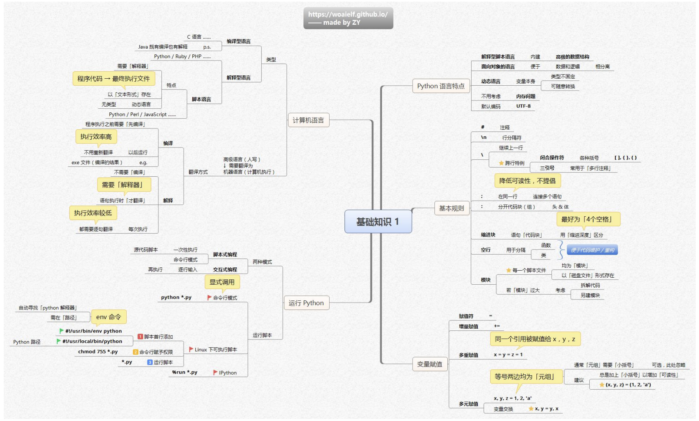

以下是基于思维导图的“Python 基础知识”博客大纲：

### 一、引言
- 介绍 Python 编程语言在当下软件开发、数据科学等领域的重要地位和广泛应用
- 引出本文将系统讲解 Python 基础知识，帮助读者入门或巩固基础 

！[python基础知识二](./mindmap/基础知识2.png)
### 计算机语言
计算机语言从类型上可分为编译型语言和解释型语言。编译型语言如 C 语言，程序执行之前需要先编译，执行效率高，编译后生成 exe 文件等，以后运行时不用重新翻译 。而解释型语言像 Python、Ruby、PHP 等，不需要编译，需要解释器，在语句执行时才翻译，执行效率较低，每次执行都需逐句翻译。
脚本语言属于解释型语言的一种，以文本形式存在，是无类型的动态语言，例如 Python、Per、JavaScript 等。此外，像 Java 较为特殊，既有编译过程也有解释过程。高级语言由人编写，需翻译为机器语言才能被计算机执行。

### 怎么运行python
脚本式编程
将 Python 代码编写在以 .py 为后缀的文件中 。在命令行模式下，若已配置好 Python 解释器路径，进入代码文件所在目录，输入 python *.py（* 为实际文件名）即可运行 。例如在 Windows 系统，按下 Win + R 输入 cmd 打开命令行窗口，用 cd 命令切换到文件目录，再执行上述命令；Linux 或 macOS 系统，打开终端，通过 cd 命令切换目录后执行。还可使用 env 命令，如在脚本首行添加 #!/usr/bin/env python 或 #!/usr/local/bin/python 来指定 Python 解释器（需赋予脚本执行权限，如 Linux 下执行 chmod 755 *.py ） 。在 IPython 环境中，可用 %run *.py 运行脚本。
交互式编程
命令行模式：打开命令行工具（Windows 的 CMD、Mac 或 Linux 的终端 ），输入 python （若系统同时安装 Python 2.x 和 Python 3.x，可能需输入 python3 启动 Python 3.x 环境 ），进入 Python 交互式环境（出现 >>> 提示符 ），在此可逐行输入 Python 代码并回车执行。
交互式编程工具：如 IDLE（Python 自带的交互式开发环境 ），打开 IDLE 后，可直接在交互窗口输入代码运行；也可通过点击 File - new file 创建脚本文件，编写代码后点击 run 菜单或按快捷键 F5 运行 。 此外还有 Jupyter Notebook 等工具，适合数据科学和机器学习项目的交互式编程与可视化 ，在单元格中编写代码后，点击单元格左侧运行按钮或用快捷键 Shift + Enter 运行。


### 二、Python 语言特性
Python 具有以下语言特性：
语言类型：属于解释型脚本语言，无需提前编译，由解释器逐行解释执行代码。
编程范式：是面向对象的语言，便于将数据和逻辑相分离，利于程序的模块化、可维护性和可扩展性。
类型系统：为动态语言，变量本身类型不固定，可随意转换，在使用时无需提前声明变量类型，根据赋值自动确定类型。
内存管理：开发者通常不用考虑内存问题，Python 内部自动管理内存的分配和释放。
字符编码：默认编码为 UTF - 8，能很好地支持多语言文本处理。

### 三、Python 基本规则
Python 的基本规则如下：
注释
单行注释：使用 # ，# 后的内容为注释，解释器会忽略，用于对一行或一行中部分内容说明。
多行注释：常用三引号（三个单引号 ''' 或三个双引号 """ ），用于对多行内容进行注释，也常用于多行字符串定义，不过不推荐用三引号做跨行特例（会降低可读性）。
行相关
行分隔符：\n 为行分隔符，在 Python 中，一般换行就表示本行代码结束 。
跨行书写：若要将一条语句分多行编写，可在未结束行末尾加 \ 来继续上一行内容；也可利用闭合操作符（如各种括号 [] () {} ）实现跨行书写。
语句连接：理论上可使用 : 在同一行连接多个语句，但不推荐，会降低可读性；: 更多用于分开代码块（如 if、for、def 等语句头与体之间 ）。
缩进
用缩进区分代码块，代码块内语句缩进深度需一致。一般推荐缩进为 4 个空格，不使用制表符 。比如 if 语句、for 循环、函数定义、类定义等，符合条件或执行逻辑的语句都通过缩进包含在相应代码块内。
空行
用于分隔函数、类等不同逻辑代码块，使代码结构更清晰，便于代码维护和重构 。
模块
每个脚本文件本质上都是一个模块，以磁盘文件形式存在 。
若模块代码量过大，可考虑拆解代码，分拆为多个模块，便于管理和维护。

```python
# 这是一个单行注释，用于解释下面的变量定义
message = "Hello, Python!"

'''
这是一个多行注释，
通常用于函数、类或模块的文档说明
'''

"""
也可以使用双引号的多行注释
下面是一个简单的函数定义
"""
def calculate_sum(a, b):
    # 函数内部的注释，解释函数逻辑
    return a + b  # 返回两个数的和

# 长语句示例：使用反斜杠(\)进行换行
long_list = [1, 2, 3, 
             4, 5, 6]

# 条件语句示例：使用冒号和缩进定义代码块
if len(long_list) > 5:
    print("列表元素超过5个")
    print("这两行属于同一个代码块")
else:
    print("列表元素不超过5个")

# 函数定义示例：使用缩进来定义函数体
def print_info():
    # 函数体内部的代码
    print("这是一个无参数函数")
    print("函数体由多行代码组成")

# 类定义示例：类名通常采用大驼峰命名法
class MyClass:
    def __init__(self, name):
        self.name = name  # 类的属性
    
    def greet(self):
        # 类的方法
        print(f"Hello, {self.name}!")

# 空行用于分隔不同的代码逻辑块
# 这有助于提高代码的可读性和可维护性

# 示例：在同一行中使用分号分隔多个语句（不推荐做法）
x = 5; y = 10; print(x + y)  # 虽然合法，但不推荐

# 推荐的写法：每个语句单独一行
a = 3
b = 4
print(a * b)

# 使用括号实现长表达式的跨行书写
result = (10 + 20 
          - 5 * 3)
print(result)

# 导入模块示例
import math
print(math.sqrt(16))  # 计算平方根

# 多行字符串示例（也可用作注释）
multiline_str = """
这是一个多行字符串
可以包含多行文本内容
"""
print(multiline_str)    
```

### 四、Python 变量赋值
Python中变量赋值有以下几种形式：
#### 普通赋值
使用 `=` 作为赋值符，将等号右侧的值赋给左侧变量，如 `a = 5` ，把数值 `5` 赋给变量 `a` 。

#### 增量赋值
通过运算符与 `=` 结合实现，如 `x += 1` ，等同于 `x = x + 1` 。类似的还有 `-=` 、`*=` 、`/=` 等，用于在原有变量值基础上进行运算并重新赋值。 

#### 多重赋值
 - 可以将同一个引用赋给多个变量，例如 `x = y = z = 1` ，此时 `x` 、`y` 、`z` 都指向值为 `1` 的对象。
 - 也能对多个变量同时赋不同的值，如 `x, y, z = 1, 2, 'a'` ，要求等号两边变量和值的数量、顺序对应。

#### 多元赋值
 - 常用于序列解包，如 `x, y = [1, 2]` 或 `x, y = (1, 2)` ，将列表或元组中的值依次赋给变量 `x` 和 `y` 。推荐等号两边都用小括号包裹元组，如 `(x, y) = (1, 2)` 。
 - 还可用于变量交换，利用多元赋值特性，通过 `x, y = y, x` 就能交换变量 `x` 和 `y` 的值，无需借助临时变量。 

```python
# 普通赋值: 将值赋给变量
a = 10
b = "Hello"
c = [1, 2, 3]

print(f"普通赋值: a = {a}, b = {b}, c = {c}")

# 增量赋值: 在原有值基础上进行运算并重新赋值
a += 5      # 等同于 a = a + 5
b *= 2      # 等同于 b = b * 2
c.append(4) # 列表的增量操作

print(f"增量赋值: a = {a}, b = {b}, c = {c}")

# 多重赋值: 将同一个引用赋给多个变量
x = y = z = 100

print(f"多重赋值: x = {x}, y = {y}, z = {z}")

# 修改变量 x，观察其他变量是否变化
x += 50
print(f"修改 x 后: x = {x}, y = {y}, z = {z}")  # y 和 z 不受影响

# 多元赋值: 同时为多个变量赋不同的值
x, y, z = 1, 2, "three"  # 变量和值的数量、顺序需对应

print(f"多元赋值: x = {x}, y = {y}, z = {z}")

# 变量交换: 使用多元赋值交换两个变量的值
x, y = y, x
print(f"交换后: x = {x}, y = {y}")

# 序列解包: 将序列中的元素依次赋给多个变量
numbers = (10, 20, 30)
a, b, c = numbers  # 等同于 a, b, c = (10, 20, 30)

print(f"序列解包: a = {a}, b = {b}, c = {c}")

# 扩展解包: 使用 * 收集多余的值
first, *middle, last = [1, 2, 3, 4, 5]
print(f"扩展解包: first = {first}, middle = {middle}, last = {last}")

# 嵌套解包: 处理嵌套结构
person = ("Alice", 30, ["Python", "Java"])
name, age, (lang1, lang2) = person
print(f"嵌套解包: name = {name}, age = {age}, languages = {lang1}, {lang2}")    
```


### 五、Python 对象相关
在Python中，一切皆对象，Python对象有以下相关内容：
#### 创建与赋值
创建对象时即进行赋值操作，例如 `a = 5` ，在创建值为 `5` 的对象同时，将其赋值给变量 `a` 。 

#### 特性
- **身份**：每个对象都有唯一的身份标识（`id` ），可通过 `id()` 函数获取。若两个变量的 `id` 相同，说明它们指向同一个对象 。例如 `a = 5; b = a` ，此时 `id(a) == id(b)` 。
- **类型**：对象的类型决定了它能执行的操作和属性，使用 `type()` 函数可查看对象类型。如 `type(5)` 返回 `<class 'int'>` ，`type("hello")` 返回 `<class'str'>`  。
- **值**：即对象所存储的数据内容，像整数对象 `5` 、字符串对象 `"hello"` 等 。

#### 可变性
- **不可变对象**：对象的值在创建后不能被修改，如数字（`int`、`float` 等 ）、字符串（`str` ）、元组（`tuple` ）。当对不可变对象调用方法时，若涉及值的改变，不会修改原对象，而是创建新对象并返回 。例如 `s = "hello"; s = s.upper()` ，原字符串对象 `"hello"` 未改变，而是创建了新字符串 `"HELLO"` 并重新赋值给 `s` 。编写程序时，尽量将对象设计成不可变对象，有助于保证数据的一致性和安全性 。
- **可变对象**：与不可变对象相反，其值可以被修改，如列表（`list` ）、集合（`set` ）、字典（`dict` ） 。像列表的 `append` 方法会直接在原列表上添加元素，改变原对象。

#### 对象属性
- **访问**：使用点号（`.` ）来访问对象的属性，如对象的属性和方法 。例如 `lst = [1, 2, 3]; lst.append(4)` ，`append` 就是列表对象 `lst` 的方法，通过点号调用 。
- **常用属性**：包括对象的属性和方法，不同类型对象有各自独特的属性和方法，如字符串有 `split` 、`strip` 等方法，字典有 `keys` 、`values` 等方法 。 

```python
# 1. 对象创建与赋值
a = 5  # 创建整数对象并赋值给a
b = "hello"  # 创建字符串对象并赋值给b

# 2. 对象身份（ID）与类型
print(f"a的ID: {id(a)}, 类型: {type(a)}")  # 输出: a的ID: ..., 类型: <class 'int'>
print(f"b的ID: {id(b)}, 类型: {type(b)}")  # 输出: b的ID: ..., 类型: <class 'str'>

# 3. 不可变对象示例
x = 10
y = x  # y和x指向同一个对象
print(f"x的ID: {id(x)}, y的ID: {id(y)}")  # ID相同

x += 5  # 对x重新赋值，创建新对象
print(f"操作后x的ID: {id(x)}, y的ID: {id(y)}")  # ID不同
print(f"x = {x}, y = {y}")  # 输出: x = 15, y = 10

# 4. 可变对象示例
lst1 = [1, 2, 3]
lst2 = lst1  # lst2和lst1指向同一个列表对象

print(f"lst1的ID: {id(lst1)}, lst2的ID: {id(lst2)}")  # ID相同
lst1.append(4)  # 修改原列表对象
print(f"操作后lst1: {lst1}, lst2: {lst2}")  # 两者都改变
print(f"lst1的ID: {id(lst1)}, lst2的ID: {id(lst2)}")  # ID仍相同

# 5. 对象属性与方法
# 访问字符串对象的方法
s = "hello"
print(s.upper())  # 输出: HELLO（创建新字符串对象）
print(f"s的ID: {id(s)}, 调用upper后的ID: {id(s.upper())}")  # ID不同

# 访问列表对象的方法
lst = [1, 2, 3]
lst.reverse()  # 原地修改列表
print(lst)  # 输出: [3, 2, 1]

# 6. 自定义对象示例
class MyClass:
    def __init__(self, value):
        self.value = value  # 实例属性
    
    def get_value(self):  # 实例方法
        return self.value

obj = MyClass(42)
print(f"对象属性: {obj.value}")  # 访问属性
print(f"调用方法: {obj.get_value()}")  # 调用方法    
```

### 六、Python 动态类型
Python的动态类型具有以下特点：

#### 引用和对象分离
- **核心概念**：在Python中，变量是对对象的引用，引用和对象本身是分离的。对象用于存储数据，存储在内存中，无法直接接触，通过对象名（即引用）来操作对象。
- **引用指向变化**：引用可以随时指向一个新的对象。当多个引用指向同一个对象时，如果其中一个引用的值发生变化（重新指向新对象），实际上是这个引用指向了新的对象，不会影响其他引用的指向。

#### 对象类型
- **可变数据对象**
    - **本质**：本质上是包含了多个引用的对象，每个引用指向一个对象。例如列表（`list`）、集合（`set`）、字典（`dict`）。
    - **操作影响**：当通过引用对其元素进行操作时，会改变对象自身。比如 `L1 = [1, 2, 3]; L1[0] = 10` ，不是改变 `L1` 这个引用，而是对 `L1` 所指向列表对象的第一个元素进行操作，所有指向它的引用都会受到影响。
 - **不可变数据对象**
    - **特性**：不能改变对象本身，只能改变引用的指向。像字符串（`str`）、数字（`num`，如 `int`、`float` 等 ）、元组（`tuple`）都属于不可变数据对象。
    - **示例**：对于不可变对象，重新赋值操作会创建新对象。例如 `s = "hello"; s = "world"` ，原字符串 `"hello"` 未改变，而是 `s` 这个引用指向了新的字符串对象 `"world"` 。
```python
# 1. 引用和对象分离
x = 10  # x 引用一个整数对象
print(f"x 的 ID: {id(x)}, 值: {x}")  # 输出: x 的 ID: ..., 值: 10

x = "hello"  # x 现在引用一个字符串对象
print(f"重新赋值后 x 的 ID: {id(x)}, 值: {x}")  # 输出: x 的 ID: ..., 值: hello

# 2. 多个引用指向同一对象
a = [1, 2, 3]
b = a  # a 和 b 指向同一个列表对象

print(f"a 的 ID: {id(a)}, b 的 ID: {id(b)}")  # ID 相同
a.append(4)  # 修改原列表对象
print(f"a: {a}, b: {b}")  # 输出: a: [1, 2, 3, 4], b: [1, 2, 3, 4]

# 3. 不可变对象的重新赋值
c = 5
d = c  # c 和 d 指向同一个整数对象

print(f"c 的 ID: {id(c)}, d 的 ID: {id(d)}")  # ID 相同
c += 3  # 对 c 重新赋值，创建新对象
print(f"操作后 c 的 ID: {id(c)}, d 的 ID: {id(d)}")  # ID 不同
print(f"c = {c}, d = {d}")  # 输出: c = 8, d = 5

# 4. 可变对象的修改
e = [10, 20]
f = e  # e 和 f 指向同一个列表对象

print(f"e 的 ID: {id(e)}, f 的 ID: {id(f)}")  # ID 相同
e[0] = 100  # 修改列表元素
print(f"操作后 e: {e}, f: {f}")  # 输出: e: [100, 20], f: [100, 20]

# 5. 函数参数传递 - 不可变对象
def change_num(num):
    print(f"函数内初始 num 的 ID: {id(num)}")
    num += 10  # 创建新对象
    print(f"函数内修改后 num 的 ID: {id(num)}")
    return num

g = 20
print(f"调用函数前 g 的 ID: {id(g)}")
result = change_num(g)
print(f"调用函数后 g: {g}, 结果: {result}")  # g 不变，输出: g: 20, 结果: 30

# 6. 函数参数传递 - 可变对象
def change_list(lst):
    print(f"函数内初始 lst 的 ID: {id(lst)}")
    lst.append(100)  # 修改原列表
    print(f"函数内修改后 lst 的 ID: {id(lst)}")
    return lst

h = [1, 2]
print(f"调用函数前 h 的 ID: {id(h)}")
result = change_list(h)
print(f"调用函数后 h: {h}, 结果: {result}")  # h 被修改，输出: h: [1, 2, 100], 结果: [1, 2, 100]

# 7. 避免意外修改可变对象参数
def safe_change_list(lst):
    new_lst = lst.copy()  # 创建副本
    new_lst.append(100)
    return new_lst

i = [5, 6]
result = safe_change_list(i)
print(f"调用安全函数后 i: {i}, 结果: {result}")  # i 不变，输出: i: [5, 6], 结果: [5, 6, 100]    
```


#### 函数的参数传递
 - **不可变数据对象作为参数**：传递的是对象的引用，函数内对参数进行重新赋值等操作，不会影响原对象，因为相当于创建了新的引用。
 - **可变数据对象作为参数**：传递的同样是引用，函数内对可变对象进行修改操作（如列表的 `append` 方法），可能会改变原对象。因此在编程时，尽量避免将可变数据对象直接用作参数，防止意外修改原对象。 

### 标识符
在Python中，标识符是用于给变量、函数、类、模块等命名的有效字符串。相关内容如下：
### 合法标识符规则
 - **首字符**：必须是字母（大写或小写）或下划线（`_` ） 。
 - **其余字符**：可以是字母、数字或下划线（`_` ） 。并且Python对标识符的大小写敏感，即 `Name` 和 `name` 是两个不同的标识符。

### 特殊标识符
- **关键字**
    - **定义**：是Python语言中被赋予特殊含义、具有特定功能的保留字，不允许被用作普通标识符（如变量名、函数名等 ）。
    - **查看方式**：可通过 `import keyword` 导入 `keyword` 模块，使用 `keyword.kwlist` 查看所有关键字，用 `keyword.iskeyword()` 函数判断某个字符串是否为关键字。
    - **示例**：像 `if`、`for`、`while`、`def`、`class` 等都是常见关键字。
 - **内建**
    - **性质**：属于非保留字，但不推荐用作普通标识符。它们是 `__builtins__` 模块的成员，在程序开始时由解释器自动导入，可看作全局变量 。
    - **示例**：比如 `print`、`len`、`sum` 等，是Python内置的函数名。如果在代码中重新定义这些名称，会覆盖其原本的内建功能，导致程序出现难以排查的错误。
 - **专用下划线标识符**
    - **单下划线开头（`_xxx` ）**：约定俗成表示该变量或函数为 “protected”（受保护的 ），在类中使用时，从类的外部不建议直接访问，但实际上仍可访问 。
    - **双下划线开头（`__xxx` ）**：在类中使用时，表示类的私有属性或方法，不能直接访问，需通过类提供的接口进行访问。其原理是Python会对这种命名进行名称重整，将 `__xxx` 转换为 `_类名__xxx` 形式。
    - **双下划线开头和结尾（`__xxx__` ）**：属于特殊变量或特殊方法，是Python系统定义名字，有特定用途。例如 `__init__` 是类的构造函数，`__len__` 用于定义对象的长度计算逻辑等。
    - **单下划线结尾（`xxx_` ）**：主要用于避免与Python关键字冲突，当需要使用关键字作为标识符时，在后面加下划线，如 `class_`  。

```python
import keyword

# 1. 合法标识符示例
valid_variable = 42  # 字母开头
_valid_name = "hello"  # 下划线开头
Name2 = [1, 2, 3]  # 大小写敏感，可包含数字

# 2. 非法标识符示例（取消注释会导致语法错误）
# 123variable = 10  # 错误：不能以数字开头
# my-variable = 20  # 错误：不能包含连字符
# if = 30  # 错误：不能使用关键字

# 3. 检查关键字
print("所有 Python 关键字:", keyword.kwlist)
print("'if' 是否为关键字:", keyword.iskeyword("if"))  # 输出: True
print("'my_var' 是否为关键字:", keyword.iskeyword("my_var"))  # 输出: False

# 4. 内建函数覆盖（不推荐做法）
def sum(numbers):  # 覆盖内建的 sum 函数
    total = 0
    for num in numbers:
        total += num
    return total

result = sum([1, 2, 3])  # 使用自定义的 sum 函数
print("自定义 sum 结果:", result)  # 输出: 6

# 恢复内建的 sum 函数
del sum  # 删除自定义的 sum 函数
result = sum([1, 2, 3])  # 使用内建的 sum 函数
print("内建 sum 结果:", result)  # 输出: 6

# 5. 专用下划线标识符
class MyClass:
    def __init__(self):
        self.public_attr = 10  # 公共属性
        self._protected_attr = 20  # 受保护的属性
        self.__private_attr = 30  # 私有属性

    def public_method(self):
        return "这是公共方法"

    def _protected_method(self):
        return "这是受保护的方法"

    def __private_method(self):
        return "这是私有方法"

obj = MyClass()
print("公共属性:", obj.public_attr)  # 可以直接访问
print("受保护的属性:", obj._protected_attr)  # 可以访问，但不建议
# print("私有属性:", obj.__private_attr)  # 报错：无法直接访问
print("私有属性重整后名称:", obj._MyClass__private_attr)  # 可以通过重整后的名称访问

# 6. 特殊方法
my_list = [1, 2, 3]
print("列表长度:", len(my_list))  # 调用 my_list.__len__()
print("列表字符串表示:", str(my_list))  # 调用 my_list.__str__()

# 7. 避免关键字冲突
class_ = "Python Programming"  # 使用下划线避免与 class 关键字冲突
print("class_ 变量:", class_)    
``` 

### 七、模块与包
这张思维导图围绕“模块结构 & 布局”，介绍了Python模块相关知识：
#### 可直接执行脚本
在类Unix系统下，存在可直接执行的脚本，起始行无需调用解释器 ，方便脚本快速运行。

#### 模块文档
 - 用于对模块功能和重要全局变量做简要介绍，可通过 `module.__doc__` 访问，方便开发者了解模块用途和关键信息。

#### 模块导入
强调除非必须，尽量使用局部变量。导入模块时，只导入主程序需要的部分，有助于减少命名空间冲突，提高代码的可读性与维护性 。

#### 变量定义
在模块中，可定义全局变量，能在本模块中直接使用。但全局变量过多可能导致代码逻辑混乱，所以要谨慎使用。

#### 类定义
 - 类有文档变量 `class.__doc__` ，可用于记录类的功能、参数等说明信息，通过特定方式访问，方便查阅类的相关文档。

#### 函数定义
 - 函数同样有文档变量 `function.__doc__` ，用来描述函数的功能、参数、返回值等。调用函数可通过 `module.function()` 形式，明确函数所属模块及调用方式。

#### Python库风格
 - **主程序模块**：在Python库中，仅一个模块作为主程序模块，可被直接执行。它导入所有需要的模块，完成程序的主要功能逻辑。
 - **其他模块**：大多数模块是被调用的，为实现特定功能而创建，不直接执行，而是为其他模块或主程序提供功能支持。

#### 主程序注意事项
 - **顶级代码封装**：尽量将功能代码封装到函数或类中，减少顶级代码的数量。如果一个模块有大量顶级代码，通常它就是主程序模块 。
 - **`__name__` 与模块执行**：模块名字为 `__main__` 时，`__name__` 的值表明该模块被直接执行；若模块被导入，`__name__` 则不是 `__main__` ，通过这种机制可区分模块是被直接运行还是被导入使用 。 

### 八、IO 编程
这张思维导图围绕Python的IO编程，主要内容如下：
#### 输出相关
- **输出一个空格**：可使用相关方式输出单个空格，实现文本间隔等效果 。
- **格式化输出**：
    - 例如使用 `print(x, 'y')` 或 `print()` 函数进行打印输出。`print()` 函数可以将内容打印到屏幕等输出设备，可通过调整参数实现不同格式输出 。
    - 若想输出制表符（[ ] 表示制表符占位 ），也可借助 `print()` 函数设置相关格式来达成。
    - Python表达式可在输出语句中使用，并且 `print()` 函数可以接收表达式结果进行输出展示。
#### 输入相关
使用 `input()` 函数读取键盘输入，可用于获取用户在控制台输入的信息，实现程序与用户的交互 。 

### 九、内存管理


#### 变量创建与赋值
- 创建了一个值为`'ABC'`的字符串，在内存中存储，同时创建了名为`a`的变量，`a`指向内存中存储`'ABC'`的位置，即`a = 'ABC'` 。
- 将`a`赋值给`b`，创建名为`b`的变量，`b`也指向`'ABC'`在内存中的位置，即`b = a` 。此时`a`和`b`指向同一对象。
- 重新给`a`赋值为`'XYZ'`，即`a = 'XYZ'` ，`a`的指向变为`'XYZ'`在内存中的位置，而`b`的指向不变，仍指向`'ABC'` 。通过`print(b)` 输出`b`的值为`'ABC'` 。

#### 变量本质
- 变量在计算机内部都有一个引用，指向实际的数据对象。当数据对象不再被引用（如没有变量指向它 ），会被垃圾回收机制回收（类似与[数据对象] 失联 ）。
- 变量本质上是对对象的引用，并非数据对象本身 。在Python中，一切皆对象，变量用于指向这些对象。

#### 内存管理
- **常量**：在Python中没有真正意义上的常量，但习惯上全部大写的变量名（如`MAX_VALUE` ）表示常量，在编程中约定不改变其值。
- **删除对象引用**：使用`del`语句可以删除对象的一个引用，当对象的所有引用都被删除后，该对象可能会被垃圾回收机制回收，释放其所占用的内存。 

