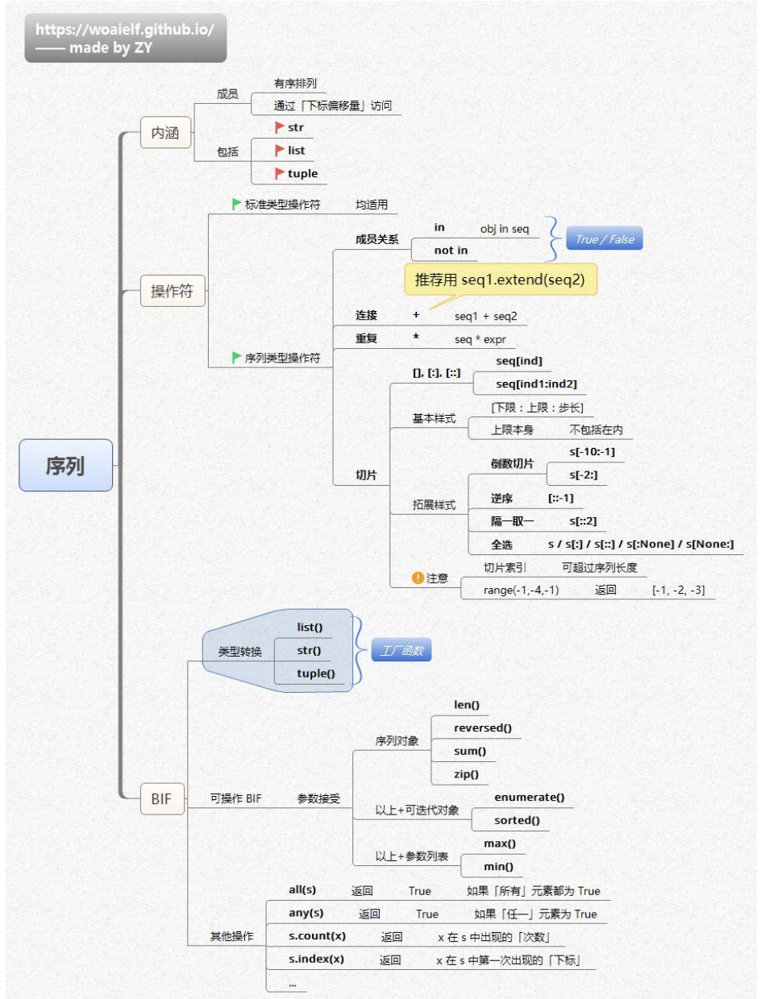

这张思维导图围绕Python中的“序列”展开，内容如下：

### 定义与性质
- **定义**：序列是一种有序的、可迭代的、可索引的元素集合，包括str（字符串）、list（列表）、tuple（元组） 。
- **性质**：
    - **有序**：序列中的元素按照一定的顺序排列，每个元素都有一个唯一的位置索引，从0开始 。
    - **可迭代**：序列可以通过for循环进行遍历，每次迭代返回一个元素 。
    - **可索引**：序列中的每个元素都可以通过下标偏移量访问，下标从0开始 。

### 内涵
- **成员**：序列是有序排列，可通过下标偏移量访问成员。包括str（字符串）、list（列表）、tuple（元组） 。

### 操作符
- **标准类型操作符**：适用于所有序列类型，包括成员关系操作符in（判断对象是否在序列中 ）、not in（判断对象是否不在序列中 ） ，结果返回True或False 。
- **序列类型操作符**
    - **连接**：使用`+` 连接两个序列，推荐使用`seq1.extend(seq2)` 方式，效率更高 。
    - **重复**：使用`*` 重复序列，如`seq * expr` 。
    - **切片**
        - **基本格式**：`seq[ind1:ind2]` ，格式为`[下限:上限:步长]` ，上限本身不包括在内。
        - **拓展样式**：包括负数切片（如`s[-2:-1]` ）、逆序（如`s[::-1]` ）、隔一项（如`s[::2]` ）、全选（如`s[:]` 、`s[::]` 、`s[None:]` 、`s[:None]` ） 。切片索引可超过序列长度，`range(1,-4,-1)` 返回`[1, -2, -3]`  。
    ```python
    # 1. 成员关系操作符 (in, not in)
    fruits = ['apple', 'banana', 'cherry']
    print("'apple' in fruits:", 'apple' in fruits)  # 输出: True
    print("'mango' not in fruits:", 'mango' not in fruits)  # 输出: True

    # 2. 连接操作符 (+) 与 extend() 方法
    list1 = [1, 2, 3]
    list2 = [4, 5, 6]

    # 使用 + 连接
    concatenated = list1 + list2
    print("使用 + 连接:", concatenated)  # 输出: [1, 2, 3, 4, 5, 6]

    # 使用 extend() 方法
    list1.extend(list2)
    print("使用 extend():", list1)  # 输出: [1, 2, 3, 4, 5, 6]

    # 3. 重复操作符 (*)
    numbers = [1, 2]
    repeated = numbers * 3
    print("重复3次:", repeated)  # 输出: [1, 2, 1, 2, 1, 2]

    # 4. 切片操作符 ([start:stop:step])
    s = "HelloWorld"

    # 基本切片
    print("s[1:4]:", s[1:4])  # 输出: ell (索引1到3)

    # 负数切片
    print("s[-2:-1]:", s[-2:-1])  # 输出: l (倒数第二个字符)

    # 逆序
    print("s[::-1]:", s[::-1])  # 输出: dlroWolleH

    # 隔一项取一个
    print("s[::2]:", s[::2])  # 输出: Hlool

    # 全选
    print("s[:]:", s[:])  # 输出: HelloWorld
    print("s[::]:", s[::])  # 输出: HelloWorld
    print("s[None:]:", s[None:])  # 输出: HelloWorld
    print("s[:None]:", s[:None])  # 输出: HelloWorld

    # 切片索引超过序列长度
    r = list(range(10))
    print("r[2:100]:", r[2:100])  # 输出: [2, 3, 4, 5, 6, 7, 8, 9]

    # 步长为负数的range
    print("list(range(1, -4, -1)):", list(range(1, -4, -1)))  # 输出: [1, 0, -1, -2, -3]    
    ```

### 内建函数（BIF）
- **类型转换**：提供list()、str()、tuple() 函数，用于不同序列类型之间的转换 。
- **可操作BIF**
    - **参数接受以上+可迭代对象**：包括len()（获取序列长度 ）、reversed()（反向迭代序列 ）、sum()（计算序列元素总和 ）、zip()（聚合多个序列 ）、enumerate()（返回索引 - 元素对 ）、sorted()（对序列进行排序 ） 。
    - **参数接受以上+参数列表**：包括max()（返回序列最大值 ）、min()（返回序列最小值 ） 。
- **其他操作**
    - all(s) ：如果序列s中所有元素都为True，返回True 。
    - any(s) ：如果序列s中任一元素为True，返回True 。
    - s.count(x) ：返回元素x在序列s中出现的次数 。
    - s.index(x) ：返回元素x在序列s中第一次出现的下标 。 
```python
# 0. 准备测试数据
s = "hello"
lst = [3, 1, 4, 1, 5, 9]
tpl = (3.14, 2.71, 1.618)
enum = enumerate(lst)  # 索引-值对的迭代器
zipped = zip([1, 2, 3], ['a', 'b', 'c'])  # 聚合多个序列

# 1. 类型转换函数
print("list(s):", list(s))  # 字符串转列表: ['h', 'e', 'l', 'l', 'o']
print("str(lst):", str(lst))  # 列表转字符串: "[3, 1, 4, 1, 5, 9]"
print("tuple(s):", tuple(s))  # 字符串转元组: ('h', 'e', 'l', 'l', 'o')

# 2. 可操作BIF (接受可迭代对象)
print("\n=== 可迭代对象操作 ===")
print("len(s):", len(s))  # 长度: 5
print("reversed(s):", list(reversed(s)))  # 反转: ['o', 'l', 'l', 'e', 'h']
print("sum(lst):", sum(lst))  # 求和: 23
print("sorted(lst):", sorted(lst))  # 排序: [1, 1, 3, 4, 5, 9]
print("list(enum):", list(enum))  # 枚举: [(0, 3), (1, 1), (2, 4), (3, 1), (4, 5), (5, 9)]
print("list(zipped):", list(zipped))  # 聚合: [(1, 'a'), (2, 'b'), (3, 'c')]

# 3. 可操作BIF (接受可迭代对象+参数列表)
print("\n=== 带参数列表的操作 ===")
print("max(lst):", max(lst))  # 最大值: 9
print("min(lst):", min(lst))  # 最小值: 1
print("max(tpl):", max(tpl))  # 元组最大值: 3.14

# 4. 其他操作
print("\n=== 其他序列操作 ===")
print("all([1, True, 'a']):", all([1, True, 'a']))  # 所有为真: True
print("all([0, 1, 2]):", all([0, 1, 2]))  # 存在假值: False
print("any([0, False, '']):", any([0, False, '']))  # 全为假值: False
print("lst.count(1):", lst.count(1))  # 元素1出现次数: 2
print("s.index('l'):", s.index('l'))  # 首次出现位置: 2

# 5. 特殊情况演示
print("\n=== 特殊情况 ===")
print("s.index('z'):", s.index('z'))  # 抛出ValueError异常
print("lst.count(0):", lst.count(0))  # 元素不存在: 0
print("sum([], []):", sum([], []))  # 初始值为列表: []
print("sorted('hello'):", sorted('hello'))  # 字符串排序: ['e', 'h', 'l', 'l', 'o']    
```