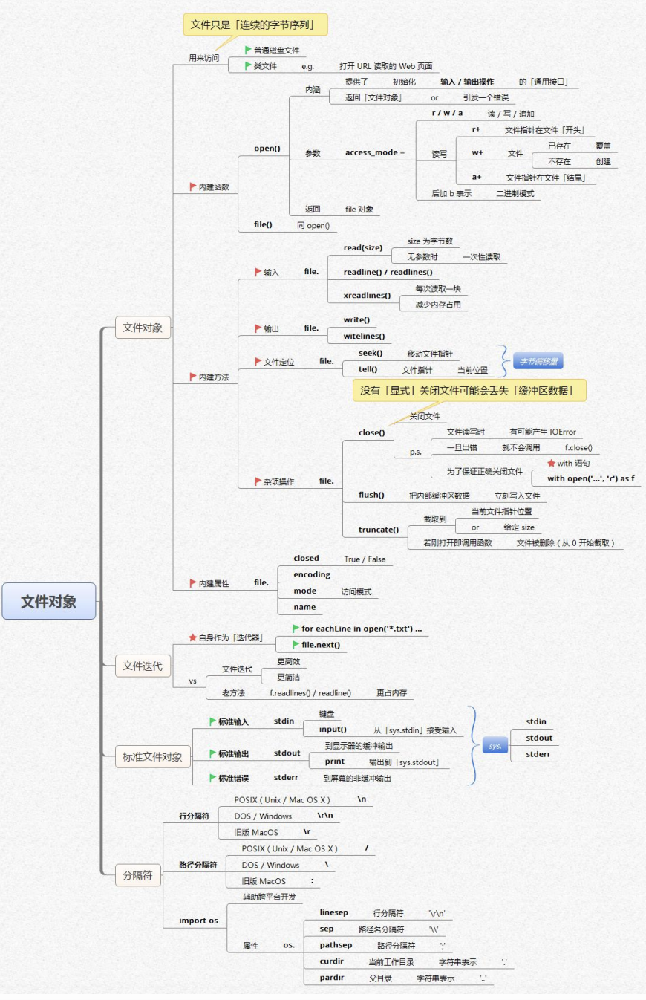

这张思维导图围绕Python的文件对象展开，主要内容如下：

### 文件本质
文件本质上是连续的字节序列。

### 文件类别
- **源文件**：如Python代码文件。
- **类文件**：例如可用于打开、读取、编辑Web页，提供了读写缓冲的通用机制 。

### 文件对象相关函数与方法
- **内置函数（open() ）**
    - **参数**：`open()` 函数接受 `access_mode`（访问模式）等参数。
    - **访问模式**
        - `r` ：只读模式，文件需存在。
        - `w` ：写入模式，若文件存在则覆盖，不存在则创建新文件。
        - `a` ：追加模式，文件不存在则创建，写入内容追加到文件末尾。
        - `r+` ：读写模式，文件需存在。
        - `w+` ：读写模式，先创建新文件（若存在则覆盖 ）。
        - `a+` ：读写追加模式，文件不存在则创建。还可使用二进制模式，如 `rb`、`wb` 等 。
    - **返回值**：`open()` 函数返回文件对象（`fp` ）。
- **文件对象方法（针对返回的文件对象 `fp` ）**
    - **读操作**
        - `fp.read()` ：读取所有内容。
        - `fp.readlines()` / `fp.readlines()` ：读取所有行，返回列表。
        - `fp.read(size)` ：最多读指定字节数。
        - `fp.readline()` ：每次读一行。
    - **写操作**
        - `fp.write()` ：写入内容。
        - `fp.writelines()` ：写入字符串序列。
    - **其他操作**
        - `fp.tell()` ：返回文件指针位置。
        - `fp.seek()` ：移动文件指针。注意没有显式关闭文件可能会丢失缓冲区数据。
        - `fp.close()` ：关闭文件，文件关闭后再操作会抛出 `ValueError` 异常。
        - `fp.closed` ：属性，判断文件是否关闭（`True` / `False` ）。
        - `fp.flush()` ：刷新缓冲区，确保数据写入文件。
        - `fp.fileno()` ：返回文件描述符。
        - `fp.truncate()` ：截断文件，可指定长度。

### 文件迭代
- **迭代方式**：可使用 `for eachline in open("txt")` 等迭代器方式遍历文件内容。
- **相关方法**：如 `fp.next()` （Python 2 中 ），Python 3 中使用迭代协议 。还有 `fp.readline()` 等。

### 标准文件对象
- **标准输入**：`stdin` ，可通过 `open()` 从 `[sys.stdin]` 处读取输入 。
- **标准输出**：`stdout` ，`print` 输出到 `[sys.stdout]` 。
- **标准错误输出**：`stderr` 。

### 不同系统相关
- **行分隔符**
    - **POSIX（Unix / Mac OS X ）**：行分隔符为 `\n` 。
    - **DOS / Windows**：行分隔符为 `\r\n` 。
    - **旧版MacOS**：行分隔符为 `\r` 。
- **路径分隔符**
    - **POSIX（Unix / Mac OS X ）**：路径分隔符为 `/` 。
    - **DOS / Windows**：路径分隔符为 `\` 。
    - **旧版MacOS**：路径分隔符为 `:` 。
- **导入 `os` 模块**：可使用 `os` 模块相关方法，如 `os.linesep` （行分隔符 ）、`os.pathsep` （路径分隔符 ）、`os.curdir` （当前工作目录 ）、`os.pardir` （父目录 ）等。 