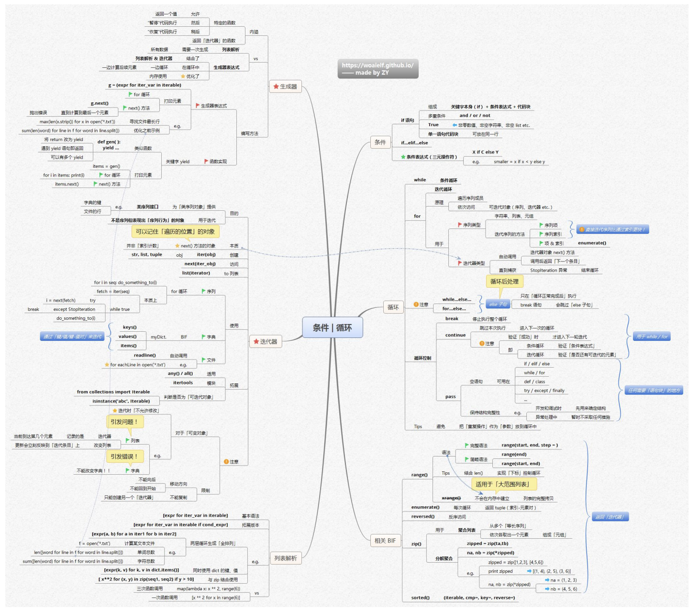

## 思维导图


## 条件

if 语句：详细讲解if语句的语法结构，包括条件表达式、缩进规则以及语句块执行逻辑。例如if condition: statement_block，并通过简单示例如判断一个数是否大于 10 来展示。
#### 1. `if` 语句

**语法结构**：

```python
if condition:
    # 语句块（缩进）
```

**规则**：

- **条件表达式**：可以是比较运算（`>`, `<`, `==` 等）或逻辑运算（`and`, `or`, `not`）
- **缩进规则**：Python 通过缩进（一般用 4 空格）标记代码块层级
- **执行逻辑**：仅当条件为 `True` 时执行缩进代码块

**示例**：判断数字是否大于 10

```python
num = 15
if num > 10:
    print("数字大于 10")  # 会执行
```

**流程图**：


---

#### 2. `if` - `else` 语句
if - else 语句：阐述else子句的作用，当if条件不满足时执行else语句块。结合生活场景实例，如根据天气情况决定是否出门，给出代码示例。
**作用**：当 `if` 条件不满足时执行 `else` 代码块

**生活场景示例**：根据天气决定是否带伞

```python
weather = "下雨"
if weather == "下雨":
    print("带伞出门")  # 执行这里
else:
    print("直接出门")
```

**流程图**：


---

#### 3. `if` - `elif` - `else` 语句
if - elif - else 语句：说明elif（else if 的缩写）的使用场景和语法，用于处理多个条件分支情况。以成绩评级（优、良、中、差等）为例进行代码演示
**使用场景**：处理多分支条件判断

**成绩评级示例**：

```python
score = 85
if score >= 90:
    print("优")
elif 80 <= score < 90:
    print("良")  # 执行这里
elif 70 <= score < 80:
    print("中")
else:
    print("差")
```

**流程图**：


### 三元表达式
#### 1. 语法与含义

**语法结构**：  

```python
X if condition else Y
```

**含义**：  

- 当条件 `condition` 为 `True` 时，返回 `X`  
- 当条件 `condition` 为 `False` 时，返回 `Y`  

---

#### 2. 实际应用场景  

**示例**：返回两个数的较大值  

条件表达式简化版**：  

```python
a = 5
b = 8
max_num = a if a > b else b
print(max_num)  # 输出 8
```

#### 3. 执行流程图  


---

### 补充说明  

1. **嵌套条件表达式**（谨慎使用）：  

   ```python
   # 判断奇偶并返回正负
   num = -3
   result = "正" if num > 0 else ("零" if num == 0 else "负")
   print(f"{num}是{result}数")  # 输出 "-3是负数"
   ```

2. **与逻辑运算结合**：  

   ```python
   # 默认值赋值（类似其他语言的 || 短路特性）
   name = user_input if user_input else "匿名用户"
   ```

---

### if语句中的条件可以包含哪些模块
在Python的`if`语句中，条件可以包含以下内容：
#### 比较表达式
- **数值比较**：使用比较运算符（`==` 等于、`!=` 不等于、`>` 大于、`<` 小于、`>=` 大于等于、`<=` 小于等于 ）对数值进行比较。例如：
```python
num = 10
if num > 5:
    print("数值大于5")
```
- **字符串比较**：依据字符的ASCII码值顺序比较字符串的大小。例如：
```python
str1 = "apple"
str2 = "banana"
if str1 < str2:
    print("str1在字典序中位于str2之前")
```
- **容器比较**：对于列表、元组等容器类型，会从第一个元素开始依次比较。例如：
```python
list1 = [1, 2]
list2 = [1, 3]
if list1 < list2:
    print("list1小于list2")
```

#### 逻辑表达式
通过逻辑运算符（`and` 与、`or` 或、`not` 非 ）组合多个条件。
- **与运算（`and` ）**：所有条件都为真时，整个表达式才为真。例如：
```python
age = 25
is_student = True
if age < 30 and is_student:
    print("年龄小于30且是学生")
```
- **或运算（`or` ）**：只要有一个条件为真，整个表达式就为真。例如：
```python
score = 60
is_passed = score >= 60 or score == 59  # 这里示例一种特殊情况
if is_passed:
    print("考试通过")
```
- **非运算（`not` ）**：对单个条件取反。例如：
```python
is_raining = False
if not is_raining:
    print("没有下雨")
```

#### 成员表达式
使用成员运算符（`in` 、`not in` ）判断元素是否在容器（如列表、字符串、字典等 ）中。
- **`in` 运算**：例如判断元素是否在列表中：
```python
fruits = ["apple", "banana", "cherry"]
if "apple" in fruits:
    print("列表中存在苹果")
```
- **`not in` 运算**：例如判断字符是否不在字符串中：
```python
s = "hello"
if "z" not in s:
    print("字符串中不存在字符z")
```

#### 身份表达式
使用身份运算符（`is` 、`is not` ）判断两个对象是否为同一个对象（比较内存地址 ）。例如：
```python
a = [1, 2, 3]
b = a
if a is b:
    print("a和b是同一个对象")
```

#### 函数调用
调用函数，根据函数返回值进行判断。例如：
```python
def is_even(num):
    return num % 2 == 0

num = 8
if is_even(num):
    print("数字是偶数")
```

#### 复杂组合
可以将上述各种表达式进行多层嵌套和组合，构建复杂的条件判断。例如：
```python
num = 15
fruits = ["apple", "banana", "cherry"]
if (num > 10 and num < 20) or ("banana" in fruits and "pear" not in fruits):
    print("满足复杂条件")
``` 
---


## 循环
### while 循环

讲解while循环的语法结构while condition: statement_block，强调只要条件为真，循环体就会不断执行。
给出简单计数示例，如计算从 1 累加到 100 的和，展示while循环的基本使用方式。同时介绍while循环中常见的问题，如避免死循环（设置合理的终止条件）。
**语法结构**：
```python
while condition:
    # 循环体
```
**示例**：计算从 1 累加到 100 的和
```python
total = 0
num = 1
while num <= 100:
    total += num
    num += 1
print(total)  # 输出 5050
```

**注意事项**：
- **避免死循环**：确保循环体内有终止条件，避免无限循环。
- **循环体内操作**：确保循环体内的操作能够改变循环条件，避免无限循环。
---
### for 循环
基本语法与迭代原理：介绍for循环语法for element in iterable: statement_block，解释其基于可迭代对象（如列表、元组、字符串等）进行迭代的原理。通过遍历列表元素并打印的示例，让读者理解迭代过程。
```python
for element in iterable:
    # 循环体
```
**示例**：遍历列表元素并打印
```python
fruits = ["apple", "banana", "cherry"]
for fruit in fruits:
    print(fruit)
```

**注意事项**：
- **避免修改迭代对象**：在循环体内不要修改迭代对象，否则可能导致不可预期的结果。
- **循环体内操作**：确保循环体内的操作能够改变循环条件，避免无限循环。
---

for中的循环可以分为序列类型和迭代器类型。
#### 序列类型
序列类型包括字符串、列表、元组等，其特点是元素按照一定顺序排列，并且可以通过索引访问。
**示例**：遍历字符串中的字符
```python
word = "Python"
for char in word:
    print(char)
```
**示例**：遍历列表中的元素
```python
numbers = [1, 2, 3, 4, 5]
for num in numbers:
    print(num)
```
#### 迭代器类型
非序列类型包括字典、集合等，其特点是元素没有固定顺序，只能通过遍历访问。
**示例**：遍历字典中的键值对
```python
person = {"name": "Alice", "age": 25, "city": "New York"}   
for key, value in person.items():
    print(f"{key}: {value}")
```
**示例**：遍历集合中的元素
```python
fruits = {"apple", "banana", "cherry"}
for fruit in fruits:
    print(fruit)
```
**注意事项**：
- **避免修改迭代对象**：在循环体内不要修改迭代对象，否则可能导致不可预期的结果。
- **循环体内操作**：确保循环体内的操作能够改变循环条件，避免无限循环。

---
### 循环控制语句
#### break 语句
break语句的作用：说明break语句的作用，用于立即退出当前循环。通过示例，如在遍历列表时遇到特定元素时立即退出循环，展示break语句的用法。
**示例**：在遍历列表时遇到特定元素时立即退出循环
```python
fruits = ["apple", "banana", "cherry"]
for fruit in fruits:    
···
    if fruit == "banana":
        break
    print(fruit)
```
```mermaid
graph LR
    A[开始] --> B[遍历列表]
    B --> C{是否为"banana"?}
    C -->|是| D[执行break]
    C -->|否| E[打印水果]
    D --> F[结束]
    E --> B
```
#### continue 语句
continue语句的作用：说明continue语句的作用，用于跳过当前循环中的剩余语句，直接进入下一次循环。通过示例，如在遍历列表时跳过特定元素，展示continue语句的用法。
**示例**：在遍历列表时跳过特定元素
```python
fruits = ["apple", "banana", "cherry"]
for fruit in fruits:
···
    if fruit == "banana":
        continue
    print(fruit)
```
```mermaid
graph LR
    A[开始] --> B[遍历列表]
    B --> C{是否为"banana"?}
    C -->|是| D[执行continue]
    C -->|否| E[打印水果]
    D --> B
    E --> B
```
#### pass 语句
pass语句的作用：说明pass语句的作用，用于占位，当语法上需要语句但暂时不需要执行任何操作时，可以使用pass语句作为占位符。通过示例，如在定义函数时暂时不实现具体功能，展示pass语句的用法。
**示例**：定义函数但暂时不实现具体功能
```python
def greet(name):
    pass  # 暂时不实现具体功能
```

---
### 循环嵌套
#### 嵌套循环的概念
嵌套循环的概念：说明嵌套循环的概念，即在一个循环体内包含另一个循环，外层循环控制行数，内层循环控制每行的元素个数。通过示例，如打印九九乘法表，展示嵌套循环的用法。
**示例**：打印九九乘法表
```python
for i in range(1, 10):
    for j in range(1, i + 1):
        print(f"{j} * {i} = {i * j}", end="\t")
    print()
```

#### 嵌套循环的应用
嵌套循环的应用：说明嵌套循环的应用场景，如遍历二维数组、打印九九乘法表等。通过示例，如遍历二维数组并打印元素，展示嵌套循环的实际应用。
**示例**：遍历二维数组并打印元素
```python
matrix = [[1, 2, 3], [4, 5, 6], [7, 8, 9]]  
for row in matrix:
    for element in row:
        print(element)
```

---
### 注意
while else 和 for else 语句 中的 else 语句：
- **while else**：当while循环的条件为假时，执行else语句块。
- **for else**：当for循环遍历完所有元素时，执行else语句块。
- **注意**：else语句块仅在循环正常结束时执行，即没有使用break语句跳出循环。
```python
# while else 示例
count = 0
while count < 5:
    print(count)
    count += 1
else:
    print("循环结束")
# for else 示例
fruits = ["apple", "banana", "cherry"]
for fruit in fruits:
    print(fruit)
else:
    print("遍历结束")
```

---

## 迭代器

### 迭代器概述

- **定义**：迭代器是访问集合元素的一种方式，是一个可以记住遍历位置的对象。
- **特点**：
    - 迭代器对象从集合的第一个元素开始访问，直到所有的元素被访问完结束。
    - 迭代器只能往前不会后退。
- **与序列的区别**：迭代器不是序列，它表现出序列的行为。例如，字典的键、文件的行都是迭代器。

### 创建迭代器

- 使用 `iter()` 函数：可以从可迭代对象（如列表、元组、字符串、字典、文件等）创建迭代器。
  ```python
  my_list = [1, 2, 3]
  my_iterator = iter(my_list)
  print(my_iterator) # 输出迭代器对象
  ```
### 访问迭代器元素
- 使用 next() 函数：获取迭代器的下一个元素。当没有更多元素时，会引发 StopIteration 异常。
  ```python
  print(next(my_iterator)) # 输出 1
  print(next(my_iterator)) # 输出 2
  print(next(my_iterator)) # 输出 3
  print(next(my_iterator)) # 引发 StopIteration 异常
  ```
  本质 ： for 循环在内部就是通过不断调用 next() 方法来实现遍历的。
  ```python
    # for 循环的等价实现
    my_list = [1, 2, 3]
    fetch = iter(my_list)
    while True:
        try:
            i = next(fetch)
            print(i) # do_something_to(i)
        except StopIteration:
            break
  ```
  ### 迭代器的使用场景
  for 循环 ：最常见的迭代器使用方式，自动处理 iter() 和 next() 的调用以及 StopIteration 异
  ```python
  my_list = [1, 2, 3]
    for element in my_list:
        print(element)
  ```
  字典迭代 ：字典的 keys() 、 values() 、 items() 方法返回的都是迭代器对象。
  ```python
    my_dict = {'a': 1, 'b': 2}
    for key in my_dict.keys(): # 或者直接 for key in my_dict:
        print(key)
    for value in my_dict.values():
        print(value)
    for key, value in my_dict.items():
        print(f"{key}: {value}")
  ```
文件迭代 ：文件对象本身就是迭代器，可以直接在 for 循环中使用，逐行读取。
  ```python
    # 假设存在一个名为 example.txt 的文件
    # with open("example.txt", "r") as f:
    #     for line in f:
    #         print(line, end='') # end='' 避免打印额外的换行符
  ```
- any() 和 all() 函数 ：这两个内置函数也接受可迭代对象作为参数。
- itertools 模块 ：提供了更多高级的迭代器构建块。

### 判断对象是否可迭代
- 使用 collections.abc.Iterable (在 Python 3.3+ 中) 或 collections.Iterable (在旧版本 Python 中) 和 isinstance() 来判断。
  ```python
    from collections.abc import Iterable

    print(isinstance('abc', Iterable))  # 输出: True (字符串是可迭代的)
    print(isinstance([1, 2, 3], Iterable)) # 输出: True (列表是可迭代的)
    print(isinstance(123, Iterable))    # 输出: False (整数不是可迭代的)
  ```
  注意 ： 迭代器是可迭代的，但可迭代的对象不一定是迭代器。
### 迭代器注意事项
- 单向性 ：迭代器只能向前移动，不能向后或回到开始。
- 一次性 ：迭代器遍历完所有元素后即耗尽，不能重置或复制。如果需要再次迭代，必须重新创建一个新的迭代器。
- 迭代时修改可变对象 ：
  - 列表 ：如果在迭代列表时修改列表（例如添加或删除元素），可能会导致不可预期的行为或错误。通常建议在迭代副本或使用其他数据结构来收集需要修改的项。
  - 字典 ：在迭代字典时，不允许修改字典的大小（添加或删除键）。如果这样做，Python 会引发 RuntimeError
```python
# 示例：迭代时修改字典引发错误
# my_dict = {'a': 1, 'b': 2}
# for key in my_dict:
#     if key == 'a':
#         my_dict['c'] = 3 # 会引发 RuntimeError: dictionary changed size during iteration
```


## 生成器 (Generator)

### 生成器概述

- **定义**：生成器是一种特殊的迭代器，它允许你声明一个函数，其行为类似于迭代器，即可以在每次迭代时返回一个值，并在下次调用时从上次离开的地方继续执行。
- **与普通函数的区别**：
    - 普通函数使用 `return` 返回一个值，函数执行完毕。
    - 生成器函数使用 `yield` 语句“产出”一个值。当遇到 `yield` 时，函数会暂停执行并保存当前所有的运行信息（局部变量、指令指针等），返回 `yield` 后面的值。下次从生成器获取值时，会从上次暂停的地方继续执行。
- **优点**：
    - **内存效率高**：生成器按需生成值，不会一次性在内存中创建所有元素，特别适合处理大数据集或无限序列。
    - **代码简洁**：相比手动实现迭代器类，使用生成器函数通常更简单明了。

### 创建生成器

主要有两种方式创建生成器：

#### 1. 生成器函数 (Generator Functions)

- 任何包含 `yield` 语句的函数都是一个生成器函数。
- 调用生成器函数会返回一个生成器对象（也就是一个迭代器）。

```python
def simple_generator():
    yield 1
    yield 2
    yield 3

# 调用生成器函数，得到一个生成器对象
gen = simple_generator()
print(gen) # 输出类似 <generator object simple_generator at 0x...>

# 像迭代器一样使用它
print(next(gen))  # 输出: 1
print(next(gen))  # 输出: 2
print(next(gen))  # 输出: 3
# print(next(gen)) # 引发 StopIteration

# 也可以用 for 循环遍历
for value in simple_generator():
    print(value)
```

- **`yield` 语句**：
    - 遇到 `yield`，函数暂停，并返回 `yield` 表达式的值。
    - 再次调用 `next()` 时，从 `yield` 语句之后恢复执行。
    - 函数可以包含多个 `yield` 语句。
    - 当函数执行完毕（没有更多的 `yield` 或者执行到函数末尾或 `return` 语句），生成器自动引发 `StopIteration`。

#### 2. 生成器表达式 (Generator Expressions)

- 类似于列表推导式，但使用圆括号 `()` 而不是方括号 `[]`。
- 生成器表达式会创建一个生成器对象，按需计算结果，而不是一次性构建整个列表。
- **语法**：`(expr for iter_var in iterable if condition)`

```python
# 列表推导式 (List Comprehension) - 一次性创建列表
list_comp = [x * x for x in range(5)]
print(list_comp)  # 输出: [0, 1, 4, 9, 16]

# 生成器表达式 (Generator Expression) - 创建生成器对象
gen_exp = (x * x for x in range(5))
print(gen_exp)  # 输出类似 <generator object <genexpr> at 0x...>

# 遍历生成器表达式
for value in gen_exp:
    print(value)  # 依次输出: 0, 1, 4, 9, 16

# 也可以使用 next()
# gen_exp = (x * x for x in range(5))
# print(next(gen_exp)) # 输出: 0
# print(next(gen_exp)) # 输出: 1
```

- **与列表推导式的对比**：
    - **列表推导式**：立即计算所有元素并存储在内存中。
    - **生成器表达式**：返回一个生成器对象，元素在迭代时才被计算和生成，更节省内存。

### 生成器的使用

- **`next()` 方法**：手动获取下一个值，直到引发 `StopIteration`。
- **`for` 循环**：自动处理迭代过程。

### 生成器示例

- **斐波那契数列生成器**：
  ```python
  def fibonacci_generator(limit):
      a, b = 0, 1
      while a < limit:
          yield a
          a, b = b, a + b

  for num in fibonacci_generator(100):
      print(num)
  ```

- **读取大文件**：生成器非常适合逐行处理大文件，避免一次性将整个文件加载到内存。
  ```python
  def read_large_file(file_path):
      with open(file_path, 'r') as f:
          for line in f:
              yield line.strip() # strip() 移除换行符等空白字符

  # 假设有一个很大的文件 'large_data.txt'
  # for data_line in read_large_file('large_data.txt'):
  #     process(data_line) # 处理每一行数据
  ```

- **优化示例：查找文件中最长的行** (来自思维导图)
  ```python
  # 假设存在文件 'my_text_file.txt'
  # with open('my_text_file.txt', 'w') as f:
  #     f.write("hello world\n")
  #     f.write("this is a longer line\n")
  #     f.write("short\n")

  # 使用生成器表达式
  # longest_line_length = max(len(x.strip()) for x in open('my_text_file.txt'))
  # print(longest_line_length)
  ```

- **优化示例：计算文件中所有单词的长度总和** (来自思维导图)
  ```python
  # 假设存在文件 'my_text_file.txt'
  # total_word_length = sum(len(word) for line in open('my_text_file.txt') for word in line.split())
  # print(total_word_length)
  ```

### 生成器的内置方法

生成器对象除了支持迭代器协议 (`__iter__()` 和 `__next__()`) 外，还有一些额外的方法：

- **`send(value)`**：向生成器发送一个值，并恢复其执行。发送的值会成为当前 `yield` 表达式的结果。生成器会继续执行到下一个 `yield` 语句，或者直到函数结束。`send()` 方法会返回下一个 `yield` 产出的值。
  - 第一次启动生成器时，必须使用 `next(gen)` 或者 `gen.send(None)`，因为此时还没有 `yield` 表达式来接收值。
  ```python
  def interactive_generator():
      print("Generator started")
      received_value = yield "Ready to receive"
      print(f"Received: {received_value}")
      yield "Done"

  gen = interactive_generator()
  print(next(gen))      # 输出: Generator started, Ready to receive
  print(gen.send(100))  # 输出: Received: 100, Done
  ```

- **`throw(type[, value[, traceback]])`**：在生成器暂停的地方引发一个异常。如果生成器捕获了这个异常并 `yield` 了另一个值，那么这个值就是 `throw()` 方法的返回值。否则，异常会向上传播到调用者。

- **`close()`**：在生成器暂停的地方引发一个 `GeneratorExit` 异常，用于显式关闭生成器。如果生成器正常退出或已经被关闭，调用 `close()` 不会做任何事情。


    ```

## 列表解析 (List Comprehensions)

### 列表解析概述

- **定义**：列表解析（也常被称为列表推导式）是一种简洁、优雅地创建列表的方法。它允许你通过对一个或多个可迭代对象中的元素应用表达式来构建新的列表。
- **目的**：提供一种比传统的 `for` 循环和 `append()` 方法更具可读性和更紧凑的方式来创建列表。
- **核心思想**：将循环和条件判断逻辑浓缩到一行代码中。

### 基本语法

最简单的列表解析形式如下：

`new_list = [expression for item in iterable]`

- `expression`：对 `item` 进行操作的表达式，其结果将成为新列表的元素。
- `item`：从 `iterable` 中取出的每个元素。
- `iterable`：任何可迭代对象，如列表、元组、字符串、`range()` 对象等。

**示例**：创建一个包含0到4的平方数的列表。

```python
# 传统方法
squares_traditional = []
for x in range(5):
    squares_traditional.append(x * x)
print(squares_traditional)  # 输出: [0, 1, 4, 9, 16]

# 使用列表解析
squares_comprehension = [x * x for x in range(5)]
print(squares_comprehension)  # 输出: [0, 1, 4, 9, 16]
```

### 带条件的列表解析

列表解析可以包含一个可选的 `if` 子句，用于过滤元素：

`new_list = [expression for item in iterable if condition]`

- `condition`：一个布尔表达式，只有当 `condition` 为 `True` 时，`expression` 的结果才会被添加到新列表中。

**示例**：创建一个只包含0到9中偶数的平方数的列表。

```python
even_squares = [x * x for x in range(10) if x % 2 == 0]
print(even_squares)  # 输出: [0, 4, 16, 36, 64]
```

### 嵌套列表解析

列表解析可以嵌套，用于处理多层循环的场景，例如处理嵌套列表（矩阵）。

`new_list = [expression for item1 in iterable1 for item2 in iterable2 ...]`

**示例**：将一个包含多个列表的列表（矩阵）扁平化为一个单一列表。

```python
matrix = [[1, 2, 3], [4, 5, 6], [7, 8, 9]]
flattened_list = [num for row in matrix for num in row]
print(flattened_list)  # 输出: [1, 2, 3, 4, 5, 6, 7, 8, 9]
```

**示例**：生成所有可能的配对（全排列的一部分）。

```python
list1 = ['a', 'b']
list2 = [1, 2]
pairs = [(x, y) for x in list1 for y in list2]
print(pairs) # 输出: [('a', 1), ('a', 2), ('b', 1), ('b', 2)]
```

### 列表解析中的 `if-else`

虽然标准的列表解析 `if` 用于过滤，但你也可以在 `expression` 部分使用条件表达式（三元操作符）来实现 `if-else` 逻辑：

`new_list = [expression_if_true if condition else expression_if_false for item in iterable]`

**注意**：这里的 `if-else` 是 `expression` 的一部分，而不是过滤条件。它决定了每个元素如何被转换，而不是决定哪些元素被包含。

**示例**：将数字列表中的奇数替换为 'odd'，偶数替换为 'even'。

```python
numbers = [1, 2, 3, 4, 5]
parity_labels = ['even' if num % 2 == 0 else 'odd' for num in numbers]
print(parity_labels)  # 输出: ['odd', 'even', 'odd', 'even', 'odd']
```

### 列表解析的优点

- **简洁性**：代码更短，通常只有一行。
- **可读性**：对于熟悉其语法的人来说，意图更清晰。
- **效率**：通常比等效的 `for` 循环加 `append()` 更快，因为列表的创建和元素的添加在C语言层面进行了优化。

### 列表解析的应用示例 (来自思维导图)

- **计算文本文件中的单词总数**：
  ```python
  # 假设存在文件 'my_text_file.txt'
  # with open('my_text_file.txt', 'w') as f:
  #     f.write("hello world from python\n")
  #     f.write("list comprehensions are cool\n")
  
  # word_count = len([word for line in open('my_text_file.txt') for word in line.split()])
  # print(f"Total words: {word_count}")
  ```

- **计算文本文件中所有单词的字符总数**：
  ```python
  # 假设存在文件 'my_text_file.txt'
  # total_chars_in_words = sum([len(word) for line in open('my_text_file.txt') for word in line.split()])
  # print(f"Total characters in words: {total_chars_in_words}")
  ```

- **同时使用字典的键和值**：
  ```python
  my_dict = {'a': 1, 'b': 2, 'c': 3}
  dict_items_list = [(key, value * 2) for key, value in my_dict.items() if value > 1]
  print(dict_items_list) # 输出: [('b', 4), ('c', 6)]
  ```

- **与 `zip` 结合使用**：
  ```python
  seq1 = [1, 2, 3, 4]
  seq2 = [10, 5, 15, 8]
  # 计算 seq1 中元素的平方，但仅当 seq2 中对应元素大于 10 时
  result = [x**2 for (x, y) in zip(seq1, seq2) if y > 10]
  print(result) # 输出: [9, 16] (对应 seq2 中的 15 和 (假设最后一个是 >10 的值，这里是8，所以不包含))
  # 如果 seq2 = [10, 12, 15, 8]
  # result = [x**2 for (x, y) in zip(seq1, seq2) if y > 10]
  # print(result) # 输出: [4, 9] (对应 seq2 中的 12 和 15)
  ```

### 列表解析 vs `map()` 和 `filter()`

列表解析通常被认为比使用 `map()` 和 `filter()` 函数（尤其是在需要 `lambda` 函数时）更具可读性。

- **`map(function, iterable)`**：对 `iterable` 中的每个元素应用 `function`。
- **`filter(function, iterable)`**：返回 `iterable` 中使得 `function(item)` 为 `True` 的元素。

**示例**：获取0-5的平方数

```python
# 使用 map 和 lambda (需要三次函数调用：map, lambda, range)
mapped_squares = list(map(lambda x: x * x, range(6)))
print(mapped_squares) # 输出: [0, 1, 4, 9, 16, 25]

# 使用列表解析 (一次函数调用：range)
comprehension_squares = [x * x for x in range(6)]
print(comprehension_squares) # 输出: [0, 1, 4, 9, 16, 25]
```
列表解析通常更直接且易于理解。

### 何时避免使用列表解析

- **逻辑过于复杂**：如果列表解析变得非常长或包含多层嵌套和复杂的条件，它可能会降低可读性。在这种情况下，传统的 `for` 循环可能更清晰。
- **副作用**：列表解析主要用于创建新的列表，不应该用于有副作用的操作（例如，修改外部变量、打印输出等，尽管技术上可行，但不推荐）。

### BIF
range () 函数的应用：详细讲解range()函数的三种调用形式range(stop)、range(start, stop)、range(start, stop, step)，说明其生成整数序列的规则。结合实际案例，如打印九九乘法表，展示range()函数在for循环中的应用。
enumerate () 函数：介绍enumerate()函数的作用，它可以在遍历可迭代对象时同时获取元素索引和值。通过实际代码示例，如在遍历列表时同时打印元素及其索引，展示其用法。
这张思维导图围绕Python中与循环相关的内置函数（BIF），内容如下：

#### range()
- **语法**
    - **完整语法**：`range(start, end, step - )`，其中`start`是起始值（可选，默认为0），`end`是结束值（必填 ），`step`是步长（可选，默认为1 ）。
    - **简略语法**：`range(end)`等同于`range(0, end)` ；`range(start, end)` ，步长默认为1 。
- **Tips**
    - 结合`len()`函数可实现下标控制循环，常用于通过索引遍历序列。
    - 适用于大范围内列表的循环控制，因为它不会一次性在内存中创建完整列表，而是按需生成值。
- **补充**：`xrange()` （Python 2中有，Python 3中`range`已具备类似延迟生成特性 ）不会在内存中建立列表的完整拷贝，节省内存。

#### enumerate()
每次循环返回一个元组（索引 - 元素对 ），方便在遍历可迭代对象时同时获取元素索引和值。

#### reversed()
用于对可迭代对象进行反序访问，返回一个反向迭代器。

#### zip()
- **用途**
    - 用于聚合等长序列，将多个等长序列中依次各取出一个元素，组成元组。
    - 也可进行分解聚合操作，如`zipped = zip(ta, tb)` 生成聚合后的可迭代对象，`na, nb = zip(*zipped)` 可将其分解回原序列。
- **示例**：`zipped = zip([1,2,3], [4,5,6])` ，此时`zipped`为`[(1, 4), (2, 5), (3, 6)]` ，执行`na, nb = zip(*zipped)` 后，`na = (1, 2, 3)` ，`nb = (4, 5, 6)` 。

#### sorted()
函数原型为`sorted(iterable, cmp=, key=, reverse=)` ，用于对可迭代对象进行排序，返回一个新的排好序的列表 。其中`iterable`是必选参数，其他参数为可选，用于指定排序规则等 。

#### 通用Tips
避免把重复操作作为参数放到循环中，以提高代码效率。这些函数大多返回迭代器，具有延迟计算特性，能有效节省内存。 