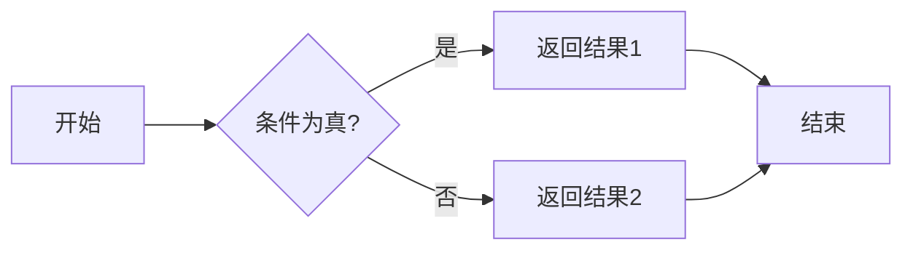

## 三元表达式的机制说明
- 三元表达式是一种简洁的条件表达式，通常用于在一行代码中根据条件返回不同的值。
- 三元表达式的基本语法是：`条件 ? 条件为真时的值 : 条件为假时的值`。
- 三元表达式的工作原理是：首先计算条件，如果条件为真，则返回第一个值；如果条件为假，则返回第二个值。
1. **条件判断**：  
   - 无论语言，三元表达式**首先计算条件**的逻辑值（`True/False` 或 `truthy/falsy`）。
2. **分支选择**：  
   - 若条件为真 → 返回 `结果1`。
   - 若条件为假 → 返回 `结果2`。
3. **短路特性**：  
   - 仅执行被选分支的表达式（未选分支不执行）

## Python 和JavaScript的三元表达式
### 一、Python 三元表达式流程图

**语法规则**：  
`结果1 if 条件 else 结果2`



**示例**：  

```python
x = 5
result = "大于3" if x > 3 else "小于等于3"
# 流程：x>3 → 是 → 返回"大于3"
```

---

### 二、JavaScript 三元表达式流程图

**语法规则**：  
`条件 ? 结果1 : 结果2`


**示例**：  

```javascript
const x = 5;
const result = x > 3 ? "大于3" : "小于等于3";
// 流程：x>3 → 是 → 返回"大于3"
```

---

### 差异迪比
| 特性         | Python                         | JavaScript             |
| ------------ | ------------------------------ | ---------------------- |
| **语法结构** | `结果1 if 条件 else 结果2`     | `条件 ? 结果1 : 结果2` |
| **执行顺序** | 从左到右：先判断条件，再选结果 | 同左                   |
| **代码风格** | 类似自然语言                   | 符号化（`?` 和 `:`）   |


### . 基础用法

```python
# 基本形式
age = 20
status = "成年" if age >= 18 else "未成年"
print(status)  # 输出：成年

# 表达式结果类型必须兼容
value = 42 if True else "error"  # 合法但危险（返回 int 或 str）
```

### 2. 嵌套示例

```python
# 三层嵌套（可读性下降，不推荐）
score = 85
grade = 'A' if score >=90 else 'B' if score >=80 else 'C' if score >=70 else 'D'
print(grade)  # 输出：B
```

### 3. 特殊限制

- **不能包含语句**：

  ```python
  # 错误示例（赋值是语句）
  x = 10 if (y=5) else 20  # SyntaxError
  ```

---
