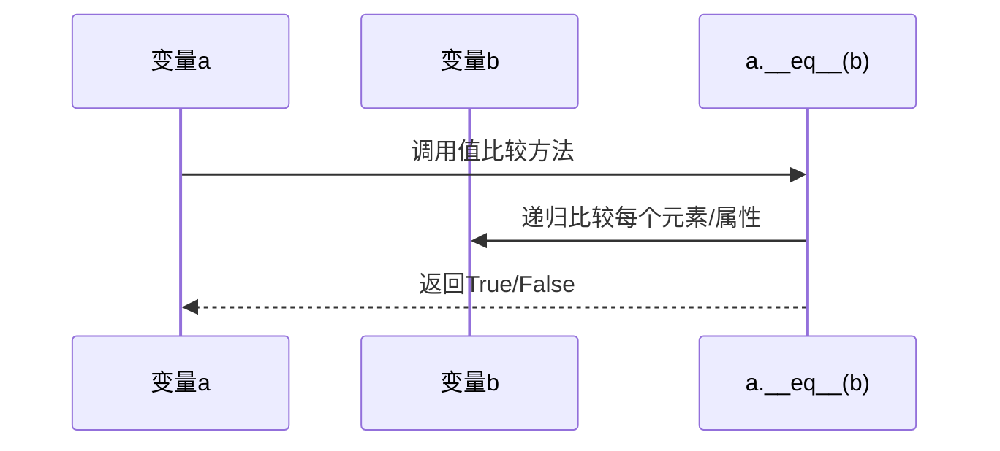
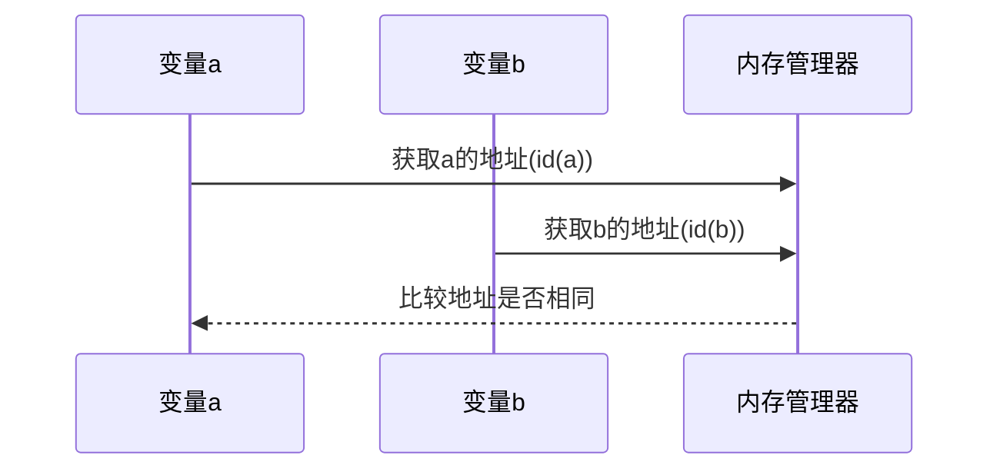

## 语言特性对比
#### 1. **Python**

- **值比较（`==`）**：
  - 调用对象的 `__eq__` 方法，递归比较内容。
  - 对不可变对象（如字符串、小整数）可能因驻留机制优化内存，但比较时仍优先内容。
  - 示例：`[1, 2] == [1, 2]` → `True`。

- **内存地址比较（`is`）**：
  - 直接比较对象的 `id()`（内存地址）。
  - 示例：`a = [1, 2]; b = [1, 2]; a is b` → `False`。

### 二、时序图分析

#### 1. **Python 值比较（`==`）**



#### 2. **Python 内存地址比较（`is`）**




## Python的机制
###  值比较 (`==`)

- **行为**：递归比较对象的内容

- **示例**：

  ```python
  a = [1, 2]
  b = [1, 2]
  print(a == b)  # True（内容相同）
  ```

### 2. 内存地址比较 (`is`)

- **行为**：检查两个变量是否指向同一内存对象

- **底层实现**：通过 `id()` 获取对象地址

- **示例**：

  ```python
  a = [1, 2]
  b = a         # 指向同一个对象
  c = [1, 2]    # 新对象
  print(a is b) # True
  print(a is c) # False
  print(id(a) == id(b))  # 等效写法
  ```

### 3. 特殊规则（小整数池、字符串驻留）

- **小整数**：Python 缓存 -5 到 256 的整数

  ```python
  a = 100
  b = 100
  print(a is b)  # True
  ```

- **字符串驻留**：短字符串复用

  ```python
  s1 = "hello"
  s2 = "hello"
  print(s1 is s2)  # True
  ```

---
## JavaScript的机制
---

## 深度比较的解决方案 Python
### 1. Python 的深度比较

- **标准库**：`collections` 模块

  ```python
  from collections import deque
  
  # 比较嵌套结构
  a = {'key': [1, 2, 3]}
  b = {'key': [1, 2, 3]}
  print(a == b)  # True（自动深度比较）
  ```

- **第三方库**：`deepdiff`

  ```python
  from deepdiff import DeepDiff
  
  diff = DeepDiff(a, b)
  print(not diff)  # True 表示内容相同
  ```


## 最佳实践
### Python

1. **值比较**：始终使用 `==`

2. **对象同一性检查**：使用 `is`（如判断 `None`）

   ```python
   if result is None:
       handle_error()
   ```

3. **避免小整数陷阱**：不要依赖 `is` 比较数字

