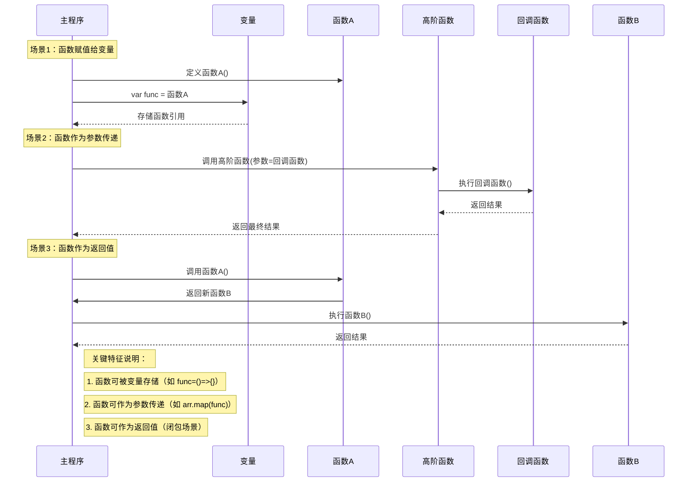

## 函数是第一公民

### 什么是“函数是第一公民”？
- **定义**：在编程语言中，函数被视为“一等公民”（First-Class Citizens）。这意味着函数与其他数据类型（如整数、字符串、列表等）具有同等的地位。具体表现为：
    - 函数可以被赋值给变量。
    - 函数可以作为参数传递给其他函数。
    - 函数可以作为另一个函数的返回值。
    - 函数可以在其他函数内部定义（嵌套函数）。
    - 函数可以存储在数据结构中（如列表、字典）。

- **高阶函数（Higher-Order Functions）**：高阶函数是指那些至少满足以下条件之一的函数：
    - 接受一个或多个函数作为参数。
    - 返回一个函数作为结果。
    高阶函数是函数作为一等公民特性的直接体现和应用。

### 历史起源
- **早期概念**：函数作为一等公民的概念最早可以追溯到20世纪60年代的 **Lisp** 语言。Lisp 是最早支持函数式编程范式的语言之一，其设计哲学深刻影响了后续许多编程语言。
- **λ演算（Lambda Calculus）**：其理论基础源于阿隆佐·邱奇（Alonzo Church）在20世纪30年代提出的λ演算。λ演算是一种形式系统，用于研究函数定义、函数应用和递归。它为函数式编程提供了坚实的数学基础。
- **广泛采纳**：随着时间的推移，许多现代编程语言，如 Python, JavaScript, Ruby, Scala, Haskell, Swift, Kotlin 等，都采纳了函数作为一等公民的特性，因为它能带来更灵活和强大的编程能力。

### 设计意义
函数作为一等公民的设计带来了诸多好处：

1.  **增强的表达能力**：允许开发者编写更简洁、更易读、更接近人类自然语言或数学表达式的代码。
2.  **代码复用性**：通过高阶函数，可以将通用的行为抽象出来。例如，`map`、`filter`、`reduce` 等操作可以应用于不同的数据和不同的操作函数，从而减少重复代码。
3.  **模块化和抽象**：可以将功能封装在函数中，并将这些函数像积木一样组合起来，构建更复杂的系统。这有助于创建更清晰的模块边界和更高层次的抽象。
4.  **支持函数式编程范式**：这是实现函数式编程（Functional Programming, FP）的核心。FP 强调使用纯函数、避免副作用、以及利用不可变数据，从而使得程序更易于推理、测试和并行化。
5.  **回调函数（Callbacks）**：在异步编程（如 JavaScript 中的事件处理、Node.js 的 I/O 操作）和事件驱动编程中，函数作为参数传递（回调）是一种常见且强大的模式。
6.  **延迟执行（Lazy Evaluation）和控制结构**：函数可以被创建并存储起来，直到需要时才执行。这使得可以构建自定义的控制流结构。
7.  **代码的灵活性和动态性**：可以在运行时创建和修改函数（例如通过闭包或函数工厂），使得程序能够适应不同的需求。

### 要解决什么问题？
引入函数作为一等公民的概念，主要是为了解决传统命令式编程中存在的一些问题，并提供更优雅的编程方式：

1.  **减少冗余和模板代码**：在没有高阶函数的情况下，很多相似的逻辑（如遍历集合并对每个元素执行操作）需要重复编写。高阶函数允许将这些通用模式抽象出来。
2.  **提高代码的抽象层次**：使得开发者可以更多地关注“做什么”（声明式），而不是“怎么做”（命令式）。例如，使用 `map` 函数时，你声明了对集合中每个元素应用一个转换函数，而不用关心具体的循环和索引管理。
3.  **简化复杂操作的组合**：可以将多个简单的函数组合起来形成复杂的操作链，使得逻辑更清晰，易于管理。
4.  **更好地处理状态和副作用**：虽然函数作为一等公民本身不直接解决状态管理问题，但它为函数式编程提供了基础，而函数式编程范式鼓励使用纯函数和不可变性，这有助于减少由可变状态和副作用引起的bug。
5.  **实现更灵活的API设计**：库和框架的设计者可以提供接受函数作为参数的API，允许用户自定义行为，从而提高库的通用性和可扩展性（例如，排序函数接受一个比较函数）。
6.  **应对异步和事件驱动的场景**：在需要响应事件或处理异步操作时，将函数作为回调传递是一种自然且高效的方式来组织代码。

总而言之，函数作为一等公民是现代编程语言中一个强大且基础的特性，它使得代码更加灵活、可复用，并为函数式编程等高级编程范式奠定了基础。

## 函数是第一公民的 时序图
以下是用 Mermaid 时序图梳理**函数是第一公民**概念的示意图，通过代码赋值、传递、调用的流程展示函数作为「变量」的特性：




## Python3 中的函数是第一公民
### . 语言特性

- **函数即对象**：所有函数均为 `function` 类型实例

  ```python
  def greet():
      return "Hello"
  
  print(type(greet))  # <class 'function'>
  print(greet.__name__)  # 'greet'
  ```

- **Lambda 表达式**：匿名函数简化写法

  ```python
  square = lambda x: x ** 2
  ```

- **闭包支持**：捕获外部作用域变量

  ```python
  def make_adder(n):
      def adder(x):
          return x + n  # 捕获外部变量 n
      return adder
  add5 = make_adder(5)
  ```

### 2. 特殊机制

- **装饰器语法**：通过 `@` 符号实现元编程

  ```python
  def log_time(func):
      def wrapper(*args):
          start = time.time()
          result = func(*args)
          print(f"Time: {time.time() - start}s")
          return result
      return wrapper
  
  @log_time
  def heavy_calculation():
      # 复杂计算
  ```

### 3. 限制与特性

- **命名函数限制**：无法直接内联多语句函数

- **作用域规则**：使用 `nonlocal` 关键字修改闭包变量

  ```python
  def counter():
      count = 0
      def inc():
          nonlocal count
          count += 1
          return count
      return inc
  ```
### 4. 函数式编程支持
- **高阶函数**：接受函数作为参数或返回函数
  ```python
  def apply(func, x):
      return func(x)
  
  def square(x):
      return x ** 2
  
  result = apply(square, 5)  # 25
  ```
- **函数组合**：使用 `functools.partial` 或 `operator` 模块
  ```python
  from functools import partial

  def add(x, y):
      return x + y
  add5 = partial(add, 5)
  result = add5(3)  # 8
  ```
### 5. 异步编程支持
- **异步函数**：使用 `async/await` 关键字
  ```python
  async def fetch_data(url):
      # 异步获取数据
  ```
- **回调函数**：使用 `asyncio` 库
  ```python
  import asyncio
  def callback(future):
      print(f"Result: {future.result()}")
  loop = asyncio.get_event_loop()
  ```python
  import asyncio
  def callback(future):
      print(f"Result: {future.result()}")
  loop = asyncio.get_event_loop()
  task = loop.create_task(fetch_data("URL_ADDRESS  task = loop.create_task(fetch_data("https://example.com"))
  task.add_done_callback(callback)
  loop.run_until_complete(task)
  ```
  