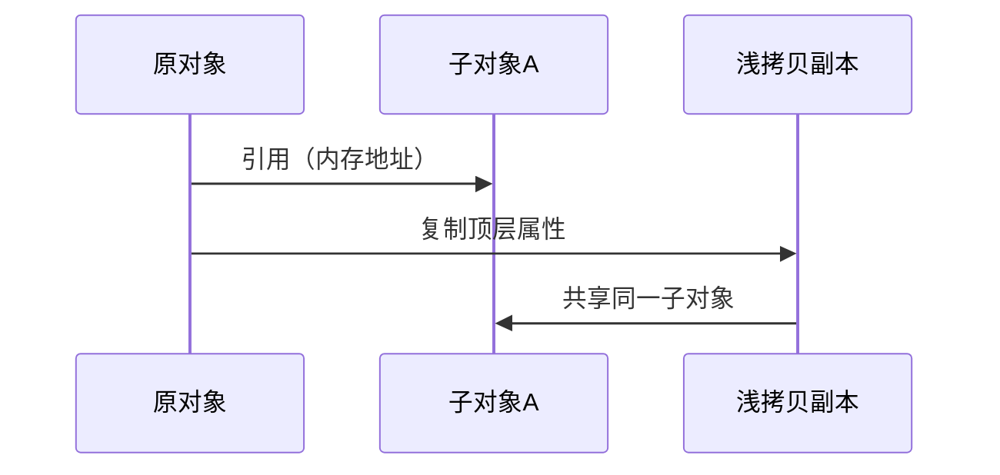
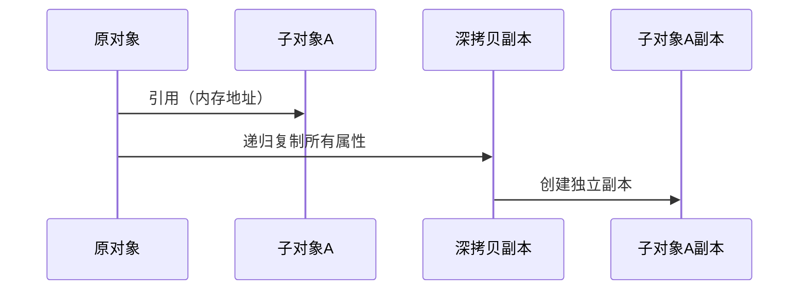

### 深拷贝 vs 浅拷贝：概念与区别


#### 1. **基本定义**：

- **浅拷贝**：仅复制对象的顶层属性，如果属性是引用类型（如对象、数组），则拷贝的是引用地址（共享内存）。
- **深拷贝**：递归复制对象及其所有嵌套的子对象，生成完全独立的新对象（不共享内存）。

#### 2. **核心区别**：

| 特性             | 浅拷贝                   | 深拷贝                   |
| ---------------- | ------------------------ | ------------------------ |
| **复制层级**     | 仅复制顶层属性           | 递归复制所有层级         |
| **引用类型处理** | 共享引用（修改互相影响） | 独立副本（修改互不影响） |
| **内存占用**     | 低（共享内存）           | 高（完全独立内存）       |
| **性能**         | 快                       | 慢（需遍历所有属性）     |

---

### 时序图拆解原理（Mermaid）

#### **浅拷贝时序图**：



- **关键行为**：  
  浅拷贝副本与原对象共享子对象，修改 `浅拷贝副本.子对象A` 会同步影响原对象。

---

#### **深拷贝时序图**：



- **关键行为**：  
  深拷贝副本生成完全独立的 `子对象A副本`，与原对象无关联，修改互不影响。

---


## Python 中实现深拷贝和浅拷贝的方法
### 1. 浅拷贝实现

```python
import copy

# 列表浅拷贝
original_list = [1, [2, 3]]
shallow_list = original_list.copy()  # 或 list(original_list)
shallow_list2 = copy.copy(original_list)

# 字典浅拷贝
original_dict = {'a': 1, 'b': {'c': 2}}
shallow_dict = original_dict.copy()
shallow_dict2 = dict(original_dict)
```

### 2. 深拷贝实现

```python
import copy

original = [1, [2, 3]]
deep_copy = copy.deepcopy(original)

# 验证独立性
original[1][0] = 99
print(deep_copy)  # 输出 [1, [2, 3]]（未受影响）
```

**`deepcopy` 特性**：

- 处理循环引用：自动维护已复制对象的备忘录
- 保留对象类型：包括自定义类实例
- 控制复制行为：可通过定义 `__deepcopy__` 方法自定义

