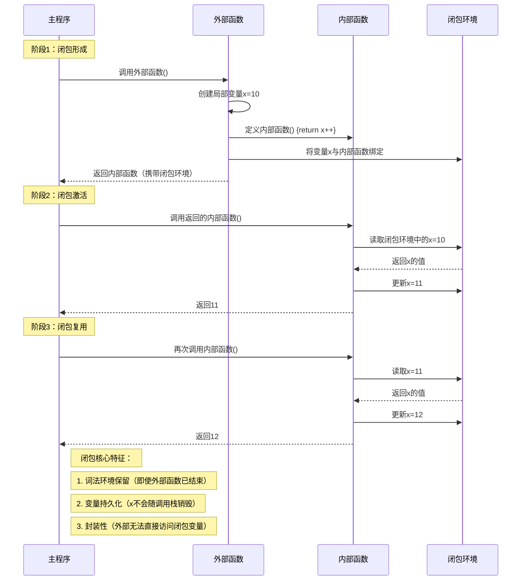

## 闭包 (Closure)

### 什么是闭包？
- **定义**：闭包是指一个函数以及其相关的引用环境（即该函数在创建时能访问到的词法作用域中的变量）的组合。简单来说，一个函数“记住”了它被创建时的环境，即使它在定义它的作用域之外被调用，它仍然可以访问那些变量。
- **核心特征**：
    1.  **函数嵌套**：闭包通常是在一个函数内部定义另一个函数。
    2.  **内部函数引用外部函数的变量**：内部函数引用了其外部（封闭）函数作用域中的变量。
    3.  **外部函数返回内部函数**：外部函数将内部函数作为返回值返回，或者将内部函数传递到其他地方。

当内部函数在外部函数执行完毕后仍然存在，并且可以访问外部函数作用域中的变量时，就形成了闭包。

### 历史起源
- **λ演算 (Lambda Calculus)**：闭包的概念根植于阿隆佐·邱奇（Alonzo Church）在20世纪30年代提出的λ演算。λ演算为函数式编程提供了理论基础，其中函数的词法作用域和自由变量的概念是闭包的核心。
- **Lisp 和 Scheme**：最早在编程语言中明确实现和广泛使用闭包概念的是 Lisp 方言，特别是 Scheme（20世纪70年代）。Scheme 的设计强调词法作用域和函数作为一等公民，这使得闭包成为其自然且强大的特性。Peter J. Landin 在1964年的一篇论文中引入了术语“closure”，描述了将代码（函数）与其环境（变量绑定）打包在一起的概念。
- **Smalltalk**：Smalltalk 语言（20世纪70-80年代）中的“块”（blocks）也具有闭包的特性。
- **现代语言的普及**：随着函数式编程思想的复兴和其优势被广泛认识，闭包特性被许多现代编程语言所采纳，包括 Python, JavaScript, Ruby, Swift, Kotlin, Scala, C# (通过委托和lambda表达式), Java (通过lambda表达式和匿名内部类) 等。

### 设计意义
闭包的设计带来了许多重要的编程优势和能力：

1.  **数据封装和信息隐藏**：
    *   闭包允许创建私有变量。外部函数中的变量对于返回的内部函数是可访问的，但对于外部函数的调用者来说是不可直接访问的。这有助于隐藏实现细节，只暴露必要的接口。

2.  **状态保持 (State Preservation)**：
    *   函数可以“记住”其创建时的词法环境。这意味着即使外部函数已经执行完毕，其作用域内的变量（被内部函数引用的）仍然存活，并可供内部函数后续调用时使用。这使得函数可以拥有和管理自己的状态。

3.  **支持函数式编程范式**：
    *   **柯里化 (Currying)** 和 **偏函数应用 (Partial Application)**：闭包是实现这些技术的基础，允许创建更专业化、参数更少的函数。
    *   **函数工厂 (Function Factories)**：可以编写一个函数，该函数根据传入的参数生成并返回新的、定制化的函数。

4.  **回调函数和事件处理器**：
    *   在异步编程（如 JavaScript 中的 `setTimeout`, 事件监听器）中，闭包非常有用。回调函数可以携带其创建时的上下文信息，即使在稍后某个时间点被调用，也能正确访问所需数据。

5.  **模块化和代码组织**：
    *   通过闭包可以创建独立的模块单元，每个单元有自己的状态和行为，而不会污染全局作用域。

6.  **延迟执行和控制结构**：
    *   函数可以被创建并携带其执行所需的环境，但其执行可以被推迟到稍后的某个时间点。

7.  **创建简洁的API**：
    *   库的作者可以利用闭包来创建更灵活和富有表现力的API。

### 要解决什么问题？
闭包的引入旨在解决编程中的一系列问题，并提供更优雅的解决方案：

1.  **避免全局变量污染**：
    *   通过将状态封装在闭包内，可以减少对全局变量的依赖，从而降低命名冲突和意外修改的风险，使代码更易于维护。

2.  **在无类语言中实现私有成员和封装**：
    *   在像早期 JavaScript 这样没有原生 `private` 关键字的语言中，闭包是模拟私有变量和方法的主要方式。

3.  **管理函数执行的上下文和状态**：
    *   当函数需要跨多次调用保持某种状态，或者需要在特定上下文中执行时（如回调），闭包提供了一种自然的方式来管理这些状态和上下文，而无需将状态暴露给外部。

4.  **创建可配置的函数和行为**：
    *   通过函数工厂模式，可以根据不同的配置生成不同的函数实例，每个实例都“记住”了自己的配置。例如，创建一个可以根据不同税率计算税额的函数。

5.  **简化异步操作中的状态管理**：
    *   在异步回调中，闭包确保回调函数在执行时能够访问到发起异步操作时相关的变量和状态，即使原始的执行上下文已经消失。

6.  **实现高阶函数，提高代码复用性**：
    *   闭包是高阶函数（如 `map`, `filter`, `reduce` 的自定义版本，或者装饰器）能够有效工作的关键，它们使得通用逻辑可以与特定操作（通过闭包传入）分离。

7.  **提供更灵活的迭代器和生成器实现**：
    *   在某些语言中，闭包可以用来简洁地实现自定义的迭代逻辑，保持迭代过程中的状态。

## 闭包的时序图说明
以下是用 Mermaid 时序图梳理**闭包（Closure）**概念的示意图，通过作用域链、词法环境和函数执行的流程展示闭包的核心机制：



### 核心逻辑拆解

1. **环境捕获机制**  
   当内部函数被定义时，自动记录其**词法环境**（包含外部函数的局部变量）

2. **生命周期延伸**  
   闭包环境独立于函数调用栈存在，直到所有引用该闭包的函数都被销毁

3. **状态封装**  
   通过闭包环境实现类似私有变量的特性（如示例中的 `x` 变量）

4. **多重闭包隔离**  
   每次调用外部函数都会生成**新的闭包环境**（如 `const f1=outer(); f2=outer()` 产生两个独立环境）

> 注：此机制常见于计数器、缓存系统、防抖节流等场景，是JavaScript的核心特性之一


## Python和JavaScript实现闭包

### Python实现
### . 语言特性

- **词法作用域**：默认捕获外层变量（Python 3+）：

  ```python
  def outer():
      x = 10
      def inner():
          print(x)  # 捕获外层 x
      return inner
  closure = outer()
  closure()  # 10
  ```

- **变量修改限制**：需使用 `nonlocal` 声明修改外层变量：

  ```python
  def counter():
      count = 0
      def inc():
          nonlocal count  # 声明可修改外层变量
          count += 1
          return count
      return inc
  ```

### 2. 实现机制

- **闭包变量存储**：通过 `__closure__` 属性访问捕获的变量：

  ```python
  def outer():
      x = 5
      return lambda: x + 1
  
  func = outer()
  print(func.__closure__[0].cell_contents)  # 5
  ```

### 3. 限制与特性

- **延迟绑定问题**：循环中创建的闭包共享同一变量：

  ```python
  functions = []
  for i in range(3):
      functions.append(lambda: i)
  print([f() for f in functions])  # [2,2,2]
  # 修复：使用默认参数捕获当前值
  functions = [lambda i=i: i for i in range(3)]
  ```


