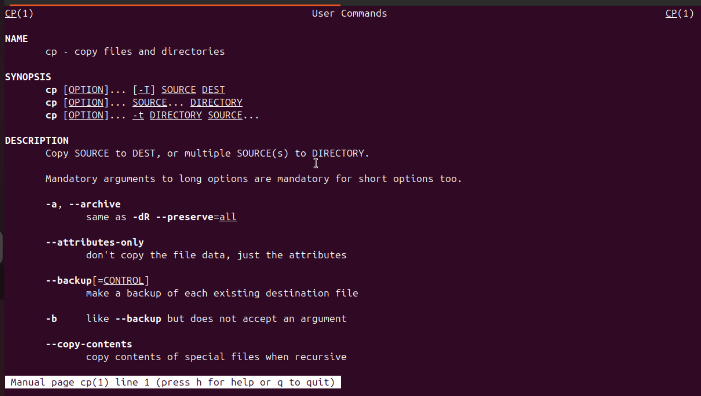

# linux查看帮助指令

man 查看命令的帮助手册





以下是关于 Linux `info` 命令的详细解析及实际应用示例：

---

## 一、`info` 命令核心功能
Linux 的 `info` 命令是比 `man` 更强大的文档查看工具，提供 **结构化文档** 和 **超链接导航**，适合查阅复杂命令和软件（如 GCC、Bash 等）的详细文档。

---

## 二、命令语法
```bash
info [选项] [文档节点]
```

---

## 三、关键选项详解

| 选项               | 作用                                                                 | 示例                           |
|--------------------|--------------------------------------------------------------------|-------------------------------|
| `-a`               | 显示所有匹配的手册（多版本时使用）                                       | `info -a ls`                  |
| `-k <关键词>`       | **全局搜索**所有 info 文档的索引项                                      | `info -k "regular expression"`|
| `-d <目录>`         | 添加自定义文档目录到搜索路径                                            | `info -d ~/mydocs/`           |
| `-f <手册名>`       | 指定要查看的手册文件                                                   | `info -f bash`                |
| `-n <节点名>`       | 直接跳转到手册的指定节点                                                | `info -n "Bash Features"`     |
| `-w`               | 显示手册文件的物理存储路径                                              | `info -w coreutils`           |
| `-o <文件名>`       | 将当前查看的文档输出到文件                                               | `info -o gcc.txt gcc`         |

---

## 四、实操案例

### 1. 查看 `grep` 命令的完整文档
```bash
info grep
```
**导航操作**：
- `→` 进入子章节（如 "Usage"）
- `←` 返回上级目录
- `u` 返回目录首页
- `/` 启动页面内搜索

### 2. 搜索所有涉及「文件权限」的文档
```bash
info -k "file permission"
```
输出匹配的文档列表，按 `Enter` 进入对应章节。

### 3. 查看 Bash 手册的「变量扩展」章节
```bash
info bash -n "Shell Parameter Expansion"
```

### 4. 查找 `chmod` 文档的存储路径
```bash
info -w chmod
```
输出示例：  
`/usr/share/info/coreutils.info.gz`

---

## 五、`info` vs `man` 对比

| **特性**           | `man` 手册                          | `info` 文档                         |
|-------------------|------------------------------------|-------------------------------------|
| 文档结构           | 线性文本                            | 树状结构，支持章节跳转                     |
| 内容深度           | 简洁快速参考                         | 详细教程式文档（含示例和原理）                |
| 交互性            | 无交互                             | 支持超链接、目录菜单、跨文档跳转               |
| 典型应用场景       | 快速查看命令参数                      | 学习复杂工具（如 GCC、Emacs）              |

---

## 六、高级技巧

### 1. 跨文档跳转
在 `info` 界面输入 `g` + 手册名（如 `(emacs)Top`），可跳转到其他手册。

### 2. 快捷键速查
| 快捷键           | 作用                     |
|----------------|-------------------------|
| `Space`        | 向下翻页                  |
| `Backspace`    | 向上翻页                  |
| `Tab`          | 跳转到下一个超链接           |
| `Enter`        | 进入选中的超链接节点          |
| `q`            | 退出 info 浏览器           |

### 3. 查看 `info` 自身文档
```bash
info info
```

---

## 七、典型应用场景
1. **学习复杂工具**：如 GNU Make 的规则语法  
   `info make`
   
2. **调试脚本**：查看 Bash 的条件表达式细节  
   `info bash "Conditional Expressions"`

3. **开发参考**：研究 GCC 编译选项  
   `info gcc "Optimize Options"`

---

通过 `info` 命令，你可以高效获取比 `man` 更系统化的技术文档，尤其适合需要深入理解工具原理的场景。


# Linux 中 `which` 命令完全指南：定位可执行文件路径  

## 一、命令核心功能  
`which` 命令用于 **快速定位命令对应的可执行文件路径**，通过搜索 `$PATH` 环境变量中的目录。它是排查命令冲突、验证软件安装的必备工具。

---

## 二、命令语法与返回状态  
```bash  
which [选项] 命令名  
```  
**返回状态码**：  
- **0**：找到可执行文件  
- **1**：未找到或不可执行  
- **2**：参数错误  

---

## 三、关键选项详解  

| 选项              | 作用描述                          | 示例                     |
|-------------------|---------------------------------|--------------------------|
| `-a`              | 显示所有匹配路径（不止第一个）         | `which -a python`        |
| `--skip-alias`    | 忽略命令别名（显示原始路径）           | `which --skip-alias ll`  |
| `-V` / `--version`| 显示版本信息                       | `which -V`               |
| `-h` / `--help`   | 显示帮助文档                       | `which --help`           |

---

## 四、实战案例演示  

### 1. 查找常用命令的安装位置  
```bash  
which ls      # 输出：/usr/bin/ls  
which git     # 若未安装则无输出  
```  

### 2. 查看 Python 的所有安装版本  
```bash  
which -a python3  
```  
**典型输出**：  
```  
/usr/bin/python3  
/home/user/.pyenv/shims/python3  
```  

### 3. 排除别名干扰  
```bash  
alias ll='ls -l'  
which ll          # 输出：alias ll='ls -l'  
which --skip-alias ll  # 输出：/usr/bin/ls  
```  

### 4. 验证命令是否存在（脚本中使用）  
```bash  
if ! which docker >/dev/null; then  
    echo "错误：未安装 Docker！"  
    exit 1  
fi  
```  

---

## 五、`which` vs `whereis` vs `type` 对比  

| **命令**   | **搜索范围**           | **输出内容**               | **典型场景**               |  
|------------|-----------------------|--------------------------|--------------------------|  
| `which`    | `$PATH` 中的目录       | 首个可执行文件路径          | 确认当前生效的命令版本       |  
| `whereis`  | 预定义目录（如 /bin）  | 二进制文件、源码、man手册路径 | 查找软件安装的完整位置       |  
| `type`     | 内置命令 + `$PATH`     | 命令类型（别名/内置/外部）   | 分析命令的执行来源           |  

**示例对比**：  
```bash  
which cd      # 输出：/usr/bin/cd（外部命令）  
type cd       # 输出：cd 是 shell 内置命令  
whereis cd    # 输出：cd: /usr/bin/cd /usr/share/man/man1/cd.1.gz  
```  

---

## 六、高级使用技巧  

### 1. 调试 `$PATH` 问题  
```bash  
echo $PATH | tr ':' '\n'  # 查看 PATH 目录结构  
which -a java            # 检查 Java 路径优先级  
```  

### 2. 结合 `xargs` 批量查找  
```bash  
echo -e "npm\ngcc\npython" | xargs -n 1 which  
```  

### 3. 自定义搜索路径（临时生效）  
```bash  
PATH="/custom/bin:$PATH" which myapp  
```  

---

## 七、常见问题解答  

### Q1：为什么 `which cd` 有输出但实际是内置命令？  
- **原因**：Bash 同时存在内置 `cd` 和外部 `/usr/bin/cd`  
- **验证**：执行 `/usr/bin/cd` 不会改变当前 Shell 目录  

### Q2：找不到新安装的命令怎么办？  
- 检查 `$PATH` 是否包含安装目录  
- 执行 `hash -r` 刷新命令缓存  

---

## 八、总结  
`which` 命令是 Linux 系统管理的 **瑞士军刀** 级工具，能快速解决：  
1. 命令路径定位  
2. 多版本冲突排查  
3. 环境变量配置验证  
