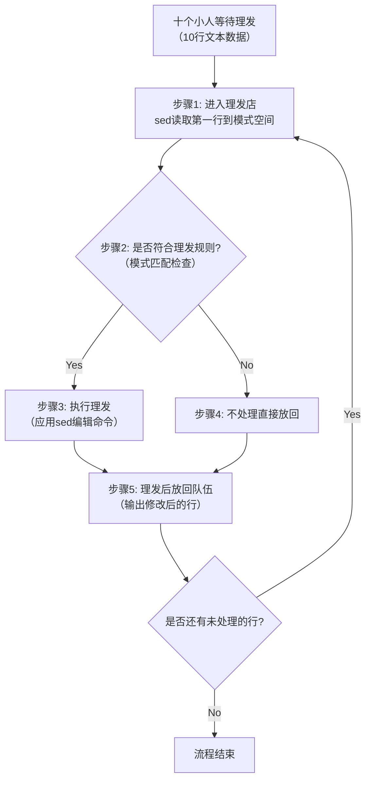
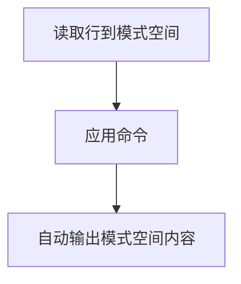
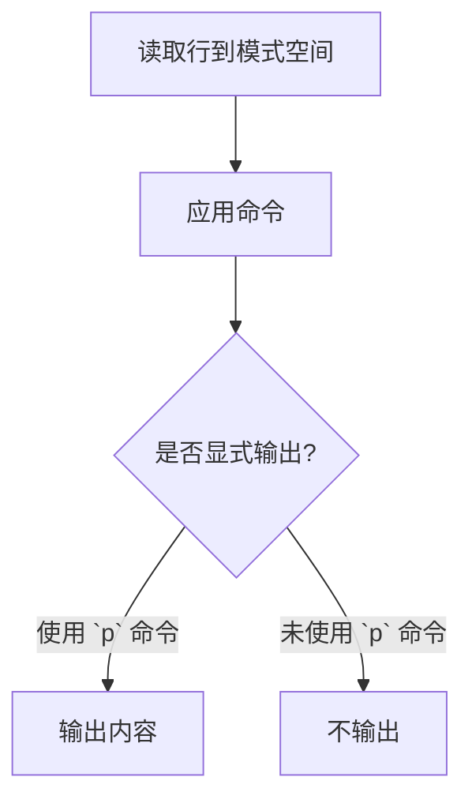
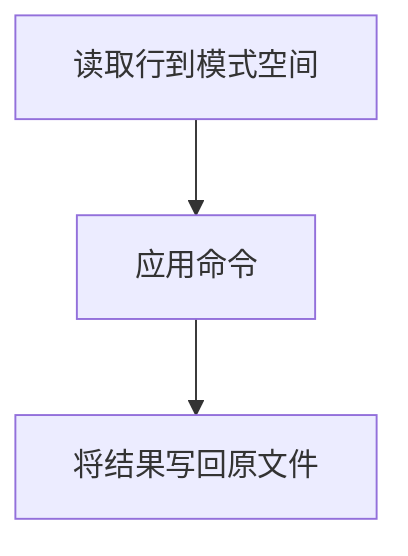
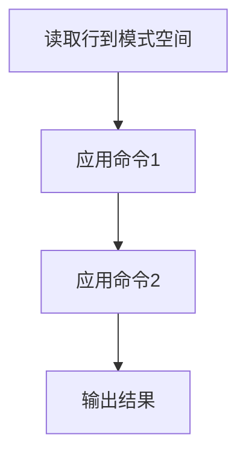
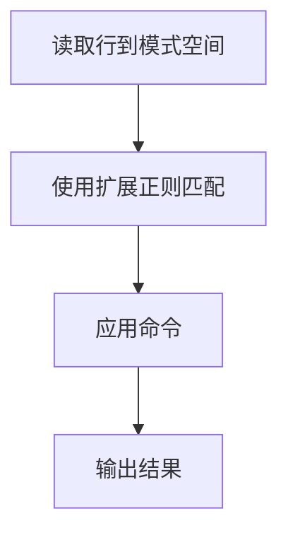

---

title: "正则表达式与文本处理"
outline: deep
desc: "正则表达式与文本处理"
tags: "Devops"
updateTime: "2025-04-23 16:11"

---


# **正则表达式的核心意义与作用**  

、以下是 **正则表达式（Regular Expression, Regex）的核心意义与价值** 的完整解析：

#### **一、核心意义**  

1. **高效处理海量文本**  
   - 通过定义 **特定规则和模式**，快速从海量字符串（如日志、配置文件、代码等）中 **过滤、提取或替换** 目标内容。  
   - **示例场景**：  
     - 从 100GB 日志中提取所有包含 `ERROR` 关键字的行。  
     - 批量修改配置文件中 `IP=192.168.1.*` 为 `IP=10.0.0.*`。  

2. **化繁为简的文本操作**  
   - 用简短的符号组合（如 `^[A-Za-z]+@[A-Za-z]+\.[A-Za-z]{2,}$`）替代冗长的条件判断，**解决复杂文本匹配需求**。  
   - **优势**：  
     - 减少手动逐行检查的时间成本。  
     - 提升脚本或程序的自动化处理能力。  

3. **标准化文本处理流程**  
   - 提供统一的语法规则，使得文本处理逻辑 **可复用、可移植**（如 Python、Java、Perl 等语言均支持正则表达式）。  


#### **二、Linux 中的正则表达式**  

##### **1. 与通配符的对比**  

| **功能**     | **正则表达式**                 | **通配符（Wildcard）**         |
| ------------ | ------------------------------ | ------------------------------ |
| **适用对象** | 文本内容（数据流）             | 文件名/目录名                  |
| **支持命令** | 三剑客（`grep`、`sed`、`awk`） | 大部分普通命令（`ls`、`cp`等） |
| **核心用途** | 内容过滤、替换、提取           | 文件匹配与查找                 |

##### **2. 三剑客的作用**  

- **`grep`**：基于正则表达式 **搜索并输出匹配行**。  

  ```bash  
  # 查找 Nginx 日志中状态码为 5xx 的错误  
  grep 'HTTP/1.1" 5[0-9][0-9]' /var/log/nginx/access.log  
  ```

- **`sed`**：基于正则表达式 **执行文本替换或编辑**。  

  ```bash  
  # 替换文件中的旧域名为新域名  
  sed -i 's/old-domain.com/new-domain.com/g' config.conf  
  ```

- **`awk`**：结合正则表达式 **按条件提取并格式化字段**。  

  ```bash  
  # 提取日志中访问量最高的前 5 个 IP  
  awk '/GET/ {print $1}' access.log | sort | uniq -c | sort -nr | head -5  
  ```

---

#### **三、典型应用场景**  

1. **配置文件管理**  
   - 批量修改多台服务器的 `sshd_config` 中 `Port` 值。  
2. **日志分析**  
   - 统计每小时 500 错误的数量，生成监控报告。  
3. **代码重构**  
   - 在大型项目中全局替换弃用的函数名（如 `deprecated_func()` → `new_func()`）。  
4. **数据清洗**  
   - 从 CSV 文件中提取符合邮箱格式的字段。  

---

#### **四、正则表达式与编程语言**  

- **通用性**：语法规则在主流编程语言中高度一致（如 Python 的 `re` 模块、Java 的 `java.util.regex`）。  
- **跨平台性**：同一正则表达式可在 Shell 脚本、Python 脚本或 Java 程序中复用。  

---

### **总结**  

正则表达式是 **文本处理的瑞士军刀**，通过简洁的符号规则解决了海量文本操作中的复杂问题。在 Linux 系统中，它与三剑客命令深度结合，成为运维自动化、日志分析、配置管理的核心工具；在开发领域，它是数据清洗、格式验证、代码重构的通用解决方案。掌握正则表达式，可大幅提升工作效率与代码质量！ 🔍


---

### **正则表达式分类详解**  

---

#### **一、正则表达式两大分类**  

在 Linux 系统中，正则表达式主要分为以下两类：  

| **分类**           | **简称** | **特性**                                              |
| ------------------ | -------- | ----------------------------------------------------- |
| **基本正则表达式** | BRE      | 基础匹配规则，支持有限的元字符                        |
| **扩展正则表达式** | ERE      | 在 BRE 基础上增加更多高级元字符，提供更强大的匹配能力 |

---

#### **二、基本正则表达式（BRE）**  

##### **核心元字符**  

| **元字符** | **功能说明**                                                 |
| ---------- | ------------------------------------------------------------ |
| `^`        | 匹配行首（如 `^abc` 匹配以 `abc` 开头的行）                  |
| `$`        | 匹配行尾（如 `xyz$` 匹配以 `xyz` 结尾的行）                  |
| `[ ]`      | 匹配括号内的任意一个字符（如 `[aeiou]` 匹配任意元音字母）    |
| `*`        | 匹配前一个字符的零次或多次重复（如 `a*` 匹配 `a`、`aa`、`aaa` 等） |

---

#### **三、扩展正则表达式（ERE）**  

##### **新增元字符（在 BRE 基础上扩展）**  

| **元字符** | **功能说明**                                                 |
| ---------- | ------------------------------------------------------------ |
| `( )`      | 定义子表达式（分组），用于组合匹配或提取内容                 |
| `{ }`      | 指定重复次数（如 `a{3}` 匹配 `aaa`，`a{2,5}` 匹配 2-5 次重复） |
| `?`        | 匹配前一个字符的零次或一次（如 `colou?r` 匹配 `color` 或 `colour`） |
| `+`        | 匹配前一个字符的一次或多次（如 `go+gle` 匹配 `gogle`、`google` 等） |
| `\|`       | 逻辑“或”操作（如 `cat\|dog` 匹配 `cat` 或 `dog`）            |

---

#### **四、BRE 与 ERE 对比总结**  

| **特性**       | **BRE**     | **ERE**                    |
| -------------- | ----------- | -------------------------- |
| **语法复杂度** | 简单        | 复杂                       |
| **功能范围**   | 基础匹配    | 高级匹配                   |
| **适用工具**   | 默认 `grep` | `grep -E`、`awk`、`sed -r` |

---

#### **五、关键应用场景**  

1. **BRE 适用场景**：  
   - 简单的文本匹配（如过滤日志中的关键字）  
   - 兼容性要求高的场景（旧版工具默认支持 BRE）  

2. **ERE 适用场景**：  
   - 复杂模式匹配（如多条件组合、重复次数控制）  
   - 需要分组或逻辑“或”操作的场景  

---


---
### **AWK 基础语法详解（根据图片内容整理）**  


---


### **AWK 基础语法详解（根据图片内容整理）**  


#### **一、AWK 语法结构**  

1. **基础语法形式**  

   ```bash  
   awk [options] 'pattern {action}' file ...  
   ```

   ```bash  
   awk 参数 '条件动作' 文件  
   ```

2. **核心组成部分**  

   | **组件**    | **说明**                                           |
   | ----------- | -------------------------------------------------- |
   | **options** | 可选参数（如 `-F` 指定分隔符、`-v` 定义变量等）    |
   | **pattern** | 匹配条件（正则表达式或逻辑判断），决定是否执行动作 |
   | **action**  | 执行的操作（如 `print`、`printf`），用于格式化输出 |
   | **file**    | 输入的文件或数据流                                 |

---

#### **二、参数与功能说明**  

1. **常用参数（options）**  

   | **参数** | **作用**                   | **示例**                             |
   | -------- | -------------------------- | ------------------------------------ |
   | `-F`     | 指定字段分隔符（默认空格） | `awk -F':' '{print $1}' /etc/passwd` |
   | `-v`     | 定义变量                   | `awk -v var=10 '{print $1 + var}'`   |
   | `-f`     | 从脚本文件读取 AWK 命令    | `awk -f script.awk data.txt`         |

2. **核心概念**  

   - **pattern（条件）**：  
     - 可为正则表达式（如 `/error/`）、行号范围（如 `NR>10`）或逻辑判断（如 `$3 > 100`）。  
     - 若省略 `pattern`，默认处理所有行。  
   - **action（动作）**：  
     - **`print`**：直接输出内容（自动换行）。  
     - **`printf`**：格式化输出（类似 C 语言语法）。  

---

#### **三、核心工作流程**  

1. **读取数据**：逐行读取输入文件到内存。  
2. **字段分割**：按分隔符（如 `-F` 指定）将行切分为字段（`$1`、`$2`...）。  
3. **条件匹配**：检查当前行是否满足 `pattern` 条件。  
4. **执行动作**：若匹配成功，执行 `action` 中的命令。  

---

#### **四、示例场景**  

1. **打印指定列**  

   ```bash  
   # 输出文件第1列和第3列  
   awk '{print $1, $3}' data.txt  
   ```

2. **条件过滤**  

   ```bash  
   # 输出第3列大于100的行  
   awk '$3 > 100 {print $0}' data.txt  
   ```

3. **自定义分隔符**  

   ```bash  
   # 使用冒号分隔符，输出用户名（/etc/passwd）  
   awk -F':' '{print $1}' /etc/passwd  
   ```

---

#### **五、总结**  

- **核心优势**：AWK 擅长 **文本格式化与列处理**，适合日志分析、数据报表生成等场景。  
- **高频操作**：  
  - 列提取（`$1`、`$NF` 等）  
  - 条件过滤（`/pattern/`、逻辑判断）  
  - 统计计算（求和、平均值等）  

通过掌握基础语法与参数，可快速实现高效的文本数据处理！ 🔍

---

### **AWK 命令核心知识点详解（根据图片内容整理）**  

---

#### **一、基础命令示例**  

```bash  
awk '{print $2}'  
```

- **作用**：输出文本的第二列。  
- **说明**：  
  - `$2` 表示按分隔符切割后的 **第二列字段**。  
  - 未指定分隔符时，默认使用 **空格** 分割（多个连续空格视为一个）。  

---

#### **二、核心工作机制**  

1. **按行处理**：逐行读取输入文件，处理完一行后继续下一行。  
2. **字段分割**：  
   - **默认分隔符**：空格（连续空格视为单个分隔符）。  
   - **自定义分隔符**：通过 `-F` 参数指定（如 `-F':'` 表示冒号分隔）。  

---

#### **三、内置变量与字段含义**  

| **变量** | **含义**                                         | **示例**                                         |
| -------- | ------------------------------------------------ | ------------------------------------------------ |
| `$0`     | 当前行的 **完整内容**                            | `echo "a b c" | awk '{print $0}'` → 输出 `a b c` |
| `$1`     | 分割后的 **第一列字段**                          | `echo "a b c" | awk '{print $1}'` → 输出 `a`     |
| `$2`     | 分割后的 **第二列字段**                          | `echo "a b c" | awk '{print $2}'` → 输出 `b`     |
| `$n`     | 分割后的 **第 n 列字段**（若列数不足，输出空值） | `echo "a" | awk '{print $3}'` → 输出空           |

---

#### **四、示意图解析**  

```text  
文本  
+------------------------+  
| $0 完整输入            |  
|（例："apple  banana 123"）|  
+------------------------+  
| $1    | $2     | $3   |  
| apple | banana | 123  |  
+------------------------+  
```

- **`$0`**：整行文本内容（`apple banana 123`）。  
- **`$1`、`$2`、`$3`**：按空格分割后的各列字段。  

---

#### **五、注意事项**  

1. **分隔符优先级**：  
   - 显式指定的分隔符（如 `-F':'`）优先级高于默认空格。  
   - 若未指定分隔符，连续空格会被合并处理。  

2. **字段引用范围**：  
   - 若行中字段数少于变量索引（如 `$4`），则输出空字符串。  
   - 支持使用 `NF` 变量获取当前行的总列数（如 `awk '{print NF}'`）。  

---

通过掌握这些核心概念，可快速使用 AWK 实现高效的文本列处理！ 🔍


---

### **AWK 内置变量详解（根据图片内容整理）**  

---

#### **一、核心内置变量对照表**  

| **内置变量** | **解释说明**                                                 |
| ------------ | ------------------------------------------------------------ |
| **`$n`**     | 指定分隔符后，当前记录的第 `n` 个字段（如 `$1` 表示第一列，`$2` 表示第二列） |
| **`$0`**     | 完整的输入记录（整行内容）                                   |
| **`FS`**     | 字段分隔符（Field Separator），默认是 **空格** 或 **制表符** |
| **`NF`**     | 当前行的字段总数（Number of Fields）                         |
| **`NR`**     | 当前处理的行号（Number of Records，从 1 开始计数）           |
| **其他变量** | 更多内置变量可通过 `man awk` 查看手册                        |

---

#### **二、使用场景与示例**  

1. **`$n` 字段提取**  

   ```bash  
   # 提取日志文件的第一列（默认空格分隔）  
   awk '{print $1}' access.log  
   ```

2. **`$0` 整行操作**  

   ```bash  
   # 输出所有行的原始内容  
   awk '{print $0}' data.txt  
   ```

3. **`FS` 自定义分隔符**  

   ```bash  
   # 使用冒号分隔符处理 /etc/passwd  
   awk -F':' '{print $1, $6}' /etc/passwd  
   ```

4. **`NF` 字段总数**  

   ```bash  
   # 输出每行的最后一个字段  
   awk '{print $NF}' data.txt  
   ```

5. **`NR` 行号控制**  

   ```bash  
   # 跳过前 10 行，处理第 11 行及之后的内容  
   awk 'NR > 10 {print $0}' large_file.txt  
   ```

---

#### **三、注意事项**  

1. **字段索引范围**：  

   - `$n` 中 `n` 的范围为 `1` 到 `NF`，超出范围返回空字符串。  
   - `$0` 始终表示整行内容，不受字段分隔符影响。  

2. **修改分隔符**：  

   - 可在命令行通过 `-F` 参数设置（如 `-F','`），或在代码中直接赋值 `FS=":"`。  

3. **组合使用**：  

   ```bash  
   # 统计文件总行数  
   awk 'END {print NR}' data.txt  
   ```

---

通过掌握这些内置变量，可高效完成复杂文本的 **列处理、行号控制、字段统计** 等任务！ 🔍


以下是针对您提出的需求使用 `awk` 的解决方案：

---

### **案例 1：显示文件的第五行**

```bash
awk 'NR==5 {print $0}' filename
```

- **说明**：  

  - `NR==5` 匹配行号为 5 的行。  
  - `{print $0}` 输出完整行内容（`$0` 可省略，默认行为即打印整行）。  

- **简化写法**：  

  ```bash
  awk 'NR==5' filename
  ```

---

### **案例 2：显示文件的 2-5 行**

```bash
awk 'NR>=2 && NR<=5' filename
```

- **说明**：  
  - `NR>=2 && NR<=5` 匹配行号在 2 到 5 之间的行。  

---

### **案例 3：给每一行内容添加行号**

```bash
awk '{print NR, $0}' filename
```

- **输出示例**：  

  ```text
  1 Hello World
  2 Linux is awesome
  3 awk is powerful
  ```

- **说明**：  

  - `NR` 表示当前行号。  
  - `$0` 表示整行内容。  

---

### **案例 4：显示 `pwd.txt` 文件的第一列、倒数第二列和最后一列**

```bash
awk '{print $1, $(NF-1), $NF}' pwd.txt
```

- **说明**：  

  - `$1`：第一列。  
  - `$(NF-1)`：倒数第二列（`NF` 表示当前行的总列数）。  
  - `$NF`：最后一列。  

- **示例文件**（假设内容为 `/etc/passwd` 格式）：  

  ```text
  root:x:0:0:root:/root:/bin/bash
  mysql:x:1001:1001::/home/mysql:/sbin/nologin
  ```

- **输出结果**：  

  ```text
  root /root /bin/bash
  mysql /home/mysql /sbin/nologin
  ```

---

### **参数说明**

| **符号** | **含义**                                                     |
| -------- | ------------------------------------------------------------ |
| `NR`     | 当前处理的行号（从 1 开始计数）。                            |
| `NF`     | 当前行的总列数（最后一列的索引为 `NF`，倒数第二列为 `NF-1`）。 |
| `$0`     | 整行内容。                                                   |
| `$1`     | 第一列字段。                                                 |

---

### **扩展：指定字段分隔符**

如果文件使用非默认分隔符（如 `:`），需用 `-F` 指定：

```bash
awk -F':' '{print $1, $(NF-1), $NF}' pwd.txt
```

---

通过灵活组合 `NR`、`NF` 和字段索引，可以高效完成复杂的文本处理任务！ 🔧


以下是针对您提出的需求使用 `awk` 的解决方案：

---

### **案例 1：显示文件的第五行**

```bash
awk 'NR==5 {print $0}' filename
```

- **说明**：  

  - `NR==5` 匹配行号为 5 的行。  
  - `{print $0}` 输出完整行内容（`$0` 可省略，默认行为即打印整行）。  

- **简化写法**：  

  ```bash
  awk 'NR==5' filename
  ```

---

### **案例 2：显示文件的 2-5 行**

```bash
awk 'NR>=2 && NR<=5' filename
```

- **说明**：  
  - `NR>=2 && NR<=5` 匹配行号在 2 到 5 之间的行。  

---

### **案例 3：给每一行内容添加行号**

```bash
awk '{print NR, $0}' filename
```

- **输出示例**：  

  ```text
  1 Hello World
  2 Linux is awesome
  3 awk is powerful
  ```

- **说明**：  

  - `NR` 表示当前行号。  
  - `$0` 表示整行内容。  

---

### **案例 4：显示 `pwd.txt` 文件的第一列、倒数第二列和最后一列**

```bash
awk '{print $1, $(NF-1), $NF}' pwd.txt
```

- **说明**：  

  - `$1`：第一列。  
  - `$(NF-1)`：倒数第二列（`NF` 表示当前行的总列数）。  
  - `$NF`：最后一列。  

- **示例文件**（假设内容为 `/etc/passwd` 格式）：  

  ```text
  root:x:0:0:root:/root:/bin/bash
  mysql:x:1001:1001::/home/mysql:/sbin/nologin
  ```

- **输出结果**：  

  ```text
  root /root /bin/bash
  mysql /home/mysql /sbin/nologin
  ```

---

### **参数说明**

| **符号** | **含义**                                                     |
| -------- | ------------------------------------------------------------ |
| `NR`     | 当前处理的行号（从 1 开始计数）。                            |
| `NF`     | 当前行的总列数（最后一列的索引为 `NF`，倒数第二列为 `NF-1`）。 |
| `$0`     | 整行内容。                                                   |
| `$1`     | 第一列字段。                                                 |

---

### **扩展：指定字段分隔符**

如果文件使用非默认分隔符（如 `:`），需用 `-F` 指定：

```bash
awk -F':' '{print $1, $(NF-1), $NF}' pwd.txt
```

---

通过灵活组合 `NR`、`NF` 和字段索引，可以高效完成复杂的文本处理任务！ 🔧


---

### **AWK 变量详解**  

根据图片内容，以下是 **AWK 变量分类与核心参数说明**：

---

#### **一、AWK 参数**  

| **参数** | **功能说明**                                    | **示例**                         |
| -------- | ----------------------------------------------- | -------------------------------- |
| `-F`     | 指定输入字段分隔符（默认：空格/制表符）         | `awk -F':' '{print $1}' file`    |
| `-v`     | 定义或修改 AWK 内部变量（用于传递外部值到脚本） | `awk -v var=10 '{print $1+var}'` |
| `-f`     | 从脚本文件读取 AWK 命令（适合复杂脚本复用）     | `awk -f script.awk data.txt`     |

---

#### **二、变量分类**  

AWK 变量分为 **内置变量** 和 **自定义变量**：  

1. **内置变量**：系统预定义，控制输入输出格式及运行时状态。  
2. **自定义变量**：用户通过 `-v` 或代码定义的变量。  

---

#### **三、核心内置变量说明**  

| **变量名**   | **含义**                                              | **默认值**  | **示例**                                                     |
| ------------ | ----------------------------------------------------- | ----------- | ------------------------------------------------------------ |
| **FS**       | 输入字段分隔符（Input Field Separator）               | 空格/制表符 | `awk 'BEGIN{FS=":"} {print $1}' file`（等价于 `-F':'`）      |
| **OFS**      | 输出字段分隔符（Output Field Separator）              | 空格        | `awk 'BEGIN{OFS="---"} {print $1, $2}' file` → 输出 `字段1---字段2` |
| **RS**       | 输入记录分隔符（Input Record Separator，即行分隔符）  | 换行符 `\n` | `awk 'BEGIN{RS=","} {print $0}'`（以逗号分隔的“行”）         |
| **ORS**      | 输出记录分隔符（Output Record Separator，即行结束符） | 换行符 `\n` | `awk 'BEGIN{ORS="\t"} {print $0}'`（输出行末尾为制表符）     |
| **NF**       | 当前行的字段总数（Number of Fields）                  | -           | `awk '{print $NF}'`（输出最后一列）                          |
| **NR**       | 全局行号（已处理的总行数，跨文件累计）                | -           | `awk '{print NR, $0}'`（输出带行号的内容）                   |
| **FNR**      | 文件内行号（对每个文件单独计数）                      | -           | `awk '{print FNR, $0}' file1 file2`（每个文件行号从1开始）   |
| **FILENAME** | 当前处理的文件名                                      | -           | `awk '{print FILENAME, $0}' file`（输出文件名+内容）         |

---

#### **四、自定义变量**  

1. **通过 `-v` 定义**：  

   ```bash  
   awk -v name="Alice" -v age=30 '{print name, age+$1}' data.txt  
   ```

2. **代码中直接定义**：  

   ```bash  
   awk '{sum=0; for(i=1;i<=NF;i++) sum+=$i; print sum}' data.txt  
   ```

---

#### **五、使用场景示例**  

1. **修改输入分隔符**：  

   ```bash  
   # 处理逗号分隔文件（CSV）  
   awk 'BEGIN{FS=","; OFS=" | "} {print $1, $3}' data.csv  
   ```

2. **多文件处理（FNR vs NR）**：  

   ```bash  
   # 输出每个文件的行号和内容  
   awk '{print FILENAME, "Line", FNR, ":", $0}' file1 file2  
   ```

3. **动态计算字段数**：  

   ```bash  
   # 输出每行列数  
   awk '{print "Columns:", NF}' file  
   ```

---

#### **六、注意事项**  

1. **FS/OFS 优先级**：  
   - `-F` 参数优先级高于 `BEGIN{FS=...}` 的设置。  
2. **RS/ORS 的特殊性**：  
   - `RS` 支持多字符分隔符（如 `RS="\n\n"` 处理段落）。  
3. **变量作用域**：  
   - 在 `BEGIN` 块中定义的变量对整个脚本生效。  

---

掌握这些变量，可灵活控制 AWK 的文本处理逻辑，实现高效数据清洗与分析！ 🔍


---

### **AWK 格式化输出详解**  

根据图片内容，以下是 **`printf` 格式化输出的核心语法与使用说明**，帮助您精确控制文本格式：

---

#### **一、`printf` 与 `print` 的区别**  

| **特性**     | **`print`**            | **`printf`**                   |
| ------------ | ---------------------- | ------------------------------ |
| **自动换行** | 自动添加换行符         | 需手动添加 `\n` 换行符         |
| **格式控制** | 仅简单输出，无格式控制 | 支持复杂格式（如对齐、精度等） |
| **参数要求** | 直接输出变量或字符串   | 必须指定格式字符串（`format`） |

---

#### **二、`printf` 语法格式**  

```bash  
printf "format_string", item1, item2, ...  
```

- **`format_string`**：格式字符串，定义输出样式，包含 **格式指示符** 和 **修饰符**。  
- **`item`**：待输出的数据项（变量、字段或计算结果）。  

---

#### **三、格式指示符（Format Specifiers）**  

| **指示符**  | **描述**                            | **示例**                               |
| ----------- | ----------------------------------- | -------------------------------------- |
| `%c`        | 输出字符的 ASCII 码                 | `printf "%c", 65` → `A`                |
| `%d` / `%i` | 十进制整数                          | `printf "%d", 10.5` → `10`             |
| `%e` / `%E` | 科学计数法显示数值（如 `1.23e+05`） | `printf "%e", 123000` → `1.230000e+05` |
| `%f`        | 浮点数（默认 6 位小数）             | `printf "%f", 3.14` → `3.140000`       |
| `%g` / `%G` | 自动选择 `%f` 或 `%e` 的紧凑格式    | `printf "%g", 123000` → `123000`       |
| `%s`        | 字符串                              | `printf "%s", "Hello"` → `Hello`       |
| `%u`        | 无符号整数                          | `printf "%u", -10` → 溢出显示大整数    |
| `%%`        | 输出 `%` 符号自身                   | `printf "%%"` → `%`                    |

---

#### **四、格式修饰符（Modifiers）**  

| **修饰符**  | **描述**                             | **示例**                              |
| ----------- | ------------------------------------ | ------------------------------------- |
| **`-`**     | 左对齐（默认右对齐）                 | `printf "%-10s", "Hi"` → `Hi        ` |
| **`宽度`**  | 指定输出字段的最小宽度（不足补空格） | `printf "%5d", 10` → `   10`          |
| **`.精度`** | 控制浮点数小数位或字符串截取长度     | `printf "%.2f", 3.1415` → `3.14`      |
| **`+`**     | 显示数值的正负号（正数前加 `+`）     | `printf "%+d", 10` → `+10`            |

---

#### **五、使用示例**  

##### **1. 对齐与宽度控制**  

```bash  
# 输出姓名（左对齐，宽度10）和年龄（右对齐，宽度3）  
awk '{printf "%-10s %3d\n", $1, $2}' data.txt  
```

**输入文件 `data.txt`**：  

```text  
Alice 30  
Bob 25  
```

**输出**：  

```text  
Alice       30  
Bob         25  
```

##### **2. 浮点数精度控制**  

```bash  
# 计算圆的面积（保留2位小数）  
awk -v r=3 '{printf "Area: %.2f\n", 3.14159*r*r}'  
```

**输出**：  

```text  
Area: 28.27  
```

##### **3. 科学计数法显示大数**  

```bash  
awk '{printf "Value: %e\n", $1}' <<< "123456789"  
```

**输出**：  

```text  
Value: 1.234568e+08  
```

---

#### **六、注意事项**  

1. **格式字符串与参数匹配**：  
   - 格式指示符数量需与参数数量一致，否则可能导致未定义行为。  
2. **手动换行**：  
   - 若需换行，必须在格式字符串末尾添加 `\n`。  
3. **数值截断规则**：  
   - 浮点数会四舍五入到指定精度，字符串超出宽度不会被截断（仅填充空格）。  

---

通过 `printf` 的灵活组合，可实现复杂的报表生成、数据对齐与格式化输出！ 📊


### **整理的 `sed` 详解**

---

#### **一、基本概念**  

1. **全称**：Stream Editor（字符流编辑器）  
2. **别名**：Linux 三剑客之一（与 `grep`、`awk` 并列）  
3. **核心功能**：  
   - 对文本进行 **增、删、改、查** 操作  
   - 结合 **正则表达式** 实现高效文本处理  
   - 主要用途：  
     - **过滤**（提取指定字符串）  
     - **取行**（按行号或模式筛选行）  

---

#### **二、注意事项**  

- **引号规则**：  
  - 使用 **单引号** `' '` 包裹命令（避免 Shell 解析特殊符号）  
  - 需变量替换时使用 **双引号** `" "`（如 `sed "s/$var/new/g" file`）  

---

#### **三、核心功能与语法**  

| **功能**       | **常用语法示例**            | **作用说明**            |
| -------------- | --------------------------- | ----------------------- |
| **替换文本**   | `sed 's/old/new/g' file`    | 全局替换 `old` 为 `new` |
| **删除行**     | `sed '3d' file`             | 删除第 3 行             |
| **插入行**     | `sed '2i\插入内容' file`    | 在第 2 行前插入新行     |
| **打印指定行** | `sed -n '5p' file`          | 仅输出第 5 行           |
| **正则过滤**   | `sed -n '/error/p' log.txt` | 输出含 `error` 的行     |

---

#### **四、文件示例（test.txt）**  

```text  
Ihavae pen  
Ihavean apple  
Apple pen  
```

---

#### **五、`sed` 工作流程图解**  

1. **读取数据**：  
   - 逐行读取输入文件（或管道数据）到 **模式空间（Pattern Space）**  

2. **模式匹配**：  
   - 根据用户定义的 **地址（行号或正则表达式）** 判断是否匹配  
     - **匹配成功**：执行编辑操作（如替换、删除）  
     - **匹配失败**：跳过操作，保留原内容  

3. **执行操作**：  
   - 对模式空间中的内容进行修改（如 `s` 替换、`d` 删除）  

4. **输出结果**：  
   - 默认将模式空间内容输出到屏幕（除非使用 `-n` 禁止自动输出）  

5. **循环处理**：  
   - 清空模式空间，读取下一行，重复上述流程  

---

#### **六、模式空间 vs 保持空间**  

| **空间类型** | **作用**                                                     |
| ------------ | ------------------------------------------------------------ |
| **模式空间** | 当前处理行的临时工作区，每次循环后清空                       |
| **保持空间** | 持久化存储区，可通过命令（如 `h`、`H`）与模式空间交换数据，用于多行处理 |

---

#### **七、使用示例**  

1. **替换操作**  

```bash  
# 将文件中的 "apple" 替换为 "orange"（区分大小写）  
sed 's/apple/orange/g' test.txt  

# 输出：  
Ihavae pen  
Ihavean orange  
orange pen  
```

2. **过滤与取行**  

```bash  
# 打印第 2 行  
sed -n '2p' test.txt  

# 输出：  
Ihavean apple  
```

---

通过掌握 `sed` 的核心逻辑与语法，可实现高效文本自动化处理！ 🔧


以下是根据图片内容使用 Mermaid 绘制的 **sed 工作流程图**，结合理发店比喻演示文本处理逻辑：



---

### **流程解析**  

1. **初始状态**  
   - 10 个顾客（文本行）排队等待理发（处理）  

2. **读取数据**  
   - **步骤1**：第一个顾客进入理发店（sed 将第一行文本加载到 **模式空间**）  

3. **规则检查**  
   - **步骤2**：判断是否需要理发（根据 `sed` 命令中的 **地址定位/正则匹配**）  
     - ✔️ 符合规则：执行理发（如替换、删除等操作）  
     - ❌ 不符合规则：直接放行  

4. **数据处理**  
   - **步骤3**：按规则理发（在模式空间中修改文本）  
   - **步骤4**：保留原样（不修改模式空间内容）  

5. **输出结果**  
   - **步骤5**：顾客离开理发店（将模式空间内容 **输出到屏幕/文件**）  

6. **循环处理**  
   - 重复步骤1-5，直到所有行处理完毕  

---

### **关键概念对照表**  

| **理发店比喻**         | **sed 操作**                        |
| ---------------------- | ----------------------------------- |
| 顾客（小人）           | 文本行                              |
| 理发店                 | 模式空间（Pattern Space）           |
| 理发规则（>5cm需修剪） | sed 命令中的地址定位或正则表达式    |
| 理发工具               | sed 编辑命令（如 `s///`, `d`, `p`） |
| 放回队伍               | 输出处理后的行                      |

---

通过此流程图，可直观理解 **sed 逐行处理文本** 的核心机制！ ✂️

---

### **Sed 命令语法说明（根据图片内容整理）**  

---

#### **一、基本语法格式**  

```bash  
sed [选项] [sed内置命令字符] [输入文件]  
```

---

#### **二、选项参数详解**  

| **选项** | **解释**                                                     |
| -------- | ------------------------------------------------------------ |
| `-n`     | 取消默认输出（常与 `p` 命令配合使用，仅打印匹配行）          |
| `-i`     | 直接将修改结果写入文件（不加 `-i` 时，sed 仅修改内存数据，不改变原文件） |
| `-e`     | 多次编辑（无需管道符，可串联多个命令）                       |
| `-r`     | 支持扩展正则表达式（默认仅支持基础正则表达式）               |

---

#### **三、内置命令字符**  

| **命令字符**        | **功能说明**                                     | **示例**                   |
| ------------------- | ------------------------------------------------ | -------------------------- |
| `a`                 | **追加**：在指定行后添加一行/多行文本            | `sed '2a\追加内容' file`   |
| `d`                 | **删除**：删除匹配行                             | `sed '/pattern/d' file`    |
| `i`                 | **插入**：在指定行前添加一行/多行文本            | `sed '3i\插入内容' file`   |
| `p`                 | **打印**：输出匹配行的内容（需与 `-n` 配合使用） | `sed -n '/pattern/p' file` |
| `s/正则/替换内容/g` | **替换**：匹配正则内容并替换，`g` 表示全局替换   | `sed 's/old/new/g' file`   |

---

#### **四、关键说明**  

1. **`-i` 选项的注意事项**：  

   - 使用 `-i` 时，建议备份原文件（如 `sed -i.bak 's/old/new/g' file`，备份为 `file.bak`）。  
   - 不加 `-i` 时，所有操作仅输出到屏幕，原文件内容不变。  

2. **命令组合示例**：  

   ```bash  
   # 多命令执行（删除第3行并替换文本）  
   sed -e '3d' -e 's/old/new/g' file  
   
   # 正则表达式匹配替换  
   sed -r 's/[0-9]{3}/***/g' data.txt  
   ```

---

#### **五、总结**  

- **核心功能**：通过正则表达式实现 **增删改查**，支持流式文本处理。  
- **常用组合**：  
  - 过滤行：`sed -n '/pattern/p'`  
  - 替换文本：`sed 's/old/new/g'`  
  - 删除行：`sed '/pattern/d'`  
  - 文件写入：`sed -i 'command' file`  

掌握这些语法规则，可高效完成 Linux 环境下的文本自动化操作！ 🔧


---

### **结合参数调整后的 `sed` 工作流程解析**  

以下基于 **理发店比喻**，说明不同参数对 `sed` 处理流程的影响：

---

#### **1. 默认流程（无参数）**  



**说明**：  

- 每处理完一行，无论是否修改，**自动输出结果到屏幕**（类似理发后顾客直接离开）。  

---

#### **2. 使用 `-n` 参数（取消默认输出）**  



**说明**：  

- 类似理发后 **顾客需主动告知是否离开**（需 `p` 命令显式打印匹配行）。  

- **示例**：  

  ```bash  
  sed -n '/apple/p' test.txt  # 仅输出含 "apple" 的行  
  ```

---

#### **3. 使用 `-i` 参数（直接修改文件）**  



**说明**：  

- 原文件内容会被 **直接覆盖**（类似理发后顾客 **永久改变发型**）。  
- **注意**：务必先备份文件（`-i.bak`）。  

---

#### **4. 使用 `-e` 参数（多次编辑）**  



**说明**：  

- **顺序执行多个命令**（类似理发后 **再染发**）。  

- **示例**：  

  ```bash  
  sed -e 's/apple/orange/g' -e '2d' test.txt  # 先替换，再删除第2行  
  ```

---

#### **5. 使用 `-r` 参数（扩展正则）**  



**说明**：  

- 支持更灵活的正则语法（如 `+`、`?`、`|`），**扩大匹配规则**（类似允许更多发型要求）。  

- **示例**：  

  ```bash  
  sed -r 's/(apple|orange)/fruit/g' test.txt  # 匹配 "apple" 或 "orange"  
  ```

---

### **总结：参数如何影响流程**  

| **参数** | **流程变化**                              |
| -------- | ----------------------------------------- |
| `-n`     | 关闭自动输出，需显式使用 `p` 命令控制输出 |
| `-i`     | 结果直接写入文件，而非屏幕                |
| `-e`     | 支持多命令流水线处理（按顺序执行）        |
| `-r`     | 增强匹配能力（支持扩展正则表达式）        |

通过参数组合，可以灵活调整 `sed` 的文本处理逻辑，如同理发店根据顾客需求定制服务流程！ ✂️


---

### **`sed` 匹配范围详解（根据图片内容整理）**  

---

#### **一、核心匹配范围分类**  

| **范围类型** | **语法格式**        | **解释说明**                                                 | **示例**                                       |
| ------------ | ------------------- | ------------------------------------------------------------ | ---------------------------------------------- |
| **空地址**   | 无                  | 默认处理全文所有行                                           | `sed 's/old/new/g' file`                       |
| **单地址**   | `行号`              | 处理指定行的内容                                             | `sed '5d' file`（删除第 5 行）                 |
| **模式匹配** | `/pattern/`         | 处理所有匹配正则表达式的行                                   | `sed '/error/d' file`（删除含 `error` 的行）   |
| **范围区间** | `起始位置,结束位置` | 处理从起始位置到结束位置之间的行                             | `sed '10,20s/old/new/g' file`（处理 10-20 行） |
| **步长**     | `起始行~步长`       | 从起始行开始，按指定步长间隔处理行（如 `1~2` 表示处理 1,3,5... 行） | `sed '1~2d' file`（删除所有奇数行）            |

---

#### **二、范围区间扩展语法**  

| **语法格式**            | **解释说明**                                               | **示例**                                                    |
| ----------------------- | ---------------------------------------------------------- | ----------------------------------------------------------- |
| `行号,+N`               | 从指定行号开始，向下处理 N 行                              | `sed '10,+5d' file`（删除 10-15 行）                        |
| `/起始模式/,/结束模式/` | 处理从匹配 `起始模式` 的行到匹配 `结束模式` 的行之间的内容 | `sed '/start/,/end/d' file`（删除从 `start` 到 `end` 的行） |

---

#### **三、步长语法详解**  

| **语法格式**  | **解释说明**                   | **示例**                                        |
| ------------- | ------------------------------ | ----------------------------------------------- |
| `起始行~步长` | 从起始行开始，按步长间隔处理行 | `sed '2~2s/old/new/g' file`（处理 2,4,6... 行） |

---

#### **四、注意事项**  

1. **模式匹配定界符**：`/pattern/` 中的 `/` 可替换为其他符号（如 `#`、`|`），避免与内容冲突。  

   ```bash  
   sed '\|error|d' file  # 使用 | 替代 /  
   ```

2. **步长计算**：`~` 后的数字表示间隔行数（如 `1~2` 表示每 2 行处理一次）。  

3. **行号范围**：若结束位置超出文件总行数，默认处理到文件末尾。  

---

通过灵活组合这些匹配范围，可精准控制 `sed` 的文本处理逻辑！ 🔧


---

### **图片中的测试数据内容（luffycity.txt）**  

根据图片描述，文件内容如下（已修正格式与拼写错误）：

```text  
My name is chaoge.  
I teach linux.  
I like play computer game.  
My qq is 877348180.  
My website is http://pythonav.cn.  
```

---

---

### **根据测试数据完成 `sed` 指令练习**  

#### **1. 删除包含 `game` 的行**  

```bash  
sed '/game/d' luffycity.txt  
```

**输出结果**：  

```text  
My name is chaoge.  
Ⅰ teach linux  
My qq is 877348180  
My website is http://pythonav.cn.  
```

**说明**：  

- `/game/` 匹配包含 `game` 的行，`d` 删除该行  

---

#### **2. 输出文件的第 2-3 行**  

```bash  
sed -n '2,3p' luffycity.txt  
```

**输出结果**：  

```text  
Ⅰ teach linux  
I like play computer game.  
```

**说明**：  

- `-n` 关闭默认输出，`2,3p` 打印第 2 到 3 行  

---

#### **3. 输出过滤后的字符串（删除注释行后内容）**  

```bash  
sed '/^#/d' luffycity.txt  
```

**输出结果**：  

```text  
My name is chaoge.  
Ⅰ teach linux  
I like play computer game.  
My qq is 877348180  
My website is http://pythonav.cn.  
```

**说明**：  

- `/^#/` 匹配以 `#` 开头的行（假设文件中有注释行），`d` 删除注释行  

---

### **扩展练习**  

#### **4. 替换 `linux` 为 `Linux`（修复大小写）**  

```bash  
sed 's/linux/Linux/g' luffycity.txt  
```

**输出结果**：  

```text  
My name is chaoge.  
Ⅰ teach Linux  
I like play computer game.  
My qq is 877348180  
My website is http://pythonav.cn.  
```

---

#### **5. 提取所有 URL**  

```bash  
sed -n 's/.*\(http:\/\/[^ ]*\).*/\1/p' luffycity.txt  
```

**输出结果**：  

```text  
http://pythonav.cn  
```

**说明**：  

- 正则表达式匹配 `http://` 开头的 URL 并提取  

---

### **总结**  

- **`d` 命令**：删除匹配行  
- **`p` 命令**：打印指定范围行  
- **`s` 命令**：替换或提取特定字符串  
- **正则表达式**：灵活匹配文本模式  

通过结合这些功能，可高效完成文本过滤、内容提取等操作！ 🔧

### **grep 指令深度解析**  


#### **一、基本定义**  

- **全拼**：Global search REgular expression and Print out the line  
- **定位**：Linux/Unix 系统中基于正则表达式的 **文本搜索工具**  
- **核心作用**：根据用户定义的 **模式（过滤条件）** 匹配目标文本行并输出  

作用 文本搜索工具 根据用户指定的模式（过滤条件） 对目标文本逐行进行匹配检查 打印到匹配的行

模式 由正则表达式的元字符 及 文本字符 所编写出的过滤条件


---

#### **二、语法结构**  

```bash  
grep [options] "pattern" file  
```

| **组成部分** | **说明**                                           |
| ------------ | -------------------------------------------------- |
| `options`    | 控制匹配行为的参数选项（如忽略大小写、显示行号等） |
| `pattern`    | 匹配模式（支持普通字符串或正则表达式）             |
| `file`       | 目标文件路径（可指定多个文件）                     |

---

#### **三、核心参数详解**  

| **参数**       | **作用**                                                 | **示例**                       |
| -------------- | -------------------------------------------------------- | ------------------------------ |
| `-i`           | 忽略大小写匹配                                           | `grep -i "error" log.txt`      |
| `-v`           | **排除**匹配的行                                         | `grep -v "debug" app.log`      |
| `-n`           | 显示匹配行的行号                                         | `grep -n "warning" system.log` |
| `-o`           | 仅输出匹配的字符串（而非整行）                           | `grep -o "[0-9]{11}" data.txt` |
| `-E`           | 启用扩展正则表达式（等效 `egrep`）                       | `grep -E "go+dle" file`        |
| `-w`           | 匹配完整单词（避免部分匹配）                             | `grep -w "word" document.txt`  |
| `-c`           | 统计匹配的行数                                           | `grep -c "success" result.log` |
| `--color=auto` | 高亮显示匹配内容（多数系统默认启用）                     | `grep --color=auto "key" file` |
| `-q`           | 静默模式（不输出结果，通过退出码 `$?` 判断是否匹配成功） | 用于脚本中的条件判断           |

---

#### **四、匹配模式类型**  

1. **普通模式**：直接匹配文本字符串  

   ```bash  
   grep "404" /var/log/nginx/access.log  
   ```

2. **正则表达式模式**：使用元字符定义复杂规则  

   ```bash  
   # 匹配所有以 `e` 结尾的单词  
   grep "e\b" poem.txt  
   ```

---

#### **五、经典使用场景**  

1. **日志分析**：快速定位错误信息  

   ```bash  
   grep -n "ERROR" /var/log/syslog  
   ```

2. **配置文件检查**：过滤注释和空行  

   ```bash  
   grep -vE "^#|^$" /etc/nginx/nginx.conf  
   ```

3. **数据清洗**：提取特定格式内容  

   ```bash  
   grep -Eo "\b[A-Za-z0-9._%+-]+@[A-Za-z0-9.-]+\.[A-Z]{2,}\b" contacts.txt  
   ```

---

#### **六、高级技巧**  

1. **多文件搜索**  

   ```bash  
   grep "pattern" *.log        # 当前目录所有 .log 文件  
   grep -r "key" /etc/         # 递归搜索目录  
   ```

2. **管道组合**  

   ```bash  
   cat access.log | grep "GET" | grep -v "bot"  
   ```

3. **上下文查看**  

   ```bash  
   grep -C 3 "panic" kernel.log  # 显示匹配行及前后3行  
   ```

---

### **总结**  

- **核心价值**：`grep` 是 Linux 文本处理的 **瑞士军刀**，配合正则表达式可实现高效数据过滤  
- **适用场景**：日志分析、配置检查、数据清洗、脚本自动化等  
- **学习建议**：  
  - 掌握常用参数组合（如 `-ivn`）  
  - 熟练使用基础正则表达式（如 `^`、`$`、`.`、`*`）  
  - 结合 `sed`、`awk` 等工具构建复杂文本处理流程  

通过灵活运用 `grep`，可大幅提升命令行操作效率与问题排查速度！ 🔍

