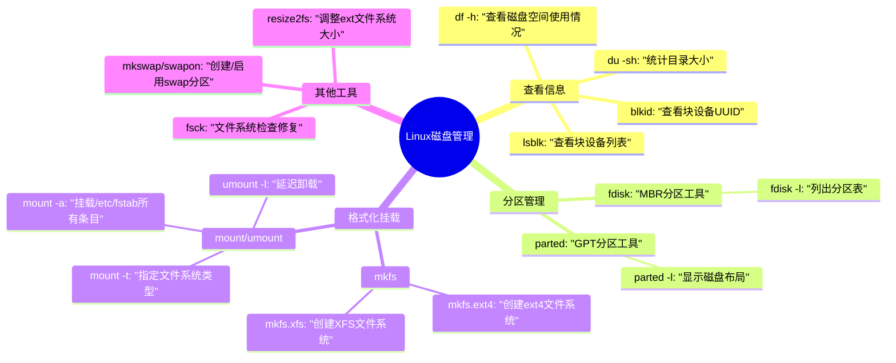

### 常用指令示例
```bash
# 查看磁盘空间（人类可读格式）
df -h

# 查看/home目录大小
du -sh /home

# 创建新分区（需要root权限）
sudo fdisk /dev/sdb

# 格式化分区为ext4
sudo mkfs.ext4 /dev/sdb1

# 永久挂载（需编辑/etc/fstab）
UUID=xxxx-xxxx /mnt/data ext4 defaults 0 2
```
