## 计算机发展的基础知识

# 学习linux的知识基础整理


计算机系统由**硬件系统**和**软件系统**两大部分构成，具体组成如下：  

1. **硬件系统**  
   - **主机**：核心部件包括  
     - **中央处理器（CPU）**：含运算器（执行算术/逻辑运算）和控制器（协调指令执行）；  
     - **内存储器**：分为只读存储器（ROM）和随机存储器（RAM）。  
   - **外部设备**：  
     - **外部存储器**：如硬盘、光盘等；  
     - **输入设备**：如键盘、鼠标、扫描仪；  
     - **输出设备**：如显示器、打印机；  
     - **其他设备**：如调制解调器。  

2. **软件系统**  
   - **系统软件**：基础支持软件，包括  
     - 操作系统（如Windows、Linux）；  
     - 程序语言处理系统（如编译器）；  
     - 数据库管理系统（如MySQL）；  
     - 服务程序（如调试工具）。  
   - **应用软件**：  
     - **通用软件**：如Office办公套件；  
     - **专用软件**：用户定制的程序（如银行管理系统）。  

### 

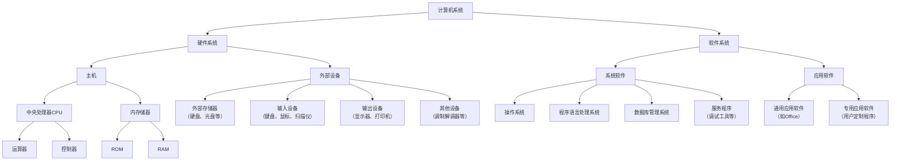


---

### **计算机硬件**  


#### **计算机（Computer）**  

俗称电脑，是一种能接收和存储信息，并按照存储在其内部的程序对海量数据进行自动、高速地处理，然后把处理结果输出的现代化智能电子设备。  

---

#### **发展历史**  

1. **第一代计算机（1946-1957）**  
   - **电子管时代**  
2. **第二代计算机（1958-1964）**  
   - **晶体管时代**  
3. **第三代计算机（1965-1970）**  
   - **集成电路时代**  
4. **第四代计算机（1971以后）**  
   - **大规模集成电路时代**  

---

#### **世界上第一台计算机ENIAC**  

- **诞生时间与地点**：1946年，美国宾州大学。  
- **研制背景**：美国奥伯丁武器试验场为满足弹道计算需求研制。  
- **硬件参数**：  
  - 电子管数量：17,468只  
  - 占地面积：170平方米  
  - 重量：30吨  
  - 功耗：174千瓦  
  - 成本：40多万美元  
- **运算能力**：每秒可进行5,000次加法或减法运算。  

---

以上内容完全基于图片中的文字信息整理，保留了原始排版逻辑和技术细节。

根据图片中的冯·诺依曼体系结构示意图，用 Mermaid 语言实现如下：

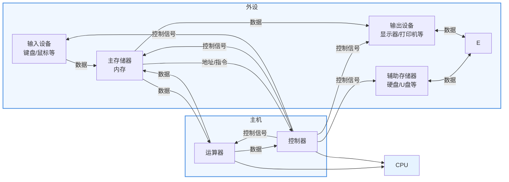

**实现说明**：

1. **分层结构**：通过 `subgraph` 划分「外设」和「主机」两大区域，用浅蓝色背景框表示
2. **数据流向**：
   - 红色箭头：数据流（输入设备→内存→运算器→内存→输出设备）
   - 蓝色箭头：控制信号（控制器→所有硬件组件）
   - 紫色箭头：地址/指令流（内存↔控制器）
3. **特殊标注**：
   - CPU 用虚线框表示运算器与控制器的逻辑聚合
   - 辅助存储器（硬盘）与主存储器（内存）之间用双向数据箭头

---

### **按规模划分**  

◆ **巨型计算机**：  

- 应用于国防尖端技术和现代科学计算  
- 运算速度可达每秒百万亿次以上  
- 例：我国首台千万亿次超级计算机“天河一号”  

◆ **大型计算机**：  

- 运算速度：每秒数千万条指令  
- 存储空间较大  
- 用途：科学计算、数据处理、网络服务器  
- 例：IBM z13 mainframe  

◆ **小型计算机**：  

- 特点：规模小、结构简单、环境要求低  
- 应用领域：工业自动控制、测量仪器、医疗设备数据采集  

◆ **微型计算机**：  

- 核心特征：采用微处理器芯片（CPU）  
- 优势：体积小巧轻便  
- 应用场景：商业服务、工厂自动化、办公信息处理  

---

**排版说明**：  

1. 标题“按规模划分”位于左上角，正文使用蓝色菱形符号（◆）作为项目标记  
2. 每个计算机类别均包含定义、性能参数、应用场景及具体案例  
3. 文字层级清晰，技术术语与案例结合，符合教育类PPT的信息传递逻辑  

如需进一步补充细节，可随时告知！


### 第三步：计算机中的进制说明  

进制是计算机中数据表示和运算的基础，主要涉及**二进制（Binary）**、**八进制（Octal）**、**十进制（Decimal）**和**十六进制（Hexadecimal）**。以下是核心要点：  

---

#### **1. 二进制（Binary）**  

- **定义**：基数为2，仅用 **0** 和 **1** 表示数值。  
- **计算机中的应用**：  
  - 所有数据（数字、字符、图像）最终以二进制形式存储和处理。  
  - 逻辑电路通过高/低电平直接对应 **1/0**，与硬件设计高度契合。  
- **示例**：  
  - 十进制数 `5` → 二进制 `101`  
  - 字符 `A` → ASCII码 `01000001`  

---

#### **2. 十六进制（Hexadecimal）**  

- **定义**：基数为16，符号为 **0-9** 和 **A-F**（A=10, B=11,…, F=15）。  
- **计算机中的应用**：  
  - 简化二进制表示（每4位二进制对应1位十六进制）。  
  - 内存地址、颜色编码（如 `#FF0000` 表示红色）常用十六进制。  
- **示例**：  
  - 二进制 `10101101` → 十六进制 `AD`  
  - 十进制数 `255` → 十六进制 `FF`  

---

#### **3. 进制转换规则**  

- **二进制 ↔ 十进制**：  
  - **二进制转十进制**：按权展开求和（如 `1010` = 1×2³ + 0×2² + 1×2¹ + 0×2⁰ = **10**）。  
  - **十进制转二进制**：除2取余法（如 `10` → `1010`）。  

- **二进制 ↔ 十六进制**：  
  - **二进制转十六进制**：每4位一组，不足补零（如 `1011 1100` → `BC`）。  
  - **十六进制转二进制**：每位展开为4位二进制（如 `F3` → `1111 0011`）。  

---

#### **4. 进制的实际意义**  

- **二进制**：硬件直接支持的底层语言，确保计算精确性和电路稳定性。  
- **十六进制**：调试工具（如内存查看器）、网络协议（如MAC地址）中广泛使用。  
- **十进制**：人类自然使用的进制，计算机通过转换与用户交互。  

---

**服务器**  

◆ **服务器定义**：  
\- 服务器（Server）是高性能计算机，基于网络操作系统控制  
\- 核心功能：为客户端提供共享资源（硬盘、打印机、通讯设备等）及各类服务  
\- 服务类型：  

    1. 集中计算服务  
    2. 信息发布服务  
    3. 数据管理服务  

◆ **按应用功能分类**：  

1. Web服务器  
2. 数据库服务器  
3. 文件服务器  
4. 中间件应用服务器  
5. 日志服务器  
6. 监控服务器  
7. 程序版本控制服务器  
8. 虚拟机服务器  
9. 邮件服务器  
10. 打印服务器  
11. 域控制服务器  
12. 多媒体服务器  
13. 通讯服务器  
14. ERP服务器  

◆ **按外形分类**：  

1. 塔式服务器  
2. 刀片式服务器  
3. 机架式服务器  

---

### **塔式（Tower）服务器**  

**马哥教育 | IT人的高薪职业学院**  

#### **核心特性**  

◆ **历史定位**：  

  - 早期的服务器形式  
  - 目前主流应用场景较少  

◆ **外观设计**：  

  - 外形与立式PC（台式机）高度相似  
  - 机箱整体为黑色（如右侧实物图所示）  

◆ **硬件优势**：  

  - 机箱内部空间大  
  - 主板扩展性强，提供较多扩展插槽  
  - 预留冗余扩展空间：  
    1. 硬盘位扩展  
    2. 电源冗余升级  

◆ **功能性设计**：  

  - 特别优化降噪处理  

---

### **机架式（Rack）服务器**   

#### **核心特性**  

◆ **标准化设计**：  

  - 严格遵循19英寸（48.26cm）宽度工业标准  
  - 高度单位采用 **U**（1U=1.75英寸=44.45毫米）  
  - 常见规格：1U/2U/3U/4U/5U/7U（右侧实物图展示1U/2U/4U机型）  

◆ **核心优势**：  

  - 机箱小型化设计  
  - 高密度部署：单个42U标准机柜可容纳多台服务器  
  - 便于集中管理维护  

◆ **市场地位**：  

  - 现阶段全球销量占比最高的服务器类型  

---

#### **硬件参数详解**  

1. **机架尺寸标准**：  
   - 宽度：19英寸（48.26cm）  
   - 高度：  
     - 1U = 44.45毫米  
     - 典型机柜高度：42U（约1.87米）  
2. **部署密度示例**：  
   - 42U机柜可部署：  
     - 42台1U服务器  
     - 21台2U服务器  
     - 10台4U服务器  


### 根据图片说明服务器的硬件组成  

以下为图中展示的服务器核心硬件组件及其功能解析（按图中标注顺序）：  

---

#### **1. 电源（Power Supply）**  

- **作用**：为服务器所有硬件提供稳定电力支持  
- **关键特性**：支持冗余设计（部分高端服务器配备双电源）  
- **图中标识**：通过红色箭头指向服务器后部黑色方盒状组件  

#### **2. CPU（中央处理器）**  

- **作用**：服务器的“大脑”，执行运算和逻辑控制  
- **部署方式**：主板上通常配置多颗CPU（如双路/四路服务器）  
- **图中标识**：红色箭头指向主板上的金属散热盖下方核心芯片  

#### **3. 网卡（Network Interface Card, NIC）**  

- **作用**：实现服务器与外部网络的物理连接  
- **扩展类型**：通过PCIe插槽或主板集成  
- **图中标识**：独立板卡形态，带RJ45或光纤接口  

#### **4. PCI（扩展插槽）**  

- **作用**：提供硬件扩展能力（如增加GPU、RAID卡等）  
- **版本演进**：PCIe 3.0/4.0/5.0，支持不同带宽需求  
- **图中标识**：主板上的长条形插槽，红色箭头标注位置  

#### **5. 内存（Memory/RAM）**  

- **作用**：临时存储CPU运算数据，提升处理速度  
- **部署模式**：多通道配置（如8根DDR4 DIMM插槽）  
- **图中标识**：主板上的直立式内存条，通常成组排列  

#### **6. 风扇（Cooling Fan）**  

- **作用**：强制散热，防止硬件过热  
- **设计特点**：支持热插拔、N+1冗余配置  
- **图中标识**：服务器前部或内部的多个涡轮扇叶组件  

#### **7. 硬盘（Storage Drive）**  

- **作用**：长期存储操作系统、应用和数据  
- **类型**：  
  - HDD（机械硬盘）：高容量，低成本  
  - SSD（固态硬盘）：高速读写，低延迟  
- **图中标识**：通过红色箭头指向服务器前部可插拔盘位  

---

### **硬件协作示意图解**  

```  
电源 → 供电 → [CPU+内存+PCI设备]  
                ↓  
风扇 ← 散热 ← 整机运行  
                ↓  
网卡 ↔ 数据传输 ↔ 外部网络  
硬盘 ↔ 数据存储/读取  
```

**注**：图中通过红色箭头明确标注硬件位置关系，白色背景与黑灰色服务器主体形成高对比度，便于快速识别组件布局。此结构为通用服务器硬件基准模型，实际设备可能因型号差异存在扩展组件（如GPU加速卡、RAID控制器等）。

### 根据图片信息完整还原表格内容如下：

---

**标题**：**服务器配置示例**  
**品牌标识**：右上角标注「马哥 IT 人的」  

| No.  | 指标项                  | 指标要求                                                     |
| ---- | ----------------------- | ------------------------------------------------------------ |
| 1    | Intel处理器             | 标配2个Intel 6核Xeon E7-4809v2处理器（1.9GHz，12M缓存，6.4GT/s） |
| 2    | 处理器的数量(配置/最多) | 2/2                                                          |
| 3    | 配置/内存(最多)         | 32GB (4x8GB) 1600MHz DDR3内存                                |
| 4    | 硬盘                    | IBM 1BT 7.2K 6Gbps SAS 2.5" SFF Slim-HS HDD                  |
| 5    | RAID卡                  | 标配M5210，支持RAID 0、1、10，可选缓存或Flash保护            |
| 6    | 网络                    | 4口千兆以太网卡                                              |
| 7    | 光驱                    | DVD-ROM                                                      |
| 8    | 整机保修时间            | 原厂3年7*24（4小时之内携带备件现场服务）                     |
| 9    | 电源                    | 标配2个900W热插拔电源（带2根PDU电源线）                      |
| 10   | 服务器的外观样式        | 4U机架式（含上机架导轨）                                     |


---

### **服务器硬件---CPU**  

#### **CPU定义**  

CPU是Central Processing Unit的缩写，即中央处理器。由控制器和运算器构成，是整个计算机系统中最重要的部分。  

---

#### **服务器CPU厂商及产品系列**  

1. **Intel**  
   - 主要产品线：  
     - **Xeon（至强）**  
       标语：超越未来  
     - **Itanium（安腾）**  

2. **AMD**  
   - 代表性产品：  
     - **Athlon MP**  
       标语：The future is fusion  

3. **IBM**  
   - 核心架构：  
     - **Power系列**  
       标识：IBM Power  


---

### **服务器分类**  

---

#### **按CPU体系架构分类**  

◆ **非x86服务器**  

- **处理器类型**：  
  - RISC（精简指令集）  
  - EPIC（并行指令代码）  
- **操作系统**：UNIX及其他专用系统  
- **代表CPU型号**：  
  - Compaq Alpha  
  - HP PA-RISC  
  - IBM PowerPC  
  - MIPS  
  - SUN Sparc  
  - Intel EPIC安腾处理器  
- **核心特点**：  
  - 价格昂贵  
  - 体系封闭  
  - 稳定性强  
  - 性能卓越  
- **应用场景**：金融、电信等大型企业核心系统  

◆ **x86服务器**（CISC架构服务器）  

- **架构定义**：基于PC体系结构，兼容x86指令集  
- **主流芯片**：Intel Xeon系列（E3/E5/E7）  
- **核心特点**：  
  - 价格亲民  
  - 兼容性好  
  - 稳定性较弱  
  - 安全性中等  
- **市场定位**：通用型PC服务器  

---


### 根据图片信息完整还原内容如下：


---

#### **主板定义**  

- **别名**：Mainboard（主板）、Systemboard（系统板）、Motherboard（母板）  
- **功能定位**：  
  - 计算机最基本且最重要的部件之一  
  - 安装于机箱内部，承载核心电路系统  

---

#### **物理结构与核心元件**  

1. **基础形态**：  
   - 矩形电路板（图中展示黄褐色、绿色两种典型工业设计）  

2. **关键组件**：  
   - **BIOS芯片**：负责硬件初始化及系统引导  
   - **I/O控制芯片**：管理输入输出设备通信  
   - **接口模块**：  
     - 键盘/面板控制开关接口  
     - 指示灯插件  
     - 直流电源供电接插件  
   - **扩展能力**：  
     - 多规格扩充插槽（如PCIe、内存插槽等）  

---

### **服务器硬件---内存**  

---

#### **内存核心知识**  

◆ **容量**：  

   - 定义：内存的存储容量  
   - 单位：MB 或 GB  

◆ **内存带宽**：  

   - 定义：内存与北桥芯片之间的数据传输速率  
   - 单通道内存控制器位数：64-bit  
   - 单位换算：8位二进制 = 1字节 → 64-bit = 8字节  

◆ **带宽计算公式**：  

   ```  
内存带宽 = 内存总线频率 × 数据总线位数 / 8  
   ```

   - **DDR内存特殊处理**：需额外乘以2（因双倍速率）  

---

#### **DDR内存带宽计算示例**  

1. **DDR2 667**：  

   - 运行频率：333MHz  

   - 带宽计算：  

     ```  
     333MHz × 2（DDR） × 64-bit / 8 = 5400MB/s = 5.4GB/s  
     ```

2. **DDR2 800**：  

   - 运行频率：400MHz  

   - 带宽计算：  

     ```  
     400MHz × 2（DDR） × 64-bit / 8 = 6400MB/s = 6.4GB/s  
     ```


---

### **图片内容完整还原**  

---

#### **左侧文字说明**  

##### 1. 在线备用内存技术  

- **功能**：  
  - 当主内存或扩展内存出现多数据位错误或物理故障时，服务器仍可持续运行  
  - 备用内存接管故障内存工作  
- **工作流程**：  
  1. 数据从主内存 **区域A** 拷贝至在线备用内存 **区域C**  
  2. 若 **区域A** 发生物理错误，备用内存 **区域C** 接管  
- **配置要求**：  
  - 备用内存区域容量 ≥ 主内存/扩展内存区域  

##### 2. 内存镜像  

- **功能**：  
  - 通过镜像拷贝为系统提供数据保护（应对多位错误或物理故障）  
- **工作原理**：  
  1. 数据同时写入两组镜像内存（如 DIMMs 1-4 与 DIMMs 5-8）  
  2. 若一组内存读取失败，自动从另一组镜像重试  
- **配置要求**：  
  - 镜像组内DIMM配置必须完全相同  
  - 示例配置：  
    - 镜像组1：DIMM 1A、2C、3A、4C  
    - 镜像组2：DIMM 5B、6D、7B、8D  

---

#### **右侧图示说明**  

##### 图示1：在线备用内存数据拷贝流程  

- **标注区域**：  
  - **A**：主内存（发生故障区域）  
  - **B**：扩展内存  
  - **C**：在线备用内存（接收数据备份）  
- **箭头方向**：数据从A→C单向传输  

##### 图示2：内存镜像DIMM配置  

- **物理布局**：  
  - 两组镜像DIMM呈对称排列  
  - 每组包含4个DIMM插槽（编号1-8）  
- **读写规则**：  
  - 数据从一组镜像读取（如组1），另一组保持同步拷贝  
  - 红色感叹号标识故障切换触发条件  


---

### **服务器硬件---硬盘**  

**马哥教育 | IT人的高薪职业学院**  

---

#### **硬盘基本参数**  

◆ **容量**  

  - 定义：硬盘最主要的参数  
  - 单位：  
    - **MB**（兆字节）  
    - **GB**（吉字节）  
    - **TB**（太字节）  

◆ **转速**  

  - 定义：硬盘盘片每分钟转动的圈数  
  - 单位：**rpm**（转/分钟）  
  - 当前主流转速：  
    - 10,000 rpm  
    - 15,000 rpm  

◆ **传输速率**  

  - 定义：硬盘读写数据的速度  
  - 技术名称：**Data Transfer Rate**  
  - 单位：**MB/s**（兆字节每秒）  

◆ **缓存**  

  - 核心作用：解决系统前后级读写速度不匹配问题  
  - 优化效果：显著提升硬盘读写速度  


---

### **服务器硬件---硬盘**  


---

#### **硬盘基本参数**  

◆ **容量**  

  - 定义：硬盘最主要的参数  
  - 单位：  
    - **MB**（兆字节）  
    - **GB**（吉字节）  
    - **TB**（太字节）  

◆ **转速**  

  - 定义：硬盘盘片每分钟转动的圈数  
  - 单位：**rpm**（转/分钟）  
  - 当前主流转速：  
    - 10,000 rpm  
    - 15,000 rpm  

◆ **传输速率**  

  - 定义：硬盘读写数据的速度  
  - 技术名称：**Data Transfer Rate**  
  - 单位：**MB/s**（兆字节每秒）  

◆ **缓存**  

  - 核心作用：解决系统前后级读写速度不匹配问题  
  - 优化效果：显著提升硬盘读写速度  


---

### **服务器硬件---网卡**  

**马哥教育 | IT人的高薪职业学院**  

---

#### **核心内容**  

1. **主板集成网卡**：  
   - **传输速率**：1Gbps（千兆网卡）  
   - **通用性**：所有服务器主板默认集成  

2. **高端专用网卡**：  
   - **应用场景**：高性能计算、数据中心互联等特殊需求  
   - **类型与速率**：  
     - **光纤网卡**：支持10Gbps、20Gbps（万兆网卡）  
     - **Infiniband网卡**：超低延迟，用于HPC集群  

---

#### **实物图展示**（下方五类网卡）：  

1. **无线增强网卡**：红色PCB板，带外置天线接口  
2. **光纤接口网卡**：黄色光纤线连接，SFP+模块接口  
3. **工业级金属网卡**：全金属外壳，多散热孔设计  
4. **双端口网卡**：双RJ45接口，支持链路聚合  
5. **迷你便携网卡**：U盘状外形，USB 3.0接口  


---

### **服务器硬件---热插拔技术**  


---

#### **热插拔技术定义**  

- **名称**：热交换技术（Hot Swap）  
- **核心功能**：允许在 **不关闭系统电源** 的状态下更换故障设备  
- **技术目标**：保障服务器 **7×24小时不间断运行**  

---

#### **常见热插拔设备**  

1. **硬盘**：支持在线更换故障磁盘  
2. **电源**：冗余电源模块支持热插拔替换  
3. **PCI设备**：部分扩展卡支持在线维护  
4. **风扇**：散热系统组件可不停机更换  

---

#### **热插拔与RAID协同工作**  

- **技术联动**：  
  1. RAID技术（Redundant Array of Independent Disks）提供磁盘冗余  
  2. 热插拔技术允许故障硬盘在线更换  
- **用户影响**：  
  - **数据恢复**：新硬盘插入后自动重建数据  
  - **服务连续性**：网络用户无感知，数据访问不受影响  

---


---

### **服务器硬件---机柜**  


---

#### **核心内容**  

1. **机柜功能**：  
   - 用于集中部署 **机架式服务器** 及网络设备  
   - 优化机房空间利用率，便于统一管理和维护  

2. **标准规格**：  
   - **高度单位**：1U = 44.45毫米  
   - **常见机柜尺寸**：  
     - 宽 600mm × 深 1000mm × 高 2000mm（对应42U容量）  
   - **容量定义**：42U机柜可容纳42台1U服务器或21台2U服务器  

---

#### **图片布局说明**  

1. **左侧机柜特写**：  
   - 单台42U黑色机柜，柜门完全打开  
   - 内部可见服务器导轨、电源线槽、散热孔等结构  

2. **右侧机房全景**：  
   - 多台机柜整齐排列，顶部集成线缆管理系统（蓝色网线、光纤走线）  
   - 机柜间预留散热通道，符合数据中心标准布局  

---


---

### **存储基础知识---存储网络**  

---

#### **网络连接存储（NAS）定义**  

- **全称**：Network Attached Storage  
- **核心功能**：  
  - 通过局域网（LAN）在多个文件服务器间实现互联  
  - 基于文件协议（如NFS、SMB/CIFS）实现跨平台文件共享  
- **部署模式**：  
  - 管理配置客户端可由任一客户端担任  
  - NAS服务器支持级联扩展  

---

#### **架构示意图解**  

```  
管理配置客户端  
   ↓  
[NAS存储服务器] ↔ [千兆交换机] ↔ [客户端1-4]  
```

1. **关键组件**：  
   - **NAS存储服务器**：核心存储节点，提供文件共享服务  
   - **千兆交换机**：基于千兆网络（1Gbps）连接所有设备  
   - **客户端**：用户终端（如PC、移动设备）通过局域网访问存储  

2. **连接方式**：  
   - 所有设备通过千兆以太网互联  
   - 管理配置权限可动态分配至任意客户端  

---

#### **核心优势与局限**  

◆ **优点**：  

  - 集中管理数据，提升资源利用率  
  - 释放带宽压力，优化网络性能  
  - 支持异构平台文件共享（如Windows/Linux互访）  

◆ **缺点**：  

  - 可靠性较低（依赖单点存储服务器）  
  - 适用场景限制：推荐用于局域网或中小型网络环境  

---

### **存储基础知识---存储网络**  

**马哥教育 | IT人的高薪职业学院**  

---

#### **存储区域网络（Storage Area Networks, SAN）**  

- **定义**：  
  利用高速光纤网络连接服务器与存储设备，基于 **SCSI、IP、ATM** 等协议实现存储共享。  

---

#### **SAN网络架构示意图**  

```  
[LAN]  
  ↓  
[数据库服务器] ↔ [光纤通道交换机] ↔ [磁盘阵列]  
  ↓  
[应用服务器]  
  ↓  
[通信服务器]  
  ↓  
[管理服务器]  
```

**核心组件**：  

1. **LAN**：局域网（连接前端用户访问）  
2. **服务器集群**：  
   - 数据库服务器  
   - 应用服务器  
   - 通信服务器  
   - 管理服务器  
3. **存储设备**：磁盘阵列（集中化存储资源池）  
4. **连接设备**：光纤通道交换机（支持多对多高速互联）  

---

#### **SAN核心特点**  

◆ **优势**：  

  - **高效能**：光纤信道提供高带宽（如16Gbps/32Gbps）  
  - **高稳定度**：服务器与存储装置各司其职，故障隔离性强  
  - **扩展灵活**：支持存储资源动态分配与扩容  

◆ **局限性**：  

  - **实施复杂**：需专用光纤网络及协议配置  
  - **管理成本高**：维护专业团队及硬件投入  


---

### **存储网络技术对比**  


---

#### **DAS / NAS / SAN 核心参数对比表**  

| 对比项       | DAS（直连存储）                                              | NAS（网络附加存储）                                    | SAN（存储区域网络）                               |
| ------------ | ------------------------------------------------------------ | ------------------------------------------------------ | ------------------------------------------------- |
| **传输类型** | SCSI、FC                                                     | IP                                                     | IP、FC、SAS                                       |
| **数据类型** | 数据块                                                       | 文件                                                   | 数据块                                            |
| **典型应用** | 任何场景                                                     | 文件服务器                                             | 数据库应用                                        |
| **优点**     | 1. 磁盘与服务器分离，便于统一管理<br>2. 广泛支持操作系统<br>3. 即插即用，安装简单 | 1. 不占用应用服务器资源<br>2. 数据集中，易管理         | 1. 高扩展性<br>2. 高可用性<br>3. 存储空间利用率高 |
| **缺点**     | 1. 连接距离短<br>2. 扩展性有限                               | 1. 不适合存储量大的块级应用<br>2. 数据备份占用网络带宽 | 1. 成本较高<br>2. 安装和升级复杂                  |

---


---

### **操作系统**  

**马哥教育 | IT人的高薪职业学院**  

---

#### **操作系统（OS）定义**  

- **全称**：Operating System（操作系统）  
- **定位**：通用目的的软件程序，核心功能包括：  
  - 硬件驱动  
  - 进程管理  
  - 内存管理  
  - 网络管理  
  - 安全管理  
  - 文件管理  

---

#### **分层架构示意图**  

```  
用户  
↓  
应用软件（如办公软件、浏览器等）  
↓  
操作系统（OS）  
↓  
硬件（CPU、内存、存储等）  
```

**层级说明**：  

1. **用户层**：直接与用户交互  
2. **应用软件层**：依赖操作系统接口运行  
3. **操作系统层**：管理硬件资源并提供服务  
4. **硬件层**：物理设备基础  

---

#### **操作系统分类**  

◆ **服务器操作系统**：  

  - **代表系统**：  
    - RHEL（Red Hat Enterprise Linux）  
    - CentOS  
    - Windows Server  
    - AIX（IBM UNIX）  

◆ **桌面操作系统**：  

  - **代表系统**：  
    - Windows 10/7  
    - Mac OS  
    - Fedora  

◆ **移动设备操作系统**：  

  - **代表系统**：  
    - Android  
    - iOS  
    - YunOS（阿里云OS）  


---

### **开发接口标准**  

---

#### **核心概念**  

◆ **ABI（Application Binary Interface）**  

- **全称**：应用程序二进制接口  
- **功能**：  
  - 定义应用程序与操作系统之间的底层接口  
  - 确保编译后的目标代码在兼容ABI的系统中 **无需修改即可运行**  

◆ **API（Application Programming Interface）**  

- **全称**：应用程序编程接口  
- **功能**：  
  - 定义代码与库之间的交互接口  
  - 同一份源代码可在支持该API的系统中 **重新编译运行**  

◆ **POSIX（Portable Operating System Interface）**  

- **全称**：可移植操作系统接口  
- **标准制定**：由IEEE定义的一系列操作系统API规范  
- **兼容性**：符合POSIX标准的程序可在其他POSIX系统编译执行  

---

#### **运行程序格式**  

| **操作系统** | **可执行文件格式** | **动态链接库**               | **静态库** |
| ------------ | ------------------ | ---------------------------- | ---------- |
| Windows      | .exe               | .dll（Dynamic Link Library） | .lib       |
| Linux        | ELF                | .so（Shared Object）         | .a         |

---


### 图片内容描述（中文）  

---

#### **1. 用户空间（User Space）**  

- **组成部分**：  
  - **用户应用程序**（User Land Application）  
  - **库函数**（Library Function）：包含以下接口：  
    - `fopen`、`fclose`、`fread`、`fwrite`、`fprintf` 等  

- **交互方式**：  
  应用程序通过 **调用（Invoke）** 系统调用（System Call），触发用户态到内核态的切换。  

---

#### **2. 内核空间（Kernel Space）**  

- **核心组件**：  
  - **系统调用**（System Call）：接口包括 `open`、`read`、`write`、`ioctl`、`close` 等  
  - **内核**（Kernel）：管理硬件资源的核心模块  
  - **设备驱动**（Device Driver）：直接控制硬件（Hardware）  

- **交互流程**：  
  1. 用户空间调用系统调用后，通过 **上下文切换（Context Exchange）** 进入内核空间  
  2. 内核将指令传递给设备驱动，最终操作硬件设备  

---

### **Mermaid 代码还原图示**  

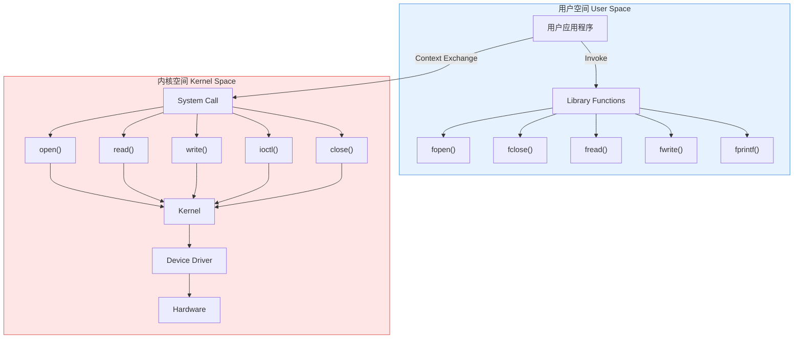

**图示说明**：  

1. **用户空间**（蓝色背景）：  
   - 应用程序通过调用库函数（如 `fopen`）触发系统调用  
2. **内核空间**（红色背景）：  
   - 系统调用接口将请求传递给内核，最终由设备驱动操作硬件  
3. **关键交互**：  
   - `Invoke`：用户态调用系统调用的动作  
   - `Context Exchange`：用户态与内核态的上下文切换过程  

**品牌标识**：图中右上角标注“马哥教育”标志（代码中未展示图形）。


```
用户应用程序 → 库函数（Library Function） → 系统调用（System Call） → 内核（Kernel）
```

### 具体流程详解（结合原图信息）

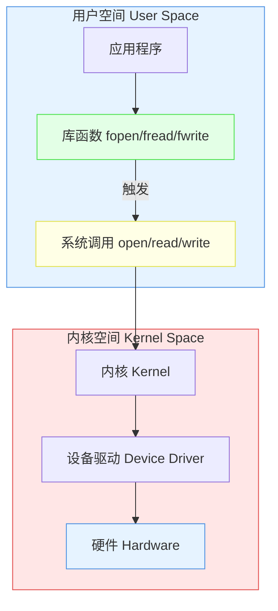

#### 关键环节说明：

1. **库函数层（绿色部分）**  
   - 提供标准化的编程接口（如 `fopen()`）
   - 封装复杂的系统调用细节  
   - 可能包含缓存、错误检查等附加功能  
   - *示例*：`fopen("file.txt", "r")` 会检查文件路径有效性

2. **系统调用层（黄色部分）**  
   - 触发用户态→内核态的 **上下文切换（Context Exchange）**  
   - 实际调用内核暴露的接口（如 `open()` 系统调用号为2）  
   - *示例*：`open()` 系统调用通过 `EAX` 寄存器传递参数

3. **内核层（红色部分）**  
   - 执行硬件资源分配和权限验证  
   - 调用设备驱动（如磁盘驱动）完成具体操作  
   - *示例*：内核验证用户是否有权读取 `/dev/sda1` 磁盘数据

---

### 为何需要分层调用？

1. **安全隔离**：用户程序不能直接操作硬件，必须通过内核权限检查  
2. **标准化接口**：不同硬件只需实现统一驱动，上层应用无需修改  
3. **性能优化**：库函数可合并多次系统调用（如 `fwrite()` 缓存数据后批量写入）  
4. **跨平台兼容**：同一库函数在不同系统调用不同底层实现（如Windows/Linux的 `fopen()` 实现不同）

---

### 典型案例解析

当用户程序执行 `fprintf(file, "Hello")` 时：

1. 库函数 `fprintf()` 将字符串写入缓冲区  
2. 缓冲区满后，调用 `write()` 系统调用  
3. 内核检查文件描述符有效性  
4. 磁盘驱动将数据写入指定扇区  
5. 控制权返回用户空间，程序继续执行

整个过程完全对应原图的分层结构与颜色标注，验证了您的理解准确性。


以下是根据您描述的架构图用 Mermaid 实现的代码，严格还原了原图的分层结构、模块关系和颜色标注：

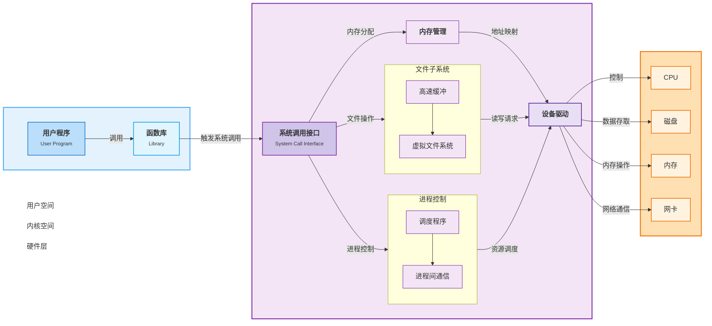

---

### **编程语言分类**  


---

#### **1. 低级语言**  

◆ **机器语言**：  

  - **表现形式**：由 `0` 和 `1` 组成的二进制代码  
  - **特点**：直接由计算机硬件执行，无编译/解释过程  

◆ **汇编语言**：  

  - **与硬件关系**：与机器语言 **一一对应**  
  - **应用场景**：  
    - 硬件相关的特有代码开发  
    - 设备驱动程序开发  

---

#### **2. 中级语言**  

◆ **代表语言**：**C语言**  

  - **核心应用**：  
    - 系统级应用程序开发（如操作系统内核）  
    - 硬件驱动程序开发  

---

#### **3. 高级语言**  

◆ **代表语言**：  

  - **通用型**：Java、Python、Go、PHP  
  - **专用型**：Objective-C（iOS开发）、C#（.NET生态）  

◆ **应用场景**：  

  - 应用级程序开发（如Web应用、移动应用、数据分析）  
  - 跨平台业务逻辑实现 

### **Unix与Linux发展简史**  


---

#### **1965年前后：Multics项目的诞生**  

- **发起机构**：贝尔实验室（Bell Labs）、麻省理工学院（MIT）、通用电气（GE）  
- **目标**：开发多用户分时操作系统，支持大型主机资源共享  
- **结局**：项目进展缓慢，1969年贝尔实验室退出  

---

#### **1969年：Unix雏形UNICS的诞生**  

- **核心人物**：**Ken Thompson**（贝尔实验室工程师）  
- **技术基础**：  
  - 使用**汇编语言**编写核心功能  
  - 开发**B语言**辅助系统工具  
- **名称含义**：UNICS（Uniplexed Information and Computing Service），后演变为Unix  

---

#### **1973年：Unix正式命名与C语言的革命**  

- **里程碑事件**：  
  - **Dennis Ritchie** 在贝尔实验室引入**C语言**  
  - Unix内核及工具全面用C语言重写，实现跨平台移植性  
- **技术意义**：C语言成为操作系统开发的基石  

---

#### **1977年：BSD的崛起**  

- **全称**：Berkeley Software Distribution（伯克利软件发行版）  
- **发源地**：美国加州大学伯克利分校  
- **贡献**：  
  - 为Unix添加TCP/IP网络协议栈  
  - 开发vi编辑器、BSD Socket等核心工具  

---

#### **1979年：System V架构与版权收紧**  

- **商业化转型**：  
  - AT&T发布**System V**架构，声明Unix版权  
  - 商业版本涌现：**HP-UX**（惠普）、**IBM AIX**  
- **限制措施**：  
  - 停止向学术机构提供源码  
  - 推动Unix走向闭源与商业化  

---

#### **1984年：Minix操作系统的诞生**  

- **开发者**：**Andrew S. Tanenbaum**（荷兰阿姆斯特丹自由大学教授）  
- **设计目的**：用于操作系统教学，源码仅1.2万行  
- **历史意义**：  
  - 为Linux的诞生提供技术启发  
  - 推动开源操作系统理念的传播  

---

### **技术演进脉络**  

```  
Multics（1965）  
  → UNICS（1969） → Unix（1973-C语言）  
    → BSD（1977）  
    → System V（1979-商业化）  
      → Minix（1984） → Linux（1991）  
```


---

### **GNU项目详解**  


---

#### **GNU核心定义**  

- **全称**：GNU is Not Unix（递归缩写）  
- **发起时间**：1984年  
- **创始人**：Richard Stallman（RMS）  
- **核心目标**：创建完全由自由软件组成的类Unix操作系统  

---

#### **关键组成部分**  

◆ **自由软件基金会（FSF）**：  

  - 法律实体保障GNU项目发展  
  - 维护自由软件法律框架  

◆ **GPL许可证**：  

  - **全称**：GNU通用公共许可证（GNU General Public License）  
  - **核心条款**：  
    1. 允许自由复制、分发、修改软件  
    2. 衍生作品必须保持GPL协议  
    3. 禁止添加额外使用限制  

◆ **LGPL许可证**：  

  - **全称**：GNU较宽松公共许可证（GNU Lesser General Public License）  
  - **与GPL区别**：允许非自由软件动态链接LGPL代码  

◆ **GNU操作系统**：  

  - **内核**：Hurd（Hird of Unix-Replacing Daemons）  
  - **生态组成**：GNU工具链 + Linux内核 → GNU/Linux系统  

---

#### **重要资源**  

| 类别       | 内容             | 链接                             |
| ---------- | ---------------- | -------------------------------- |
| 官方网站   | GNU项目主站      | http://www.gnu.org               |
| 操作系统   | GNU Hurd开发页面 | http://www.gnu.org/software/hurd |
| 许可证文档 | GPL/LGPL协议文本 | http://www.gnu.org/licenses      |

  ：

---

### **开源协议选择流程图**  

```

```

---

### **核心规则解析**  

| 问题层级              | 关键条件          | 对应协议                              | 协议特性             |
| --------------------- | ----------------- | ------------------------------------- | -------------------- |
| **第一决策**          | 能否闭源          | No→GPL/Mozilla<br>Yes→进入第二层      | 决定开源强制程度     |
| **第二决策**(Yes分支) | 是否需文档说明    | Yes→Apache/BSD<br>No→LGPL/MIT         | 平衡文档要求与商业化 |
| **末端决策**          | 版权声明/姓名促销 | MIT（允许宣传）<br>Apache（强制文档） | 品牌推广权限控制     |

---


---

### **Linux的哲学思想**  

Linux作为开源操作系统的典范，其设计哲学融合了 **Unix传统理念** 与 **开源社区精神**，核心思想可归纳为以下八大原则：

---

#### **1. 一切皆文件（Everything is a File）**  

- **核心概念**：  
  - 所有硬件设备（如磁盘、网卡）、进程、网络连接均抽象为 **文件对象**  
  - 用户通过统一接口（读写文件）与系统交互  
- **典型示例**：  
  - `/dev/sda` 表示磁盘设备  
  - `/proc/cpuinfo` 实时显示CPU信息  
  - 网络套接字通过文件描述符操作  

---

#### **2. 小即是美（Small is Beautiful）**  

- **设计原则**：  

  - 每个程序专注单一功能，保持代码简洁高效  
  - 工具间通过标准化接口（如管道 `|`）组合实现复杂任务  

- **经典案例**：  

  ```bash
  # 统计当前目录下".log"文件的行数  
  find . -name "*.log" | xargs wc -l  
  ```

  - `find` 负责搜索 → `xargs` 传递参数 → `wc` 统计行数  

---

#### **3. 透明性与可配置性（Transparency & Configurability）**  

- **开放特性**：  
  - 所有系统行为可通过 **配置文件**（如 `/etc/` 目录）调整  
  - 源码级开放允许深度定制（如内核模块编译）  
- **用户权力**：  
  - 自由选择组件（如选择systemd或runit作为初始化系统）  
  - 手动优化性能参数（如调整I/O调度算法）  

---

#### **4. 避免重复造轮子（Don't Reinvent the Wheel）**  

- **复用原则**：  
  - 优先使用现有工具，而非重写功能  
  - 通过脚本（Shell/Python）自动化流程  
- **工具链示例**：  
  - 文本处理：`grep`（搜索）、`sed`（替换）、`awk`（分析）  
  - 系统管理：`cron`（定时任务）、`rsync`（同步）  

---

#### **5. 沉默是金（Silence is Golden）**  

- **错误处理哲学**：  
  - 程序仅在必要时输出信息（成功时默认静默）  
  - 错误信息明确指向问题根源  
- **实践意义**：  
  - 减少干扰日志，提升脚本可维护性  
  - 通过返回码（`$?`）判断执行状态  

---

#### **6. 自由选择（Freedom of Choice）**  

- **开源精神延伸**：  
  - 用户可自由选择发行版（如Debian、Arch、RHEL）  
  - 支持多种桌面环境（GNOME、KDE、i3wm等）  
- **社区生态**：  
  - 许可协议（GPL）保障修改与分发权利  
  - 包管理系统（APT/YUM/DNF）实现软件自由安装  

---

#### **7. 快速失败（Fail Fast and Loudly）**  

- **开发哲学**：  
  - 尽早暴露问题，避免隐藏错误  
  - 严格校验输入参数与边界条件  
- **系统体现**：  
  - 内核遇到严重错误触发 **Kernel Panic**  
  - 服务崩溃时自动重启（如systemd的`Restart=on-failure`）  

---

#### **8. 社区驱动创新（Community Over Code）**  

- **协作模式**：  
  - **Linus法则**：*"Given enough eyeballs, all bugs are shallow."*（足够多人关注，所有缺陷都易发现）  
  - 全球开发者通过Git分布式协作  
- **成功案例**：  
  - 内核开发：数千贡献者每年提交超百万行代码  
  - 发行版生态：Ubuntu、Fedora等由社区与企业共同维护  

---

### **哲学实践的价值**  

这些思想共同塑造了Linux的 **高可靠性**（如服务器常年稳定运行）与 **极致灵活性**（从嵌入式设备到超算均可适配），并推动其在 **云计算**（Kubernetes）、**容器化**（Docker）、**边缘计算** 等现代技术中的核心地位。  

**马哥教育提示**：掌握Linux哲学不仅是技术学习，更是工程思维与协作文化的培养。


---

### **字符集与编码详解**  


---

#### **一、ASCII码（美国信息交换标准代码）**  

- **诞生背景**：1960年代由美国制定，解决早期计算机字符标准化问题  
- **核心特性**：  
  - **字符范围**：定义 **128个字符**（0-127），包括：  
    - 英文大小写字母（a-z/A-Z）  
    - 数字（0-9）  
    - 控制字符（换行、退格等）  
  - **编码规则**：  
    - 每个字符用 **7位二进制** 表示（如 `a=01100001`）  
    - 最高位统一补 **0**（扩展ASCII码使用最高位定义额外128字符）  

---

#### **二、Unicode（统一码）**  

- **设计目标**：覆盖全球所有语言符号，消除多语言环境乱码问题  

- **核心特性**：  

  - **唯一性**：为每个字符分配 **唯一编码值**（如 `马=U+9A6C`）  

  - **覆盖范围**：支持 **14万+符号**（包括文字、表情、数学符号等）  

  - **编码方案**：  

    | 方案       | 特点                       | 典型应用场景            |
    | ---------- | -------------------------- | ----------------------- |
    | **UTF-8**  | 变长（1-4字节），兼容ASCII | 网页、Linux系统、数据库 |
    | **UTF-16** | 变长（2或4字节）           | Java、Windows系统       |
    | **UTF-32** | 固定4字节，空间效率低      | 特殊领域字符处理        |

---

#### **三、编码示例（来自图片截图）**  

- **文本内容**：`abc`  

- **二进制编码**（兼容ASCII的UTF-8表示）：  

  ```  
  a → 01100001（十进制97）  
  b → 01100010（十进制98）  
  c → 01100011（十进制99）  
  ```

- **存储规则**：每个字符占 **1字节**（UTF-8下ASCII字符保持单字节）  

---

#### **四、关键概念对比**  

| 维度         | ASCII              | Unicode                    |
| ------------ | ------------------ | -------------------------- |
| **字符量级** | 128个              | 14万+（持续扩展）          |
| **编码空间** | 单字节（实际7位）  | 多字节（UTF-8/16/32方案）  |
| **兼容性**   | 仅英语基础字符     | 全球语言+符号+扩展字符     |
| **应用场景** | 早期系统、简单文本 | 现代多语言环境、互联网标准 |

---


---

### **Linux中Tab键的核心作用详解**  

 

---

#### **一、命令补全（Command Completion）**  

1. **内部命令补全**：  

   - **定义**：Shell内置的命令（如 `cd`, `echo`, `exit`）  
   - **补全规则**：  
     - 输入部分命令后按 `Tab`，自动补全完整命令名  
     - 示例：输入 `ec` + `Tab` → 补全为 `echo`  

2. **外部命令补全**：  

   - **依赖路径**：由 `PATH` 环境变量定义的搜索路径（如 `/usr/bin`, `/bin`）  

   - **补全逻辑**：  

     - **唯一匹配**：输入前缀唯一时直接补全  

       ```bash
       $ gre + Tab → 自动补全为 grep
       ```

     - **多重匹配**：输入前缀对应多个命令时，第二次按 `Tab` 列出所有候选  

       ```bash
       $ py + Tab Tab  
       py3clean   py3compile  python3    python3.8  
       ```

---

#### **二、路径补全（Path Completion）**  

1. **补全规则**：  

   - 将用户输入的字符串视为 **路径前缀**，自动搜索上级目录中的匹配项  

   - **唯一匹配**：自动补全完整路径  

     ```bash
     $ /et/ssh/sshd + Tab → 补全为 /etc/ssh/sshd_config  
     ```

   - **多重匹配**：第二次按 `Tab` 显示所有候选文件/目录  

     ```bash
     $ /usr/bi + Tab Tab  
     bin/  bin2/  
     ```

2. **特殊场景**：  

   - 支持相对路径补全（如 `./scri` → `./script.sh`）  
   - 支持通配符模糊匹配（如 `*` 或 `?` 结合Tab使用）  

---

#### **三、操作示例与技巧**  

| 场景             | 操作步骤         | 结果                         |
| ---------------- | ---------------- | ---------------------------- |
| 补全唯一命令     | `sys + Tab`      | `systemctl`                  |
| 列出多个候选命令 | `net + Tab Tab`  | 显示 `netcat` `netstat` 等   |
| 补全绝对路径     | `/var/lo + Tab`  | `/var/log/`                  |
| 补全隐藏文件     | `ls .bash + Tab` | `.bashrc` `.bash_profile` 等 |

---

### **核心价值总结**  

- **效率提升**：减少手动输入错误，加速命令行操作  
- **智能检索**：基于上下文（命令/路径）动态匹配候选  
- **学习辅助**：通过补全列表快速了解可用命令及文件结构  

**注意**：若Tab补全失效，可能是环境变量 `PATH` 配置异常或权限问题导致。建议检查命令是否存在及路径权限设置。


---

### **命令行历史操作指南**  


---

#### **重复前一个命令的4种方法**  

1. **方向键回溯**：  
   - 按 `↑` 键调出上一条命令 → 回车执行  
2. **感叹号简写**：  
   - 输入 `!!` → 回车执行  
3. **历史序号调用**：  
   - 输入 `!-1` → 回车执行（`-1`表示前一条命令）  
4. **快捷键操作**：  
   - 按 `Ctrl+P` → 回车执行  

---

#### **其他历史操作指令**  

| 操作指令 | 功能说明                                                     |
| -------- | ------------------------------------------------------------ |
| `!:0`    | 执行前一条命令，但 **去除参数**（保留命令主体）              |
| `Ctrl+N` | 显示历史中的 **下一条命令**（不自动执行）                    |
| `Ctrl+J` | **执行**当前已显示的历史命令                                 |
| `!n`     | 执行 `history` 列表中的 **指定序号命令**（如 `!203` 执行第203条命令） |
| `!-n`    | 执行历史中 **倒数第n条命令**（如 `!-3` 执行倒数第3条）       |

---

#### **操作示例**  

```bash
# 示例1：重复执行带参数的命令  
$ ls /var/log  
$ !!          → 再次执行 ls /var/log  

# 示例2：仅保留命令主体  
$ vim /etc/nginx/nginx.conf  
$ !:0         → 执行 vim（无参数）  

# 示例3：调用历史中倒数第2条命令  
$ !-2         → 执行 history 中倒数第2条记录  
```

---


---

### **Bash 快捷键**  

**马哥教育 | IT人的高薪职业学院**  

---

#### **快捷键列表**  

◆ **Ctrl + L**  

  - **功能**：清屏，相当于执行 `clear` 命令  
  - **效果**：屏幕内容向上滚动，保留命令历史  

◆ **Ctrl + O**  

  - **功能**：执行当前命令，并重新显示本命令  
  - **应用场景**：重复执行复杂命令时快速复用  

◆ **Ctrl + S**  

  - **功能**：阻止屏幕输出（锁定终端输出）  
  - **注意**：锁定后需按 `Ctrl + Q` 恢复  

◆ **Ctrl + Q**  

  - **功能**：允许屏幕输出（解除 `Ctrl + S` 的锁定）  

◆ **Ctrl + C**  

  - **功能**：终止当前正在运行的命令  
  - **典型用途**：强制结束卡死或长时间未响应的进程  

◆ **Ctrl + Z**  

  - **功能**：挂起当前命令（暂停并放入后台）  
  - **后续操作**：  
    - `fg`：恢复前台执行  
    - `bg`：后台继续运行  


---

### **操作示例**  

```bash
# 示例1：清屏后继续操作  
$ 输入长命令... → 按 Ctrl + L 清屏 → 屏幕顶部显示新命令行  

# 示例2：挂起进程并管理  
$ python long_script.py → 按 Ctrl + Z 挂起  
$ bg  # 让脚本在后台继续运行  
$ fg  # 重新调回前台执行  
```


## 软件的开发周期说明


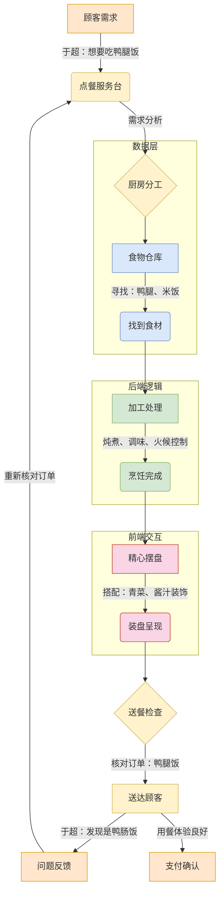

**流程说明：**

1. **需求阶段（黄色区块）**  

- 顾客需求："于超：想要吃鸭腿饭" → 对应产品需求文档(PRD)  
- 服务台分析：拆解为"主材获取+烹饪要求" → 需求评审会议

2. **数据层（蓝色区块）**  

- 仓库寻材：需要精确匹配"鸭腿、米饭" → 数据库查询操作  
- 库存校验：检查食材是否变质/过期 → 数据一致性校验

3. **后端逻辑（绿色区块）**  

- 加工处理：涉及火候算法、调味公式 → 业务逻辑实现  
- 烹饪完成：生成可供呈现的成品 → API接口封装

4. **前端交互（红色区块）**  

- 摆盘设计：考虑色彩搭配和餐具布局 → UI/UX设计  
- 装盘呈现：使用白瓷盘+绿叶装饰 → 前端页面渲染

5. **质量验证（黄色区块）**  

- 送餐检查：核对订单编号与菜品 → 冒烟测试  
- 异常反馈："鸭肠饭"错误 → 缺陷跟踪系统

**关键映射关系：**

- 厨房分工 → 微服务架构设计
- 食材库存 → 数据库分库分表
- 烹饪过程 → 业务中台处理
- 摆盘装饰 → 前端组件开发
- 送餐路线 → CDN内容分发

该流程图特别强调了软件工程中的两个关键机制：

1. **正向流程控制**：通过标准作业流程(SOP)确保服务可靠性
2. **逆向反馈机制**：采用PDCA循环（戴明环）持续改进产品质量

注：实际开发中应特别注意"鸭腿→鸭肠"的异常流程，这映射着生产环境中常见的数据一致性问题，建议采用分布式事务解决方案（如Seata）来避免此类错误。

### 运维在软件开发周期中的角色
### 什么是运维？  

**运维（Operations，简称Ops）**是软件系统全生命周期中的关键环节，聚焦于保障系统的稳定、安全、高效运行。运维团队负责从代码部署到生产环境后的所有工作，包括监控、维护、优化、故障排除以及基础设施管理，确保最终用户获得流畅的体验。在DevOps实践中，运维与开发团队深度协作，通过自动化工具实现持续交付和持续改进。

---

### 运维的核心职责  

1. **部署与发布管理**  
   - 将开发完成的代码安全、高效地部署到生产环境。  
   - 使用自动化工具（如Ansible、Kubernetes）实现可重复的发布流程。  

2. **系统监控与告警**  
   - 实时监控服务器、网络、应用性能（如CPU、内存、响应时间）。  
   - 配置告警机制（如Prometheus + Grafana），及时发现并响应异常。  

3. **故障排查与恢复**  
   - 快速定位生产环境问题（如日志分析工具ELK Stack）。  
   - 实施灾难恢复策略（如备份、容灾集群）。  

4. **安全与合规**  
   - 管理防火墙、权限控制（如RBAC）。  
   - 定期漏洞扫描与合规审计（如OWASP工具）。  

5. **资源优化与成本控制**  
   - 动态扩缩容（如云服务的Auto Scaling）。  
   - 优化资源利用率，降低基础设施成本。  

---

### 运维在DevOps中的角色  

在DevOps文化中，运维不再是独立的“守门人”，而是与开发团队共同承担交付责任：  

- **协作**：通过CI/CD流水线（如Jenkins、GitLab CI）实现开发与运维的无缝衔接。  
- **自动化**：将手动操作（如服务器配置、测试部署）转化为代码（Infrastructure as Code, IaC）。  
- **持续反馈**：利用监控数据驱动开发优化（如A/B测试结果指导功能迭代）。  

---

#### Mermaid 图例：运维在DevOps中的工作流程  

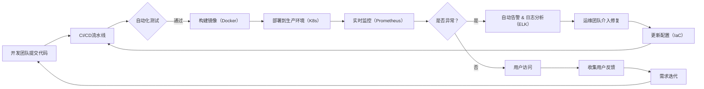

#### 流程说明  

1. **开发与运维协作**：代码通过CI/CD流水线自动化测试、构建和部署。  
2. **监控与自愈**：系统实时监控异常并触发告警，部分问题可自动修复（如重启服务）。  
3. **反馈闭环**：用户行为数据和运维日志驱动后续开发优化，形成持续改进循环。  

---

#### 运维的核心工具与技术  

| 领域          | 工具示例                       | 作用                            |
| ------------- | ------------------------------ | ------------------------------- |
| 部署自动化    | Kubernetes, Terraform          | 容器编排与基础设施即代码（IaC） |
| 监控与日志    | Prometheus, Grafana, ELK Stack | 性能监控与日志分析              |
| 持续集成/部署 | Jenkins, GitLab CI, ArgoCD     | 自动化构建、测试与发布          |
| 安全合规      | HashiCorp Vault, OpenVAS       | 密钥管理与漏洞扫描              |

---

#### 总结  

运维的核心目标是**保障系统稳定性**，而DevOps通过打破部门墙和自动化工具，让运维从被动的“救火”转向主动的“预防”。现代运维需具备代码能力（如编写IaC）、云原生技术理解（如微服务治理），并深度参与产品迭代，成为业务可靠性的基石。

# DevOps 详解（结合 Mermaid 图例）

我热爱编程！下面我将通过 Mermaid 图例和详细说明，全面解析 DevOps 的概念和工作原理。

## 一、DevOps 定义图解

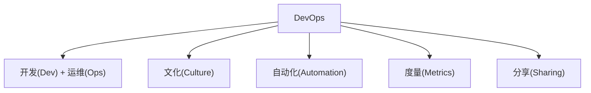

**说明**：

- DevOps 是 Development 和 Operations 的组合词
- 核心包含四大要素：文化、自动化、度量和分享
- 打破传统开发与运维之间的壁垒，实现协同工作

## 二、DevOps 工作流程

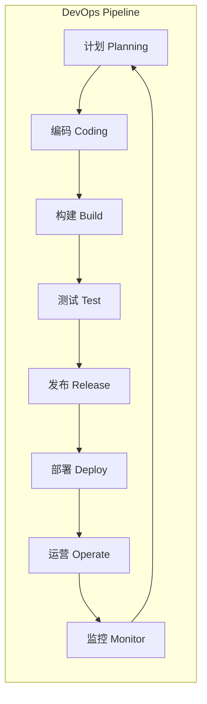

**关键阶段说明**：

1. **持续开发**：使用 Git 等工具进行版本控制
2. **持续集成**：自动构建和单元测试（Jenkins）
3. **持续测试**：自动化功能/性能测试（Selenium）
4. **持续部署**：自动化发布到生产环境（Kubernetes）
5. **持续监控**：实时系统监控（Prometheus+Grafana）

## 三、DevOps 工具链

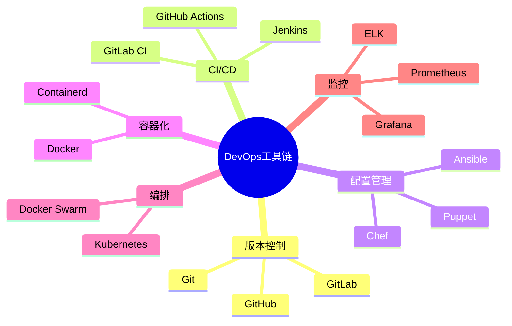

## 五、DevOps 生命周期（7C）

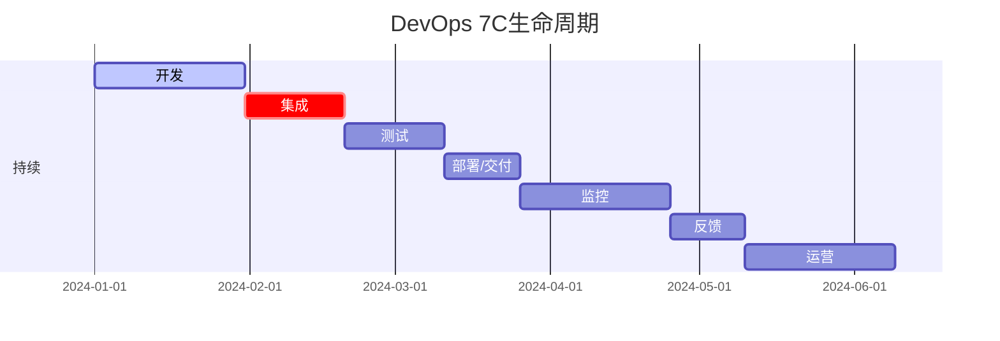

## 六、DevOps 技术栈示例


## 七、DevOps 核心价值

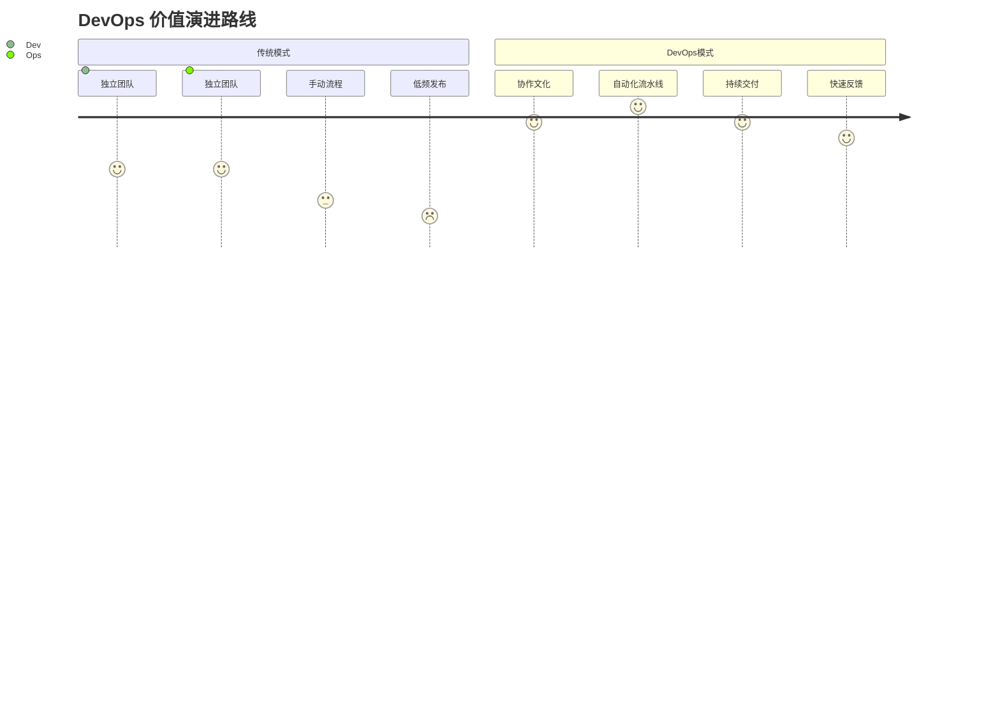

## 关键总结

1. **文化转变**：从"扔过墙"模式到协同合作
2. **自动化一切**：测试、部署、监控等全流程自动化
3. **持续改进**：通过度量和反馈不断优化流程
4. **工具链整合**：形成完整的工具生态系统
5. **快速交付**：从月发布到日/小时级发布

实际案例：Amazon 通过 DevOps 实现**每天数百万次部署**，Netflix 使用 Chaos Monkey 实现系统韧性。

