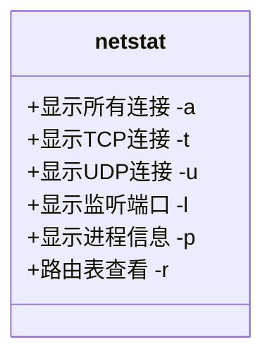
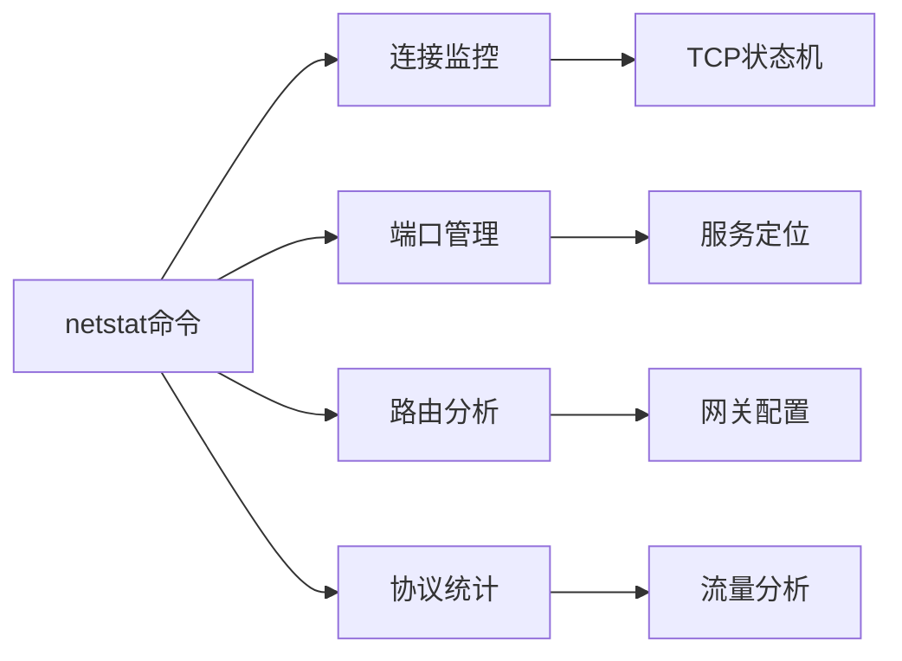
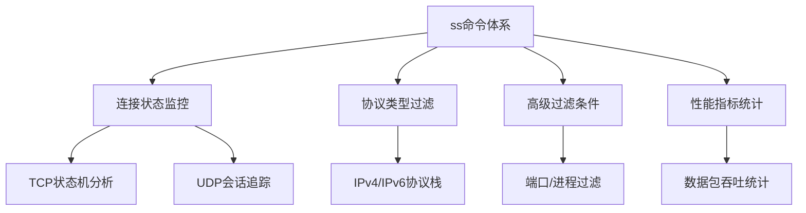

# Linux网络诊断工具全景图

## 🌐 网络工具分类架构


## 一、连接诊断工具

### 1. 连通性测试 (ping)


**实用参数：**

```bash
$ ping -c 4 www.google.com  # 发送4次探测包
$ ping -i 0.5 example.com  # 0.5秒间隔
```

### 2. 路径追踪 (traceroute)


**对比工具：**

| 工具       | 需要root | 协议     | 特点         |
| ---------- | -------- | -------- | ------------ |
| traceroute | 是       | UDP/ICMP | 传统标准     |
| tracepath  | 否       | ICMP     | 简单易用     |
| mtr        | 是       | 混合     | 实时动态监控 |


**常用命令示例：**

```bash
# 查询详细DNS记录
$ dig +trace example.com

# 检查邮件服务器配置
$ dig MX example.com

# 快速解析结果
$ host -t A example.com
```

## 三、网络状态监控

### netstat核心功能图解



**现代替代方案：**

```bash
$ ss -tulpn  # 更快速的socket统计
$ iftop -i eth0  # 实时流量监控
$ nethogs  # 进程级带宽监控
```

## 四、网络配置管理

### IP命令套件功能树


**路由管理示例：**

```bash
# 显示路由表（等效route -n）
$ ip route show

# 添加默认网关
$ sudo ip route add default via 192.168.1.1

# 临时禁用网卡
$ sudo ip link set eth0 down
```

## 五、综合诊断案例

### 网站无法访问排查流程


**组合工具使用：**

```bash
# 1. 检查DNS解析
$ dig +short example.com

# 2. 测试TCP端口连通性
$ nc -zv example.com 443

# 3. 查看本地防火墙规则
$ sudo iptables -L -n -v

# 4. 监控实时流量
$ sudo tcpdump -i eth0 host example.com
```

---

# Linux `ping` 命令完全指南

## 📖 核心功能

- **网络诊断**：检测主机可达性与网络延迟
- **协议基础**：使用ICMP协议进行通信
- **关键指标**：
  - 往返时间（RTT）
  - 数据包丢失率
  - 网络路径稳定性

## 🔧 命令参数速查表

| 参数 | 功能描述                   | 示例                         |
| ---- | -------------------------- | ---------------------------- |
| `-c` | 指定发送次数               | `ping -c 5 google.com`       |
| `-i` | 设置发送间隔（秒）         | `ping -i 0.5 example.com`    |
| `-s` | 定义数据包大小（字节）     | `ping -s 1024 localhost`     |
| `-w` | 设置超时时间（秒）         | `ping -w 3 8.8.8.8`          |
| `-q` | 只显示统计摘要             | `ping -q -c 10 github.com`   |
| `-f` | 洪水攻击（需root权限）     | `sudo ping -f target.com`    |
| `-T` | 添加时间戳                 | `ping -T tsonly 192.168.1.1` |
| `-M` | 路径MTU发现模式            | `ping -M do example.org`     |
| `-t` | 设置TTL值                  | `ping -t 64 cloudflare.com`  |
| `-W` | 等待响应时间（秒）         | `ping -W 2 api.server.com`   |
| `-p` | 填充数据包内容（十六进制） | `ping -p ff device.local`    |

## 🎯 实用场景示例

### 基础连通性测试

```bash
$ ping -c 4 google.com
PING google.com (142.250.66.238) 56(84) bytes of data.
64 bytes from fra24s01-in-f14.1e100.net (142.250.66.238): icmp_seq=1 ttl=117 time=12.3 ms
...
--- google.com ping statistics ---
4 packets transmitted, 4 received, 0% packet loss, time 3005ms
rtt min/avg/max/mdev = 12.273/13.421/14.893/1.052 ms
```

### 网络性能压力测试

```bash
# 快速连续发送大包（需root权限）
$ sudo ping -f -s 1024 192.168.1.1
PING 192.168.1.1 (192.168.1.1) 1024(1052) bytes of data.
................................................................................................................................................................................................................................................................................................................................................................................................................................................................
--- 192.168.1.1 ping statistics ---
689 packets transmitted, 689 received, 0% packet loss, time 2299ms
rtt min/avg/max/mdev = 0.598/1.084/2.347/0.217 ms
```

### 路径MTU发现

```bash
$ ping -M do -s 1500 example.com
PING example.com (93.184.216.34) 1500(1528) bytes of data.
ping: local error: Message too long, mtu=1500
```

## 🛠️ 高级诊断技巧

### 网络延迟分析

```bash
# 持续监控延迟（每2秒一次）
$ while true; do ping -c 1 -W 1 8.8.8.8 | grep 'time='; sleep 2; done
64 bytes from 8.8.8.8: icmp_seq=1 ttl=117 time=15.3 ms
64 bytes from 8.8.8.8: icmp_seq=2 ttl=117 time=18.2 ms
```

### 带时间戳记录

```bash
# 生成带时间戳的ping日志
$ ping -T tsonly -c 60 example.com | ts '[%Y-%m-%d %H:%M:%S]' > ping.log
```

### 网络拓扑探测

```bash
# TTL递增探测（实现traceroute效果）
$ for ttl in {1..30}; do ping -t $ttl -c 1 -W 1 example.com | grep "Time to live"; done
```

## 🚨 常见问题处理

### 目标不可达

```bash
$ ping unknown.host
ping: unknown.host: Name or service not known

➔ 检查DNS配置：`nslookup unknown.host`
```

### 100%丢包

```bash
$ ping -c 4 192.168.99.99
PING 192.168.99.99 (192.168.99.99) 56(84) bytes of data.
--- 192.168.99.99 ping statistics ---
4 packets transmitted, 0 received, 100% packet loss, time 3060ms

➔ 检查：1. 目标主机状态 2. 防火墙设置 3. 路由配置
```

### 高延迟抖动

```bash
rtt min/avg/max/mdev = 12.273/153.421/1204.893/285.052 ms

➔ 可能原因：
1. 网络拥塞
2. 硬件故障
3. ISP线路问题
```

## ⚙️ 生产环境建议

### 自动化监控脚本

```bash
#!/bin/bash
TARGET="db-server.local"
LOG_FILE="/var/log/ping_monitor.log"

while :; do
    TIMESTAMP=$(date +%s)
    STATS=$(ping -c 10 -i 0.2 -q $TARGET | awk '/packet loss/{pl=$6} /rtt/{print pl,$8}')
    echo "$TIMESTAMP $STATS" >> $LOG_FILE
    sleep 300
done
```

### 安全注意事项

```bash
# 禁止PING的防御措施（使用iptables）：
$ sudo iptables -A INPUT -p icmp --icmp-type echo-request -j DROP

# 临时启用PING检测：
$ sudo iptables -I INPUT -p icmp --icmp-type echo-request -j ACCEPT
```

## 📊 结果解读指南

| 指标           | 正常范围   | 异常表现    | 可能原因          |
| -------------- | ---------- | ----------- | ----------------- |
| 延迟（RTT）    | <100ms     | >500ms      | 网络拥塞/物理距离 |
| 抖动（jitter） | <50ms      | >100ms      | 线路不稳定        |
| 丢包率         | 0%-1%      | >5%         | 硬件故障/网络中断 |
| TTL值          | 通常54-128 | 持续递减至0 | 路由环路          |


# Linux `nslookup` 命令完全指南：DNS 查询与故障排查  

## 一、核心功能解析  
`nslookup` 是 Linux 系统中用于 **DNS 查询** 的交互式工具，可快速获取域名解析信息，是排查 DNS 配置、验证域名解析结果的核心工具。支持正向解析（域名→IP）和反向解析（IP→域名），并能查询多种 DNS 记录类型。

---

## 二、命令语法与模式  
```bash  
nslookup [选项] [域名/IP] [DNS服务器]  
```  
**两种运行模式**：  
1. **交互模式**：直接输入 `nslookup` 进入，支持连续查询  
2. **非交互模式**：一次性执行查询命令  

---

## 三、关键选项速查表  

| 选项             | 功能描述                          |  
|------------------|-----------------------------------|  
| `-type=A`        | 查询 A 记录（IPv4 地址）          |  
| `-type=AAAA`     | 查询 AAAA 记录（IPv6 地址）        |  
| `-type=MX`       | 查询邮件交换记录                   |  
| `-type=NS`       | 查询域名服务器记录                 |  
| `-type=SOA`      | 查询域权威起始记录                 |  
| `-type=TXT`      | 查询文本记录（如 SPF/DKIM）        |  
| `-type=PTR`      | 反向解析（IP→域名）                |  
| `-debug`         | 显示调试信息                      |  
| `-port=53`       | 指定 DNS 服务器端口               |  

---

## 四、实战案例演示  

### 1. 基础域名解析  
```bash  
nslookup google.com  
```  
**输出示例**：  
```  
Server:		8.8.8.8  
Address:	8.8.8.8#53  

Non-authoritative answer:  
Name:	google.com  
Address: 142.250.194.142  
```  

### 2. 查询 MX 记录（邮件服务器）  
```bash  
nslookup -type=MX gmail.com  
```  
**输出片段**：  
```  
gmail.com	mail exchanger = 5 gmail-smtp-in.l.google.com.  
```  

### 3. 反向解析 IP 地址  
```bash  
nslookup 142.250.194.142  
```  
**输出结果**：  
```  
142.194.250.142.in-addr.arpa	name = fra24s01-in-f14.1e100.net.  
```  

### 4. 查询域名服务器（NS 记录）  
```bash  
nslookup -type=NS wikipedia.org  
```  
**输出示例**：  
```  
wikipedia.org	nameserver = ns0.wikimedia.org.  
wikipedia.org	nameserver = ns1.wikimedia.org.  
```  

### 5. 获取域权威信息（SOA 记录）  
```bash  
nslookup -type=SOA amazon.com  
```  
**输出关键字段**：  
```  
primary name server = pdns1.ultradns.net  
serial = 2024011501  
refresh = 43200 (12 hours)  
retry = 7200 (2 hours)  
expire = 1209600 (14 days)  
```  

### 6. 查询 TXT 记录（验证域名所有权）  
```bash  
nslookup -type=TXT github.com  
```  
**输出示例**：  
```  
github.com	text = "v=spf1 ip4:192.30.252.0/22 include:_spf.google.com ~all"  
```  

---

## 五、高级使用技巧  

### 1. 指定 DNS 服务器查询  
```bash  
nslookup facebook.com 1.1.1.1  # 使用 Cloudflare DNS  
```  

### 2. 批量查询域名解析  
```bash  
echo -e "google.com\naws.com" | xargs -n1 nslookup  
```  

### 3. 检查 DNS 传播状态  
```bash  
nslookup mydomain.com 8.8.8.8   # Google DNS  
nslookup mydomain.com 1.1.1.1   # Cloudflare DNS  
```  

---

## 六、常见问题排查指南  

### 1. 域名解析失败  
```bash  
nslookup example.com  
# 若返回 "** server can't find example.com: NXDOMAIN"  
# 可能原因：域名未注册或 DNS 未生效  
```  

### 2. 邮件服务器故障  
```bash  
nslookup -type=MX example.com  
# 验证 MX 记录是否存在且优先级正确  
```  

### 3. CDN 配置验证  
```bash  
nslookup assets.example.com  
# 检查是否解析到 CDN 提供的 CNAME 记录  
```  

---

## 七、`nslookup` vs `dig` 对比  

| **特性**         | `nslookup`               | `dig`                    |  
|------------------|--------------------------|--------------------------|  
| 输出格式          | 简洁易读                  | 详细（适合脚本处理）       |  
| 调试信息          | 需 `-debug` 选项          | 默认显示查询详情           |  
| 多记录类型查询     | 支持                     | 支持                     |  
| 反向解析          | 直接支持                  | 需指定 `-x` 选项          |  

---

## 八、注意事项  
1. **DNS 缓存影响**：本地 DNS 缓存可能导致查询结果延迟更新，使用 `systemd-resolve --flush-caches` 清缓存  
2. **防火墙限制**：确保 UDP/53 和 TCP/53 端口开放  
3. **TTL 值**：查询结果中的 TTL（Time To Live）表示缓存有效期  

---

通过掌握 `nslookup` 命令，您将能够：  
1. 快速诊断域名解析问题  
2. 验证 DNS 记录配置准确性  
3. 排查邮件服务器故障  
4. 监控 DNS 生效状态  

> **专业提示**：结合 `whois` 命令可获取域名注册信息，全面分析域名状态。  
> ```bash  
> whois example.com | grep "Expiration Date"  
> ```


# Linux `dig` 命令完全指南：DNS 查询与深度解析  

## 一、核心功能解析  
`dig`（Domain Information Groper）是 Linux 系统中 **专业级 DNS 诊断工具**，提供比 `nslookup` 更详细的 DNS 记录查询能力。支持全类型 DNS 记录查询、反向解析、批量操作等高级功能，是网络管理员排查 DNS 问题的首选工具。

---

## 二、安装方法  

### 1. 主流发行版安装命令  
| 系统类型                | 安装命令                    |  
|-------------------------|---------------------------|  
| Debian/Ubuntu/Mint      | `sudo apt-get install dnsutils` |  
| RHEL/CentOS/Fedora      | `sudo yum install bind-utils`   |  

### 2. 验证安装  
```bash  
dig -v  # 输出示例：dig 9.16.1  
```  

---

## 三、命令语法与常用选项  

### 1. 基础语法格式  
```bash  
dig [@DNS服务器] [域名/IP] [记录类型] [选项]  
```  

### 2. 核心选项速查表  

| 选项               | 功能描述                          |  
|--------------------|-----------------------------------|  
| `+short`           | 简化输出（仅显示关键结果）          |  
| `+nocomments`      | 去除注释信息                      |  
| `+noall`           | 关闭所有默认输出                  |  
| `+answer`          | 仅显示答案部分                    |  
| `+trace`           | 跟踪 DNS 解析路径（逐级查询）      |  
| `+stats`           | 显示查询统计信息                  |  
| `-x IP地址`        | 反向 DNS 查询（IP→域名）          |  
| `-f 文件名`        | 批量查询文件中的域名              |  

---

## 四、实战案例演示  

### 1. 基础 A 记录查询  
```bash  
dig google.com A  
```  
**输出关键字段**：  
```  
;; ANSWER SECTION:  
google.com.		299	IN	A	142.250.194.142  
```  

### 2. 简化输出模式  
```bash  
dig google.com +short  
# 输出：142.250.194.142  
```  

### 3. 查询邮件服务器（MX 记录）  
```bash  
dig gmail.com MX +noall +answer  
```  
**输出示例**：  
```  
gmail.com.		3600	IN	MX	5 gmail-smtp-in.l.google.com.  
```  

### 4. 全记录类型查询  
```bash  
dig google.com ANY  
```  
**包含记录类型**：A, AAAA, NS, SOA, MX, TXT 等  

### 5. 反向 DNS 解析  
```bash  
dig -x 8.8.8.8 +short  
# 输出：dns.google.  
```  

### 6. 跟踪 DNS 解析路径  
```bash  
dig +trace example.com  
```  
**解析流程**：  
```  
. → com. → example.com. → www.example.com.  
```  

### 7. 指定 DNS 服务器查询  
```bash  
dig @1.1.1.1 cloudflare.com  
```  

### 8. 批量域名查询  
```bash  
echo -e "baidu.com\naliyun.com" > domains.txt  
dig -f domains.txt +short  
```  

---

## 五、高级使用技巧  

### 1. 查询 TTL 值分析缓存  
```bash  
dig google.com +nocmd +nocomments +ttlid  
```  
**输出关键字段**：  
```  
google.com.		299	IN	A	142.250.194.142  
```  

### 2. 验证 DNSSEC 配置  
```bash  
dig +dnssec google.com DS  
```  

### 3. 检查 CDN 节点分布  
```bash  
dig +short www.amazon.com CNAME  
# 输出：d3ag4hukx62yhg.cloudfront.net.  
```  

---

## 六、`dig` vs `nslookup` 功能对比  

| **功能**          | `dig`                    | `nslookup`               |  
|-------------------|--------------------------|--------------------------|  
| 输出详细程度       | 高（含查询元数据）        | 基础信息                  |  
| 批量查询支持       | ✅ `-f` 参数             | ❌                        |  
| DNS 解析路径跟踪   | ✅ `+trace`              | ❌                        |  
| 结果格式化控制     | ✅ 多选项支持             | ❌                        |  
| 反向解析操作       | ✅ `-x`                  | ✅                        |  

---

## 七、常见问题排查指南  

### 1. 解析超时  
```bash  
dig +time=5 google.com  # 设置超时为5秒  
```  

### 2. 检查 DNS 污染  
```bash  
dig @8.8.8.8 facebook.com  # 使用可信 DNS 验证  
```  

### 3. 验证 DNS 记录传播  
```bash  
dig google.com NS @a.iana-servers.net  # 查询根权威服务器  
```  

---

## 八、扩展应用场景  

### 1. 监控 DNS 变更  
```bash  
watch -n 60 "dig example.com A +short"  # 每分钟检查 A 记录  
```  

### 2. 生成 DNS 审计报告  
```bash  
dig example.com ANY +nocmd +nocomments > dns_audit.log  
```  

### 3. 自动化脚本集成  
```bash  
#!/bin/bash  
DOMAIN=$1  
if dig $DOMAIN +short | grep -q "1.2.3.4"; then  
    echo "DNS配置正常"  
else  
    echo "DNS异常！"  
fi  
```  

---

通过掌握 `dig` 命令，您将能够：  
1. 深度诊断复杂 DNS 问题  
2. 快速验证域名解析配置  
3. 分析 CDN 和负载均衡策略  
4. 实现自动化网络监控  

> **专业提示**：结合 `whois` 命令可进行全面的域名健康检查：  
> ```bash  
> dig example.com +short && whois example.com | grep "Expiration Date"  
> ```


# Linux `host` 命令完全指南：DNS 查询与实战解析  

## 一、核心功能解析  
`host` 是 Linux 系统中用于 **DNS 查询** 的轻量级工具，支持域名与 IP 地址的互查操作。相比 `dig` 和 `nslookup`，`host` 提供更简洁的输出格式，适合快速获取域名解析信息。

---

## 二、命令语法与安装验证  

### 1. 基础语法格式  
```bash  
host [选项] [域名/IP] [DNS服务器]  
```  

### 2. 安装验证  
主流 Linux 发行版默认预装，验证安装：  
```bash  
host -V  # 输出示例：host 9.16.1  
```  

---

## 三、核心选项速查表  

| 选项             | 功能描述                          |  
|------------------|-----------------------------------|  
| `-a`             | 显示完整 DNS 记录（等同于 `-v`）   |  
| `-t <记录类型>`  | 指定查询的 DNS 记录类型            |  
| `-C`             | 对比权威 DNS 的 SOA 记录          |  
| `-R <重试次数>`  | 设置 DNS 查询重试次数              |  
| `-l`             | 列出域内所有主机（需管理员权限）    |  
| `-W <超时秒数>`  | 设置查询超时时间                  |  

---

## 四、实战案例演示  

### 1. 基础域名解析  
```bash  
host google.com  
```  
**输出示例**：  
```  
google.com has address 142.250.194.142  
google.com has IPv6 address 2404:6800:4005:810::200e  
```  

### 2. IP 反向解析  
```bash  
host 142.250.194.142  
```  
**输出示例**：  
```  
142.194.250.142.in-addr.arpa domain name pointer fra24s01-in-f14.1e100.net.  
```  

### 3. 查询指定记录类型  
```bash  
host -t MX gmail.com  
```  
**输出片段**：  
```  
gmail.com mail is handled by 5 gmail-smtp-in.l.google.com.  
```  

### 4. 完整记录查询（详细模式）  
```bash  
host -a wikipedia.org  
```  
**包含内容**：  
```  
;; ANSWER SECTION:  
wikipedia.org.		3600	IN	AAAA	2620:0:860:ed1a::1  
wikipedia.org.		1800	IN	NS	ns1.wikimedia.org.  
```  

### 5. 权威 DNS 一致性检查  
```bash  
host -C example.com  
```  
**输出关键字段**：  
```  
SOA record from ns1.example.com and ns2.example.com match  
```  

### 6. 批量主机列表（需权限）  
```bash  
host -l example.com ns1.example.com  
```  

---

## 五、高级使用技巧  

### 1. 指定 DNS 服务器查询  
```bash  
host facebook.com 8.8.8.8  # 使用 Google DNS  
```  

### 2. 检测 DNS 传播状态  
```bash  
host -W 3 mynewdomain.com  # 设置3秒超时  
```  

### 3. 自动化脚本集成  
```bash  
#!/bin/bash  
DOMAIN=$1  
if host -t A $DOMAIN | grep "has address"; then  
    echo "$DOMAIN 解析正常"  
else  
    echo "解析失败！"  
fi  
```  

---

## 六、`host` vs `dig` vs `nslookup`  

| **特性**         | `host`                | `dig`                  | `nslookup`             |  
|------------------|-----------------------|------------------------|------------------------|  
| 输出详细程度       | 简洁                  | 详细                    | 中等                   |  
| 反向解析支持       | ✅                    | ✅                      | ✅                     |  
| 记录类型查询       | ✅ `-t` 选项          | ✅                      | ✅                     |  
| 批量操作能力       | ❌                    | ✅ `-f` 参数            | ❌                     |  
| 学习曲线          | 简单                  | 中等                    | 简单                   |  

---

## 七、常见问题排查  

### 1. 解析超时  
```bash  
host -W 5 slowdomain.com  # 设置5秒超时  
```  

### 2. SOA 记录不一致  
```bash  
host -C conflictdomain.com  
```  

### 3. CDN 节点验证  
```bash  
host -t CNAME assets.example.com  
```  

---

## 八、扩展应用场景  

### 1. 监控域名解析健康  
```bash  
watch -n 60 "host -t A monitor.example.com"  
```  

### 2. 生成 DNS 审计报告  
```bash  
host -a example.com > dns_audit.log  
```  

### 3. 排查邮件服务器故障  
```bash  
host -t MX example.com | grep "mail is handled by"  
```  

---

通过掌握 `host` 命令，您将能够：  
1. 快速诊断基础 DNS 问题  
2. 验证域名解析配置  
3. 检查 DNS 记录一致性  
4. 实现轻量级网络监控  


# Linux `netstat` 命令完全指南：网络状态深度解析

## 一、核心功能解析
`netstat`（network statistics）是 Linux 系统 **网络状态监控神器**，可展示：  
✅ 实时网络连接状态  
✅ 路由表信息  
✅ 接口统计信息  
✅ 协议级数据包统计  
✅ 进程与端口的关联关系  


---

## 二、命令语法与核心参数速查表

### 基础语法格式
```bash
netstat [选项组合]
```

### 参数功能对照表

| 参数 | 功能描述                         | 常用组合示例         |
|------|----------------------------------|---------------------|
| `-a` | 显示所有连接（含监听）            | `netstat -a`        |
| `-t` | 仅显示TCP协议连接                | `netstat -at`       |
| `-u` | 仅显示UDP协议连接                | `netstat -au`       |
| `-l` | 仅显示监听状态端口               | `netstat -l`        |
| `-p` | 显示进程PID和程序名             | `netstat -pt`       |
| `-n` | 数字形式显示地址和端口号         | `netstat -tnlp`     |
| `-r` | 显示内核路由表                  | `netstat -r`        |
| `-s` | 显示协议级统计信息              | `netstat -s`        |
| `-c` | 持续刷新输出                    | `netstat -ct`       |
| `-i` | 显示网络接口信息                | `netstat -i`        |

---

## 三、实战场景与命令示例

### 场景1：实时监控网络连接
```bash
netstat -tunap
```
```text
Proto Recv-Q Send-Q Local Address  Foreign Address    State       PID/Program
tcp   0      0      192.168.1.5:22 203.0.113.12:54321 ESTABLISHED 1234/sshd
```

### 场景2：查看监听端口详情
```bash
netstat -tlnp
```
```text
Active Internet connections (only servers)
Proto Recv-Q Send-Q Local Address   Foreign Address  State    PID/Program
tcp        0      0 0.0.0.0:80      0.0.0.0:*        LISTEN   456/nginx
```

### 场景3：UDP协议深度分析
```bash
netstat -su
```
```text
UDP:
    125489 packets received
    23415 packets to unknown port
    0 packet receive errors
```

---

## 四、网络状态深度解析

### 连接状态类型说明

| 状态          | 描述                          |
|---------------|------------------------------|
| LISTEN        | 等待远程连接请求              |
| ESTABLISHED   | 已建立的连接                  |
| TIME_WAIT     | 等待处理残留数据包            |
| CLOSE_WAIT    | 等待本地关闭请求              |
| SYN_SENT      | 主动发起连接请求              |

---

## 五、网络接口统计信息

### 接口关键指标说明
```bash
netstat -ie
```
```text
eth0: flags=4163<UP,BROADCAST,RUNNING,MULTICAST>
    RX packets 123456  bytes 234567890 (223.8 MiB)
    TX packets 98765   bytes 123456789 (117.7 MiB)
```

---

## 六、高级应用技巧

### 技巧1：定位占用端口的进程
```bash
netstat -tlnp | grep :80
```
```text
tcp6  0  0 :::80  :::*  LISTEN  789/nginx
```

### 技巧2：持续监控网络活动
```bash
watch -n 1 "netstat -tunap"
```

### 技巧3：路由表可视化
```bash
netstat -rn
```
```text
Destination    Gateway        Genmask         Flags MSS Window  irtt Iface
0.0.0.0        192.168.1.1    0.0.0.0         UG    0 0          0 eth0
192.168.1.0    0.0.0.0        255.255.255.0   U     0 0          0 eth0
```

---

## 七、常见问题排查指南

### 问题1：端口被异常占用
```bash
netstat -tulnp | grep <端口号>
kill -9 <PID>
```

### 问题2：网络连接数异常
```bash
netstat -an | awk '/tcp/ {print $6}' | sort | uniq -c
```

### 问题3：路由配置错误
```bash
netstat -rn
route del default
route add default gw <正确网关>
```

---

## 八、扩展知识图谱



通过掌握`netstat`命令，您将能够：  
1. 实时诊断网络连接异常  
2. 精准定位端口占用问题  
3. 深度分析网络流量特征  
4. 快速排查路由配置错误  

> **专家提示**：新版Linux系统推荐使用`ss`命令替代`netstat`，但`netstat`仍是跨平台诊断的重要工具。


# Linux `ifconfig` 命令完全指南：网络接口深度管理

## 一、核心功能解析  
`ifconfig`（interface configurator）是 Linux 系统的 **网络接口管理神器**，具备以下核心能力：  
✅ 实时显示网络接口状态  
✅ 配置 IP 地址和网络参数  
✅ 管理接口启用/禁用状态  
✅ 修改 MAC 地址与 MTU 值  
✅ 诊断基础网络连接问题  


---

## 二、命令语法与参数速查表

### 基础语法格式
```bash
ifconfig [接口名] [选项] [参数]
```

### 常用参数对照表

| 参数          | 功能描述                         | 示例命令                 |
|---------------|----------------------------------|-------------------------|
| `-a`          | 显示所有接口（含禁用状态）        | `ifconfig -a`          |
| `up`          | 启用指定网络接口                  | `ifconfig eth0 up`     |
| `down`        | 禁用指定网络接口                  | `ifconfig wlan0 down`  |
| `hw ether`    | 修改 MAC 地址                     | `ifconfig eth0 hw ether 00:11:22:33:44:55` |
| `netmask`     | 设置子网掩码                      | `ifconfig eth0 netmask 255.255.255.0` |
| `broadcast`   | 配置广播地址                      | `ifconfig eth0 broadcast 192.168.1.255` |
| `mtu`         | 调整最大传输单元                  | `ifconfig eth0 mtu 1500` |
| `promisc`     | 启用混杂模式                      | `ifconfig eth0 promisc` |

---

## 三、网络接口管理实战

### 场景1：查看所有接口状态
```bash
ifconfig -a
```
```text
eth0: flags=4163<UP,BROADCAST,RUNNING,MULTICAST>  mtu 1500
        inet 192.168.1.100  netmask 255.255.255.0  broadcast 192.168.1.255
        ether 00:0c:29:78:9a:bc  txqueuelen 1000  (Ethernet)
```

### 场景2：临时配置IP地址
```bash
ifconfig eth0 192.168.1.200 netmask 255.255.255.0 up
```

### 场景3：创建虚拟接口
```bash
ifconfig eth0:0 10.0.0.1/24
```

---

## 四、网络状态深度解析

### 关键指标说明
| 指标             | 描述                          |
|------------------|------------------------------|
| RX packets       | 接收数据包总数                |
| TX packets       | 发送数据包总数                |
| errors           | 错误数据包数量                |
| dropped          | 丢弃数据包数量                |
| overruns         | 缓冲区溢出次数                |
| carrier          | 载波信号丢失次数              |

---

## 五、高级网络配置技巧

### 技巧1：批量配置接口参数
```bash
ifconfig eth0 192.168.1.100 \
netmask 255.255.255.0 \
broadcast 192.168.1.255 \
mtu 1500 up
```

### 技巧2：流量监控
```bash
watch -n 1 "ifconfig eth0 | grep 'RX\|TX'"
```

### 技巧3：网络诊断组合技
```bash
ifconfig eth0 down && \
ifconfig eth0 hw ether 00:11:22:33:44:55 && \
ifconfig eth0 up
```

---

## 六、IP地址类型全解析

### 公有IP vs 私有IP对比表

| 类型       | 范围                          | 可路由性      | 典型应用场景        |
|------------|-------------------------------|---------------|---------------------|
| 公有IP     | 全球唯一地址                  | 全球可访问     | Web服务器、VPN网关  |
| 私有IP     | 10.0.0.0/8, 172.16.0.0/12, 192.168.0.0/16 | 局域网内部     | 内网设备、NAS存储   |

---

## 七、IP地址查询方法大全

### 公有IP查询方法
```bash
curl ifconfig.me
# 或
dig +short myip.opendns.com @resolver1.opendns.com
```

### 私有IP查询方法
```bash
ifconfig | grep 'inet ' | awk '{print $2}'
# 或
hostname -I
```

---

## 八、常见问题排查指南

### 问题1：接口无法启用
```bash
dmesg | grep eth0  # 检查驱动状态
ethtool eth0       # 验证物理连接
```

### 问题2：IP地址冲突
```bash
arping -I eth0 192.168.1.100  # 检测地址占用
```

### 问题3：网络性能低下
```bash
ifconfig eth0 | grep mtu      # 检查MTU设置
ethtool -k eth0 | grep tso    # 验证TCP分段卸载
```

---

## 九、扩展知识图谱


通过掌握`ifconfig`命令，您将能够：  
1. 快速部署网络服务  
2. 精准诊断连接故障  
3. 优化网络传输性能  
4. 实现复杂网络拓扑管理  

> **专家提示**：新版Linux系统推荐使用`ip`命令替代`ifconfig`，但`ifconfig`仍是：  
> ✅ 跨平台兼容性最佳选择  
> ✅ 快速诊断的利器  
> ✅ 传统脚本维护必备工具


# Linux `ip` 命令完全指南：网络配置与深度管理

## 一、核心功能解析  
`ip` 是 Linux 系统的 **新一代网络管理套件**，集成路由、接口、地址管理等核心功能，全面替代传统 `ifconfig`/`route` 工具。支持 IPv4/IPv6 双协议栈，提供更精细的网络控制能力。


---

## 二、命令语法与参数速查表

### 基础语法格式
```bash
ip [全局选项] 对象类型 {操作命令 | help}
```

### 核心对象类型对照表

| 对象类型       | 功能描述                          | 常用操作命令          |
|----------------|-----------------------------------|---------------------|
| `address`      | IP地址管理                        | add/del/show        |
| `link`         | 网络接口控制                      | set/show            |
| `route`        | 路由表配置                        | add/del/show        |
| `neighbor`     | ARP/NDP表管理                     | add/del/show        |
| `rule`         | 策略路由规则                      | add/del/show        |
| `tunnel`       | 隧道接口管理                      | add/change/show     |

---

## 三、网络接口深度管理

### 1. 接口状态控制
```bash
# 启用接口
ip link set eth0 up

# 禁用接口
ip link set wlan0 down

# 设置混杂模式
ip link set eth0 promisc on
```

### 2. MTU优化配置
```bash
# 查看当前MTU
ip link show eth0 | grep mtu

# 设置MTU为9000（巨型帧）
ip link set eth0 mtu 9000
```

### 3. 接口别名管理
```bash
# 添加虚拟接口
ip link add eth0:0 type dummy

# 删除虚拟接口
ip link del eth0:0
```

---

## 四、IP地址全场景配置

### 1. 基础地址分配
```bash
# IPv4地址配置
ip addr add 192.168.1.100/24 dev eth0

# IPv6地址配置
ip -6 addr add 2001:db8::1/64 dev eth0
```

### 2. 多IP绑定
```bash
# 主从IP配置
ip addr add 192.168.1.101/24 dev eth0 label eth0:1
```

### 3. 地址删除与刷新
```bash
# 删除指定IP
ip addr del 192.168.1.100/24 dev eth0

# 刷新所有临时地址
ip addr flush temporary
```

---

## 五、路由表高级操作

### 1. 静态路由配置
```bash
# 添加默认网关
ip route add default via 192.168.1.1

# 指定接口路由
ip route add 10.0.0.0/24 dev tun0
```

### 2. 策略路由示例
```bash
# 创建路由表
echo "200 custom" >> /etc/iproute2/rt_tables

# 添加策略规则
ip rule add from 192.168.2.0/24 table custom

# 配置表内路由
ip route add default via 10.0.0.1 table custom
```

### 3. 路由监控技巧
```bash
# 实时路由变化监控
ip monitor route
```

---

## 六、ARP/NDP表项管理

### 1. ARP表操作
```bash
# 查看ARP缓存
ip neighbor show

# 手动添加ARP记录
ip neighbor add 192.168.1.50 lladdr 00:11:22:33:44:55 dev eth0 nud permanent

# 删除无效条目
ip neighbor flush dev eth0
```

### 2. IPv6邻居发现
```bash
# 查看NDP表
ip -6 neighbor show

# 刷新IPv6缓存
ip -6 neighbor flush dev eth0
```

---

## 七、网络诊断与监控

### 1. 实时流量监控
```bash
# 接口统计信息
watch -n 1 "ip -s link show eth0"

# 详细错误分析
ip -s -s link show eth0
```

### 2. 路由追踪优化
```bash
# 指定源接口路由追踪
ip route get 8.8.8.8 from 192.168.1.100
```

### 3. 网络命名空间
```bash
# 创建网络命名空间
ip netns add ns1

# 在命名空间中执行命令
ip netns exec ns1 ip addr show
```

---

## 八、高级配置示例

### 1. VLAN配置
```bash
# 创建VLAN接口
ip link add link eth0 name eth0.100 type vlan id 100

# 配置VLAN IP
ip addr add 192.168.100.2/24 dev eth0.100
```

### 2. 网桥管理
```bash
# 创建网桥
ip link add br0 type bridge

# 添加接口到网桥
ip link set eth1 master br0
```

### 3. GRE隧道建立
```bash
# 创建GRE隧道
ip tunnel add gre1 mode gre remote 203.0.113.1 local 198.51.100.1 ttl 255

# 激活隧道接口
ip link set gre1 up
```

---

## 九、注意事项与最佳实践

1. **配置持久化**：使用`ip`命令的修改均为临时生效，需配合网络管理器或写入`/etc/network/interfaces`实现永久配置
2. **权限管理**：多数配置操作需要`root`权限，建议使用`sudo`
3. **版本兼容**：不同Linux发行版可能需额外安装`iproute2`包
4. **故障排查**：结合`ss`、`ping`、`tcpdump`等工具进行综合诊断

> **专家提示**：生产环境中建议通过`nmcli`或`netplan`进行配置管理，`ip`命令更适合临时调试和高级网络场景

通过掌握`ip`命令，您将能够：
1. 实现企业级网络架构部署
2. 快速诊断复杂网络故障
3. 优化网络性能参数
4. 构建高级网络服务环境

# Linux `ss` 命令完全指南：网络套接字深度解析

## 一、核心功能解析  
`ss`（Socket Statistics）是 Linux 系统的 **网络套接字诊断利器**，替代传统的 `netstat` 工具。提供更快的执行速度和更详细的网络连接信息，支持 TCP/UDP/RAW/UNIX 域套接字的全面监控。



---

## 二、命令语法与参数速查表

### 基础语法格式
```bash
ss [全局选项] [过滤条件]
```

### 核心选项对照表

| 选项         | 功能描述                          | 常用组合示例          |
|--------------|----------------------------------|----------------------|
| `-t`         | 显示 TCP 套接字                  | `ss -t`             |
| `-u`         | 显示 UDP 套接字                  | `ss -u`             |
| `-l`         | 显示监听状态套接字                | `ss -lt`            |
| `-a`         | 显示所有套接字（含未连接）        | `ss -a`             |
| `-n`         | 显示数字地址（禁用DNS解析）        | `ss -nt`            |
| `-p`         | 显示进程信息                      | `ss -p`             |
| `-s`         | 显示汇总统计                      | `ss -s`             |
| `-o`         | 显示计时器信息                    | `ss -o`             |
| `-4`         | 仅显示 IPv4 连接                 | `ss -4`             |
| `-6`         | 仅显示 IPv6 连接                 | `ss -6`             |
| `-i`         | 显示 TCP 内部信息                | `ss -ti`            |

---

## 三、网络状态深度监控

### 1. 基础连接查看
```bash
# 查看所有TCP连接
ss -t

# 查看所有UDP连接
ss -u

# 显示监听端口
ss -ltn
```

### 2. 高级过滤技巧
```bash
# 查看指定端口连接（HTTP服务）
ss -t sport = :80

# 过滤目标地址（访问Google的连接）
ss -t dst 142.250.194.142

# 组合过滤条件（ESTABLISHED状态的SSH连接）
ss -t state established dport = :22
```

### 3. 进程关联分析
```bash
# 显示带进程信息的TCP连接
ss -tp

# 过滤Nginx进程连接
ss -tp | grep nginx

# 查看指定PID的连接（PID 1234）
ss -tp | grep 'pid=1234'
```

---

## 四、TCP状态机深度解析

### 1. TCP状态类型
| 状态           | 描述                          |
|----------------|------------------------------|
| ESTABLISHED    | 已建立的连接                  |
| SYN-SENT       | 主动发起连接请求              |
| SYN-RECV       | 收到SYN请求                   |
| FIN-WAIT-1     | 等待远程TCP连接终止请求        |
| FIN-WAIT-2     | 等待远程TCP连接终止确认        |
| TIME-WAIT      | 等待处理残留数据包            |
| CLOSE-WAIT     | 等待本地关闭请求              |
| LAST-ACK       | 等待原始远程TCP终止确认        |

### 2. 状态过滤示例
```bash
# 查看TIME-WAIT状态连接
ss -t state time-wait

# 分析SYN洪水攻击（大量SYN-RECV状态）
ss -t state syn-recv | wc -l
```

---

## 五、性能指标与统计

### 1. 连接数统计
```bash
# 显示各状态TCP连接数
ss -s | grep TCP

# UDP数据包统计
ss -us
```

### 2. 实时吞吐监控
```bash
watch -n 1 "ss -ti | grep -E 'cwnd|rtt'"
```

### 3. 计时器信息分析
```bash
# 显示TCP重传计时器
ss -to | grep retrans

# 查看keepalive计时器
ss -to | grep keepalive
```

---

## 六、企业级应用场景

### 1. Web服务器连接分析
```bash
# 查看活跃HTTP连接
ss -t sport = :80 state established

# 分析连接来源分布
ss -nt dst :80 | awk '{print $5}' | cut -d: -f1 | sort | uniq -c
```

### 2. 数据库连接管理
```bash
# 监控MySQL连接数
ss -t src :3306 | wc -l

# 分析长连接状态
ss -to state established dport = :3306
```

### 3. 安全审计应用
```bash
# 检测异常外联
ss -ntp | grep ESTAB | awk '{print $6}' | sort | uniq -c

# 定位恶意进程
ss -ntp | grep 54.238.132.1
```

---

## 七、高级技巧与脚本

### 1. 实时连接监控
```bash
watch -n 1 "ss -tunap4"

# 带颜色输出
ss -tunap4 | grep --color -E "ESTAB|LISTEN"
```

### 2. 自动化告警脚本
```bash
#!/bin/bash
MAX_CONN=1000
CURRENT_CONN=$(ss -s | grep 'TCP:' | awk '{print $2}')

if [ $CURRENT_CONN -gt $MAX_CONN ]; then
    echo "警报：当前连接数 $CURRENT_CONN" | mail -s "连接数超限" admin@example.com
fi
```

### 3. 网络拓扑分析
```bash
# 显示全双工连接图
ss -t | awk 'NR>1 {print $5" -> "$6}' | sort | uniq
```

---

## 八、注意事项与最佳实践

1. **权限要求**：查看进程信息需要 root 权限
2. **性能影响**：高频监控建议使用`-n`禁用DNS解析
3. **状态过滤**：组合多个过滤条件时使用`and`运算符
4. **持久监控**：生产环境建议结合`tshark`/`iftop`使用
5. **数据时效**：结果反映实时状态，非历史记录

> **专家提示**：`ss`命令输出可通过`column -t`进行列对齐优化  
> ```bash
> ss -tunap | column -t
> ```

通过掌握`ss`命令，您将能够：  
1. 实时诊断网络拥塞问题  
2. 精准定位异常连接  
3. 优化服务端性能参数  
4. 构建智能网络监控体系

# Linux `route` 命令完全指南：路由表管理与深度解析

## 一、核心功能解析  
`route` 是 Linux 系统的 **传统路由管理工具**，用于查看和操作 IP 内核路由表。虽然逐渐被 `ip route` 替代，但仍是维护旧系统的必备工具，主要功能包括：  
✅ 显示路由表信息  
✅ 添加/删除静态路由  
✅ 配置默认网关  
✅ 管理特定主机/网络路由  


---

## 二、安装与基本语法

### 1. 安装方法
```bash
# Debian/Ubuntu
sudo apt install net-tools

# RHEL/CentOS
sudo yum install net-tools

# Fedora
sudo dnf install net-tools
```

### 2. 基础语法格式
```bash
route [选项] [操作命令] [参数]
```

---

## 三、核心参数速查表

| 参数         | 功能描述                          | 示例命令                   |
|--------------|----------------------------------|---------------------------|
| `-n`         | 数字格式显示地址                  | `route -n`               |
| `-v`         | 显示详细输出                      | `route -v`               |
| `add`        | 添加路由条目                      | `route add -net 10.0.0.0/24 gw 192.168.1.1` |
| `del`        | 删除路由条目                      | `route del default`       |
| `-host`      | 指定主机路由                      | `route add -host 192.168.1.100 dev eth0` |
| `-net`       | 指定网络路由                      | `route add -net 10.0.0.0/24 dev eth1` |
| `gw`         | 设置网关                          | `route add default gw 192.168.1.1` |
| `reject`     | 创建阻塞路由                      | `route add -host 203.0.113.5 reject` |

---

## 四、路由表操作实战

### 1. 查看路由表
```bash
route -n
```
```text
Kernel IP routing table
Destination     Gateway         Genmask         Flags Metric Ref    Use Iface
0.0.0.0         192.168.1.1     0.0.0.0         UG    600    0        0 wlp0s20
192.168.1.0     0.0.0.0         255.255.255.0   U     600    0        0 wlp0s20
```

### 2. 添加默认网关
```bash
sudo route add default gw 192.168.1.1
```

### 3. 创建静态路由
```bash
# 添加网络路由
sudo route add -net 10.0.0.0/24 gw 192.168.1.254

# 添加主机路由
sudo route add -host 203.0.113.5 dev eth0
```

### 4. 拒绝特定流量
```bash
sudo route add -host 54.238.132.1 reject
```
```text
ping 54.238.132.1
connect: Network is unreachable
```

---

## 五、高级路由管理

### 1. 路由缓存查看
```bash
route -Cn
```
```text
Kernel IP routing cache
Source          Destination     Gateway         Flags Metric Ref    Use Iface
192.168.1.100   142.250.194.142 192.168.1.1     il    0      5        2 wlp0s20
```

### 2. 多路由表操作
```bash
# 查看本地路由表
ip route show table local

# 查看IPv6路由
ip -6 route
```

---

## 六、`route` vs `ip route` 对比

| **特性**         | `route`                  | `ip route`              |
|-------------------|--------------------------|-------------------------|
| 命令复杂度        | 简单易记                 | 语法更灵活               |
| 功能范围          | 基础路由管理             | 支持策略路由、多路由表   |
| 输出格式          | 传统表格                 | 结构化显示               |
| 系统兼容性        | 依赖net-tools包          | 集成在iproute2包         |
| 推荐使用场景      | 旧系统维护               | 新系统首选               |

---

## 七、注意事项与最佳实践

1. **权限要求**：路由修改需要 root 权限
2. **配置持久化**：`route` 命令修改为临时生效，需写入 `/etc/network/interfaces` 或使用 `netplan` 实现永久配置
3. **网关验证**：添加路由前确保网关可达
4. **删除路由**：精确匹配删除参数，避免误删
5. **生产环境**：建议在维护窗口操作，配置前备份路由表

---

## 八、故障排查示例

### 场景：默认网关丢失
```bash
# 查看当前路由
route -n

# 临时恢复网关
sudo route add default gw 192.168.1.1

# 永久修复（Ubuntu示例）
sudo nano /etc/netplan/01-netcfg.yaml
# 添加：
#   routes:
#     - to: default
#       via: 192.168.1.1
sudo netplan apply
```

---

通过掌握 `route` 命令，您将能够：  
1. 快速诊断网络连通性问题  
2. 实现自定义流量路由策略  
3. 维护传统Linux系统网络配置  
4. 理解现代 `ip route` 命令的基础原理  

> **专家提示**：新系统建议优先使用 `ip route` 命令，其语法更强大且兼容性更好：  
> ```bash
> # 等效route -n
> ip route show
> ```


# Linux `traceroute` 命令完全指南：网络路径追踪与深度诊断

## 一、核心功能解析  
`traceroute` 是 Linux 系统的 **网络路径追踪神器**，通过发送 UDP/TCP/ICMP 数据包，逐跳探测网络路径，主要功能包括：  
✅ 显示数据包传输路径  
✅ 定位网络瓶颈节点  
✅ 测量节点间延迟  
✅ 诊断路由配置问题  
✅ 分析网络拓扑结构  


---

## 二、命令语法与参数速查表

### 基础语法格式
```bash
traceroute [选项] 目标地址
```

### 核心参数对照表

| 参数        | 功能描述                          | 示例命令                    |
|-------------|----------------------------------|----------------------------|
| `-4`        | 强制使用IPv4协议                  | `traceroute -4 google.com` |
| `-6`        | 强制使用IPv6协议                  | `traceroute -6 google.com` |
| `-F`        | 禁用数据包分片                    | `traceroute -F 8.8.8.8`   |
| `-f TTL`    | 设置起始TTL值                    | `traceroute -f 5 baidu.com` |
| `-m MAX`    | 设置最大跳数（默认30）            | `traceroute -m 15 163.com` |
| `-n`        | 禁用DNS反向解析                  | `traceroute -n aliyun.com` |
| `-p PORT`   | 指定目标端口                     | `traceroute -p 443 taobao.com` |
| `-q NUM`    | 设置每跳探测次数（默认3）         | `traceroute -q 5 jd.com`  |
| `-w SEC`    | 设置等待超时时间（秒）            | `traceroute -w 2 weibo.com` |
| `--help`    | 显示帮助信息                     | `traceroute --help`       |

---

## 三、实战场景与命令示例

### 场景1：基础路径追踪
```bash
traceroute www.baidu.com
```
```text
traceroute to www.baidu.com (14.119.104.254), 30 hops max
 1  192.168.1.1  1.234ms  1.123ms  0.987ms
 2  10.88.32.1  5.678ms  5.432ms  5.210ms
 3  202.96.128.86  12.345ms  11.987ms  11.654ms
 ...
```

### 场景2：指定协议类型
```bash
# IPv4追踪
traceroute -4 www.taobao.com

# IPv6追踪
traceroute -6 ipv6.google.com
```

### 场景3：高级诊断配置
```bash
# 禁用分片+限制跳数
traceroute -F -m 10 www.jd.com

# 指定源端口+快速探测
traceroute -p 443 -q 1 www.163.com
```

---

## 四、输出解析与关键指标

### 典型输出结构解析
```text
跳数 | 节点IP/主机名 | 三次探测延迟（ms）
1    gateway (192.168.1.1)  0.521  0.498  0.487
2    10.88.32.1             5.2    5.1    5.3
3    *  *  *                （请求超时）
```

### 关键状态说明
| 符号/现象        | 含义说明                          |
|------------------|----------------------------------|
| `* * *`          | 节点未响应ICMP Time Exceeded消息  |
| 延迟突然增加       | 可能遇到网络拥塞或跨境链路         |
| 持续高延迟        | 可能为卫星链路或低质量网络连接     |
| TTL值不连续       | 存在非对称路由或防火墙策略         |

---

## 五、高级诊断技巧

### 1. 路径对比分析
```bash
# 同时追踪IPv4/IPv6路径
traceroute -4 www.example.com > ipv4.log
traceroute -6 www.example.com > ipv6.log
diff ipv4.log ipv6.log
```

### 2. MTR实时监控
```bash
# 安装MTR工具
sudo apt install mtr

# 实时路径监控
mtr -n --report www.google.com
```

### 3. 结合tcpdump抓包
```bash
# 在后台启动抓包
sudo tcpdump -i eth0 -w trace.pcap &

# 执行traceroute
traceroute www.bing.com

# 停止抓包并分析
fg  # 按Ctrl+C终止
wireshark trace.pcap
```

---

## 六、企业级应用场景

### 场景1：跨国专线质量检测
```bash
traceroute -m 25 -q 5 -w 3 overseas-node.example.com
```

### 场景2：CDN节点分布分析
```bash
for node in {1..10}; do
  traceroute -n cdn-node$node.example.com >> cdn-routes.log
done
```

### 场景3：网络割接验证
```bash
# 割接前路径记录
traceroute -n critical-service.example.com > pre-cut.log

# 割接后路径对比
traceroute -n critical-service.example.com > post-cut.log
diff pre-cut.log post-cut.log
```

---

## 七、注意事项与最佳实践

1. **权限要求**：普通用户可执行，但部分功能需要root权限
2. **防火墙影响**：某些节点可能过滤ICMP/UDP报文导致结果不完整
3. **结果波动**：网络状况动态变化，建议多次测试取平均值
4. **企业网络**：生产环境操作需遵守网络安全策略
5. **替代工具**：推荐使用`mtr`进行持续监测，`tcptraceroute`用于TCP端口追踪

> **专家提示**：结合`ip route get`命令验证具体路由路径  
> ```bash
> ip route get 8.8.8.8
> ```

通过掌握`traceroute`命令，您将能够：  
1. 快速定位网络中断节点  
2. 分析跨国业务链路质量  
3. 验证网络架构变更效果  
4. 优化CDN节点分布策略  
5. 诊断复杂网络性能问题

# Linux `iftop` 命令完全指南：实时带宽监控与流量分析

## 一、核心功能解析  
`iftop` 是 Linux 系统的 **实时带宽监控利器**，提供类似 `top` 命令的交互式界面，专为网络流量分析设计。主要能力包括：  
✅ 实时显示网络接口带宽使用情况  
✅ 识别流量消耗最大的主机/服务  
✅ 支持双向流量统计（发送/接收）  
✅ 自定义排序与显示模式  
✅ 快速定位异常网络活动  


---

## 二、安装方法与依赖

### 各发行版安装命令
| 系统类型               | 安装命令                          |
|-----------------------|----------------------------------|
| RHEL/CentOS 7及以下    | `yum install epel-release && yum install iftop` |
| RHEL/CentOS 8/9       | `dnf install epel-release && dnf install iftop` |
| Debian/Ubuntu         | `apt install iftop`             |
| Arch Linux            | `pacman -S iftop`               |

---

## 三、参数速查表

### 常用运行参数
| 参数          | 功能描述                          | 示例命令                    |
|--------------|----------------------------------|---------------------------|
| `-i <接口>`   | 指定监控的网络接口                | `iftop -i eth0`          |
| `-n`         | 禁用DNS反向解析                  | `iftop -n`               |
| `-N`         | 禁用端口服务名称转换              | `iftop -N`               |
| `-b`         | 禁用流量柱状图显示                | `iftop -b`               |
| `-t`         | 文本模式输出（无交互界面）        | `iftop -t`               |
| `-o source`  | 按源地址排序流量                  | `iftop -o source`        |
| `-o destination` | 按目标地址排序流量            | `iftop -o destination`   |
| `-L <行数>`   | 限制显示条目数量                  | `iftop -L 10`            |
| `-P`         | 显示端口号                        | `iftop -P`               |

---

## 四、实战监控场景

### 场景1：基础监控
```bash
sudo iftop -i eth0
```

- **界面分区**：
  1. 流量比例条：显示实时带宽占用比例
  2. 连接列表：源IP ←→ 目标IP 的流量统计
  3. 统计摘要：TX（发送）/RX（接收）总量

### 场景2：排查高流量IP
```bash
sudo iftop -nNP -i eth0
```
```text
191Mb         381Mb         572Mb        762Mb     953Mb
└─────────────┴─────────────┴─────────────┴─────────────
10.0.0.12:443  => 192.168.1.25:55682   2.03Mb  1.84Mb  1.77Mb
10.0.0.12:443  <= 192.168.1.25:55682    356Kb   412Kb   389Kb
```

### 场景3：生成文本报告
```bash
sudo iftop -t -i eth0 -L 5 > traffic.log
```

---

## 五、交互式操作指南

### 实时控制快捷键
| 快捷键       | 功能描述                          |
|-------------|----------------------------------|
| `h`         | 显示帮助菜单                     |
| `s`/`d`     | 切换源/目标显示模式              |
| `S`/`D`     | 切换端口显示状态                 |
| `t`         | 切换流量显示模式（线性/对数）    |
| `j`/`k`     | 滚动浏览连接列表                 |
| `q`         | 退出程序                         |

---

## 六、企业级应用案例

### 案例1：DDoS攻击检测
```bash
iftop -i eth0 -f 'dst port 80' -n
```
- **特征识别**：
  - 单一目标IP接收异常高流量
  - 大量不同源IP的短期连接
  - SYN包比例显著升高

### 案例2：数据库泄露监控
```bash
iftop -i eth0 -o destination -nNP | grep ':5432'
```
- **监控要点**：
  - 非授权IP访问数据库端口
  - 异常时间段的批量数据传输
  - 加密流量的大小和频率异常

---

## 七、注意事项与技巧

1. **权限要求**：需要root权限捕获网络接口数据
2. **性能影响**：高流量环境下建议配合`nload`使用
3. **过滤技巧**：
   ```bash
   # 监控指定网段
   iftop -i eth0 -F 192.168.1.0/24
   
   # 排除SSH流量
   iftop -i eth0 -f 'not port 22'
   ```
4. **数据保存**：结合`tee`命令实时记录
   ```bash
   iftop -t -i eth0 | tee network.log
   ```

> **专家建议**：生产环境建议配置`vnstat`进行长期流量统计，与`iftop`实时监控形成互补

通过掌握`iftop`命令，您将能够：  
1. 实时定位带宽消耗源  
2. 快速识别异常网络行为  
3. 优化网络资源分配策略  
4. 提升故障排查效率  
5. 增强网络安全管理能力

# Linux `tracepath` 命令完全指南：路径追踪与 MTU 探测

## 一、核心功能解析  
`tracepath` 是 Linux 系统的 **轻量级路径追踪工具**，无需 root 权限即可使用，主要功能包括：  
✅ 跟踪数据包传输路径  
✅ 自动探测路径 MTU 值  
✅ 识别网络瓶颈节点  
✅ 支持 IPv4/IPv6 双协议栈  
✅ 输出友好易读的诊断信息  


---

## 二、命令语法与参数速查

### 基础语法格式
```bash
tracepath [选项] 目标地址
tracepath6 [选项] 目标地址 # IPv6专用
```

### 核心参数对照表

| 参数        | 功能描述                          | 示例命令                    |
|-------------|----------------------------------|----------------------------|
| `-n`        | 禁用DNS解析（仅显示IP地址）       | `tracepath -n 8.8.8.8`    |
| `-b`        | 同时显示主机名和IP地址            | `tracepath -b google.com` |
| `-l <长度>` | 设置初始数据包长度                | `tracepath -l 1500 example.com` |
| `-m <跳数>` | 设置最大追踪跳数（默认30）        | `tracepath -m 15 192.168.1.1` |
| `-p <端口>` | 指定初始目标端口                  | `tracepath -p 8080 api.service` |

---

## 三、实战应用场景

### 场景1：基础路径追踪
```bash
tracepath www.baidu.com
```
```text
 1?: [LOCALHOST]     pmtu 1500
 1:  192.168.1.1              0.867ms 
 1:  192.168.1.1              0.341ms 
 2:  10.88.32.1               5.112ms 
 3:  202.97.33.86            11.987ms 
 ...
```

### 场景2：MTU 问题诊断
```bash
tracepath -l 1500 nas.local
```
```text
 5:  172.18.5.1               15.21ms pmtu 1492
 5:  172.18.5.1               14.98ms 
 6:  !N                        =通信被管理员禁止
```
**诊断结论**：第5跳节点MTU降为1492，需调整本地MTU设置

### 场景3：IPv6 网络分析
```bash
tracepath6 2001:db8::1
```

---

## 四、输出关键信息解读

### 典型输出结构解析
```text
跳数 节点状态        IP地址          RTT延迟     MTU值
 1?: [LOCALHOST]                 pmtu 1500
 2:  10.0.0.1                   1.234ms 
 3:  203.0.113.45               12.345ms 
 4:  198.51.100.1               22.22ms pmtu 1492
 5:  !X                          =连接超时
```

### 状态符号说明
| 符号        | 含义                          | 处理建议              |
|-------------|------------------------------|----------------------|
| `pmtu`      | 路径MTU值变化                 | 检查网络设备MTU配置   |
| `!N`        | 网络不可达                    | 检查防火墙/路由规则   |
| `!X`        | 通信被管理禁止                | 联系网络管理员        |
| `!P`        | 协议不可用                    | 验证协议支持情况      |
| `!S`        | 源路由失败                    | 检查本地路由表        |

---

## 五、高级诊断技巧

### 1. 组合参数排查
```bash
tracepath -n -m 20 -l 1400 104.193.88.77
```
- `-n` 加速解析
- `-m 20` 限制追踪深度
- `-l 1400` 测试特定MTU

### 2. 持续监控路径变化
```bash
watch -n 5 tracepath video-cdn.example.com
```

### 3. 与 traceroute 对比分析
```bash
tracepath api.service > tracepath.log
traceroute api.service > traceroute.log
diff tracepath.log traceroute.log
```

---

## 六、企业级应用案例

### 案例1：跨国专线质量评估
```bash
tracepath -m 25 overseas-dc.example.net
```
**关键指标**：
- 跨国节点延迟突增
- 路径MTU一致性
- 最后一跳延迟稳定性

### 案例2：CDN节点优化
```bash
for node in cdn{1..5}; do
   tracepath $node.example-cdn.com >> cdn-path-report.txt
done
```

### 案例3：VPN隧道验证
```bash
tracepath -l 1420 vpn-gateway.example.com
```
**验证要点**：
- 隧道入口MTU是否匹配
- 加密开销是否导致分片
- 端到端路径一致性

---

## 七、注意事项与最佳实践

1. **权限要求**：普通用户可直接使用，无需sudo
2. **协议选择**：
   - IPv4 使用 `tracepath`
   - IPv6 使用 `tracepath6`
3. **防火墙影响**：某些节点可能过滤UDP包导致结果不全
4. **MTU探测原理**：基于ICMP Fragmentation Needed机制
5. **企业网络**：生产环境操作需遵守网络安全策略

> **专家提示**：结合 `ip route get` 验证具体路由路径  
> ```bash
> ip route get 8.8.8.8
> ```

通过掌握 `tracepath` 命令，您将能够：  
1. 快速定位网络断点  
2. 诊断MTU不匹配问题  
3. 优化跨境网络连接  
4. 验证网络架构变更效果  
5. 提升故障排查效率