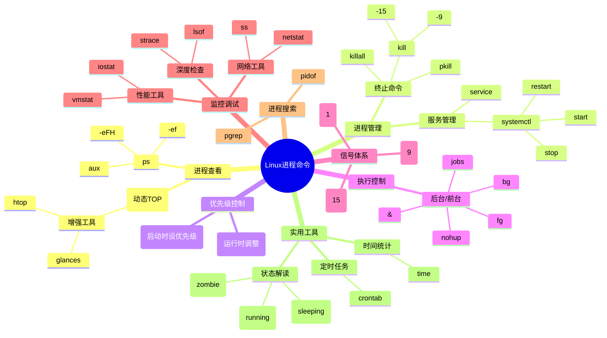

## 🌐 Linux进程命令全景图



该mindmap特点：


### 进程查看
### 如何列出 Linux 中正在运行的进程 | ps 命令  


Linux 是一个多任务、多用户系统，允许多个进程同时运行。进程是程序的执行实例，每个进程有唯一的 **进程 ID (PID)**。以下是多种列出运行中进程的方法：

---

### 目录  

1. [Linux 中的进程是什么？](#什么是进程)  
2. [列出进程的 5 种方法](#列出进程的方法)  
   - `ps` 命令  
   - `top` 命令  
   - `htop` 命令  
   - `atop` 命令  
   - `pgrep` 命令  

---

### <span id="什么是进程">1. Linux 中的进程是什么？</span>  

进程是程序的运行实例，拥有独立内存空间和唯一 PID。它是操作系统多任务处理的核心，允许同时执行多个任务。

---

### <span id="列出进程的方法">2. 列出进程的 5 种方法</span>  

#### **1. `ps` 命令**  

- **功能**：显示进程快照。  

- **基本语法**：  

  ```bash
  ps [选项]
  ```

- **常用选项**：  

  | 选项         | 描述                           |
  | ------------ | ------------------------------ |
  | `a`          | 显示所有用户的进程             |
  | `-A` 或 `-e` | 列出系统所有进程               |
  | `f`          | 以树状结构显示父子进程关系     |
  | `u`          | 显示详细资源使用（CPU、内存）  |
  | `x`          | 包含无终端的进程（如后台服务） |
  | `-p PID`     | 查看指定 PID 的进程            |

- **示例**：  

  ```bash
  ps -A          # 列出所有进程
  ps -u root     # 显示 root 用户的进程
  ps -C systemd  # 按进程名（如 systemd）过滤
  ```

以下是一些常用 `ps` 命令的具体示例及说明，帮助你快速掌握进程查看技巧：

---

### 1. 基础进程查看

#### 查看当前终端关联的进程

```bash
ps
```

**输出示例**：  

```
  PID TTY          TIME CMD
 1234 pts/0    00:00:00 bash
 5678 pts/0    00:00:00 ps
```

- **说明**：仅显示当前终端（如终端窗口）启动的进程。

---

### 2. 查看所有进程

#### 显示系统中所有进程（完整列表）

```bash
ps -e      # 或 ps -A
```

**输出示例**：  

```
  PID TTY          TIME CMD
    1 ?        00:00:01 systemd
    2 ?        00:00:00 kthreadd
  ...（所有进程列表）
```

---

### 3. 显示进程树状结构

#### 用 ASCII 字符展示父子进程关系

```bash
ps -f --forest
```

**输出示例**：  

```
UID          PID    PPID  C STIME TTY          TIME CMD
root           1       0  0 10:00 ?        00:00:01 /sbin/init
root         123       1  0 10:00 ?        00:00:00  \_ /usr/sbin/sshd
user         456     123  0 10:05 ?        00:00:00      \_ sshd: user@pts/0
user         789     456  0 10:05 pts/0    00:00:00          \_ -bash
user         901     789  0 10:06 pts/0    00:00:00              \_ ps -f --forest
```

- **说明**：`--forest` 会以树状结构显示进程层级，适合分析进程依赖关系。

---

### 4. 按用户过滤进程

#### 查看指定用户（如 `root`）的进程

```bash
ps -u root
```

**输出示例**：  

```
  PID TTY          TIME CMD
    1 ?        00:00:01 systemd
  123 ?        00:00:00 sshd
```

---

### 5. 按进程名过滤

#### 查找名为 `nginx` 的进程

```bash
ps -C nginx
```

**输出示例**：  

```
  PID TTY          TIME CMD
 1001 ?        00:00:00 nginx
 1002 ?        00:00:00 nginx
```

---

### 6. 显示详细资源占用

#### 查看进程的 CPU、内存占用（类似任务管理器）

```bash
ps aux
```

**输出示例**：  

```
USER       PID %CPU %MEM    VSZ   RSS TTY      STAT START   TIME COMMAND
root         1  0.0  0.1 169000 13000 ?        Ss   10:00   0:01 /sbin/init
root       123  0.0  0.2 212000 18000 ?        Ss   10:00   0:00 /usr/sbin/sshd
```

- **列说明**：  
  - `%CPU`：CPU 占用百分比  
  - `%MEM`：内存占用百分比  
  - `VSZ`：虚拟内存大小（KB）  
  - `RSS`：物理内存大小（KB）  
  - `STAT`：进程状态（如 `S`=休眠, `R`=运行）

---

### 7. 按 PID 查看进程

#### 查看指定 PID（如 `456`）的进程信息

```bash
ps -p 456
```

**输出示例**：  

```
  PID TTY          TIME CMD
  456 ?        00:00:00 sshd
```

---

### 8. 组合过滤

#### 显示 `nginx` 进程的树状结构和资源占用

```bash
ps -f --forest -C nginx
```

**输出示例**：  

```
UID          PID    PPID  C STIME TTY          TIME CMD
root        1001       1  0 10:00 ?        00:00:00 nginx: master process
www-data    1002    1001  0 10:00 ?        00:00:00  \_ nginx: worker process
www-data    1003    1001  0 10:00 ?        00:00:00  \_ nginx: worker process
```

---

### 9. 查看进程的线程

#### 显示进程及其线程（`LWP` 表示线程 ID）

```bash
ps -eLf | grep nginx
```

**输出示例**：  

```
root      1001     1 1001  0    2 10:00 ?        00:00:00 nginx: master process
www-data  1002  1001 1002  0    2 10:00 ?        00:00:00 nginx: worker process
www-data  1003  1001 1003  0    2 10:00 ?        00:00:00 nginx: worker process
```

---

### 10. 按时间排序进程

#### 显示 CPU 占用时间最长的进程

```bash
ps -eo pid,user,%cpu,time,cmd --sort=-time
```

**输出示例**：  

```
  PID USER      %CPU     TIME CMD
 5678 user      10.0 01:23:45 /usr/bin/python3 app.py
 1234 root       0.1 00:12:34 /usr/sbin/sshd
```

---

### 
---

#### **2. `top` 命令**  

- **功能**：实时动态监控进程及资源占用。  

- **启动**：  

  ```bash
  top
  ```

- **关键信息列**：  

  - `PID`：进程 ID  
  - `%CPU`：CPU 占用率  
  - `%MEM`：内存占用率  
  - `COMMAND`：进程名称  

---

#### **3. `htop` 命令**  

- **功能**：增强版 `top`，支持交互操作和彩色显示。  

- **安装**：  

  ```bash
  sudo apt install htop  # Debian/Ubuntu
  sudo dnf install htop  # Red Hat/CentOS
  ```

- **启动**：  

  ```bash
  htop
  ```

- **特性**：  

  - 鼠标点击排序  
  - 进程树状视图  
  - 快捷键操作（如 `F9` 结束进程）  

---

#### **4. `atop` 命令**  

- **功能**：详细监控历史和实时资源使用。  

- **安装**：  

  ```bash
  sudo apt install atop  # Debian/Ubuntu
  sudo dnf install atop  # Red Hat/CentOS
  ```

- **启动**：  

  ```bash
  atop
  ```

- **关键列**：  

  - `SYSCPU`：系统 CPU 时间  
  - `VGROW`：虚拟内存增长量  
  - `RUID`：真实用户 ID  

---

#### **5. `pgrep` 命令**  

- **功能**：根据名称查找进程 PID。  

- **语法**：  

  ```bash
  pgrep [选项] 进程名
  ```

- **示例**：  

  ```bash
  pgrep systemd    # 查找 systemd 的 PID
  pgrep -u root    # 列出 root 用户的所有进程 PID
  ```

---

### 总结  

- **快速查看**：`ps -ef` 或 `ps aux`  
- **实时监控**：`top` 或 `htop`  
- **历史分析**：`atop`  
- **精确查找**：`pgrep`  

通过合理选择命令，可高效管理和监控 Linux 系统的进程。

### linux 进程管理


好的！我们可以通过一个简单的命令（比如 `sleep`）创建一个后台进程，然后学习如何用 `kill` 终止它。以下是详细步骤：

---

### 步骤 1：创建一个后台进程

在终端中运行以下命令，创建一个持续 300 秒（5 分钟）的后台进程：

```bash
sleep 300 &
```

- **`sleep 300`**：让系统休眠 300 秒。
- **`&`**：将命令放到后台运行，释放终端。

**输出示例**：  

```bash
[1] 12345  # [任务编号] [进程PID]
```

---

### 步骤 2：验证进程是否运行

使用 `ps` 或 `jobs` 命令查看进程：

```bash
ps aux | grep sleep   # 列出所有包含 "sleep" 的进程
# 或
jobs -l               # 查看当前终端的后台任务（显示 PID）
```

**输出示例**：  

```bash
user   12345  0.0  0.0   1234  567 pts/0    S    10:00   0:00 sleep 300
```

---

### 步骤 3：学习 `kill` 命令终止进程

#### 语法

```bash
kill [选项] <PID>
```

#### 常用操作

1. **正常终止进程**（发送 `SIGTERM` 信号）：

   ```bash
   kill 12345  # 替换为你的 PID
   ```

2. **强制终止进程**（发送 `SIGKILL` 信号）：

   ```bash
   kill -9 12345  # 如果进程无响应时使用
   ```

3. **其他终止方式**：

   ```bash
   killall sleep          # 终止所有名为 "sleep" 的进程
   pkill -f "sleep 300"  # 根据完整命令终止进程
   ```

---

### 验证进程是否被终止

再次运行 `ps` 命令，确认进程已消失：

```bash
ps aux | grep sleep
```

---

### 完整流程示例

```bash
# 1. 创建后台进程
sleep 300 &
# 输出：[1] 12345

# 2. 查看进程
ps aux | grep sleep
# 输出：user 12345 ... sleep 300

# 3. 终止进程
kill 12345

# 4. 验证是否终止
ps aux | grep sleep
# 输出：无结果（进程已消失）
```

---

### 其他 `kill` 信号

| 信号名  | 值   | 说明                     |
| ------- | ---- | ------------------------ |
| SIGTERM | 15   | 默认终止（允许进程清理） |
| SIGKILL | 9    | 强制终止（立即结束）     |
| SIGHUP  | 1    | 挂起（重启进程）         |

---

现在你已经成功创建并终止了一个进程！接下来可以尝试用不同信号或命令来操作。 😊


### 如何在 Linux 中通过指定部分名称终止进程  

在 Linux 中，可以通过进程的部分名称、代码片段或模式来终止进程。以下是三种常用方法及其详细操作步骤：

---

### 方法概览  

1. **`pkill` 命令**：通过进程名称片段终止进程（需谨慎使用）。  
2. **`pgrep` + `kill`**：结合 `pgrep` 精确查找进程 PID，再手动终止。  
3. **`killall` 命令**：批量终止所有同名进程。  

---

### 方法 1：使用 `pkill` 终止进程（需谨慎）

#### 语法  

```bash
pkill -f "部分名称"
```

- **`-f`**：匹配完整的命令行（支持模糊匹配）。  

#### 操作步骤  

1. **创建测试进程**：  

   ```bash
   exec -a process_1 sleep 60000 &  # 创建名为 "process_1" 的后台进程
   exec -a process_2 sleep 60000 &
   exec -a process_3 sleep 60000 &
   ```

2. **通过片段名称终止**：  

   ```bash
   pkill -f "pro"  # 终止所有名称包含 "pro" 的进程（如 process_1/2/3）
   ```

#### ⚠️ 风险警告  

若系统中存在重要进程（如 `imp_process_1`），使用 `pkill -f "pro"` 可能导致误杀！  

---

### 方法 2：使用 `pgrep` 安全终止进程  

#### 操作步骤  

1. **查找进程 PID**：  

   ```bash
   pgrep -f "部分名称"  # 示例：查找名称包含 "process" 的进程 PID
   ```

   **输出示例**：  

   ```bash
   355  # 进程 1 的 PID
   356  # 进程 2 的 PID
   ```

2. **手动终止进程**：  

   ```bash
   kill 355 356  # 终止指定 PID 的进程
   ```

#### 优势  

- 精准控制，避免误杀关键进程。  

---

### 方法 3：使用 `killall` 批量终止同名进程  

#### 操作步骤  

1. **创建多个同名进程**：  

   ```bash
   exec -a sleep_process_1 sleep 60000 &  # 创建 5 个同名后台进程
   exec -a sleep_process_2 sleep 60000 &
   exec -a sleep_process_3 sleep 60000 &
   exec -a sleep_process_4 sleep 60000 &
   exec -a sleep_process_5 sleep 60000 &
   ```

2. **终止所有同名进程**：  

   ```bash
   killall sleep  # 终止所有命令中包含 "sleep" 的进程
   ```

#### 适用场景  

- 需快速清理同一程序的所有实例（如批量终止测试进程）。  

---

### 关键命令对比  

| 命令           | 用途               | 风险等级 |
| -------------- | ------------------ | -------- |
| `pkill -f`     | 模糊匹配终止进程   | 高       |
| `pgrep + kill` | 精准查找并终止进程 | 低       |
| `killall`      | 批量终止同名进程   | 中       |

---

### 总结  

- **谨慎使用 `pkill`**：避免误杀关键进程，建议先通过 `pgrep` 验证目标 PID。  
- **推荐组合 `pgrep + kill`**：安全性高，适合生产环境。  
- **批量清理用 `killall`**：快速终止同名进程，但需确认名称唯一性。  

通过合理选择方法，可高效管理 Linux 进程并避免系统异常！ 🚀

#### 服务管理


#### linux 监控调试


### linux实用工具

#### Linux 中的 `time` 命令详解及实用示例  

**最后更新：2024 年 9 月 5 日**  
`time` 是 Linux 系统中用于测量命令执行时间的实用工具，能够输出 **实际时间**（总耗时）、**用户态 CPU 时间** 和 **内核态 CPU 时间**。它是性能分析和调试的重要工具。

---


### <span id="命令功能">1. 命令功能</span>  

- **实际时间（Real Time）**：命令从开始到结束的**总耗时**（包括等待 I/O 的时间）。  
- **用户态时间（User Time）**：命令在用户空间消耗的 CPU 时间。  
- **内核态时间（Sys Time）**：命令在内核空间消耗的 CPU 时间。  

---

### <span id="基本语法">2. 基本语法</span>  

```bash
time [options] command [arguments]
```

---

### <span id="关键选项">3. 关键选项</span>  

| 选项          | 作用                                         |
| ------------- | -------------------------------------------- |
| `-p`          | 以 POSIX 标准格式输出时间（兼容性强）        |
| `-o file`     | 将结果保存到文件（不显示在终端）             |
| `-f "FORMAT"` | 自定义输出格式（需完整路径 `/usr/bin/time`） |

---

### <span id="实用示例">4. 实用示例</span>  

#### 示例 1：基础测量（耗时操作）  

```bash
time sleep 3
```

**输出**：  

```
real    0m3.004s  
user    0m0.001s  
sys     0m0.002s
```

- **说明**：`sleep 3` 实际总耗时约 3 秒，但 CPU 时间几乎为 0（无计算操作）。
- 

---

#### 示例 2：测量网络请求耗时  

```bash
time curl -O https://example.com/large-file.zip
```

**输出**：  

```
time curl -O https://example.com/large-file.zip
  % Total    % Received % Xferd  Average Speed   Time    Time     Time  Current
                                 Dload  Upload   Total   Spent    Left  Speed
100  1256  100  1256    0     0    655      0  0:00:01  0:00:01 --:--:--   654
curl -O https://example.com/large-file.zip  0.01s user 0.03s system 2% cpu 1.949 total
```

---

#### 示例 3：测量脚本执行时间  

```bash
time ./batch-process.sh
```

**输出**：  

```
real    2m30.45s  
user    1m45.67s  
sys     0m10.89s
```

- **分析**：脚本总耗时 2.5 分钟，其中 CPU 计算占 1 分 45 秒。

---

#### 示例 4：多命令组合测量  

```bash
time { 
    tar -czf backup.tar.gz /data; 
    scp backup.tar.gz user@remote:/backup/; 
    rm backup.tar.gz; 
}
```

**输出**：  

```
real    5m12.34s  
user    3m20.00s  
sys     0m45.67s
```

- **说明**：统计压缩、传输、删除操作的总耗时。

---

#### 示例 5：输出重定向到文件  

```bash
/usr/bin/time -o timing.log python data_analysis.py
```

**文件内容**：  

```
0.50user 0.10system 0:10.23elapsed 5%CPU (0avgtext+0avgdata 12345maxresident)k  
0inputs+0outputs (0major+1234minor)pagefaults 0swaps
```

---

#### 示例 6：自定义输出格式  

```bash
/usr/bin/time -f "CPU使用率: %P\n内存峰值: %MK" stress --cpu 1 --timeout 10
```

**输出**：  

```
CPU使用率: 99%  
内存峰值: 256K
```

---

### <span id="输出解读">5. 输出解读</span>  

- **real < user + sys**：程序未充分利用多核（单线程）。  
- **real ≈ user + sys**：程序为 CPU 密集型（高效利用 CPU）。  
- **real > user + sys**：存在 I/O 等待或并发阻塞（如网络请求）。  

---

### <span id="常见问题">6. 常见问题</span>  

#### 问题 1：`time` 命令输出格式混乱  

**原因**：Shell 内置的 `time` 与 GNU `time` 冲突。  
**解决**：使用完整路径 `/usr/bin/time` 或 `\time`。  

---

#### 问题 2：如何测量管道命令的时间？  

```bash
time (command1 | command2)
```

**示例**：  

```bash
time (cat large.log | grep "ERROR" > errors.txt)
```

---

#### 问题 3：如何统计内存使用？  

需使用 GNU `time`：  

```bash
/usr/bin/time -v node app.js
```

**关键输出**：  

```
Maximum resident set size (kbytes): 123456  # 内存峰值（KB）
```

---

### 总结  

- **快速调试**：直接使用 `time command` 查看基础耗时。  
- **精准分析**：结合 `/usr/bin/time -f` 自定义指标（如内存、CPU 占比）。  
- **跨平台注意**：macOS 的 BSD `time` 功能有限，建议安装 GNU 版本（`brew install gtime`）。  

掌握 `time` 命令，轻松定位性能瓶颈！ 🚀


---
`lsof` (**L**i**s**t **O**pen **F**iles) 是 Linux/Unix 系统下的核心命令，用于**列出被进程打开的文件、网络连接等信息**。在运维中常用于排查资源占用、网络连接等问题。


---

# lsof


### **一、基础语法**

```bash
lsof [选项] [文件名/目录/参数]
sudo lsof  # 需要root权限查看全部信息
```

---

### **二、核心使用场景**

#### 1. 查看所有打开文件

```bash
sudo lsof
# 输出字段解释：
# COMMAND   PID  USER   FD      TYPE DEVICE SIZE/OFF   NODE NAME
# FD类型：cwd(当前目录)、txt(程序代码)、mem(内存映射文件)等
```

#### 2. 查找占用端口的进程

```bash
sudo lsof -i :3000          # 查看3000端口使用情况
sudo lsof -i tcp:80         # 查看TCP 80端口
sudo lsof -i udp:53         # 查看UDP 53端口
```

#### 3. 查看指定进程打开的文件

```bash
sudo lsof -p 1234          # 查看PID=1234的进程
sudo lsof -c nginx         # 查看nginx进程打开的文件
```

#### 4. 查看用户相关操作

```bash
sudo lsof -u deployer      # 查看用户deployer打开的文件
sudo lsof -u ^root         # 排除root用户
```

#### 5. 恢复被删除的文件（重要！）

```bash
# 当文件被删除但进程仍持有句柄时
sudo lsof /path/to/deleted_file | grep deleted
# 输出中的PID和FD字段可用于恢复：
cat /proc/<PID>/fd/<FD> > recovered_file
```

---

### **三、高级技巧**

#### 1. 网络连接分析

```bash
sudo lsof -i -P -n        # 显示数字格式的IP和端口
sudo lsof -i @1.1.1.1     # 查看与特定IP的连接
```

#### 2. 组合过滤

```bash
sudo lsof -u deployer -i tcp:3000-4000  # 用户+端口范围
sudo lsof /var/log -D .                 # 查看目录下被打开的文件
```

#### 3. 查看文件被哪些进程使用

```bash
sudo lsof /var/log/nginx/access.log
sudo lsof +D /etc/nginx   # 监控整个目录
```

---

### **四、实战案例**

#### 案例1：解决 "Address already in use"

```bash
# 1. 查找占用80端口的进程
sudo lsof -i :80

# 2. 确认进程后重启/终止
sudo kill -9 <PID>  # 强制终止进程
```

#### 案例2：排查磁盘空间异常

```bash
# 查找被删除但未释放空间的大文件
sudo lsof +L1 | grep deleted | sort -nk7
```

#### 案例3：分析Web服务器连接

```bash
sudo lsof -p $(pgrep nginx) -nP | grep TCP
```

---

### **五、常用选项速查表**

| 选项 | 作用                     |
| ---- | ------------------------ |
| `-i` | 显示网络连接             |
| `-p` | 指定进程PID              |
| `-u` | 指定用户名               |
| `-c` | 匹配进程名               |
| `+d` | 查看目录被打开的文件     |
| `-n` | 禁用端口号到服务名的转换 |
| `-P` | 禁用端口号到端口名的转换 |

---

### **六、注意事项**

1. 输出字段`FD`的含义：

   - `数字`：文件描述符编号
   - `r`：只读模式
   - `w`：写模式
   - `u`：读写模式

2. **TYPE字段**常见值：

   - `IPv4`/`IPv6`：网络连接
   - `REG`：普通文件
   - `DIR`：目录
   - `CHR`：字符设备

3. 当需要**持续监控**时，可结合 `watch` 命令：

   ```bash
   watch -n 1 "sudo lsof -i :3000"
   ```

