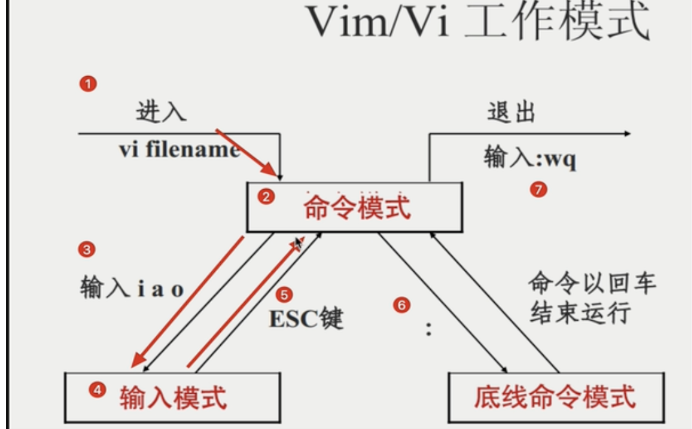

# Vim的2 工作模式解析

根据图示，Vim/Vi 的工作模式分为 **命令模式**、**输入模式** 和 **底线命令模式**，三者通过特定操作动态切换。以下是详细解析：

---

#### **1. 命令模式（Normal Mode）**  

- **入口**：通过 `vi filename` 或 `vim filename` 启动时默认进入命令模式。  
- **核心功能**：  
  - **导航文本**：使用 `h/j/k/l` 或方向键移动光标。  
  - **执行编辑命令**：如 `dd`（删除行）、`yy`（复制行）、`p`（粘贴）。  
  - **切换模式**：  
    - 输入 `i`（插入）、`a`（追加）、`o`（下方新行）进入输入模式（步骤 ③→④）。  
    - 输入 `:` 进入底线命令模式（步骤 ⑥）。  

---

#### **2. 输入模式（Insert Mode）**  

- **入口**：在命令模式下按 `i/a/o` 等字符进入。  
- **核心功能**：  
  - **自由编辑文本**：直接输入或删除内容，类似常规文本编辑器。  
  - **返回命令模式**：按 `ESC` 键（步骤 ⑤）。  

---

#### **3. 底线命令模式（Command-Line Mode）**  

- **入口**：在命令模式下输入 `:`（步骤 ⑥）。  
- **核心功能**：  
  - **执行管理命令**：  
    - `:w` 保存文件。  
    - `:q` 退出 Vim。  
    - `:wq` 保存并退出（步骤 ⑦）。  
    - `:q!` 强制退出（不保存修改）。  
  - **命令执行**：输入命令后按 `Enter` 键生效（图中注明“命令以回车结束运行”）。  
  - **返回命令模式**：执行命令后自动返回，或按 `ESC` 取消输入。  

  ##  Vim 命令模式（Normal Mode）的核心快捷键整理

  ### **一、基础移动操作**

| 快捷键 | 功能说明       | 助记词             |
| ------ | -------------- | ------------------ |
| `h`    | 向左移动光标   | **←** 方向         |
| `j`    | 向下移动光标   | **↓** 方向         |
| `k`    | 向上移动光标   | **↑** 方向         |
| `l`    | 向右移动光标   | **→** 方向         |
| `gg`   | 跳转到文件开头 | **G**oto Start     |
| `G`    | 跳转到文件末尾 | **G**oto End       |
| `0`    | 跳转到行首     | 数字 0（行首标识） |
| `$`    | 跳转到行尾     | 行尾符号「$」      |

---

### **二、高效编辑操作**

| 快捷键     | 功能说明                   | 组合扩展示例       |
| ---------- | -------------------------- | ------------------ |
| `i`        | 进入插入模式（光标前）     | 适合小范围插入     |
| `a`        | 进入插入模式（光标后）     | **A**ppend（追加） |
| `o`        | 在当前行下方新建空行并插入 | **O**pen New Line  |
| `dd`       | 删除整行                   | **D**elete Line    |
| `yy`       | 复制整行                   | **Y**ank（复制）   |
| `p`        | 粘贴到光标后               | **P**aste          |
| `u`        | 撤销操作                   | **U**ndo           |
| `Ctrl + r` | 重做操作                   | **R**edo           |

---

### **三、进阶操作组合**

| 快捷键组合      | 功能说明                    | 示例场景                |
| --------------- | --------------------------- | ----------------------- |
| `d + 方向键`    | 删除指定方向内容            | `dj` 删除当前行及下一行 |
| `y + 方向键`    | 复制指定方向内容            | `y$` 复制到行尾         |
| `c + w`         | 删除当前单词并进入插入模式  | **C**hange **W**ord     |
| `:%s/old/new/g` | 全局替换文本（需 `:` 模式） | 快速修改重复内容        |

### 实际中场景举例

1. **快速删除多行**  
   - `3dd`：删除当前行及后续 2 行（共 3 行）

