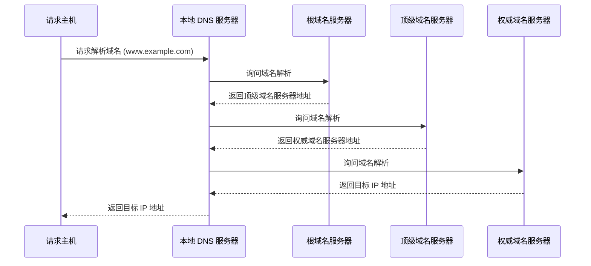

# **理解 DNS 和域名解析的那些事儿 🧩**

互联网世界里，有一个重要但容易被忽略的幕后英雄 —— **DNS（Domain Name System）**。它就像互联网的“电话簿”，让人类记得住网站的名字，而计算机却能找到它们的地址。

本文将深入浅出地讲解 DNS 的工作原理，并用图示带你感受域名解析的全过程。

## **为什么需要 DNS？**

你可以把 DNS 想象成快递行业的地址转换器。人类更喜欢记住“苹果官网”这样的名字（即域名），但快递员（计算机）需要知道详细的楼号、街道、邮编（IP 地址）才能找到你。DNS 就承担了将域名转换成 IP 地址的任务。

**典型例子：**

访问 www.apple.com 的背后，其实是请求 17.253.144.10 这样的 IP 地址。如果没有 DNS，每次上网前你都得记住复杂的 IP，这显然不现实。

## [**DNS 服务器有哪些？根服务器有多少个**](https://javaguide.cn/cs-basics/network/other-network-questions.html#dns-%E6%9C%8D%E5%8A%A1%E5%99%A8%E6%9C%89%E5%93%AA%E4%BA%9B-%E6%A0%B9%E6%9C%8D%E5%8A%A1%E5%99%A8%E6%9C%89%E5%A4%9A%E5%B0%91%E4%B8%AA)

**根域名服务器（Root DNS Server）（）**

> 根 DNS 服务器提供 TLD 服务器的 IP 地址。目前世界上只有 13 组根服务器，我国境内目前仍没有根服务器。
> 

顶层的 DNS 服务器，负责告诉你不同顶级域名的服务器地址，比如 .com 或 .cn。

**顶级域名服务器（Top-level DNS Server）**

管理每个顶级域名下的权威域名服务器，比如 apple.com 的服务器。

**权威域名服务器（Authoritative DNS Server）**

真正掌握某个域名的 IP 地址。例如 www.apple.com 的 IP。

详细版

1. **根域名服务器（Root DNS Servers）**
    - 根域名服务器是 DNS 系统的顶层，负责管理顶级域名服务器的信息。
    - 全球共有 13 组根服务器（用字母 A 到 M 表示），分布在全球各地。
    - 它们不直接解析域名，而是告诉客户端去哪里找到对应的顶级域名服务器。
2. **顶级域名服务器（TLD DNS Servers）**
    - 顶级域名服务器管理特定顶级域名（如 `.com`、`.org`、`.net` 或国家代码 `.cn`、`.us` 等）。
    - 它们存储了这些顶级域名下的权威域名服务器的地址。
    - 例如，查询 `www.example.com` 时，根服务器会引导客户端到 `.com` 的顶级域名服务器。
3. **权威域名服务器（Authoritative DNS Servers）**
    - 权威域名服务器存储特定域名的实际记录（如 A 记录、CNAME 记录等）。
    - 它们是域名解析的最终来源，返回具体的 IP 地址或其他资源记录。
    - 例如，`example.com` 的权威服务器会返回 `www.example.com` 的 IP 地址。

## **域名解析的全过程**

### 简易版

**域名解析查询过程**

**1. 访问根域名服务器**

浏览器向根域名服务器查询顶级域名（如 “com”）的服务器地址。

**2. 访问顶级域名服务器**

根域名服务器返回顶级域名服务器的 IP 地址，浏览器访问该服务器以查询权威域名服务器地址。

**3. 访问权威域名服务器**

顶级域名服务器返回 apple.com 权威服务器的地址，最终获得 www.apple.com 对应的 IP 地址。

DNS 的查询解析过程分为两种模式：

- **迭代**
- **递归**

### **递归查询**

**Step 1:** 请求主机向本地 DNS 服务器 dns.poly.edu 发起 DNS 请求。

**Step 2:** 如果本地 DNS 没有缓存，会将请求递归转发给根域名服务器。

**Step 3:** 根域名服务器返回对应顶级域名服务器 (TLD DNS server) 的地址。

**Step 4:** 本地 DNS 将请求递归到顶级域名服务器。

**Step 5:** 顶级域名服务器返回权威域名服务器的地址。

**Step 6:** 本地 DNS 再次递归查询权威域名服务器。

**Step 7:** 权威域名服务器返回目标 IP 地址。

**Step 8:** 本地 DNS 将解析结果返回给请求主机。



### **迭代查询**

**Step 1:** 请求主机向本地 DNS 服务器 dns.poly.edu 发送 DNS 查询请求。

**Step 2:** 本地 DNS 向根域名服务器发起查询。

**Step 3:** 根域名服务器返回顶级域名服务器的地址。

**Step 4:** 本地 DNS 再次向顶级域名服务器发起查询。

**Step 5:** 顶级域名服务器返回权威域名服务器的地址。

**Step 6:** 本地 DNS 继续查询权威域名服务器。

**Step 7:** 权威域名服务器返回目标 IP 地址。

**Step 8:** 本地 DNS 将结果返回给请求主机。


| **特性** | **递归查询** | **迭代查询** |
| --- | --- | --- |
| 查询过程 | DNS 服务器负责完成 | 请求方逐步完成 |
| 查询效率 | 更快（较少的客户端负担） | 负担较大 |
| 负载分担 | 本地 DNS 承担更多 | 各级 DNS 分担 |

## **4. 缓存优化：让域名解析更快**

DNS 查询过程虽然严谨，但三次查询显然不够高效。为此，互联网引入了多层缓存机制来提升解析速度。

**本地 DNS 服务器**

网络运营商提供的 DNS 服务器，比如 Google 的 8.8.8.8，可以缓存查询结果，减少核心服务器压力。

**操作系统缓存**

系统内存会保存 DNS 查询结果，下次访问直接读取缓存。

**hosts 文件**

一个本地文件，提前映射域名与 IP 地址，优先级最高

**Linux 路径**: /etc/hosts

**Windows 路径**: C:\Windows\System32\drivers\etc\hosts

## 5 DNS 报文格式

<aside>
💡

QuestionAI

</aside>

## DNS的新玩法

DNS（域名系统）确实是一个非常强大的工具，除了基本的域名解析功能外，它还可以用于实现多种“新玩法”。以下是对你提到的几种DNS玩法的详细解释和扩展：

### 1. 重定向

重定向是DNS最基本的应用之一。通过修改DNS记录，可以将域名指向不同的IP地址。这种方式在服务器维护、迁移或故障转移时非常有用。例如：

- **场景**：你有一台服务器 `buy.tv`，原本的IP地址是 `1.2.3.4`，现在需要临时停机维护，你可以将DNS记录修改为指向新的IP地址 `5.6.7.8`。
- **实现**：在DNS管理界面中，修改A记录或CNAME记录，将 `buy.tv` 指向新的IP地址。

```markdown
# 修改前的DNS记录
buy.tv A 1.2.3.4

# 修改后的DNS记录
buy.tv A 5.6.7.8

```

### 2. 内部DNS服务

在企业内部，可以使用开源软件如 `bind9` 搭建内部DNS服务器，用于管理内部服务的域名解析。这种方式可以避免使用硬编码的IP地址，提高系统的灵活性和可维护性。

- **场景**：企业内部有多个服务，如数据库服务、商品服务等，可以使用域名来标记这些服务。
- **实现**：在内部DNS服务器中配置A记录或CNAME记录。

```markdown
# 内部DNS记录示例
mysql.inner.app A 192.168.1.10
goods.inner.app A 192.168.1.20

```

### 3. 基于域名的负载均衡

DNS还可以用于实现负载均衡，主要有两种方式：

### 3.1 多IP轮询

DNS可以为一个域名配置多个IP地址，客户端在收到多个IP地址后，可以使用轮询算法依次向服务器发起请求，实现负载均衡。

- **场景**：一个域名 `example.com` 对应多个服务器IP地址。
- **实现**：在DNS记录中配置多个A记录。

```markdown
# DNS记录示例
example.com A 192.168.1.1
example.com A 192.168.1.2
example.com A 192.168.1.3

```

### 3.2 基于策略的负载均衡

DNS可以根据客户端的IP地址或其他策略，返回离客户端最近的主机或服务质量最好的主机，从而实现负载均衡。

- **场景**：根据客户端的地理位置，返回最近的服务器IP地址。
- **实现**：使用智能DNS服务，配置基于地理位置的解析策略。

```markdown
# 智能DNS配置示例
example.com A 192.168.1.1 (US)
example.com A 192.168.1.2 (EU)
example.com A 192.168.1.3 (ASIA)

```

### 4. 恶意DNS

虽然大多数DNS服务是可信的，但也有一些恶意DNS可能会进行域名劫持、DNS污染等攻击。这些恶意行为可能会导致用户被重定向到钓鱼网站或恶意网站。

- **防护措施**：
    - 使用可信的DNS服务提供商。
    - 配置DNSSEC（DNS安全扩展）来防止DNS欺骗。
    - 定期检查DNS记录，确保没有被篡改。

## 极客时间小结

1. 域名使用字符串来代替 IP 地址，方便用户记忆，本质上一个名字空间系统； 

2. DNS 就像是我们现实世界里的电话本、查号台，统管着互联网世界里的所有网站，是一 个“超级大管家”； 

3. DNS 是一个树状的分布式查询系统，但为了提高查询效率，外围有多级的缓存； 

4. 使用 DNS 可以实现基于域名的负载均衡，既可以在内网，也可以在外网。