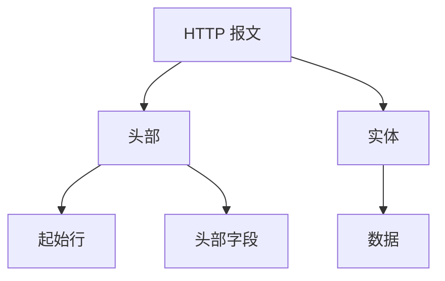
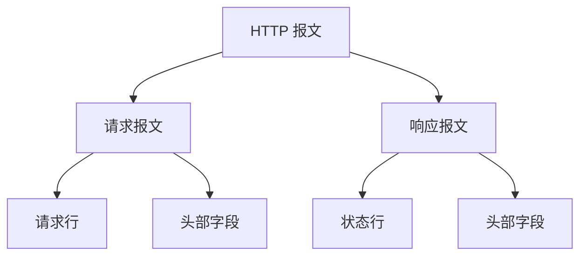

## HTTP 报文结构：大头儿子与脖子的故事

HTTP 报文是 Web 开发中最基础的概念之一。它的结构可以用一个形象的比喻来描述：**“大头儿子”**。报文由“起始行 + 头部 + 空行 + 实体”组成，简单来说就是 **“header + body”**。今天，我们就来深入探讨 HTTP 报文的结构，并通过 Mermaid 图直观地展示它的组成。

---

### 1. HTTP 报文的基本结构

HTTP 报文分为两部分：**头部（header）** 和 **实体（body）**。头部是必须存在的，而实体是可选的。头部和实体之间必须用一个空行分隔，就像“大头儿子”必须带着“脖子”一样。

用 Mermaid 图表示 HTTP 报文的结构如下：



- **头部**：包含起始行和头部字段。
- **实体**：包含实际传输的数据。

---

### 2. 请求报文 vs 响应报文

HTTP 报文分为两种：**请求报文** 和 **响应报文**。它们的起始行有所不同：

### 请求报文

- **起始行**：称为“请求行”，包含三部分：
    1. **请求方法**：如 `GET`、`POST`。
    2. **请求目标**：通常是 URL 的路径。
    3. **版本号**：如 `HTTP/1.1`。

### 响应报文

- **起始行**：称为“状态行”，也包含三部分：
    1. **版本号**：如 `HTTP/1.1`。
    2. **状态码**：如 `200`、`404`。
    3. **原因字符串**：如 `OK`、`Not Found`。

用 Mermaid 图表示请求报文和响应报文的区别：



---

### 3. 头部字段：键值对的魔法

头部字段是 HTTP 报文的核心部分，它以键值对的形式存在，格式为 `key: value`。例如：

```
Host: www.example.com
User-Agent: Mozilla/5.0
Accept: text/html

```

头部字段的特点：

- **不区分大小写**：`Host` 和 `host` 是等价的。
- **顺序任意**：字段的顺序不影响报文解析。
- **可扩展性**：除了标准字段，还可以添加自定义字段。
- **不允许空格**

## **HTTP 头部字段的分类**

HTTP 头部字段是 HTTP 报文的重要组成部分，它们用于传递额外的信息，帮助客户端和服务器更好地理解和处理请求与响应。根据用途，头部字段可以分为以下四大类：

### **1. 通用字段（General Header Fields）**

通用字段既可以出现在请求头中，也可以出现在响应头中。它们与报文的具体内容无关，而是提供一些通用的信息。

**常见通用字段：**

- `Cache-Control`：控制缓存的行为。
- `Connection`：管理连接的方式（如 `keep-alive`）。
- `Date`：报文创建的日期和时间。
- `Transfer-Encoding`：指定传输编码方式（如 `chunked`）。

### **2. 请求字段（Request Header Fields）**

请求字段仅出现在请求头中，用于进一步说明请求信息或附加条件。

**常见请求字段：**

- `Host`：指定服务器的域名（HTTP/1.1 必须字段）。
- `User-Agent`：客户端的信息（如浏览器类型）。
- `Accept`：客户端能够接收的媒体类型（如 `text/html`）。
- `Authorization`：用于身份验证的凭证。

### **3. 响应字段（Response Header Fields）**

响应字段仅出现在响应头中，用于补充说明响应报文的信息。

**常见响应字段：**

- `Server`：服务器的信息（如 `Apache/2.4.1`）。
- `Set-Cookie`：设置客户端的 Cookie。
- `Location`：重定向的目标 URL。
- `WWW-Authenticate`：要求客户端进行身份验证。

### **4. 实体字段（Entity Header Fields）**

实体字段属于通用字段，但它们专门用于描述报文实体（body）的额外信息。

**常见实体字段：**

- `Content-Type`：实体数据的媒体类型（如 `application/json`）。
- `Content-Length`：实体数据的大小（以字节为单位）。
- `Content-Encoding`：实体数据的编码方式（如 `gzip`）。
- `Last-Modified`：实体数据最后修改的时间。

---

### 4. HTTP/1.1 的特殊要求

在 HTTP/1.1 中，**Host** 字段是必须提供的。它用于标记虚拟主机名，帮助服务器区分不同的域名。例如：

```
GET /index.html HTTP/1.1
Host: www.example.com

```

如果缺少 `Host` 字段，服务器将无法正确处理请求。

---

### 5. 示例：完整的 HTTP 请求和响应

### 请求报文

```
GET /index.html HTTP/1.1
Host: www.example.com
User-Agent: Mozilla/5.0
Accept: text/html

```

### 响应报文

```
HTTP/1.1 200 OK
Content-Type: text/html
Content-Length: 1234

<!DOCTYPE html>
<html>
<head>
    <title>Example</title>
</head>
<body>
    <h1>Hello, World!</h1>
</body>
</html>

```

---

### 6. 总结

HTTP 报文的结构清晰且灵活，是 Web 通信的基石。通过“大头儿子”的比喻，我们可以轻松记住它的组成：**头部是必须的，实体是可选的，中间用空行分隔**。、
