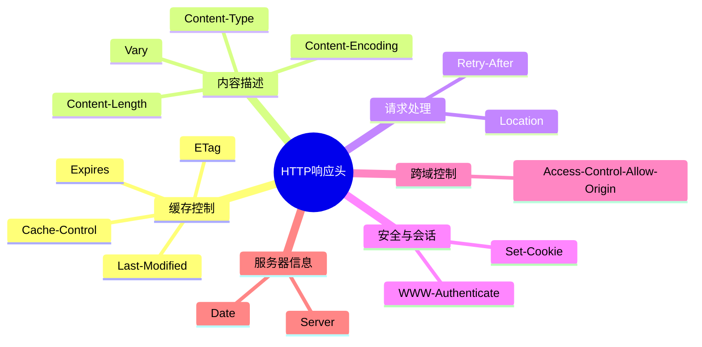
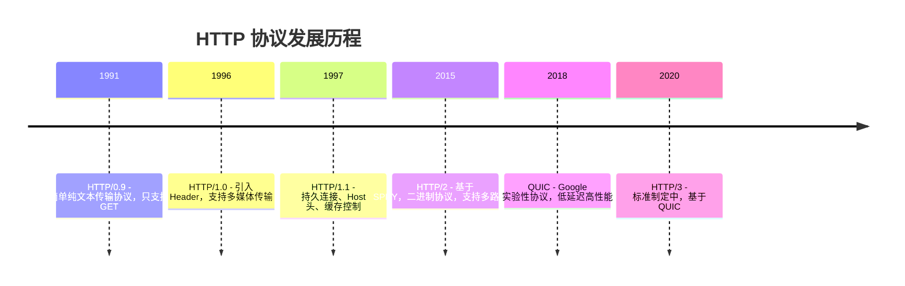

### HTTP 响应头详解

#### 一、思维导图分类


# HTTP的历史



### HTTP0.9

20 世纪 90 年代初期的互联网世界非常简陋，计算机处理能力低，存储容量小，网速很慢，还是一片“信息荒漠”。网络上绝大多数的资源都是纯文本，很多通信协议也都使用纯 文本，所以 HTTP 的设计也不可避免地受到了时代的限制。

HTTP 被定义为 0.9 版，结构比较简单，为了便于服务器和客户端处理，它也 采用了纯文本格式。蒂姆·伯纳斯 - 李最初设想的系统里的文档都是只读的，所以只允许 用“GET”动作从服务器上获取 HTML 文档，并且在响应请求之后立即关闭连接，功能非常有限

发明者：蒂姆·伯纳斯-李

**特点**： 仅支持 GET 方法 纯文本传输 连接请求完成后立即关闭只适用于简单的文本资源

### HTTP 1.0

HTTP/1.0 1993 年，NCSA（美国国家超级计算应用中心）开发出了 Mosaic，是第一个可以图文混 排的浏览器，随后又在 1995 年开发出了服务器软件 Apache，简化了 HTTP 服务器的搭建 工作。 同一时期，计算机多媒体技术也有了新的发展：1992 年发明了 JPEG 图像格式，1995 年 发明了 MP3 音乐格式。 这些新软件新技术一经推出立刻就吸引了广大网民的热情，更的多的人开始使用互联网，研 究 HTTP 并提出改进意见，甚至实验性地往协议里添加各种特性，从用户需求的角度促进 了 HTTP 的发展。

HTTP/1.0 1996 年正式发布

1. 增加了 HEAD、POST 等新方法；
2. 增加了响应状态码，标记可能的错误原因；
3. 引入了协议版本号概念；
4. 引入了 HTTP Header（头部）的概念，让 HTTP 处理请求和响应更加灵活；
5. 传输的数据不再仅限于文本。

### HTTP/1.1 （**正式的标准**）

1995 年，网景的 Netscape Navigator 和微软的 Internet Explorer 开始了著名的“浏览 器大战”，都希望在互联网上占据主导地位

HTTP/1.1 是对 HTTP/1.0 的小幅度修正。但一个重要的区别 是：它是一个“正式的标准”，而不是一份可有可无的“参考文档”。这意味着今后互联网 上所有的浏览器、服务器、网关、代理等等，只要用到 HTTP 协议，就必须严格遵守这个 标准，相当于是互联网世界的一个“立法”。

HTTP/1.1 主要的变更点有：

1. 增加了 PUT、DELETE 等新的方法；
2. 增加了缓存管理和控制；
3. 明确了连接管理，允许持久连接；
4. 允许响应数据分块（chunked），利于传输大文件；
5. 强制要求 Host 头，让互联网主机托管成为可能。

### HTTP2

在运行了10多年后，Google 首先开发了自己的浏览器 Chrome，然后推出了新的 SPDY 协议，并在 Chrome 里应用于自家的服务器，如同十多年前的网景与微软一样，从实际的用户方来“倒 逼”HTTP 协议的变革，这也开启了第二次的“浏览器大战”。 历史再次重演，不过这次的胜利者是 Google，Chrome 目前的全球的占有率超过了 60%。“挟用户以号令天下”，Google 借此顺势把 SPDY 推上了标准的宝座，互联网标准 化组织以 SPDY 为基础开始制定新版本的 HTTP 协议，最终在 2015 年发布了 HTTP/2， RFC 编号 7540。

HTTP/2 的制定充分考虑了现今互联网的现状：宽带、移动、不安全，在高度兼容 HTTP/1.1 的同时在性能改善方面做了很大努力，主要的特点有：

1. 二进制协议，不再是纯文本；
2. 可发起多个请求，废弃了 1.1 里的管道；
3. 使用专用算法压缩头部，减少数据传输量；
4. 允许服务器主动向客户端推送数据；
5. 增强了安全性，“事实上”要求加密通信

### HTTP3

在 HTTP/2 还处于草案之时，Google 又发明了一个新的协议，叫做 QUIC，而且还是相同 的“套路”，继续在 Chrome 和自家服务器里试验着“玩”，依托它的庞大用户量和数据 量，持续地推动 QUIC 协议成为互联网上的“既成事实”。 “功夫不负有心人”，当然也是因为 QUIC 确实自身素质过硬。 在去年，也就是 2018 年，互联网标准化组织 IETF 提议将“HTTP over QUIC”更名 为“HTTP/3”并获得批准，HTTP/3 正式进入了标准化制订阶段，也许两三年后就会正式 发布，到时候我们很可能会跳过 HTTP/2 直接进入 HTTP/3。

基于 UDP 协议 更快的连接 建立时间  内置加密，更安全

## HTTP是什么 HTTP不是什么？

**HTTP 是什么？**

HTTP (HyperText Transfer Protocol) 是一种 **网络通信协议**，定义了计算机之间传输 **超文本数据（文字、图片、音频、视频等）** 的规则。

专用于 **客户端（如浏览器）与服务器** 之间的通信

使用 **请求-响应模型** 来传输数据

依赖底层的传输协议（如 TCP/IP）实现可靠数据传输

**HTTP 不是什么？**

**1. HTTP 不是互联网**

互联网是一个全球性的网络基础设施，包含了多种协议。HTTP 只是用于传输超文本数据的协议之一。

**2. HTTP 不是编程语言**

编程语言（如 Java、Python、JavaScript）是开发人员与计算机沟通的工具。HTTP 是计算机之间通信的规则，不直接用于编程。

**3. HTTP 不是 HTML**

**HTML (HyperText Markup Language)** 是一种标记语言，用来定义网页的结构和内容。

**HTTP 是传输 HTML 的协议**，它们经常一起使用但性质完全不同。

**4. HTTP 不是一个孤立的协议**

HTTP 需要依赖其他协议，如 **TCP/IP、DNS、SSL/TLS** 等，来实现数据传输、安全通信等功能。

同时，也有很多协议依赖 HTTP，比如 **WebSocket 和 HTTPDNS**。


#### 二、核心响应头表格

| 响应头字段                      | 作用描述                          | 典型示例                                      |
| ------------------------------- | --------------------------------- | --------------------------------------------- |
| **Content-Type**                | 声明响应体的MIME类型和字符编码    | `text/html; charset=UTF-8`                    |
| **Cache-Control**               | 控制缓存策略（强缓存）            | `max-age=3600, no-cache`                      |
| **Set-Cookie**                  | 设置客户端Cookie                  | `sessionid=abc123; Path=/; HttpOnly`          |
| **Location**                    | 重定向目标地址（3xx状态码必配）   | `https://new.example.com`                     |
| **ETag**                        | 资源版本标识符（协商缓存）        | `"33a64df551425fcc55e4d42a148795d9"`          |
| **Access-Control-Allow-Origin** | 控制跨域资源共享（CORS）          | `*` 或 `https://trusted-site.com`             |
| **Content-Encoding**            | 声明响应体的压缩方式              | `gzip`、`br`                                  |
| **Vary**                        | 指定影响缓存差异化的请求头        | `Accept-Encoding, User-Agent`                 |
| **WWW-Authenticate**            | 要求客户端进行身份验证（401响应） | `Basic realm="Admin Area"`                    |
| **Retry-After**                 | 服务不可用时的重试等待时间        | `120`（秒）或 `Wed, 21 Oct 2025 07:28:00 GMT` |

---

#### 三、关键响应头深度解析

##### 1. 缓存控制组

```markdown
**Cache-Control 指令详解**
- `max-age=3600`：资源有效期（秒）
- `no-store`：禁止任何缓存
- `must-revalidate`：过期后必须验证
- `public`：允许中间代理缓存
- `private`：仅允许浏览器缓存

**ETag 工作流程**
1. 客户端携带 `If-None-Match: "etag_value"`
2. 服务器比对资源ETag
3. 匹配则返回 304 Not Modified
```

##### 2. 内容协商组

```markdown
**Vary 应用场景**
- `Vary: User-Agent`：针对不同设备返回差异化内容
- `Vary: Accept-Encoding`：区分压缩/未压缩版本
- `Vary: *`：表示响应内容完全动态

**Content-Encoding 注意点**
- 需与客户端的 `Accept-Encoding` 匹配
- 常见压缩算法性能对比：
  | 算法   | 压缩率 | 速度 | 兼容性 |
  |--------|--------|------|--------|
  | gzip   | 高     | 中   | 全支持 |
  | br     | 最高   | 快   | 现代浏览器 |
  | deflate| 低     | 快   | 部分老设备 |
```

##### 3. 安全相关头

```markdown
**Set-Cookie 属性控制**
- `Secure`：仅通过HTTPS传输
- `HttpOnly`：阻止JavaScript访问
- `SameSite`：控制跨站发送（Strict/Lax/None）
- `Partitioned`：防止跨站追踪（CHIPS规范）

**CORS 进阶配置**
```http
Access-Control-Allow-Methods: POST, GET, OPTIONS
Access-Control-Allow-Headers: Content-Type, Authorization
Access-Control-Max-Age: 86400  // 预检请求缓存时间
```

---

