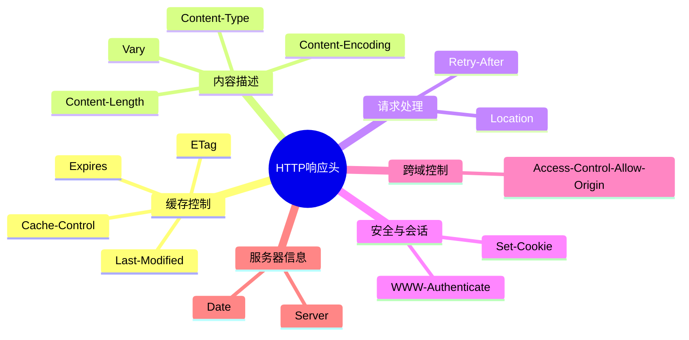

### HTTP 响应头详解

#### 一、思维导图分类



---

#### 二、核心响应头表格

| 响应头字段                      | 作用描述                          | 典型示例                                      |
| ------------------------------- | --------------------------------- | --------------------------------------------- |
| **Content-Type**                | 声明响应体的MIME类型和字符编码    | `text/html; charset=UTF-8`                    |
| **Cache-Control**               | 控制缓存策略（强缓存）            | `max-age=3600, no-cache`                      |
| **Set-Cookie**                  | 设置客户端Cookie                  | `sessionid=abc123; Path=/; HttpOnly`          |
| **Location**                    | 重定向目标地址（3xx状态码必配）   | `https://new.example.com`                     |
| **ETag**                        | 资源版本标识符（协商缓存）        | `"33a64df551425fcc55e4d42a148795d9"`          |
| **Access-Control-Allow-Origin** | 控制跨域资源共享（CORS）          | `*` 或 `https://trusted-site.com`             |
| **Content-Encoding**            | 声明响应体的压缩方式              | `gzip`、`br`                                  |
| **Vary**                        | 指定影响缓存差异化的请求头        | `Accept-Encoding, User-Agent`                 |
| **WWW-Authenticate**            | 要求客户端进行身份验证（401响应） | `Basic realm="Admin Area"`                    |
| **Retry-After**                 | 服务不可用时的重试等待时间        | `120`（秒）或 `Wed, 21 Oct 2025 07:28:00 GMT` |

---

#### 三、关键响应头深度解析

##### 1. 缓存控制组

```markdown
**Cache-Control 指令详解**
- `max-age=3600`：资源有效期（秒）
- `no-store`：禁止任何缓存
- `must-revalidate`：过期后必须验证
- `public`：允许中间代理缓存
- `private`：仅允许浏览器缓存

**ETag 工作流程**
1. 客户端携带 `If-None-Match: "etag_value"`
2. 服务器比对资源ETag
3. 匹配则返回 304 Not Modified
```

##### 2. 内容协商组

```markdown
**Vary 应用场景**
- `Vary: User-Agent`：针对不同设备返回差异化内容
- `Vary: Accept-Encoding`：区分压缩/未压缩版本
- `Vary: *`：表示响应内容完全动态

**Content-Encoding 注意点**
- 需与客户端的 `Accept-Encoding` 匹配
- 常见压缩算法性能对比：
  | 算法   | 压缩率 | 速度 | 兼容性 |
  |--------|--------|------|--------|
  | gzip   | 高     | 中   | 全支持 |
  | br     | 最高   | 快   | 现代浏览器 |
  | deflate| 低     | 快   | 部分老设备 |
```

##### 3. 安全相关头

```markdown
**Set-Cookie 属性控制**
- `Secure`：仅通过HTTPS传输
- `HttpOnly`：阻止JavaScript访问
- `SameSite`：控制跨站发送（Strict/Lax/None）
- `Partitioned`：防止跨站追踪（CHIPS规范）

**CORS 进阶配置**
```http
Access-Control-Allow-Methods: POST, GET, OPTIONS
Access-Control-Allow-Headers: Content-Type, Authorization
Access-Control-Max-Age: 86400  // 预检请求缓存时间
```

---

