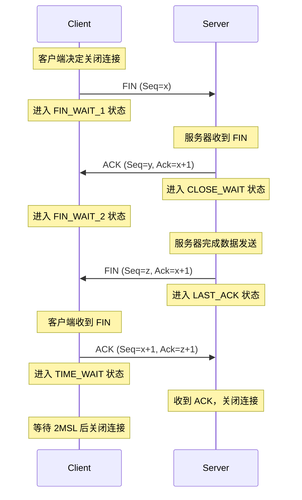

# **TCP**

TCP的全称是传输控制协议是一种面向连接的、可靠的、基于字节流的传输层通信协议。TCP 是面向连接的、可靠的流协议（流就是指不间断的数据结构）。

## TCP特点

它有以下几个特点：

**1）面向连接**

面向连接，是指发送数据之前必须在两端建立连接。建立连接的方法是“三次握手”，这样能建立可靠的连接。建立连接，是为数据的可靠传输打下了基础。

**2）仅支持单播传输**

每条TCP传输连接只能有两个端点，只能进行点对点的数据传输，不支持多播和广播传输方式。

**3）面向字节流**

TCP不像UDP一样那样一个个报文独立地传输，而是在不保留报文边界的情况下以字节流方式进行传输。

**4）可靠传输**

对于可靠传输，判断丢包、误码靠的是TCP的段编号以及确认号。TCP为了保证报文传输的可靠，就给每个包一个序号，同时序号也保证了传送到接收端实体的包的按序接收。然后接收端实体对已成功收到的字节发回一个相应的确认(ACK)；如果发送端实体在合理的往返时延(RTT)内未收到确认，那么对应的数据（假设丢失了）将会被重传。

**5）提供拥塞控制**

当网络出现拥塞的时候，TCP能够减小向网络注入数据的速率和数量，缓解拥塞。

**6）提供全双工通信**

TCP允许通信双方的应用程序在任何时候都能发送数据，因为TCP连接的两端都设有缓存，用来临时存放双向通信的数据。当然，TCP可以立即发送一个数据段，也可以缓存一段时间以便一次发送更多的数据段（最大的数据段大小取决于MSS）

## **TCP 段结构**

### **TCP 段头格式**

**总长度范围：** 20-60 字节

- **基础头长度：** 20 字节
- **选项字段长度：** 最多 40 字节（可选）

---

### **头字段说明**

1. **源端口地址（Source Port Address）**
    - **长度：** 16 位
    - **功能：** 保存发送数据段的应用程序的端口地址。
2. **目标端口地址（Destination Port Address）**
    - **长度：** 16 位
    - **功能：** 保存接收数据段的主机中的应用程序的端口地址。
3. **序列号（Sequence Number）**
    - **长度：** 32 位
    - **功能：** 保存该段中第一个字节的字节号，用于在接收端重新组装乱序接收的消息段。
4. **确认号（Acknowledgement Number）**
    - **长度：** 32 位
    - **功能：** 保存接收方期望接收的下一个字节号，用于确认先前字节已成功接收。
5. **头长度（Header Length, HLEN）**
    - **长度：** 4 位
    - **功能：** 指示 TCP 头的长度，单位为 4 字节字。
    - **取值范围：** 5（20 字节）到 15（60 字节）。
6. **控制标志（Control Flags）**
    - **长度：** 6 位（每个标志 1 位）
    - **功能：** 控制连接建立、终止、中止、流量控制、传输模式等。
    - **标志：**
        - **URG：** 紧急指针有效
        - **ACK：** 确认号有效（用于累积确认）
        - **PSH：** 请求推送
        - **RST：** 重置连接
        - **SYN：** 同步序列号
        - **FIN：** 终止连接
7. **窗口大小（Window Size）**
    - **长度：** 16 位
    - **功能：** 表示发送 TCP 的窗口大小（以字节为单位）。
8. **校验和（Checksum）**
    - **长度：** 16 位
    - **功能：** 保存错误控制的校验和（TCP 中为强制字段）。
9. **紧急指针（Urgent Pointer）**
    - **长度：** 16 位
    - **功能：** 仅当 URG 标志有效时使用，指向需要紧急处理的数据。
    - **计算方式：** 该字段的值与序列号相加，得到最后一个紧急字节的字节号。

## TCP的3次握手过程

TCP 3 次握手是通过 TCP/IP 网络在两个设备之间建立可靠连接的基本过程。它涉及三个步骤：**SYN（同步）、SYN-ACK（同步-确认）和ACK（确认）。**在握手期间，客户端和服务器交换初始序列号并确认连接建立。

### TCP 三次握手机制详解

TCP 通过**重传肯定确认（PAR, Positive Acknowledgment with Retransmission）机制提供可靠的通信。传输层的协议数据单元（PDU）称为段（Segment）**。PAR 机制的核心思想是：发送方会重新发送数据单元，直到收到接收方的确认（ACK）为止。如果接收方检测到数据单元损坏（通过校验和等错误检测机制），则会丢弃该段，发送方必须重新发送未收到确认的数据单元。

在 TCP 连接建立过程中，发送方（客户端）和接收方（服务器）之间需要交换三个报文段，这一过程称为**三次握手（Three-Way Handshake）**。以下是三次握手的详细步骤：

---

### **三次握手步骤**

### **步骤 1：SYN（同步请求）**

- **发送方：** 客户端
- **动作：** 客户端向服务器发送一个 SYN 报文段，请求建立连接。
- **字段说明：**
    - **SYN 标志位：** 设置为 1，表示这是一个同步请求。
    - **序列号（Sequence Number）：** 客户端随机生成一个初始序列号（ISN），用于标识后续数据段的起始字节。
- **目的：** 告知服务器客户端希望建立连接，并指定初始序列号。

---

### **步骤 2：SYN + ACK（同步确认）**

- **发送方：** 服务器
- **动作：** 服务器收到客户端的 SYN 请求后，回复一个 SYN-ACK 报文段。
- **字段说明：**
    - **SYN 标志位：** 设置为 1，表示服务器同意建立连接。
    - **ACK 标志位：** 设置为 1，表示确认收到客户端的 SYN 请求。
    - **确认号（Acknowledgment Number）：** 值为客户端发送的序列号加 1（即 ISN + 1），表示服务器期望接收的下一个字节。
    - **序列号（Sequence Number）：** 服务器随机生成一个初始序列号（ISN），用于标识后续数据段的起始字节。
- **目的：** 确认客户端的连接请求，并告知客户端服务器的初始序列号。

---

### **步骤 3：ACK（确认）**

- **发送方：** 客户端
- **动作：** 客户端收到服务器的 SYN-ACK 报文段后，回复一个 ACK 报文段。
- **字段说明：**
    - **ACK 标志位：** 设置为 1，表示确认收到服务器的 SYN-ACK 报文段。
    - **确认号（Acknowledgment Number）：** 值为服务器发送的序列号加 1（即 ISN + 1），表示客户端期望接收的下一个字节。
- **目的：** 确认服务器的响应，完成连接的建立。

### **三次握手示意图**

---

### **1. TCP 三次握手中 SYN 标志的作用是什么？**

- **作用：** SYN 标志用于握手的初始步骤，通知服务器客户端希望建立连接，并指定初始序列号。
- **意义：** 它确保双方能够同步序列号，为后续数据传输提供有序性。

### **2. 为什么 TCP/IP 网络中需要三次握手？**

- **原因：**
    - **可靠性：** 确保客户端和服务器都准备好进行数据传输。
    - **同步序列号：** 双方交换初始序列号，确保数据段按正确顺序传输。
    - **防止历史连接干扰：** 通过随机生成的初始序列号，避免旧连接的报文段干扰新连接。

### **3. TCP 三次握手对网络安全有何影响？**

- **影响：**
    - **防止未经授权的连接：** 握手过程要求双方确认连接请求，防止恶意用户建立非法连接。
    - **增强安全性：** 通过序列号同步和确认机制，减少数据被篡改或伪造的风险。
- **三次握手是 TCP 连接建立的核心机制，确保通信双方能够可靠地同步和确认连接。**
- **通过 SYN、SYN-ACK 和 ACK 三个报文段的交换，TCP 实现了连接的建立和序列号的同步。**
- **这一机制为后续的数据传输提供了可靠的基础。**

这种机制不仅确保了连接的可靠性，还为后续的数据传输提供了有序性和错误检测能力。

## TCP的定时器

### TCP 定时器详解

TCP 定时器是 TCP 协议中用于确保数据传输可靠性和连接管理有效性的关键机制。以下是 TCP 中四种主要定时器的详细说明：

---

### **1. 重传定时器（Retransmission Timer）**

重传定时器用于处理数据包丢失的情况。当 TCP 发送一个数据段时，启动重传定时器。如果在定时器超时前未收到确认（ACK），则重传该数据段。

### **关键概念**

- **RTO（Retransmission Timeout）**：重传超时时间，基于 RTT（Round Trip Time，往返时间）计算。
- **RTTm（Measured RTT）**：实际测量的往返时间。
- **RTTs（Smoothed RTT）**：RTTm 的加权平均值，用于平滑 RTT 的波动。
    - 计算公式：`RTTs = (1 - α) * RTTs + α * RTTm`，默认 α = 1/8。
- **RTTd（Deviated RTT）**：RTT 的偏差，用于更准确地计算 RTO。
    - 计算公式：`RTTd = (1 - β) * RTTd + β * |RTTm - RTTs|`，默认 β = 1/4。
- **RTO 计算公式**：`RTO = RTTs + 4 * RTTd`。

### **作用**

- 确保丢失的数据段能够及时重传。
- 动态调整 RTO 以适应网络条件的变化。

---

### **2. 持久定时器（Persistent Timer）**

持久定时器用于处理接收方窗口大小为 0 的情况（即接收方无法接收更多数据）。发送方在收到窗口大小为 0 的 ACK 后，启动持久定时器。

### **工作原理**

- 定时器超时后，发送方发送一个**探测段**（Probe Segment），包含 1 字节的新数据。
- 探测段触发接收方重新发送 ACK，以更新窗口大小。

### **作用**

- 防止因接收方窗口大小为 0 导致的死锁。
- 确保发送方能够及时检测到接收方窗口的变化。

---

### **3. 保活定时器（Keepalive Timer）**

保活定时器用于检测长时间空闲的连接是否仍然有效。如果连接长时间没有数据传输，定时器会触发探测。

### **工作原理**

- 默认超时时间为 2 小时。
- 如果超时后未收到客户端的数据，服务器发送一个探测段。
- 如果连续发送 10 个探测段（每个间隔 75 秒）仍未收到响应，则关闭连接。

### **作用**

- 检测客户端是否崩溃或断开连接。
- 释放无效连接占用的资源。

---

### **4. 时间等待定时器（Time Wait Timer）**

时间等待定时器用于 TCP 连接终止阶段。在发送最后一个 ACK 后，启动时间等待定时器。

### **工作原理**

- 定时器通常设置为**2 倍的最大段生存时间（MSL，Maximum Segment Lifetime）**，默认 MSL 为 2 分钟。
- 在定时器超时前，防止相同的端口被快速重用。

### **作用**

- 确保网络中残留的数据段能够被正确处理。
- 防止旧连接的重复数据段干扰新连接。

---

### **总结**

TCP 定时器在确保数据传输的可靠性和连接管理的有效性方面发挥着关键作用：

1. **重传定时器**：处理数据包丢失。
2. **持久定时器**：解决接收方窗口大小为 0 的问题。
3. **保活定时器**：检测长时间空闲的连接。
4. **时间等待定时器**：确保连接终止时的数据完整性。

## TCP断开链接

### TCP 连接终止详解（结合 Mermaid 时序图）

TCP 连接终止是 TCP 协议中用于优雅地关闭客户端和服务器之间连接的过程。与 TCP 三次握手类似，TCP 连接终止也通过特定的步骤和标志位（如 FIN 和 ACK）来完成。以下是 TCP 连接终止的详细说明，并结合 Mermaid 时序图直观展示。

---

### **TCP 连接终止的两种方式**

1. **优雅连接释放（Graceful Connection Release）**
双方通过交换 FIN 和 ACK 报文段，逐步关闭连接。
2. **强制连接释放（Abrupt Connection Release）**
通过发送 RST（Reset）报文段强制关闭连接。

---

### **优雅连接释放的过程**

优雅连接释放是 TCP 连接终止的标准方式，分为 4 个步骤。以下是 Mermaid 时序图展示：

### **步骤详解**

1. **客户端发送 FIN**
    - **客户端决定关闭连接，发送一个 TCP 报文段，其中 FIN 标志位设置为 1。**
    - **客户端进入 FIN_WAIT_1 状态，等待服务器的 ACK。**
2. **服务器发送 ACK**
    - **服务器收到 FIN 报文段后，发送一个 ACK 报文段 确认收到 FIN。**
    - **服务器进入 CLOSE_WAIT 状态，准备关闭连接。**
    - **客户端收到 ACK 后，进入 FIN_WAIT_2 状态，等待服务器的 FIN。**
3. **服务器发送 FIN**
    - **服务器完成数据发送后，发送一个 FIN 报文段，请求关闭连接。**
    - **服务器进入 LAST_ACK 状态，等待客户端的 ACK。**
4. **客户端发送 ACK**
    - **客户端收到 FIN 报文段后，发送一个 ACK 报文段 确认收到 FIN。**
    - **客户端进入 TIME_WAIT 状态，等待一段时间（通常为 2 倍的最大段生存时间，MSL）以确保服务器收到 ACK。**
    - **服务器收到 ACK 后，关闭连接。**
    - **客户端在 TIME_WAIT 状态结束后，关闭连接。**

---

### **2. 强制连接释放（Abrupt Connection Release）**

强制连接释放通过发送 **RST（Reset）报文段** 立即终止连接，通常用于异常情况。

### **触发条件**

1. **收到无效的 TCP 报文段**
    - 例如，收到一个不存在的连接的报文段。
2. **检测到网络攻击或异常**
    - 例如，收到带有无效头部的报文段。
3. **资源不足或远程主机不可达**
    - 例如，缺乏资源支持连接，或远程主机停止响应。

### **RST 报文段的内容**

- 如果 RST 报文段不属于任何现有连接，则序列号字段为 0。
- 如果 RST 报文段属于现有连接，则序列号字段为当前连接的序列号，确认号字段为下一个期望的序列号。

---

### **TIME_WAIT 状态的作用**

1. **确保 ACK 到达**：如果客户端的 ACK 丢失，服务器会重传 FIN，客户端可以重新发送 ACK。
2. **防止旧连接的重复数据段干扰新连接**：等待 2MSL 确保网络中残留的数据段被丢弃。

---

# User Datagram Protocol (UDP) 用户数据报协议 (UDP)

**用户数据报协议 (UDP)** 是传输层协议，属于 Internet 协议族的一部分，通常称为 UDP/IP 协议族。与 TCP 不同，UDP 是一种**不可靠且无连接的协议**。因此，在数据传输之前不需要建立连接。UDP 主要用于在网络上建立低延迟且能够容忍丢包的连接，并支持进程间通信。

---

## 什么是用户数据报协议 (UDP)？

用户数据报协议 (UDP) 是 Internet 协议 (IP) 族的核心协议之一。它是一种用于在互联网上进行时间敏感传输的通信协议，例如视频播放或 [DNS 查询](https://www.geeksforgeeks.org/dns-look-up/)。与传输控制协议 (TCP) 不同，UDP 是无连接的，并且不保证数据传输的可靠性、顺序或错误检查，这使得它成为某些类型数据传输的轻量级且高效的选择。

---

## **UDP 报头**

UDP 报头是一个**8 字节**的固定且简单的报头，而 TCP 报头的长度可能从 20 字节到 60 字节不等。UDP 报头的前 8 个字节包含所有必要的报头信息，其余部分为数据。UDP 的端口号字段各为 16 位，因此端口号的范围为 0 到 65535；端口号 0 被保留。端口号用于区分不同的用户请求或进程。

### **UDP 报头字段说明**

- **源端口 (Source Port)**：2 字节长的字段，用于标识发送方的[端口号](https://www.geeksforgeeks.org/what-is-ports-in-networking/)。
- **目的端口 (Destination Port)**：2 字节长的字段，用于标识接收方的端口号。
- **长度 (Length)**：2 字节长的字段，表示 UDP 报头和数据的总长度。
- **校验和 (Checksum)**：2 字节长的字段，用于错误检测。它是 UDP 报头、IP 报头的伪报头以及数据的补码和的 16 位补码。如果数据长度为奇数，则在末尾填充零字节以使其成为偶数。

**注意**：与 TCP 不同，UDP 的校验和计算是可选的。UDP 不提供错误控制或流量控制，因此依赖于 IP 和 ICMP 进行错误报告。此外，UDP 通过端口号来区分不同的用户请求。

---

## **UDP 的应用**

UDP 主要用于以下场景：

1. **简单请求-响应通信**：当数据量较小且对流量控制和错误控制要求不高时，UDP 是一个理想的选择。
2. **多播 (Multicasting)**：UDP 支持数据包交换，因此适合多播应用。
3. **路由更新协议**：例如 [RIP（路由信息协议）](https://www.geeksforgeeks.org/routing-information-protocol-rip/)。
4. **实时应用**：如语音和视频传输，这些应用无法容忍数据包传输中的不均匀延迟。
5. **VoIP（互联网协议语音）**：例如 Skype 和 WhatsApp 使用 UDP 进行实时语音通信。由于语音通信对延迟敏感，UDP 能够确保快速高效的数据传输。
6. **DNS（域名系统）**：DNS 查询通常较小且需要快速响应，因此 UDP 是 DNS 查询/响应的理想协议。
7. **DHCP（动态主机配置协议）**：UDP 用于为网络设备动态分配 IP 地址。DHCP 消息通常较小，且对数据包丢失或重传的延迟不敏感。

### **其他使用 UDP 的协议**

- NTP（网络时间协议）
- BOOTP、DHCP
- NNP（网络新闻协议）
- TFTP、RTSP、RIP
- 当日引用协议 (Quote of the Day Protocol)

### **应用层通过 UDP 实现的功能**

- 路由追踪 (Trace Route)
- 路由记录 (Record Route)
- 时间戳 (Timestamp)

---

## **UDP 的工作原理**

UDP 从[网络层](https://www.geeksforgeeks.org/network-layer-services-packetizing-routing-and-forwarding/)获取数据报，附加其报头后直接发送给用户。由于 UDP 不建立连接且不进行复杂的错误检查，因此它的传输速度非常快。

---

## **UDP 的优缺点**

### **优点**

1. **低延迟**：由于不需要建立连接和进行复杂的错误检查，UDP 的传输速度非常快。
2. **轻量级**：UDP 报头简单，开销小，适合传输小数据包。
3. **支持多播**：UDP 能够将数据包同时发送给多个接收方。

### **缺点**

1. **不可靠**：UDP 不保证数据包的到达、顺序或完整性。
2. **无流量控制**：UDP 无法控制发送速率，可能导致网络拥塞。
3. **无错误恢复**：如果数据包丢失或损坏，UDP 不会尝试重传。

---

# TCP和UDP的区别

## TCP vs UDP: 传输控制协议与用户数据报协议对比

| **对比项** | **传输控制协议 (TCP)** | **用户数据报协议 (UDP)** |
| --- | --- | --- |
| **服务类型** | 面向连接的协议。通信设备在传输数据前需建立连接，传输后需关闭连接。 | 面向数据报的协议。无需建立、维持或终止连接，适合广播和组播传输。 |
| **可靠性** | 可靠，确保数据传送到目标路由器。 | 不可靠，无法保证数据传送到目的地。 |
| **错误检查机制** | 提供全面的错误检查机制，包括流量控制和数据确认。 | 仅提供基于校验和的基本错误检查机制。 |
| **确认机制** | 有确认段。 | 无确认段。 |
| **数据顺序** | 数据按顺序到达接收者。 | 无数据顺序，需由应用层管理。 |
| **速度** | 较慢。 | 更快、更简单、更高效。 |
| **重传机制** | 支持丢失数据包的重传。 | 不支持丢失数据包的重传。 |
| **头部长度** | 可变长度头部 (20-60 字节)。 | 固定长度头部 (8 字节)。 |
| **资源占用** | 重量级。 | 轻量级。 |
| **握手机制** | 使用 SYN、ACK、SYN-ACK 等握手。 | 无连接协议，无需握手。 |
| **广播支持** | 不支持广播。 | 支持广播。 |
| **典型应用** | HTTP、HTTPS、FTP、SMTP、Telnet 等。 | DNS、DHCP、TFTP、SNMP、RIP、VoIP 等。 |
| **数据流类型** | 字节流。 | 消息流。 |
| **开销** | 较低，但高于 UDP。 | 非常低。 |
| **应用场景** | 适用于需要安全可靠通信的场景，如电子邮件、网页浏览、军事服务等。 | 适用于需要快速通信但对可靠性要求不高的场景，如 VoIP、游戏流、视频和音乐流等 |

