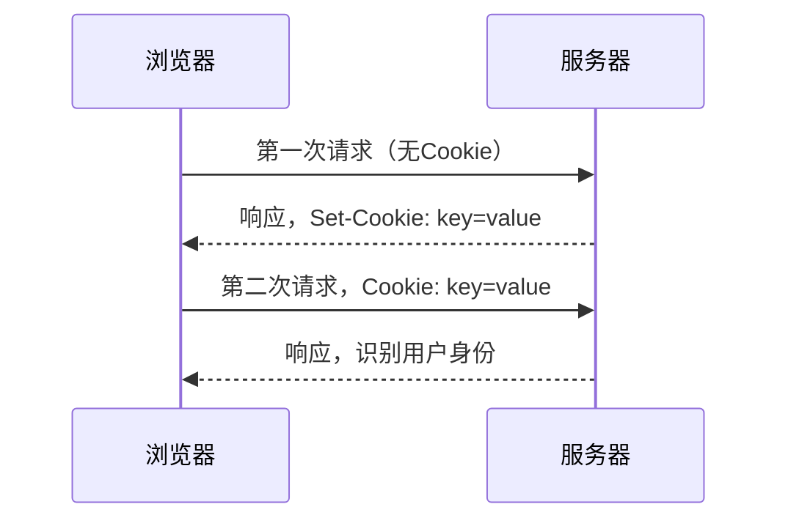
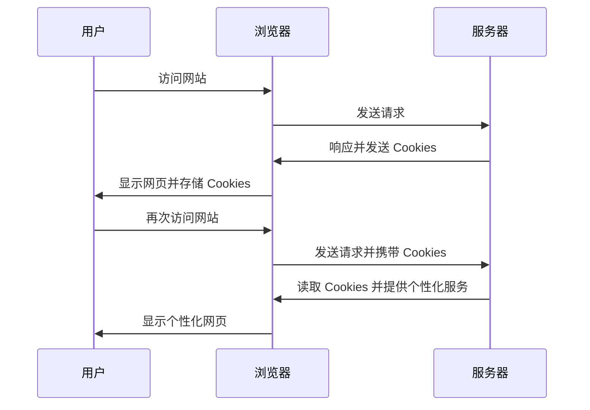

### HTTP中的Cookie：让“健忘”的服务器记住用户

HTTP协议是一个“无状态”的协议，这既是它的优点，也是它的缺点。优点是服务器没有状态差异，可以轻松组成集群；缺点是无法支持需要记录状态的事务操作，比如电商购物、论坛发帖等场景。

为了解决这个问题，HTTP协议引入了**Cookie**技术。Cookie为HTTP协议增加了一种“记忆能力”，让服务器能够记住用户的“身份”，从而实现会话管理和个性化服务。今天，我们就来聊聊Cookie的原理、工作机制以及它的应用场景。

---

### **什么是Cookie？**

不知道你是否看过克里斯托弗·诺兰的经典电影《记忆碎片》（Memento）。电影中的主角患有短期失忆症，记不住最近发生的事情。为了弥补记忆的缺失，他通过纹身、贴纸条、拍立得照片等手段，在外界留下提示信息。一旦失忆，他可以通过这些提示快速重建记忆，继续未完成的事情。

HTTP协议的“无状态”特性，就像电影中的主角一样——服务器处理完一个请求后，立刻就会忘记这个请求的存在。即使这个请求引发了错误，下次再访问时，服务器依然会“热情招待”，仿佛从未见过你。

为了让服务器具备“记忆能力”，Cookie应运而生。它的核心思想是：既然服务器记不住，那就让客户端帮忙记住。服务器通过`Set-Cookie`字段给客户端贴上一张“小纸条”，上面写了一些只有服务器才能理解的数据。客户端在下次请求时，会自动带上这张“小纸条”，服务器通过读取Cookie就能认出用户的身份。

---

### **Cookie的工作过程**

Cookie的传递过程涉及两个关键字段：

- **`Set-Cookie`**：服务器通过响应头字段，将Cookie发送给客户端。
- **`Cookie`**：客户端通过请求头字段，将Cookie发回给服务器。

以下是Cookie的工作流程图：



具体过程如下：

1. 用户通过浏览器第一次访问服务器时，服务器会在响应头中添加`Set-Cookie`字段，将一个唯一的标识符（如`key=value`）发送给浏览器。
2. 浏览器收到响应后，会将`Set-Cookie`中的内容保存下来。
3. 当用户再次访问时，浏览器会自动在请求头中添加`Cookie`字段，将之前保存的标识符发回给服务器。
4. 服务器通过读取`Cookie`字段，识别出用户的身份，并提供个性化的服务。

如果服务器需要存储多个信息，可以在`Set-Cookie`中添加多个键值对，例如：

```
Set-Cookie: user_id=12345; session_token=abcdef

```

浏览器在发送时，会将这些键值对用分号隔开，例如：

```
Cookie: user_id=12345; session_token=abcdef

```

---

### **Cookie的属性**

为了让Cookie更安全、更灵活，HTTP协议为Cookie定义了一些属性。这些属性可以限制Cookie的生命周期、作用域和安全性。以下是一些常见的属性：

### 1. **有效期**

Cookie的有效期通过`Expires`和`Max-Age`属性设置：

- **`Expires`**：指定一个绝对时间点，表示Cookie的过期时间。
- **`Max-Age`**：指定一个相对时间（单位为秒），从收到Cookie时开始计算。

如果同时设置了`Expires`和`Max-Age`，浏览器会优先使用`Max-Age`。

### 2. **作用域**

Cookie的作用域通过`Domain`和`Path`属性设置：

- **`Domain`**：指定Cookie所属的域名。例如，`Domain=example.com`表示Cookie可以被`example.com`及其子域名（如`api.example.com`）访问。
- **`Path`**：指定Cookie所属的路径。例如，`Path=/admin`表示Cookie只能在`/admin`路径及其子路径下使用。

### 3. **安全性**

为了防止Cookie被窃取或滥用，HTTP协议定义了以下安全属性：

- **`HttpOnly`**：禁止通过JavaScript访问Cookie，防止跨站脚本攻击（XSS）。
- **`Secure`**：只允许通过HTTPS协议传输Cookie，防止明文传输导致的泄露。
- **`SameSite`**：限制Cookie的跨站发送，防止跨站请求伪造（CSRF）。
    - `SameSite=Strict`：严格禁止跨站发送Cookie。
    - `SameSite=Lax`：允许GET/HEAD等安全方法跨站发送Cookie，但禁止POST跨站发送。

---

### **Cookie的应用场景**

### 1. **身份识别**

Cookie最常见的用途是保存用户的登录信息，实现会话管理。例如，当你登录某电商网站时，服务器会通过`Set-Cookie`字段发送一个包含用户ID的Cookie，例如：

```
Set-Cookie: user_id=12345

```

之后，你在网站中浏览商品、下单购物时，浏览器会自动将这个Cookie发回给服务器，服务器通过读取`user_id`识别出你的身份，从而免去重复登录的麻烦。

### 2. **广告跟踪**

Cookie也被广泛用于广告跟踪。例如，当你访问某个网站时，广告商（如Google）可能会通过第三方Cookie记录你的行为。当你访问其他网站时，广告商可以通过Cookie识别出你的身份，并根据你的浏览记录推送相关广告。

这种Cookie被称为“第三方Cookie”，因为它的存储域名与当前访问的网站不同。由于第三方Cookie可能侵犯用户隐私，近年来浏览器厂商（如Chrome、Firefox）逐渐限制了第三方Cookie的使用。

---

### **Cookie的局限性**

尽管Cookie非常实用，但它也有一些局限性：

1. **存储容量有限**：每个Cookie的大小通常不能超过4KB。
2. **性能开销**：每次请求都会携带Cookie，增加了网络传输的开销。
3. **安全性问题**：虽然有`HttpOnly`和`Secure`等属性保护，但Cookie仍然可能被窃取或滥用。

为了弥补这些不足，现代浏览器引入了多种本地存储技术，如`localStorage`和`sessionStorage`。然而，Cookie仍然是最通用、兼容性最强的客户端数据存储手段。

---

### **总结**

今天，我们学习了HTTP协议中的Cookie技术：

1. **Cookie是服务器委托浏览器存储的数据，让服务器具备了“记忆能力”。**
2. **Cookie通过`Set-Cookie`和`Cookie`字段在客户端和服务器之间传递。**
3. **Cookie的属性（如有效期、作用域、安全性）可以增强其功能和安全性。**
4. **Cookie的常见用途包括身份识别和广告跟踪。**

最后，我们用一张总结图回顾Cookie的工作原理：



- **用户访问网站**：用户通过浏览器访问某个网站。
    
    ---
    
- **服务器发送 Cookies**：服务器在响应中发送 Cookies 到用户的浏览器。
- **浏览器存储 Cookies**：浏览器将 Cookies 存储在本地。
- **后续请求携带 Cookies**：用户在后续访问该网站时，浏览器会自动将 Cookies 发送给服务器。
- **服务器读取 Cookies**：服务器读取 Cookies 中的信息，提供个性化的服务。

# 🤗 总结归纳

1.Cookie 是服务器委托浏览器存储的一些数据，让服务器有了“记忆能力”；

2. 响应报文使用 Set-Cookie 字段发送“key=value”形式的 Cookie 值； 

3. 请求报文里用 Cookie 字段发送多个 Cookie 值； 

4. 为了保护 Cookie，还要给它设置有效期、作用域等属性，常用的有 Max-Age、 Expires、              Domain、HttpOnly 等； 

5. Cookie 最基本的用途是身份识别，实现有状态的会话事务。