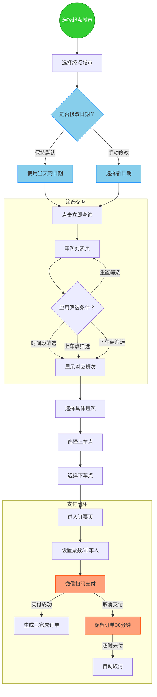

## 第一个模块 选择城市

基于用户的测试点 每一个起点城市都需要有对应的班次信息？
**1. 城市热度划分：**
   - **热门城市**：用户常选，班次密集 (例如：广州、深圳)。
   - **普通城市**：有一定班次，选择频率适中。
   - **冷门城市**：班次较少或线路较为特殊。

**2. 地域划分（可与热度结合）：**
   根据应用界面和实际运营情况，我们将城市划分为以下主要地域等价类：

   - **EC-Region-PRD (珠三角地区)**:
     - 测试点：选择此区域内城市作为起点/终点，测试区域内互通、跨区域互通。
     - 示例城市：广州、深圳、佛山、东莞、中山、珠海、惠州、江门、肇庆（根据截图和实际情况列举）。
   - **EC-Region-WestGD (粤西地区)**:
     - 测试点：同上。
     - 示例城市：湛江市区、廉江、茂名、阳江。
   - **EC-Region-EastGD (粤东地区)**:
     - 测试点：同上。
     - 示例城市：（根据实际情况列举，如汕头、潮州等）
   - **EC-Region-NorthGD (粤北地区)**:
     - 测试点：同上。
     - 示例城市：（根据实际情况列举，如韶关、清远等）
   - **EC-Region-GX (广西地区)**:
     - 测试点：测试跨省线路。
     - 示例城市：（根据实际情况列举）
   - **EC-Region-Other (其他地区)**:
     - 测试点：测试其他未明确分类的城市或特殊线路。
     - 示例城市：（根据实际情况列举）

**测试用例设计思路示例（结合地域与热度）：**
*   从“珠三角-热门城市”（如广州）出发，到“粤西-普通城市”（如廉江）。
*   从“粤北-冷门城市”出发，到“珠三角-热门城市”（如深圳）。
*   从“广西地区城市”出发，到“珠三角地区城市”。
*   测试同一地域内的城市互通（如“珠三角-广州”到“珠三角-佛山”）。
*   尝试选择一个起点后，查看终点城市列表是否根据地域或实际班次有所筛选。

**测试用例表格模板**

| 测试编号   | 测试标题                                       | 测试目的                                                       | 前置条件                                                     | 测试步骤                                                                                                                               | 预期结果                                                                                               | 实际结果 | 备注                                           |
| :--------- | :--------------------------------------------- | :------------------------------------------------------------- | :----------------------------------------------------------- | :------------------------------------------------------------------------------------------------------------------------------------- | :--------------------------------------------------------------------------------------------------------------------- | :------- | :--------------------------------------------- |
| TC\_模块\_XXX | [清晰概括测试场景]                             | [说明此用例要验证的功能点或用户场景]                           | [执行测试前系统/用户需要处于的状态，例如：用户已登录，进入XX页面] | 1. [步骤1] 2. [步骤2] 3. [更多步骤...]                                                                             | [描述在执行测试步骤后，系统应该表现出的正确行为或状态]                                                                 |          | [可选，用于记录特定测试数据、环境配置或观察到的现象] |

**“选择城市”模块测试用例示例**

以下是一些基于“城市热度”和“地域划分”的测试用例示例：

| 测试编号    | 测试标题                                                     | 测试目的                                                                 | 前置条件                                                                 | 测试步骤                                                                                                                                                                                             | 预期结果                                                                                                                                                             | 实际结果 | 备注                                                                 |
| :---------- | :----------------------------------------------------------- | :----------------------------------------------------------------------- | :----------------------------------------------------------------------- | :--------------------------------------------------------------------------------------------------------------------------------------------------------------------------------------------------- | -------------------------------------------------------------------------------------------------------------------------------------------------------------------: | :------- | :------------------------------------------------------------------: |
| TC\_City\_001 | 验证珠三角热门城市间班次查询 (例如：广州到深圳)                | 确保热门城市之间的核心线路可以正常查询到班次。                             | 用户已打开AA巴士小程序，并处于车票查询首页，起点/终点城市选择功能可用。      | 1. 在起点城市选择“广州”。 2. 在终点城市选择“深圳”。 3. 保持默认日期（当天）或选择一个未来的有效日期。 4. 点击“立即查询”按钮。                                                                 | 系统应能正确显示从广州到深圳的班次列表（如果当天有班次）。 如果当天确实无班次，应给出明确提示（如“未查询到相关班次”）。                                                       |  | 可记录查询日期。                                                       |
| TC\_City\_002 | 验证珠三角热门城市到粤西普通城市班次查询 (例如：广州到廉江)      | 确保跨区域、不同热度城市间的线路可以正常查询。                           | 用户已打开AA巴士小程序，并处于车票查询首页，起点/终点城市选择功能可用。      | 1. 在起点城市选择“广州”。 2. 在终点城市选择“廉江”。 3. 选择一个未来的有效日期。 4. 点击“立即查询”按钮。                                                                                   | 系统应能正确显示从广州到廉江的班次列表（如果所选日期有班次）。 如果无班次，应给出明确提示。                                                                               |          |                                                                      |
| TC\_City\_003 | 验证粤北冷门城市到珠三角热门城市班次查询 (例如：韶关到深圳)      | 确保从相对冷门区域出发到热门区域的线路查询功能正常。                     | 用户已打开AA巴士小程序，并处于车票查询首页，起点/终点城市选择功能可用。      | 1. 在起点城市选择“韶关”（假设为粤北城市）。 2. 在终点城市选择“深圳”。 3. 选择一个未来的有效日期。 4. 点击“立即查询”按钮。                                                                       | 系统应能正确显示从韶关到深圳的班次列表（如果所选日期有班次）。 如果无班次，应给出明确提示。                                                                               |          | “冷门城市”的定义参考 <mcfile name="AAbus项目测试.md" path="/Users/fkycoya/Documents/Code/coyadevopsBlog/docs/src/Notes/Projects/AAbus项目测试.md"></mcfile> 中的描述。 |
| TC\_City\_004 | 验证选择起点城市后，终点城市列表的动态筛选行为                 | 验证当用户选择起点城市后，终点城市列表是否会智能筛选，只展示可通达的城市。 | 用户已打开AA巴士小程序，并处于车票查询首页，起点/终点城市选择功能可用。      | 1. 在起点城市选择一个有明确班次通往部分城市但并非所有城市的起点（例如“广州”）。 2. 打开终点城市选择列表。 3. 观察列表中显示的城市。                                                                   | **理想预期**：终点城市列表应只显示与“广州”之间有实际巴士线路的城市。 **实际观察**：记录列表是显示所有城市还是经过筛选的城市。                                                     |          | 此用例依赖于系统是否设计了此动态筛选功能。                               |
| TC\_City\_005 | 验证选择两个已知无直达班次的城市组合 (例如：长沙到揭阳)      | 验证系统对于查询无直达班次组合时的用户提示是否友好和明确。                 | 用户已打开AA巴士小程序，并处于车票查询首页，起点/终点城市选择功能可用。      | 1. 在起点城市选择“五华”（假设）。 2. 在终点城市选择“阳春”（假设）。 3. 选择一个未来的有效日期。 4. 点击“立即查询”按钮。                                                                           | 系统应明确提示“未查询到相关班次”、“暂无直通班次”或类似的友好信息，不应出现程序错误或长时间无响应。                                                                         |          | 需要提前确认或假设这两个城市间确实无直达班次。  
| TC\_City\_006 | **BUG验证**：起点为“长沙”时，查询任意终点城市的班次情况        | 验证当起点选择为“长沙”时，系统是否能正确处理。当前发现此场景存在BUG，始终返回空班次。 | 用户已打开AA巴士小程序，并处于车票查询首页，起点/终点城市选择功能可用。      | 1. 在起点城市选择“长沙”。 2. 在终点城市选择任意一个其他城市（例如：广州、深圳、武汉等）。 3. 选择一个有效的日期（例如：当天或未来某天）。 4. 点击“立即查询”按钮。                                     | **预期**：  a. 如果长沙与所选终点城市之间确实有班次，应显示班次列表。  b. 如果长沙与所选终点城市之间确实无班次，应明确提示“未查询到相关班次”。  c. 系统不应崩溃或显示错误。 |          | **BUG** - 当前观察到：无论选择哪个终点城市和有效日期，均显示空班次或无结果。 |                       |

// ... existing code ...
   - **EC-Region-Other (其他地区)**:
     - 测试点：测试其他未明确分类的城市或特殊线路。
     - 示例城市：（根据实际情况列举）

**测试用例设计思路示例（结合地域与热度）：**
*   从“珠三角-热门城市”（如广州）出发，到“粤西-普通城市”（如廉江），选择有效日期进行查询。
*   从“粤北-冷门城市”出发，到“珠三角-热门城市”（如深圳），选择有效日期进行查询。
*   从“广西地区城市”出发，到“珠三角地区城市”，选择有效日期进行查询。
*   测试同一地域内的城市互通（如“珠三角-广州”到“珠三角-佛山”），选择有效日期进行查询。
*   尝试选择一个起点后，查看终点城市列表是否根据地域或实际班次有所筛选。
*   针对以上任一有效城市组合，尝试选择一个无效日期（如昨天），验证系统的提示。

发现bug 中 比如长沙到任意一个城市都是 空班次

## 第二个模块 时间选择

此模块对应流程图中的 `C{是否修改日期？}`、`D[使用当天的日期]` 和 `E[选择新日期]`。
核心测试点是验证日期选择的有效性及系统对不同日期选择的响应。

**“选择城市”模块测试用例示例**
                                                           |

**“时间选择”模块测试用例示例**

| 测试编号    | 测试标题                                                     | 测试目的                                                                 | 前置条件                                                                 | 测试步骤                                                                                                                                                                                             | 预期结果                                                                                                                                                             | 实际结果 | 备注                                                                 |
| :---------- | :----------------------------------------------------------- | :----------------------------------------------------------------------- | :----------------------------------------------------------------------- | :--------------------------------------------------------------------------------------------------------------------------------------------------------------------------------------------------- | :------------------------------------------------------------------------------------------------------------------------------------------------------------------- | :------- | :------------------------------------------------------------------- |
| TC\_Time\_001 | 验证使用默认日期（当天）查询班次                             | 确保用户不修改日期时，系统默认使用当天日期进行有效查询。                   | 用户已打开AA巴士小程序，进入车票查询首页，已选择有效的起点和终点城市。     | 1. 不进行任何日期修改操作。 2. 点击“立即查询”按钮。                                                                                                                                                  | 系统应使用当天日期查询班次。 如果当天有班次，则显示班次列表；如果当天无班次，则提示“未查询到相关班次”。                                                                       |          | 确认系统显示的默认日期确实是当天。                                       |
| TC\_Time\_002 | 验证选择未来有效日期查询班次                                 | 确保用户可以选择并使用未来的有效日期成功查询班次。                         | 用户已打开AA巴士小程序，进入车票查询首页，已选择有效的起点和终点城市。     | 1. 点击日期选择控件。 2. 选择一个未来的日期（例如明天或下周的某一天）。 3. 确认所选日期显示正确。 4. 点击“立即查询”按钮。                                                                       | 系统应使用用户选择的未来日期查询班次。 如果所选日期有班次，则显示班次列表；如果无班次，则提示“未查询到相关班次”。                                                                 |  |                                                                      |
| TC\_Time\_003 | 验证选择过去无效日期                                         | 验证系统对选择过去日期的处理，理想情况是阻止选择或给出明确错误提示。       | 用户已打开AA巴士小程序，进入车票查询首页，已选择有效的起点和终点城市。     | 1. 点击日期选择控件。 2. 尝试选择一个过去的日期（例如昨天）。                                                                                                                                        | **理想预期1**：日期选择控件中，过去的日期应为不可选状态（例如置灰）。 **理想预期2**：如果允许选择过去的日期，在点击“立即查询”后，系统应给出明确的错误提示，如“查询日期不能早于今天”，并且不执行查询。 |  | 记录日期选择器的交互行为。                                             |
| TC\_Time\_004 | 验证日期选择的边界值（今天）                                 | 确保“今天”作为有效日期的边界被正确处理。                                 | 用户已打开AA巴士小程序，进入车票查询首页，已选择有效的起点和终点城市。     | 1. 点击日期选择控件。 2. 选择今天的日期。 3. 点击“立即查询”按钮。                                                                                                                                    | 同 TC\_Time\_001 的预期结果。                                                                                                                                                        |          | 此用例与TC\_Time\_001相似，但侧重于显式选择“今天”。                       |

​        

# 第三个模块 班次筛选 (车次列表页)

此模块对应流程图中的 `G[车次列表页]` 到 `I[显示对应班次]` 以及 `H -->|重置筛选| G` 的交互。
核心测试点是验证用户在车次列表页应用不同筛选条件（时间段、上车点、下车点及其组合）以及重置筛选的功能。

**前置条件**：用户已成功查询从“深圳”到“广州”的班次，查询日期为当天或之后的有效日期，当前页面为车次列表页。

**“班次筛选”模块测试用例示例**

| 测试编号      | 测试标题                                                     | 测试目的                                                                 | 测试步骤                                                                                                                                                                                                                                                           | 预期结果                                                                                                                                                                                                                                                           | 实际结果 | 备注                                                                                                                                     |
| :------------ | :----------------------------------------------------------- | :----------------------------------------------------------------------- | :----------------------------------------------------------------------------------------------------------------------------------------------------------------------------------------------------------------------------------------------------------------- | :----------------------------------------------------------------------------------------------------------------------------------------------------------------------------------------------------------------------------------------------------------------- | :------- | :--------------------------------------------------------------------------------------------------------------------------------------- |
| TC\_Filter\_001 | 验证车次列表页默认显示所有班次                               | 确保进入车次列表页时，默认显示所有符合初始查询条件的班次，未应用任何额外筛选。 | (见模块前置条件)                                                                                                                                                                                                                                                   | 1. 观察车次列表。                                                                                                                                                                                                                                                        | 车次列表页应默认显示所有从深圳到广州，在选定日期的可用班次。列表上方筛选条件应处于默认状态（如“所有班次”被选中，其他筛选未激活）。                                                                                                                               |          |                                                                                                                                          |
| TC\_Filter\_002 | 验证“时间段筛选”功能                                         | 验证用户可以通过选择特定时间段来筛选班次。                                 | (见模块前置条件)                                                                                                                                                                                                                                                   | 1. 点击“时间段筛选”选项。 2. 选择一个或多个时间段（例如：上午 06:00-12:00）。 3. 确认筛选。                                                                                                                                                                    | 1. 如果存在符合筛选时间段的班次，则列表应更新并仅显示这些班次。 2. 如果不存在符合筛选时间段的班次，则列表应显示空状态或明确提示“未找到匹配班次”或类似信息。 3. 时间段筛选标识应显示为已激活。                                                              |          | 需要准备有班次和无班次对应不同时间段的测试数据。                                                                                               |
| TC\_Filter\_003 | 验证“上车点筛选”功能                                         | 验证用户可以通过选择特定上车点来筛选班次。                                 | (见模块前置条件)                                                                                                                                                                                                                                                   | 1. 点击“上车点筛选”选项。 2. 从上车点列表中选择一个或多个上车点。 3. 确认筛选。                                                                                                                                                                            | 1. 如果存在符合所选上车点的班次，则列表应更新并仅显示这些班次。 2. 如果不存在符合所选上车点的班次，则列表应显示空状态或明确提示“未找到匹配班次”。 3. 上车点筛选标识应显示为已激活。                                                                      |          | 上车点可能按区域（如宝安区、南山区）组织，测试时可考虑不同区域的上车点。                                                                               |
| TC\_Filter\_004 | 验证“下车点筛选”功能                                         | 验证用户可以通过选择特定下车点来筛选班次。                                 | (见模块前置条件)                                                                                                                                                                                                                                                   | 1. 点击“下车点筛选”选项。 2. 从下车点列表中选择一个或多个下车点。 3. 确认筛选。                                                                                                                                                                            | 1. 如果存在符合所选下车点的班次，则列表应更新并仅显示这些班次。 2. 如果不存在符合所选下车点的班次，则列表应显示空状态或明确提示“未找到匹配班次”。 3. 下车点筛选标识应显示为已激活。                                                                      |          |                                                                                                                                          |
| TC\_Filter\_005 | 验证组合筛选 (时间段 + 上车点)                               | 验证用户同时应用“时间段”和“上车点”筛选条件。                             | (见模块前置条件)                                                                                                                                                                                                                                                   | 1. 应用“时间段筛选”（选择一个时间段）。 2. 再应用“上车点筛选”（选择一个上车点）。 3. 观察班次列表。                                                                                                                                                              | 1. 如果存在同时符合所选时间段和上车点的班次，则列表应更新并仅显示这些班次。 2. 如果不存在，则列表应显示空状态或明确提示。 3. 两个筛选条件的标识均应显示为已激活。                                                                                    |          |                                                                                                                                          |
| TC\_Filter\_006 | 验证组合筛选 (时间段 + 下车点)                               | 验证用户同时应用“时间段”和“下车点”筛选条件。                             | (见模块前置条件)                                                                                                                                                                                                                                                   | 1. 应用“时间段筛选”（选择一个时间段）。 2. 再应用“下车点筛选”（选择一个下车点）。 3. 观察班次列表。                                                                                                                                                              | 1. 如果存在同时符合所选时间段和下车点的班次，则列表应更新并仅显示这些班次。 2. 如果不存在，则列表应显示空状态或明确提示。 3. 两个筛选条件的标识均应显示为已激活。                                                                                    |          |                                                                                                                                          |
| TC\_Filter\_007 | 验证组合筛选 (上车点 + 下车点)                               | 验证用户同时应用“上车点”和“下车点”筛选条件。                             | (见模块前置条件)                                                                                                                                                                                                                                                   | 1. 应用“上车点筛选”（选择一个上车点）。 2. 再应用“下车点筛选”（选择一个下车点）。 3. 观察班次列表。                                                                                                                                                              | 1. 如果存在同时符合所选上车点和下车点的班次，则列表应更新并仅显示这些班次。 2. 如果不存在，则列表应显示空状态或明确提示。 3. 两个筛选条件的标识均应显示为已激活。                                                                                    |          |                                                                                                                                          |
| TC\_Filter\_008 | 验证组合筛选 (时间段 + 上车点 + 下车点)                      | 验证用户同时应用“时间段”、“上车点”和“下车点”三个筛选条件。                 | (见模块前置条件)                                                                                                                                                                                                                                                   | 1. 应用“时间段筛选”。 2. 应用“上车点筛选”。 3. 应用“下车点筛选”。 4. 观察班次列表。                                                                                                                                                                    | 1. 如果存在同时符合所有三个筛选条件的班次，则列表应更新并仅显示这些班次。 2. 如果不存在，则列表应显示空状态或明确提示。 3. 三个筛选条件的标识均应显示为已激活。                                                                                      |          | 这是最复杂的筛选场景。                                                                                                                       |
| TC\_Filter\_009 | 验证重置筛选功能                                             | 验证用户可以清除所有已应用的筛选条件，恢复到默认列表状态。                   | (见模块前置条件) 已应用至少一个筛选条件（例如，按时间段筛选后）。                                                                                                                                                                                                      | 1. 点击“所有班次”选项卡或专门的“重置”按钮（根据实际界面设计）。 2. 观察班次列表和筛选条件状态。                                                                                                                                                                | 所有已应用的筛选条件应被清除，筛选标识恢复默认状态。 车次列表应恢复到显示所有符合初始查询条件（深圳到广州，选定日期）的班次的状态（同 TC\_Filter\_001 的预期结果）。                                                                                             |          | 截图显示“所有班次”是一个Tab，通常点击它可以重置其他筛选。                                                                                         |

- 有效等价类 ：用户选择了一个上车点 并且 选择了一个下车点。
- 无效等价类 ：
- 只选择上车点，未选下车点。
- 只选择下车点，未选上车点。
- 未选择任何上车点或下车点。
- 边界值 ：选择列表中的第一个/最后一个上车点，第一个/最后一个下车点。

## 第四个模块 选择上下车点

此模块对应流程图中的 `J[选择具体班次]` 后，用户选择上车点 (`K`) 和下车点 (`L`) 的交互。根据截图，上车点和下车点在同一页面进行选择。
核心测试点是验证用户能否正确选择上车点和下车点，以及“下一步”按钮的逻辑。

**前置条件**：用户已从车次列表页选择了一个具体的班次，并进入“选择上下车点”页面。页面已加载该班次对应的上下车点列表。

**“选择上下车点”模块测试用例示例**

| 测试编号        | 测试标题                                                       | 测试目的                                                                   | 测试步骤                                                                                                                                                                                                                                                             | 预期结果                                                                                                                                                                                                                                                                                       | 实际结果 | 备注                                                                                                                                                             |
| :-------------- | :------------------------------------------------------------- | :------------------------------------------------------------------------- | :------------------------------------------------------------------------------------------------------------------------------------------------------------------------------------------------------------------------------------------------------------------- | :--------------------------------------------------------------------------------------------------------------------------------------------------------------------------------------------------------------------------------------------------------------------------------------------- | :------- | :--------------------------------------------------------------------------------------------------------------------------------------------------------------- |
| TC\_PickDrop\_001 | **Happy Path**：成功选择上车点和下车点并进入下一步               | 验证用户可以选择一个上车点和一个下车点，并成功点击“下一步”。                 | 1. 从上车点列表中选择一个上车点（例如：“世界之窗地铁站B口”）。 2. 从下车点列表中选择一个下车点（例如：“南沙客运站”）。 3. 点击“下一步”按钮。                                                                                                                             | 1. 用户选择的上车点和下车点应有明确的选中状态。 2. “下一步”按钮应变为可用状态（如果初始为不可用）。 3. 点击“下一步”后，页面应成功跳转到订单确认页或下一流程（例如：<mcfile name="AAbus项目测试.md" path="/Users/fkycoya/Documents/Code/coyadevopsBlog/docs/src/Notes/Projects/AAbus项目测试.md"></mcfile> 中的 `M[进入订票页]`）。 |          |                                                                                                                                                                  |
| TC\_PickDrop\_002 | 验证仅选择上车点，未选下车点                                   | 验证只选择上车点时，“下一步”按钮的状态和行为。                             | 1. 从上车点列表中选择一个上车点。 2. 不选择任何下车点。 3. 观察“下一步”按钮状态并尝试点击。                                                                                                                                                                              | “下一步”按钮应为不可用状态，或点击后提示用户需要选择下车点。页面不应跳转。                                                                                                                                                                                                                         |          |                                                                                                                                                                  |
| TC\_PickDrop\_003 | 验证仅选择下车点，未选上车点                                   | 验证只选择下车点时，“下一步”按钮的状态和行为。                             | 1. 不选择任何上车点。 2. 从下车点列表中选择一个下车点。 3. 观察“下一步”按钮状态并尝试点击。                                                                                                                                                                              | “下一步”按钮应为不可用状态，或点击后提示用户需要选择上车点。页面不应跳转。                                                                                                                                                                                                                         |          |                                                                                                                                                                  |
| TC\_PickDrop\_004 | 验证未选择任何上车点或下车点                                   | 验证未做任何选择时，“下一步”按钮的状态和行为。                             | 1. 不选择任何上车点和下车点。 2. 观察“下一步”按钮状态并尝试点击。                                                                                                                                                                                                      | “下一步”按钮应为不可用状态，或点击后提示用户需要选择上车点和下车点。页面不应跳转。                                                                                                                                                                                                                   |          |                                                                                                                                                                  |
| TC\_PickDrop\_005 | 验证更改上车点选择                                             | 验证用户可以更改已选的上车点。                                               | 1. 选择一个上车点A。 2. 选择一个下车点。 3. 重新选择另一个上车点B。 4. 点击“下一步”。                                                                                                                                                                                | 系统应记录用户最终选择的上车点B和下车点，并成功进入下一步。                                                                                                                                                                                                                                   |          |                                                                                                                                                                  |
| TC\_PickDrop\_006 | 验证更改下车点选择                                             | 验证用户可以更改已选的下车点。                                               | 1. 选择一个上车点。 2. 选择一个下车点X。 3. 重新选择另一个下车点Y。 4. 点击“下一步”。                                                                                                                                                                                | 系统应记录用户最终选择的上车点和下车点Y，并成功进入下一步。                                                                                                                                                                                                                                   |          |                                                                                                                                                                  |
| TC\_PickDrop\_007 | 验证页面信息显示 - 上车点                                      | 验证上车点列表是否按预期显示（名称、时间）。                                 | 1. 观察上车点列表。                                                                                                                                                                                                                                                          | 上车点列表应正确显示站点名称和对应的发车时间（例如：“世界之窗地铁站B口 07:40”）。列表项应清晰可辨。                                                                                                                                                                                             |          | 参考截图中的上车点信息。                                                                                                                                           |
| TC\_PickDrop\_008 | 验证页面信息显示 - 下车点                                      | 验证下车点列表是否按预期显示（名称，注意截图中无时间）。                     | 1. 观察下车点列表。                                                                                                                                                                                                                                                          | 下车点列表应正确显示站点名称。根据截图，下车点旁边不显示时间，测试时需确认此为设计如此。                                                                                                                                                                                                         |          | 参考截图中的下车点信息。                                                                                                                                           |
| TC\_PickDrop\_009 | 验证“温馨提示”内容显示                                         | 验证页面底部的“温馨提示”是否正确显示。                                     | 1. 观察页面底部的“温馨提示”。                                                                                                                                                                                                                                                  | “温馨提示”内容应与截图一致：“如因道路堵车、运力原因或其他不可控因素导致班车调度调整时，当前预计到达时间可能会发生变动。”                                                                                                                                                                             |          |                                                                                                                                                                  |
| TC\_PickDrop\_010 | 验证“返回”按钮功能                                             | 验证点击“返回”按钮是否能回到上一页（车次列表页）。                           | 1. 点击页面左上角的“<返回”按钮。                                                                                                                                                                                                                                            | 页面应成功返回到车次列表页（<mcfile name="AAbus项目测试.md" path="/Users/fkycoya/Documents/Code/coyadevopsBlog/docs/src/Notes/Projects/AAbus项目测试.md"></mcfile> 中的 `G[车次列表页]`）。                                                                                                                                                              |          |                                                                                                                                                                  |
| TC\_PickDrop\_011 | 验证选择列表边界 - 第一个上车点和最后一个下车点                  | 验证选择列表边界项的功能。                                                   | 1. 选择上车点列表中的第一个上车点。 2. 选择下车点列表中的最后一个下车点。 3. 点击“下一步”。                                                                                                                                                                          | 应能成功选择并进入下一步。                                                                                                                                                                                                                                                           |          |                                                                                                                                                                  |
| TC\_PickDrop\_012 | 验证选择列表边界 - 最后一个上车点和第一个下车点                  | 验证选择列表边界项的功能。                                                   | 1. 选择上车点列表中的最后一个上车点。 2. 选择下车点列表中的第一个下车点。 3. 点击“下一步”。                                                                                                                                                                          | 应能成功选择并进入下一步。                                                                                                                                                                                                                                                           |          |                                                                                                                                                                  |

