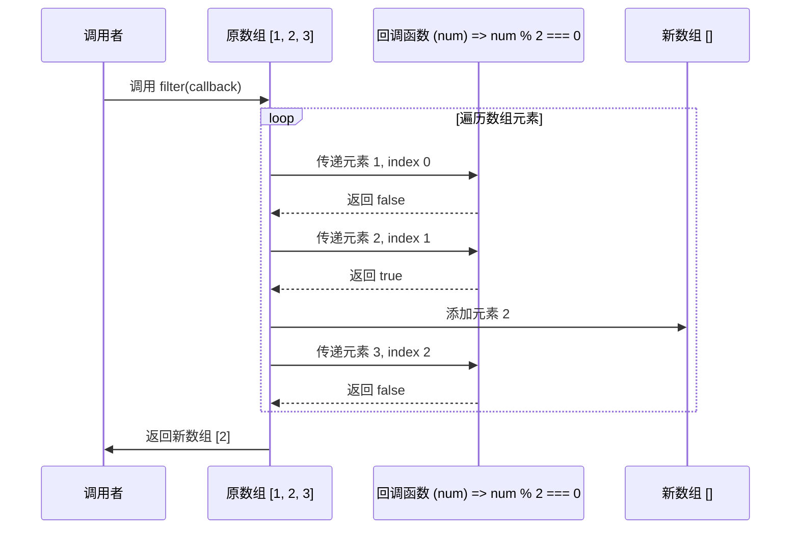
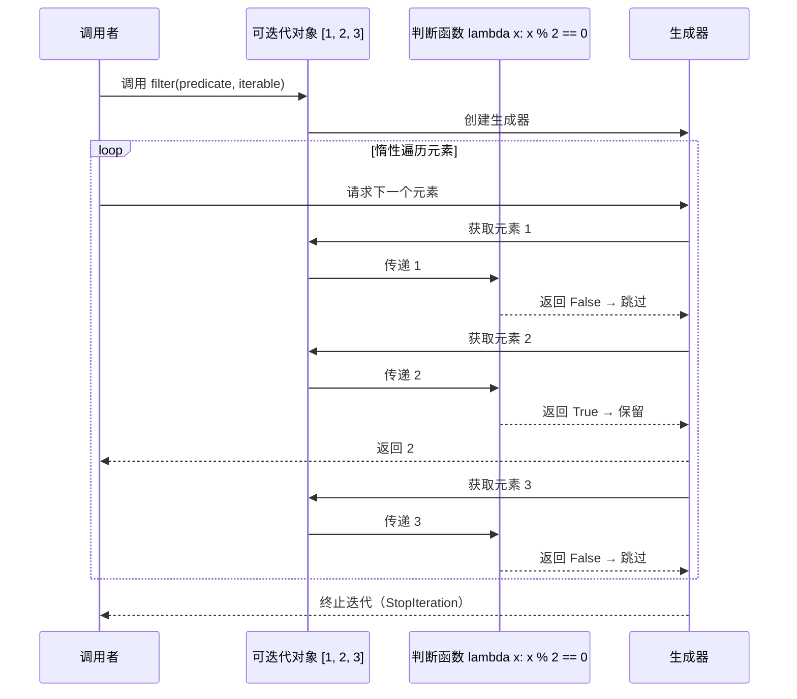

## `filter`

### 什么是 `filter`？
- **定义**：`filter` 是一个高阶函数，它接收一个函数（通常称为谓词函数或测试函数）和一个可迭代对象（如列表、数组）作为参数。它将谓词函数应用于可迭代对象的每个元素，并返回一个新的可迭代对象（或列表/数组），其中仅包含那些使谓词函数返回真 (true) 或等效于真的值的元素。
- **核心思想**：根据指定的条件从集合中“筛选”出元素。
- **基本组成**：
    1.  **可迭代对象 (Iterable)**：要处理的数据集合。
    2.  **谓词函数 (Predicate Function)**：一个接收单个元素作为参数并返回布尔值（或可以被解释为布尔值）的函数。如果元素应包含在结果中，则返回 `True`；否则返回 `False`。

### 历史起源
- **函数式编程的基石**：与 `map` 和 `reduce` 一样，`filter` 是函数式编程范式中的核心操作之一，用于以声明式的方式处理数据集合。
- **Lisp 和 APL**：
    -   **Lisp**：早期的 Lisp 方言就提供了强大的列表处理能力，其中包括了类似 `filter` 的筛选功能。
    -   **APL (A Programming Language)**：APL 语言以其对数组的强大操作符而闻名，其中也包含了用于基于条件选择数组元素的机制。
- **Smalltalk**：Smalltalk 中的集合类也提供了类似 `select:` 的方法，其功能与 `filter` 类似。
- **广泛采纳**：`filter` 的概念因其清晰和实用性，已被绝大多数现代编程语言所采纳，特别是那些支持函数式编程特性的语言。例如：
    -   Python: 内置 `filter()` 函数。
    -   JavaScript: `Array.prototype.filter()` 方法。
    -   Java: Streams API 中的 `filter()` 操作。
    -   Ruby: `Enumerable#filter` 或 `Enumerable#select`。
    -   Scala, Haskell 等函数式语言中也是标准库的一部分。

### 设计意义
`filter` 函数的设计为编程带来了以下重要意义：

1.  **代码简洁性和可读性**：
    *   使用 `filter` 可以用非常简洁和声明式的方式表达筛选逻辑，使得代码意图一目了然。相比手动编写循环和条件判断，`filter` 更易于理解。

2.  **声明式编程**：
    *   开发者只需关注“需要筛选出什么样的数据”（通过谓词函数定义条件），而无需关心“如何进行筛选”（迭代的具体实现）。

3.  **代码复用性**：
    *   谓词函数可以被独立定义和测试，并在多个 `filter` 操作中复用。

4.  **关注点分离**：
    *   将筛选逻辑（谓词函数）与迭代过程（由 `filter` 函数处理）分离开来。

5.  **易于组合**：
    *   `filter` 的结果通常是另一个可迭代对象或数组，可以方便地与其他高阶函数（如 `map`, `reduce`）进行链式操作，构建复杂的数据处理流水线。

6.  **避免副作用**：
    *   `filter` 通常返回一个新的集合，而不修改原始集合，这符合函数式编程中推荐的不可变性原则，有助于减少bug。

### 要解决什么问题？
`filter` 主要旨在解决以下问题，并提供更优雅的解决方案：

1.  **替代手动的循环和条件筛选**：
    *   **问题**：在没有 `filter` 的情况下，从集合中选取符合特定条件的元素通常需要编写 `for` 循环，并在循环体内部使用 `if` 语句进行判断，然后将符合条件的元素添加到一个新的集合中。这种方式代码冗长，且容易出错。
    *   **解决方案**：`filter` 将这种常见的模式抽象为一个单一的函数调用。
    *   **示例** (Python):
        *   手动筛选：
            ```python
            numbers = [1, 2, 3, 4, 5, 6]
            even_numbers = []
            for num in numbers:
                if num % 2 == 0:
                    even_numbers.append(num)
            # even_numbers is [2, 4, 6]
            ```
        *   使用 `filter`:
            ```python
            numbers = [1, 2, 3, 4, 5, 6]
            even_numbers = list(filter(lambda x: x % 2 == 0, numbers))
            # even_numbers is [2, 4, 6]
            ```

2.  **提高代码的表达力和意图清晰度**：
    *   **问题**：复杂的循环和嵌套条件会使代码难以理解筛选的真正目的。
    *   **解决方案**：`filter(predicate, collection)` 的形式直接表明了这是一个基于 `predicate` 对 `collection` 进行筛选的操作。

3.  **数据清洗和预处理**：
    *   **问题**：在数据分析和处理流程中，经常需要根据某些标准移除无效、不完整或不符合要求的数据点。
    *   **解决方案**：`filter` 非常适合用于这类数据清洗任务。例如，移除空字符串、过滤掉超出某个范围的数值等。

4.  **构建动态查询和子集选择**：
    *   **问题**：需要根据运行时确定的条件从数据集中选择一个子集。
    *   **解决方案**：可以将动态生成的谓词函数传递给 `filter` 来实现灵活的子集选择。

5.  **与 `map` 和 `reduce` 结合，实现复杂的数据转换**：
    *   **问题**：数据处理通常涉及多个步骤，如先筛选，再转换，最后聚合。
    *   **解决方案**：`filter` 可以作为数据处理流水线中的一个重要环节。例如，先 `filter` 出有效用户，然后 `map` 提取他们的邮箱地址，最后可能用 `reduce` 来统计某些信息。

### 使用时序图拆解 Python3 和 JavaScript 的 `filter` 方法实现过程

---

#### **1. JavaScript 的 `filter` 方法**  

**核心逻辑**：  
遍历数组元素，对每个元素调用回调函数，根据返回值（真/假）决定是否保留该元素，最终返回新数组。

##### **时序图示例（过滤偶数）**  



**关键步骤说明**：  

1. 遍历原数组，依次传递元素、索引到回调函数。  
2. 若回调返回 `true`，将该元素加入新数组。  
3. 最终返回新数组（**原数组不变**）。

---

#### **2. Python3 的 `filter` 方法**  

**核心逻辑**：  
遍历可迭代对象，对每个元素调用判断函数，返回一个生成器（惰性求值），包含使函数返回 `True` 的元素。

##### **时序图示例（过滤偶数）**  



**关键步骤说明**：  

1. 返回生成器对象，**不立即计算所有元素**。  
2. 当迭代生成器时，依次检查元素是否满足条件，惰性返回有效值。  
3. 最终需手动转换为列表（如 `list(filter(...))`）获取所有结果。

---

### **JavaScript vs Python3 的 `filter` 对比**  

| 特性           | JavaScript                           | Python3                       |
| -------------- | ------------------------------------ | ----------------------------- |
| **返回类型**   | 新数组（立即求值）                   | 生成器（惰性求值）            |
| **原数据修改** | 原数组不变                           | 原可迭代对象不变              |
| **空值处理**   | 跳过稀疏数组的空槽位                 | 直接过滤 `None`（需显式判断） |
| **链式操作**   | 可直接链式调用（如 `map`、`reduce`） | 需转换为列表或迭代器          |

---

### **代码示例**  

#### **JavaScript**  

```javascript
const arr = [1, 2, 3];
const filtered = arr.filter(num => num % 2 === 0);
console.log(filtered); // 输出 [2]
```

#### **Python3**  

```python
numbers = [1, 2, 3]
filtered = filter(lambda x: x % 2 == 0, numbers)
print(list(filtered))  # 输出 [2]
```

---

### **核心差异总结**  

- **执行时机**：JavaScript 立即生成新数组，Python 按需生成结果。  
- **内存占用**：JavaScript 可能占用更多内存（存储完整结果），Python 更节省内存（惰性计算）。  
- **使用场景**：  
  - JavaScript：需要快速获取完整结果。  
  - Python：处理大数据流时避免内存溢出。

以下是 Python 3 和 JavaScript 中 `filter` 方法的详细对比说明：

---

## 一、核心概念对比

| **特性**       | Python 3 (`filter()`)        | JavaScript (`Array.prototype.filter()`) |
| -------------- | ---------------------------- | --------------------------------------- |
| **所属位置**   | 内置函数                     | 数组原型方法                            |
| **返回值类型** | 迭代器对象 (`filter object`) | 新数组                                  |
| **参数结构**   | `filter(func, iterable)`     | `arr.filter(callback)`                  |
| **回调参数**   | 只接收元素值                 | 接收元素值、索引、原数组                |
| **惰性求值**   | 是（生成器特性）             | 否（立即执行）                          |
| **空值处理**   | 过滤掉判断为 `False` 的值    | 严格根据回调返回布尔值                  |

---

## 二、JavaScript 实现详解

### 1. 基本语法

```javascript
const numbers = [1, 2, 3, 4, 5];

// 过滤偶数
const evens = numbers.filter(x => x % 2 === 0);
console.log(evens); // [2, 4]

// 复杂示例：过滤包含特定字符的字符串
const words = ['apple', 'banana', 'cherry'];
const aWords = words.filter(word => word.includes('a'));
console.log(aWords); // ['apple', 'banana']
```

### 2. 特性说明

- **回调参数**：`(element, index, array)`

- **返回新数组**：原数组不会被修改

- **稀疏数组处理**：

  ```javascript
  // 跳过空位（empty slots）
  const sparseArr = [1,,3];
  console.log(sparseArr.filter(x => true)); // [1, 3]
  ```

---

## 三、Python 3 实现详解

### 1. 基本用法

```python
numbers = [1, 2, 3, 4, 5]

# 过滤偶数
evens = list(filter(lambda x: x % 2 == 0, numbers))
print(evens)  # [2, 4]

# 复杂示例：过滤非空字符串
words = ['hello', '', 'world', None, ' ']
valid_words = list(filter(lambda x: x and x.strip(), words))
print(valid_words)  # ['hello', 'world']
```

### 2. 特性说明

- **惰性计算**：适合处理大型数据集

  ```python
  big_data = range(10**6)
  filtered = filter(lambda x: x % 1000 == 0, big_data)  # 不立即占用内存
  ```

- **特殊值处理**：

  ```python
  # 过滤 None 和 False 值
  mixed = [0, 1, False, True, None, ""]
  truthy = list(filter(None, mixed))  # [1, True]
  ```

---

## 四、关键差异对比

| **对比维度**   | Python 3                          | JavaScript             |
| -------------- | --------------------------------- | ---------------------- |
| **返回值处理** | 需显式转换为列表/元组             | 直接返回新数组         |
| **参数灵活性** | 可接受任何可迭代对象              | 只能用于数组           |
| **性能特性**   | 适合处理流式大数据（惰性求值）    | 立即生成结果数组       |
| **默认行为**   | `filter(None, iterable)` 过滤假值 | 完全依赖回调返回值     |
| **链式调用**   | 需结合 `map` 等其他函数           | 可直接链式调用数组方法 |

---

## 五、经典场景实现对比

### 场景1：对象数组过滤

```javascript
// JavaScript 过滤成年用户
const users = [
  {name: 'Alice', age: 17},
  {name: 'Bob', age: 25},
  {name: 'Charlie', age: 16}
];
const adults = users.filter(user => user.age >= 18);
console.log(adults); // [{name: 'Bob', age: 25}]
```

```python
# Python 过滤字典列表
users = [
    {'name': 'Alice', 'age': 17},
    {'name': 'Bob', 'age': 25},
    {'name': 'Charlie', 'age': 16}
]
adults = list(filter(lambda u: u['age'] >= 18, users))
print(adults)  # [{'name': 'Bob', 'age': 25}]
```

---

### 场景2：复合条件过滤

```javascript
// JavaScript 过滤质数
const isPrime = num => {
  for(let i=2; i<=Math.sqrt(num); i++)
    if(num % i === 0) return false;
  return num > 1;
};
const primes = [2,3,4,5,6,7,8,9].filter(isPrime);
console.log(primes); // [2,3,5,7]
```

```python
# Python 过滤质数（使用列表推导式对比）
def is_prime(n):
    return n > 1 and all(n%i !=0 for i in range(2, int(n**0.5)+1))

numbers = [2,3,4,5,6,7,8,9]
primes = list(filter(is_prime, numbers))
print(primes)  # [2,3,5,7]

# 等效列表推导式
primes_lc = [n for n in numbers if is_prime(n)]
```

---

## 六、最佳实践指南

### JavaScript

1. **保持回调纯净**：

   ```javascript
   // Bad：修改原数组
   const badFilter = arr.filter((item, i, arr) => {
     arr[i] = item * 2; // 副作用
     return item > 10;
   });
   
   // Good：无副作用
   const goodFilter = arr.filter(item => item > 10);
   ```

2. **利用索引参数**：

   ```javascript
   // 过滤唯一元素（保留首次出现）
   const duplicates = [1,2,2,3,4,4,5];
   const unique = duplicates.filter((x, i, arr) => arr.indexOf(x) === i);
   console.log(unique); // [1,2,3,4,5]
   ```

### Python

1. **优先使用生成器表达式**：

   ```python
   # 更高效的质数过滤
   primes = (n for n in numbers if is_prime(n))
   ```

2. **结合 `itertools` 优化**：

   ```python
   from itertools import filterfalse
   
   # 过滤不符合条件的元素
   non_primes = list(filterfalse(is_prime, numbers))
   ```

---

## 七、性能注意事项

| **操作**          | JavaScript (V8)    | Python 3 (CPython)   |
| ----------------- | ------------------ | -------------------- |
| **100万元素过滤** | ~50ms              | ~300ms（转换为列表） |
| **内存占用**      | 立即分配新数组内存 | 惰性求值节省内存     |
| **最佳适用场景**  | 中小型数组快速操作 | 流式大数据处理       |

---

## 八、特殊技巧

### JavaScript 链式操作

```javascript
// 组合 map 和 filter
const data = [1,2,3,4,5];
const result = data
  .filter(x => x % 2 === 0)
  .map(x => x * 2);
console.log(result); // [4, 8]
```

### Python 惰性管道

```python
# 构建处理管道
numbers = range(1000000)
pipeline = filter(lambda x: x % 3 == 0, numbers)
pipeline = map(lambda x: x**2, pipeline)
result = next(pipeline)  # 按需获取第一个结果（0）
```

---

通过理解这些实现差异，开发者可以：

1. 根据数据规模选择最优方案
2. 避免内存溢出风险
3. 编写更高效的过滤逻辑
4. 充分利用语言特性提升代码质量