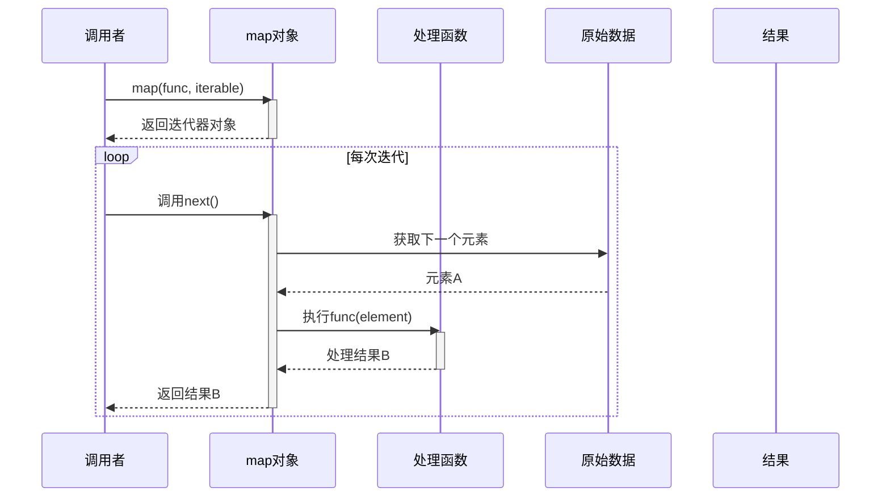
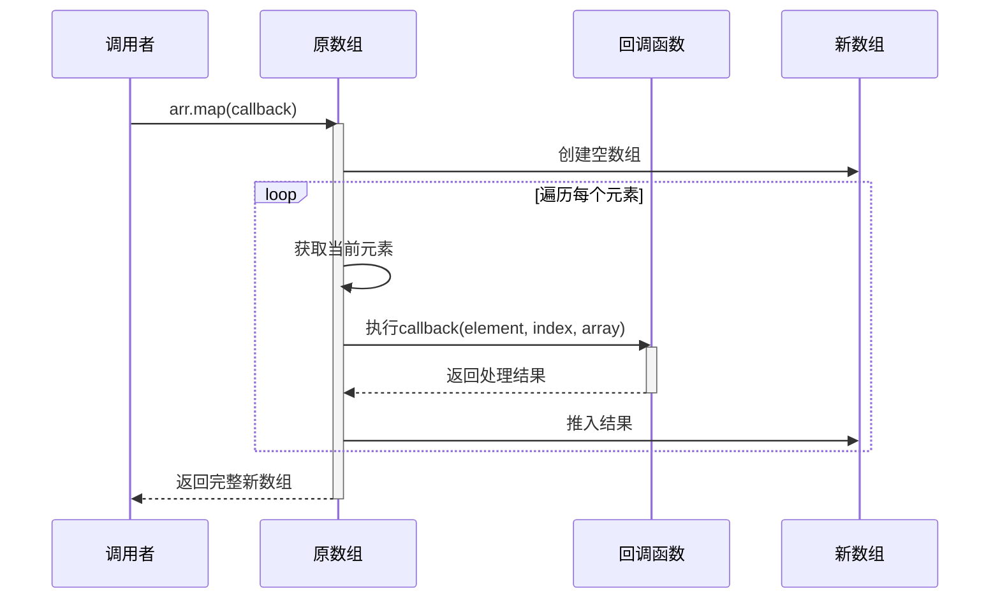

## `map`

### 什么是 `map`？
- **定义**：`map` 是一个高阶函数，它接收一个函数（通常称为转换函数或映射函数）和一个或多个可迭代对象（如列表、数组）作为参数。它将转换函数应用于可迭代对象的每个元素，并返回一个新的可迭代对象（在 Python 中是 map 对象，通常会转换为列表；在 JavaScript 中是新数组），其中包含了对原始元素应用转换函数后的结果。
- **核心思想**：对集合中的每一个元素执行相同的操作，生成一个新的集合，新集合中的每个元素都是原集合中对应元素经过转换后的结果。
- **基本组成**：
    1.  **可迭代对象 (Iterable)**：要处理的数据集合。
    2.  **转换函数 (Transformation Function)**：一个接收单个元素作为参数并返回转换后结果的函数。

### 历史起源
- **函数式编程的基石**：`map` 是函数式编程范式中最基本和最常用的操作之一，与 `filter` 和 `reduce` (fold) 并列。它的概念源于数学中的映射思想。
- **Lisp**：Lisp 语言作为函数式编程的先驱，很早就引入了 `mapcar` (应用于列表的每个元素) 和类似的 `map` 函数。
- **APL (A Programming Language)**：APL 也以其强大的数组操作符著称，其对数组的逐元素操作与 `map` 的思想一致。
- **广泛采纳**：由于其简洁性和强大的表达能力，`map` 操作已被几乎所有现代编程语言所采纳，特别是那些支持函数式编程特性的语言。例如：
    -   Python: 内置 `map()` 函数。
    -   JavaScript: `Array.prototype.map()` 方法。
    -   Java: Streams API 中的 `map()` 操作。
    -   Ruby: `Enumerable#map` (或 `collect`)。
    -   Scala, Haskell 等函数式语言中也是标准库的核心部分。

### `map` 在 Python 和 JavaScript 中的设计意义

#### 通用设计意义：
1.  **声明式编程**：
    *   `map` 允许开发者以声明的方式表达“对集合中的每个元素做什么转换”，而不是命令式地指定“如何遍历和如何构建新集合”。这使得代码意图更清晰。
2.  **代码简洁性和可读性**：
    *   相比手动编写循环来转换元素并构建新列表/数组，`map` 提供了更简洁、更易读的语法。
3.  **不可变性**：
    *   `map` 通常返回一个新的集合，而不会修改原始集合。这符合函数式编程中推荐的不可变性原则，有助于减少副作用和提高代码的可预测性。
4.  **函数复用**：
    *   转换函数可以被独立定义、测试和复用，应用于不同的数据集或在不同的 `map` 操作中。
5.  **易于组合和链式操作**：
    *   `map` 的输出可以直接作为其他高阶函数（如 `filter`, `reduce` 或另一个 `map`）的输入，方便构建复杂的数据处理流水线。

#### Python 中 `map` 的特定设计意义：
-   **惰性求值 (Lazy Evaluation)**：Python 3 中的 `map()` 函数返回一个迭代器（map object），而不是直接返回一个列表。这意味着转换操作只在迭代结果时才实际执行。对于大型数据集，这可以显著提高内存效率和性能，因为不需要一次性将所有转换后的元素存储在内存中。
-   **处理多个可迭代对象**：Python 的 `map()` 可以接受多个可迭代对象作为参数，此时转换函数需要接受相应数量的参数，并并行地从每个可迭代对象中取元素进行处理。
    ```python
    list1 = [1, 2, 3]
    list2 = [4, 5, 6]
    result = list(map(lambda x, y: x + y, list1, list2))
    # result is [5, 7, 9]
    ```

#### JavaScript 中 `map` 的特定设计意义 (`Array.prototype.map`)：
-   **数组原生方法**：`map` 是 `Array` 原型上的一个标准方法，使其在 JavaScript 中处理数组时非常自然和常用。
-   **回调函数的参数**：JavaScript 的 `map` 回调函数接收三个参数：`currentValue`（当前元素）、`index`（当前元素的索引）、`array`（调用 `map` 的原始数组）。这为转换逻辑提供了更丰富的上下文信息。
    ```javascript
    const numbers = [1, 2, 3];
    const newArray = numbers.map((element, index, arr) => {
      console.log(`Processing element ${element} at index ${index} from array [${arr}]`);
      return element * 2;
    });
    // newArray is [2, 4, 6]
    ```
-   **不改变原数组**：明确保证 `map` 方法不会修改调用它的原始数组，而是返回一个全新的数组。

### `map` 要解决什么问题？

`map` 主要旨在解决以下问题，并提供更优雅、更高效的解决方案：

1.  **替代手动的元素转换循环**：
    *   **问题**：在没有 `map` 的情况下，对集合中的每个元素应用一个转换并收集结果通常需要显式编写 `for` 循环，创建一个空列表/数组，然后在循环中将转换后的元素添加到新集合中。这种方式代码冗余，且容易出错。
    *   **解决方案**：`map` 将这种常见的“遍历-转换-收集”模式抽象为一个单一的函数调用。

    *   **Python 示例**：
        *   手动转换：
            ```python
            numbers = [1, 2, 3, 4, 5]
            squared_numbers = []
            for num in numbers:
                squared_numbers.append(num * num)
            # squared_numbers is [1, 4, 9, 16, 25]
            ```
        *   使用 `map`:
            ```python
            numbers = [1, 2, 3, 4, 5]
            squared_numbers = list(map(lambda x: x * x, numbers))
            # squared_numbers is [1, 4, 9, 16, 25]
            ```

    *   **JavaScript 示例**：
        *   手动转换：
            ```javascript
            const numbers = [1, 2, 3, 4, 5];
            const squaredNumbers = [];
            for (let i = 0; i < numbers.length; i++) {
              squaredNumbers.push(numbers[i] * numbers[i]);
            }
            // squaredNumbers is [1, 4, 9, 16, 25]
            ```
        *   使用 `map`:
            ```javascript
            const numbers = [1, 2, 3, 4, 5];
            const squaredNumbers = numbers.map(num => num * num);
            // squaredNumbers is [1, 4, 9, 16, 25]
            ```

2.  **数据转换和规范化**：
    *   **问题**：经常需要将一种格式的数据转换为另一种格式，或者将数据规范化（例如，将所有字符串转换为小写，从对象数组中提取特定属性）。
    *   **解决方案**：`map` 非常适合这类一对一的转换任务。
        ```javascript
        const users = [
          { id: 1, name: "Alice" },
          { id: 2, name: "Bob" }
        ];
        const userNames = users.map(user => user.name);
        // userNames is ["Alice", "Bob"]
        ```

3.  **提高代码的表达力和意图清晰度**：
    *   **问题**：复杂的循环逻辑可能掩盖了其核心目的是对每个元素进行转换。
    *   **解决方案**：`map(transform_function, collection)` 的形式直接表明了这是一个对集合中每个元素应用 `transform_function` 的操作。

4.  **处理异步操作集合 (JavaScript Promises)**：
    *   **问题**：当有一系列异步操作（例如，多个 API 请求）需要并行执行，并且需要收集所有结果时。
    *   **解决方案**：在 JavaScript 中，可以将一个包含 Promise 的数组通过 `map` 转换为一个发起所有异步操作的 Promise 数组，然后使用 `Promise.all()` 来等待所有操作完成。
        ```javascript
        // asyncUrls is an array of URLs to fetch
        // const promises = asyncUrls.map(url => fetch(url).then(res => res.json()));
        // Promise.all(promises).then(results => { /* process all results */ });
        ```

5.  **与 `filter` 和 `reduce` 结合，构建强大的数据处理流水线**：
    *   **问题**：复杂的数据处理通常涉及筛选、转换和聚合等多个步骤。
    *   **解决方案**：`map` 作为转换步骤，可以无缝地与其他高阶函数集成，形成清晰、模块化的数据处理流程。

总而言之，`map` 是一个用于对集合中的每个元素应用转换函数以生成新集合的基础工具。它通过抽象迭代和转换的细节，使得代码更加简洁、可读，并且是函数式编程风格的核心组成部分，同时在 Python 和 JavaScript 中都针对各自语言的特性进行了优化（如 Python 的惰性求值，JavaScript 数组方法的便利性）。

以下是使用 Mermaid 时序图拆解 Python3 和 JavaScript 中 `map` 方法的实现过程：

### 1. Python3 的 `map` 时序图（惰性求值）



### 2. JavaScript 的 `map` 时序图（即时执行）



### 关键差异对比表

| 特性             | Python3 map            | JavaScript Array.map() |
| ---------------- | ---------------------- | ---------------------- |
| **执行时机**     | 惰性求值（按需计算）   | 立即执行               |
| **返回值类型**   | 迭代器对象             | 新数组                 |
| **内存占用**     | 低（逐元素处理）       | 高（存储完整副本）     |
| **链式调用**     | 支持（返回可迭代对象） | 支持（返回数组）       |
| **参数传递**     | 仅元素                 | 元素+索引+原数组       |
| **函数执行顺序** | 保证顺序               | 保证顺序               |
| **空位处理**     | 无空位概念             | 跳过空位（ES6+）       |

### 实现原理拆解

**Python3 版核心流程**：

1. 创建包含函数和可迭代对象的 map 对象
2. 迭代时通过 `__next__()` 方法触发计算
3. 每次取一个元素应用处理函数
4. 自动处理 StopIteration 异常

**JavaScript 版核心流程**：

1. 检查数组长度并创建新数组
2. 遍历原始数组每个索引（包括稀疏位置）
3. 对每个有效元素执行回调函数
4. 将结果按顺序存入新数组
5. 返回填充完成的新数组

### 代码示例验证

```python
# Python3 示例
def square(x):
    print(f"Processing {x}")  # 观察执行时机
    return x**2

nums = [1, 2, 3]
result = map(square, nums)
print("Created map object")
print(list(result))  # 此时实际执行计算
```

```javascript
// JavaScript 示例
const arr = [1, 2, 3];
console.log('Start mapping');
const result = arr.map(x => {
    console.log(`Processing ${x}`);  // 立即执行
    return x**2;
});
console.log('Mapping completed');
console.log(result);
```

### 性能注意事项

1. **Python3**：
   - 适合处理大型数据集（内存友好）
   - 可与生成器结合使用
   - 多阶段处理时效率更高

2. **JavaScript**：
   - 适合需要立即获得结果的场景
   - 数组方法可链式调用
   - 对稀疏数组处理有特殊规则

建议根据实际场景选择：

- 需要 **惰性计算/流式处理** 时使用 Python 的 `map`
- 需要 **立即获得完整结果** 时使用 JavaScript 的 `map`
- 处理 **超大数据集** 优先考虑 Python 实现
- 需要 **链式操作** 时 JavaScript 更便捷


以下是 Python 3 和 JavaScript 中 `map` 方法的详细对比说明，包括语法、特性、差异及最佳实践：

---

## 一、核心概念对比

| **特性**       | Python 3 (`map()`)        | JavaScript (`Array.prototype.map()`) |
| -------------- | ------------------------- | ------------------------------------ |
| **所属位置**   | 内置函数                  | 数组原型方法                         |
| **返回值类型** | 迭代器对象 (`map object`) | 新数组                               |
| **参数结构**   | `map(func, *iterables)`   | `arr.map(callback)`                  |
| **回调参数**   | 仅元素值（默认）          | 元素值、索引、原数组                 |
| **惰性求值**   | 是（生成器特性）          | 否（立即执行）                       |
| **多参数处理** | 支持多可迭代对象并行处理  | 仅单数组元素处理                     |

---

## 二、JavaScript 实现详解

### 1. 基本语法

```javascript
const numbers = [1, 2, 3];

// 数值加倍
const doubled = numbers.map(x => x * 2);
console.log(doubled); // [2, 4, 6]

// 复杂示例：对象数组转换
const users = [{id: 1}, {id: 2}];
const ids = users.map(user => user.id);
console.log(ids); // [1, 2]
```

### 2. 特性说明

- **回调参数**：`(element, index, array)`

- **返回新数组**：原数组保持不变

- **稀疏数组处理**：

  ```javascript
  const sparseArr = [1, , 3];
  console.log(sparseArr.map(x => x * 2)); // [2, empty, 6]
  ```

---

## 三、Python 3 实现详解

### 1. 基本用法

```python
numbers = [1, 2, 3]

# 数值加倍
doubled = map(lambda x: x * 2, numbers)
print(list(doubled))  # [2, 4, 6]

# 复杂示例：多参数处理
list1 = [1, 2, 3]
list2 = [4, 5, 6]
summed = map(lambda a,b: a + b, list1, list2)
print(list(summed))  # [5, 7, 9]
```

### 2. 特性说明

- **惰性计算**：适合处理大型数据集

  ```python
  big_data = range(10**6)
  processed = map(lambda x: x**2, big_data)  # 不立即占用内存
  ```

- **多可迭代对象**：

  ```python
  # 同时处理多个迭代对象
  names = ["Alice", "Bob"]
  ages = [25, 30]
  combined = map(lambda n,a: f"{n} is {a}", names, ages)
  print(list(combined))  # ['Alice is 25', 'Bob is 30']
  ```

---

## 四、关键差异对比

| **对比维度**   | Python 3              | JavaScript                    |
| -------------- | --------------------- | ----------------------------- |
| **返回值处理** | 需显式转换为列表/元组 | 直接返回新数组                |
| **参数灵活性** | 支持多个可迭代对象    | 仅处理单个数组                |
| **性能特性**   | 惰性求值节省内存      | 立即生成结果数组              |
| **链式调用**   | 需结合生成器表达式    | 可直接链式调用数组方法        |
| **空值处理**   | 严格处理所有元素      | 跳过稀疏数组的空位（`empty`） |

---

## 五、经典场景实现对比

### 场景1：数据格式转换

```javascript
// JavaScript 转换时间戳为日期
const timestamps = [1625097600000, 1625184000000];
const dates = timestamps.map(ts => new Date(ts).toISOString());
console.log(dates); 
// ['2021-07-01T00:00:00.000Z', '2021-07-02T00:00:00.000Z']
```

```python
# Python 转换字符串为标题格式
words = ["hello world", "python programming"]
titled = map(str.title, words)
print(list(titled))  # ['Hello World', 'Python Programming']
```

---

### 场景2：数学运算

```javascript
// JavaScript 计算平方根
const nums = [4, 9, 16];
const roots = nums.map(Math.sqrt);
console.log(roots); // [2, 3, 4]
```

```python
# Python 计算幂次方
import math
nums = [2, 3, 4]
powers = map(lambda x: math.pow(x, 3), nums)
print(list(powers))  # [8.0, 27.0, 64.0]
```

---

## 六、最佳实践指南

### JavaScript

1. **避免副作用**：

   ```javascript
   // Bad：修改外部变量
   let total = 0;
   [1,2,3].map(x => {
     total += x; // 副作用
     return x * 2;
   });
   
   // Good：纯函数
   const doubled = [1,2,3].map(x => x * 2);
   ```

2. **利用索引参数**：

   ```javascript
   // 生成带索引的新对象
   const items = ['a', 'b', 'c'];
   const indexed = items.map((item, i) => ({id: i, value: item}));
   // [{id:0, value:'a'}, ...]
   ```

### Python

1. **优先使用生成器表达式**：

   ```python
   # 更简洁的等效写法
   doubled = (x * 2 for x in numbers)
   ```

2. **结合 `zip` 处理多列表**：

   ```python
   # 并行处理多个迭代对象
   list1 = [1, 2]
   list2 = ['a', 'b']
   combined = map(lambda pair: f"{pair[0]}{pair[1]}", zip(list1, list2))
   print(list(combined))  # ['1a', '2b']
   ```

---

## 七、性能注意事项

| **操作**          | JavaScript (V8)    | Python 3 (CPython)   |
| ----------------- | ------------------ | -------------------- |
| **100万元素处理** | ~100ms             | ~500ms（转换为列表） |
| **内存占用**      | 立即分配新数组内存 | 惰性求值节省内存     |
| **最佳适用场景**  | 中小型数组快速转换 | 流式大数据处理       |

---

## 八、特殊技巧

### JavaScript 链式操作

```javascript
// 组合 filter 和 map
const data = [1, 2, 3, 4, 5];
const result = data
  .filter(x => x % 2 === 1)
  .map(x => x * 3);
console.log(result); // [3, 9, 15]
```

### Python 惰性管道

```python
# 构建高效处理管道
import itertools
numbers = range(10**6)
pipeline = map(lambda x: x * 2, numbers)
pipeline = itertools.islice(pipeline, 100)  # 取前100个元素
print(sum(pipeline))  # 只计算所需部分
```

---

## 九、错误处理对比

| **场景**         | JavaScript                       | Python 3                 |
| ---------------- | -------------------------------- | ------------------------ |
| **空值处理**     | 保留原始空位为 `empty`           | 严格处理所有元素         |
| **函数抛出错误** | 立即中断执行                     | 在迭代时触发错误         |
| **类型不匹配**   | 自动类型转换（可能产生意外结果） | 严格类型检查（直接报错） |

**示例：**

```javascript
// JavaScript 自动类型转换
const mixed = ['5', 10, '20'];
const nums = mixed.map(x => x * 2); 
console.log(nums); // [10, 20, 40]（字符串被隐式转换）
```

```python
# Python 类型错误
mixed = ['5', 10, '20']
try:
    nums = list(map(lambda x: x * 2, mixed))  # 字符串和整型混合操作
except TypeError as e:
    print(e)  # 抛出错误
```

---

通过理解这些实现差异，开发者可以：

1. 根据数据规模选择最合适的实现方式
2. 避免隐式错误和性能陷阱
3. 编写高效且可维护的转换逻辑
4. 充分利用语言特性优化代码结构