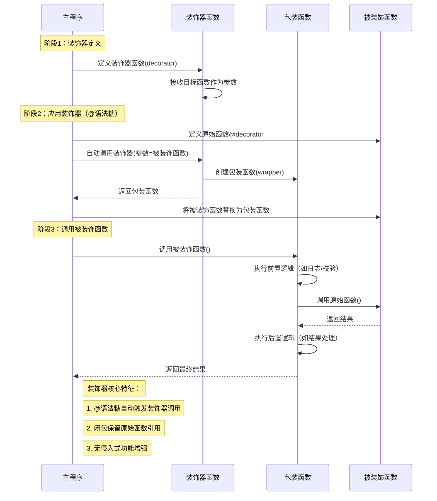

## Python 装饰器 (Decorators)

### 什么是 Python 装饰器？
- **定义**：Python 装饰器是一种特殊类型的函数，它接收一个函数（或方法、类）作为参数，并返回一个新的函数（或修改后的原始函数）。装饰器允许你用一种简洁、可读的方式来包装或修改现有函数或类的行为。
- **语法糖 (Syntactic Sugar)**：装饰器本质上是一种语法糖。使用 `@decorator_name` 语法放在函数定义之前，等同于 `my_function = decorator_name(my_function)`。
- **核心思想**：在不改变原函数代码的前提下，为其增加额外的功能。这符合软件设计中的“开放/封闭原则”（对扩展开放，对修改封闭）。

### 历史起源
- **早期影响**：
    -   **Lisp 宏 (Macros)**：Lisp 语言中的宏系统提供了强大的元编程能力，允许在编译时转换代码，这与装饰器在概念上有相似之处，即在不直接修改原始定义的情况下增强代码。
    -   **面向方面编程 (Aspect-Oriented Programming, AOP)**：AOP 思想旨在将横切关注点（cross-cutting concerns，如日志、事务管理、安全）从核心业务逻辑中分离出来。装饰器是实现 AOP 的一种方式。
    -   **Java 注解 (Annotations)**：虽然机制不同，但 Java 注解也提供了一种向代码添加元数据或行为的方式，与装饰器的某些用途有相似之处。
- **Python 中的正式引入**：
    -   **PEP 318 -- Decorators for Functions and Methods**：装饰器语法 (`@decorator`) 正式通过此 PEP 被引入到 Python 2.4 版本中（2004年）。这个 PEP 旨在提供一种更清晰、更 Pythonic 的方式来应用函数转换。在此之前，类似的功能通常通过显式地将函数传递给另一个函数来实现，例如 `decorated_function = decorator(original_function)`。
    -   **PEP 3129 -- Class Decorators**：后来，在 Python 2.6 和 Python 3.0 中，装饰器的使用范围扩展到了类，允许使用 `@decorator` 语法来装饰整个类。

### 设计意义
装饰器的设计为 Python 带来了诸多好处：

1.  **代码可读性和简洁性**：
    *   `@decorator` 语法非常直观，清晰地表明了某个函数正在被一个或多个装饰器增强。这比手动进行函数包装（如 `func = logged(timed(func))`）更易读。

2.  **代码复用 (DRY - Don't Repeat Yourself)**：
    *   可以将通用的功能（如日志记录、性能测试、事务处理、权限校验、缓存）封装在装饰器中，然后在多个函数或方法上重复使用，而无需在每个函数内部复制代码。

3.  **关注点分离 (Separation of Concerns)**：
    *   装饰器有助于将核心业务逻辑与辅助功能（横切关注点）分离开。函数本身专注于其核心任务，而装饰器负责处理额外的、通用的方面。

4.  **声明式编程风格**：
    *   通过装饰器，可以以声明的方式指定函数应该具有哪些额外的行为，而不是通过命令式的代码来添加这些行为。

5.  **元编程能力**：
    *   装饰器是 Python 元编程能力的一种体现。它们允许程序在运行时检查、修改甚至生成代码（函数或类）。

6.  **易于组合**：
    *   多个装饰器可以应用于同一个函数，它们会按照从下到上（最接近函数定义的装饰器最先生效）的顺序依次应用。

### 要解决什么问题？
装饰器的引入主要是为了解决在不修改原始代码定义的情况下，如何优雅地扩展或修改函数和类的行为的问题。具体来说，它解决了：

1.  **向现有函数添加通用功能，避免修改函数本身**：
    *   **问题**：如果想给多个函数添加日志记录、性能计时、输入验证、缓存结果等功能，直接修改每个函数会导致代码冗余，并且使函数的核心逻辑变得混乱。
    *   **解决方案**：将这些通用功能实现为装饰器，然后简单地用 `@decorator_name` 应用到目标函数上。

2.  **减少样板代码 (Boilerplate Code)**：
    *   **问题**：许多任务（如数据库连接的打开和关闭、事务的开始和提交/回滚）在多个函数中都有相似的设置和清理代码。
    *   **解决方案**：使用装饰器来自动处理这些通用的设置和清理步骤，让函数体只关注核心操作。

3.  **实现横切关注点 (Cross-Cutting Concerns)**：
    *   **问题**：像日志、安全、事务管理这样的功能通常会散布在系统的多个模块中，与核心业务逻辑交织在一起，难以维护。
    *   **解决方案**：装饰器提供了一种将这些关注点模块化并以声明方式应用到需要它们的地方的机制。

4.  **有条件地执行或修改函数行为**：
    *   **问题**：有时需要根据某些条件（如用户权限、环境变量）来决定是否执行函数的某个部分，或者改变其行为。
    *   **解决方案**：装饰器可以在调用原始函数之前或之后执行检查，并据此采取行动。例如，一个权限检查装饰器可以在用户没有权限时阻止函数执行。

5.  **API 和框架设计**：
    *   **问题**：框架（如 Web 框架 Flask, Django）需要一种方式来注册路由处理函数、中间件、视图等，并为其附加特定的行为或元数据。
    *   **解决方案**：装饰器提供了一种非常优雅的方式来实现这一点。例如，Flask 中的 `@app.route('/')` 装饰器用于将一个函数注册为特定 URL 的处理器。

6.  **增强代码的声明性和可维护性**：
    *   **问题**：通过函数调用链来包装函数（如 `f = g(h(f_orig))`）可能会变得难以阅读和维护，尤其当包装层数较多时。
    *   **解决方案**：`@` 语法使得这种增强意图更加明确和易于理解。

总而言之，Python 装饰器是一种强大的工具，它通过提供一种简洁的语法来应用高阶函数，从而解决了在不修改原始代码的情况下扩展功能、减少冗余、分离关注点以及增强代码可读性和可维护性的问题。


以下是用 Mermaid 时序图梳理 **Python装饰器** 核心机制的示意图，通过装饰器定义、函数包装、调用链路等流程展示其动态增强函数能力的特性：



---

### 核心逻辑拆解

1. **装饰即包装**  

   ```python
   def decorator(func):          # 接收被装饰函数
       def wrapper(*args, **kwargs):  # 创建包装函数
           # 前置逻辑
           result = func(*args, **kwargs)  # 调用原始函数
           # 后置逻辑
           return result
       return wrapper            # 返回包装函数
   ```

2. **@语法糖的魔法**  
   当使用 `@decorator` 时等价于：

   ```python
   original_func = decorator(original_func)  # 函数被替换为包装函数
   ```

3. **闭包维持状态**  
   包装函数通过闭包持续持有原始函数和装饰器参数的引用（如实现带参数的装饰器）

4. **链式装饰器**  
   多层装饰器按从下到上的顺序执行：

   ```python
   @decorator1
   @decorator2  # 先应用decorator2，再应用decorator1
   def func(): pass
   ```

---

## 二、核心实现机制

### 1. 装饰器本质

- **高阶函数**：接收函数对象，返回新函数对象。

- **语法糖转换**：

  ```python
  @decorator
  def func():
      pass
  # 等价于 func = decorator(func)
  ```

### 2. 实现层级

#### 基础装饰器（无参数）：

```python
def log_time(func):
    def wrapper(*args, **kwargs):
        start = time.time()
        result = func(*args, **kwargs)
        print(f"Time: {time.time() - start}s")
        return result
    return wrapper
```

#### 参数化装饰器（工厂模式）：

```python
def repeat(n):  # 装饰器工厂
    def decorator(func):  # 实际装饰器
        def wrapper(*args, **kwargs):
            for _ in range(n):
                result = func(*args, **kwargs)
            return result
        return wrapper
    return decorator
```

#### 类装饰器：

```python
class CountCalls:
    def __init__(self, func):
        self.func = func
        self.count = 0

    def __call__(self, *args, **kwargs):
        self.count += 1
        return self.func(*args, **kwargs)
```

### 3. 元数据保护

- **`functools.wraps`**：保留原函数的 `__name__` 等属性：

  ```python
  from functools import wraps
  def debug(func):
      @wraps(func)  # 保留原函数元数据
      def wrapper(*args, **kwargs):
          print(f"Calling {func.__name__}")
          return func(*args, **kwargs)
      return wrapper
  ```

---

## 三、实践场景与应用模式

### 1. 典型应用场景

| **场景** | **实现目标**             | **示例**                    |
| -------- | ------------------------ | --------------------------- |
| 功能增强 | 添加日志、计时、重试机制 | `@log_execution_time`       |
| 访问控制 | 权限校验、身份认证       | `@login_required`           |
| 资源管理 | 数据库连接池、文件锁     | `@with_database_connection` |
| 注册机制 | 路由注册、插件系统       | Flask 的 `@app.route`       |
| 缓存优化 | 记忆化缓存计算结果       | `@lru_cache(maxsize=128)`   |

### 2. 高级应用模式

#### 装饰器堆叠：

```python
@cache
@validate_input
def compute(x: int) -> int:
    # 复杂计算
```

#### 条件装饰器：

```python
def switchable(enable=True):
    def decorator(func):
        if not enable:
            return func  # 直接返回原函数
        @wraps(func)
        def wrapper(*args, **kwargs):
            # 增强逻辑
            return func(*args, **kwargs)
        return wrapper
    return decorator
```

#### 装饰器状态保持：

```python
def counter(func):
    def wrapper(*args, **kwargs):
        wrapper.call_count += 1
        return func(*args, **kwargs)
    wrapper.call_count = 0
    return wrapper
```

---

## 四、实现原理深度解析

### 1. 闭包机制

- **环境捕获**：装饰器函数捕获被装饰函数及其上下文。
- **延迟执行**：返回的 wrapper 函数在调用时执行增强逻辑。

### 2. 描述符协议

- **类方法装饰**：自动处理 `self` 参数的关键机制。

  ```python
  class ClassDecorator:
      def __init__(self, func):
          self.func = func
      
      def __get__(self, instance, owner):
          # 绑定实例方法
          return lambda *args, **kwargs: self.func(instance, *args, **kwargs)
  ```

### 3. 导入时执行

- **装饰时机**：模块加载时立即执行装饰器逻辑：

  ```python
  registry = []
  def register(func):
      registry.append(func)
      return func
  
  @register
  def func1(): pass  # 模块导入时自动注册
  ```

---

## 五、最佳实践与陷阱规避

### 1. 实践准则

- **单一职责**：每个装饰器只做一件事。
- **文档化**：使用 `@wraps` 保持元数据清晰。
- **性能考量**：避免嵌套过深影响执行效率。

### 2. 常见陷阱

#### 错误1：错误处理缺失

```python
# Bad：未处理被装饰函数的异常
def log_errors(func):
    def wrapper(*args, **kwargs):
        try:
            return func(*args, **kwargs)
        except Exception as e:
            print(f"Error: {e}")
    return wrapper
```

#### 错误2：错误参数传递

```python
# Bad：未正确传递参数
def bad_decorator(func):
    def wrapper():
        return func()  # 丢失参数
    return wrapper
```

---

