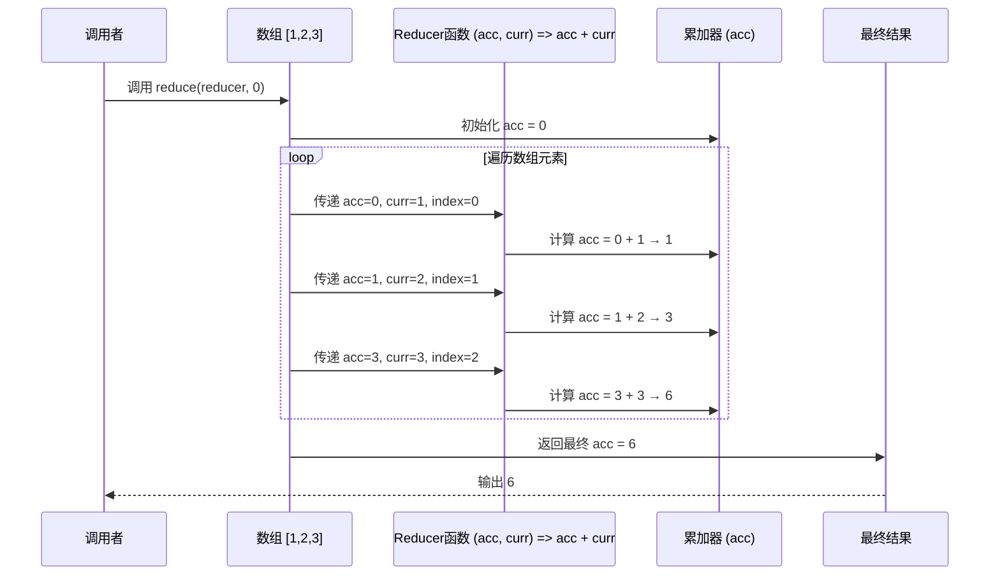

## `reduce` (或 `fold`)

### 什么是 `reduce`？
- **定义**：`reduce` (也常被称为 `fold`，在某些语言中可能是 `accumulate` 或 `inject`) 是一个高阶函数，它将一个二元函数（接收两个参数并返回一个值的函数，通常称为累加器函数或组合器函数）应用于一个序列（如列表、数组）的元素上，从左到右（或从右到左，取决于具体的 `reduce` 变体，如 `reduceRight`）将它们累积成一个单一的输出值。
- **核心思想**：它通过迭代地将累加器函数应用于当前累积值和序列中的下一个元素，从而“减少”或“折叠”序列到一个最终结果。
- **基本组成**：
    1.  **序列 (Sequence/Iterable)**：要处理的数据集合。
    2.  **累加器函数 (Accumulator Function/Reducer/Combiner)**：一个接收两个参数的函数：当前的累积值和序列中的当前元素。它返回新的累积值。
    3.  **初始值 (Initial Value) (可选)**：累积过程的起始值。如果未提供，通常使用序列的第一个元素作为初始值，并从第二个元素开始累加。

### 历史起源
- **函数式编程的基石**：`reduce` (或 `fold`) 的概念深深植根于函数式编程范式。它是与 `map` 和 `filter` 并列的最基本和最强大的列表操作之一。
- **Lisp 和 APL**：这些操作符的早期形式出现在20世纪60年代和70年代的语言中。
    -   **Lisp**：Lisp 方言很早就拥有了类似 `reduce` 的功能，用于处理列表。
    -   **APL (A Programming Language)**：APL 以其强大的数组操作符而闻名，其中就包含了用于数组归约的 `/` (reduce) 和 `\` (scan) 操作符。Kenneth E. Iverson 在其著作《A Programming Language》(1962) 中奠定了这些思想。
- **范畴论 (Category Theory)**：`fold` 操作在范畴论中有其数学对应物，称为 catamorphism，这为它的通用性和强大性提供了理论基础。
- **广泛采纳**：由于其强大的表达能力和通用性，`reduce` 已被几乎所有支持函数式编程特性的现代语言所采纳，包括 Python (`functools.reduce`)、JavaScript (`Array.prototype.reduce`), Java (Streams API 的 `reduce` 操作), Ruby (`Enumerable#reduce` 或 `inject`), Scala, Haskell (`foldl`, `foldr`) 等。

### 设计意义
`reduce` 的设计带来了显著的编程优势：

1.  **强大的聚合能力**：
    *   `reduce` 可以用来实现几乎任何从序列到单个值的转换。它可以计算总和、乘积、平均值、最大/最小值，连接字符串，扁平化列表，甚至实现 `map` 和 `filter` 等其他高阶函数。

2.  **代码简洁性和表达性**：
    *   它允许用非常简洁和声明式的方式表达复杂的累积逻辑，替代了冗长且容易出错的手动循环和状态管理。

3.  **通用性和可复用性**：
    *   `reduce` 本身是一个通用的模式。通过提供不同的累加器函数和初始值，可以将其应用于各种不同的数据聚合任务，而无需重写迭代逻辑。

4.  **函数式编程的核心操作**：
    *   它是函数式编程中处理集合数据的核心工具之一。鼓励使用纯函数作为累加器，有助于编写更易于测试和推理的代码。

5.  **抽象迭代细节**：
    *   开发者可以专注于“做什么”（即累加逻辑），而不是“如何做”（即如何迭代、如何管理索引和累积变量）。

### 要解决什么问题？
`reduce` 主要旨在解决以下问题，并提供更优雅的解决方案：

1.  **替代复杂的循环和手动累积**：
    *   在没有 `reduce` 的情况下，许多聚合操作需要显式编写循环，并在循环外部或内部维护一个累积变量。这种方式容易出错（例如，错误的初始值、循环边界问题）且代码冗余。`reduce` 将这种模式抽象化了。
    *   **示例**：计算列表元素之和。
        *   手动循环：
            ```python
            numbers = [1, 2, 3, 4, 5]
            total = 0
            for num in numbers:
                total += num
            # total is 15
            ```
        *   使用 `reduce` (Python 示例):
            ```python
            from functools import reduce
            import operator
            numbers = [1, 2, 3, 4, 5]
            total = reduce(operator.add, numbers, 0) # or reduce(lambda acc, x: acc + x, numbers, 0)
            # total is 15
            ```

2.  **对集合进行任意复杂的汇总计算**：
    *   当需要从一个集合中计算出一个单一的汇总值，并且这个计算逻辑不仅仅是简单的求和或计数时，`reduce` 提供了一个统一的接口。例如，计算对象的某个属性的加权平均值，或者将一个对象列表转换为一个单一的配置对象。

3.  **提高代码的可读性和声明性**：
    *   `reduce` 操作使得代码的意图更加清晰。当看到 `reduce` 时，读者立刻明白这是一个将序列“缩减”为单个值的操作，然后只需关注累加器函数的逻辑。

4.  **实现其他集合操作**：
    *   虽然 `map` 和 `filter` 有其专门的用途，但它们本身可以用 `reduce` 来实现（尽管通常不推荐这样做，因为直接使用 `map` 和 `filter` 更清晰）。这展示了 `reduce` 的基础性和通用性。
    *   例如，用 `reduce` 实现 `map`:
        ```javascript
        const numbers = [1, 2, 3];
        const doubled = numbers.reduce((acc, current) => {
          acc.push(current * 2);
          return acc;
        }, []);
        // doubled is [2, 4, 6]
        ```

5.  **数据转换和重塑**：
    *   `reduce` 不仅仅用于数值计算，还可以用于将数据从一种结构转换为另一种结构。例如，将一个扁平的键值对列表转换为一个嵌套的对象，或者将一个数组分组到一个对象中。

总而言之，`reduce` 是一个非常通用的工具，用于将一个集合中的元素通过指定的累加逻辑组合成一个单一的结果。它通过抽象迭代过程，使得代码更简洁、更具声明性，并且是函数式编程中不可或缺的一部分。

### 使用 Mermaid 时序图拆解 `reduce` 方法实现过程

#### 核心原理

`reduce` 方法通过遍历数组元素，将前一步的计算结果（**累加器**）与当前元素传递给回调函数，逐步合并数据，最终返回一个单一值。其流程可分为 **初始化**、**遍历处理**、**结果返回** 三个阶段。

---

### 时序图分解（以 `[1, 2, 3]` 求和为例）



---

### 关键步骤说明

1. **初始化累加器**  
   - 若提供初始值（如 `0`），直接赋值给 `acc`。
   - 若无初始值，取数组第一个元素作为 `acc`，遍历从索引 `1` 开始。

2. **遍历与回调执行**  
   - 对每个元素依次调用 `reducer` 函数，传递以下参数：  
     - `acc`：当前累加结果  
     - `curr`：当前元素值  
     - `index`：元素索引  
     - `array`：原始数组（可选）  
   - 将 `reducer` 返回值更新为新的 `acc`。

3. **返回最终结果**  
   - 遍历完成后，将最终的 `acc` 作为结果返回。

---

### Python 中的 `reduce`

在 Python 中，`reduce` 函数位于 `functools` 模块。你需要先导入它才能使用。

`functools.reduce(function, iterable[, initializer])`

-   `function`: 用于处理序列中两个元素的函数。它接收两个参数（累积值和当前项）并返回一个新的累积值。
-   `iterable`: 要进行 reduce 操作的可迭代对象（如列表、元组）。
-   `initializer` (可选): 初始值。如果提供，它将作为第一次调用 `function` 时的第一个参数；否则，序列的第一个元素将用作初始值，并且 `function` 将从序列的第二个元素开始应用。

**示例：**

1.  **计算列表元素之和：**
    ```python
    from functools import reduce
    import operator # 导入 operator 模块以使用其内置操作符函数

    numbers = [1, 2, 3, 4, 5]

    # 使用 lambda 函数
    sum_with_lambda = reduce(lambda acc, x: acc + x, numbers)
    print(f"Sum with lambda: {sum_with_lambda}") # 输出: Sum with lambda: 15

    # 使用 operator.add
    sum_with_operator = reduce(operator.add, numbers)
    print(f"Sum with operator.add: {sum_with_operator}") # 输出: Sum with operator.add: 15

    # 提供初始值
    sum_with_initializer = reduce(lambda acc, x: acc + x, numbers, 10)
    print(f"Sum with initializer 10: {sum_with_initializer}") # 输出: Sum with initializer 10: 25
    ```

2.  **找到列表中的最大值：**
    ```python
    from functools import reduce

    numbers = [3, 5, 2, 8, 1]
    max_val = reduce(lambda acc, x: x if x > acc else acc, numbers)
    # 或者更简洁: max_val = reduce(max, numbers)
    print(f"Max value: {max_val}") # 输出: Max value: 8
    ```

### JavaScript 中的 `reduce`

在 JavaScript 中，`reduce` 是数组 (`Array`) 原型上的一个方法。

`arr.reduce(callback(accumulator, currentValue[, index[, array]])[, initialValue])`

-   `callback`: 在数组每一项上执行的函数，接收四个参数：
    -   `accumulator` (acc): 累计器累计回调的返回值; 它是上一次调用回调时返回的累积值，或 `initialValue`（如果提供了）。
    -   `currentValue` (curr): 数组中正在处理的当前元素。
    -   `index` (可选): 数组中正在处理的当前元素的索引。如果提供了 `initialValue`，则起始索引为0，否则从索引1起始。
    -   `array` (可选): 调用 `reduce()` 的数组。
-   `initialValue` (可选): 作为第一次调用 `callback` 函数时的第一个参数的值。 如果没有提供初始值，则将使用数组中的第一个元素作为初始累积值，迭代器从第二个元素开始。在没有初始值的空数组上调用 reduce 将报错。

**示例：**

1.  **计算数组元素之和：**
    ```javascript
    const numbers = [1, 2, 3, 4, 5];

    const sum = numbers.reduce((accumulator, currentValue) => {
      return accumulator + currentValue;
    }, 0); // 0 是初始值
    console.log(`Sum: ${sum}`); // 输出: Sum: 15

    // 如果不提供初始值，reduce 会将数组的第一个元素作为初始 accumulator
    const sumWithoutInitial = numbers.reduce((accumulator, currentValue) => {
      console.log(`acc: ${accumulator}, curr: ${currentValue}`);
      return accumulator + currentValue;
    });
    // 第一次迭代: acc: 1, curr: 2
    // 第二次迭代: acc: 3, curr: 3
    // ...
    console.log(`Sum without initial value: ${sumWithoutInitial}`); // 输出: Sum without initial value: 15
    ```

2.  **将数组扁平化（一层）：**
    ```javascript
    const nestedArray = [[1, 2], [3, 4], [5, 6]];
    const flattenedArray = nestedArray.reduce((accumulator, currentValue) => {
      return accumulator.concat(currentValue);
    }, []); // 初始值是一个空数组
    console.log(flattenedArray); // 输出: [1, 2, 3, 4, 5, 6]
    ```

3.  **计算数组中各项出现的次数：**
    ```javascript
    const names = ['Alice', 'Bob', 'Tiff', 'Bruce', 'Alice'];
    const countNames = names.reduce((accumulator, currentValue) => {
      if (currentValue in accumulator) {
        accumulator[currentValue]++;
      } else {
        accumulator[currentValue] = 1;
      }
      return accumulator;
    }, {}); // 初始值是一个空对象
    console.log(countNames); // 输出: { Alice: 2, Bob: 1, Tiff: 1, Bruce: 1 }
    ```

   