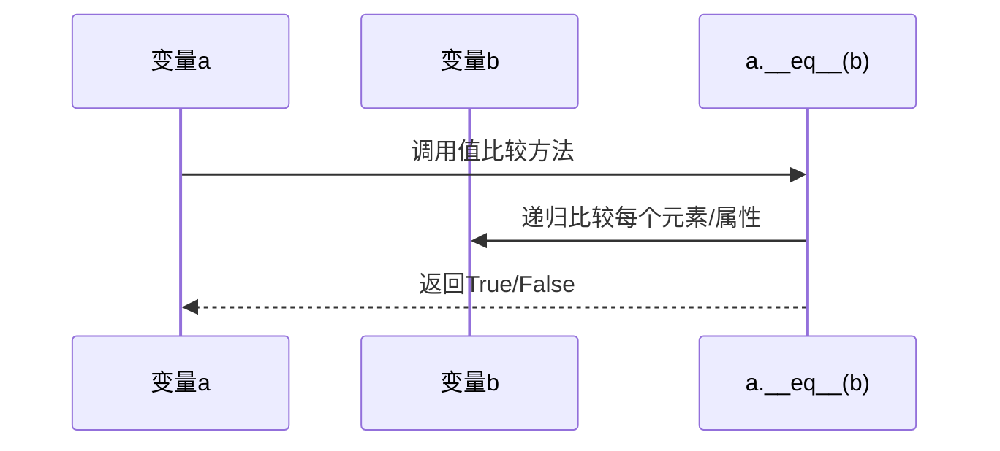
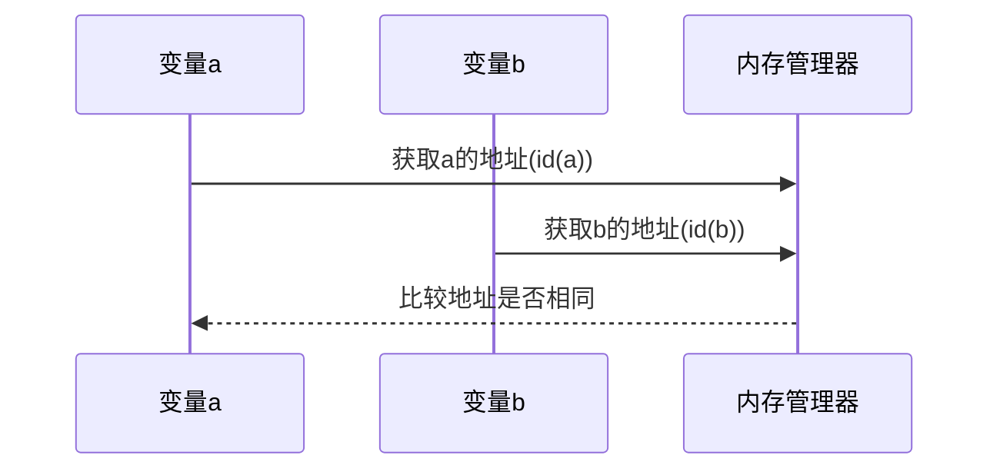
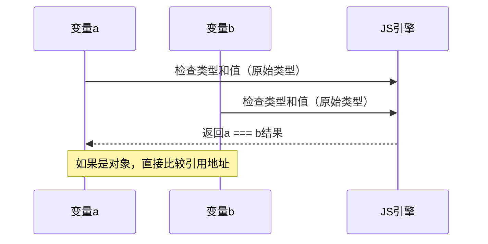
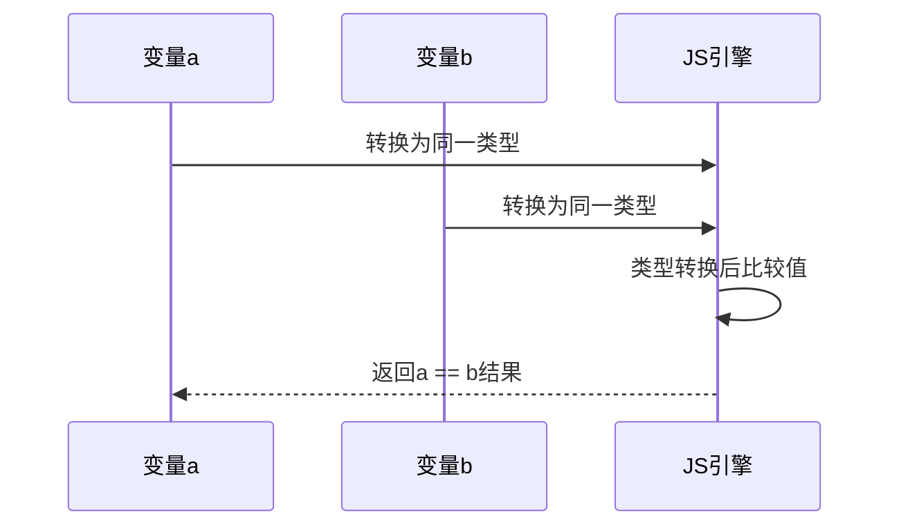

## 一、核心概念对比

| **概念**         | **Python**                    | **JavaScript**                        |
| ---------------- | ----------------------------- | ------------------------------------- |
| **值比较**       | 检查内容是否相等 (`==`)       | 检查值是否相等 (`==` 或 `===`)        |
| **内存地址比较** | 检查是否指向同一个对象 (`is`) | 检查是否引用同一个对象 (`===` 对对象) |
| **不可变类型**   | `int`, `str`, `tuple` 等      | `number`, `string`, `boolean` 等      |
| **可变类型**     | `list`, `dict`, `set` 等      | `Object`, `Array`, `Function` 等      |

---


## 语言特性对比
#### 1. **Python**

- **值比较（`==`）**：
  - 调用对象的 `__eq__` 方法，递归比较内容。
  - 对不可变对象（如字符串、小整数）可能因驻留机制优化内存，但比较时仍优先内容。
  - 示例：`[1, 2] == [1, 2]` → `True`。

- **内存地址比较（`is`）**：
  - 直接比较对象的 `id()`（内存地址）。
  - 示例：`a = [1, 2]; b = [1, 2]; a is b` → `False`。

#### 2. **JavaScript**

- **值比较（`==` 和 `===`）**：
  - `==`（宽松相等）：类型转换后比较值（如 `0 == "0"` → `true`）。
  - `===`（严格相等）：不转换类型，直接比较值和类型（如 `0 === "0"` → `false`）。
  - 对象（包括数组、函数）的 `===` 比较引用地址，而非内容。
  - 示例：`[1, 2] === [1, 2]` → `false`。

- **内存地址比较**：
  - JavaScript 无显式内存地址操作，但对象通过引用传递，`===` 隐式比较引用地址。
  - 示例：`const a = {}; const b = a; a === b` → `true`。

### 二、时序图分析

#### 1. **Python 值比较（`==`）**



#### 2. **Python 内存地址比较（`is`）**



#### 3. **JavaScript 严格相等（`===`）**



#### 4. **JavaScript 宽松相等（`==`）**



---

## Python的机制
###  值比较 (`==`)

- **行为**：递归比较对象的内容

- **示例**：

  ```python
  a = [1, 2]
  b = [1, 2]
  print(a == b)  # True（内容相同）
  ```

### 2. 内存地址比较 (`is`)

- **行为**：检查两个变量是否指向同一内存对象

- **底层实现**：通过 `id()` 获取对象地址

- **示例**：

  ```python
  a = [1, 2]
  b = a         # 指向同一个对象
  c = [1, 2]    # 新对象
  print(a is b) # True
  print(a is c) # False
  print(id(a) == id(b))  # 等效写法
  ```

### 3. 特殊规则（小整数池、字符串驻留）

- **小整数**：Python 缓存 -5 到 256 的整数

  ```python
  a = 100
  b = 100
  print(a is b)  # True
  ```

- **字符串驻留**：短字符串复用

  ```python
  s1 = "hello"
  s2 = "hello"
  print(s1 is s2)  # True
  ```

---

## JavaScript的机制
### 1. 值比较 (`===` 严格相等)

- **原始类型**：直接比较值

  ```javascript
  1 === 1          // true
  'a' === 'a'      // true
  ```

- **对象类型**：比较引用地址

  ```javascript
  const arr1 = [1, 2];
  const arr2 = [1, 2];
  console.log(arr1 === arr2); // false（不同内存地址）
  ```

### 2. 内存地址比较

- **本质**：对象变量的 `===` 比较的就是内存地址

- **示例**：

  ```javascript
  const obj1 = { x: 1 };
  const obj2 = obj1;     // 指向同一对象
  const obj3 = { x: 1 }; // 新对象
  
  console.log(obj1 === obj2); // true
  console.log(obj1 === obj3); // false
  ```

### 3. 特殊行为 (`==` 的隐式转换)

- **危险示例**：

  ```javascript
  console.log(0 == '0');    // true（类型转换）
  console.log(null == undefined); // true
  ```

---

## 深度比较的解决方案 JavaScript和Python
### 1. Python 的深度比较

- **标准库**：`collections` 模块

  ```python
  from collections import deque
  
  # 比较嵌套结构
  a = {'key': [1, 2, 3]}
  b = {'key': [1, 2, 3]}
  print(a == b)  # True（自动深度比较）
  ```

- **第三方库**：`deepdiff`

  ```python
  from deepdiff import DeepDiff
  
  diff = DeepDiff(a, b)
  print(not diff)  # True 表示内容相同
  ```

### 2. JavaScript 的深度比较

- **原生方案**：`JSON.stringify`（有缺陷）

  ```javascript
  const obj1 = {a: [1, 2]};
  const obj2 = {a: [1, 2]};
  console.log(JSON.stringify(obj1) === JSON.stringify(obj2)); // true
  ```

  - 缺陷：无法处理 `undefined` 和函数

- **最佳实践**：使用 Lodash 的 `isEqual`

  ```javascript
  import _ from 'lodash';
  
  console.log(_.isEqual(obj1, obj2)); // true
  ```

---

## 最佳实践
### Python

1. **值比较**：始终使用 `==`

2. **对象同一性检查**：使用 `is`（如判断 `None`）

   ```python
   if result is None:
       handle_error()
   ```

3. **避免小整数陷阱**：不要依赖 `is` 比较数字

### JavaScript

1. **严格模式**：始终使用 `===`

2. **对象比较**：使用 Lodash 的 `isEqual`

3. **特殊值检查**：

   ```javascript
   // 检查 null 或 undefined
   if (value == null) { 
     // 等效于 value === null || value === undefined
   }
   ```

---

