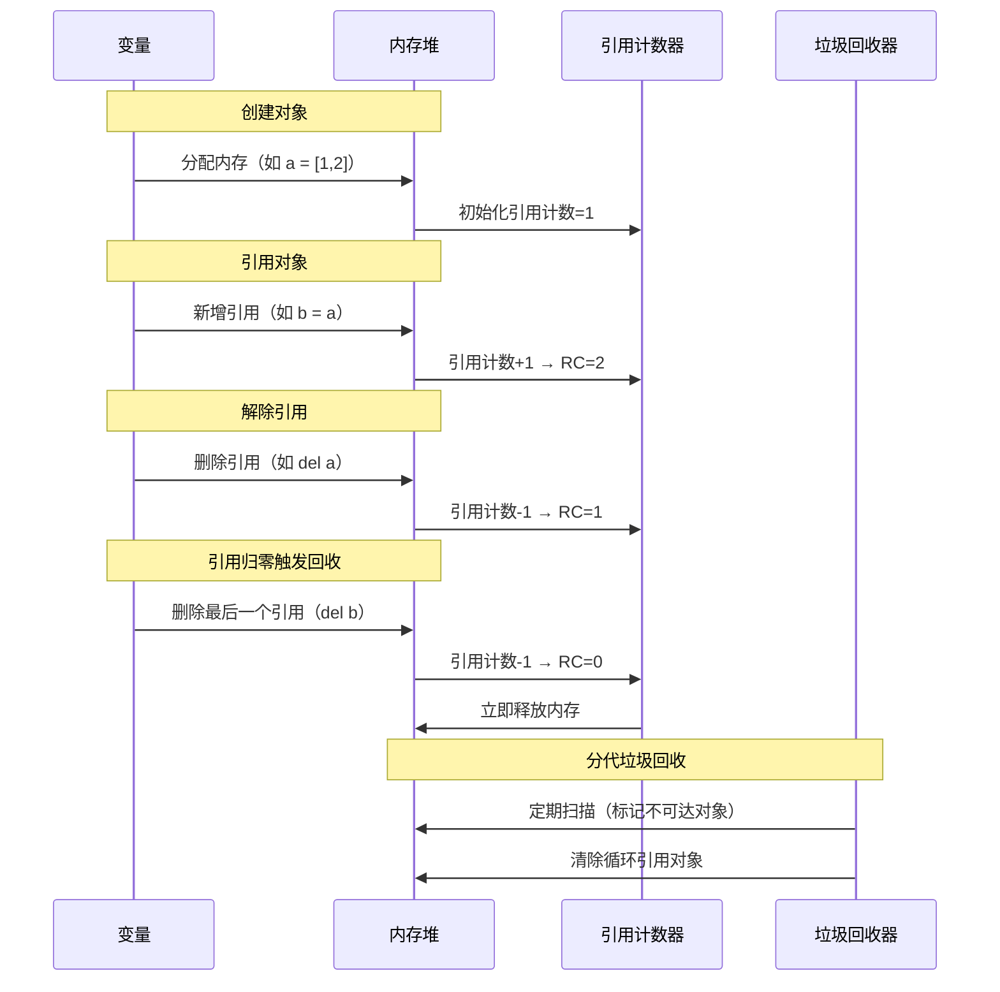
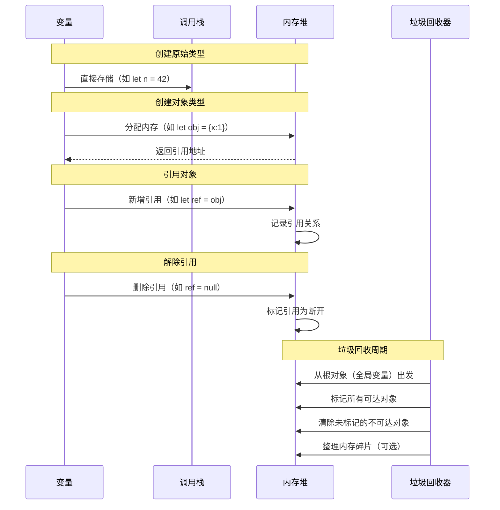

## 一、内存管理核心机制对比

| **特性**             | Python 3                         | JavaScript (V8 引擎)            |
| -------------------- | -------------------------------- | ------------------------------- |
| **主要算法**         | 引用计数 + 分代垃圾回收          | 标记-清除 + 分代回收 + 增量标记 |
| **内存分配**         | 私有堆内存，由 Python 内存管理器 | V8 堆内存（新生代/老生代）      |
| **即时回收**         | 引用计数为零时立即回收           | 周期性垃圾回收                  |
| **循环引用处理**     | 依赖分代回收处理                 | 标记-清除自动处理               |
| **手动控制**         | `gc` 模块可干预                  | 无直接控制 API                  |
| **典型内存泄漏场景** | 循环引用 + `__del__` 方法        | 未移除的事件监听器、全局变量    |

## Python的内存管理
### 1. 引用计数
Python 使用引用计数来管理内存。每个对象都有一个引用计数，当对象的引用计数为零时，它就会被垃圾回收器回收。
**引用计数（主机制）**

```python
a = [1,2,3]  # 引用计数 +1
b = a        # 引用计数 +1 → 2
del b        # 引用计数 -1 → 1
```

- 优点：即时回收
- 缺点：无法处理循环引用
### 2. 分代回收
Python 采用分代回收来处理循环引用。它将对象分为三代，每一代都有一个独立的垃圾回收器。
三代对象（0: 新生代，1: 青年代，2: 老年代）
**分代回收（辅助机制）**
```python
import gc
a = [1,2,3]
b = a
del b
gc.collect()  # 手动触发垃圾回收
```
### 循环引用处理
```python
import gc
a = [1,2,3]
b = a
a.append(b)  # 循环引用
del a
gc.collect()  # 手动触发垃圾回收
```

### 内存优化技巧
- **避免循环引用**：使用 `weakref` 模块

  ```python
  import weakref
  
  class Data:
      pass
  
  obj = Data()
  ref = weakref.ref(obj)  # 弱引用不增加计数
  ```

- **内存视图**：使用 `memoryview` 减少拷贝

  ```python
  data = bytearray(1024)
  mv = memoryview(data)
  ```

---

## JavaScript的内存管理
### 1. 垃圾回收机制
JavaScript 使用标记-清除 + 分代回收的垃圾回收机制。
**标记-清除（主机制）**
```javascript
let a = {name: 'Alice'};
let b = a;
a = null;  // 标记为可回收
```
- 优点：自动处理循环引用
- 缺点：可能导致内存碎片化

# 闭包内存泄漏
```javascript
function createCounter() {
    let count = 0;
    return function() {
        return count++;
    };
}
const counter = createCounter();
```

### javascript的内存泄漏场景
- 未移除的事件监听器
```javascript
function addEventListeners() {
    const button = document.getElementById('myButton');
    button.addEventListener('click', function() {
        console.log('Button clicked!');
    });
}
addEventListeners();
```
- 全局变量
```javascript
let globalVariable = 'I am a global variable';
```
- 未清理的定时器
```javascript
setInterval(function() {
    console.log('Timer is running!');
}, 1000);
```
- 未清理的请求
```javascript
const xhr = new XMLHttpRequest();
xhr.open('GET', '
- 未清理的请求
javascript
const xhr = new XMLHttpRequest();
xhr.open('GET', 'URL_ADDRESS.com/data');
xhr.send();
```
- 未清理的 DOM 元素
```javascript
document.getElementById('myButton').addEventListener('click', function() {
    console.log('Button clicked!');
});
const elements = {
  button: document.getElementById('myButton'),
  image: document.getElementById('myImage')
};

// 即使从 DOM 移除，JS 引用仍存在
document.body.removeChild(elements.button); 
// 需手动置空：elements.button = null
```
- 未清理的观察者（Observer）
```javascript
const observer = new MutationObserver(function(mutations) {
    console.log('Mutation detected!');
});
observer.observe(document.body, {childList: true});
```
- 未清理的 Promise
```javascript
const promise = new Promise(function(resolve, reject) {
    setTimeout(resolve, 1000);
});
promise.then(function() {
    console.log('Promise resolved!');
})
```
- 未清理的回调函数
- 未清理的异步操作
- 未清理的 WebSocket 连接
- 未清理的文件句柄

## javascript 和python 的内存分析工具
- **内置工具**：

  ```python
  import sys
  print(sys.getsizeof([1,2,3]))  # 输出 88（字节）
  
  import tracemalloc
  tracemalloc.start()
  # ... 代码 ...
  snapshot = tracemalloc.take_snapshot()
  ```

- **第三方库**：`objgraph` 可视化对象引用

### JavaScript 工具链

- **Chrome DevTools**：

  - Memory 面板：Heap Snapshots 分析
  - Performance 面板：内存时间线

- **Node.js 工具**：

  ```bash
  node --inspect index.js  # 启用调试
  ```

  - `process.memoryUsage()` API
  - `v8.getHeapStatistics()` API
- **第三方库**：`heapdump` 生成堆快照


## python和JavaScript的内存管理时序图
### 一、Python 3 内存管理时序图

#### 机制说明：

- **引用计数**：对象被引用时计数+1，引用解除时-1，归零时立即回收。
- **分代垃圾回收（GC）**：处理循环引用，分代（0/1/2代）标记-清除不可达对象。



---

### 二、JavaScript 内存管理时序图

#### 机制说明：

- **自动垃圾回收**：通过标记-清除（Mark-Sweep）或标记-整理（Mark-Compact）算法回收不可达对象。
- **内存堆与栈分离**：原始类型存栈，对象类型存堆。



---


## Python 程序退出与内存释放

### 问题：Python 程序退出时，是否释放所有分配的内存？

**答案：是的，通常情况下是这样。**

当一个 Python 程序（进程）正常退出或被终止时，操作系统会负责回收该进程所占用的所有资源，其中包括它所分配的全部内存空间。

详细说明：

1.  **操作系统层面**：
    *   现代操作系统（如 Linux, macOS, Windows）为每个运行的进程分配独立的虚拟地址空间。当进程结束时，操作系统会收回这个进程所使用的所有内存页，无论这些内存是Python解释器自己管理的堆内存、栈内存，还是通过其他方式（如C扩展库直接向系统申请的内存）分配的。
    *   这意味着，即使 Python 的垃圾回收机制在程序运行期间未能回收某些内存（例如，由于复杂的循环引用且未触发分代回收，或者C扩展中未正确释放的内存），一旦程序退出，这些内存最终也会被操作系统回收。

2.  **Python 解释器层面**：
    *   Python 解释器自身有其内存管理器和垃圾回收机制（引用计数、分代回收）。在程序运行期间，这些机制努力回收不再使用的对象。
    *   在解释器关闭（程序退出）的过程中，它通常会尝试进行一些清理工作，比如执行对象的 `__del__` 方法（如果定义了并且对象是可达的），关闭文件句柄等。然而，对于内存的最终回收，主要依赖于操作系统的能力。

3.  **例外和注意事项**：
    *   **外部资源**：虽然内存会被回收，但程序可能还占用了其他类型的资源，如打开的文件、网络连接、数据库连接、子进程等。良好的编程实践要求程序在退出前显式地释放这些资源（例如，通过 `finally` 块或 `with` 语句关闭文件和连接）。如果程序异常崩溃，这些外部资源可能不会被优雅地清理，但内存本身仍会被操作系统回收。
    *   **守护线程 (Daemon Threads)**：如果程序中有未结束的守护线程，它们会在主程序退出时被强行终止，它们占用的内存也会被回收。
    *   **C 扩展中的内存泄漏**：如果 Python 程序使用了行为不当的 C 扩展库，该库可能在 Python 内存管理器之外分配了内存并且没有正确释放。虽然操作系统在进程退出时会回收这部分内存，但这仍然属于 C 扩展本身的内存泄漏问题，可能在程序长时间运行时导致问题。

**总结**：
对于 Python 程序本身分配和管理的内存，以及其所依赖的库在进程空间内分配的内存，当程序退出时，操作系统会确保这些内存被完全回收。因此，从“程序退出后是否还有内存被占用”的角度来看，答案是“否”，所有分配给该进程的内存都会被操作系统回收。但这并不意味着开发者可以忽略程序运行期间的内存管理和资源释放，因为运行时的内存泄漏会导致程序性能下降甚至崩溃。

### 2. JavaScript 的垃圾回收机制详解

JavaScript 的内存生命周期分为三个阶段：
1. **内存分配**：当声明变量、函数、对象时，系统自动分配内存
2. **内存使用**：读写内存，即使用变量、函数等
3. **内存回收**：垃圾回收器自动回收不再使用的内存

#### 内存分配示例

```javascript
// 为基本类型分配内存
var n = 123;                    // 数值
var s = "azerty";              // 字符串

// 为对象分配内存
var o = {                      
    a: 1,
    b: null
};                            

// 为数组分配内存
var a = [1, null, "abra"];     

// 为函数分配内存
function f(a) {                
    return a + 2;
}

// 函数表达式分配内存
element.addEventListener('click', function() {
    element.style.backgroundColor = 'blue';
}, false);

// 对象方法分配内存
var d = new Date();            // 分配 Date 对象
var e = document.createElement('div'); // 分配 DOM 元素

// 方法调用分配新内存
var s2 = s.substr(0, 3);       // 新字符串
var a3 = a.concat(a2);         // 新数组
```
