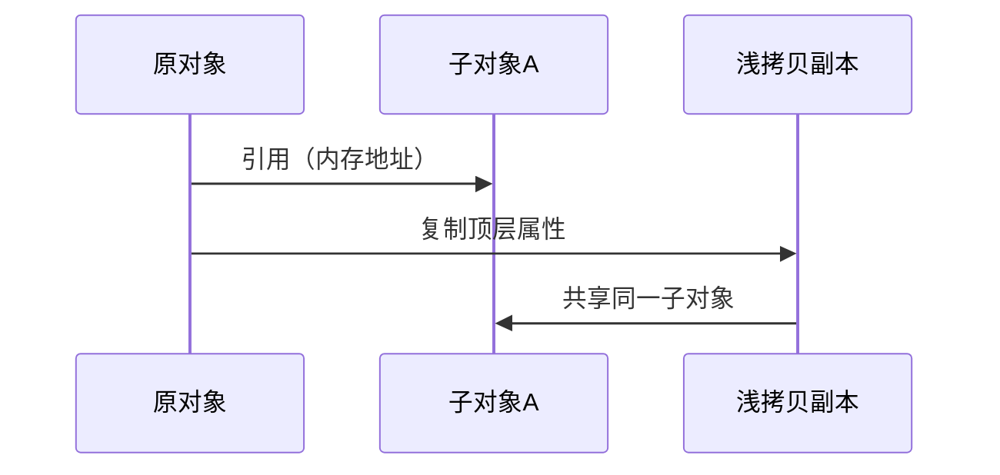
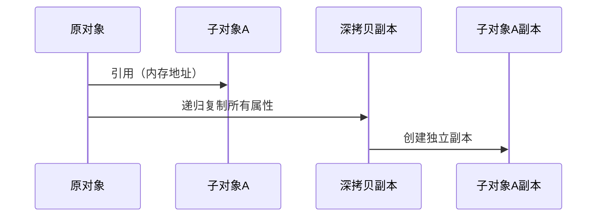

### 深拷贝 vs 浅拷贝：概念与区别


#### 1. **基本定义**：

- **浅拷贝**：仅复制对象的顶层属性，如果属性是引用类型（如对象、数组），则拷贝的是引用地址（共享内存）。
- **深拷贝**：递归复制对象及其所有嵌套的子对象，生成完全独立的新对象（不共享内存）。

#### 2. **核心区别**：

| 特性             | 浅拷贝                   | 深拷贝                   |
| ---------------- | ------------------------ | ------------------------ |
| **复制层级**     | 仅复制顶层属性           | 递归复制所有层级         |
| **引用类型处理** | 共享引用（修改互相影响） | 独立副本（修改互不影响） |
| **内存占用**     | 低（共享内存）           | 高（完全独立内存）       |
| **性能**         | 快                       | 慢（需遍历所有属性）     |

---

### 时序图拆解原理（Mermaid）

#### **浅拷贝时序图**：



- **关键行为**：  
  浅拷贝副本与原对象共享子对象，修改 `浅拷贝副本.子对象A` 会同步影响原对象。

---

#### **深拷贝时序图**：



- **关键行为**：  
  深拷贝副本生成完全独立的 `子对象A副本`，与原对象无关联，修改互不影响。

---

### 示例代码对比（JavaScript）

```javascript
// 原对象
const original = { a: 1, nested: { b: 2 } };

// 浅拷贝
const shallowCopy = { ...original };
shallowCopy.nested.b = 99;
console.log(original.nested.b); // 输出 99（共享子对象）


// 深拷贝
const deepCopy = JSON.parse(JSON.stringify(original));
deepCopy.nested.b = 100;
console.log(original.nested.b); // 输出 99（完全独立）
```

---

### **使用场景**：

- **浅拷贝**：适用于简单对象或无需隔离子对象的场景（如配置共享）。
- 配置对象的基础属性复制
- 快速创建相似结构的轻量对象
- 函数参数传递时防止原始对象被修改
- **深拷贝**：适用于需要完全隔离数据的场景（如状态快照、撤销操作）。 
- 需要完全独立的状态管理（如 Redux reducer）
- 缓存复杂数据结构的瞬时快照
- 处理来自外部的不安全数据副本

### JavaScript 中实现深拷贝和浅拷贝的方法
### 1. 浅拷贝实现

```javascript
// 对象浅拷贝
const obj = { a: 1, b: { c: 2 } };
const shallowObj = Object.assign({}, obj); 
// 或使用展开运算符
const spreadCopy = { ...obj };

// 数组浅拷贝
const arr = [1, [2, 3]];
const shallowArr = arr.slice();
// 或使用展开运算符
const spreadArr = [...arr];
```

### 2. 深拷贝实现

```javascript
// 方法1：JSON 序列化（有局限）
const deepCopy = JSON.parse(JSON.stringify(obj));

// 方法2：递归拷贝函数
function deepClone(source) {
  if (source === null || typeof source !== 'object') return source;
  const target = Array.isArray(source) ? [] : {};
  for (let key in source) {
    if (source.hasOwnProperty(key)) {
      target[key] = deepClone(source[key]);
    }
  }
  return target;
}

// 方法3：使用第三方库 Lodash
import _ from 'lodash';
const perfectCopy = _.cloneDeep(obj);
```

**JSON 方法的局限性**：

- 无法处理 `undefined`、`function`、`Symbol`
- 会丢失 Date 对象的类型（转为 ISO 字符串）
- 无法处理循环引用

## Python 中实现深拷贝和浅拷贝的方法
### 1. 浅拷贝实现

```python
import copy

# 列表浅拷贝
original_list = [1, [2, 3]]
shallow_list = original_list.copy()  # 或 list(original_list)
shallow_list2 = copy.copy(original_list)

# 字典浅拷贝
original_dict = {'a': 1, 'b': {'c': 2}}
shallow_dict = original_dict.copy()
shallow_dict2 = dict(original_dict)
```

### 2. 深拷贝实现

```python
import copy

original = [1, [2, 3]]
deep_copy = copy.deepcopy(original)

# 验证独立性
original[1][0] = 99
print(deep_copy)  # 输出 [1, [2, 3]]（未受影响）
```

**`deepcopy` 特性**：

- 处理循环引用：自动维护已复制对象的备忘录
- 保留对象类型：包括自定义类实例
- 控制复制行为：可通过定义 `__deepcopy__` 方法自定义

## Python和JavaScript实现深拷贝和浅拷贝的方法区别
## 

| **维度**     | JavaScript                          | Python 3                     |
| ------------ | ----------------------------------- | ---------------------------- |
| **原生支持** | 无原生深拷贝方法                    | 标准库提供 `copy.deepcopy()` |
| **最佳实践** | 推荐使用 Lodash 的 `cloneDeep`      | 直接使用标准库               |
| **循环引用** | 需要自行处理（如使用 WeakMap 跟踪） | `deepcopy` 自动处理          |
| **特殊对象** | 需要手动处理 Date/RegExp 等类型     | 自动处理所有内置类型         |
| **性能优化** | 递归实现需注意栈溢出问题            | 标准库实现高度优化           |