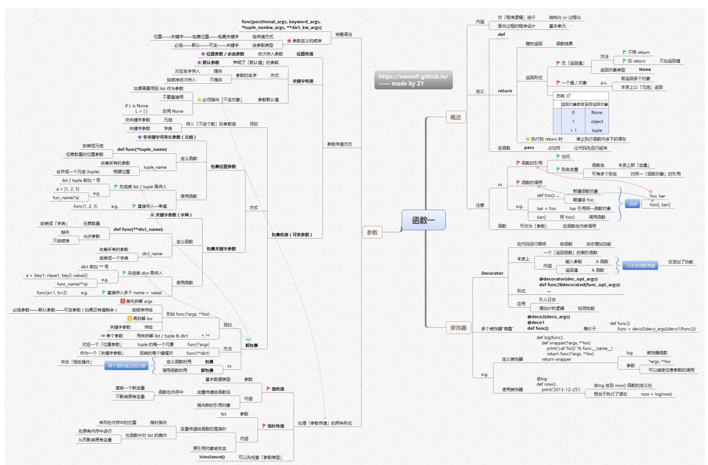
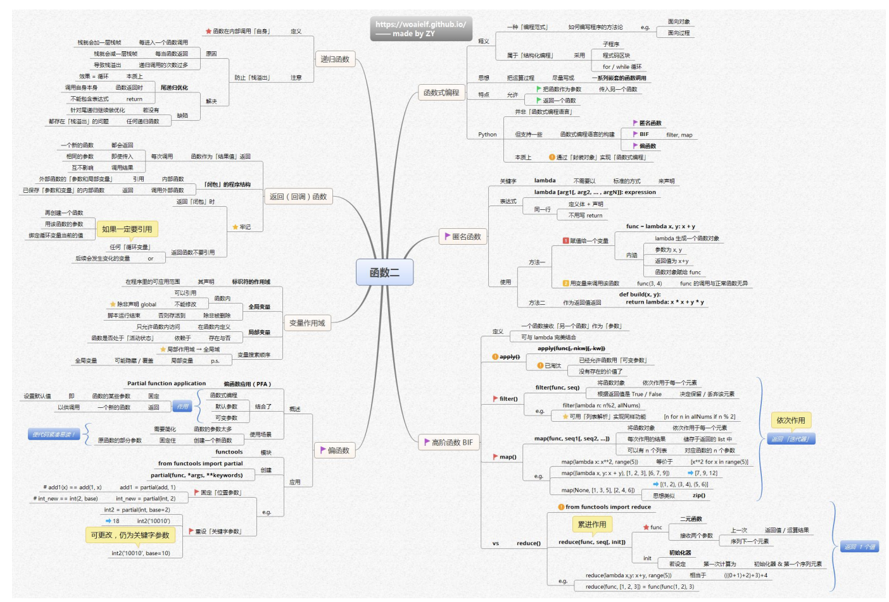

## 思维导图
这张思维导图围绕Python函数展开，内容如下：




## 概述
这张思维导图围绕Python函数的概述展开，内容如下：

### 内涵
- 函数是对程序逻辑进行结构化或过程化的基本单元，属于面向过程程序设计范畴。

### 定义
- **关键字与结构**：使用`def`关键字定义函数。
- **返回形式**
    - **随时返回函数结果**：通过`return`语句返回。
    - **无返回值情况（方法）**：不用`return` ；仅`return`不跟返回值，返回对象类型为`None` 。
    - **返回一个值或对象**：直接返回。若返回多个对象，本质上以元组形式返回。总结为：返回对象数目为0时返回`None` ；为1时返回对象本身；大于1时返回元组。执行到`return`时，会停止执行函数内余下的语句。
- **空函数**：使用`pass`作为占位符，可使代码先运行起来，用于定义暂时未编写具体逻辑的函数。

### 函数与其他概念对比（vs）
- **函数的引用与调用**
    - **函数的引用**：函数名本质上是变量，可通过别名变量访问，一个函数可有多个别名，都指向同一函数对象。
    - **函数的调用**：调用函数时会新建函数对象并执行。示例中，`def foo():`定义函数`foo`，`bar = foo`使`bar`引用同一函数对象，`bar()`等同于`foo()` ，都是调用函数。
- **注意事项**：函数可作为参数在其他函数体内被调用。 

## 函数参数
这张思维导图围绕Python函数的参数展开，内容如下：
### 完整的语法
```python
def function_name([formal_args,] *args, **kwargs):
    """函数文档字符串"""
    function_suite
    return [expression]
```
参数定义的顺序 ： 按照传递方式是  位置-关键字-默认-可变-关键字可变
按照参数类型是  必选-默认-可变-关键字
## 参数的传递方式
### 位置参数(传递)

### 关键字参数(传递)
关键字参数允许您在调用函数时，通过指定参数名来传递值，而不必关心参数的顺序。这使得函数调用更具可读性，特别是当函数有多个参数时。

**基本用法**：

```python
def describe_person(name, age, city):
    print(f"{name} is {age} years old and lives in {city}.")

# 使用关键字参数调用，顺序可以任意
describe_person(age=30, city="New York", name="Alice")
# 输出: Alice is 30 years old and lives in New York.

# 也可以混合位置参数和关键字参数
# 但位置参数必须在关键字参数之前
describe_person("Bob", city="London", age=25)
# 输出: Bob is 25 years old and lives in London.
```
默认参数值
在定义函数时，可以为参数指定默认值。如果调用函数时没有为这些参数提供值，它们将自动使用默认值。

- 声明 ：在函数定义时，使用 param_name=default_value 的形式声明带有默认值的参数。
- 调用方式 ：
  - 提供参数值 ：如果调用时为该参数提供了值（无论是通过位置还是关键字），则使用提供的值。
  - 不提供参数值 ：如果调用时未提供该参数的值，则使用其默认值。

**示例**：
```python
def greet(name, message="Hello"):
    print(f"{message}, {name}!")
greet("Alice")  # 输出: Hello, Alice!
greet("Bob", "Hi")  # 输出: Hi, Bob!
```
重要规则 ：

- 在函数定义中，所有带有默认值的参数必须位于没有默认值的参数之后。
- 调用时，关键字参数必须在位置参数之后。
参数默认值与可变对象
当使用可变对象（如列表 list 、字典 dict ）作为参数的默认值时，需要特别注意。

- 潜在问题 ：函数的默认参数值是在函数定义时计算和创建的，而不是在每次函数调用时。如果默认值是一个可变对象，并且在函数体内被修改，那么这个修改会影响到后续所有使用该默认值的调用。
```python
def add_item_buggy(item, my_list=[]): # my_list 的默认值 [] 在函数定义时创建一次
    my_list.append(item)
    return my_list

print(add_item_buggy(1))    # 输出: [1]
print(add_item_buggy(2))    # 输出: [1, 2] (my_list 仍然是上一次调用修改后的对象)
print(add_item_buggy(3, [10])) # 输出: [10, 3] (提供了新的列表，不受影响)
print(add_item_buggy(4))    # 输出: [1, 2, 4] (再次使用默认列表，它已经被修改)
```
推荐做法：使用 None 作为哨兵值 ：
为了避免上述问题，推荐将可变对象的默认值设置为 None ，然后在函数体内检查该参数是否为 None 。如果是，则在函数内部创建一个新的可变对象实例。
```python
def add_item_correct(item, my_list=None):
    if my_list is None:
        my_list = []  # 每次调用时，如果未提供 my_list，则创建一个新的空列表
    my_list.append(item)
    return my_list

print(add_item_correct(1))       # 输出: [1]
print(add_item_correct(2))       # 输出: [2] (这次 my_list 是新创建的)
print(add_item_correct(3, [10]))  # 输出: [10, 3]
print(add_item_correct(4))       # 输出: [4]
```
**注意事项**：
### 包裹传递（可变参数）

#### 包裹位置传递

#### 包裹关键字传递

#### 解包裹

解包裹（Unpacking）是指在函数调用时，将序列（如列表、元组）或字典的元素拆分开来，作为独立的参数传递给函数。这与函数定义时的包裹（Packing，使用 `*args` 和 `**kwargs`）是相对的操作。

**目的**：

-   将已有的序列或字典数据便捷地传递给接受多个独立参数的函数。

**方法**：

1.  **使用 `*` 解包裹序列 (list/tuple) 为位置参数**：
    当调用函数时，在序列类型（如列表或元组）的变量前加上一个星号 `*`，Python 会将该序列中的每个元素作为独立的位置参数传递给函数。

    ```python
    def greet(name, age, city):
        print(f"Hello, {name}! You are {age} years old and live in {city}.")

    person_info_list = ["Alice", 30, "New York"]
    greet(*person_info_list)  # 等同于 greet("Alice", 30, "New York")
    # 输出: Hello, Alice! You are 30 years old and live in New York.

    person_info_tuple = ("Bob", 25, "London")
    greet(*person_info_tuple) # 等同于 greet("Bob", 25, "London")
    # 输出: Hello, Bob! You are 25 years old and live in London.
    ```

2.  **使用 `**` 解包裹字典 (dict) 为关键字参数**：
    当调用函数时，在字典类型的变量前加上两个星号 `**`，Python 会将字典中的每个键值对作为独立的关键字参数传递给函数。字典的键必须是字符串，并且与函数定义的参数名相匹配。

    ```python
    def describe_pet(name, animal_type, owner):
        print(f"{owner} has a {animal_type} named {name}.")

    pet_details = {"name": "Buddy", "animal_type": "dog", "owner": "Charlie"}
    describe_pet(**pet_details) # 等同于 describe_pet(name="Buddy", animal_type="dog", owner="Charlie")
    # 输出: Charlie has a dog named Buddy.

    # 键的顺序不重要，只要匹配参数名即可
    pet_details_reordered = {"animal_type": "cat", "owner": "David", "name": "Whiskers"}
    describe_pet(**pet_details_reordered)
    # 输出: David has a cat named Whiskers.
    ```

**包裹 (Packing) vs 解包裹 (Unpacking)**：

-   **包裹 (Packing)**：在函数定义时使用 `*args` 和 `**kwargs`。目的是让函数能够接收任意数量的位置参数和关键字参数，并将它们分别收集到一个元组 (`args`) 和一个字典 (`kwargs`) 中。
    ```python
    def process_data(*args, **kwargs):
        print("Positional arguments (packed into a tuple):", args)
        print("Keyword arguments (packed into a dictionary):", kwargs)

    process_data(1, 2, name="Test", value=100) 
    # Positional arguments (packed into a tuple): (1, 2)
    # Keyword arguments (packed into a dictionary): {'name': 'Test', 'value': 100}
    ```

-   **解包裹 (Unpacking)**：在函数调用时使用 `*` 和 `**`。目的是将一个已存在的序列或字典拆分成独立的参数传递给函数。

总结来说，包裹和解包裹是相辅相成的概念：

-   定义函数时用 `*args`, `**kwargs` 来 **收集** (包裹) 多个参数。
-   调用函数时用 `*iterable`, `**dictionary` 来 **散开** (解包裹) 集合类型的参数。

它们提供了极大的灵活性，使得函数可以处理不同数量和类型的参数，并且可以方便地将已有的数据结构传递给函数。

**传递顺序（当同时使用时）**：

在函数调用时，如果同时使用位置参数、解包裹的序列、关键字参数和解包裹的字典，其一般顺序是：

1.  普通位置参数
2.  解包裹的序列 (`*args`)
3.  普通关键字参数
4.  解包裹的字典 (`**kwargs`)

```python
def example_func(a, b, c, d, e, f):
    print(f"a={a}, b={b}, c={c}, d={d}, e={e}, f={f}")

pos_args = [20, 30]
kw_args = {'e': 500, 'f': 600}

example_func(10, *pos_args, d=400, **kw_args)
# 等同于 example_func(10, 20, 30, d=400, e=500, f=600)
# 注意：这里假设函数定义中 c 是位置参数，d, e, f 可以是位置或关键字参数
# 为了更清晰，通常函数定义会是 def example_func(a, b, c, *, d, e, f) 或类似形式来强制关键字参数

# 一个更明确的例子：
def another_func(p1, p2, *, k1, k2):
    print(f"p1={p1}, p2={p2}, k1={k1}, k2={k2}")

list_vals = ["val2"]
dict_vals = {"k2": "val_k2"}

another_func("val1", *list_vals, k1="val_k1", **dict_vals)
# 输出: p1=val1, p2=val2, k1=val_k1, k2=val_k2
```
### 处理参数传递的2种方式
#### 值传递

#### 引用传递


## 装饰器

## 函数式编程

## 匿名函数

## 高阶函数

## 偏函数

## 变量的作用域

## 回调函数

## 递归函数

## 闭包