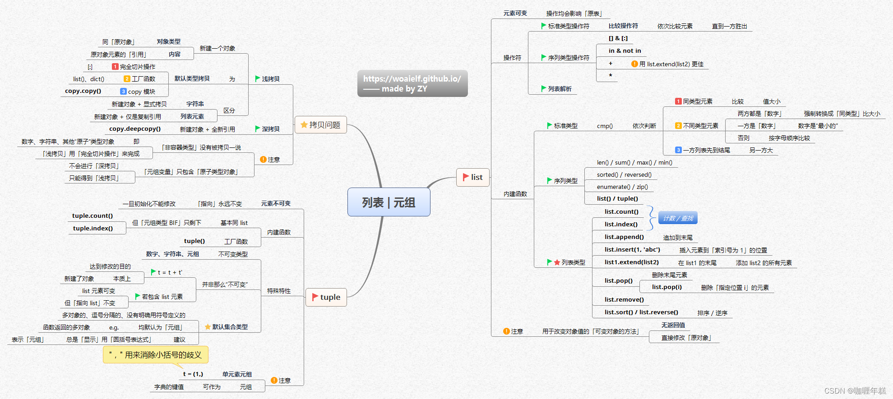

# Python 列表与元组深度剖析

## 一、引言
- 简单介绍 Python 中列表（list）和元组（tuple）在编程中的重要性和广泛应用场景
- 思维导图


## 二、列表与元组基础概念
### （一）列表（list）
1. 定义与基本特性
    -列表（List） 是一种有序、可变的容器，用于存储一组任意类型的元素。它是通过方括号 [] 定义的，元素之间用逗号分隔。
    - python中列表的创建方式：
        - 使用方括号 [] 创建
        - 使用 list() 函数创建
        - 使用列表解析创建

```python
# 基础创建方式
numbers = [1, 2, 3, 4, 5]  # 整数列表
fruits = ['苹果', '香蕉', '橙子']  # 字符串列表
mixed = [1, '文本', 3.14, True]  # 混合类型列表

# 使用构造器
from_tuple = list((1, 2, 3))  # 从元组创建
from_string = list("Python")  # 从字符串创建

# 特殊创建方式
zeros = [0] * 10  # 创建10个0的列表
```

#### 2. 列表操作符
##### - 标准类型操作符：如比较操作符（==、!= 等） 依次比较元素，知道一方胜出
```python
def comparelist(list1,list2):
    # 获取最小长度，返回比较结果和第一个不相等元素的索引位置
    min_len = min(len(list1), len(list2))
   
    for i in range(min_len):
        if list1[i] < list2[i]:
            return '<', i
        elif list1[i] > list2[i]:
            return '>', i
    
    # 如果元素都相等，比较长度
    if len(list1) < len(list2):
        return '<', min_len
    elif len(list1) > len(list2):
        return '>', min_len
    else:
        return '==', None

    # 测试用例
    if __name__ == "__main__":
        test_cases = [
            ([1, 2, 3], [1, 2, 4]),
            ([1, 2, 3], [1, 2, 3, 4]),
            ([1, 2, 5], [1, 2, 3]),
            ([1, 2, 3], [1, 2, 3])
        ]
        
        for list1, list2 in test_cases:
            result, index = comparelist(list1, list2)
            print(f"{list1} {result} {list2}", end="")
            if index is not None:
                print(f"，第一个不同元素位置：{index}")
            else:
                print()
```

```txt
[1, 2, 3] < [1, 2, 4]，第一个不同元素位置：2
[1, 2, 3] < [1, 2, 3, 4]，第一个不同元素位置：3
[1, 2, 5] > [1, 2, 3]，第一个不同元素位置：2
[1, 2, 3] == [1, 2, 3]
```

##### - 序列类型操作符：[]、[:]、in、not in、+、* 等

     - `[]` 操作符主要用于通过索引访问序列（如列表、元组、字符串等）中的单个元素 ，也可用于修改列表中指定索引位置的元素值。
    - [] 的典型场景：
        获取特定位置元素
        修改可变序列（如列表）的元素值
        与循环结合遍历序列（如for i in range(len(my_list)): print(my_list[i])）
     - `[:]` 操作符用于创建一个新的序列，包含原序列中的所有元素。它可以用于复制列表、元组或字符串。
     - [:] 的典型场景：
        复制序列（与copy()方法等效）
        获取子序列（如前 N 个元素、每隔固定间隔的元素）
        反转序列（使用步长 - 1）
        批量修改序列元素（通过赋值给切片）

```python
# 示例序列
my_list = [10, 20, 30, 40, 50]

# 一、[]操作符 - 访问和修改单个元素
# 1. 正向索引访问
print("正向索引访问:")
print(f"索引0: {my_list[0]}")  # 输出: 10
print(f"索引3: {my_list[3]}")  # 输出: 40

# 2. 负向索引访问
print("\n负向索引访问:")
print(f"索引-1: {my_list[-1]}")  # 输出: 50
print(f"索引-3: {my_list[-3]}")  # 输出: 30

# 3. 修改元素(仅列表支持)
my_list[1] = 200  # 修改索引1的元素
my_list[-2] = 400  # 修改索引-2的元素
print("\n修改后的列表:", my_list)  # 输出: [10, 200, 30, 400, 50]

# 二、[:]操作符 - 切片操作(创建子序列)
# 1. 完整切片复制列表
new_list = my_list[:]
print("\n完整切片复制的列表:", new_list)  # 输出: [10, 200, 30, 400, 50]

# 2. 指定范围切片
print("\n指定范围切片:")
print(f"索引1到3: {my_list[1:3]}")  # 输出: [200, 30]
print(f"索引2到末尾: {my_list[2:]}")  # 输出: [30, 400, 50]
print(f"开头到索引3: {my_list[:3]}")  # 输出: [10, 200, 30]

# 3. 使用步长的切片
print("\n使用步长的切片:")
print(f"每隔一个元素: {my_list[::2]}")  # 输出: [10, 30, 50]
print(f"逆序列表: {my_list[::-1]}")  # 输出: [50, 400, 30, 200, 10]

# 4. 修改切片(仅列表支持)
my_list[1:3] = [2000, 3000]  # 修改索引1到2的元素
print("\n修改切片后的列表:", my_list)  # 输出: [10, 2000, 3000, 400, 50]
```


##### - `in` 和 `not in` 操作符用于检查某个元素是否存在于序列中。
    in：检查元素是否存在于序列中
    not in：检查元素是否不存在于序列中
返回值均为布尔类型（True 或 False）
    适用场景：
        列表、元组、字符串等所有序列类型
        集合（set）和字典（检查键）
        自定义类（如果实现了 __contains__ 方法
    条件判断（如示例中的 if 10 in my_list:）
    数据验证（检查输入是否合法）
    避免重复（如 if item not in my_list: my_list.append(item)）
    。
```python
# 示例序列
my_list = [10, 20, 30, 40, 50]
my_tuple = (10, 20, 30, 40, 50)
my_string = "Hello, World!"

# 三、in和not in操作符 - 成员资格检查
# 1. 列表中的成员检查
print("\n=== 列表成员检查 ===")
print(f"20 in my_list: {20 in my_list}")      # 输出: True
print(f"100 not in my_list: {100 not in my_list}")  # 输出: True
print(f"30 not in my_list: {30 not in my_list}")  # 输出: False
```

     - `+` 操作符用于将两个序列拼接成一个新的序列。
     - `*` 操作符用于将序列重复多次

```python
# 示例序列
list1 = [1, 2, 3]
list2 = [4, 5, 6]
tuple1 = (10, 20, 30)
tuple2 = (40, 50, 60)
string1 = "Hello"
string2 = "World"
# 四、+操作符 - 序列拼接
# 1. 列表拼接
print("\n=== 列表拼接 ===")
print(f"list1 + list2: {list1 + list2}")  # 输出: [1, 2, 3, 4, 5, 6]
# 2. 元组拼接
print("\n=== 元组拼接 ===")
print(f"tuple1 + tuple2: {tuple1 + tuple2}")  # 输出: (10, 20, 30, 40, 50, 60)
# 3. 字符串拼接
print("\n=== 字符串拼接 ===")
print(f"string1 + string2: {string1 + string2}")  # 输出: HelloWorld
# 五、*操作符 - 序列重复
# 1. 列表重复
print("\n=== 列表重复 ===")
print(f"list1 * 3: {list1 * 3}")  # 输出: [1, 2, 3, 1, 2, 3, 1, 2, 3]
# 2. 元组重复
print("\n=== 元组重复 ===")
print(f"tuple1 * 2: {tuple1 * 2}")  # 输出: (10, 20, 30, 10, 20, 30)
# 3. 字符串重复
print("\n=== 字符串重复 ===")
print(f"string1 * 3: {string1 * 3}")  # 输出: HelloHelloHello
```

    - 强调列表解析的用法与优势
####  3. 列表内建函数
    - len()、sum()、max()、min() 等函数功能介绍
    len 是一个内置函数，用于返回对象的长度（元素的数量）。它支持多种数据类型，
```python
# len() 是一个内置函数，用于返回对象的长度（元素的数量）。它支持多种数据类型，以下是常见用法和示例：
mylist = [1, 2, 3, 4, 5]
print(len(mylist))  # 输出: 5
```
    sum 是一个内置函数，用于计算可迭代对象中所有元素的总和。它支持数字类型的可迭代对象，例如列表、元组等。
```python
# sum() 是一个内置函数，用于计算可迭代对象中所有元素的总和。它支持数字类型的可迭代对象，例如列表、元组等。以下是常见用法和示例：
mylist = [1, 2, 3, 4, 5]
print(sum(mylist))  # 输出: 15
```
    在sum中有一些常见的错误
    非数列表求和
```python
# 非数列表求和
mylist = [1, 2, 3, 4, 5]
mylist.append('a')
print(sum(mylist))  # 输出: TypeError: unsupported operand type(s) for +: 'int' and 'str'
```
    空列表求和
```python
# 空列表求和    
mylist = []
print(sum(mylist))  # 输出: TypeError: 'sum()' received an empty iterable
```

    max 是一个内置函数，用于返回可迭代对象中的最大值。它支持数字类型的可迭代对象，例如列表、元组等。
```python
# max() 是一个内置函数，用于返回可迭代对象中的最大值。它支持数字类型的可迭代对象，例如列表、元组等。以下是常见用法和示例：
mylist = [1, 2, 3, 4, 5]
print(max(mylist))  # 输出: 5
```
    min 是一个内置函数，用于返回可迭代对象中的最小值。它支持数字类型的可迭代对象，例如列表、元组等。
```python
# min() 是一个内置函数，用于返回可迭代对象中的最小值。它支持数字类型的可迭代对象，例如列表、元组等。以下是常见用法和示例：
mylist = [1, 2, 3, 4, 5]
print(min(mylist))  # 输出: 1
```

    sorted()、reversed() 等排序相关函数
    sorted 是一个内置函数，用于对可迭代对象进行排序。它返回一个新的已排序的列表，原始对象保持不变。
```python
# sorted() 是一个内置函数，用于对可迭代对象进行排序。它返回一个新的已排序的列表，原始对象保持不变。以下是常见用法和示例：   
mylist = [3, 1, 4, 1, 5, 9, 2, 6, 5, 3, 5]
sorted_list = sorted(mylist)
print(sorted_list)  # 输出: [1, 1, 2, 3, 3, 4, 5, 5, 5, 6, 9]
```
    reversed 是一个内置函数，用于返回一个反转的迭代器。它不会改变原始对象，而是返回一个可迭代的对象。
```python
# reversed() 是一个内置函数，用于返回一个反转的迭代器。它不会改变原始对象，而是返回一个可迭代的对象。以下是常见用法和示例：
mylist = [1, 2, 3, 4, 5]
reversed_list = reversed(mylist)
print(list(reversed_list))  # 输出: [5, 4, 3, 2, 1]
```
#### 4. 列表类型方法
- 计数与查找：count()、index()
- 元素添加：append()、insert()、extend()
- 元素删除：pop()、remove()
    - 排序与逆序：sort()、reverse()
        ```python
        fruits = ['apple', 'banana', 'cherry']
        # count() 方法用于计算列表中某个元素出现的次数
        print(fruits.count('apple'))  # 输出: 1
        print(fruits.count('banana'))  # 输出: 1

        # index() 方法用于查找列表中某个元素的索引
        print(fruits.index('banana'))  # 输出: 1

        #append() 方法用于在列表末尾添加元素
        fruits.append('orange')
        print(fruits)  # 输出: ['apple', 'banana', 'cherry', 'orange']

        # insert() 方法用于在指定位置插入元素
        fruits.insert(1, 'kiwi')
        print(fruits)  # 输出: ['apple', 'kiwi', 'banana', 'cherry', 'orange']
        # remove() 方法用于删除列表中的指定元素
        fruits.remove('banana')
        print(fruits)  # 输出: ['apple', 'kiwi', 'cherry', 'orange']
        # pop() 方法用于删除指定索引位置的元素
        fruits.pop(2)
        print(fruits)  # 输出: ['apple', 'kiwi', 'orange']
        # sort() 方法用于对列表进行排序
        fruits.sort()
        print(fruits)  # 输出: ['apple', 'kiwi', 'orange']
        # reverse() 方法用于反转列表
        fruits.reverse()
        print(fruits)  # 输出: ['orange', 'kiwi', 'apple']
        # copy() 方法用于复制列表
        fruits_copy = fruits.copy()
        print(fruits_copy)  # 输出: ['orange', 'kiwi', 'apple']
        # clear() 方法用于清空列表
        fruits.clear()
        print(fruits)  # 输出: []
        ```

### （二）元组（tuple）
1. 定义与基本特性
    Python 的元组与列表类似，不同之处在于元组的元素不能修改。元组使用小括号 ( )，列表使用方括号 [ ]。元组创建很简单，只需要在括号中添加元素，并使用逗号隔开即可。
    基本创建
```python
# 基础创建方式
empty_tuple = ()  # 空元组
single_item = (42,)  # 单元素元组(必须有逗号)
#单元素时必须加逗号，否则会被识别为普通变量（如 (5) 是整数，(5,) 是元组）。
numbers = (1, 2, 3, 4, 5)  # 多元素元组
mixed = (1, "文本", 3.14, True)  # 混合类型元组

# 使用构造器
from_list = tuple([1, 2, 3])  # 从列表创建
from_string = tuple("Python")  # 从字符串创建
```
    元组的基本特性
-  不可变性: 元组一旦创建，其元素不能被修改。引用不可变：元组中元素的引用固定，但如果元素是可变对象（如列表），其内容可修改：

    ```python
    tup = (1, 2, 3)
    tup[0] = 10  # 报错：TypeError
    ```
    ```python
    tup = (1, [2, 3])
    tup[1].append(4)  # 合法：tup 变为 (1, [2, 3, 4])
    ```
- 有序性: 元组中的元素按照它们添加的顺序进行存储。
    ```python
    tup = ("a", "b", "c")
    print(tup[1])    # 输出 "b"
    print(tup[1:3])  # 输出 ("b", "c")

    ```
- 可以存储任意数据类型的数据
    ```python
    tup = (1, "文本", 3.14, True)
    ```
- 可迭代: 元组可以被迭代，如使用 for 循环。
    ```python
    tup = (1, 2, 3)
    for item in tup:
        print(item)
    ```
- 支持嵌套: 元组中的元素可以是其他元组。
    ```python
    tup = ((1, 2), (3, 4))
    ```
- 可哈希: 元组可以作为字典的键或集合的元素。
    ```python
    tup = (1, 2, 3)
    my_dict = {tup: "值"}
    print(my_dict)  # 输出 {(1, 2, 3): "值"}
    ```
- 支持序列操作: 元组支持序列操作，如索引、切片、连接、重复等。

- 支持解包：可以将元组的元素解包到多个变量中。
    ```python
    tup = (1, 2, 3)
    a, b, c = tup·
    print(a, b, c)  # 输出 1 2 3
    ```

2. 元组操作符
    - 同列表类似的比较和序列操作符应用
    元组支持所有标准的比较操作符（==, !=, <, >, <=, >=），规则与列表一致：逐元素比较，直到找到差异。

    规则
    按顺序比较元素，若某一位置元素不同，则直接得出结果。
    若所有元素均相同但长度不同，较短者视为更小。
    元素类型需可比较（如数值和字符串不能直接比较）。
    ```python
    # 相同元素顺序
    tup1 = (1, 2, 3)
    tup2 = (1, 2, 3)
    print(tup1 == tup2)   # True

    # 逐元素比较
    tup3 = (1, 3, 5)
    tup4 = (1, 2, 6)
    print(tup3 > tup4)    # True（比较第二个元素时 3 > 2）

    # 长度不同
    tup5 = (1, 2)
    tup6 = (1, 2, 0)
    print(tup5 < tup6)    # True（tup5 更短）

    ```
    (1) 索引访问 []
    通过索引访问元素（索引从 0 开始，支持负数索引）。
    元组不可变，不能通过索引修改元素。
    ```python
    tup = (1, 2, 3)
    print(tup[0])  # 输出 1
    ```
    (2) 切片 [start:stop:step]
    提取子元组（start 默认为 0，stop 默认为 len(tup)，step 默认为 1）。
    ```python
    tup = (1, 2, 3, 4, 5)
    print(tup[1:3])  # 输出 (2, 3)
    ```
    (3) 连接 +
    连接两个元组。
    ```python
    tup1 = (1, 2)
    tup2 = (3, 4)
    print(tup1 + tup2)  # 输出 (1, 2, 3, 4)
    ```
    (4) 重复 *
    重复元组中的元素。
    ```python
    tup = (1, 2)
    print(tup * 3)     # 输出 (1, 2, 1, 2, 1, 2)
    ```
    (5) 成员检查 in、not in
    检查元素是否在元组中。
    ```python
    tup = (1, 2, 3)
    print(2 in tup)    # True
    ```
    (6) 长度 len()
    返回元组中元素的数量。
    ```python
    tup = (1, 2, 3)
    print(len(tup))   # 输出 3
    ```
    (7) 解包 *
    将元组的元素解包到多个变量中。
    ```python
    tup = (1, 2, 3)
    a, b, c = tup
    print(a, b, c)    # 输出 1 2 3
    ```
    (8) 哈希 hash()
    计算元组的哈希值（仅当元组元素可哈希时可用）。
    ```python
    tup = (1, 2, 3)
    print(hash(tup))  # 输出哈希值（取决于元素）
    ```


### 3. 元组内建函数

- 列表共有的 count()、index() 等函数
    (1) count(value)
    功能：统计元组中某个元素出现的次数。
    参数：要统计的元素值。
    返回值：整数（出现次数）。
    (2) index(value[, start[, end]])
    功能：查找某个元素第一次出现的索引。
    参数：
    value：要查找的元素。
    start（可选）：搜索起始位置。
    end（可选）：搜索结束位置。
    返回值：整数（索引值），若元素不存在则抛出 ValueError。

    ```python
    colors = ('red', 'green', 'blue', 'green')

    # 查询
    print(len(colors))      # 4 (长度)
    print(colors.count('green'))  # 2 (计数)
    print(colors.index('blue'))  # 2 (索引)

    # 排序
    sorted_colors = tuple(sorted(colors))  # 创建新排序元组
    ```

## 三、拷贝问题详解
### （一）浅拷贝
1. 介绍浅拷贝的几种方式 适用于列表、字典、集合等可变对象
    - 切片操作 [:]
    ```python
    original_list = [1, 2, [3, 4]]
    shallow_copy = original_list[:]
    ```
    - 工厂函数（list()、dict()）
    ```python
    original_dict = {"a": [1, 2], "b": 3}
    copied_dict = dict(original_dict)  # 浅拷贝字典

    ```
    - copy 模块的 copy.copy() 通用方法，适用于所有可拷贝对象：
    ```python
    import copy
    original_list = [1, 2, [3, 4]]
    deep_copy = copy.copy(original_list)
    ```


2. 说明浅拷贝原理：新建对象 + 复制引用
新建对象：创建一个与原对象类型相同的新对象。
复制引用：将原对象中的元素引用（内存地址）复制到新对象中。
效果：新对象与原对象独立，但内部的可变元素仍共享同一内存地址
```python
original = [1, [2, 3], {"a": 4}]
copied = copy.copy(original)

# 修改原对象的不可变元素（不影响拷贝）
original[0] = 99
print(copied[0])  # 输出：1（未受影响）

# 修改原对象的可变元素（影响拷贝）
original[1].append(4)
print(copied[1])  # 输出：[2, 3, 4]（同步变化）

# 修改拷贝的可变元素（同样影响原对象）
copied[2]["a"] = 100
print(original[2])  # 输出：{"a": 100}（同步变化）
```
3. 浅拷贝适用场景与局限性
- 优点
元素不可变：
当对象的所有元素为不可变类型（如整数、字符串、元组）时，浅拷贝完全独立，无需深拷贝。
```python
import copy
original = [1, 2, 3]
copied = copy.copy(original)  # 无需深拷贝
```
快速复制外层结构：仅需复制外层对象，内部元素允许共享引用（如配置模板复用）。
浅拷贝比较高效：对于简单对象，浅拷贝速度较快。
- 局限性
嵌套可变对象共享：若对象包含嵌套的可变元素（如列表中的列表、字典中的字典），修改这些嵌套元素会影响所有浅拷贝副本。
```python
original = [[1, 2], [3, 4]]
copied = original.copy()
original[0].append(3)
print(copied[0])  # 输出：[1, 2, 3]（同步修改）
```
无法实现完全独立：对深层嵌套结构的修改会破坏数据隔离性，需使用深拷贝（copy.deepcopy()）。


### （二）深拷贝
1. 讲解使用 copy.deepcopy() 进行深拷贝
2. 阐述深拷贝原理：新建对象 + 全新引用
3. 对比深拷贝和浅拷贝在不同对象结构下的差异
功能：递归地复制原始对象及其所有嵌套的可变子对象。
生成一个与原对象 完全独立 的新对象，所有层次的元素均不共享引用。
```python

import copy

original = [1, [2, 3], {"a": 4}]
deep_copied = copy.deepcopy(original)

# 修改原对象的嵌套可变元素
original[1].append(4)
original[2]["a"] = 100

print(original)      # [1, [2, 3, 4], {'a': 100}]
print(deep_copied)   # [1, [2, 3], {'a': 4}]（完全不受影响）

```
- 深拷贝的原理
新建对象：从外层到内层递归创建新对象。
全新引用：所有元素（包括嵌套的可变对象）均创建新实例，与原对象无内存共享。
递归复制：对每一层子对象重复此过程，直到所有层级均被复制。
```txt
原对象: [A, [B, C], {D: E}]
深拷贝后: [A', [B', C'], {D': E'}]（所有元素均为新对象）
```
- 浅拷贝和深拷贝的对比
```python
# 简单对象
original = [1, 2, 3]
shallow = original.copy()
deep = copy.deepcopy(original)

original[0] = 99
print(shallow)  # [1, 2, 3]（独立）
print(deep)     # [1, 2, 3]（独立）
#  嵌套切边对象
original = [[1, 2], [3, 4]]
shallow = original.copy()
deep = copy.deepcopy(original)

original[0].append(3)
print(shallow[0])  # [1, 2, 3]（受影响）
print(deep[0])     # [1, 2]（独立）
# (3) 混合不可变与可变元素
original = (1, [2, 3], {"a": 4})
shallow = copy.copy(original)    # 浅拷贝（外层元组不可变，内部可变元素共享）
deep = copy.deepcopy(original)   # 深拷贝（内部可变元素独立）

original[1].append(4)
print(shallow[1])  # [2, 3, 4]（受影响）
print(deep[1])     # [2, 3]（独立）
# (4) 循环引用处理
# 创建循环引用
a = [1]
b = [2, a]
a.append(b)

# 深拷贝可正确处理循环引用
deep_a = copy.deepcopy(a)
print(deep_a)        # [1, [2, [...] ]]（新循环引用，与原对象无关）

```

## 四、注意事项与常见误区
1. 不可容器类型无拷贝一说:数字，字符串，其他“原子”类型对象，它们没有拷贝一说，浅宝贝用完全切片操作来完成
2. 元组变量只包含原子类型对象时（不会得到深拷贝）只能浅拷贝    


## 五、总结

本文详细介绍了Python中列表和元组这两种重要的数据结构:

### 列表总结
1. 基本特性
- 有序、可变的序列容器
- 使用方括号[]创建
- 可存储任意类型的元素

2. 主要操作
- 索引访问与切片
- 元素增删改查
- 列表解析和生成器表达式
- 排序和反转

3. 常用方法
- append(), insert(), extend() 用于添加元素
- pop(), remove() 用于删除元素
- sort(), reverse() 用于排序和反转
- count(), index() 用于元素统计和查找

### 元组总结
1. 基本特性  
- 有序、不可变的序列容器
- 使用圆括号()创建
- 可存储任意类型的元素

2. 主要操作
- 索引访问与切片
- 元素查找和计数
- 元组解包
- 作为字典键或集合元素

3. 使用场景
- 数据不可变性保证
- 函数返回多个值
- 数据的只读视图

### 拷贝机制
1. 浅拷贝
- 只复制对象的第一层
- 内部对象仍然共享引用

2. 深拷贝
- 递归复制所有层级的对象
- 创建完全独立的副本

### 实践建议
1. 根据需求选择合适的数据结构
- 需要修改数据时使用列表
- 需要不可变性保证时使用元组

2. 合理使用内置方法和操作符
- 熟练运用切片、解析等高效操作
- 注意方法的时间复杂度

3. 注意数据拷贝的使用场景
- 简单数据结构用浅拷贝
- 嵌套数据结构用深拷贝

掌握这些知识点将帮助你更好地使用Python进行编程开发。建议在实际项目中多加练习,灵活运用这些特性来编写更优雅高效的代码。

```
