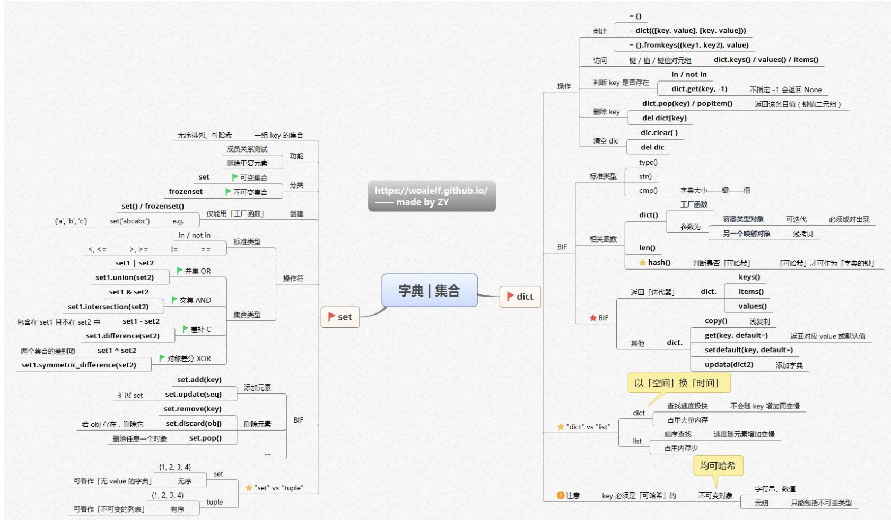

这张思维导图围绕Python中的字典和集合展开，内容如下：

### 集合（set）
- **定义与分类**
    - 集合是无序排列、可哈希的一组key的集合。成员关系测试高效，能删除重复元素。
    - 分类上，分为可变集合（`set` ）和不可变集合（`frozenset` ），不可变集合仅能用工厂函数创建，如 `frozenset()`  。
- **创建方式**：可使用字面量 `{a, b, c}` 或工厂函数 `set([a, b, c])` 、`frozenset([a, b, c])` 等创建 。
- **操作符**
    - **标准类型操作符**：包括成员关系操作符 `in` / `not in` ，以及比较操作符 `<` （小于）、`<=` （小于等于）、`>` （大于）、`>=` （大于等于）、`==` （等于）、`!=` （不等于） 。
    - **集合类型操作符**
        - **并集（OR ）**：`set1 | set2` 或 `set1.union(set2)` 。
        - **交集（AND ）**：`set1 & set2` 或 `set1.intersection(set2)` 。
        - **差集（C ）**：`set1 - set2` 或 `set1.difference(set2)` ，包含在 `set1` 且不在 `set2` 中的元素。
        - **对称差集（XOR ）**：`set1 ^ set2` 或 `set1.symmetric_difference(set2)`  。
- **内建函数（BIF ）**
    - **添加元素**：`set.add(key)` 、`set.update(seq)`  。
    - **删除元素**：`set.remove(obj)` （若 `obj` 不存在会报错 ）、`set.discard(obj)` （若 `obj` 不存在不报错 ）、`set.pop()` （删除并返回任意一个对象 ） 。
- **特性对比**
    - **与列表对比**：集合可看作无 `value` 的字典，无顺序；列表有顺序。
    - **与元组对比**：集合可变，元组不可变；集合可看作不可变的元组的无序集合 。

### 字典（dict）
- **创建方式**
    - `dict([(key1, value1), (key2, value2)])` 。
    - `dict.fromkeys((key1, key2), value)` 。
- **访问方式**：可通过 `dict.keys()` 获取键，`dict.values()` 获取值，`dict.items()` 获取键值对 。
- **操作**
    - **判断key是否存在**：使用 `in` / `not in` ；或通过 `dict.get(key, -1)` ，不指定时若 `key` 不存在返回 `None` 。
    - **删除key**：`dict.pop(key)` （返回该条目的值 ）、`dict.popitem()` （返回键值二元组 ） 。
    - **清空字典**：`dict.clear()` 。
- **标准类型操作**：包括 `type()` 、`str()` 、`cmp()` （Python 2 中有，Python 3 移除 ） 。
- **内建函数（BIF ）**
    - **工厂函数**：`dict()` ，可迭代对象必须成对出现，另一个映射对象浅拷贝。
    - **相关函数**：`len()` 用于获取字典大小 。
    - **hash相关**：判断对象是否可哈希，只有可哈希对象才能作为字典的键 。
    - **返回迭代器**：`dict.items()` 、`dict.keys()` 、`dict.values()`  。
    - **其他**：`copy()` 浅复制；`get(key, default=-)` 获取对应值或默认值；`setdefault(key, default=-)` 设置默认值；`update(dict2)` 添加字典 。
- **特性对比**
    - **与列表对比**：字典以空间换时间，查找速度快，不会随 `key` 增加变慢，但占用大量内存；列表顺序查找，占用内存少，速度随元素增加变慢 。
- **注意事项**：字典的 `key` 必须是可哈希的，如字符串、数值、元组（元组内元素也得是不可变类型 ）等不可变对象 。 