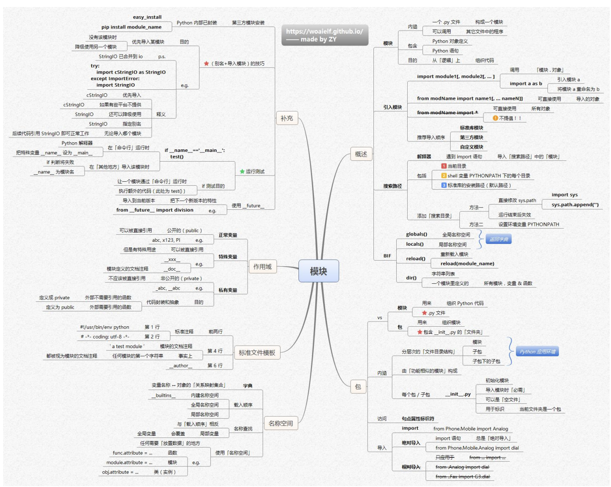

这张思维导图围绕Python模块展开，内容如下：

### 概述
- **模块定义**：一个`.py`文件就是一个模块，可包含Python代码、类、函数等，目的是从逻辑上组织Python代码。
- **包**：包含`__init__.py`文件的文件夹，用于组织模块，可包含子包。包内模块可按功能划分，`__init__.py`用于初始化包，导入模块时可借此设置公用内容。

### 导入模块
- **导入方式**
    - `import module1, module2, ...` ：导入模块，使用时需用`模块名.对象`形式调用。
    - `from module import name1, name2, ... as a, b` ：将模块中对象导入，可重命名。
    - `from module import *` ：导入模块所有对象，不提倡，可能引发命名冲突。
- **推荐导入顺序**：标准库模块、第三方模块、自定义模块。
- **解释器搜索路径**：遇到`import`语句，解释器从`sys.path`（包含`$PATH`、`.PYTHONPATH`、标准库路径等 ）中搜索模块。可通过直接修改`sys.path`（如`sys.path.append()` ）或设置环境变量`.PYTHONPATH`添加搜索目录。

### 标准文件模板
- 通常包含指定解释器（如`#!/usr/bin/env python` ）、编码声明（如`# -*- coding: utf-8 -*-` ）、模块文档注释（`""" test module """` ）等。

### 名称空间
- 变量名称在不同空间有不同作用域，如`__builtin__`（内建名称空间）、全局名称空间、局部名称空间等。名称查找顺序为局部、全局、内建。可通过`globals()`查看全局名称空间，`locals()`查看局部名称空间。

### 作用域
- **变量作用域**：公开变量（如`abc`、`x123`等 ）可被外部直接调用；特殊变量（如`__xxx__` ）有特殊用途；私有变量（如`_abc` ）约定外部不直接调用，`__abc`（类中）为私有成员，外部难以直接访问。
- **函数作用域**：定义为`public`的函数可被外部调用，`private`函数外部不宜调用。

### 补充
- **运行测试**：在模块中使用`if __name__ == '__main__':` 块，可使模块作为脚本运行时执行测试代码，被导入时不执行。
- **别名导入优势**：如`import cStringIO as StringIO` ，可在有多个相似模块时灵活导入，还能简化模块名使用。

### 内建函数（BIF）
- `reload()` ：用于重新加载模块，如`reload(module_name)` 。
- `dir()` ：列出对象（模块、变量等 ）定义的所有属性和函数。 