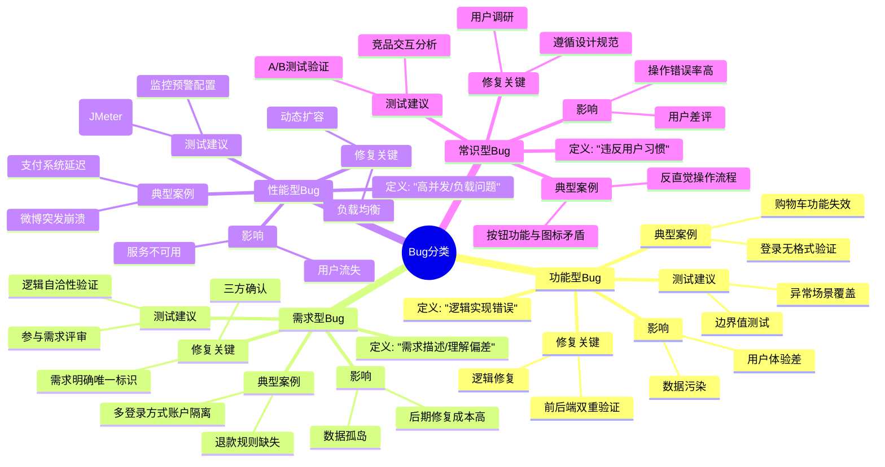
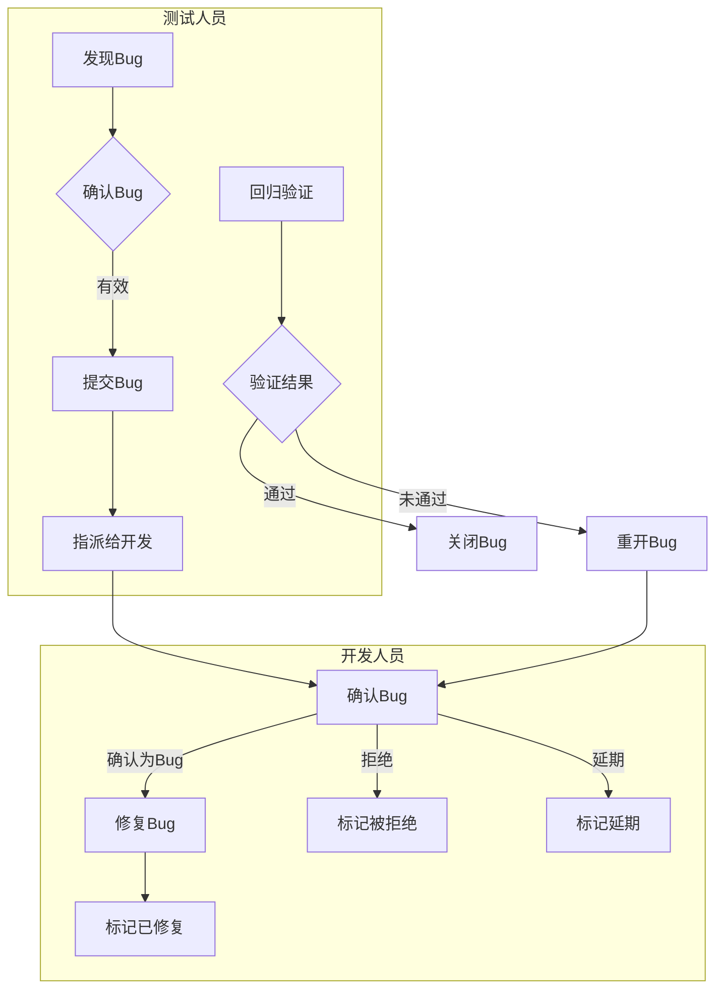
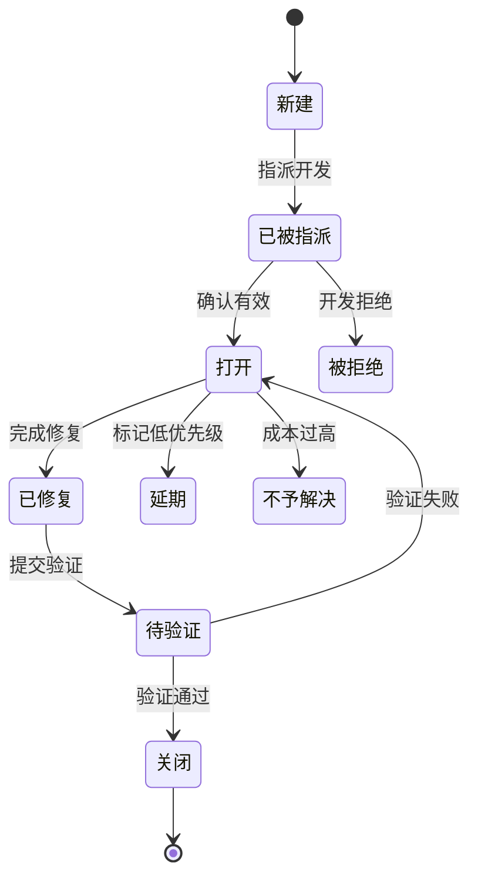
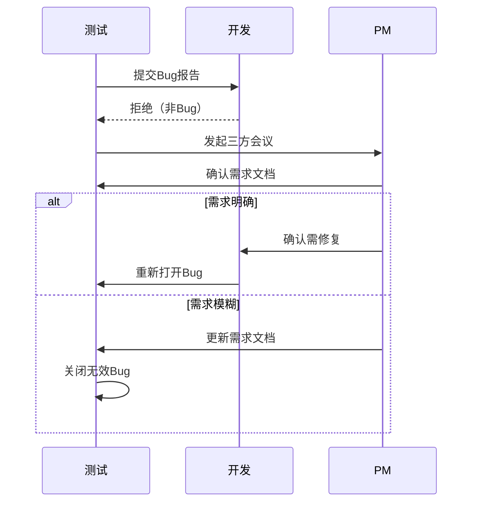
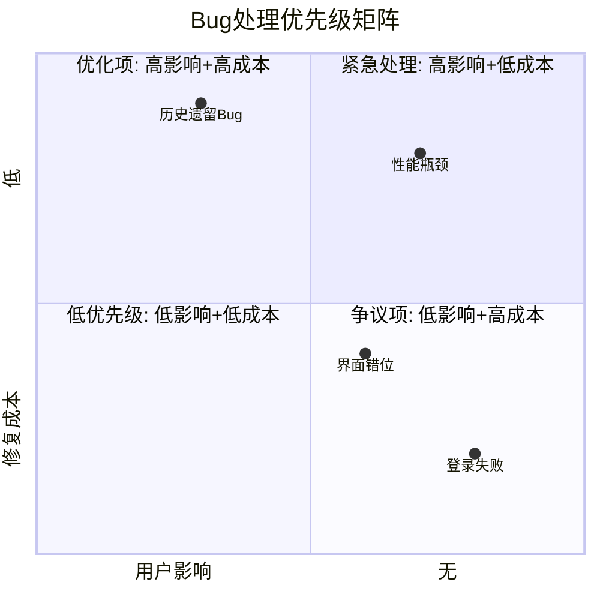
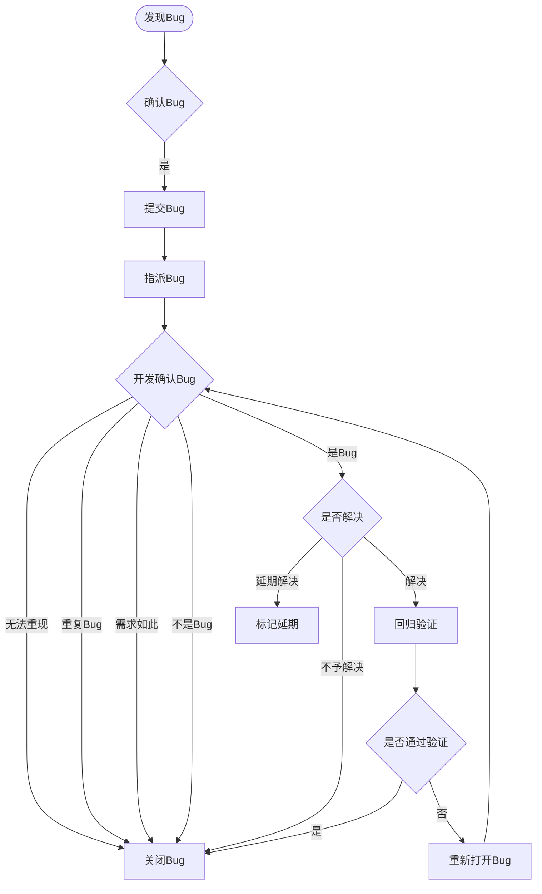

### . Bug的起源与定义**

- **原始含义**：Bug直译为“小虫/昆虫”，源于早期计算机故障（如格雷斯·赫柏发现的飞蛾卡住继电器导致机器故障）。
- **软件行业延伸**：现指**程序漏洞**，即代码或逻辑错误引发的非预期行为。

---

### **2. Bug产生的两大核心原因**

#### **（1）功能逻辑性Bug**

- **定义**：程序实现与需求逻辑不符，或违背现实规律。
- **典型案例**：
  - **Excel日期Bug**：错误将1900年2月（实际28天）计算为29天，导致日期转换数字时出现偏差（如3月1日显示为61而非60）。
  - **千年虫问题**：两位年份存储导致2000年与1999年的差值计算错误（00-99=-99）。
- **根源**：开发时**考虑不周全**，未覆盖所有边界条件或特殊场景。

#### **（2）用户体验性Bug**

- **定义**：软件操作流程或交互设计不符合用户习惯或直觉。
- **案例**：如按钮位置反常规、流程步骤冗余等。
- **根源**：设计时**未充分研究用户行为**，或与产品经理需求沟通不足。

---

### **

### **Bug分类详解**  

根据讲义内容，Bug主要分为以下**4种类型**，每种类型的特点、案例及影响如下：  

---
### . Bug分类思维导图（Mind Map）**



---

#### **1. 功能型Bug**  

- **定义**：功能逻辑实现错误，即功能已开发但存在缺陷。  
- **典型场景**：  
  - **案例1**：登录时未验证邮箱格式（如输入`12345`也能提交）。  
    - **剖析**：  
      - **前端未验证**：导致无效请求频繁发送到后端，增加服务器压力。  
      - **后端未验证**：若前端验证失效，脏数据直接入库（如非邮箱格式存储）。  
  - **案例2**：商品无法添加到购物车。  
    - **剖析**：  
      - **前端未实现**：点击按钮无反应或未发送请求。  
      - **后端未实现**：请求发送但逻辑错误（如数据解析/存储失败）。  
- **影响**：用户体验差、数据污染、服务器资源浪费。  

---

#### **2. 需求型Bug**  

- **定义**：需求阶段埋下的隐患，如需求描述不清、理解偏差或遗漏。  
- **典型场景**：  
  - **案例**：系统支持微信、手机号、邮箱注册，但未明确“同一用户多方式登录”的关联逻辑。  
    - **问题**：用户分别用微信、手机号、邮箱注册后，系统视为三个独立账户。  
    - **解决方案**：需求中需规定**唯一标识（如强制绑定手机号）**，确保多登录方式数据互通。  
- **影响**：数据孤岛、用户操作混乱、后期修复成本高。  

---

#### **3. 性能型Bug**  

- **定义**：高并发或长时间运行下，系统响应慢或崩溃。  
- **典型场景**：  
  - **案例**：明星爆出新闻时微博崩溃（瞬时流量激增）。  
    - **剖析**：  
      - **根本原因**：服务器资源不足，但平时闲置资源多，动态扩容不及时。  
      - **对比秒杀**：秒杀可提前扩容，而突发新闻无法预测。  
- **影响**：服务不可用、用户流失、品牌声誉受损。  

---

#### **4. 常识型Bug**  

- **定义**：违反用户长期形成的交互习惯或行业约定。  
- **典型场景**：  
  - **案例**：  
    - 点击“×”按钮实际触发“提交”操作。  
    - 搜索图标（放大镜）功能是“取消”。  
    - 购物车图标点击后退出页面。  
  - **根源**：开发者忽视用户心智模型（如地域/文化差异）。  
- **影响**：用户体验极差、操作错误率高、差评增多。  

---

### **总结：Bug分类对比**  

| **类型**   | **核心问题**      | **典型案例**               | **修复关键**                 |
| ---------- | ----------------- | -------------------------- | ---------------------------- |
| **功能型** | 逻辑实现错误      | 登录无格式验证、购物车失效 | 前后端双重验证、逻辑修复     |
| **需求型** | 需求描述/理解偏差 | 多登录方式账户不互通       | 需求明确唯一标识（如手机号） |
| **性能型** | 高并发/负载问题   | 微博明星新闻崩溃           | 动态扩容、负载均衡           |
| **常识型** | 违反用户习惯      | 按钮功能与图标不符         | 遵循行业交互规范             |

**
## 项目的角度来看 bug 的生命周期


### **Bug生命周期全流程解析（从项目角度）**

#### **一、Bug生命周期的核心阶段**

Bug从被发现到关闭的完整流程可分为以下关键阶段，涉及**测试人员**与**开发人员**的协作：

| **阶段**       | **负责人** | **关键动作**                   | **Bug状态**       |
| -------------- | ---------- | ------------------------------ | ----------------- |
| 1. 发现Bug     | 测试工程师 | 测试过程中识别异常             | -                 |
| 2. 确认Bug     | 测试工程师 | 验证是否为真实缺陷（避免误报） | -                 |
| 3. 提交Bug     | 测试工程师 | 记录到缺陷管理系统（如Jira）   | **新建**          |
| 4. 指派Bug     | 测试工程师 | 分配给对应开发人员             | **已被指派**      |
| 5. 开发确认Bug | 开发工程师 | 判断是否需修复                 | **打开**/被拒绝   |
| 6. 修复Bug     | 开发工程师 | 修改代码解决问题               | **已修复**        |
| 7. 回归验证    | 测试工程师 | 验证修复是否有效               | **待验证**        |
| 8. 关闭或重开  | 测试工程师 | 通过则关闭，否则重开           | **关闭**/再次打开 |

---

#### **二、开发确认Bug时的分支路径**

开发人员确认Bug时可能出现以下情况，需不同处理：  

| **情况**      | **原因**                   | **处理方式**                   | **Bug状态**  |
| ------------- | -------------------------- | ------------------------------ | ------------ |
| **非Bug**     | 需求如此/无法重现/重复提交 | 标记为无效                     | **被拒绝**   |
| **延期解决**  | 低优先级，不影响核心功能   | 推迟到下一版本修复             | **延期**     |
| **不予解决**  | 修复成本过高或影响极小     | 保留但不修复（如Excel日期Bug） | **不予解决** |
| **确认为Bug** | 需立即修复                 | 进入修复流程                   | **打开**     |

---

#### **三、Bug状态详解（9种核心状态）**

1. **新建（New）**  
   - 测试人员首次提交Bug时的初始状态。  
2. **已被指派（Assigned）**  
   - Bug已分配给指定开发人员。  
3. **打开（Open）**  
   - 开发确认Bug并开始修复。  
4. **已修复（Fixed）**  
   - 开发完成修复，等待测试验证。  
5. **待验证（Pending Review）**  
   - 测试人员需验证修复结果。  
6. **关闭（Closed）**  
   - Bug已验证通过，流程终止。  
7. **再次打开（Reopened）**  
   - 验证未通过，需重新修复。  
8. **被拒绝（Rejected）**  
   - 开发认为非Bug（如需求如此）。  
9. **拒绝中（Rejecting）**  
   - 争议状态（部分系统无此状态）。  

---

#### **四、关键注意事项**

1. **确认Bug的严谨性**  
   - 测试人员需**100%确认**是Bug后再提交，避免误报影响信誉。  
   - 示例：邮箱格式未验证需同时检查前端和后端逻辑。  
2. **争议处理**  
   - 若开发拒绝Bug，测试需联合**产品经理**确认需求。  
3. **状态流转责任**  
   - 开发修复后必须将状态改为**已修复**，测试需及时验证。  

---

#### **五、Bug生命周期示意图**

```
测试人员 → [新建] → [已被指派] → 开发人员 → [打开] → [已修复]  
   ↑                                         ↓  
[再次打开] ← [待验证] ← [关闭] ← 测试人员  
```

**总结**：理解Bug生命周期和状态流转，能帮助测试人员高效协作，减少无效沟通，确保缺陷闭环管理。面试时可结合实例说明（如“我曾因未严格确认Bug导致误报，后续通过复现步骤和日志分析改进”）。


以下是基于Bug生命周期的Mermaid多维度可视化方案：

---

### **1. 核心流程泳道图（Swimlane Diagram）**



---

### **2. 状态转换图（State Diagram）**



---

### **3. 争议处理时序图（Sequence Diagram）**



---

### **

### **4. 优先级矩阵图（Quadrant Chart）**



---


以下是基于您描述的图片内容，使用Mermaid绘制的Bug生命周期流程图：



---
