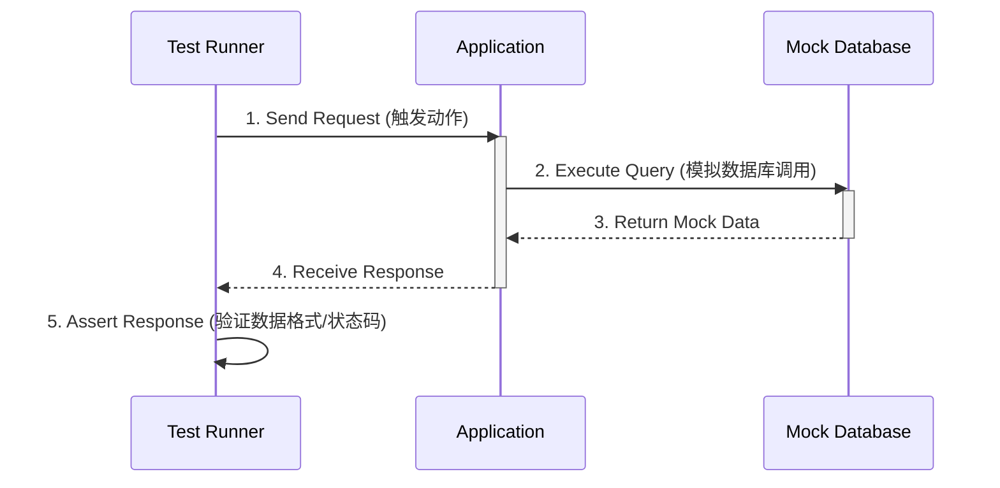

# 概念详解

## API是什么？
API（Application Programming Interface）是一组定义了软件组件之间如何交互的规则和协议。它允许不同的软件系统通过网络进行通信，实现数据的共享和交互。
## API测试是什么？
API测试是一种软件测试方法，用于验证API的正确性和稳定性。它通过发送请求到API端点，并验证响应是否符合预期来评估API的功能和性能。
1.使用工具对接口进行调用
2.对接口的返回结果进行断言（判断）

## 测试工具有哪些？
Postman是一款功能强大的API测试工具，
Jmeter是一款功能强大的性能测试工具。

## 接口测试的工作原理(步骤)？
以下是一个基于 Mermaid 的时序图，说明接口测试的工作原理及步骤：



### 具体步骤解释：

1. **发送请求**：测试套件触发应用功能（如用户点击按钮调用 API）
2. **处理请求**：应用执行逻辑并调用数据库/外部服务
3. **模拟响应**：使用 `vi.mock` 替代真实数据库返回预定义数据
4. **接收响应**：应用处理模拟数据并返回结果
5. **断言验证**：使用 `expect().toMatchObject()` 验证响应结构和业务规则

## Postman 接口测试实战

根据 <mcreference link="https://blog.csdn.net/zbj18314469395/article/details/106693615" index="0">这篇博文</mcreference>，以下是使用 Postman 进行接口测试的主要方法和步骤：

### 1. Postman 简介与安装
*   **简介**：Postman 是一个可扩展的 API 开发和测试协同平台，旨在简化 API 的测试和开发工作流程 <mcreference link="https://blog.csdn.net/zbj18314469395/article/details/106693615" index="0">0</mcreference>。它有 Chrome 扩展和独立客户端，推荐使用独立客户端 <mcreference link="https://blog.csdn.net/zbj18314469395/article/details/106693615" index="0">0</mcreference>。
*   **工作区 (Workspace)**：Postman 有个人工作区 (Personal Workspace) 和团队工作区 (Team Workspace) <mcreference link="https://blog.csdn.net/zbj18314469395/article/details/106693615" index="0">0</mcreference>。
*   **登录与数据安全**：登录后会自动将测试历史数据保存到账户。考虑到 API 数据的敏感性（如 Token），如果不希望数据上传到云端，可以选择不登录（轻量级 API 客户端模式）或使用较早版本（如 9.x 版本，可能不需要强制登录即可使用集合等功能）并在本地保存和导入数据 <mcreference link="https://blog.csdn.net/zbj18314469395/article/details/106693615" index="0">0</mcreference>。
*   **下载安装**：从 Postman 官网 (https://www.postman.com/downloads/) 下载对应版本安装即可 <mcreference link="https://blog.csdn.net/zbj18314469395/article/details/106693615" index="0">0</mcreference>。

### 2. Postman 工作区概览
Postman 的主要工作区组件包括 <mcreference link="https://blog.csdn.net/zbj18314469395/article/details/106693615" index="0">0</mcreference>：
*   **New (新建)**：创建新的请求、集合、环境、文档、Mock Server、Monitor 等。
*   **Import (导入)**：导入集合或环境，支持从文件、文件夹、链接或粘贴原始文本导入。
*   **Runner (运行器)**：通过 Collection Runner 执行自动化测试。
*   **Open New (打开)**：打开新的标签页、Postman 窗口或 Runner 窗口。
*   **My Workspace (我的工作区)**：创建和管理个人或团队工作区。
*   **Invite (邀请)**：邀请团队成员协作。
*   **History (历史记录)**：查看所有已发送请求的历史记录。
*   **Collections (集合)**：组织测试套件。每个集合可以包含子文件夹和多个请求。
*   **Request tab (请求标签页)**：显示当前正在处理的请求的标题。
*   **HTTP Request (HTTP 请求方法)**：选择请求方法，如 GET, POST, PUT, DELETE 等。最常用的是 GET 和 POST。
*   **Request URL (请求地址)**：输入 API 的端点 URL。

### 3. 发送基本请求 (GET/POST)

#### a. 发送 GET 请求
1.  点击 "New" 或 "+" 新建一个请求标签页。
2.  在 HTTP Request 下拉菜单中选择 `GET` 方法。
3.  在 "Request URL" 输入框中输入目标 API 的 URL。
4.  如果需要传递查询参数 (Query Params)，可以在 "Params" 标签页中添加键值对，它们会自动附加到 URL 后面。
5.  点击 "Send" 按钮发送请求。
6.  在下方的 "Response"区域查看响应结果，包括 Body (响应体)、Cookies、Headers 和 Test Results。

#### b. 发送 POST 请求
1.  新建请求标签页，选择 `POST` 方法。
2.  输入目标 API 的 URL。
3.  切换到 "Body" 标签页，根据 API 的要求选择合适的请求体格式（如 `form-data`, `x-www-form-urlencoded`, `raw` (常用于 JSON, XML, Text), `binary`）。
    *   **form-data**: 用于发送表单数据，可以包含文件。
    *   **x-www-form-urlencoded**: 用于发送表单数据，键值对会被编码。
    *   **raw (JSON)**: 选择 `raw` 并从旁边的下拉菜单中选择 `JSON`，然后在文本框中输入 JSON 格式的请求体。
4.  如果需要设置请求头 (Headers)，例如 `Content-Type` (对于 JSON 通常是 `application/json`) 或 `Authorization` (用于身份验证的 Token)，可以在 "Headers" 标签页中添加。
5.  点击 "Send" 按钮。
6.  查看响应结果。

### 4. 使用集合 (Collections)
集合用于组织和管理相关的 API 请求 <mcreference link="https://blog.csdn.net/zbj18314469395/article/details/106693615" index="0">0</mcreference>。
1.  在左侧边栏点击 "Collections"，然后点击 "+" 或 "Create Collection"。
2.  为集合命名，可以添加描述。
3.  可以将已创建的请求拖拽到集合中，或者在集合内直接创建新请求。
4.  集合可以包含子文件夹，进一步组织请求。
5.  共享：可以导出集合（JSON 文件）或通过链接共享（如果使用团队工作区）。

### 5. 创建环境与参数化 (Environments & Parameterization)
环境允许你为不同的部署阶段（如开发、测试、生产）定义不同的变量集，从而实现请求的参数化 <mcreference link="https://blog.csdn.net/zbj18314469395/article/details/106693615" index="0">0</mcreference>。
1.  点击右上角的眼睛图标（环境快速查看）或齿轮图标（管理环境）。
2.  点击 "Add" 创建新环境，为其命名（如 "Development", "Production"）。
3.  在环境中添加变量，例如 `baseURL`, `authToken`。
4.  在请求的 URL、Headers、Body 中使用 `{{variable_name}}` 的形式引用环境变量。
5.  在发送请求前，从右上角的下拉菜单中选择要激活的环境。

### 6. 编写测试脚本 (Tests)
Postman 允许在请求的 "Tests" 标签页中使用 JavaScript 编写测试脚本，以验证响应状态码、响应体内容、响应头等 <mcreference link="https://blog.csdn.net/zbj18314469395/article/details/106693615" index="0">0</mcreference>。
*   **示例：验证状态码**
    ```javascript
    pm.test("Status code is 200", function () {
        pm.response.to.have.status(200);
    });
    ```
*   **示例：验证响应体 JSON 数据**
    ```javascript
    pm.test("Response body contains user ID", function () {
        const jsonData = pm.response.json();
        pm.expect(jsonData).to.have.property('userId');
        pm.expect(jsonData.userId).to.eql(123); // 假设期望的 userId 是 123
    });
    ```
*   测试结果会在响应区域的 "Test Results" 标签页中显示。

### 7. 使用 Collection Runner 运行测试集合
Collection Runner 用于批量运行一个集合中的所有请求，并执行它们的测试脚本，实现自动化测试 <mcreference link="https://blog.csdn.net/zbj18314469395/article/details/106693615" index="0">0</mcreference>。
1.  在左侧边栏，将鼠标悬停在要运行的集合上，点击出现的 "..." 菜单，选择 "Run collection"。或者点击主界面左上角的 "Runner" 按钮，然后选择集合。
2.  在 Collection Runner 窗口中：
    *   选择要运行的集合。
    *   选择环境（如果需要）。
    *   设置迭代次数 (Iterations)。
    *   设置延迟 (Delay) 时间（如果需要在请求之间添加等待）。
    *   选择数据文件 (Data File)，用于数据驱动测试（如 CSV, JSON 文件）。
3.  点击 "Run [Collection Name]" 按钮。
4.  运行完成后，Runner 会显示每个请求的通过/失败状态以及测试结果摘要。

### 8. 使用 Newman 运行集合 (CI/CD)
Newman 是 Postman 的命令行 Collection Runner。它允许你在命令行中运行 Postman 集合，非常适合集成到持续集成/持续部署 (CI/CD) 流程中 <mcreference link="https://blog.csdn.net/zbj18314469395/article/details/106693615" index="0">0</mcreference>。
1.  **安装 Newman**:
    ```bash
    npm install -g newman
    ```
2.  **导出集合和环境**:
    *   在 Postman 中，导出你的集合为 JSON 文件 (e.g., `my_collection.postman_collection.json`)。
    *   如果使用了环境，也导出环境为 JSON 文件 (e.g., `my_environment.postman_environment.json`)。
3.  **运行 Newman**:
    ```bash
    newman run my_collection.postman_collection.json -e my_environment.postman_environment.json
    ```
    *   可以添加各种报告器，如 `-r cli,html,json` 来生成不同格式的测试报告。

