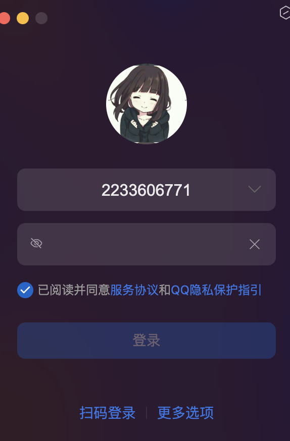

### 什么是软件？

软件是 **控制计算机硬件工作的工具**，由程序、数据和文档组成，用于实现特定功能或解决实际问题。它是用户与硬件之间的桥梁，通过指令集驱动硬件运行，将抽象需求转化为具体的数字化服务。

---

#### **软件的核心特点**
1. **无形性**  
   - 软件没有物理形态，本质是一系列代码和数据的集合（如微信的代码文件）。  
   - 示例：手机中的“微信App”本质是存储在存储芯片中的二进制代码。

2. **功能性**  
   - 通过逻辑控制硬件完成特定任务（如浏览器控制网卡访问网页）。  
   - 示例：视频播放软件（如腾讯视频）调用显卡解码视频并输出到屏幕。

3. **可迭代性**  
   - 可通过更新升级功能（如手机系统从iOS 15升级到iOS 16）。  
   - 示例：微信从仅支持文字聊天，迭代到支持视频通话、小程序等。

---

#### **软件的基本组成**
1. **客户端（前端）**  
   - **作用**：用户直接交互的界面（如手机App、网页）。  
   - **技术实现**：HTML/CSS/JavaScript（网页）、Swift/Kotlin（移动端）。  
   - 示例：淘宝App的购物车页面、浏览器中的百度搜索界面。

2. **服务器（后端）**  
   - **作用**：处理业务逻辑和数据（如用户登录验证、订单计算）。  
   - **技术实现**：Java/Python（Spring Boot/Django框架）。  
   - 示例：支付宝的支付接口、12306的余票查询服务。

3. **数据库**  
   - **作用**：存储和管理数据（如用户信息、交易记录）。  
   - **技术实现**：MySQL（关系型数据库）、MongoDB（非关系型数据库）。  
   - 示例：银行系统中存储用户账户余额的数据库表。

---

#### **软件的分类（根据用途）**
| **类型**       | **定义**                         | **典型示例**                  |
| -------------- | -------------------------------- | ----------------------------- |
| **系统软件**   | 管理硬件和基础服务的软件         | Windows操作系统、Android系统  |
| **应用软件**   | 解决用户具体需求的工具           | 微信、Photoshop、WPS          |
| **嵌入式软件** | 嵌入硬件设备中控制特定功能的软件 | 汽车ECU控制程序、智能手表固件 |

---

#### **为什么需要软件？**
1. **硬件无法独立工作**  
   - 计算机硬件（CPU、内存）需通过软件指令执行操作。  
   - 示例：没有操作系统的电脑只是一堆无法启动的电子元件。

2. **实现复杂逻辑**  
   - 软件通过代码将需求转化为可执行的流程（如电商购物流程）。  
   - 示例：淘宝的“下单-支付-物流跟踪”全流程依赖软件逻辑。

3. **提升效率与体验**  
   - 自动化处理重复任务（如Excel公式计算、自动化测试脚本）。  
   - 示例：财务软件自动生成报表，比人工计算快100倍。

---

#### **软件与硬件的关系**
- **依存关系**：  
  - 软件依赖硬件运行（如App需要手机CPU处理数据）。  
  - 硬件依赖软件发挥价值（如高端显卡需游戏软件才能体现性能）。  
- **协作流程**：  
  用户点击按钮 → 软件接收指令 → 调用硬件资源（如网卡发送请求） → 返回结果到界面。

---

#### **总结**
软件是数字世界的“灵魂”，它将冰冷的硬件转化为智能化的服务。从手机App到航天控制系统，软件已渗透到现代社会的每个角落。理解软件的定义与组成，是进入IT领域（如开发、测试、运维）的基础。正如视频所述：“没有软件，计算机只是一台昂贵的打字机；有了软件，它才能成为改变世界的工具。”


### 软件的产生过程详解

---

#### **1. 需求分析与评审**  
**目标**：明确软件功能与规则，确保团队理解一致。  
**关键活动**：  
- **需求收集**：  
  - **来源**：客户需求（如甲方定制）、市场调研（如微信支付创新功能）。  
  - **输出**：需求文档（功能描述、业务规则）。  
- **需求评审**：  
  - **参与者**：产品经理、开发、测试、UI设计。  
  - **重点**：确认需求可行性，提出疑问（如“登录是否支持第三方授权？”）。  

**示例**：  
客户要求开发一个电商平台，需求文档需明确“用户注册必须绑定手机号”。

---

#### **2. 原型设计与UI设计**  
**目标**：将需求转化为可视化设计，指导开发与测试。  
**关键活动**：  
- **产品原型**：  
  - **工具**：Axure、墨刀。  
  - **内容**：页面布局、交互流程（如“点击登录按钮跳转到首页”）。  
- **UI设计**：  
  - **输出**：高保真设计稿（颜色、图标、字体）。  
  - **验证**：确保设计与需求一致（如“购物车图标必须为红色”）。  

**示例**：  
UI设计师根据需求文档，绘制商品详情页的视觉效果图，标注按钮样式和动效。

---

#### **3. 开发实现**  
**目标**：将需求转化为可运行的代码。  
**关键活动**：  
- **前端开发**：  
  - **技术栈**：HTML/CSS/JavaScript（如Vue.js、React）。  
  - **任务**：实现用户界面（如“商品列表页的动态加载”）。  
- **后端开发**：  
  - **技术栈**：Java/Python（如Spring Boot、Django）。  
  - **任务**：编写业务逻辑和接口（如“用户下单扣减库存”）。  
- **数据库设计**：  
  - **工具**：MySQL、MongoDB。  
  - **任务**：设计表结构（如“订单表包含用户ID、商品ID、金额”）。  

**示例**：  
开发团队根据需求文档和设计稿，编写代码实现“用户注册时发送短信验证码”功能。

---

#### **4. 软件测试**  
**目标**：验证软件是否符合需求，发现并修复缺陷。  
**关键活动**：  
- **测试用例设计**：  
  - **方法**：等价类划分、边界值分析（如“密码长度6-20字符”）。  
  - **工具**：Excel、TestLink。  
- **测试执行**：  
  - **重点**：按优先级执行用例（P0核心功能优先）。  
  - **缺陷提交**：通过禅道/Jira记录Bug（含步骤、截图）。  
- **回归测试**：  
  - **目的**：验证开发修复后的代码（如“确认登录失败的提示已修正”）。  

**示例**：  
测试人员发现“支付成功后订单状态未更新”，提交Bug并跟踪至修复完成。

---

#### **5. 部署上线**  
**目标**：将测试通过的软件发布给用户使用。  
**关键活动**：  
- **环境准备**：  
  - **服务器配置**：部署代码、数据库、中间件（如Nginx）。  
- **灰度发布**：  
  - **策略**：先小范围试运行（如10%用户），监控稳定性。  
- **正式发布**：  
  - **验证**：检查核心功能（如“注册、登录、支付”）。  

**示例**：  
运维团队将电商平台部署至云服务器，通过CDN加速静态资源加载。

---

#### **6. 运维与迭代**  
**目标**：持续优化软件，响应用户反馈。  
**关键活动**：  
- **监控与告警**：  
  - **工具**：Prometheus、Zabbix（监控服务器性能）。  
- **用户反馈处理**：  
  - **渠道**：客服系统、应用商店评价（如“用户投诉商品搜索慢”）。  
- **版本迭代**：  
  - **周期**：按月/季度发布新功能（如“新增直播购物功能”）。  

**示例**：  
根据用户反馈，产品经理规划“购物车批量删除”功能，进入下一轮需求评审。

---

#### **总结**  
软件的产生是一个 **从需求到上线** 的闭环过程，涉及 **需求分析、设计、开发、测试、部署、运维** 六大阶段。每个阶段依赖团队协作：  
- **产品经理** 定义需求，**设计师** 提供视觉方案，**开发** 实现功能，**测试** 保障质量，**运维** 确保稳定运行。  
- **核心价值**：通过系统化流程，将抽象需求转化为用户可用的可靠软件。  

**最终目标**：在有限资源下，交付符合用户期望的高质量产品。


### 什么是软件测试？——概念、过程与目的详解

---

#### **一、软件测试的核心概念**
**软件测试**是通过 **技术手段验证软件是否满足用户需求** 的系统化过程。其本质是 **找茬**（发现缺陷），但目的不是否定开发成果，而是确保软件质量符合预期。  

- **关键理解**：  
  - **验证需求**：测试的核心是检查软件是否与需求文档一致（如登录功能是否支持手机号验证）。  
  - **技术手段**：包括功能测试、自动化测试、性能测试、安全测试等（如使用抓包工具验证密码加密传输）。  
  - **系统化过程**：需设计用例、执行测试、跟踪缺陷，而非随机操作。

---

#### **二、软件测试的完整过程**
软件测试贯穿 **软件开发生命周期**，以下是典型流程：

1. **需求分析与评审**  
   - **目标**：明确需求细节（如“用户登录支持手机号和密码”）。  
   - **参与者**：产品经理、开发、测试。  
   - **测试介入**：提出需求漏洞（如“未说明密码错误次数限制”）。

2. **测试计划与用例设计**  
   - **计划**：确定测试范围（如“仅测登录模块”）、资源分配（人员、工具）。  
   - **用例设计**：基于等价类、边界值等方法编写用例（如“密码为空时提示错误”）。

3. **测试执行与缺陷管理**  
   - **执行**：按优先级执行用例，记录结果（如“登录失败-密码错误提示未显示”）。  
   - **缺陷提交**：通过工具（如Jira）提交Bug，包含重现步骤、截图、日志。  
   - **回归测试**：验证开发修复后的代码，确保问题不再出现。

4. **测试报告与上线决策**  
   - **报告内容**：测试覆盖率、缺陷统计（如“发现10个Bug，修复率90%”）、风险提示。  
   - **结论**：给出是否上线的建议（如“遗留1个低优先级Bug，允许上线”）。

---

#### **三、软件测试的核心目的**
1. **减少缺陷（Bug）**  
   - **缺陷来源**：需求错误（如需求文档矛盾）、设计缺陷（如界面交互不合理）、编码错误（如代码逻辑错误）。  
   - **示例**：需求未说明“密码需包含特殊字符”，测试发现后补充验证规则。

2. **保障软件质量**  
   - **质量维度**：功能性、性能、安全性、兼容性、易用性（如“高并发下登录响应时间≤2秒”）。  
   - **用户视角**：避免因缺陷导致经济损失或体验问题（如“支付失败导致用户订单丢失”）。

3. **降低风险**  
   - **提前暴露问题**：通过测试环境模拟真实场景（如“模拟万人同时抢购”）。  
   - **规避上线风险**：识别并修复关键缺陷（如“内存泄漏导致系统崩溃”）。

---

#### **四、测试的局限性**
- **无法消灭所有缺陷**：测试只能降低风险，无法保证100%无缺陷（如“边界条件未覆盖”）。  
- **成本平衡**：过度测试增加成本，需在质量与效率间权衡（如“P0用例全覆盖，P3用例抽样测试”）。

---

#### **总结**  
软件测试是软件质量的“守门员”，通过 **系统化验证需求**、**精准定位缺陷**，确保软件交付时满足用户期望。其价值不仅在于发现问题，更在于推动团队形成质量意识，从需求到上线的全流程中规避风险。正如视频所述：“测试不是找茬，而是为了不信任中的信任——让用户用得放心。”


### 测试的主流技能详解

---

#### **1. 功能测试**  
**定义**：验证软件功能是否符合需求文档的测试方法，覆盖核心业务流程及异常场景。  
**核心作用**：  

- 确保基础功能可用（如登录、支付、搜索）。  

- 发现需求文档与实现不一致的问题（如界面文案错误）。  
  **关键工具与技术**：  

- **用例设计工具**：Excel（编写用例）、XMind（梳理测试点）。  

- **缺陷管理工具**：Jira、禅道（跟踪Bug）。  

- **测试方法**：等价类划分、边界值分析、场景法。  
  **实际应用场景**：  

- 电商平台测试：验证用户从搜索商品→加入购物车→支付→订单生成的完整流程。  

- 缺陷示例：用户支付成功后订单状态未更新（S1级缺陷）。  

  ！[功能测试] （）

---

#### **2. 自动化测试**  
**定义**：通过代码或工具代替手工执行测试用例，提升效率和覆盖率。  
**核心作用**：  
- 快速验证高频场景（如每日构建版本的核心功能回归）。  
- 降低人工成本，支持持续集成（CI/CD）。  
**分类与工具**：  
- **UI自动化**：  
  - **工具**：Selenium（Web）、Appium（移动端）。  
  - **适用场景**：跨浏览器兼容性测试（如Chrome、Safari）。  
- **接口自动化**：  
  - **工具**：Postman（手动调试）、Requests库（Python代码）。  
  - **适用场景**：批量验证API（如用户注册接口的10种参数组合）。  
  **实际应用案例**：  
- **电商秒杀场景**：模拟1000用户同时抢购，验证系统是否崩溃。  
- **自动化脚本示例**：  
  ```python
  # 使用Selenium自动化登录
  from selenium import webdriver
  driver = webdriver.Chrome()
  driver.get("https://example.com/login")
  driver.find_element("id", "username").send_keys("test_user")
  driver.find_element("id", "password").send_keys("Test@123")
  driver.find_element("id", "submit").click()
  assert "Welcome" in driver.page_source
  driver.quit()
  ```

---

#### **3. 接口测试**  
**定义**：验证服务端接口的正确性、性能及安全性。  
**核心作用**：  
- 确保前后端数据交互可靠（如支付接口返回正确订单状态）。  
- 发现接口逻辑漏洞（如未授权访问敏感数据）。  
**工具与技术**：  
- **工具**：Postman（单接口调试）、JMeter（性能+功能）。  
- **技术栈**：Python（Pytest+Requests）、Java（RestAssured）。  
**测试重点**：  
- **参数校验**：必填项、数据类型、边界值（如手机号11位）。  
- **安全验证**：Token鉴权、SQL注入防护。  
**实际应用场景**：  
- **支付接口测试**：  
  - 验证微信支付接口在金额为0.01元时的成功响应。  
  - 模拟重复支付请求，检查订单是否重复扣款。  
- **缺陷示例**：未加密传输用户密码（S0级漏洞）。  

---

#### **4. 性能测试**  
**定义**：模拟高并发、大数据量场景，评估系统稳定性与资源消耗。  
**核心作用**：  
- 发现性能瓶颈（如数据库连接池溢出）。  
- 验证系统容量（如支持10万用户同时在线）。  
**工具与指标**：  
- **工具**：JMeter（开源）、LoadRunner（企业级）。  
- **关键指标**：响应时间（≤2秒）、吞吐量（TPS）、错误率（＜0.1%）。  
**测试类型**：  
- **负载测试**：逐步增加用户数，找到性能拐点。  
- **压力测试**：极限负载下观察系统崩溃点（如内存泄漏）。  
**实际应用案例**：  
- **双十一大促**：模拟100万用户同时下单，验证服务器CPU使用率（≤80%）。  
- **性能优化对比**：优化前后接口响应时间从500ms降至50ms。  

---

### **技能选择建议**  
| **职业方向**         | **推荐技能组合**             | **薪资范围（一线城市）** |
| -------------------- | ---------------------------- | ------------------------ |
| **功能测试工程师**   | 功能测试 + 基础SQL + Linux   | 8K-15K                   |
| **自动化测试工程师** | 功能测试 + Python/Selenium   | 15K-25K                  |
| **接口测试工程师**   | 功能测试 + Postman + Python  | 18K-30K                  |
| **性能测试专家**     | JMeter + 系统调优 + 监控工具 | 25K-40K+                 |

---

### **总结**  
测试技能体系以 **功能测试** 为根基，**自动化测试** 提效，**接口测试** 保障数据交互，**性能测试** 确保系统稳定。掌握核心技能组合（如 **功能+接口自动化**），可快速适应企业级测试需求，成为团队中的质量保障关键角色。


### 软件测试分类详解

---

#### **一、按测试阶段划分**
1. **单元测试（Unit Testing）**  
   - **定义**：针对程序的最小可测试单元（如函数、类）进行验证。  
   - **目标**：确保代码逻辑正确（如边界条件、异常处理）。  
   - **示例**：  
     ```python
     # 测试加法函数
     def add(a, b):
         return a + b
     
     # 单元测试用例
     assert add(2, 3) == 5, "加法功能异常"
     assert add(-1, 1) == 0, "负数处理异常"
     ```
   - **工具**：Pytest（Python）、JUnit（Java）。

2. **集成测试（Integration Testing）**  
   - **定义**：验证模块或服务之间的接口交互是否正确。  
   - **目标**：发现接口协议错误、数据传递问题。  
   - **示例**：  
     - 用户注册后自动发送短信验证码，验证注册模块与短信服务的接口是否正常。  
   - **工具**：Postman（手动测试）、RestAssured（自动化）。

3. **系统测试（System Testing）**  
   - **定义**：对整个系统进行端到端测试，覆盖功能和非功能需求。  
   - **目标**：确保软件在真实环境中符合用户需求。  
   - **测试类型**：  
     - **功能测试**：验证核心业务流程（如电商下单流程）。  
     - **兼容性测试**：检查不同浏览器（Chrome、Safari）或设备（iOS、Android）的适配性。  
     - **性能测试**：评估高并发场景下的系统表现（如双十一抢购）。  
   - **示例**：支付宝App在华为Mate 50和iPhone 14上均能正常支付。

4. **验收测试（Acceptance Testing）**  
   - **定义**：由客户或最终用户验证系统是否满足业务需求。  
   - **形式**：  
     - **Alpha测试**：内部员工模拟用户场景测试。  
     - **Beta测试**：公测阶段邀请真实用户参与（如游戏公测）。  
   - **示例**：某银行新系统上线前，由分行柜员模拟用户操作验证业务流程。

---

#### **二、按代码可见度划分**
1. **黑盒测试（Black-Box Testing）**  
   - **定义**：不关注内部代码，仅通过输入输出验证功能是否符合需求。  
   - **适用场景**：功能测试、用户体验测试。  
   - **示例**：  
     - 验证用户登录功能：输入正确账号密码应跳转主页，错误密码应提示错误。  
   - **工具**：Selenium（Web UI自动化）、Appium（移动端）。

2. **灰盒测试（Gray-Box Testing）**  
   - **定义**：部分了解代码结构，重点测试接口和集成逻辑。  
   - **适用场景**：接口测试、性能测试。  
   - **示例**：  
     - 使用Postman调用订单接口，验证返回的JSON数据结构是否符合预期。  
   - **工具**：JMeter（接口性能）、Charles（抓包分析）。

3. **白盒测试（White-Box Testing）**  
   - **定义**：基于代码内部逻辑设计测试用例，覆盖路径和分支。  
   - **适用场景**：单元测试、代码审查。  
   - **示例**：  
     - 测试条件分支：验证用户年龄≥18岁时显示成人内容，否则屏蔽。  
   - **工具**：Pytest（覆盖率分析）、SonarQube（代码质量扫描）。

---

#### **三、按测试目标划分**
1. **功能测试（Functional Testing）**  
   - **目标**：验证软件功能是否符合需求文档。  
   - **示例**：微信消息发送、朋友圈发布、红包功能。  

2. **非功能测试（Non-Functional Testing）**  
   - **目标**：验证性能、安全、易用性等非业务需求。  
   - **子类型**：  
     - **性能测试**：模拟万人同时抢票，验证系统吞吐量（TPS）和响应时间。  
     - **安全测试**：检测SQL注入、XSS漏洞（如输入`<script>alert(1)</script>`验证过滤机制）。  
     - **兼容性测试**：确保App在Android 12和iOS 16上均正常运行。  

3. **回归测试（Regression Testing）**  
   - **目标**：验证代码修改后原有功能未受影响。  
   - **示例**：修复“支付失败”Bug后，重新测试所有支付相关功能。  
   - **工具**：Jenkins（自动化回归流水线）。

---

#### **四、按执行方式划分**
1. **手动测试（Manual Testing）**  
   - **适用场景**：探索性测试、用户体验测试（如App新手引导流程）。  
   - **缺点**：效率低，难以覆盖复杂场景（如万级数据验证）。  

2. **自动化测试（Automation Testing）**  
   - **适用场景**：回归测试、大数据量测试（如批量导入1万条订单）。  
   - **工具链**：  
     - **Web自动化**：Selenium + Python  
     - **接口自动化**：Postman + Newman  
     - **移动端自动化**：Appium + Java  

---

#### **五、特殊测试类型**
1. **冒烟测试（Smoke Testing）**  
   - **目标**：快速验证核心功能是否可用（如版本发布前检查登录、支付）。  
   - **示例**：每日构建版本后，10分钟内完成主流程验证。  

2. **探索性测试（Exploratory Testing）**  
   - **目标**：通过非脚本化测试发现潜在问题（如随机点击按钮寻找崩溃点）。  
   - **适用场景**：敏捷开发中的快速反馈。  

3. **猴子测试（Monkey Testing）**  
   - **目标**：模拟用户随机操作，测试系统健壮性（如疯狂点击屏幕）。  
   - **工具**：Android ADB Monkey命令。

---

### **总结**  
软件测试分类的核心逻辑是 **多维度覆盖质量要求**：  
- **阶段维度**（单元→验收）确保开发过程质量递进；  
- **可见度维度**（黑盒→白盒）平衡测试深度与效率；  
- **目标维度**（功能→非功能）保障用户体验与系统可靠性。  

掌握分类有助于精准设计测试策略，例如：  
- **电商项目**：功能测试（下单流程） + 性能测试（秒杀场景） + 安全测试（支付漏洞扫描）。  
- **医疗系统**：白盒测试（核心算法） + 兼容性测试（跨医院设备） + 回归测试（版本升级）。  

理解分类后，可快速定位测试重点，成为团队中的“质量守门员”。


### 软件测试质量模型详解

---

#### **一、质量模型的核心作用**  
质量模型是衡量软件质量的 **系统性框架**，用于指导测试人员全面覆盖软件的关键质量属性。通过模型，可确保测试不仅关注功能实现，还涵盖性能、安全、用户体验等维度，避免测试遗漏。

---

#### **二、质量模型的八大维度**  
以下是ISO/IEC 25010标准定义的软件质量模型核心维度及其应用场景：

| **维度**     | **定义与测试重点**                                           | **实际测试场景示例**                                         |
| ------------ | ------------------------------------------------------------ | ------------------------------------------------------------ |
| **功能性**   | 验证软件是否准确实现需求文档描述的功能，包括功能正确性、完整性及错误处理能力。 | - 登录功能：输入正确账号密码应跳转主页，错误密码提示明确信息。<br>- 电商支付：订单金额计算准确，库存实时扣减。 |
| **性能**     | 评估软件在高负载、高并发场景下的响应速度、吞吐量及资源消耗。 | - 模拟1万用户同时抢购，验证服务器响应时间（≤2秒）。<br>- 测试接口每秒处理请求数（TPS≥500）。 |
| **兼容性**   | 验证软件在不同硬件、操作系统、浏览器、网络环境下的适配性。   | - 游戏在Windows 11和macOS Ventura上的运行稳定性。<br>- 网页在Chrome 120和Safari 16的渲染一致性。 |
| **易用性**   | 评估用户界面友好性、操作流畅度及学习成本。                   | - 注册流程分步骤引导（如手机号→验证码→密码），减少用户输入压力。<br>- 按钮位置符合用户习惯（如确认按钮在右侧）。 |
| **可靠性**   | 验证系统在异常情况下的稳定性（如断网、断电、高负载）。       | - 支付过程中断网后恢复，订单状态自动同步。<br>- 服务器内存溢出时，系统优雅降级而非崩溃。 |
| **安全性**   | 保护数据免受未授权访问、篡改或泄露，验证身份认证、加密传输等机制。 | - 密码传输使用HTTPS加密。<br>- SQL注入攻击测试：输入`' OR 1=1 --`验证防护机制。 |
| **可维护性** | 评估系统维护、升级、数据迁移的便捷性。                       | - 数据库迁移工具是否支持一键导出/导入。<br>- 日志系统是否清晰记录错误上下文（如时间戳、用户ID、堆栈跟踪）。 |
| **一致性**   | 确保界面设计、交互逻辑、术语使用统一。                       | - 所有删除操作提示框文案统一为“确认删除？”<br>- 全平台（Web/App）按钮颜色使用#1890FF色值。 |

---

#### **三、质量模型在测试中的落地策略**  
1. **优先级划分**  
   - **核心维度**（必测）：功能性、性能、兼容性、易用性、安全性。  
   - **扩展维度**（资源允许时覆盖）：可靠性、可维护性、一致性。  

2. **测试设计方法**  
   - **功能性测试**：等价类划分 + 边界值分析（如输入手机号：有效11位、无效10位、特殊字符）。  
   - **性能测试**：阶梯加压法（逐步增加并发用户，观察系统拐点）。  
   - **兼容性测试**：矩阵覆盖法（浏览器×操作系统×分辨率组合）。  

3. **测试工具链**  
   - **自动化测试**：Selenium（Web UI）、Appium（移动端）、JMeter（性能）。  
   - **安全测试**：OWASP ZAP（漏洞扫描）、Burp Suite（渗透测试）。  
   - **监控工具**：Prometheus（服务器指标）、ELK（日志分析）。  

---

#### **四、案例分析：网络游戏测试**  
**需求背景**：开发一款支持Web/App双端的MMORPG游戏，预计日活20万用户。  

| **测试维度** | **测试策略**                                                 |
| ------------ | ------------------------------------------------------------ |
| **功能性**   | - 验证10个核心玩法（副本、PVP、交易）逻辑正确性。<br>- 测试任务系统分支条件覆盖（如等级≥30才能接高级任务）。 |
| **性能**     | - 使用JMeter模拟20万用户同时在线，验证服务器CPU使用率≤80%。<br>- 测试战斗场景帧率≥60FPS（Unity Profiler监控）。 |
| **兼容性**   | - Web端覆盖Chrome/Firefox/Edge最新版。<br>- 移动端测试iOS 16/Android 13主流机型（华为P60、iPhone 15）。 |
| **易用性**   | - 新手引导流程≤3步点击完成。<br>- 技能栏快捷键支持自定义布局（拖拽测试）。 |
| **安全性**   | - 验证玩家交易数据加密存储（AES-256）。<br>- 测试金币复制漏洞（修改本地数据包重放请求）。 |
| **可靠性**   | - 断线重连后角色状态恢复测试。<br>- 服务器宕机时，自动切换备用节点（故障转移测试）。 |

---

#### **五、质量模型的价值**  
1. **系统化测试覆盖**：避免“拍脑袋”测试，确保关键质量属性无遗漏。  
2. **缺陷预防**：在需求阶段即识别潜在风险（如性能瓶颈、安全漏洞）。  
3. **团队共识**：为开发、测试、产品提供统一的质量评估标准。  

**总结**：质量模型是测试工程师的“导航地图”，通过结构化维度拆解，将模糊的“质量”概念转化为可量化、可执行的测试方案，最终交付用户真正满意的产品。


### 软件测试流程详解

---

#### **一、核心流程概述**  
软件测试流程是确保软件质量的关键路径，通常分为 **6个标准步骤**，覆盖从需求分析到交付的全周期：

1. **需求评审** → 2. **测试计划** → 3. **用例设计** → 4. **用例执行** → 5. **缺陷管理** → 6. **测试报告**

---

#### **二、分步详解与示例**  

##### **1. 需求评审**  
**目的**：确保团队对需求理解一致，识别需求漏洞。  
**关键活动**：  
- **需求分析**：阅读需求文档，提取功能点与非功能需求（如性能、兼容性）。  
- **评审会议**：与产品经理、开发团队确认需求细节，提出疑问（如“支付失败是否需记录日志？”）。  
**输出**：修订后的需求文档（标注争议点与补充说明）。  

**示例**：  
- 产品需求：“用户登录需支持手机号+密码”。  
- 测试提问：“是否需限制密码错误次数？超限后是否锁定账号？”  

---

##### **2. 测试计划**  
**目的**：规划测试资源、时间与策略，指导后续工作。  
**关键内容**：  
- **测试范围**：明确覆盖模块（如“核心功能：登录、支付”）。  
- **资源分配**：人员分工（如张三负责接口测试，李四负责UI测试）。  
- **风险预案**：预判风险（如开发延期、环境不稳定）及应对措施。  
**工具**：Excel/TestLink（用例管理）、Jira（进度跟踪）。  

**示例模板**：  

| 模块     | 负责人 | 优先级 | 计划周期 | 测试方法      |
| -------- | ------ | ------ | -------- | ------------- |
| 登录功能 | 张三   | P0     | 3天      | 功能+接口测试 |
| 支付功能 | 李四   | P0     | 5天      | 功能+性能测试 |

```markdown

```

---

##### **3. 用例设计**  
**目的**：将需求转化为可执行的测试步骤，覆盖所有场景。  
**设计方法**：  
- **等价类划分**：有效/无效数据分类（如手机号：有效11位、无效10位）。  
- **边界值分析**：测试临界值（如密码长度6-20字符，测5/6/19/20）。  
- **场景法**：模拟用户操作路径（如“注册→登录→下单→支付”）。  
**工具**：Excel、TestLink、XMind（脑图梳理测试点）。  

**示例用例**：  

| 用例编号   | 用例标题                    | 测试步骤                                              | 预期结果                     |
| ---------- | --------------------------- | ----------------------------------------------------- | ---------------------------- |
| TC-LOGIN01 | 登录成功（手机号+正确密码） | 1. 输入已注册手机号<br>2. 输入正确密码<br>3. 点击登录 | 跳转至个人主页，显示欢迎信息 |

```markdown

```

---

##### **4. 用例执行**  
**目的**：验证系统是否符合需求，发现并记录缺陷。  
**关键活动**：  
- **按优先级执行**：先测P0（核心功能），再测P1/P2（次要功能）。  
- **记录结果**：标记通过/失败，失败时截图并记录日志。  
- **自动化执行**：使用Selenium/Appium运行自动化脚本，生成测试报告。  

**示例缺陷提交**：  

- **标题**：登录失败未提示“账号未注册”  
- **步骤**：输入未注册手机号+任意密码，点击登录。  
- **实际结果**：提示“密码错误”。  
- **期望结果**：提示“账号未注册，请先注册”。  
- **严重等级**：S1（严重缺陷）。  

```markdown

```

---

##### **5. 缺陷管理**  
**目的**：跟踪问题修复，确保闭环。  
**流程**：  
- **提交缺陷**：通过禅道/Jira提交，包含重现步骤、截图、日志。  
- **开发修复**：开发复现并修复缺陷，标注修复版本。  
- **回归测试**：验证修复结果，确认后关闭缺陷。  
**工具**：Jira、禅道、Bugzilla。  

**关键指标**：  
- **缺陷分布**：按模块/严重程度统计（如登录模块S1缺陷占比30%）。  
- **修复率**：修复缺陷数/总缺陷数（目标≥95%）。  

---

##### **6. 测试报告**  
**目的**：总结测试结果，支持上线决策。  
**核心内容**：  
- **测试覆盖率**：用例执行率（如100%）、需求覆盖度（如95%）。  
- **缺陷分析**：总数、遗留问题、修复率（如发现50个Bug，修复48个，修复率96%）。  
- **结论与建议**：给出是否上线的建议（如“遗留2个低优先级Bug，建议上线”）。  

**示例报告片段**：  
```markdown
**测试结论**：  
- 核心功能（登录、支付）通过率100%。  
- 发现缺陷50个，修复48个，修复率96%。  
- 遗留2个S3缺陷（界面文案错误），不影响主流程。  
**建议**：允许上线，后续版本修复遗留问题。  
```

---

#### **三、流程价值与常见问题**  
1. **价值**：  
   - **风险前置**：早期发现需求漏洞，降低返工成本。  
   - **质量保障**：通过系统化测试覆盖，减少线上事故。  
2. **常见问题**：  
   - **需求变更**：及时更新用例与计划（如需求评审阶段未明确性能指标）。  
   - **环境问题**：提前准备测试环境（如数据库隔离、Mock服务）。  

---

#### **总结**  
软件测试流程是质量保障的“骨架”，从需求评审到测试报告，每一步都需严谨执行。掌握流程后，可快速定位问题（如“为何漏测支付超时？”→检查用例设计是否覆盖边界值），成为团队中高效的质量守护者。正如视频所述：“测试不是找茬，而是用流程化的思维，把不确定性变成确定性。”


### 什么是测试用例？——从生活到软件测试的完整解析


什么是 用例
用户使用的案例就是用例

---

#### **一、测试用例的通俗定义**
**测试用例**是**模拟用户使用场景的详细操作说明书**，通过标准化的文档形式，明确回答以下问题：  
1. **测什么**（验证点）？  
2. **怎么测**（操作步骤）？  
3. **预期结果是什么**（判断标准）？  

**生活中的例子**：  

测试手机

是否能够开机：按照手机按下电源键3s看是否可以开机

- **场景**：验证新手机是否支持64G内存  
- **测试用例**：  
  ```  
  1. 操作步骤：开机 → 进入“设置” → 点击“存储”  
  2. 预期结果：显示“总存储空间64G”  
  ```
  若显示“32G”，则判定为缺陷（Bug）。

验证屏幕：打开手机在白屏检查下是否存在黑色点

检查运行速度：打开手机下载吃鸡游戏，是否运行流畅


---

#### **二、为什么需要测试用例？**

**测试用例是为了测试项目而设计的执行文档**

| **核心作用**        | **说明**                                                     | **反面案例（无测试用例）**                           |
| ------------------- | ------------------------------------------------------------ | ---------------------------------------------------- |
| **1. 防止漏测**     | 覆盖所有需求场景，避免因记忆偏差或流程遗漏导致功能未验证。   | 上线后用户发现“支付成功但订单未生成”，引发投诉。     |
| **2. 统一执行标准** | 多人协作时，确保不同测试人员对同一功能的理解和执行结果一致。 | A测试员认为“登录失败需弹窗提示”，B认为应跳转错误页。 |
| **3. 精准验证需求** | 明确每一步的预期结果，减少主观判断歧义（如“运行流畅”需定义具体指标）。 | 开发与测试对“性能达标”理解不同，导致验收争议。       |
| **4. 提高测试效率** | 文档化步骤可直接复用，避免重复设计测试逻辑（尤其在回归测试中）。 | 每次版本迭代需重新思考测试方法，耗时耗力。           |

---


#### **三、测试用例的标准化格式**

以手机内存验证为例，完整测试用例模板如下：  

| **用例编号** | **用例标题**              | **优先级** | **前置条件**            | **测试步骤**                   | **预期结果**        | **实际结果** | **测试结果** |
| ------------ | ------------------------- | ---------- | ----------------------- | ------------------------------ | ------------------- | ------------ | ------------ |
| TC-001       | 验证手机存储空间显示为64G | P1         | 手机已开机且未插入SIM卡 | 1. 进入“设置”<br>2. 点击“存储” | 显示“总存储空间64G” | -            | Pass/Fail    |

**字段详解**：  
1. **用例编号**：唯一标识符（如`TC-001`），便于追踪和管理。  
2. **优先级**：分为P0（核心功能）到P3（次要优化），指导测试执行顺序。  
3. **前置条件**：执行测试前的环境准备（如“未插入SIM卡”排除干扰）。  
4. **测试步骤**：明确、无歧义的操作指令（避免“点击某个按钮”等模糊描述）。  
5. **预期结果**：可量化的判断标准（如具体数值、状态变更）。  

---

#### **四、测试用例的最佳实践**
1. **编写原则**：  
   - **原子性**：一个用例只验证一个功能点（如不合并“开机”和“内存验证”）。  
   - **可重复性**：任何人在任何时间执行，结果应一致。  
   - **可维护性**：随需求变更及时更新用例（如手机系统升级后调整步骤）。  

2. **执行规范**：  
   - **交叉测试**：避免“自己写自己测”，由他人执行以减少思维定式（如开发人员验证测试用例）。  
   - **缺陷关联**：发现Bug时，需关联到对应用例（如TC-001发现显示错误，提交Bug编号BUG-101）。  

3. **工具支持**：  
   - **用例管理**：使用TestLink、Jira等工具分类管理用例。  
   - **自动化用例**：对高频验证点（如登录功能）转化为自动化脚本，提升效率。  

---

#### **五、测试用例与Bug的关联**
根据图片中的Bug等级定义，测试用例需覆盖不同严重程度的场景：  
- **S0（致命）**：设计用例强制验证核心流程（如系统启动、登录功能）。  
- **S1（严重）**：覆盖功能实现错误（如支付金额计算错误）。  
- **S2（一般）**：包含边界值测试（如输入超长文本导致界面崩溃）。  
- **S3（轻微）**：通过UI走查发现（如按钮颜色不统一）。  

---

#### **总结**
测试用例是软件质量的“防弹衣”，通过标准化文档将抽象需求转化为可落地的验证动作。它不仅是测试人员的工具，更是团队协作的通用语言——无论是产品、开发还是运维，都能通过用例明确质量目标。正如生活中的“手机开机验证”，只有精准定义每一步，才能避免“我以为”带来的风险，确保交付结果符合预期。


### 测试用例编写格式说明

---

#### **一、测试用例八大核心要素**
以下为测试用例的标准编写格式，包含 **8个必填项**，确保用例的完整性和可执行性：

| **要素**      | **定义与要求**                                               | **示例**                                                     |
| ------------- | ------------------------------------------------------------ | ------------------------------------------------------------ |
| **用例编号**  | 唯一标识符，格式：`项目简称_模块_序号`（如：微信_Login_001） | `微信_Login_001`（表示微信登录模块的第1条用例）              |
| **用例标题**  | 格式：`预期结果（测试点）`，需简洁明确（如“登录成功（刷脸验证）”） | `登录成功（手机号+密码正确）`                                |
| **项目/模块** | 被测功能所属的模块或子系统（如“登录模块”“支付模块”）         | `登录模块`                                                   |
| **优先级**    | 分P0（最高）到P4（最低），P0为正向核心流程，P1为重要异常分支 | `P0`（登录功能）<br>`P1`（密码错误提示）                     |
| **前提条件**  | 执行用例前的环境或数据准备（如账号已注册、页面已打开）       | `1. 手机号已注册；2. 登录页面已打开`                         |
| **测试步骤**  | 按顺序描述操作步骤，用数字序号标记（如“1. 输入手机号；2. 点击登录”） | `1. 输入手机号：13800000000`<br>`2. 输入密码：Test123`<br>`3. 点击“登录”按钮` |
| **测试数据**  | 关键输入数据（如账号、密码），若无则填“-”                    | `手机号：13800000000`<br>`密码：Test123`                     |
| **预期结果**  | 验证标准，需量化或明确现象（如跳转页面、提示信息）           | `1. 跳转至个人主页；2. 显示“登录成功”提示`                   |

---

#### **二、格式规范与排版技巧**
1. **表格工具**  
   - 使用 **Excel** 或 **TestLink** 等工具管理用例，确保结构化存储和快速检索。  
   - **冻结首行**：在Excel中通过“视图 → 冻结窗格”固定标题行，方便长用例滚动查看。

2. **字体与对齐**  
   - **标题**：加粗，字号比内容大1-2号（如标题14号，内容12号）。  
   - **对齐**：标题居中，内容左对齐，数值类数据右对齐。

3. **换行与列宽**  
   - **单元格换行**：按 `Alt+Enter` 在单元格内换行，避免内容溢出。  
   - **自动调整列宽**：双击列分隔线自动匹配内容宽度，或右键选择“列宽”统一设置（如32字符）。

4. **颜色标记**  
   - **优先级标识**：用颜色区分优先级（如P0标红，P1标黄）。  
   - **测试结果**：通过（绿色）、失败（红色）、阻塞（灰色）。

---

#### **三、编写示例（微信刷脸登录）**

| 用例编号       | 用例标题               | 项目/模块 | 优先级 | 前提条件                         | 测试步骤                                     | 测试数据 | 预期结果                       |
| -------------- | ---------------------- | --------- | ------ | -------------------------------- | -------------------------------------------- | -------- | ------------------------------ |
| 微信_Login_001 | 登录成功（刷脸验证）   | 登录模块  | P0     | 1. 已注册账号；2. 刷脸功能已开启 | 1. 进入刷脸页面<br>2. 对准摄像头完成刷脸认证 | -        | 跳转至个人主页，显示“登录成功” |
| 微信_Login_002 | 登录失败（刷脸未认证） | 登录模块  | P1     | 1. 未录入人脸信息                | 1. 进入刷脸页面<br>2. 尝试刷脸               | -        | 提示“未检测到人脸，请先录入”   |

---

#### **四、最佳实践**
1. **原子性原则**  
   - 一个用例只验证一个功能点（如不合并“登录”和“跳转主页”）。

2. **可复用性**  
   - 高频用例（如登录）可转化为自动化脚本，提升回归测试效率。

3. **交叉测试**  
   - 避免“自己写自己测”，由他人执行以减少思维定式。

4. **版本关联**  
   - 在用例中标注测试版本（如`V1.2.0`），便于追溯。

---

#### **五、常见问题**
1. **用例编号冲突**：通过项目简称和模块前缀规避（如`微信_Pay_001`）。  
2. **步骤模糊**：避免“点击某个按钮”，需明确位置（如“点击‘登录’按钮”）。  
3. **数据遗漏**：关键输入数据必须填写（如密码规则需注明）。  

通过标准化编写，测试用例将成为团队协作的“通用语言”，精准指导测试执行，保障软件质量。


### QQ登录功能测试用例

---

#### **测试用例模板说明**  
基于用户提供的模板，测试用例包含以下8个核心要素：  
1. **用例编号**：唯一标识符（格式：`QQ_模块_序号`）  
2. **用例标题**：预期结果（测试点）  
3. **项目/模块**：所属功能模块  
4. **优先级**：P0（最高）至P4（最低）  
5. **前提条件**：执行前的环境或数据准备  
6. **测试步骤**：详细操作步骤（按顺序编号）  
7. **测试数据**：输入的关键数据  
8. **预期结果**：验证标准（可量化或明确现象）  

---

#### **测试用例示例**

| 用例编号         | 用例标题               | 项目/模块 | 优先级 | 前提条件                           | 测试步骤                                                     | 测试数据                            | 预期结果                                                     |
| ---------------- | ---------------------- | --------- | ------ | ---------------------------------- | ------------------------------------------------------------ | ----------------------------------- | ------------------------------------------------------------ |
| **QQ_Login_001** | 登录失败（账号为空）   | 登录模块  | P1     | 1. 已安装QQ客户端；2. 打开登录页面 | 1. 输入账号：留空<br>2. 输入密码：Test123<br>3. 点击“登录”按钮 | 账号：空<br>密码：Test123           | 提示“账号不能为空”                                           |
| **QQ_Login_002** | 登录失败（账号未注册） | 登录模块  | P1     | 1. 未注册的账号                    | 1. 输入账号：13800000000<br>2. 输入密码：Test123<br>3. 点击“登录”按钮 | 账号：13800000000（未注册）         | 提示“账号未注册，请先注册”                                   |
| **QQ_Login_003** | 登录失败（密码为空）   | 登录模块  | P1     | 1. 已注册账号；2. 打开登录页面     | 1. 输入账号：13800000000<br>2. 输入密码：留空<br>3. 点击“登录”按钮 | 账号：13800000000<br>密码：空       | 提示“密码不能为空” |
| **QQ_Login_004** | 登录失败（密码错误）   | 登录模块  | P1     | 1. 已注册账号；2. 打开登录页面     | 1. 输入账号：13800000000<br>2. 输入密码：WrongPwd<br>3. 点击“登录”按钮 | 账号：13800000000<br>密码：WrongPwd |  |

---

#### **BUG严重程度分级（参考图片内容）**
| **等级** | **定义**                                                     | **对应测试用例示例**                  |
| -------- | ------------------------------------------------------------ | ------------------------------------- |
| **S0**   | 致命缺陷：系统崩溃、主流程无法运行（如登录模块崩溃导致QQ无法启动） | 系统登录时崩溃，提示“内存不足”        |
| **S1**   | 严重缺陷：功能未实现或存在严重错误（如登录功能无法调用接口） | 点击登录按钮无响应，或接口返回500错误 |
| **S2**   | 一般缺陷：性能或边界问题（如高并发登录时响应超时）           | 同时1000用户登录，页面响应时间超过5秒 |
| **S3**   | 轻微缺陷：界面或文案问题（如登录页面按钮颜色不统一）         | “忘记密码”链接文字颜色与设计稿不一致  |

---

#### **操作技巧提示**
1. **快速复制用例**：  
   - 选中用例行 → `Ctrl+C` 复制 → `Ctrl+V` 粘贴到新行 → 修改差异字段（如账号、密码）。  
2. **格式保持**：  
   - 粘贴时选择“保留原格式”避免排版错乱（右键菜单或粘贴选项图标选择）。  
3. **批量填充**：  
   - 拖动单元格右下角“填充柄”快速生成序号（如用例编号 `QQ_Login_001` → 下拉生成 `002`、`003`）。  

---

#### **注意事项**
1. **原子性原则**：每个用例仅验证一个功能点（如不合并“账号为空”和“密码为空”）。  
2. **优先级分配**：  
   - **P0**：核心流程（如正常登录成功）；**P1**：关键异常分支（如账号未注册）。  
3. **数据隔离**：测试账号需独立于生产环境，避免数据污染。  

通过上述用例设计，可全面覆盖QQ登录功能的正常与异常场景，确保功能稳定性和用户体验。
