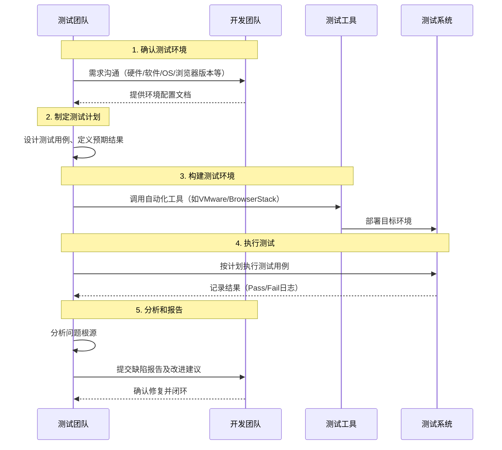

# 兼容性测试

## 兼容性测试的目的
定义：确保系统/应用/网站在不同环境（浏览器、硬件、操作系统、用户等）下的兼容性，验证产品在特定环境中的表现。
兼容性测试是为了确保软件在不同的环境和平台上运行良好，使用于多样的操作系统，浏览器，网络环境和硬件设备，验收软件是否可以在各种组合环境下正确工作

## 兼容性测试的前提
标准和规范是必不可少的，它们定义了软件的预期行为和功能。
高级标准： 软件需求规格说明书
低级标准：文件格式和网络通信协议规范

## 兼容性测试的蹲厕所点
- **硬件兼容**  
  包括主板、处理器、内存、显卡、显示器、打印机等。  
  例如：不同品牌和架构的计算机、不同频率或位数的CPU、不同大小的内存/硬盘、不同带宽的网络等。

- **操作系统兼容**  
  包括操作系统类型、位数、补丁版本等。需考虑操作系统的流行程度、年份、类型、生产厂商等。  
  例如：Windows、Mac、Solaris、Linux；手机平台如Android、iOS、Windows Phone。

- **软件并发兼容**  
  ✓ 浏览器兼容：IE、FireFox、Chrome、Safari等。  
  ✓ 与其他软件兼容  

- **分辨率兼容**  
  测试不同分辨率下软件能否正常使用。

- **向前/向后兼容**  
  ✓ 向后兼容（向下兼容）：较高版本程序能处理较低版本数据。  
  例如：Word 2013能打开早期版本（如Word 2003）的.doc文件。  
  ✓ 向前兼容（向上兼容）：旧版本支持新版本生成的数据。

- **客户端与服务器兼容**  
  服务器通常部署最新版本，客户端版本可能不一致。

- **数据共享兼容**  
  ✓ 文档保存/读取格式兼容  
  ✓ 剪贴板格式兼容  

## 兼容性测试使用的工具

​BrowserStack​：
在线云测试平台，支持在真实设备和浏览器环境中进行测试。
​Sauce Labs​：
类似BrowserStack，提供跨平台、跨浏览器的自动化测试能力。
​VirtualBox/VMware​：
通过虚拟机技术模拟不同操作系统环境。
​Jira、TestRail或QC​：
用于测试用例的创建、执行跟踪和结果管理。

## 兼容性测试的步骤
进线兼容性测试的基本步骤

1. **确认测试环境**：
   确定测试所需的软硬件平台、操作系统版本、浏览器类型及版本等。
2. **制定测试计划**：
   明确测试范围、设计具体测试用例，并定义预期结果。
3. **构建测试环境**：
   在已确认的目标环境中搭建并配置测试系统。
4. **执行测试**：
   按计划逐项测试，详细记录测试结果及发现的问题。
5. **分析和报告**：
   对测试中发现的问题进行根本原因分析，生成测试报告并提供改进建议。

## 兼容性测试的注意事项
在进行兼容性测试时，需要注意以下几点：

（1）测试范围要广泛：兼容性测试的范围要尽可能广泛，覆盖软件的所有功能和场景。

（2）测试环境要真实：测试环境要尽可能真实，模拟实际的使用环境。

（3）测试用例要全面：测试用例要全面覆盖软件的所有功能和场景，以发现尽可能多的兼容性问题。

（4）测试结果要分析：测试结果要认真分析，确定问题的原因，并采取相应的措施进行解决。

          
# 配置测试与兼容性测试的区别

我已经查看了您的兼容性测试文档，现在将根据您提供的内容添加关于配置测试与兼容性测试区别的信息。

## 配置测试与兼容性测试的区别

配置测试的目的是保证软件在其相关的硬件上能够正常运行，而兼容性测试主要是测试软件能否与不同的软件正确协作。

### 配置测试的核心内容

配置测试的核心内容就是使用各种硬件来测试软件的运行情况，一般包括：

- 软件在不同的主机上的运行情况，例如 Dell 和 Apple
- 软件在不同的组件上的运行情况，例如开发的拨号程序要测试在不同厂商生产的 Modem 上的运行情况
- 不同的外设
- 不同的接口
- 不同的可选项，例如不同的内存大小

### 兼容性测试的核心内容

兼容性测试的核心内容：

- 测试软件是否能在不同的操作系统平台上兼容
- 测试软件是否能在同一操作系统平台的不同版本上兼容
- 软件本身能否向前或者向后兼容
- 测试软件能否与其它相关的软件兼容
- 数据兼容性测试，主要是指数据能否共享

配置和兼容性测试通称对开发系统类软件比较重要，例如驱动程序、操作系统、数据库管理系统等。具体进行时仍然按照测试用例来执行。
