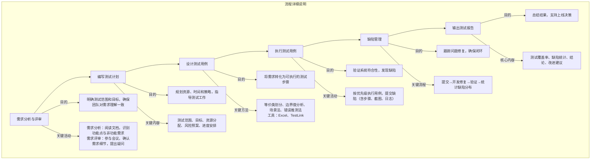
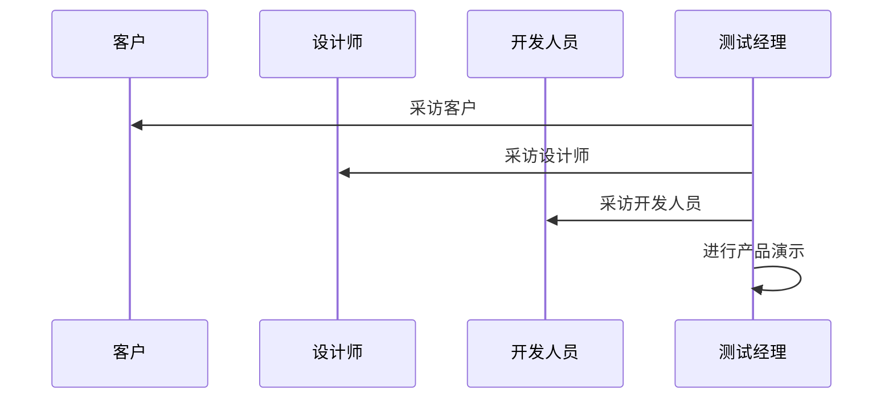
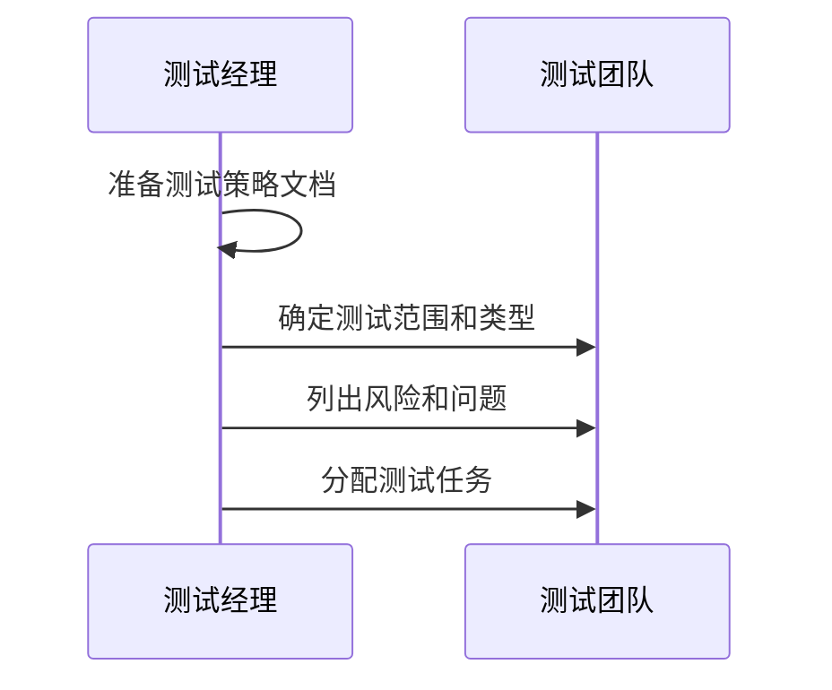
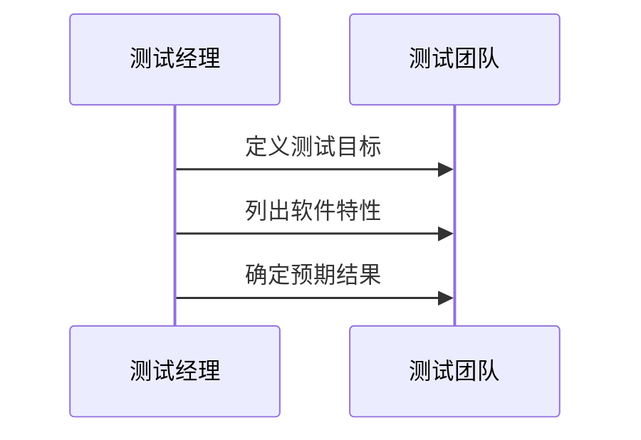
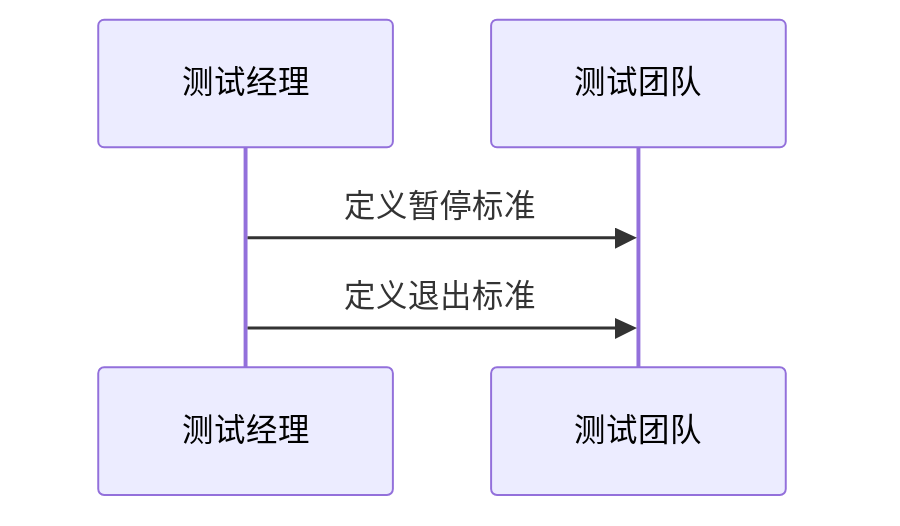
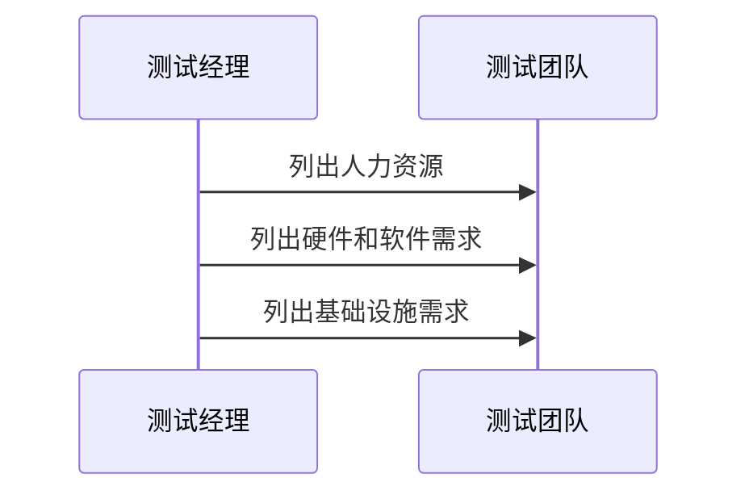
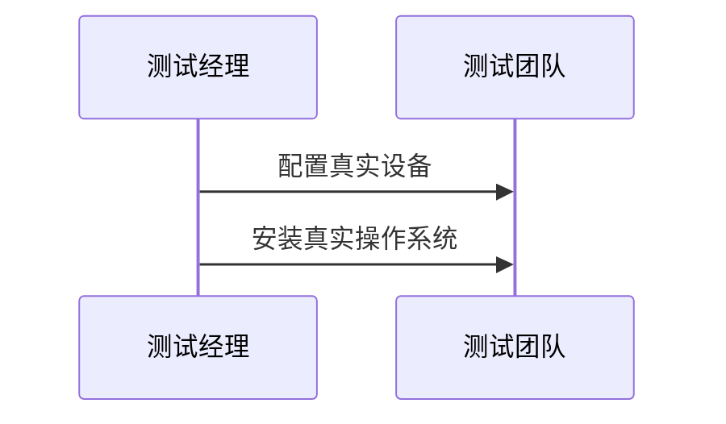
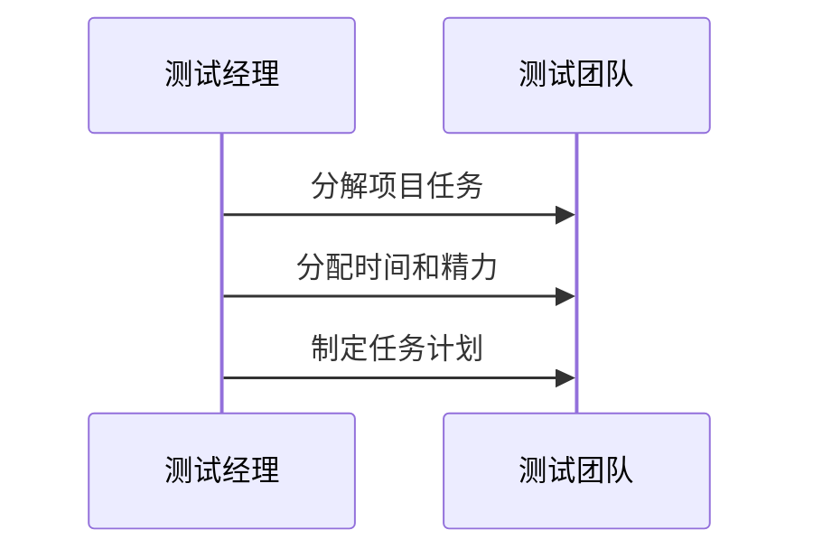
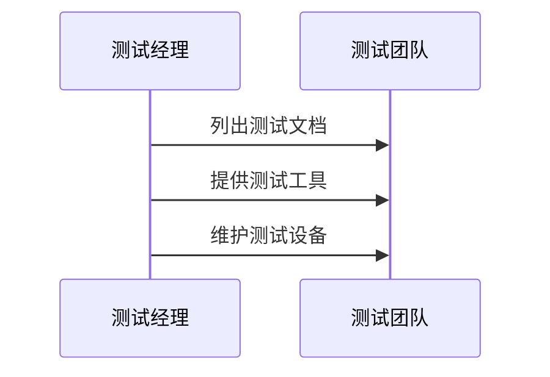

# 测试计划 

### **测试流程介绍**  

测试流程是软件测试活动的系统化步骤，确保测试工作高效、有序地进行。以下是典型的测试流程及其核心内容：  


#### **一、流程步骤**  

1. **需求分析与评审**  

   - **目的**：明确测试范围和目标，确保团队对需求理解一致（知道有什么功能，需求的规则是什么，站在不同（用户）角度对需求进行查漏补缺，各个部门对需求理解一致）

     评审之前需要阅读需求，记录疑问点

   - **关键活动**：  

     - **需求分析**：阅读需求文档，识别功能点、非功能需求（如性能、兼容性）。  
     - **需求评审**：参与产品经理组织的会议，与开发、产品团队确认需求细节，提出疑问或改进建议。  

2. **编写测试计划**  

   - **目的**：规划测试资源、时间和策略，指导后续测试工作。  
   - **关键内容**：  
     - 测试范围（覆盖模块）、测试目标、资源分配（人员、工具）、风险预案、进度安排。  

3. **设计测试用例**  

   - **目的**：将需求转化为可执行的测试步骤，覆盖所有场景。  
   - **关键方法**：  
     - 等价类划分、边界值分析、场景法、错误推测法。  
     - 使用工具（如Excel、TestLink）管理用例。  

4. **执行测试用例**  

   - **目的**：验证系统是否符合需求，发现缺陷。  
   - **关键活动**：  
     - 按优先级执行用例，记录实际结果。  
     - 提交缺陷至管理工具（如禅道、Jira），包含重现步骤、截图、日志等。  

5. **缺陷管理**  

   - **目的**：跟踪问题修复，确保闭环。  
   - **关键流程**：  
     - **提交**：开发复现并修复缺陷。  
     - **验证**：测试人员回归测试，确认修复后关闭缺陷。  
     - **统计**：分析缺陷分布（模块、严重程度），优化测试策略。  

6. **输出测试报告**  

   - **目的**：总结测试结果，为上线决策提供依据。  
   - **核心内容**：  
     - 测试覆盖率、缺陷统计（总数、修复率、遗留问题）、结论（通过/不通过）、改进建议。  





---

#### **二、流程价值**  

1. **减少盲目性**：通过计划与用例设计，避免随机测试，提升效率。  
2. **风险可控**：早期发现需求矛盾或技术难点，降低项目延期风险。  
3. **质量透明**：缺陷统计与测试报告直观展示系统质量，支持团队决策。  

---

#### **三、实际应用示例**  

- **场景**：电商平台“购物车”功能测试。  
  1. **需求评审**：确认“购物车”需支持添加、删除、批量操作、库存同步。  
  2. **测试计划**：分配2名测试人员，5天周期，覆盖功能、性能测试。  
  3. **测试用例**：设计用例如“添加商品后验证数量与总价更新”。  
  4. **执行与缺陷**：发现“库存为0时仍可添加商品”，提交Bug并跟踪修复。  
  5. **测试报告**：结论“功能通过，建议优化库存同步逻辑”。  

---

#### **四、注意事项**  

- **灵活调整**：根据项目类型（敏捷/瀑布）调整流程细节。  
- **工具支持**：利用自动化工具（如Selenium、Postman）提升效率。  
- **持续改进**：通过缺陷分析优化用例设计，避免同类问题复发。  

---

通过遵循结构化测试流程，团队可系统化把控质量，降低交付风险，最终实现高质量的软件交付。


---

### **需求评审与测试计划内容梳理**  

#### **一、需求评审**  

**核心目标**：确保团队对需求理解一致，明确测试范围和规则。  

**关键步骤**：  

1. **提前准备**：  
   - 从产品经理处获取需求文档（PRD/原型图），提前阅读2-3遍。  
   - **记录疑问点**：标注不清晰、逻辑矛盾、技术不可行等潜在问题。  
   - **参考竞品**：对比类似产品功能，思考用户体验差异（如淘宝、京东的登录流程）。  

2. **参与需求评审会议**：  
   - **提问策略**：  
     - **新人建议**：优先倾听产品经理讲解，会后与同事确认疑问点。  
     - **资深测试**：直接提问需求模糊点（如“用户密码复杂度要求是否明确？”）。  
   - **重点关注**：  
     - **功能规则**：如登录模块的密码规则（长度、字符类型）、错误提示逻辑。  
     - **业务场景**：主流程（正常登录）和异常场景（网络中断、重复登录）。  

3. **输出结果**：  
   - **需求确认文档**：记录会议结论（如“密码需包含大小写字母+数字，长度8-16位”）。  
   - **测试范围清单**：明确本次测试覆盖的功能模块（如登录、购物车）。  

---

#### **二、测试计划**  

**核心目标**：规划测试资源、时间和策略，指导测试工作有序开展。  

**关键内容**：  

1. **测什么（测试范围）**：  

   - 列出所有需测试的功能模块（如登录、支付、商品搜索）。  

   - **示例**：  

     ```  
     - 登录：正常登录、错误提示、第三方登录  
     - 购物车：添加/移除商品、库存同步、价格计算  
     ```

2. **怎么测（测试策略）**：  

   - **测试类型**：功能测试、兼容性测试（浏览器/设备）、性能测试（如并发用户数）。  
   - **工具选择**：  
     - 功能测试：Postman（接口）、Selenium（Web自动化）。  
     - 性能测试：JMeter（负载测试）。  

3. **谁来测（资源分配）**：  

   - 明确测试负责人及分工（如张三负责登录模块，李四负责支付模块）。  
   - **协作流程**：每日站会同步进度，使用禅道/Jira管理任务。  

4. **准入与准出标准** （重点）：  

   - **准入标准（研发提测条件（什么时候可以开始测试））**：  
     - 主流程可执行（如用户能完成登录-加购-支付流程 （业务可以跑通）。  
     - 冒烟测试通过率≥95%（核心功能无阻塞性Bug）。  
   - **准出标准（测试结束条件 （什么时候可以结束测试））**：  
     - 用例执行率100%，缺陷修复率：  
       - 致命/严重Bug：100%修复。  
       - 一般Bug：≥95%修复。  
     - 遗留Bug需记录并评估风险（如低优先级Bug延期处理）。  

---

#### **三、实际应用示例**  

**场景**：电商平台“购物车”模块测试。  

1. **需求评审**：  
   - **疑问记录**：  
     - 商品库存为0时，是否允许加入购物车？  
     - 批量删除商品是否支持快捷键操作？  
   - **结论**：  
     - 库存为0时，前端提示“商品已售罄”，禁止加入购物车。  
     - 批量删除需手动勾选，暂不支持快捷键。  

2. **测试计划**：  
   - **测试范围**：购物车增删改查、库存同步、价格计算。  
   - **准入标准**：  
     - 用户可正常添加商品，购物车页面加载时间＜2秒。  
   - **准出标准**：  
     - 所有用例执行完成，未修复Bug≤3个（需产品确认风险）。  

---

#### **四、注意事项**  

1. **团队协作**：  
   - 与开发、产品保持高频沟通，避免信息不对称。  
   - 使用协作工具（如Confluence）存档需求文档和会议记录。  

2. **灵活调整**：  
   - 敏捷项目中，测试计划可拆分为迭代计划（如每2周一个周期）。  

3. **风险控制**：  
   - 提前识别技术难点（如支付接口依赖第三方），预留Buffer时间。  

通过规范化的需求评审和测试计划，团队可高效推进测试工作，降低项目风险，确保交付质量。


---

### **用例设计、执行与缺陷管理详细说明**  

---

#### **一、用例设计**  

**1. 设计原则**  

- **业务用例优先**：  

  - **原因**：业务用例覆盖主流程（如用户登录→加购→支付），确保核心功能可用性。  

  - **示例**：电商平台“下单流程”的业务用例：  

    ```  
    1. 用户登录 → 搜索商品 → 加入购物车 → 提交订单 → 支付成功 → 订单状态更新。  
    ```

  - **优先级**：标为`P0`（最高优先级），作为准入标准。  

- **功能模块用例补充**：  

  - **原因**：覆盖异常场景、边界值（如密码错误、库存不足）。  

  - **示例**：登录模块的异常用例：  

    ```  
    1. 输入错误密码 → 提示“用户名或密码错误”。  
    2. 输入空用户名 → 提示“请输入用户名”。  
    ```

  - **优先级**：标为`P1`或`P2`。  

**2. 用例模板**  

| 用例编号 | 模块   | 优先级 | 前置条件   | 操作步骤                             | 预期结果         |
| -------- | ------ | ------ | ---------- | ------------------------------------ | ---------------- |
| TC-001   | 登录   | P0     | 无         | 1. 输入正确用户名密码<br>2. 点击登录 | 跳转至首页       |
| TC-002   | 购物车 | P1     | 已登录用户 | 1. 添加商品<br>2. 点击移除           | 商品从购物车消失 |

---

#### **二、用例执行**  

**1. 执行策略**  

- **按优先级执行**：   （写用例的时候需要清楚优先级并且明确优先级的定义）
  - **P0用例**：优先执行，确保主流程可用（如“用户能完成下单”）。  
  - **P1/P2用例**：次优执行，覆盖异常场景（如“支付超时处理”）。  

- **工具支持**：  
  - **Excel/TestRail**：标记用例状态（通过/失败/阻塞）。  
  - **自动化工具**：使用Selenium/Jenkins定时执行回归用例。  

**2. 执行技巧**  

- **批量执行**：同一模块用例集中执行（如集中测试“购物车”功能）。  
- **问题复现**：发现缺陷时，立即记录复现步骤并截图。  

---

#### **三、缺陷管理**  

提交时间：用例执行失败的第一时间

**1. 缺陷提交规范**  

- **唯一性**：一个缺陷仅描述一个问题。  

  - **错误示例**：  

    ```  
    Bug标题：登录失败且购物车无法加载  
    描述：用户登录失败，同时购物车页面空白。  
    ```

  - **正确示例**：  

    ```  
    Bug标题：用户登录失败（错误密码无提示）  
    描述：输入错误密码后，页面未提示“密码错误”。  
    ```

- **可复现性**：  

  - **必填项**：明确复现步骤、注明版本号和问题发送的时间，环境信息（浏览器/设备）、测试数据。  

  - **示例**：  

    ```  
    步骤：  
    1. 访问登录页  
    2. 输入用户名`test`，密码`wrong`  
    3. 点击登录  
    预期结果：提示“密码错误”  
    实际结果：页面无反应  
    ```

- **版本标记**：  

  - **必填项**：缺陷产生的版本号（如`V1.2.0`），修复后验证版本号。  

**2. 缺陷跟踪工具（示例：禅道）**  

| 字段     | 说明                                         |
| -------- | -------------------------------------------- |
| 标题     | 简洁描述问题（如“支付成功但订单状态未更新”） |
| 严重程度 | 致命/严重/一般/建议                          |
| 优先级   | 高/中/低                                     |
| 指派对象 | 开发负责人                                   |
| 附件     | 截图、日志文件、录屏                         |

**3. 缺陷闭环流程**  

1. **提交缺陷**：测试人员提交至禅道/Jira。  
2. **修复验证**：开发修复后，测试回归验证并标记状态（通过/重新打开）。  
3. **统计分析**：输出缺陷分布报告（如模块缺陷密度、修复率）。


验证缺陷

-  验证缺陷后需要注明版本号
- 验证不需要通过Reopen

关闭缺陷

- 验证通过则关闭并注明版本号


---

#### **四、实际案例**  

**场景**：电商平台“支付失败”缺陷处理  

1. **提交缺陷**：  

   - **标题**：支付成功但订单状态未更新（BUG-205）  

   - **步骤**：  

     ```  
     1. 用户提交订单 → 模拟支付成功  
     2. 查看订单状态仍为“待付款”  
     ```

   - **附件**：支付成功截图、网络日志。  

   - **版本**：V1.2.0  

2. **修复与验证**：  

   - 开发修复后，测试在`V1.2.1`版本验证，确认订单状态更新为“已支付”。  

---

#### **五、注意事项**  

1. **用例设计**：  
   - 避免过度设计（如冗余用例），聚焦核心场景。  
   - 定期评审用例，删除过时用例（如已下架功能）。  

2. **缺陷管理**：  
   - **不可复现缺陷**：记录环境信息，尝试复现3次后标记为“暂不处理”。  
   - **争议缺陷**：组织三方会议（测试、开发、产品）确认是否修复。  

---

**总结**：通过优先级驱动的用例执行和规范的缺陷管理，可高效保障测试质量，降低交付风险。


输出测试报告


### 测试计划的角色与职责

#### 1. 测试计划的编写者
- **测试主管**：负责制定测试计划的整体框架和策略。
- **测试经理**：确保测试计划符合项目需求，并协调资源。
- **测试工程师**：提供技术细节和具体测试方法的建议。

#### 2. 测试计划的审查者
- **测试主管**：审查测试计划的完整性和可行性。
- **测试经理**：确保测试计划与项目目标一致。
- **测试工程师**：验证测试计划的技术细节。
- **客户**：确保测试计划满足业务需求。
- **开发团队**：确认测试计划与开发进度和需求一致。

#### 3. 测试计划的批准者
- **客户**：最终确认测试计划符合业务需求。
- **测试经理**：确保测试计划在技术和资源上可行。

### 测试用例的编写与审查

#### 1. 测试用例的编写者
- **测试主管**：负责制定测试用例的整体框架。
- **测试工程师**：编写具体的测试用例。

#### 2. 测试用例的审查者
- **测试工程师**：验证测试用例的技术细节。
- **测试主管**：确保测试用例的完整性和一致性。
- **客户**：确认测试用例覆盖了业务需求。
- **开发团队**：确保测试用例与开发需求一致。

#### 3. 测试用例的批准者
- **测试经理**：最终确认测试用例的完整性和可行性。
- **测试主管**：确保测试用例符合测试计划的要求。
- **客户**：确认测试用例满足业务需求。

### 测试计划的重要性
- **指导测试活动**：测试计划为测试活动提供了明确的指导，确保测试工作有序进行。
- **协调团队工作**：测试计划帮助协调 QA 团队、开发团队和客户之间的工作，确保各方目标一致。
- **保持更新**：测试计划根据项目进展不断更新，确保测试活动始终与项目需求保持一致。


          
### 测试计划创建过程

以下是创建测试计划的八个步骤，结合时序图来说明测试计划的创建流程：

#### 1. 分析产品
- **目标**：了解产品的主要目标、用户群体、硬件和软件规格以及产品的工作原理。
- **活动**：采访客户、设计师和开发人员，进行产品演示。
- **时序图**：


#### 2. 设计测试策略
- **目标**：确定测试范围、测试类型、风险和问题以及测试物流。
- **活动**：由测试经理准备测试策略文档。
- **时序图**：


#### 3. 定义测试目标
- **目标**：明确测试执行的目标和预期结果。
- **活动**：列出软件特性及其理想预期结果。
- **时序图**：


#### 4. 定义测试标准
- **目标**：确定暂停标准和退出标准。
- **活动**：定义测试项目的基准。
- **时序图**：


#### 5. 资源规划
- **目标**：列出完成项目所需的所有资源。
- **活动**：详细列出人力、硬件和软件需求以及基础设施。
- **时序图**：


#### 6. 规划测试环境
- **目标**：确保测试环境与真实用户条件一致。
- **活动**：配置真实的设备和操作系统。
- **时序图**：


#### 7. 进度安排和估算
- **目标**：将项目分解为小任务并分配时间和精力。
- **活动**：制定任务计划和时间表。
- **时序图**：


#### 8. 确定测试可交付成果
- **目标**：列出支持测试活动的文档、工具和设备。
- **活动**：创建、提供和维护测试可交付成果。
- **时序图**：



以下是测试计划的组成部分和属性的表格总结：

| **组成部分** | **描述** |  
| ------------ | -------- |  
| **目标** | 描述测试计划的目的，确保软件无缺陷。列出所有要测试的功能和性能，并根据应用特点制定目标和指标。 |  
| **范围** | 包含需要测试的应用程序信息，分为范围内（严格测试的模块）和范围外（不需要严格测试的模块）。 |  
| **测试方法** | 根据应用需求决定测试方法，明确使用哪种测试，以便每个人都能理解。 |  
| **方法** | 处理应用程序的流程，包含高级场景（测试关键功能）和流程图（用于收敛和合并）。 |  
| **假设** | 测试团队将获得开发团队的支持、知识转移和资源配置。 |  
| **风险** | 假设被打破时可能发生的风险，如管理能力差、项目延期、缺乏合作等。 |  
| **风险缓解计划** | 制定备用计划，设置测试优先级，提升管理者领导能力，提供测试人员培训。 |  
| **角色和职责** | 记录测试团队每个成员的职责和角色，如测试经理管理项目，测试人员确定测试技术。 |  
| **时间表** | 记录每个测试相关活动的开始和结束日期，如编写测试用例的日期。 |  
| **缺陷跟踪** | 捕获缺陷信息，根据严重性和重要性优先排序，确保开发团队及时修复。 |  
| **测试环境** | 列出测试团队将使用的硬件和软件环境，检查软件安装情况。 |  
| **进入和退出标准** | 定义测试开始和结束的条件，确保测试活动有序进行。 |  

### **测试用例（Test Case）核心解析**

#### **一、测试用例的定义**  

- **英文术语**：Test Case（企业常用简称）。  
- **核心定义**：  
  - 为验证**特定功能或需求**而设计的一组**测试输入、执行条件和预期结果**。  
  - 本质是**测试执行的说明书**，指导测试人员按步骤操作并验证结果。  
- **类比**：  
  - 类似“实验步骤”：明确输入（如实验材料）、操作（如实验流程）、预期输出（如实验结果）。  

---

#### **二、为什么需要测试用例？**  

| **作用**         | **说明**                                          | **示例**                                       |
| ---------------- | ------------------------------------------------- | ---------------------------------------------- |
| **梳理测试思路** | 通过书写覆盖所有场景，避免遗漏。                  | 登录功能需覆盖：正确密码、错误密码、空密码等。 |
| **质量评价依据** | 根据用例通过率评估软件质量（如100%通过=高质量）。 | 若90%用例失败，说明代码质量差。                |
| **相似场景复用** | 大型项目中复用通用用例（如搜索框、筛选功能）。    | 京东/淘宝的搜索功能用例可复用。                |
| **规范团队协作** | 新人或团队按用例执行，确保测试一致性。            | 多人测试同一模块时，结果可对比。               |

---

#### **三、测试用例的完整结构**  

一个标准的测试用例应包含以下要素：  

| **要素**     | **说明**                                              | **示例（以“用户登录”为例）**            |
| ------------ | ----------------------------------------------------- | --------------------------------------- |
| **用例编号** | 唯一标识符（如`TC_LOGIN_001`）。                      | `TC_LOGIN_001`                          |
| **用例名称** | 简要描述测试目标（动词+对象）。                       | “验证正确密码登录成功”                  |
| **优先级**   | 标记执行顺序（P0最高，P3最低）。                      | P1（核心功能）                          |
| **测试模块** | 所属功能模块。                                        | “用户登录模块”                          |
| **前置条件** | 执行前的必备状态。                                    | “已注册用户账号”                        |
| **测试输入** | 操作所需的数据或动作。                                | 用户名：`test@demo.com`，密码：`123456` |
| **操作步骤** | 详细执行步骤（1. 打开登录页；2. 输入用户名和密码…）。 | 分步写明点击、输入等动作。              |
| **预期结果** | 正确情况下应输出的结果。                              | “跳转到用户首页”                        |
| **实际结果** | 执行后真实结果（由测试人员填写）。                    | （执行后补充）                          |

---

#### **四、测试用例的核心价值**  

1. **发现Bug**：通过对比**预期结果**与**实际结果**，定位缺陷。  
2. **标准化流程**：避免依赖个人经验，确保测试覆盖全面。  
3. **团队协作基石**：开发复现Bug、新人快速上手均依赖用例。  

**关键点**：  

- 用例设计需结合**需求文档**和**用户场景**。  
- 用例评审（团队确认覆盖性）是质量保障的重要环节。  

通过系统化的测试用例，测试人员能高效、精准地发现软件缺陷，推动产品质量提升！

# 测试计划书怎么编写

## 测试计划书的书写思路

- 有条理的进行测试
- 测试排期得到大家的认可
- 合理的分配工作
- 风险的预估


项目计划书中包含的要素

---

### **软件测试计划书编写内容**  

---

#### **1. 编写目的**  

1. **内部流程规范**：确保测试工作有序进行，避免混乱。  
2. **排期透明化**：明确测试周期，便于团队协调与项目验收。  
3. **责任分工**：明确测试任务分配，指定模块负责人。  
4. **风险控制**：提前识别潜在风险（如环境延迟、需求变更），制定应对策略。  

---

#### **2. 核心要素**  

##### **（1）项目背景**  

- **适用场景**：  
  - 外部项目（如甲方委托测试）：说明项目背景、业务目标及测试必要性。  
  - 内部项目：可简略描述，聚焦测试目标（如“提升系统稳定性”）。  

##### **（2）测试范围**  

- **明确模块**：列出本轮测试覆盖的功能模块（如用户登录、订单支付、购物车管理）。  
- **排除项**：说明不测试的部分（如第三方接口、历史遗留功能）。  

##### **（3）参考文档**  

- **引用依据**：  
  - 需求说明书（核心输入）。  
  - 设计文档（如UI原型、数据库设计）。  
  - 历史测试报告（回归测试参考）。  

##### **（4）提交文档**  

- **测试产出**：  
  - 测试用例文档、缺陷报告、测试总结报告。  
  - 自动化脚本（如有）、性能测试报告（如适用）。  

##### **（5）测试资源**  

- **软件资源**：  
  - 付费工具（如Jira、TestRail）需注明授权信息。  
  - 开源工具（如JMeter、Selenium）需确认可商用性。  
- **硬件资源**：  
  - 服务器配置（CPU、内存、存储）。  
  - 测试设备（如手机、平板型号及操作系统版本）。  

##### **（6）人员安排**  

- **角色分工**：  

  | **角色**       | **职责**                     |
  | -------------- | ---------------------------- |
  | 测试经理       | 计划制定、进度监控、风险评估 |
  | 功能测试工程师 | 执行用例、提交缺陷           |
  | 自动化工程师   | 编写脚本、维护框架           |

##### **（7）测试工具**  

- **功能测试**：Postman（接口测试）、Selenium（UI自动化）。  
- **性能测试**：JMeter、LoadRunner。  
- **缺陷管理**：Jira、禅道。  

##### **（8）时间预估**  

- **阶段划分**：  

  | **阶段** | **时间** | **输出物**     |
  | -------- | -------- | -------------- |
  | 测试计划 | 1天      | 测试计划书     |
  | 用例设计 | 3天      | 测试用例文档   |
  | 测试执行 | 5天      | 缺陷报告、日报 |
  | 回归测试 | 2天      | 回归测试报告   |

##### **（9）测试类型**  

- **基础测试**：功能测试、界面测试。  
- **专项测试**：兼容性测试（浏览器/设备）、性能测试（并发/响应时间）。  

##### **（10）测试目标**  

- **质量指标**：  
  - 功能通过率 ≥ 95%。  
  - 关键路径缺陷修复率 100%。  
  - 高优先级缺陷清零。  

##### **（11）风险预估**  

- **常见风险**：  

  | **风险类型** | **应对策略**               |
  | ------------ | -------------------------- |
  | 需求变更     | 同步更新用例，预留缓冲时间 |
  | 环境延迟     | 提前申请资源，准备备用环境 |
  | 人员变动     | 文档标准化，确保知识传递   |

---

#### **3. 编写建议**  

1. **结构清晰**：使用目录分级（如1.1、1.2），便于快速定位信息。  
2. **数据量化**：时间、资源、目标均需具体数值（如“测试周期：10人/天”）。  
3. **团队确认**：与开发、产品团队评审计划，确保一致性。  
4. **灵活调整**：预留10%~20%时间应对突发情况（如复杂缺陷修复）。  

---

#### **4. 示例模板（简化版）**  


```markdown  
# 木木生鲜电商平台测试计划书  
## 1. 项目背景  
- 目标：验证系统核心功能稳定性，支持双十一大促活动。  
## 2. 测试范围  
- 覆盖模块：用户登录、商品搜索、购物车、订单支付。  
- 排除项：第三方物流接口（由供应商自测）。  
## 3. 测试资源  
- 工具：Postman（接口测试）、Chrome/Firefox（兼容性测试）。  
- 环境：测试服务器（4核CPU/16GB内存/200GB存储）。  
## 4. 时间计划  
- 用例设计：2023-10-01至2023-10-03（负责人：张三）。  
- 测试执行：2023-10-04至2023-10-08（负责人：李四）。  
## 5. 风险预案  
- 需求变更：每日站会同步进度，变更需邮件确认。  
```

---

**总结**：测试计划书是测试团队的“行动纲领”，需兼顾全面性与可操作性。通过明确目标、资源、分工与风险，确保测试工作高效推进，最终交付高质量产品。
# 测试用例的格式


# 测试报告怎么编写
#### **一、测试报告核心结构**  

1. **项目背景**  

   - **目的**：说明测试的动机（如新功能上线、版本迭代、修复缺陷）。  

   - **范围**：明确被测系统版本、覆盖模块（如登录、支付、购物车）。  

   - **示例**：  

     > “本次测试针对木木生鲜电商平台V1.2.0版本，覆盖用户端核心功能模块：商品搜索、购物车、订单支付，验证新上线的优惠券功能及已知缺陷修复情况。”  

2. **术语定义**  

   - **适用场景**：涉及专业术语时需解释（如金融行业的“T+0结算”、电商的“SKU”）。  

   - **示例**：  

     > **SKU**：库存量单位，用于标识商品的唯一编码。  

3. **参考资料**  

   - **包含内容**：需求文档、接口文档、测试计划、缺陷管理链接（如禅道）。  

   - **示例**：  

     > - 需求文档：《木木生鲜V1.2.0功能需求说明书》  
     > - 缺陷管理：禅道项目ID：PROJ-123  

4. **被测系统版本简介**  

   - **内容**：版本号、主要更新内容、修复的缺陷列表。  

   - **示例**：  

     > **V1.2.0更新内容**：  
     >
     > - 新增：优惠券发放与使用功能  
     > - 修复：购物车数量显示异常（Bug ID: BUG-101）  

5. **测试团队与分工**  

   - **格式**：表格列明测试负责人、模块、执行时间。  

   - **示例**：  

     | 测试负责人 | 负责模块     | 执行周期           |
     | ---------- | ------------ | ------------------ |
     | 张三       | 登录、购物车 | 2023-10-01 ~ 10-05 |

6. **测试环境**  

   - **硬件/软件**：服务器配置、数据库版本、浏览器类型。  

   - **示例**：  

     > **测试环境**：  
     >
     > - 服务器：CentOS 7.4 / 4核8G  
     > - 数据库：MySQL 5.7  
     > - 前端：Chrome 115 / Safari 16  

7. **测试执行过程**  

   - **时间线**：测试阶段（冒烟测试、系统测试、回归测试）及时间节点。  

   - **示例**：  

     > **测试周期**：  
     >
     > - 冒烟测试：2023-10-01（通过率100%）  
     > - 系统测试：2023-10-02 ~ 10-05  
     > - 回归测试：2023-10-06（验证Bug修复）  

8. **测试产出物**  

   - **文档**：测试用例、缺陷报告、自动化脚本。  

   - **示例**：  

     > - 测试用例：共设计120条，执行率100%  
     > - 缺陷报告：提交Bug 25个，修复率92%  

---

#### **二、核心内容：缺陷分析与结论**  

1. **缺陷汇总**  

   - **按严重程度分类**：致命、严重、一般、建议。  

   - **示例表格**：  

     | 严重程度 | 数量 | 占比 |
     | -------- | ---- | ---- |
     | 致命     | 2    | 8%   |
     | 严重     | 5    | 20%  |
     | 一般     | 15   | 60%  |
     | 建议     | 3    | 12%  |

2. **缺陷分布**  

   - **按模块统计**：图表展示各模块缺陷密度。  

   - **示例**：  

     ```  
     购物车模块：8个（32%）  
     支付模块：6个（24%）  
     搜索模块：5个（20%）  
     ```

   - **工具**：Excel柱状图、禅道统计报表。  

3. **典型缺陷示例**  

   - **格式**：缺陷标题、重现步骤、影响范围。  

   - **示例**：  

     > **标题**：支付成功但订单状态未更新（BUG-205）  
     > **步骤**：  
     >
     > 1. 选择商品提交订单  
     > 2. 模拟支付成功  
     > 3. 查看订单状态仍为“待付款”  
     >    **影响**：用户误以为支付失败，导致重复下单。  

4. **遗留缺陷说明**  

   - **内容**：未修复的缺陷列表、遗留原因、风险等级。  

   - **示例**：  

     | Bug ID  | 描述                  | 遗留原因         | 风险等级 |
     | ------- | --------------------- | ---------------- | -------- |
     | BUG-210 | 商品图片加载慢（>3s） | 优化排期至下版本 | 低       |

5. **测试结论**  

   - **结论**：明确是否通过测试，给出上线建议。  

   - **示例**：  

     > **结论**：  
     >
     > - 本次测试共执行用例120条，通过率98%。  
     > - 遗留2个一般缺陷（BUG-210、BUG-215），风险可控。  
     >   **建议**：当前版本允许上线，遗留问题需在V1.3.0版本修复。  

---

#### **三、测试报告模板（简化版）**  

```markdown  
# 木木生鲜V1.2.0测试报告  
## 1. 项目背景  
- **目的**：验证优惠券功能及缺陷修复。  
- **范围**：用户端核心模块（搜索、购物车、支付）。  

## 2. 测试环境  
- 服务器：CentOS 7.4 / MySQL 5.7  
- 客户端：Chrome 115 / iOS 16  

## 3. 缺陷分析  
### 3.1 缺陷统计  
| 严重程度 | 数量 | 占比  |  
|----------|------|-------|  
| 致命      | 2    | 8%    |  

### 3.2 模块分布  
- 购物车：8个（32%）  
- 支付：6个（24%）  

## 4. 测试结论  
- 通过率98%，建议上线，遗留问题需跟进修复。  
```

---

#### **四、实用技巧**  

1. **数据可视化**：  
   - 使用Excel/Power BI生成缺陷分布图、趋势图。  
2. **版本控制**：  
   - 报告命名规范：`测试报告_项目名_版本号_日期`（如`TestReport_Mumu_V1.2.0_20231001`）。  
3. **可读性优化**：  
   - 避免技术术语堆砌，用白话描述问题（如“用户无法付款”而非“支付状态机异常”）。  
4. **评审流程**：  
   - 报告完成后需通过项目经理、开发负责人评审，确保结论共识。  

---

通过结构化、数据驱动的测试报告，团队可清晰了解版本质量，为决策提供可靠依据。


---

### **如何编写高质量软件测试报告？**  

以下基于视频讲义内容总结的测试报告编写指南，涵盖核心结构和实用技巧：

---

#### **一、测试报告核心结构**  

1. **标题与版本标识**  

   - **示例**：*木木生鲜V1.0测试报告*  
   - **要求**：明确系统名称、版本号、报告日期。

2. **引言**  

   - **项目背景**：简述测试目标（如新功能验证、缺陷修复）。  
   - **术语定义**：解释专业术语（如“SKU”“T+0结算”），若无术语可省略。  
   - **参考资料**：列出需求文档、测试计划、用例文档、缺陷管理链接（如禅道）。

3. **测试概要**  

   - **被测系统简介**：说明版本功能（如“首次提测版本实现登录、购物车功能”）。  

   - **测试团队与分工**：表格列明模块负责人及测试周期。  

     | 模块 | 负责人 | 执行周期      |
     | ---- | ------ | ------------- |
     | 登录 | 张三   | 2023-10-01~05 |

   - **测试环境**：  

     - 硬件：服务器配置（CPU、内存、硬盘）。  
     - 软件：数据库版本（MySQL 8.0）、浏览器类型（Chrome 115）。  

4. **测试执行过程**  

   - **时间线**：分阶段说明测试活动（冒烟测试、系统测试、回归测试）。  
   - **产出物**：列出测试用例、缺陷报告、自动化脚本等，附链接或存档路径。  

5. **测试结果分析**  

   - **缺陷汇总**：  
     - 按严重程度分类（致命、严重、一般、建议），用图表展示比例。  
     - **示例**：饼图显示“致命缺陷占比8%”。  
   - **缺陷分布**：按模块统计缺陷密度（如“购物车模块缺陷占比32%”）。  
   - **典型缺陷**：描述2-3个关键Bug（标题、重现步骤、影响）。  
   - **遗留缺陷**：表格列明未修复Bug的ID、描述、原因及风险。  

6. **测试结论与建议**  

   - **结论**：明确是否通过测试（如“测试通过，建议上线”）。  
   - **风险说明**：若存在遗留问题，评估风险等级（低/中/高）。  
   - **改进建议**：提出优化方向（如“提前介入需求评审，增加自动化覆盖率”）。  

---

#### **二、测试报告编写技巧**  

1. **数据可视化**  
   - 使用Excel/Power BI生成**缺陷分布图**、**趋势图**，直观展示结果。  
   - 示例：柱状图对比各模块缺陷数量。  

2. **版本控制与命名规范**  
   - 报告命名：`测试报告_项目名_版本号_日期`（如`TestReport_Mumu_V1.0_20231001`）。  

3. **语言与格式**  
   - **简洁明确**：避免技术术语堆砌，用白话描述问题（如“用户无法支付”而非“支付状态机异常”）。  
   - **结构清晰**：使用标题、列表、表格分块，确保逻辑连贯。  

4. **遗留问题管理**  
   - 附禅道Bug链接，方便快速跳转查看详情。  
   - 说明遗留原因（如“排期冲突”“低优先级”）。  

5. **评审与存档**  
   - 报告需通过项目经理、开发负责人评审，达成共识后存档。  
   - 存档路径：公司Wiki、共享盘或邮件抄送相关人员。  

---

#### **三、测试报告示例模板**  

```markdown  
# 木木生鲜V1.0测试报告  
**报告日期**：2023-10-10  

## 1. 项目背景  
- **目标**：验证V1.0版本核心功能（登录、购物车、支付）。  
- **范围**：覆盖用户端主流程，修复历史Bug 15个。  

## 2. 测试环境  
- **服务器**：CentOS 7.4 / 16核CPU / 32G内存  
- **数据库**：MySQL 8.0  
- **客户端**：Chrome 115 / iOS 16  

## 3. 测试结果  
### 3.1 缺陷汇总  
| 严重程度 | 数量 | 占比  |  
|----------|------|-------|  
| 致命      | 2    | 8%    |  
| 严重      | 5    | 20%   |  

### 3.2 遗留缺陷  
| Bug ID  | 描述                   | 风险等级 |  
|---------|------------------------|----------|  
| BUG-101 | 支付成功但订单未更新    | 高       |  

## 4. 测试结论  
- **结论**：通过测试，建议上线。  
- **建议**：优化支付状态同步逻辑，下版本修复BUG-101。  
```

---

#### **四、总结**  

- **核心价值**：测试报告需体现测试深度、缺陷管理能力及风险控制意识。  
- **持续改进**：通过每次测试报告迭代优化流程（如引入自动化、增强需求评审）。  
- **团队协作**：报告是测试团队与开发、产品、运维沟通的桥梁，需确保信息透明。  

通过结构化、数据驱动的测试报告，团队可高效决策，降低上线风险，提升产品质量。