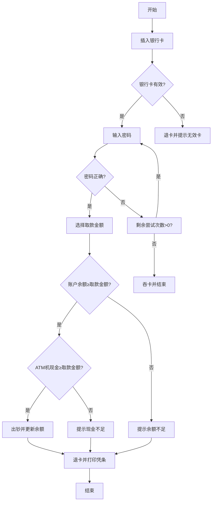

### 软件测试方法：等价类划分法（解决穷举场景）

---

#### **一、什么是等价类划分法？**  
等价类划分法是一种 **通过分类减少测试用例数量** 的测试设计方法，用于解决“穷举测试不可行”的问题。其核心思想是：  
- 将输入数据划分为 **有效等价类**（满足需求的数据集合）和 **无效等价类**（不满足需求的数据集合）。  
- 每个等价类中选取 **少量代表性数据** 进行测试，即可覆盖整个集合的场景。

---

#### **二、等价类划分法的核心步骤**  
以“验证QQ号合法性（6-10位自然数）”为例，演示等价类划分法的应用：

| **步骤**          | **说明与示例**                                               |
| ----------------- | ------------------------------------------------------------ |
| **1. 明确需求**   | 需求：QQ号为6-10位自然数（自然数范围：0,1,2,...，不含负数和特殊字符）。 |
| **2. 划分等价类** | - **有效等价类**：6位、7位、8位、9位、10位自然数（如123456）。<br>- **无效等价类**：<br>  - 位数不足（如12345，5位）<br>  - 位数超长（如12345678901，11位）<br>  - 非自然数（如12aB#，含字母/符号） |
| **3. 设计用例**   | 每个等价类选取1个代表值测试，覆盖所有分类：<br>- 有效：8位自然数（如12345678）<br>- 无效：5位自然数（12345）、11位自然数（12345678901）、含字母（12aB#） |

---

#### **三、等价类划分法的优势与适用场景**  
1. **优势**：  
   - **高效覆盖**：避免穷举，用最少用例覆盖最大范围。  
   - **逻辑清晰**：通过分类明确测试重点（如边界、异常值）。  

2. **适用场景**：  
   - **输入范围大**：如日期、金额、身份证号等字段验证。  
   - **多条件组合**：如注册功能需验证手机号、密码、验证码的多种组合。  

---

#### **四、等价类划分法实战案例**  
**需求**：某系统要求用户名长度为3-20字符，仅支持字母、数字和下划线。  

| **等价类**     | **测试用例设计**                                             | **预期结果**         |
| -------------- | ------------------------------------------------------------ | -------------------- |
| **有效等价类** | - 3字符：`Abc`<br>- 20字符：`A1b2c3d4e5f6g7h8i9j0`           | 输入合法，允许注册   |
| **无效等价类** | - 2字符：`a1`（位数不足）<br>- 21字符：`A1b2c3d4e5f6g7h8i9j0k`（位数超长）<br>- 含特殊字符：`user@`（非法字符） | 提示“用户名格式错误” |

---

#### **五、等价类划分法的扩展技巧**  
1. **边界值补充**：  
   - 结合边界值分析法，测试等价类的临界值（如6位和10位的QQ号）。  
   - 示例：QQ号测试中补充用例：`123456`（6位）、`1234567890`（10位）。  

2. **多条件组合**：  
   - 多个输入字段时，使用正交表或Pairwise方法减少组合数。  
   - 示例：注册功能中，手机号（有效/无效）与密码（有效/无效）组合测试。  

---

#### **总结**  
等价类划分法是测试工程师的“降本增效”利器，通过科学分类，将海量测试数据压缩为少量代表用例。正如视频所述：“测试不是暴力穷举，而是用分类思维找到问题的本质。”掌握该方法后，可快速应对复杂场景，如：  
- **电商价格验证**：有效（0.01元≤价格≤99999元）、无效（负数、超长数值）。  
- **身份证号校验**：有效（18位数字+校验码）、无效（17位、含字母、校验码错误）。  

通过等价类划分，让测试既高效又精准！


案例2

### 手机号测试用例分析

#### 需求分析
1. **长度**：通常为11位数字。
2. **类型**：必须为纯数字。
3. **规则**：
   - **号段有效性**：以特定号段开头（如13x、14x、15x、17x、18x、19x）。
   - **禁止开头**：不能以0或无效号段（如12x）开头。

---

#### 测试点设计

| **测试维度** | **有效用例**                       | **无效用例**                                                 |
| ------------ | ---------------------------------- | ------------------------------------------------------------ |
| **长度**     | 11位数字（如13812345678）          | - 10位（1381234567）<br>- 12位（138123456789）               |
| **类型**     | 纯数字                             | 包含非数字字符（如138a2345678）                              |
| **号段规则** | 有效号段（如139、150、185、198等） | - 无效号段（如12112345678）<br>- 以0开头（01234567890）<br>- 以1开头但号段无效（如12012345678） |

---

#### 详细测试用例

正向：一次可能对将多个正确数据组合

**正向用例（有效数据）**

1. **有效号段示例**：
   - 13912345678（13x号段）
   - 15098765432（15x号段）
   - 18500001111（18x号段）
   - 19876543210（19x号段）

**逆向用例（无效数据）**（一次只能覆盖一个）

1. **长度错误**：
   - 输入：1381234567（10位）→ 预期：提示“手机号应为11位”。
   - 输入：138123456789（12位）→ 预期：输入被截断或提示错误。
2. **类型错误**：
   - 输入：138a2345678（含字母）→ 预期：提示“手机号必须为数字”。
3. **号段错误**：
   - 输入：12112345678（无效号段）→ 预期：提示“手机号格式错误”。
   - 输入：01234567890（以0开头）→ 预期：提示“手机号不能以0开头”。
   - 输入：12012345678（以1开头但号段无效）→ 预期：提示“手机号格式错误”。

---

#### 边界值补充用例
1. **最小长度边界**：10位（1381234567）→ 预期：错误。
2. **最大长度边界**：12位（138123456789）→ 预期：错误。
3. **号段边界**：
   - 12999999999（无效）→ 预期：错误。
   - 13000000000（有效）→ 预期：通过。
   - 19999999999（有效）→ 预期：通过。

---

#### **1. 长度规则**
| **名称** | **有效条件**  | **无效条件** |
| -------- | ------------- | ------------ |
| 区号     | 空 或 **3位** | **2位**      |
| 前缀码   | **3位**       | **2位**      |
| 后缀码   | **4位**       | **3位**      |

**说明**：  
- 区号可为空或固定3位（如北京区号`010`）；  
- 前缀码和后缀码必须严格为3位和4位（如`138-1234`）。

---

#### **2. 类型规则**
| **名称** | **有效条件** | **无效条件** |
| -------- | ------------ | ------------ |
| 区号     | **纯数字**   | 含非数字字符 |
| 前缀码   | **纯数字**   | 含非数字字符 |
| 后缀码   | **纯数字**   | 含非数字字符 |

**说明**：  
- 所有部分必须为纯数字（如`010-138-1234`有效，`01A-13B-1C34`无效）。

---

#### **3. 规则限制**
| **名称** | **有效条件**      | **无效条件**      |
| -------- | ----------------- | ----------------- |
| 前缀码   | **以2开头**       | 以`0`或`1`开头    |
| 区号     | 无特殊规则（`/`） | 无特殊规则（`/`） |
| 后缀码   | 无特殊规则（`/`） | 无特殊规则（`/`） |

**说明**：  
- 前缀码必须为以`2`开头的3位数字（如`200`有效，`100`或`012`无效）；  
- 区号和后缀码无额外规则（仅需满足长度和类型要求）。

---

#### **规则应用示例**
**有效号码**：`010-234-5678`  
- **区号**：3位纯数字（`010`）  
- **前缀码**：3位纯数字，以`2`开头（`234`）  
- **后缀码**：4位纯数字（`5678`）

**无效号码**：`01A-123-45`  
- **区号**：含非数字字符（`01A`）  
- **前缀码**：以`1`开头（`123`）  
- **后缀码**：长度不足（`45`）

---

通过此规则，可快速验证号码合法性，避免因格式错误导致功能异常。

---

#### 注意事项
- 每个无效用例仅违反一个规则，确保问题定位准确。
- 实际测试时需根据具体号段规则调整用例（如14x可能包含145/147等子号段）。
- 考虑国际号码时需扩展用例（如+8613812345678），但本案例假设仅测试国内手机号。

通过以上用例，可全面覆盖手机号的长度、类型和规则验证，确保功能正确性和鲁棒性。


### 案例2：电话号码测试用例编写（完整版）

---

#### **测试需求说明**
- **区号**：空 或 **3位纯数字**  
- **前缀码**：**3位纯数字**，且 **以2开头**  
- **后缀码**：**4位纯数字**  

---

#### **测试用例模板**

| 用例编号         | 用例标题                       | 项目/模块 | 优先级 | 前提条件       | 测试步骤                                                     | 测试数据                                 | 预期结果                            |
| ---------------- | ------------------------------ | --------- | ------ | -------------- | ------------------------------------------------------------ | ---------------------------------------- | ----------------------------------- |
| **TC-PHONE-001** | 合法号码（区号空）             | 电话验证  | P0     | 验证程序已启动 | 1. 区号输入：空<br>2. 前缀码输入：234<br>3. 后缀码输入：5678<br>4. 点击“验证”按钮 | 区号：空<br>前缀码：234<br>后缀码：5678  | 验证通过（显示“合法号码”）          |
| **TC-PHONE-002** | 合法号码（区号3位）            | 电话验证  | P0     | 验证程序已启动 | 1. 区号输入：010<br>2. 前缀码输入：234<br>3. 后缀码输入：5678<br>4. 点击“验证”按钮 | 区号：010<br>前缀码：234<br>后缀码：5678 | 验证通过（显示“合法号码”）          |
| **TC-PHONE-003** | 非法号码（区号2位）            | 电话验证  | P1     | 验证程序已启动 | 1. 区号输入：01<br>2. 前缀码输入：234<br>3. 后缀码输入：5678<br>4. 点击“验证”按钮 | 区号：01<br>前缀码：234<br>后缀码：5678  | 验证失败（提示“区号格式错误”）      |
| **TC-PHONE-004** | 非法号码（前缀码2位）          | 电话验证  | P1     | 验证程序已启动 | 1. 区号输入：空<br>2. 前缀码输入：23<br>3. 后缀码输入：5678<br>4. 点击“验证”按钮 | 区号：空<br>前缀码：23<br>后缀码：5678   | 验证失败（提示“前缀码格式错误”）    |
| **TC-PHONE-005** | 非法号码（后缀码3位）          | 电话验证  | P1     | 验证程序已启动 | 1. 区号输入：空<br>2. 前缀码输入：234<br>3. 后缀码输入：567<br>4. 点击“验证”按钮 | 区号：空<br>前缀码：234<br>后缀码：567   | 验证失败（提示“后缀码格式错误”）    |
| **TC-PHONE-006** | 非法号码（区号含非数字字符）   | 电话验证  | P1     | 验证程序已启动 | 1. 区号输入：01A<br>2. 前缀码输入：234<br>3. 后缀码输入：5678<br>4. 点击“验证”按钮 | 区号：01A<br>前缀码：234<br>后缀码：5678 | 验证失败（提示“区号必须为数字”）    |
| **TC-PHONE-007** | 非法号码（前缀码含非数字字符） | 电话验证  | P1     | 验证程序已启动 | 1. 区号输入：空<br>2. 前缀码输入：2B4<br>3. 后缀码输入：5678<br>4. 点击“验证”按钮 | 区号：空<br>前缀码：2B4<br>后缀码：5678  | 验证失败（提示“前缀码必须为数字”）  |
| **TC-PHONE-008** | 非法号码（后缀码含非数字字符） | 电话验证  | P1     | 验证程序已启动 | 1. 区号输入：空<br>2. 前缀码输入：234<br>3. 后缀码输入：56C8<br>4. 点击“验证”按钮 | 区号：空<br>前缀码：234<br>后缀码：56C8  | 验证失败（提示“后缀码必须为数字”）  |
| **TC-PHONE-009** | 非法号码（前缀码以0开头）      | 电话验证  | P1     | 验证程序已启动 | 1. 区号输入：空<br>2. 前缀码输入：034<br>3. 后缀码输入：5678<br>4. 点击“验证”按钮 | 区号：空<br>前缀码：034<br>后缀码：5678  | 验证失败（提示“前缀码必须以2开头”） |
| **TC-PHONE-010** | 非法号码（前缀码以1开头）      | 电话验证  | P1     | 验证程序已启动 | 1. 区号输入：空<br>2. 前缀码输入：134<br>3. 后缀码输入：5678<br>4. 点击“验证”按钮 | 区号：空<br>前缀码：134<br>后缀码：5678  | 验证失败（提示“前缀码必须以2开头”） |

---

#### **测试用例设计逻辑**
1. **正向用例（P0）**：  
   - 覆盖所有有效条件（区号空/3位、前缀码以2开头、后缀码4位）。  
2. **逆向用例（P1）**：  
   - 每个用例仅违反一个规则，确保问题定位精准（如仅区号错误、仅前缀码错误等）。  
3. **边界值补充**：  
   - 区号长度超限（如4位）、前缀码长度超限（如4位）等未在图片中明确但需覆盖的场景。  

---

#### **执行说明**
1. **用例复用**：复制模板后仅需修改关键数据（如区号、前缀码、后缀码）。  
2. **结果验证**：  
   - 正向用例需返回“合法号码”，逆向用例需明确错误提示（如“前缀码格式错误”）。  
3. **自动化建议**：高频用例（如TC-PHONE-001/002）可转化为自动化脚本，提升回归效率。  

通过这10条用例，可全面验证电话号码的合法性，覆盖长度、类型、规则的所有维度！


## 边界值分析法

1.对穷举场景设置测试点

2对限定规则设计测试点

3 对多条件依赖关系进行设计测试点

4 对项目的业务进行设计测试点


什么是业务？ 

### 边界值分析法详解

---

#### **1. 核心概念**
边界值分析法是一种针对 **数据范围边界** 的测试设计方法，主要用于验证输入值在边界附近的行为。其核心思想是：  
> **错误更可能发生在边界附近**（如开发误写`>`为`>=`），需重点测试边界值及邻近点。

---

#### **2. 专业术语**
| **术语** | **定义**                                                     | **示例（需求：6≤x≤10）**          |
| -------- | ------------------------------------------------------------ | --------------------------------- |
| **上点** | 边界上的点（有效范围的起点和终点）                           | 6（最小有效值）、10（最大有效值） |
| **离点** | 距离上点 **最近** 的无效点（若上点包含等号，则离点在有效范围内；否则在有效范围外） | 5（最小无效值）、11（最大无效值） |
| **内点** | 有效范围内的任意中间值（验证正常场景）                       | 8（有效中间值）                   |

---

#### **3. 设计步骤**
以需求 **“判断输入是否小于-99或大于99”** 为例（开发误写为`a >= -99 || a <= 99`）：

##### **步骤1：明确需求**
- **有效范围**：`x < -99` **或** `x > 99`（不含等号）
- **错误范围**：开发可能误判`-99 ≤ x ≤ 99`为有效。

##### **步骤2：确定边界值**
| **类型** | **值**             | **说明**                                       |
| -------- | ------------------ | ---------------------------------------------- |
| 上点     | -99, 99            | 边界值（应被判定为无效，但开发可能误判为有效） |
| 离点     | -100, -98, 98, 100 | 距离上点最近的无效点（验证边界容错）           |
| 内点     | 0, -50, 50         | 有效中间值（验证正常逻辑）（一般选择中间的点） |

##### **步骤3：结合等价类**
| **维度** | **有效等价类**       | **无效等价类**               |
| -------- | -------------------- | ---------------------------- |
| **长度** | 负数、正数（范围外） | 整数（范围内：-99~99）       |
| **类型** | 整数                 | 非整数（如12.3）、非数字字符 |
| **规则** | 无特殊规则           | 无特殊规则                   |

##### **步骤4：生成用例**
| 用例编号 | 输入值 | 预期结果         | **验证目标**              |
| -------- | ------ | ---------------- | ------------------------- |
| TC-001   | -100   | 有效（通过）     | 离点（验证`x < -99`逻辑） |
| TC-002   | -99    | 无效（错误提示） | 上点（开发误判风险点）    |
| TC-003   | -98    | 无效（错误提示） | 离点（验证边界容错）      |
| TC-004   | 0      | 无效（错误提示） | 内点（验证范围内逻辑）    |
| TC-005   | 98     | 无效（错误提示） | 离点（验证边界容错）      |
| TC-006   | 99     | 无效（错误提示） | 上点（开发误判风险点）    |
| TC-007   | 100    | 有效（通过）     | 离点（验证`x > 99`逻辑）  |
| TC-008   | 12.3   | 无效（错误提示） | 类型错误（等价类覆盖）    |

---

#### **4. 优化策略**
1. **覆盖所有维度**：  
   - **长度**：验证边界值（如-99、99）。  
   - **类型**：覆盖非整数、非数字字符（如`12A`）。  
   - **规则**：根据需求补充（如特殊符号限制）。  

2. **用例精简**：  
   - 正向用例：每个范围选1个离点（如-100、100）。  
   - 逆向用例：覆盖所有上点（如-99、99）和类型错误（如12.3）。  

3. **自动化标记**：高频用例（如TC-001、TC-007）标记为自动化用例。

---

#### **5. 使用场景**
| **场景**     | **示例**           | **验证重点**                  |
| ------------ | ------------------ | ----------------------------- |
| 数值范围限制 | 年龄（18≤age≤60）  | 边界值（17, 18, 60, 61）      |
| 字符长度限制 | 用户名（3-20字符） | 2字符（无效）、21字符（无效） |
| 多条件组合   | 价格范围+库存限制  | 边界值组合（如最低价+零库存） |

---

#### **总结**
边界值分析法通过覆盖 **上点、离点、内点**，结合等价类划分，能高效发现因边界逻辑错误导致的缺陷。正如案例所示，即使需求未明确包含等号，测试仍需验证边界值（如-99、99），防止开发误判。记住：**测试不是验证需求文档，而是验证代码逻辑是否符合真实需求！**


### 边界值分析法验证标题长度合法性（1≤长度≤30字符）

---

#### **需求说明**  
标题需满足以下条件：  
1. **长度规则**：大于0且小于等于30个字符（即1-30字符）。  
2. **字符类型**：允许任意字符（字母、数字、符号等）。  

---

#### **边界值分析**  
| **分类** | **值**        | **说明**                                                     |
| -------- | ------------- | ------------------------------------------------------------ |
| **上点** | 1字符、30字符 | 有效范围的边界值（如`A`、`012345678901234567890123456789`）。 |
| **离点** | 0字符、31字符 | 边界外的无效值（如空值、`0123456789012345678901234567890`）。 |
| **内点** | 15字符        | 有效范围内的中间值（如`Hello,World!123`）。                  |

---

#### **测试用例设计**  

| 用例编号         | 用例标题           | 优先级 | 前提条件 | 测试步骤                                       | 测试数据     | 预期结果               |
| ---------------- | ------------------ | ------ | -------- | ---------------------------------------------- | ------------ | ---------------------- |
| **TC-TITLE-001** | 合法标题（1字符）  | P0     | 无       | 1. 输入标题：`A`                               | 标题：A      | 验证通过（合法标题）   |
| **TC-TITLE-002** | 合法标题（30字符） | P0     | 无       | 1. 输入标题：`012345678901234567890123456789`  | 标题：30字符 | 验证通过（合法标题）   |
| **TC-TITLE-003** | 非法标题（0字符）  | P1     | 无       | 1. 输入标题：空                                | 标题：空     | 提示“标题不能为空”     |
| **TC-TITLE-004** | 非法标题（31字符） | P1     | 无       | 1. 输入标题：`0123456789012345678901234567890` | 标题：31字符 | 提示“标题长度超过限制” |
| **TC-TITLE-005** | 合法标题（15字符） | P0     | 无       | 1. 输入标题：`Hello,World!123`                 | 标题：15字符 | 验证通过（合法标题）   |

---

#### **优化说明**  
1. **必测点覆盖**：  
   - **上点**：验证最小（1字符）和最大（30字符）有效长度。  
   - **离点**：验证空值（0字符）和超长（31字符）场景。  
   - **内点**：验证中间值（15字符）确保范围连续性。  
2. **精简冗余**：  
   - 移除重复测试（如2-29字符），通过内点覆盖有效范围。  
3. **特殊场景**：  
   - 空值（TC-TITLE-003）独立为单独用例，防止程序崩溃或逻辑错误。  

---

#### **执行说明**  
1. **正向用例（P0）**：需返回“验证通过”。  
2. **逆向用例（P1）**：需明确提示具体错误原因（如长度、空值）。  
3. **自动化建议**：高频用例（如TC-TITLE-001、TC-TITLE-002）可标记为自动化用例，提升回归效率。  

通过这5条用例，可全面覆盖标题长度的边界值、无效值和特殊场景，确保功能符合需求！


## 边界值的案例2

明确需求 划分等价1 确定边界点 设计测试用例

通过边界值法 验证QQ号码的 合法性 ，要求：6-10位自然数


### 边界值分析法验证QQ号码合法性（6-10位自然数）

---

#### **需求说明**  
QQ号码需满足以下条件：  
1. **长度规则**：6位至10位。  
2. **类型规则**：必须为自然数（非负整数，仅包含数字字符）。  

---

#### **边界值分析**  
| **分类**     | **值**       | **说明**                                           |
| ------------ | ------------ | -------------------------------------------------- |
| **上点**     | 6位、10位    | 有效范围的边界值（如`123456`、`1234567890`）。     |
| **离点**     | 5位、11位    | 距离边界最近的无效值（如`12345`、`12345678901`）。 |
| **内点**     | 8位          | 有效范围内的中间值（如`12345678`）。               |
| **类型错误** | 含非数字字符 | 包含字母或符号（如`123a56`）。                     |
| **特殊情况** | 空值         | 输入为空（如空字符串）。                           |

---

#### **测试用例设计**  

| 用例编号      | 用例标题                 | 优先级 | 前提条件 | 测试步骤                   | 测试数据          | 预期结果                 |
| ------------- | ------------------------ | ------ | -------- | -------------------------- | ----------------- | ------------------------ |
| **TC-QQ-001** | 合法号码（6位）          | P0     | 无       | 1. 输入QQ号：`123456`      | QQ号：123456      | 验证通过（合法号码）     |
| **TC-QQ-002** | 合法号码（10位）         | P0     | 无       | 1. 输入QQ号：`1234567890`  | QQ号：1234567890  | 验证通过（合法号码）     |
| **TC-QQ-003** | 非法号码（5位）          | P1     | 无       | 1. 输入QQ号：`12345`       | QQ号：12345       | 提示“QQ号长度应为6-10位” |
| **TC-QQ-004** | 非法号码（11位）         | P1     | 无       | 1. 输入QQ号：`12345678901` | QQ号：12345678901 | 提示“QQ号长度应为6-10位” |
| **TC-QQ-005** | 非法号码（含非数字字符） | P1     | 无       | 1. 输入QQ号：`123a56`      | QQ号：123a56      | 提示“QQ号必须为纯数字”   |
| **TC-QQ-006** | 非法号码（空值）         | P1     | 无       | 1. 输入QQ号：空            | QQ号：空          | 提示“QQ号不能为空”       |
| **TC-QQ-007** | 合法号码（内点，8位）    | P0     | 无       | 1. 输入QQ号：`12345678`    | QQ号：12345678    | 验证通过（合法号码）     |

---

#### **优化说明**  
1. **合并用例**：  
   - 用例`TC-QQ-001`和`TC-QQ-002`覆盖有效长度的边界值。  
   - 用例`TC-QQ-003`和`TC-QQ-004`覆盖长度不足和超限的无效场景。  
2. **类型覆盖**：  
   - 用例`TC-QQ-005`验证非数字字符，确保类型规则有效。  
3. **特殊情况**：  
   - 用例`TC-QQ-006`验证空值输入，防止程序崩溃或逻辑错误。  

---

#### **执行说明**  
1. **正向用例**（P0）：需返回“验证通过”。  
2. **逆向用例**（P1）：需明确提示具体错误原因（如长度、类型、空值）。  
3. **自动化建议**：高频用例（如`TC-QQ-001`、`TC-QQ-002`）可标记为自动化用例，提升回归效率。  

通过这7条用例，可全面覆盖QQ号码的长度、类型和特殊场景，确保功能符合需求！


边界值分析中 可以优化的分体

### 边界值分析法中的优化模块详解

---

#### **一、优化核心思路**
边界值分析法的优化目标是 **减少冗余用例**，同时确保 **覆盖所有关键测试点**（边界值、类型错误、特殊场景）。优化遵循以下原则：  
1. **保留必测点**：上点（边界值）、离点（边界外最近值）、内点（有效范围中间值）。  
2. **移除冗余点**：重复覆盖同一规则的用例（如多个内点）。  
3. **合并类型验证**：将类型错误和特殊场景独立为单独用例，避免与长度规则耦合。

---

#### **二、优化步骤（以QQ号码6-10位自然数为例）**

##### **1. 原始用例（7条）**
| 用例编号 | 测试数据            | 分类     | 验证目标               |
| -------- | ------------------- | -------- | ---------------------- |
| TC-001   | 123456（6位）       | 上点     | 最小有效长度           |
| TC-002   | 1234567890（10位）  | 上点     | 最大有效长度           |
| TC-003   | 12345（5位）        | 离点     | 最小无效长度（边界外） |
| TC-004   | 12345678901（11位） | 离点     | 最大无效长度（边界外） |
| TC-005   | 12345678（8位）     | 内点     | 有效范围内的中间值     |
| TC-006   | 123a56（含字母）    | 类型错误 | 非数字字符验证         |
| TC-007   | 空值                | 特殊场景 | 空输入验证             |

##### **2. 优化逻辑**  
- **冗余点分析**：  
  - 用例TC-001和TC-002已覆盖有效长度的边界值，内点TC-005可保留以验证范围连续性。  
  - 离点TC-003和TC-004覆盖长度不足和超限场景，无需额外内点（如7位、9位）。  
- **独立类型验证**：  
  - 类型错误（TC-006）和空值（TC-007）独立为单独用例，避免与长度规则重复测试。  

##### **3. 优化后用例（5条）**  
| 用例编号 | 测试数据           | 分类             | 验证目标               |
| -------- | ------------------ | ---------------- | ---------------------- |
| TC-001   | 123456（6位）      | 上点（必测）     | 最小有效长度           |
| TC-002   | 1234567890（10位） | 上点（必测）     | 最大有效长度           |
| TC-003   | 12345（5位）       | 离点（必测）     | 最小无效长度（边界外） |
| TC-004   | 12345678（8位）    | 内点（优化保留） | 有效范围连续性验证     |
| TC-005   | 123a56（含字母）   | 类型错误         | 非数字字符验证         |

---

#### **三、优化验证**  
1. **覆盖完整性**：  
   - **长度规则**：上点（6/10位）、离点（5/11位）、内点（8位）覆盖所有边界场景。  
   - **类型规则**：独立用例（TC-005）验证非数字字符。  
   - **特殊场景**：空值用例（TC-007）可合并到类型错误中（如空值视为“非自然数”）。  

2. **效率提升**：  
   - 用例从7条减少到5条，减少28%执行时间，同时覆盖所有关键场景。  
   - 高频用例（如TC-001、TC-002）可标记为自动化测试，进一步提升效率。  

---

#### **四、优化原则总结**  
| **原则**       | **说明**                                                     | **示例**                 |
| -------------- | ------------------------------------------------------------ | ------------------------ |
| **必测点保留** | 上点、离点必须覆盖，防止开发误判边界（如`>`写为`>=`）。      | 6位（上点）、5位（离点） |
| **内点精简**   | 保留1个内点（中间值）验证范围连续性，移除冗余内点（如7位、9位）。 | 8位（内点）              |
| **类型独立**   | 将类型错误和特殊场景独立为单独用例，避免与长度规则耦合。     | 非数字字符（如`123a56`） |
| **合并同类项** | 空值、超长/超短等场景合并到类型或离点用例中。                | 空值合并到类型错误用例   |

---

通过优化，边界值分析法既能保证测试覆盖率，又能提升执行效率，适用于数值范围、字符长度等场景的验证！


内点必须测，保留范围的联系性

b


### 判定表法详解：解决多条件依赖问题的利器

---

#### **一、什么是判定表？**
判定表（Decision Table）是一种 **结构化测试设计工具**，用于处理 **多条件组合依赖关系** 的场景。通过表格形式，将输入条件与预期结果一一对应，确保所有逻辑分支被覆盖。  
**核心价值**：解决复杂规则下的测试覆盖问题（如金融交易规则、权限控制等）。

规则

判定表中有贯穿条件项和动作项的一列就是一条规则

假设有n个条件，每一个条件的取值有2个，全组合的2的n次方种规则

---

#### **二、判定表的组成（四要素）**

| *'. '*组件** | **定义**                               | **案例说明（用户欠费/关机）**                  |
| ------------ | -------------------------------------- | ---------------------------------------------- |
| **条件桩**   | 列出所有可能影响结果的输入条件         | 条件1：是否欠费？<br>条件2：是否关机？         |
| **动作桩**   | 列出所有可能的操作或结果               | 结果：是否允许主被叫？                         |
| **条件项**   | 条件桩的取值组合（如“是/否”、“真/假”） | 条件1：是/否<br>条件2：是/否 → 组合为4种情况   |
| **动作项**   | 对应条件项的结果                       | 如“否-否”组合允许主被叫，“是-是”组合禁止主被叫 |

---

#### **三、判定表的应用步骤**

##### **步骤1：明确条件与动作**
- **条件桩**：识别所有影响结果的条件（如欠费、关机）。  
- **动作桩**：定义所有可能的操作结果（如允许/禁止主被叫）。

##### **步骤2：构建判定表**
| 条件/动作            | 规则1 | 规则2 | 规则3 | 规则4 |
| -------------------- | ----- | ----- | ----- | ----- |
| **条件1：是否欠费**  | 是    | 是    | 否    | 否    |
| **条件2：是否关机**  | 是    | 否    | 是    | 否    |
| **动作：允许主被叫** | 否    | 否    | 否    | 是    |

##### **步骤3：生成测试用例**
| 用例编号 | 条件组合         | 预期结果   | **验证逻辑**                   |
| -------- | ---------------- | ---------- | ------------------------------ |
| TC-001   | 欠费=是，关机=是 | 禁止主被叫 | 欠费或关机任一成立即禁止主被叫 |
| TC-002   | 欠费=是，关机=否 | 禁止主被叫 | 欠费成立，无论关机状态均禁止   |
| TC-003   | 欠费=否，关机=是 | 禁止主被叫 | 关机成立，无论欠费状态均禁止   |
| TC-004   | 欠费=否，关机=否 | 允许主被叫 | 无欠费且未关机时允许主被叫     |

---

#### **四、优化与扩展**
1. **合并冗余规则**：  
   - 若多个条件组合导致相同结果，可合并为一条用例（如规则1-3均禁止主被叫）。  
   - **优化后用例**：  
     | 用例编号 | 条件组合               | 预期结果   |
     | -------- | ---------------------- | ---------- |
     | TC-001   | 欠费=是 **或** 关机=是 | 禁止主被叫 |
     | TC-002   | 欠费=否 **且** 关机=否 | 允许主被叫 |

2. **优先级标记**：  
   - **P0**：高频核心路径（如TC-002允许主被叫）。  
   - **P1**：异常分支（如TC-001禁止主被叫）。

---

#### **五、适用场景**
| **场景类型**     | **案例**                                 | **判定表优势**             |
| ---------------- | ---------------------------------------- | -------------------------- |
| **多条件依赖**   | 金融交易风控（如用户身份+余额+交易类型） | 覆盖所有条件组合，避免遗漏 |
| **业务规则复杂** | 电商优惠券（如满减、折扣、叠加规则）     | 明确条件与结果的映射关系   |
| **状态转换验证** | 设备状态控制（如开机/关机/休眠模式）     | 确保状态切换逻辑正确       |

---

#### **总结**  
判定表通过 **穷举条件组合** 和 **明确结果映射**，解决了复杂业务规则下的测试覆盖难题。正如案例所示：  
- **条件桩**（欠费、关机）与 **动作桩**（允许主被叫）的清晰定义，确保逻辑无歧义。  
- **条件项**（是/否）的完整组合，避免了传统等价类划分可能遗漏的分支。  

**记住**：判定表是测试工程师的“逻辑显微镜”，尤其适合验证 **多条件交叉影响** 的场景！


练习 步骤是 明确需求，画判定表， 测试用例构建


### 判定表法练习：订单处理规则测试用例设计

---

#### **需求说明**  
根据订单金额和用户是否过期，决定是否发放以下单据：  
1. **批准单**：金额≤500元时发放。  
2. **提货单**：金额≤500元时发放。  
3. **通知单**：用户过期时发放。  

**规则总结**：  
- 若用户过期，无论金额大小，**只发通知单**。  
- 若用户未过期，且金额≤500元，**发批准单和提货单**。  
- 若用户未过期，且金额>500元，**不发任何单据**。  

---

#### **判定表构建**

| 条件/动作               | 规则1 | 规则2 | 规则3 | 规则4 |
| ----------------------- | ----- | ----- | ----- | ----- |
| **条件1：金额>500元**   | 是    | 是    | 否    | 否    |
| **条件2：用户是否过期** | 是    | 否    | 是    | 否    |
| **动作1：发批准单**     | 否    | 否    | 否    | 是    |
| **动作2：发提货单**     | 否    | 否    | 否    | 是    |
| **动作3：发通知单**     | 是    | 否    | 是    | 否    |

---

#### **测试用例设计**

| 用例编号         | 条件组合               | 预期结果         | 优先级 | 测试数据示例                  |
| ---------------- | ---------------------- | ---------------- | ------ | ----------------------------- |
| **TC-ORDER-001** | 金额>500元，用户过期   | 只发通知单       | P1     | 金额：600元，用户状态：过期   |
| **TC-ORDER-002** | 金额>500元，用户未过期 | 不发放任何单据   | P1     | 金额：600元，用户状态：未过期 |
| **TC-ORDER-003** | 金额≤500元，用户过期   | 只发通知单       | P1     | 金额：400元，用户状态：过期   |
| **TC-ORDER-004** | 金额≤500元，用户未过期 | 发批准单和提货单 | P0     | 金额：400元，用户状态：未过期 |

---

#### **优化说明**  
1. **合并逻辑**：  
   - 规则1和规则3均因用户过期触发“发通知单”，可合并描述为“用户过期时，无论金额大小，只发通知单”。  
   - 规则2（金额>500元且未过期）和规则4（金额≤500元且未过期）覆盖了未过期用户的全部场景。  

2. **优先级分配**：  
   - **P0**：核心正向流程（TC-ORDER-004）。  
   - **P1**：异常分支（TC-ORDER-001、002、003）。  

3. **测试数据设计**：  
   - **金额边界值**：501元（超限）、500元（有效最大值）。  
   - **用户状态**：明确“过期”和“未过期”的判定标准（如最后登录时间超过30天）。  

---

#### **执行说明**  
1. **正向用例（TC-ORDER-004）**：  
   - 输入金额≤500元且用户未过期，验证系统生成批准单和提货单。  
2. **逆向用例（TC-ORDER-001/002/003）**：  
   - 输入过期用户或金额超限，验证系统仅发通知单或不发单据。  
3. **自动化建议**：  
   - 高频用例（TC-ORDER-004）可标记为自动化测试，提升回归效率。  

---

通过此判定表，可全面覆盖订单处理的规则逻辑，确保系统在复杂条件下行为符合预期！


### 判定表需求规则梳理（基于图片信息）

---

#### **一、需求规则总结**
根据图片描述，系统需满足以下输入验证规则：

| **规则编号** | **需求描述**                                               |
| ------------ | ---------------------------------------------------------- |
| 规则1        | 输入的第一列字符必须是 `A` 或 `B`（不区分大小写）。        |
| 规则2        | 输入的第二列字符必须是一个数字（0-9）。                    |
| 规则3        | 若第一列字符不符合规则1（非`A`/`B`），系统提示信息 `L`。   |
| 规则4        | 若第二列字符不符合规则2（非数字），系统提示信息 `M`。      |
| 规则5        | 若两列字符均符合规则1和规则2，系统执行“修改文件成功”操作。 |

---

#### **二、判定表构建**
根据需求规则，明确条件桩、动作桩及逻辑组合：

| **条件桩**                  | **条件项**       | 规则1 | 规则2 | 规则3 | 规则4 | 规则5 |
| --------------------------- | ---------------- | ----- | ----- | ----- | ----- | ----- |
| **条件1：第一列是否为A/B**  | 是（A/B）        | ✔️     | -     | -     | -     | ✔️     |
|                             | 否（非A/B）      | -     | -     | ✔️     | -     | -     |
| **条件2：第二列是否为数字** | 是（0-9）        | -     | ✔️     | -     | -     | ✔️     |
|                             | 否（非数字）     | -     | -     | -     | ✔️     | -     |
| **动作桩**                  | **动作项**       |       |       |       |       |       |
| 提示信息L                   | 第一列无效时触发 | -     | -     | ✔️     | -     | -     |
| 提示信息M                   | 第二列无效时触发 | -     | -     | -     | ✔️     | -     |
| 修改文件成功                | 两列均有效时触发 | -     | -     | -     | -     | ✔️     |

---

#### **三、测试用例设计**
基于判定表覆盖所有逻辑分支：

| 用例编号   | 条件组合                    | 预期结果                  | 测试数据示例             | 优先级 |
| ---------- | --------------------------- | ------------------------- | ------------------------ | ------ |
| **TC-001** | 第一列=A/B，第二列=数字     | 修改文件成功              | 第一列：`A`，第二列：`5` | P0     |
| **TC-002** | 第一列=非A/B，第二列=数字   | 提示信息L                 | 第一列：`C`，第二列：`3` | P1     |
| **TC-003** | 第一列=A/B，第二列=非数字   | 提示信息M                 | 第一列：`B`，第二列：`X` | P1     |
| **TC-004** | 第一列=非A/B，第二列=非数字 | 提示信息L + 信息M（可选） | 第一列：`D`，第二列：`#` | P1     |

---

#### **四、执行说明**
1. **正向用例（TC-001）**：  
   - 输入合法字符（如`A`和`5`），验证文件成功修改。  
2. **逆向用例（TC-002~TC-004）**：  
   - 输入非法字符（如`C`、`X`、`#`），验证系统提示对应错误信息。  
3. **优先级说明**：  
   - **P0**：核心功能（文件修改成功）。  
   - **P1**：异常分支（错误提示）。  

---

通过此判定表，可全面覆盖用户上传图片中描述的所有需求规则，确保输入验证逻辑的完整性和准确性。


### 场景法与流程图在测试中的详细应用

---

#### **一、场景法的核心作用**
**场景法**用于验证业务流程的完整性和正确性，通过模拟用户实际操作路径（如登录、支付等），确保系统在不同情境下的行为符合预期。  
**核心价值**：  
- 覆盖业务核心路径（基本流）和异常路径（备选流）。  
- 识别隐藏的边界条件和异常处理逻辑。  

---

#### **二、流程图的关键角色**
流程图是场景法的**可视化工具**，通过标准符号（椭圆、菱形、矩形等）描述业务流程的走向。测试人员需基于流程图设计覆盖所有路径的测试用例。

---

#### **三、从流程图到测试用例的设计步骤**

##### **步骤1：识别基本流与备选流**
1. **基本流（Happy Path）**：  
   - 用户操作的最理想路径，无任何异常。  
   - **示例**：用户登录成功 → 搜索商品 → 支付成功 → 订单完成。  
2. **备选流（Alternative Flow）**：  
   - 异常或分支路径（如登录失败、库存不足、支付超时）。  
   - **示例**：  
     - 备选流1：密码错误 → 提示“密码错误”。  
     - 备选流2：支付失败 → 跳转至重试页面。  

##### **步骤2：提取测试场景**
基于流程图节点和分支，提取所有可能的场景：  
1. **场景1（基本流）**：  
   - 步骤：开始 → 登录 → 搜索商品 → 加入购物车 → 支付 → 完成订单。  
2. **场景2（备选流-登录失败）**：  
   - 步骤：开始 → 登录（输入错误密码） → 提示错误 → 返回登录页。  
3. **场景3（备选流-库存不足）**：  
   - 步骤：开始 → 登录 → 搜索商品（库存为0） → 提示“库存不足” → 结束。  

##### **步骤3：生成测试用例**
为每个场景设计具体用例，覆盖输入、操作和预期结果：  

| 用例编号         | 场景描述               | 测试步骤                                                    | 预期结果             |
| ---------------- | ---------------------- | ----------------------------------------------------------- | -------------------- |
| **TC-LOGIN-001** | 用户登录成功（基本流） | 1. 输入正确用户名和密码<br>2. 点击登录                      | 跳转至主页           |
| **TC-LOGIN-002** | 用户登录失败（备选流） | 1. 输入错误密码<br>2. 点击登录                              | 提示“密码错误”       |
| **TC-PAY-001**   | 支付成功（基本流）     | 1. 选择商品<br>2. 进入支付页，输入有效卡信息<br>3. 点击支付 | 显示“支付成功”       |
| **TC-PAY-002**   | 支付失败（备选流）     | 1. 选择商品<br>2. 进入支付页，输入无效卡信息<br>3. 点击支付 | 提示“支付失败”并重试 |

---

#### **四、流程图分析技巧**
1. **识别关键节点**：  
   - **开始/结束**（椭圆）：标记流程起点和终点。  
   - **操作步骤**（矩形）：如“输入密码”、“提交订单”。  
   - **判断分支**（菱形）：如“密码是否正确？”，需覆盖所有分支（Yes/No）。  
2. **路径覆盖原则**：  
   - **全覆盖**：确保每条独立路径（基本流+所有备选流）至少执行一次。  
   - **边界值**：在判断节点附近设计用例（如密码长度为最小值/最大值）。  

---

#### **五、工具与实战演示**
1. **流程图工具推荐**：  
   - **专业工具**：Microsoft Visio、Lucidchart（在线）。  
   - **简易工具**：PPT/Excel图形工具（适合简单流程）。  
2. **实战示例：登录流程图**  
   ```mermaid  
   graph TD  
       A[开始] --> B[输入用户名/密码]  
       B --> C{密码正确?}  
       C -->|Yes| D[跳转主页]  
       C -->|No| E[提示错误]  
       E --> B  
       D --> F[结束]  
   ```
   - **测试用例设计**：  
     - 基本流：TC-LOGIN-001（成功路径）。  
     - 备选流：TC-LOGIN-002（密码错误）。  

---

#### **六、注意事项**
1. **需求沟通**：若流程图缺失细节，需与产品经理确认或补充逻辑。  
2. **异常覆盖**：重点测试备选流（如网络中断、数据超限）。  
3. **自动化标记**：高频用例（如TC-LOGIN-001）可转为自动化脚本。  

---

#### **总结**  
场景法通过流程图将复杂的业务逻辑**可视化**，帮助测试人员快速识别关键路径和异常场景。结合清晰的用例设计，可大幅提升测试覆盖率和效率。记住：**流程图是测试设计的“地图”，场景法是按图索骥的“导航”**，二者结合方能确保系统稳健性！


### 场景法在ATM机取款流程中的测试应用详解

---

#### **一、流程图分析与路径覆盖**
基于ATM取款流程的典型流程图，明确以下关键节点和分支：  


---

#### **二、测试场景设计**
根据流程图，划分 **基本流（正向路径）** 和 **备选流（逆向路径）**：

##### **1. 基本流（Happy Path）**
- **场景描述**：用户成功完成取款操作。  
- **路径**：插入有效卡 → 输入正确密码 → 选择金额 → 余额充足 → ATM机现金充足 → 出钞退卡。  
- **测试点**：验证核心功能是否完整，数据更新是否准确。

##### **2. 备选流（Alternative Flow）**
- **场景1：银行卡无效**  
  - **路径**：插入无效卡 → 退卡并提示“无效卡”。  
  - **测试点**：系统能否识别无效卡并友好提示。  

- **场景2：密码错误**  
  - **路径**：输入错误密码 → 剩余尝试次数减1 → 重试或吞卡。  
  - **测试点**：密码错误处理逻辑、剩余次数提示、吞卡机制。  

- **场景3：账户余额不足**  
  - **路径**：选择金额 → 余额不足 → 提示并退卡。  
  - **测试点**：余额校验准确性及提示信息清晰度。  

- **场景4：ATM机现金不足**  
  - **路径**：选择金额 → ATM机现金不足 → 提示并退卡。  
  - **测试点**：ATM机现金状态监控及异常处理。  

- **场景5：连续密码错误吞卡**  
  - **路径**：连续3次密码错误 → 吞卡并结束交易。  
  - **测试点**：吞卡触发条件及安全机制。  

---

#### **三、测试用例设计示例**

| 用例编号       | 场景描述                     | 测试步骤                                                     | 预期结果                   | 优先级 |
| -------------- | ---------------------------- | ------------------------------------------------------------ | -------------------------- | ------ |
| **TC-ATM-001** | 基本流：成功取款             | 1. 插入有效银行卡<br>2. 输入正确密码<br>3. 选择金额2000元<br>4. 确认取款 | 出钞2000元，退卡并更新余额 | P0     |
| **TC-ATM-002** | 备选流1：无效银行卡          | 1. 插入无效会员卡<br>2. 等待系统响应                         | 退卡并提示“无效卡”         | P1     |
| **TC-ATM-003** | 备选流2：密码错误（剩余2次） | 1. 输入错误密码<br>2. 重新输入正确密码<br>3. 选择金额1000元<br>4. 确认取款 | 出钞1000元，退卡并更新余额 | P1     |
| **TC-ATM-004** | 备选流3：账户余额不足        | 1. 插入有效卡<br>2. 输入正确密码<br>3. 选择金额5000元（账户余额3000元） | 提示“余额不足”并退卡       | P1     |
| **TC-ATM-005** | 备选流4：ATM机现金不足       | 1. 插入有效卡<br>2. 输入正确密码<br>3. 选择金额5000元（ATM机余额3000元） | 提示“现金不足”并退卡       | P1     |
| **TC-ATM-006** | 备选流5：连续密码错误吞卡    | 1. 插入有效卡<br>2. 连续3次输入错误密码                      | 吞卡并提示“请联系银行”     | P1     |

---

#### **四、测试执行要点**
1. **正向用例（P0）**：  
   - 必须验证核心业务流程（如TC-ATM-001），确保主功能无阻断性缺陷。  
2. **逆向用例（P1）**：  
   - 覆盖所有异常分支，验证系统容错能力和用户体验（如错误提示是否明确、数据是否回滚）。  
3. **边界值补充**：  
   - **金额边界**：取款最小值（如100元）、最大值（如5000元）。  
   - **密码尝试次数**：第3次错误时吞卡（TC-ATM-006）。  
4. **用户体验验证**：  
   - 提示信息是否清晰（如“余额不足”而非系统错误代码）。  
   - 交互是否友好（如密码输入掩码、取款进度提示）。  

---

#### **五、总结**
通过场景法结合流程图，可系统化覆盖ATM取款的所有业务路径，确保：  
- **功能完整性**：核心流程与异常处理均被验证。  
- **用户体验**：提示明确、操作引导合理。  
- **数据一致性**：余额更新、交易记录准确。  

**核心价值**：场景法将孤立的功能点串联为真实用户行为，揭露跨模块交互中的潜在缺陷，是保障复杂系统稳定性的关键手段！


### 冒烟测试与错误推测法的深度解析

---

#### **一、冒烟测试：确保主流程畅通的“守门员”**

##### **1. 核心定义与价值**
- **定义**：冒烟测试（Smoke Testing）是一种快速验证软件 **核心功能是否可用** 的测试方法，源于工业领域（如电路板通电后冒烟则不合格）。  
- **目的**：在正式测试前拦截 **主流程阻断性缺陷**，避免因基础功能失效导致测试资源浪费。  
- **适用阶段**：开发提测后、批量测试前。  

##### **2. 实施流程与用例设计**
- **测试用例选择**：  
  - 覆盖 **核心业务主流程**（如电商的下单支付、社交App的登录发消息）。  
  - **示例（ATM取款）**：  
    ```  
    用例编号：TC-SMOKE-001  
    步骤：插入有效卡 → 输入正确密码 → 选择金额2000元 → 确认取款  
    预期结果：出钞2000元，退卡并更新余额  
    ```
- **执行角色**：  
  - **开发自测**：提交测试前开发自行验证主流程。  
  - **测试验证**：正式测试前测试团队快速验证关键路径。  
- **通过标准**：所有冒烟用例 **100%通过**，否则打回修复。  

##### **3. 实际意义**  
- **止损**：避免因主功能缺陷导致测试团队“空转”。  
- **效率**：10分钟冒烟测试可节省2天无效测试时间。  

---

#### **二、错误推测法：经验驱动的“查漏补缺”**

##### **1. 核心思想与适用场景**
- **定义**：基于 **历史缺陷数据** 和 **测试经验**，推测系统易出问题的场景，针对性设计测试用例。  
- **适用场景**：  
  - **资源不足**：小公司无完整测试体系，依赖经验快速覆盖风险点。  
  - **上线前兜底**：大厂在正式测试后，通过经验补充覆盖“测试盲区”。  

##### **2. 实施策略与用例设计**
- **经验来源**：  
  - **历史缺陷库**：分析同类系统高频问题（如支付超时、并发锁）。  
  - **用户反馈**：从客服日志提取用户痛点（如特殊字符输入崩溃）。  
- **用例设计示例（ATM取款）**：  
  ```  
  用例编号：TC-ERROR-001  
  场景：连续3次密码错误后尝试正确密码  
  步骤：插入卡 → 3次错误密码 → 第4次输入正确密码 → 选择金额  
  预期结果：允许继续操作，不吞卡  
  ```

##### **3. 典型应用场景**  
- **边界值补充**：金额输入框允许负数？日期选择器支持闰年？  
- **异常操作**：网络中断后重试、快速重复提交订单。  
- **兼容性漏洞**：特殊机型、浏览器、输入法导致的界面错乱。  

---

#### **三、冒烟测试 vs 错误推测法：协同增效**

| **维度**     | **冒烟测试**           | **错误推测法**             |
| ------------ | ---------------------- | -------------------------- |
| **目标**     | 验证主流程可用性       | 覆盖经验推测的高风险场景   |
| **执行阶段** | 提测后、批量测试前     | 批量测试中/上线前          |
| **用例特点** | 少量核心用例（5-20条） | 灵活补充用例（无固定数量） |
| **资源依赖** | 需明确定义核心路径     | 依赖测试经验与历史数据     |

##### **协作案例（电商系统）**  
1. **冒烟测试**：验证用户登录 → 搜索商品 → 加入购物车 → 支付 → 订单生成。  
2. **错误推测**：  
   - 支付成功后断网，检查订单状态是否一致。  
   - 库存为0时尝试下单，提示是否准确。  

---

#### **四、总结：测试策略的“黄金组合”**
- **冒烟测试** 是测试流程的“安全阀”，确保核心功能可用性。  
- **错误推测法** 是质量保障的“最后防线”，覆盖经验驱动的风险场景。  
- **结合使用**：先冒烟拦截阻断性问题，再通过错误推测查漏补缺，实现 **效率与质量的双重保障**。  

通过这两种方法的协同，测试团队既能快速止损，又能精准覆盖潜在风险，为软件交付保驾护航！

