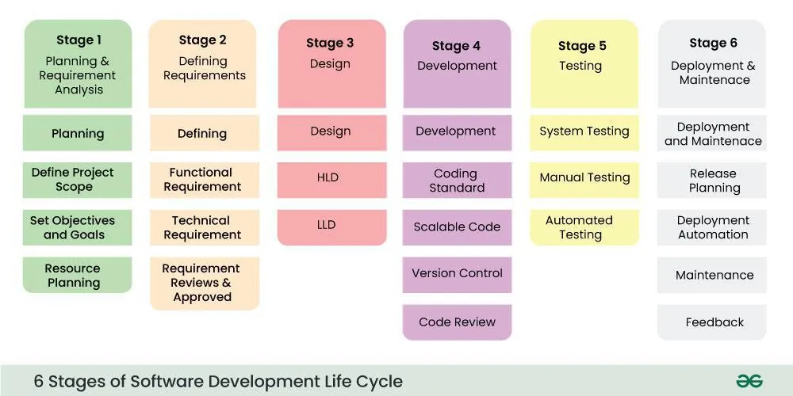
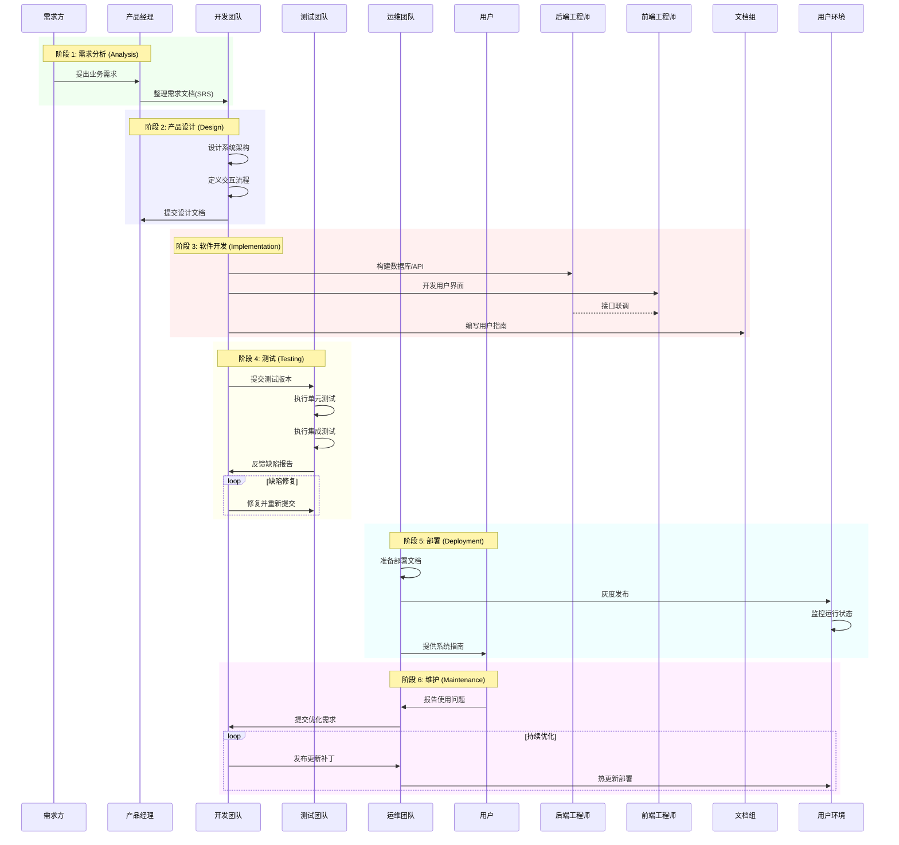
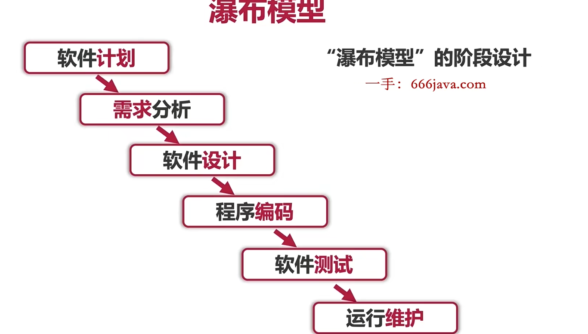
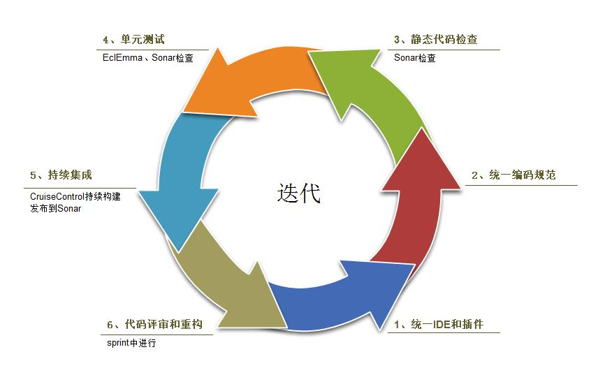
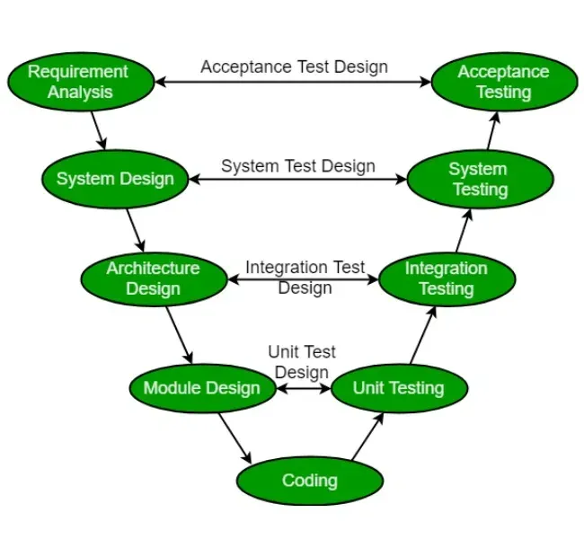
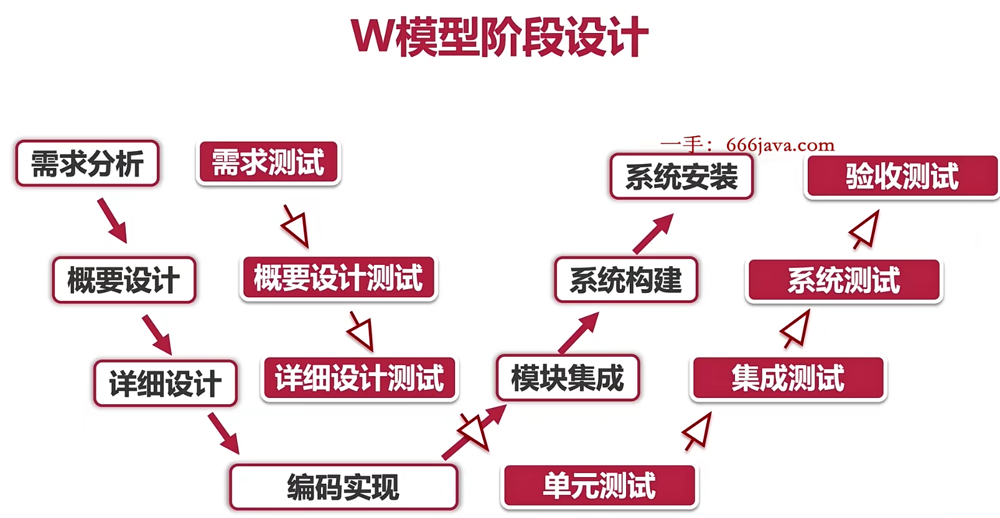

# 软件开发生命周期的介绍
软件开发生命周期（SDLC, software development life cycle)，包含软件从开始到发布的不同阶段，旨在提高待开发软件的质量和效率。常划分为以下六个阶段：需求分析 (Analysis)，设计 (Design)，开发 (Implementation)，测试 (Testing)，部署 (Deployment) 和 维护 (Maintenance)。

1. 需求分析(Analysis): 需求分析是软件开发过程中最重要的环节。该阶段所有利益相关方(如：产品经理、业务需求方、开发者等)就软件需求(解决哪些问题)及可行性(能否被解决)进行讨论，并将所搜集到信息记录软件需求文档中(SRS, Software Requirement Specification)。

2. 产品设计(Design): 根据上一阶段记录的软件需求文档，设计出能满足相关需求的体系架构。该阶段定义交互和数据透传流程。

3. 软件开发(Implementation): 该阶段，开发人员根据设计开发和实现软件。后端工程师负责构建数据库结构和其他必要组件。前端工程师负责用户界面设计，并负责与后端架构对接。该阶段，用户指南、源代码的注释等配套文档将有助于提升代码质量，及降低后期软件使用和维护成本。

4. 测试(Testing): 软件正式上线前，为避免软件存在问题和确保软件达到预期效果，相关人员将进行测试。该阶段既可以与开发同时进行，也可以在开发阶段结束时再开展。

5.部署(Deployment): 即软件正式上线阶段，安装指南、系统用户指南等相关部署文档将有效辅助软件部署。该阶段常采用灰度开放的方式逐步完成，避免软件存在问题带来生产事故。

6. 维护(Maintenance): 软件正式上线后，对报告的测试期间未能发现错误进行修复。同时，通过搜集使用者反馈，进一步优化软件设计，提升使用者体验。

以下是使用 Mermaid 时序图表示软件开发生命周期（SDLC）的示例：

## 软件开发的模型

### 瀑布模型

**瀑布模型核心要点：**  

**定义**：瀑布模型是一种线性、顺序的软件开发方法，由Winston W. Royce于1970年提出，适用于需求明确的大型复杂项目  

**阶段**：需求分析→设计（HLD/LLD）→开发→测试（集成/系统/验收）→维护（纠正/完善/适应）。  

以下是瀑布模型优缺点的表格说明：

| **类别**       | **说明**                                                                 |
|----------------|-------------------------------------------------------------------------|
| **优点**       |                                                                        |
| 结构清晰       | 线性流程明确，阶段划分清楚，易于项目管理                                |
| 文档完备       | 每个阶段产出规范文档（SRS/SDD），便于追溯和维护                         |
| 适合稳定需求   | 在需求明确、变更少的场景（如政府项目、安全关键系统）中表现优异           |
| **缺点**       |                                                                        |
| 缺乏灵活性     | 阶段严格顺序执行，后期需求变更代价高昂                                  |
| 风险滞后       | 缺陷通常在测试阶段才被发现，修复成本高                                  |
| 用户参与度低   | 用户仅在需求收集和验收阶段介入，无法中途反馈                            |

（表格形式更直观，适合快速对比核心特征）

**适用场景**：需求稳定、小规模、强监管（如医疗、军工）。  

**对比**：比敏捷更刚性，衍生模型（如V模型）增强灵活性。  

**一句话总结**：瀑布模型作为软件工程的基石，至今仍在特定领域（如安全关键系统）发挥重要作用。尽管其线性流程在敏捷开发兴起后略显僵化，但其结构化思维和文档驱动理念仍为复杂项目管理提供了重要参考。对于需求明确、风险可控的项目，瀑布模型依然是高效可靠的选择。

## 敏捷开发

1. **核心目标**  

   - 快速响应需求变更  
   - 通过迭代交付缩短开发周期

2. **对比传统模型（瀑布模型）**  

   | **维度**     | **瀑布模型**   | **敏捷模型**               |
   | ------------ | -------------- | -------------------------- |
   | 需求变更响应 | 后期变更成本高 | 支持持续动态调整           |
   | 交付节奏     | 单次完整交付   | 分阶段迭代交付（1-4周/次） |
   | 文档依赖     | 强文档驱动     | 轻文档，重协作与代码       |

---

### **二、敏捷开发流程（6步骤）**

1. **需求收集**  

   - 活动：客户访谈、需求可行性分析  
   - 输出：用户故事、需求优先级列表

2. **需求设计**  

   - 工具：UML图、线框图  
   - 实践：原型验证（如Figma制作交互原型）

3. **构建迭代**  

   - 周期：1-4周/Sprint  
   - 示例：电商平台优先实现购物车模块

4. **测试验证**  

   | **测试类型** | **工具示例** | **验证目标**       |
   | ------------ | ------------ | ------------------ |
   | 单元测试     | JUnit        | 模块功能正确性     |
   | 集成测试     | Postman      | 接口交互稳定性     |
   | 压力测试     | JMeter       | 系统高并发处理能力 |

5. **部署发布**  

   - 策略：灰度发布（如先开放10%用户）  
   - 工具：Jenkins自动化部署流水线

6. **反馈迭代**  

   - 数据驱动：用户行为分析（如埋点统计功能使用率）  
   - 闭环机制：缺陷跟踪系统（如Jira管理Bug修复）

## 迭代模型
### 迭代模型的核心要点：
**定义**：在实际的软件开发项目中，经典的瀑布模型难以应用。因此，迭代瀑布模型可以被认为是对经典瀑布模型进行必要的修改，使其能够应用于实际的软件开发项目。它与经典瀑布模型几乎相同，只是进行了一些修改以提高软件开发的效率。

**特点**：
1. **反馈机制**：
   - 每个阶段都有到前一阶段的反馈路径
   - 允许在开发过程中进行持续改进和调整
   - 不需要等到项目结束才能修正问题

2. **错误处理优势**：
   - 支持在错误发生的同一阶段进行检测
   - 显著减少了错误修正所需的时间和努力
   - 允许对发生错误的阶段进行重新处理

3. **灵活的可行性研究**：
   - 虽然可行性研究阶段的反馈相对较少
   - 但模型支持在新需求或技术变更时重新评估
   - 确保项目始终与业务目标保持一致

**与传统瀑布模型的区别**：
1. **反馈路径**：
   - 传统瀑布模型：单向流程，缺乏反馈机制
   - 迭代瀑布模型：双向流程，包含反馈路径

2. **错误处理**：
   - 传统瀑布模型：错误通常在后期才被发现
   - 迭代瀑布模型：支持及时发现和修正错误

3. **灵活性**：
   - 传统瀑布模型：变更成本高，难以适应需求变化
   - 迭代瀑布模型：支持动态调整，适应性更强

### 迭代模型在网站开发中的应用实例

以下是一个网站开发项目中应用迭代模型的具体案例，展示了如何通过迭代方式逐步完善网站功能：

1. **需求收集与分析阶段** <mcreference link="https://www.geeksforgeeks.org/requirements-gathering-introduction-processes-benefits-and-tools/" index="1">1</mcreference>
   - 企业主与开发团队会面讨论
   - 明确网站目标和具体需求
   - 记录需求文档和功能规格

2. **设计阶段**
   - 基于需求分析创建初步设计
   - 包括用户界面和功能流程设计
   - 与客户确认设计方案

3. **实施阶段**
   - 根据确认的设计开始开发
   - 逐步构建网站功能模块
   - 实现前后端功能

4. **测试阶段** <mcreference link="https://www.geeksforgeeks.org/software-testing-basics/" index="2">2</mcreference>
   - 全面测试网站功能
   - 确保满足既定需求
   - 验证网站运行稳定性

5. **部署阶段** <mcreference link="https://www.geeksforgeeks.org/software-deployment-in-software-development/" index="3">3</mcreference>
   - 将网站部署到生产环境
   - 正式向公众开放访问
   - 监控网站运行状态

6. **审查和改进阶段**
   - 收集用户使用反馈
   - 分析网站运行性能
   - 进行必要的优化和改进
7. **迭代循环**
   - 重复以上阶段，根据用户反馈进行迭代改进
   - 持续优化网站功能，提升用户体验
通过迭代模型，网站开发项目能够在需求分析、设计、开发、测试、部署等阶段逐步完善网站功能，同时也能够根据用户反馈进行持续改进和优化，最终打造出符合用户需求的高质量网站。
## 迭代瀑布模型的优缺点

以下是迭代瀑布模型的优点和缺点的详细对比：

| 类别 | 特点 | 说明 |
|------|------|------|
| **优点** | 错误阶段遏制 | 尽可能靠近错误源头检测并修复错误，减少昂贵的返工和延误 |
| | 协作强劲 | 企业主和开发人员之间的持续协作确保产品满足业务需求并在每次迭代中通过反馈得到改进 |
| | 灵活性高 | 允许在后续迭代中轻松纳入新的需求或功能，确保产品随着业务而发展 |
| | 测试和反馈及时 | 定期的测试和反馈周期有助于及早发现和解决问题，提高产品的质量和相关性 |
| | 更快的上市时间 | 增量开发允许更快地交付产品的各个部分，从而能够在进一步改进的同时获得用户反馈 |
| | 风险降低 | 持续的反馈和测试有助于及早发现风险，降低代价高昂的错误和延误的可能性 |
| **缺点** | 变更请求难整合 | 所有需求必须在开发阶段开始前明确陈述，难以整合开发阶段开始后提出的变更请求 |
| | 不支持增量交付 | 软件需要完全开发和测试后才能交付给客户，不存在中间交付，等待时间较长 |
| | 不支持阶段重叠 | 假设阶段必须按顺序完成，而实际项目中阶段可能需要重叠以提高效率 |
| | 缺乏风险处理机制 | 模型本身没有内置的风险处理机制，对项目风险的应对能力有限 |
| | 客户互动有限 | 主要在项目启动（需求收集）和完成（软件交付）时与客户互动，可能导致最终产品与实际需求存在差异 |

## V模型

### V模型的核心要点

**定义**：V模型是软件开发生命周期的一种变体，它将开发过程和测试过程并行展示，形成V字型结构。该模型强调了每个开发阶段都对应着一个测试阶段，体现了"早期测试设计"的理念。

**模型结构**：
1. **左侧（开发阶段）**：
   - 需求分析
   - 系统设计
   - 架构设计
   - 模块设计
   - 编码实现

2. **右侧（测试阶段）**：
   - 验收测试
   - 系统测试
   - 集成测试
   - 单元测试

**特点**：
1. **对应性**：
   - 需求分析 ←→ 验收测试设计
   - 系统设计 ←→ 系统测试设计
   - 架构设计 ←→ 集成测试设计
   - 模块设计 ←→ 单元测试设计

2. **测试前移**：
   - 在每个开发阶段同步设计对应的测试方案
   - 有助于及早发现设计缺陷
   - 降低后期修改成本

3. **验证与确认**：
   - 左侧为验证活动（Verification）：确保正确实现功能
   - 右侧为确认活动（Validation）：确保满足用户需求

V模型通过将测试活动与开发活动并行展示，强调了软件质量保证在整个开发生命周期中的重要性。它不仅继承了瀑布模型的系统性和可控性，还通过"测试前移"的理念增强了质量保证能力。

### V模型的验证阶段

V模型的验证阶段涉及动态分析技术（包括功能性和非功能性测试），通过执行代码来进行测试。验证的目的是在开发阶段完成后评估软件，确定是否满足客户的期望和要求。以下是主要的验证阶段：

#### 1. 单元测试（Unit Testing）

单元测试计划在模块设计阶段制定，主要目标是消除代码或单元级别的错误 <mcreference link="https://www.geeksforgeeks.org/unit-testing-software-testing/" index="1">1</mcreference>：
- 测试最小的代码单元（通常是函数或方法）
- 确保各个组件按预期工作
- 有助于在开发周期早期发现bug
- 提高代码质量，降低后期修复成本

#### 2. 集成测试（Integration Testing）

在单元测试完成后进行，主要验证模块之间的交互 <mcreference link="https://www.geeksforgeeks.org/software-engineering-integration-testing/" index="2">2</mcreference>：
- 在架构设计阶段执行
- 验证模块间的通信机制
- 检测集成单元之间的接口问题
- 确保组件协同工作的正确性

#### 3. 系统测试（System Testing）

对整个应用程序进行全面测试 <mcreference link="https://www.geeksforgeeks.org/system-testing/" index="3">3</mcreference>：
- 测试完整的功能性需求
- 验证系统间的相互依赖关系
- 检查系统通信机制
- 评估非功能性需求（如性能、安全性）

#### 4. 用户验收测试（User Acceptance Testing, UAT）

在类似生产环境的用户环境中进行测试 <mcreference link="https://www.geeksforgeeks.org/user-acceptance-testing-uat/" index="4">4</mcreference>：
- 验证系统是否满足用户需求
- 确认系统是否已准备好投入实际使用
- 在真实场景中验证功能
- 收集最终用户反馈

这些验证阶段的特点：
1. 动态分析：通过实际执行代码进行测试
2. 渐进性：从小单元到完整系统逐步验证
3. 全面性：覆盖功能性和非功能性需求
4. 实用性：确保系统满足实际使用需求

#### 4. 系统设计阶段（高级设计 HLD）

此阶段关注系统的技术实现方案：
- 理解和设计架构规范
- 评估多个技术方案的可行性
- 考虑技术和财务因素做出选择
- 将系统分解为功能独立的模块
- 定义模块间的数据交换和通信机制
- 基于架构信息设计集成测试

#### 5. 模块设计阶段（低级设计 LLD）

专注于系统各个模块的具体实现：
- 详细说明每个模块的内部设计
- 确保与外部系统和其他模块的兼容性
- 设计单元测试用例
- 注重早期错误识别和缺陷消除

#### 6. 编码阶段

实际构建软件的阶段：
- 基于设计文档编写代码
- 根据系统要求选择合适的编程语言
- 遵循编码标准和原则
- 进行多轮代码审查
- 优化代码以提升性能
- 最终代码提交到代码库前的质量把控

这些验证阶段的特点是：
1. 每个阶段都有明确的输入和输出
2. 强调早期发现和预防缺陷
3. 重视文档化和规范化
4. 注重质量保证和风险控制

### V模型的优缺点

以下是V模型在软件开发中的主要优势和局限性：

| 类别 | 特点 | 说明 |
|------|------|------|
| **优点** | 高度规范 | 各个阶段逐个完成，流程清晰且易于管理 |
| | 适合小型项目 | 特别适用于需求明确的小规模项目 |
| | 简单易用 | 模型结构简单，易于理解和实施 |
| | 早期质量保证 | 在生命周期早期就注重验证和确认活动，提高产品质量 |
| | 进度可控 | 项目管理能够准确跟踪和控制开发进度 |
| | 结构化流程 | 提供清晰且结构化的开发过程，便于遵循 |
| | 重视测试 | 强调测试活动，确保软件质量和可靠性 |
| | 可追溯性强 | 在需求和最终产品之间建立清晰联系，便于变更管理 |
| | 沟通顺畅 | 清晰的结构有助于改善客户和开发团队间的沟通 |
| **缺点** | 缺乏灵活性 | 线性顺序模型难以适应需求变化和意外情况 |
| | 耗时较长 | 需要大量文档和测试工作，开发周期较长 |
| | 风险较高 | 存在较高的风险和不确定性 |
| | 不适合复杂项目 | 不适用于复杂的面向对象项目 |
| | 需求稳定性要求高 | 不适合需求不明确或变更风险高的项目 |
| | 不支持迭代 | 模型不支持阶段的迭代开发 |
| | 并发处理能力弱 | 难以有效处理并发事件 |
| | 文档依赖过重 | 过度重视文档可能影响实际开发工作效率 |

这些验证阶段的特点是：
1. 每个阶段都有明确的输入和输出
2. 强调早期发现和预防缺陷
3. 重视文档化和规范化
4. 注重质量保证和风险控制

# W模型

W模型是V模型的扩展版本，它在V模型的基础上增加了更多的测试活动，形成了W形状的结构。这个模型强调测试活动应该贯穿整个软件开发生命周期，而不是仅在开发完成后进行。

### W模型的核心特点

1. **双V结构**：
   - 左侧V：开发活动和单元级测试
   - 右侧V：系统集成和验收测试
   - 两个V模型相互交织，形成W形状

2. **测试并行**：
   - 每个开发阶段都有对应的测试活动
   - 测试活动与开发活动并行进行
   - 实现了真正的"测试左移"

3. **测试分层**：
   - 组件测试：验证单个模块功能
   - 集成测试：验证模块间交互
   - 系统测试：验证整体功能
   - 验收测试：确认满足用户需求

### W模型的优势

1. **早期缺陷发现**：
   - 在开发初期就开始测试活动
   - 降低缺陷修复成本
   - 提高软件质量

2. **持续验证**：
   - 测试贯穿整个开发过程
   - 确保每个阶段的交付质量
   - 减少后期返工

3. **风险管理**：
   - 及早识别潜在问题
   - 快速响应和调整
   - 降低项目风险

### W模型的应用场景

- 质量要求高的项目
- 安全关键型系统
- 复杂的企业级应用
- 需要持续质量保证的长期项目

### 与V模型的主要区别

| 特征 | V模型 | W模型 |
|------|-------|-------|
| 测试时机 | 开发完成后 | 开发过程中 |
| 测试范围 | 基本测试活动 | 全面测试覆盖 |
| 缺陷发现 | 相对滞后 | 更早发现 |
| 成本控制 | 修复成本较高 | 降低修复成本 |
| 质量保证 | 后期验证 | 全程保证 |